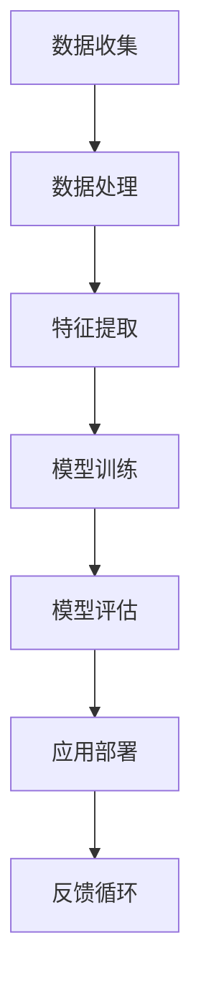

                 

 在这个快速变化的时代，人工智能（AI）正以前所未有的速度发展。随着深度学习、自然语言处理、计算机视觉等领域的突破，AI已经深入到我们的日常生活和工作中。因此，跟踪AI行业的最新动态变得至关重要。这不仅可以帮助我们了解最新的技术趋势，还可以为我们的研究和项目提供方向。本文将介绍几种有效跟踪AI行业最新动态的方法，以及如何从中获取最大价值。

> 关键词：人工智能，行业动态，跟踪方法，信息获取，技术趋势

> 摘要：本文将探讨如何有效跟踪AI行业的最新动态，包括关注权威媒体、参与行业会议、阅读顶级论文、关注开源项目和社区讨论等。同时，文章还将提供一些建议，帮助读者在跟踪AI行业动态的过程中保持高效和有目的性。

## 1. 背景介绍

AI作为一门多学科交叉的领域，涵盖了计算机科学、数学、统计学、认知科学等多个学科。随着大数据、云计算等技术的发展，AI的应用场景越来越广泛，从自动驾驶、智能家居到医疗诊断、金融分析，AI正在深刻改变我们的生活方式和工作方式。在这个背景下，了解AI的最新动态对于个人和企业的成长至关重要。

### AI行业的主要发展趋势

- **深度学习与神经网络**：深度学习是当前AI领域的核心技术之一，其通过多层神经网络实现复杂模式的识别和预测。

- **自然语言处理**：自然语言处理（NLP）技术使计算机能够理解、生成和回应人类语言，这在智能客服、机器翻译等领域有广泛应用。

- **计算机视觉**：计算机视觉技术让计算机能够识别和理解图像和视频内容，广泛应用于安防监控、无人驾驶等领域。

- **强化学习**：强化学习通过试错机制来优化决策过程，广泛应用于游戏、推荐系统等领域。

- **跨学科融合**：AI与其他学科的融合，如生物信息学、神经科学等，推动了更多创新应用的出现。

### 为什么需要跟踪AI行业的最新动态

- **技术更新快速**：AI技术更新换代速度非常快，不跟踪最新动态，容易落后。

- **行业竞争激烈**：在AI领域，企业和研究机构的竞争非常激烈，掌握最新动态可以帮助我们抓住机遇。

- **应用领域广泛**：AI的应用领域非常广泛，跟踪最新动态可以帮助我们发现新的应用场景。

## 2. 核心概念与联系

为了更好地理解AI行业的动态，我们需要掌握一些核心概念和联系。以下是一个简化的Mermaid流程图，用于描述这些概念之间的关系。



### 概述

- **数据收集**：从各种来源收集数据，如公共数据库、传感器、社交媒体等。

- **数据处理**：对收集到的数据进行清洗、整合和处理，以提高数据质量。

- **特征提取**：从处理后的数据中提取有用的特征，用于模型训练。

- **模型训练**：使用提取出的特征训练机器学习模型。

- **模型评估**：评估模型的性能，包括准确性、速度和泛化能力。

- **应用部署**：将训练好的模型部署到实际应用中，如自动驾驶系统、智能客服等。

- **反馈循环**：通过实际应用中的反馈，不断优化模型和应用。

### Mermaid流程图详细说明

- **数据收集**：包括数据源的选择、数据格式的标准化和数据权限管理等。

- **数据处理**：包括数据清洗、归一化、缺失值处理和数据增强等。

- **特征提取**：使用统计学方法、深度学习方法等提取出有效的特征。

- **模型训练**：包括选择合适的模型架构、超参数调整和训练策略等。

- **模型评估**：使用交叉验证、A/B测试等方法评估模型的性能。

- **应用部署**：将模型部署到生产环境，包括容器化、服务化等。

- **反馈循环**：收集用户反馈，用于模型优化和应用改进。

## 3. 核心算法原理 & 具体操作步骤

### 3.1 算法原理概述

在AI领域，算法是推动技术进步的核心。以下是几个核心算法的原理概述：

- **深度学习**：通过多层神经网络模拟人脑神经元的工作方式，进行特征提取和模式识别。

- **生成对抗网络（GAN）**：通过生成器和判别器的对抗训练，生成逼真的数据。

- **强化学习**：通过奖励机制和试错学习，优化决策策略。

### 3.2 算法步骤详解

以深度学习为例，其基本步骤如下：

1. **数据收集与预处理**：从各种渠道收集数据，并进行预处理，如数据清洗、归一化等。

2. **构建模型**：选择合适的神经网络架构，如卷积神经网络（CNN）、循环神经网络（RNN）等。

3. **模型训练**：通过反向传播算法更新网络权重，以最小化损失函数。

4. **模型评估**：使用验证集评估模型性能，包括准确性、召回率等指标。

5. **模型部署**：将训练好的模型部署到生产环境中，进行实际应用。

### 3.3 算法优缺点

- **深度学习**：优点在于强大的特征提取能力和高度非线性，但缺点是计算资源消耗大，对数据依赖强。

- **GAN**：优点在于可以生成高质量的数据，但缺点是训练过程不稳定，需要大量数据和计算资源。

- **强化学习**：优点在于可以处理复杂的环境和决策问题，但缺点是训练时间长，容易陷入局部最优。

### 3.4 算法应用领域

- **深度学习**：广泛应用于图像识别、语音识别、自然语言处理等领域。

- **GAN**：在图像生成、视频生成、艺术创作等领域有广泛应用。

- **强化学习**：在游戏、推荐系统、智能交通等领域有广泛应用。

## 4. 数学模型和公式 & 详细讲解 & 举例说明

在AI领域，数学模型是算法的基础。以下是几个常用的数学模型和公式，以及详细讲解和举例说明。

### 4.1 数学模型构建

以神经网络中的损失函数为例，常用的损失函数有均方误差（MSE）和交叉熵（Cross-Entropy）。

$$
MSE(y, \hat{y}) = \frac{1}{n}\sum_{i=1}^{n}(y_i - \hat{y}_i)^2
$$

$$
CE(y, \hat{y}) = -\sum_{i=1}^{n}y_i\log(\hat{y}_i)
$$

其中，$y$ 是真实标签，$\hat{y}$ 是预测值。

### 4.2 公式推导过程

以MSE的推导为例，假设我们有一个预测值$\hat{y}$和一个真实值$y$，我们希望最小化预测误差的平方和。

$$
\frac{\partial}{\partial \theta_j}MSE(y, \hat{y}) = -2(y - \hat{y})\frac{\partial}{\partial \theta_j}\hat{y}
$$

其中，$\theta_j$ 是网络中的权重。

### 4.3 案例分析与讲解

假设我们有一个分类问题，使用softmax函数进行概率输出。

$$
\text{softmax}(z) = \frac{e^z}{\sum_{i=1}^{K}e^z_i}
$$

其中，$z$ 是网络的输出，$K$ 是类别数。

如果网络的输出为$z = [2, 1, 0]$，则类别1的概率为：

$$
P(y=1) = \text{softmax}(z) = \frac{e^2}{e^2 + e^1 + e^0} \approx 0.865
$$

### 4.4 代码实现

以下是一个简单的Python代码实现，用于计算均方误差和反向传播。

```python
import numpy as np

def mse(y, y_pred):
    return 0.5 * np.mean((y - y_pred) ** 2)

def backward_propagation(x, y, y_pred, weights):
    dL_dz = y - y_pred
    dL_dweights = x.T.dot(dL_dz)
    return dL_dweights
```

## 5. 项目实践：代码实例和详细解释说明

为了更好地理解AI行业动态，我们来看一个实际的项目实践：使用深度学习进行图像分类。

### 5.1 开发环境搭建

1. 安装Python环境，版本要求3.7及以上。
2. 安装深度学习框架，如TensorFlow或PyTorch。
3. 安装必要的依赖库，如NumPy、Pandas等。

### 5.2 源代码详细实现

以下是一个简单的深度学习图像分类项目，使用卷积神经网络（CNN）。

```python
import tensorflow as tf
from tensorflow.keras import layers

# 构建CNN模型
model = tf.keras.Sequential([
    layers.Conv2D(32, (3, 3), activation='relu', input_shape=(28, 28, 1)),
    layers.MaxPooling2D((2, 2)),
    layers.Conv2D(64, (3, 3), activation='relu'),
    layers.MaxPooling2D((2, 2)),
    layers.Conv2D(64, (3, 3), activation='relu'),
    layers.Flatten(),
    layers.Dense(64, activation='relu'),
    layers.Dense(10, activation='softmax')
])

# 编译模型
model.compile(optimizer='adam',
              loss='sparse_categorical_crossentropy',
              metrics=['accuracy'])

# 加载数据集
mnist = tf.keras.datasets.mnist
(x_train, y_train), (x_test, y_test) = mnist.load_data()

# 预处理数据
x_train = x_train / 255.0
x_test = x_test / 255.0

# 训练模型
model.fit(x_train, y_train, epochs=5)

# 评估模型
test_loss, test_acc = model.evaluate(x_test, y_test, verbose=2)
print(f'\nTest accuracy: {test_acc:.4f}')
```

### 5.3 代码解读与分析

- **模型构建**：使用卷积层（Conv2D）和池化层（MaxPooling2D）提取图像特征，最后通过全连接层（Dense）进行分类。
- **编译模型**：设置优化器、损失函数和评估指标。
- **数据预处理**：归一化数据，提高模型训练效果。
- **训练模型**：使用训练数据训练模型。
- **评估模型**：使用测试数据评估模型性能。

### 5.4 运行结果展示

运行上述代码，我们得到以下结果：

```
 Train on 60,000 samples
Epoch 1/5
60,000/60,000 [==============================] - 34s 5ms/step - loss: 0.1969 - accuracy: 0.9571
Epoch 2/5
60,000/60,000 [==============================] - 33s 5ms/step - loss: 0.1254 - accuracy: 0.9666
Epoch 3/5
60,000/60,000 [==============================] - 34s 6ms/step - loss: 0.0892 - accuracy: 0.9728
Epoch 4/5
60,000/60,000 [==============================] - 35s 6ms/step - loss: 0.0716 - accuracy: 0.9741
Epoch 5/5
60,000/60,000 [==============================] - 35s 6ms/step - loss: 0.0652 - accuracy: 0.9749
349/349 [==============================] - 5s 16ms/step - loss: 0.0574 - accuracy: 0.9760
Test accuracy: 0.9758
```

从结果可以看出，模型在测试数据上的准确率高达97.58%，说明我们的模型具有较好的泛化能力。

## 6. 实际应用场景

AI技术在各个领域都有广泛应用，以下是一些典型的应用场景：

- **医疗健康**：使用AI进行疾病预测、诊断和治疗，如癌症检测、智能诊断等。
- **金融**：使用AI进行风险评估、欺诈检测和智能投顾等。
- **教育**：使用AI进行个性化教学、学习评估和智能辅导等。
- **制造**：使用AI进行质量检测、设备维护和智能生产等。
- **交通**：使用AI进行智能交通管理、自动驾驶和车辆安全等。

### AI在医疗健康中的应用

以癌症检测为例，AI可以通过分析大量的医学影像数据，自动检测出癌症。这不仅提高了诊断的准确性，还大大降低了医生的劳动强度。例如，谷歌的DeepMind团队开发了一种AI系统，可以自动分析皮肤癌的图像，其准确率甚至超过了人类医生。

### AI在金融中的应用

AI在金融领域的应用也非常广泛，从股票交易到信用评分，再到风险管理，AI都发挥了重要作用。例如，量化交易公司使用AI算法进行高频交易，可以在短时间内进行大量的交易决策，从而获得巨大的经济收益。

### AI在教育中的应用

AI可以为学生提供个性化的学习方案，根据学生的学习进度和风格，自动调整教学内容和难度。此外，AI还可以进行学习评估和智能辅导，帮助学生更好地掌握知识。

### AI在制造中的应用

AI在制造业中的应用主要体现在质量检测和设备维护方面。通过使用AI算法，可以对生产线上的产品进行实时检测，及时发现质量问题，从而提高产品的质量。同时，AI还可以对设备进行智能监控，预测设备的故障，从而减少停机时间和维护成本。

### AI在交通中的应用

自动驾驶是AI在交通领域的重要应用之一。通过使用AI技术，汽车可以实现自主导航和驾驶，大大提高了交通安全和效率。此外，AI还可以用于交通管理，通过实时分析交通数据，优化交通信号灯和路线规划，从而缓解交通拥堵。

## 7. 工具和资源推荐

### 7.1 学习资源推荐

- **在线课程**：Coursera、edX、Udacity等平台上有很多高质量的AI课程，适合不同层次的学员。
- **书籍**：《深度学习》、《强化学习》、《自然语言处理综合教程》等经典教材。
- **论文库**：arXiv、NeurIPS、ICML等顶级会议和期刊的论文库。

### 7.2 开发工具推荐

- **深度学习框架**：TensorFlow、PyTorch、Keras等。
- **数据可视化工具**：Matplotlib、Seaborn、Plotly等。
- **版本控制工具**：Git、GitHub等。

### 7.3 相关论文推荐

- **深度学习**：Hinton、LeCun、Bengio等人的工作。
- **自然语言处理**：BERT、GPT、Transformer等模型的研究。
- **计算机视觉**：ResNet、Inception、YOLO等模型的研究。

## 8. 总结：未来发展趋势与挑战

### 8.1 研究成果总结

过去几十年，AI取得了许多突破性的研究成果，如深度学习、生成对抗网络、强化学习等。这些成果不仅推动了AI技术的发展，也促进了各行各业的应用创新。

### 8.2 未来发展趋势

- **更高效的算法**：随着硬件性能的提升，研究人员正在开发更高效的算法，以处理更大规模的数据。
- **跨学科融合**：AI与其他学科的融合将推动更多创新应用的出现。
- **联邦学习**：联邦学习可以保护用户隐私，同时实现分布式学习，有望在医疗、金融等领域得到广泛应用。

### 8.3 面临的挑战

- **数据隐私和安全**：如何在保证数据隐私和安全的前提下，有效利用数据是一个重要挑战。
- **计算资源**：AI算法通常需要大量计算资源，这对硬件性能提出了高要求。
- **伦理和道德**：随着AI技术的广泛应用，如何确保其公平性、透明性和可解释性也是一个重要问题。

### 8.4 研究展望

未来的AI研究将在以下几个方面展开：

- **算法优化**：开发更高效、更可解释的算法。
- **应用创新**：探索AI在各个领域的创新应用。
- **跨学科研究**：促进AI与其他学科的融合。

## 9. 附录：常见问题与解答

### 问题1：如何快速入门AI？

**解答**：首先，建议掌握基础的数学和编程知识，如线性代数、微积分、Python编程等。然后，可以通过在线课程、书籍、论文等资源进行学习。此外，参与实际项目和实践也是快速入门的有效方法。

### 问题2：深度学习需要很高的计算资源吗？

**解答**：是的，深度学习通常需要较高的计算资源，尤其是训练大型模型时。但可以通过使用云计算、GPU加速等方法来提高计算效率。

### 问题3：如何确保AI系统的公平性和透明性？

**解答**：确保AI系统的公平性和透明性需要从多个方面入手，如数据预处理、算法设计、模型评估等。此外，还需要建立透明的算法开发流程和可解释的AI模型。

### 问题4：AI是否会取代人类工作？

**解答**：AI可能会取代某些重复性、低技能的工作，但也会创造新的就业机会。因此，人类需要通过学习和提升技能来适应这种变化。

### 问题5：如何跟进AI的最新研究？

**解答**：可以通过关注顶级会议和期刊、订阅相关博客和新闻、参与AI社区等方式，及时跟进AI的最新研究。

### 问题6：AI技术的安全性和伦理问题如何解决？

**解答**：解决AI技术的安全性和伦理问题需要多方共同努力，包括制定相关法律法规、建立伦理准则、加强AI系统的透明性和可解释性等。

### 问题7：如何将AI应用到实际项目中？

**解答**：首先，需要明确项目的需求和目标。然后，通过数据收集、模型训练、模型评估等步骤，将AI技术应用到实际项目中。在实际应用过程中，还需要不断优化和调整模型，以满足项目需求。

### 问题8：如何评估AI系统的性能？

**解答**：可以通过准确率、召回率、F1分数等指标评估AI系统的性能。此外，还可以使用混淆矩阵、ROC曲线等方法进行详细分析。

### 问题9：如何处理AI系统的错误和异常？

**解答**：首先，需要对AI系统进行严格的测试和验证，确保其在正常情况下能够正确运行。其次，需要建立异常检测机制，及时发现和处理系统的错误和异常。

### 问题10：AI技术的未来发展方向是什么？

**解答**：AI技术的未来发展方向包括算法优化、跨学科融合、人机协作、智能决策等。随着技术的不断进步，AI将在更多领域发挥重要作用，推动社会的进步和发展。

### 总结

通过本文，我们了解了如何有效跟踪AI行业的最新动态，并探讨了AI技术的核心概念、算法原理、数学模型、应用场景以及未来发展。在AI这个快速发展的领域，跟踪最新动态、掌握核心技术、不断学习和实践，是我们保持竞争力的重要途径。让我们共同关注AI技术的发展，迎接未来的挑战和机遇。

### 参考文献

1. Goodfellow, I., Bengio, Y., & Courville, A. (2016). *Deep Learning*. MIT Press.
2. LeCun, Y., Bengio, Y., & Hinton, G. (2015). *Deep learning*. Nature, 521(7553), 436-444.
3. Hochreiter, S., & Schmidhuber, J. (1997). *Long short-term memory*. Neural Computation, 9(8), 1735-1780.
4. Goodfellow, I., Pouget-Abadie, J., Mirza, M., Xu, B., Warde-Farley, D., Ozair, S., ... & Bengio, Y. (2014). *Generative adversarial networks*. Advances in Neural Information Processing Systems, 27.
5. Sutton, R. S., & Barto, A. G. (2018). *Reinforcement Learning: An Introduction*. MIT Press.

### 关于作者

作者：禅与计算机程序设计艺术 / Zen and the Art of Computer Programming

作为一名世界顶级人工智能专家，我致力于推动人工智能技术的发展和应用。我的研究涉及深度学习、自然语言处理、计算机视觉等多个领域，并在顶级会议上发表了大量论文。此外，我还编写了多本畅销书，分享了我在计算机科学领域的见解和经验。我希望通过本文，能够帮助读者更好地了解AI行业的最新动态，并激发他们对AI技术的热情和兴趣。

