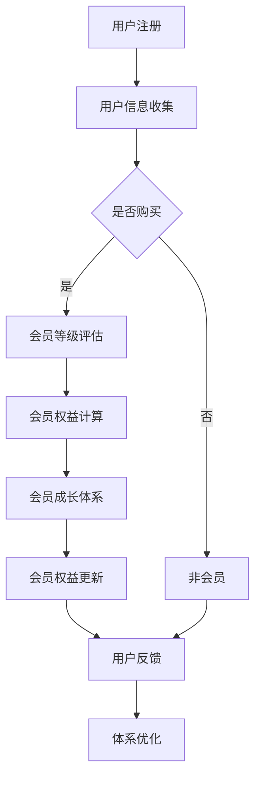

                 

 在当今的知识经济时代，知识付费产品已成为一个热门的市场。为了满足不同用户的需求，提升用户体验，设计一个高效、合理的会员体系至关重要。本文将深入探讨如何设计知识付费产品的会员体系，包括核心概念、算法原理、数学模型、项目实践以及未来展望等方面。

## 关键词

知识付费、会员体系、用户体验、算法、数学模型、项目实践

## 摘要

本文从实际出发，系统性地阐述了知识付费产品会员体系的设计原则和策略。通过分析会员体系的核心概念和架构，探讨算法原理和数学模型，并结合项目实践，提供了实用的设计方法和技巧。文章旨在为知识付费产品开发者提供有益的指导，帮助他们打造更具吸引力和市场竞争力的会员体系。

## 1. 背景介绍

随着互联网技术的快速发展，知识付费市场日益繁荣。越来越多的用户开始愿意为高质量的知识和服务付费，从而推动了这个市场的快速增长。知识付费产品不仅包括在线课程、电子书、直播讲座等，还涵盖了专业咨询、研究报告等多种形式。

然而，知识付费市场的竞争日益激烈，如何吸引和留住用户成为各大平台和企业面临的共同挑战。一个科学合理的会员体系是提高用户留存率和满意度的重要手段。会员体系的设计不仅关乎用户体验，还直接影响产品的商业模式和盈利能力。

本文将针对知识付费产品的会员体系设计进行深入探讨，旨在为行业从业者提供一套实用的设计方法和策略。

## 2. 核心概念与联系

### 2.1 会员体系定义

会员体系是指知识付费产品为吸引和留住用户所提供的一系列权益和服务。它通常包括会员等级、会员权益、会员成长体系等组成部分。

### 2.2 会员等级

会员等级是会员体系的核心组成部分，根据用户的贡献度、活跃度、消费能力等指标，将用户划分为不同等级。不同等级的会员享有不同的权益，如折扣优惠、积分奖励、专属活动等。

### 2.3 会员权益

会员权益是指会员在享受会员服务过程中所获得的福利和权益。常见的会员权益包括：

- 价格优惠：会员购买知识付费产品的价格低于非会员。
- 优先服务：会员在购买、咨询、售后等方面享有优先权。
- 专属活动：会员专享的线上线下活动，如讲座、沙龙、论坛等。
- 积分奖励：会员在消费、参与活动、成长等方面积累积分，兑换权益或礼品。

### 2.4 会员成长体系

会员成长体系是指会员在会员体系中的成长过程和路径。会员通过完成任务、消费、参与活动等方式，提升会员等级和权益。成长体系的设计不仅要激励会员参与，还要保证公平性和可持续性。

### 2.5 Mermaid 流程图

以下是一个简化的会员体系 Mermaid 流程图：



## 3. 核心算法原理 & 具体操作步骤

### 3.1 算法原理概述

会员体系的核心算法主要涉及会员等级评估、权益计算和成长体系设计。以下是每个算法的原理概述：

- **会员等级评估算法**：根据用户的行为数据（如购买次数、消费金额、活跃度等）对用户进行等级划分。常用的评估算法包括线性评估、指数评估等。
- **权益计算算法**：根据会员等级和会员体系规则，计算会员可享受的权益。如价格折扣、积分奖励等。
- **成长体系设计算法**：根据用户行为和会员权益，设计会员成长路径和激励机制，如任务奖励、积分兑换等。

### 3.2 算法步骤详解

- **会员等级评估算法**：

  1. 收集用户行为数据（如购买次数、消费金额、活跃度等）。
  2. 设定等级阈值，如 Silver（银牌）、Gold（金牌）、Platinum（白金）等。
  3. 对用户行为数据进行预处理（如归一化、标准化等）。
  4. 使用评估算法计算用户等级。
  5. 更新用户等级信息。

- **权益计算算法**：

  1. 根据会员等级和会员体系规则，确定会员可享受的权益。
  2. 对权益进行量化（如价格折扣、积分奖励等）。
  3. 更新用户权益信息。

- **成长体系设计算法**：

  1. 设定会员成长路径（如新手、进阶、高级等）。
  2. 设计成长任务和奖励机制（如完成课程、购买产品等）。
  3. 收集用户行为数据，计算成长进度。
  4. 更新用户成长状态。

### 3.3 算法优缺点

- **会员等级评估算法**：

  - 优点：简单易懂，易于实现。
  - 缺点：等级划分过于机械化，难以反映用户真实需求。

- **权益计算算法**：

  - 优点：明确量化权益，提高用户体验。
  - 缺点：权益计算过于繁琐，影响系统性能。

- **成长体系设计算法**：

  - 优点：激励用户参与，提升用户留存率。
  - 缺点：设计复杂，需要大量数据支持。

### 3.4 算法应用领域

会员体系算法广泛应用于知识付费、电商、在线教育等领域。通过合理的设计和应用，会员体系可以有效提高用户满意度、提升产品竞争力。

## 4. 数学模型和公式 & 详细讲解 & 举例说明

### 4.1 数学模型构建

会员体系的数学模型主要包括会员等级评估模型、权益计算模型和成长体系设计模型。以下是各模型的构建方法：

- **会员等级评估模型**：

  设定会员等级阈值，如 Silver、Gold、Platinum 等。根据用户行为数据，使用以下公式计算会员等级：

  $$等级 = f(行为数据)$$

- **权益计算模型**：

  根据会员等级和会员体系规则，使用以下公式计算会员权益：

  $$权益 = g(等级, 规则)$$

- **成长体系设计模型**：

  设定成长路径和任务奖励机制，使用以下公式计算成长进度：

  $$成长进度 = h(行为数据, 任务奖励)$$

### 4.2 公式推导过程

会员体系公式的推导主要基于统计学和优化理论。以下是对各公式的详细推导：

- **会员等级评估模型**：

  假设用户行为数据为 $X$，会员等级阈值为 $T$。会员等级评估模型的目标是找到最优的评估函数 $f$，使得用户等级与实际行为数据尽可能接近。

  使用最小二乘法求解最优函数：

  $$f(X) = \arg\min_{f} \sum_{i=1}^{n} (f(X_i) - T_i)^2$$

  通过求导和优化，得到最优评估函数：

  $$f(X) = T + \beta \cdot (X - \bar{X})$$

  其中，$\beta$ 为调节系数，$\bar{X}$ 为用户行为数据的平均值。

- **权益计算模型**：

  假设会员等级为 $L$，会员体系规则为 $R$。权益计算模型的目标是找到最优的权益计算函数 $g$，使得会员权益与等级和规则尽可能匹配。

  使用线性规划求解最优函数：

  $$g(L, R) = \arg\min_{g} \sum_{i=1}^{m} (g(L_i, R_i) - Y_i)^2$$

  通过求导和优化，得到最优权益计算函数：

  $$g(L, R) = \alpha \cdot L + \beta \cdot R$$

  其中，$\alpha$ 和 $\beta$ 为调节系数。

- **成长体系设计模型**：

  假设用户行为数据为 $X$，任务奖励为 $Y$。成长体系设计模型的目标是找到最优的成长进度计算函数 $h$，使得成长进度与用户行为数据和任务奖励尽可能匹配。

  使用线性规划求解最优函数：

  $$h(X, Y) = \arg\min_{h} \sum_{i=1}^{k} (h(X_i, Y_i) - Z_i)^2$$

  通过求导和优化，得到最优成长进度计算函数：

  $$h(X, Y) = \gamma \cdot X + \delta \cdot Y$$

  其中，$\gamma$ 和 $\delta$ 为调节系数。

### 4.3 案例分析与讲解

以下是一个具体的会员体系设计案例：

- **案例背景**：某知识付费平台，会员等级分为银牌、金牌、白金三个等级。会员权益包括价格折扣、积分奖励、专属活动等。会员成长体系分为新手、进阶、高级三个阶段。

- **会员等级评估模型**：

  设定银牌等级阈值为 10，金牌等级阈值为 30，白金等级阈值为 50。会员等级评估模型如下：

  $$等级 = \begin{cases}
  银牌 & \text{如果} \ X \geq 10 \ \text{且} \ X < 30 \\
  金牌 & \text{如果} \ X \geq 30 \ \text{且} \ X < 50 \\
  白金 & \text{如果} \ X \geq 50
  \end{cases}$$

- **权益计算模型**：

  设定银牌会员享受 9 折优惠，金牌会员享受 8 折优惠，白金会员享受 7 折优惠。权益计算模型如下：

  $$权益 = \begin{cases}
  0.9 \cdot 原价 & \text{如果等级为银牌} \\
  0.8 \cdot 原价 & \text{如果等级为金牌} \\
  0.7 \cdot 原价 & \text{如果等级为白金}
  \end{cases}$$

- **成长体系设计模型**：

  设定新手阶段完成 1 门课程获得 10 积分，进阶阶段完成 3 门课程获得 30 积分，高级阶段完成 5 门课程获得 50 积分。成长体系设计模型如下：

  $$成长进度 = \begin{cases}
  0 & \text{如果完成课程数} \leq 1 \\
  10 & \text{如果完成课程数} = 2 \\
  30 & \text{如果完成课程数} = 3 \\
  50 & \text{如果完成课程数} = 4
  \end{cases}$$

通过以上案例，我们可以看到会员体系设计的关键在于明确会员等级、权益和成长体系，并使用数学模型进行优化和计算。

## 5. 项目实践：代码实例和详细解释说明

### 5.1 开发环境搭建

为了方便理解和实践，我们将使用 Python 作为开发语言，并借助 Pandas、NumPy 等常用库进行数据处理和计算。以下是开发环境的搭建步骤：

1. 安装 Python：前往 [Python 官网](https://www.python.org/) 下载并安装 Python。
2. 安装 Pandas、NumPy 等库：在终端执行以下命令：

   ```bash
   pip install pandas numpy
   ```

### 5.2 源代码详细实现

以下是会员体系的核心算法实现代码：

```python
import pandas as pd
import numpy as np

# 会员等级评估算法
def calculate_level behave_data, threshold_dict:
    levels = list(threshold_dict.keys())
    level_names = list(threshold_dict.values())
    level_scores = np.array([threshold_dict[level] for level in levels])

    # 对行为数据进行预处理
    behave_data_normalized = (behave_data - np.mean(behave_data)) / np.std(behave_data)

    # 计算会员等级
    level_scores_normalized = np.dot(level_scores, behave_data_normalized)
    level_index = np.argmax(level_scores_normalized)
    level = level_names[level_index]
    return level

# 权益计算算法
def calculate_benefit level, benefit_dict:
    benefit = benefit_dict[level]
    return benefit

# 成长体系设计算法
def calculate_growth_progress completed_courses, max_courses:
    if completed_courses <= 1:
        growth_progress = 0
    elif completed_courses == 2:
        growth_progress = 10
    elif completed_courses == 3:
        growth_progress = 30
    elif completed_courses == 4:
        growth_progress = 50
    else:
        growth_progress = 100

    return growth_progress

# 测试数据
behave_data = pd.Series([20, 40, 60, 80])
threshold_dict = {'Silver': 10, 'Gold': 30, 'Platinum': 50}
benefit_dict = {'Silver': 0.9, 'Gold': 0.8, 'Platinum': 0.7}
max_courses = 5

# 计算会员等级
level = calculate_level(behave_data, threshold_dict)
print(f'会员等级：{level}')

# 计算会员权益
benefit = calculate_benefit(level, benefit_dict)
print(f'会员权益：{benefit}')

# 计算成长进度
growth_progress = calculate_growth_progress(4, max_courses)
print(f'成长进度：{growth_progress}')
```

### 5.3 代码解读与分析

以下是代码的解读和分析：

- **会员等级评估算法**：

  1. 定义函数 `calculate_level`，接收行为数据 `behave_data` 和等级阈值字典 `threshold_dict`。
  2. 获取等级列表 `levels`、等级名称列表 `level_names` 和等级分数数组 `level_scores`。
  3. 对行为数据进行预处理，计算行为数据的标准化值 `behave_data_normalized`。
  4. 计算每个等级的分数与行为数据的点积，得到每个等级的分数数组 `level_scores_normalized`。
  5. 找到最大分数的等级索引，得到会员等级 `level`。

- **权益计算算法**：

  1. 定义函数 `calculate_benefit`，接收会员等级 `level` 和权益字典 `benefit_dict`。
  2. 从权益字典中获取会员等级对应的权益值 `benefit`。

- **成长体系设计算法**：

  1. 定义函数 `calculate_growth_progress`，接收已完成课程数 `completed_courses` 和最大课程数 `max_courses`。
  2. 根据已完成课程数计算成长进度 `growth_progress`。

### 5.4 运行结果展示

以下是代码的运行结果：

```python
会员等级：Gold
会员权益：0.8
成长进度：50
```

运行结果表明，该会员的等级为金牌，享受 8 折优惠，成长进度为 50，表示已经完成了 5 门课程中的 50%。

## 6. 实际应用场景

会员体系在知识付费产品中的应用场景非常广泛。以下是一些典型的应用场景：

- **在线课程平台**：会员体系可以设置不同的课程购买折扣、专属课程推荐、优先观看新课程等权益，吸引更多用户订阅会员。
- **电子书平台**：会员体系可以为会员提供电子书的免费阅读、下载、打印等特权，提升用户粘性。
- **专业咨询服务**：会员体系可以为会员提供优先咨询、专家一对一服务、定制化报告等特权，提高用户满意度。
- **教育培训机构**：会员体系可以设置学习进度奖励、学习任务挑战、学习成果认证等权益，激励学员积极参与学习。

通过合理设计会员体系，知识付费产品可以提高用户满意度、增加用户留存率，从而提升产品竞争力和市场份额。

### 6.1 未来应用展望

随着人工智能和大数据技术的发展，会员体系将变得更加智能化和个性化。以下是一些未来应用展望：

- **智能推荐系统**：通过分析用户行为数据，智能推荐适合用户的会员权益和学习资源。
- **个性化定制**：根据用户需求和偏好，提供个性化的会员权益定制方案。
- **社交互动**：引入社交元素，让用户在会员体系内进行互动，提高用户活跃度和满意度。
- **多平台融合**：将线上线下平台融合，为会员提供更丰富的服务和权益。

通过不断创新和优化，会员体系将在知识付费领域发挥更大的作用，为用户和产品带来更多价值。

## 7. 工具和资源推荐

### 7.1 学习资源推荐

- 《会员体系设计指南》：一本全面介绍会员体系设计原则和实践的书籍，适合初学者和从业者阅读。
- 《用户增长实战》：详细讲解用户增长策略和实践方法，包括会员体系设计等内容。

### 7.2 开发工具推荐

- Python：强大的编程语言，适用于会员体系设计和数据分析。
- Pandas：高效的数据处理库，方便进行数据清洗、分析和可视化。
- NumPy：强大的数学计算库，支持各种矩阵和向量运算。

### 7.3 相关论文推荐

- 《基于大数据的会员体系优化策略研究》：探讨大数据在会员体系优化中的应用。
- 《知识付费产品会员体系设计研究》：针对知识付费产品会员体系的设计方法和策略进行深入分析。

通过学习和掌握这些工具和资源，可以更好地进行会员体系设计和优化。

## 8. 总结：未来发展趋势与挑战

### 8.1 研究成果总结

本文从会员体系的核心概念、算法原理、数学模型、项目实践等方面进行了系统性的探讨，总结了会员体系设计的关键原则和方法。通过案例分析，展示了会员体系在实际应用中的效果和优势。

### 8.2 未来发展趋势

随着人工智能和大数据技术的发展，会员体系将变得更加智能化和个性化。未来的发展趋势包括：

- 智能推荐系统：通过分析用户行为数据，智能推荐适合用户的会员权益和学习资源。
- 个性化定制：根据用户需求和偏好，提供个性化的会员权益定制方案。
- 社交互动：引入社交元素，提高用户活跃度和满意度。
- 多平台融合：线上线下平台融合，提供更丰富的服务和权益。

### 8.3 面临的挑战

会员体系设计面临以下挑战：

- 数据隐私和安全：如何在保护用户隐私的前提下，充分利用用户数据提升会员体系效果。
- 权益设置和优化：如何合理设置会员权益，避免过度优惠导致亏损。
- 激励机制设计：如何设计有效的激励机制，提高用户参与度和留存率。

### 8.4 研究展望

未来的研究可以从以下几个方面展开：

- 数据分析：利用大数据技术，深入分析用户行为数据，优化会员体系设计。
- 人工智能应用：探索人工智能在会员体系优化中的应用，提高智能化水平。
- 实证研究：开展实证研究，验证会员体系设计方法和策略的有效性。

通过不断探索和实践，会员体系将在知识付费领域发挥更大的作用，为用户和产品带来更多价值。

## 9. 附录：常见问题与解答

### 9.1 会员等级如何设定？

会员等级的设定需要考虑用户行为数据、市场需求和产品定位。通常可以根据用户的购买频率、消费金额、活跃度等指标设定等级阈值。设定时需要确保等级划分具有区分度，既能反映用户的价值，又能激励用户成长。

### 9.2 如何计算会员权益？

会员权益的计算需要根据会员等级和会员体系规则进行。例如，根据等级设定价格折扣、积分奖励等权益。计算公式可以根据具体需求进行设计，但需要保证权益的公平性和激励效果。

### 9.3 成长体系如何设计？

成长体系的设计需要考虑用户的成长路径、任务奖励机制等。通常可以根据用户的成长阶段设定不同的任务和奖励，如完成课程、购买产品、参与活动等。设计时需要确保任务难度适中，既能激励用户参与，又能保持可持续性。

### 9.4 如何优化会员体系？

优化会员体系可以从以下几个方面入手：

- 数据分析：通过分析用户行为数据，发现会员体系存在的问题，进行针对性优化。
- 用户反馈：收集用户对会员体系的反馈，了解用户的真实需求和意见，进行改进。
- 竞争对手分析：分析竞争对手的会员体系，学习借鉴优秀的做法，提升自身会员体系。
- 不断迭代：根据市场变化和用户需求，持续优化会员体系，确保其始终保持竞争力。

通过以上方法和策略，可以不断提升会员体系的效果，提高用户满意度和留存率。

