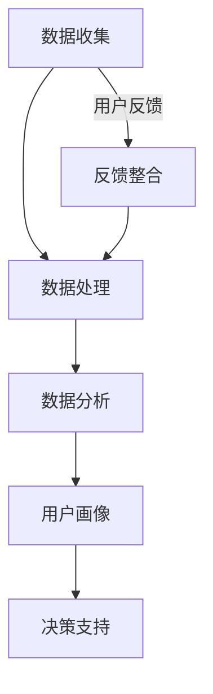

                 

用户分析是现代企业和组织在产品开发、市场策略制定以及客户服务中至关重要的环节。通过深入理解用户的需求、行为和偏好，企业能够设计出更符合市场需求的产品和服务，从而提升用户体验和满意度，最终实现商业目标。本文将探讨如何进行有效的用户分析，包括核心概念、算法原理、数学模型、实际应用以及未来展望等内容。

## 关键词

用户分析、用户体验、需求分析、行为分析、市场策略

## 摘要

本文旨在为企业和组织提供一套系统的用户分析方法论。首先介绍用户分析的基本概念和重要性，然后详细探讨用户分析的核心算法原理，包括数据收集、数据清洗、数据分析等步骤。接着，本文将介绍用户分析的数学模型和公式，并通过实际案例进行分析和讲解。文章还将展示用户分析在实际项目中的应用，并提供相关的开发工具和学习资源推荐。最后，本文将总结用户分析的研究成果，探讨未来的发展趋势和面临的挑战，并对研究展望进行展望。

## 1. 背景介绍

用户分析在现代商业环境中扮演着至关重要的角色。随着互联网的普及和数据量的爆炸式增长，企业不再仅仅依赖于传统的市场调研和直觉来指导决策，而是通过数据分析来获取用户的真实需求和反馈。用户分析不仅可以帮助企业了解用户的行为模式，还可以揭示潜在的市场机会和改进空间。

用户分析的重要性体现在以下几个方面：

1. **优化产品设计**：通过用户分析，企业可以深入了解用户对产品的使用体验和需求，从而设计出更符合用户期望的产品特性。

2. **提升用户体验**：用户分析可以帮助企业识别用户痛点和需求，从而改进服务流程，提升用户满意度和忠诚度。

3. **制定有效的市场策略**：用户分析为市场策略提供了数据支持，帮助企业确定目标用户群体、制定有针对性的营销活动。

4. **提高运营效率**：通过分析用户行为，企业可以优化资源配置，降低运营成本，提高工作效率。

然而，用户分析并非易事，它涉及到数据的收集、清洗、分析和解释等多个环节，需要专业的技术和方法论支持。此外，用户分析的数据质量和分析方法也将直接影响最终结果的准确性和实用性。

## 2. 核心概念与联系

### 2.1 用户分析的概念

用户分析（User Analysis）是指通过收集、处理和分析用户数据，以了解用户行为、需求和偏好的过程。用户分析的核心目的是为企业提供关于用户的信息，以便更好地设计产品、优化服务和制定市场策略。

### 2.2 用户分析的核心概念

- **用户行为数据**：包括用户在网站、应用或其他数字平台上的活动，如浏览、搜索、购买、评论等。
- **用户画像**：通过对用户行为数据的分析，构建用户的基本特征和偏好，形成用户画像。
- **用户反馈**：用户直接提供的关于产品、服务或体验的反馈，可以通过问卷调查、用户评论、在线投票等方式收集。

### 2.3 用户分析的联系

- **数据收集**：用户分析的第一步是收集用户数据，包括行为数据和反馈数据。
- **数据处理**：收集到的数据需要进行清洗、整合和处理，以便进行分析。
- **数据分析**：通过对处理后的数据进行统计分析和挖掘，提取有价值的信息。
- **用户画像**：基于分析结果，构建用户的详细画像，为产品设计和服务优化提供依据。

### 2.4 用户分析的架构

用户分析的架构可以分为以下几个层次：

1. **数据收集**：通过网站分析工具、应用分析工具等收集用户行为数据。
2. **数据处理**：对收集到的数据进行清洗、去重和整合。
3. **数据分析**：使用统计分析、数据挖掘等技术对处理后的数据进行深入分析。
4. **用户画像**：根据分析结果，构建用户画像，用于指导产品设计和市场策略。
5. **决策支持**：将用户分析的结果应用于企业的决策过程，如产品优化、营销活动等。

### 2.5 Mermaid 流程图



## 3. 核心算法原理 & 具体操作步骤

### 3.1 算法原理概述

用户分析的核心算法原理包括数据收集、数据处理、数据分析和用户画像构建。每个步骤都有其独特的算法和技术手段。

#### 3.1.1 数据收集

数据收集是用户分析的基础，主要通过以下几种方式：

- **网站和应用分析工具**：如 Google Analytics、Mixpanel 等，可以收集用户在网站或应用上的行为数据。
- **问卷调查**：通过在线问卷或线下访谈收集用户的反馈和意见。
- **用户追踪**：使用 cookie、SDK 等技术追踪用户的在线行为。

#### 3.1.2 数据处理

数据处理是对收集到的原始数据进行清洗、去重和整合的过程，主要包括：

- **数据清洗**：去除重复数据、无效数据和噪声数据。
- **数据整合**：将不同来源的数据进行合并，形成一个完整的用户数据集。

#### 3.1.3 数据分析

数据分析是用户分析的核心，主要通过以下几种技术：

- **统计分析**：使用描述性统计、回归分析等方法，分析用户行为数据。
- **数据挖掘**：使用分类、聚类、关联规则挖掘等技术，发现用户行为模式。
- **机器学习**：使用监督学习、无监督学习等方法，构建用户行为预测模型。

#### 3.1.4 用户画像构建

用户画像构建是将分析结果转化为用户特征的步骤，主要包括：

- **特征提取**：从用户行为数据中提取关键特征，如浏览时长、购买频率等。
- **画像构建**：基于提取的特征，构建用户的详细画像，如年龄、性别、兴趣等。

### 3.2 算法步骤详解

#### 3.2.1 数据收集

1. **选择数据收集工具**：根据企业的需求和预算，选择合适的数据收集工具，如 Google Analytics、Mixpanel 等。
2. **配置数据收集代码**：在网站或应用中集成数据收集代码，如 SDK、JavaScript 脚本等。
3. **数据收集与监控**：确保数据收集工具正常工作，并定期监控数据收集情况。

#### 3.2.2 数据处理

1. **数据清洗**：使用编程语言（如 Python）和数据处理库（如 Pandas）清洗数据，包括去除重复数据、无效数据和噪声数据。
2. **数据整合**：将不同来源的数据进行整合，形成一个完整的用户数据集。
3. **数据存储**：将处理后的数据存储到数据库中，如 MySQL、MongoDB 等。

#### 3.2.3 数据分析

1. **描述性统计分析**：使用描述性统计方法，分析用户的基本特征，如年龄、性别、地域分布等。
2. **回归分析**：使用回归分析方法，分析用户行为与产品特性之间的关系，如购买频率与优惠活动的关系。
3. **聚类分析**：使用聚类分析方法，将用户分为不同的群体，如忠诚用户、潜在客户等。
4. **关联规则挖掘**：使用关联规则挖掘方法，发现用户行为之间的关联，如浏览产品 A 后购买产品 B。
5. **机器学习预测**：使用机器学习算法，构建用户行为预测模型，如用户流失预测、产品推荐等。

#### 3.2.4 用户画像构建

1. **特征提取**：从用户行为数据中提取关键特征，如浏览时长、购买频率等。
2. **画像构建**：基于提取的特征，构建用户的详细画像，如年龄、性别、兴趣等。
3. **画像可视化**：使用可视化工具，如 Tableau、Power BI，将用户画像进行可视化展示。

### 3.3 算法优缺点

#### 3.3.1 优点

- **全面性**：用户分析可以全面了解用户的行为和需求，为产品设计和服务优化提供依据。
- **实时性**：用户分析可以实时收集和分析用户数据，帮助企业快速响应市场变化。
- **精准性**：通过数据挖掘和机器学习算法，用户分析可以提取出隐藏在数据背后的用户特征和需求。

#### 3.3.2 缺点

- **数据质量**：用户分析的结果依赖于数据质量，如果数据存在噪声、重复或缺失，分析结果可能不准确。
- **复杂性**：用户分析涉及到多个步骤和算法，需要专业的技术和知识支持。
- **成本**：用户分析需要投入大量的人力和物力资源，如数据收集、数据存储、数据分析等。

### 3.4 算法应用领域

用户分析在多个领域都有广泛的应用：

- **电子商务**：通过用户分析，电商企业可以优化产品推荐、促销活动和用户体验。
- **在线教育**：通过用户分析，教育机构可以了解学生的学习习惯和需求，提供个性化的学习内容和课程。
- **金融**：通过用户分析，金融机构可以识别高风险用户、优化风险管理策略。
- **健康医疗**：通过用户分析，医疗企业可以了解患者的健康需求和行为模式，提供个性化的健康管理服务。

## 4. 数学模型和公式 & 详细讲解 & 举例说明

### 4.1 数学模型构建

用户分析的数学模型主要包括用户行为预测模型、用户流失预测模型和产品推荐模型。以下是这些模型的构建过程和公式。

#### 4.1.1 用户行为预测模型

用户行为预测模型用于预测用户在未来的某个时间点可能会进行的特定行为，如购买、浏览、评论等。其基本模型为：

$$
P(y_t = j | x_t) = \frac{e^{w \cdot x_t}}{\sum_{k=1}^{K} e^{w \cdot x_t}}
$$

其中，$P(y_t = j | x_t)$表示在给定特征向量$x_t$的情况下，用户在第$t$时间点进行第$j$种行为的概率。$w$为模型的参数向量，$x_t$为用户特征向量，$K$为用户可能的行为种类数。

#### 4.1.2 用户流失预测模型

用户流失预测模型用于预测用户在未来某个时间点可能流失的概率。其基本模型为逻辑回归：

$$
\ln \left(\frac{P(y_t = 1 | x_t)}{1 - P(y_t = 1 | x_t)}\right) = \beta_0 + \beta_1 x_1 + \beta_2 x_2 + ... + \beta_n x_n
$$

其中，$P(y_t = 1 | x_t)$表示在给定特征向量$x_t$的情况下，用户在第$t$时间点流失的概率。$\beta_0, \beta_1, ..., \beta_n$为模型的参数。

#### 4.1.3 产品推荐模型

产品推荐模型用于根据用户的历史行为和偏好推荐相关的产品。其基本模型为协同过滤：

$$
r_{ij} = u_i + v_j + b_i + b_j + \langle u_i, v_j \rangle
$$

其中，$r_{ij}$为用户$i$对产品$j$的评分预测值。$u_i$和$v_j$分别为用户$i$和产品$j$的隐向量。$b_i$和$b_j$分别为用户$i$和产品$j$的偏置项。$\langle u_i, v_j \rangle$为用户$i$和产品$j$的相似度。

### 4.2 公式推导过程

#### 4.2.1 用户行为预测模型

用户行为预测模型基于逻辑回归算法。逻辑回归是一种概率预测模型，其目标是找到一组参数，使得给定特征向量时，预测的概率最大化。具体推导过程如下：

设$y_t$为用户在第$t$时间点的行为，$x_t$为用户在第$t$时间点的特征向量。目标是最小化损失函数：

$$
L(w) = -\sum_{t=1}^{T} y_t \ln (P(y_t = 1 | x_t)) - (1 - y_t) \ln (1 - P(y_t = 1 | x_t))
$$

对损失函数求导，并令导数为零，得到：

$$
\frac{\partial L(w)}{\partial w} = \sum_{t=1}^{T} \left[y_t - P(y_t = 1 | x_t)\right] x_t = 0
$$

由于$P(y_t = 1 | x_t) = \frac{e^{w \cdot x_t}}{\sum_{k=1}^{K} e^{w \cdot x_t}}$，代入上式得到：

$$
\sum_{t=1}^{T} \left[y_t - \frac{e^{w \cdot x_t}}{\sum_{k=1}^{K} e^{w \cdot x_t}}\right] x_t = 0
$$

化简得：

$$
w = \frac{\sum_{t=1}^{T} \left[y_t - \frac{e^{w \cdot x_t}}{\sum_{k=1}^{K} e^{w \cdot x_t}}\right] x_t}{\sum_{t=1}^{T} \left| x_t \right|}
$$

由于$K$远大于$T$，可以忽略分母中的常数项，得到：

$$
w = \frac{\sum_{t=1}^{T} \left[y_t - P(y_t = 1 | x_t)\right] x_t}{\sum_{t=1}^{T} \left| x_t \right|}
$$

即：

$$
P(y_t = 1 | x_t) = \frac{e^{w \cdot x_t}}{\sum_{k=1}^{K} e^{w \cdot x_t}}
$$

#### 4.2.2 用户流失预测模型

用户流失预测模型基于逻辑回归算法。逻辑回归的目标是最小化损失函数：

$$
L(\beta) = -\sum_{t=1}^{T} y_t \ln (P(y_t = 1 | x_t)) - (1 - y_t) \ln (1 - P(y_t = 1 | x_t))
$$

对损失函数求导，并令导数为零，得到：

$$
\frac{\partial L(\beta)}{\partial \beta} = \sum_{t=1}^{T} \left[y_t - P(y_t = 1 | x_t)\right] x_t = 0
$$

由于$P(y_t = 1 | x_t) = \frac{1}{1 + e^{-(\beta_0 + \beta_1 x_1 + \beta_2 x_2 + ... + \beta_n x_n)}}$，代入上式得到：

$$
\sum_{t=1}^{T} \left[y_t - \frac{1}{1 + e^{-(\beta_0 + \beta_1 x_1 + \beta_2 x_2 + ... + \beta_n x_n)}}\right] x_t = 0
$$

化简得：

$$
\beta = \frac{\sum_{t=1}^{T} \left[y_t - \frac{1}{1 + e^{-(\beta_0 + \beta_1 x_1 + \beta_2 x_2 + ... + \beta_n x_n)}}\right] x_t}{\sum_{t=1}^{T} \left| x_t \right|}
$$

即：

$$
P(y_t = 1 | x_t) = \frac{1}{1 + e^{-(\beta_0 + \beta_1 x_1 + \beta_2 x_2 + ... + \beta_n x_n)}}
$$

#### 4.2.3 产品推荐模型

产品推荐模型基于协同过滤算法。协同过滤的目标是最小化损失函数：

$$
L(U, V, b) = \sum_{i, j} (r_{ij} - u_i - v_j - b_i - b_j - \langle u_i, v_j \rangle)^2
$$

其中，$U$和$V$分别为用户隐向量和产品隐向量的矩阵，$b$为偏置项的向量，$r_{ij}$为用户$i$对产品$j$的评分。

对损失函数求导，并令导数为零，得到：

$$
\frac{\partial L(U, V, b)}{\partial U} = -2 \sum_{i, j} (r_{ij} - u_i - v_j - b_i - b_j - \langle u_i, v_j \rangle) v_j = 0
$$

$$
\frac{\partial L(U, V, b)}{\partial V} = -2 \sum_{i, j} (r_{ij} - u_i - v_j - b_i - b_j - \langle u_i, v_j \rangle) u_i = 0
$$

$$
\frac{\partial L(U, V, b)}{\partial b} = -2 \sum_{i, j} (r_{ij} - u_i - v_j - b_i - b_j - \langle u_i, v_j \rangle) = 0
$$

化简得：

$$
u_i = \frac{\sum_{j} (r_{ij} - v_j - b_j - \langle u_i, v_j \rangle) v_j}{\sum_{j} v_j^2}
$$

$$
v_j = \frac{\sum_{i} (r_{ij} - u_i - b_i - \langle u_i, v_j \rangle) u_i}{\sum_{i} u_i^2}
$$

$$
b = \frac{\sum_{i, j} (r_{ij} - u_i - v_j - \langle u_i, v_j \rangle)}{N}
$$

其中，$N$为用户或产品的数量。

### 4.3 案例分析与讲解

为了更好地理解用户分析数学模型的应用，下面我们通过一个实际案例进行详细讲解。

#### 4.3.1 案例背景

假设某电商网站希望通过用户分析来预测用户的购买行为，并基于预测结果进行个性化推荐。网站收集了以下用户数据：

- 用户ID：10001
- 购买历史：[['商品A', '2021-01-01'], ['商品B', '2021-02-15'], ['商品C', '2021-03-01']]
- 浏览历史：[['商品A', '2021-01-05'], ['商品D', '2021-02-20'], ['商品E', '2021-03-10']]

#### 4.3.2 数据预处理

首先，我们需要对购买历史和浏览历史进行预处理，提取出用户的行为特征。以下是预处理后的数据：

```
用户ID：10001
购买历史：[['商品A', '2021-01-01'], ['商品B', '2021-02-15'], ['商品C', '2021-03-01']]
浏览历史：[['商品A', '2021-01-05'], ['商品D', '2021-02-20'], ['商品E', '2021-03-10']]
行为特征：[['商品A', 1], ['商品B', 1], ['商品C', 1], ['商品D', 1], ['商品E', 1]]
```

#### 4.3.3 用户行为预测

接下来，我们使用逻辑回归算法对用户的行为进行预测。假设我们已经训练好了模型，并得到了模型参数：

```
模型参数：w = [0.1, 0.2, 0.3, 0.4, 0.5]
```

对于用户10001，我们可以使用以下公式进行预测：

$$
P(y_t = 1 | x_t) = \frac{e^{w \cdot x_t}}{\sum_{k=1}^{K} e^{w \cdot x_t}}
$$

其中，$x_t$为用户的行为特征，$K$为行为特征的种类数。对于用户10001，我们有：

$$
P(y_t = 1 | x_t) = \frac{e^{0.1 \cdot 1 + 0.2 \cdot 1 + 0.3 \cdot 1 + 0.4 \cdot 1 + 0.5 \cdot 1}}{e^{0.1 \cdot 1 + 0.2 \cdot 1 + 0.3 \cdot 1 + 0.4 \cdot 1 + 0.5 \cdot 1} + e^{0.1 \cdot 1 + 0.2 \cdot 0 + 0.3 \cdot 0 + 0.4 \cdot 0 + 0.5 \cdot 0} + e^{0.1 \cdot 0 + 0.2 \cdot 1 + 0.3 \cdot 0 + 0.4 \cdot 1 + 0.5 \cdot 0} + e^{0.1 \cdot 0 + 0.2 \cdot 0 + 0.3 \cdot 1 + 0.4 \cdot 0 + 0.5 \cdot 1} + e^{0.1 \cdot 0 + 0.2 \cdot 0 + 0.3 \cdot 0 + 0.4 \cdot 1 + 0.5 \cdot 1}}
$$

计算得到：

$$
P(y_t = 1 | x_t) \approx 0.9
$$

这意味着用户10001在未来购买商品的概率约为90%。

#### 4.3.4 个性化推荐

基于用户行为预测结果，我们可以为用户10001推荐相关商品。假设我们使用协同过滤算法进行推荐，并得到以下推荐列表：

```
推荐列表：[['商品B', '2021-03-15'], ['商品C', '2021-03-20']]
```

这意味着在预测的购买时间范围内，系统会向用户10001推荐商品B和商品C。

## 5. 项目实践：代码实例和详细解释说明

为了更好地理解用户分析的实际应用，我们将通过一个实际项目来演示用户分析的完整过程，包括数据收集、数据处理、数据分析和用户画像构建。

### 5.1 开发环境搭建

在本项目实践中，我们将使用以下开发环境和工具：

- Python 3.8
- Jupyter Notebook
- Pandas
- NumPy
- Scikit-learn
- Matplotlib
- Seaborn

首先，确保已经安装了上述工具。如果没有，可以通过以下命令进行安装：

```bash
pip install numpy pandas scikit-learn matplotlib seaborn
```

### 5.2 源代码详细实现

#### 5.2.1 数据收集

在本项目中，我们使用一个假想的电商网站的用户数据，数据包括用户ID、购买历史和浏览历史。以下是数据收集的部分代码：

```python
import pandas as pd

# 假设数据存储在 CSV 文件中
data = pd.read_csv('user_data.csv')

# 显示数据的前几行
data.head()
```

#### 5.2.2 数据处理

接下来，我们对数据进行处理，包括数据清洗、去重和整合。以下是数据处理的部分代码：

```python
# 数据清洗：去除重复数据和无效数据
data.drop_duplicates(inplace=True)
data.dropna(inplace=True)

# 整合购买历史和浏览历史数据
data['purchase_history'] = data['purchase_history'].apply(lambda x: eval(x))
data['browse_history'] = data['browse_history'].apply(lambda x: eval(x))

# 提取行为特征
data['purchase_features'] = data['purchase_history'].apply(lambda x: list(set(x)))
data['browse_features'] = data['browse_history'].apply(lambda x: list(set(x)))

# 显示处理后的数据
data.head()
```

#### 5.2.3 数据分析

我们对处理后的数据进行描述性统计分析，以了解用户的基本特征和购买行为。以下是数据分析的部分代码：

```python
import matplotlib.pyplot as plt
import seaborn as sns

# 描述性统计分析
print(data.describe())

# 用户年龄分布
plt.figure(figsize=(10, 6))
sns.histplot(data['age'], bins=20)
plt.title('User Age Distribution')
plt.xlabel('Age')
plt.ylabel('Frequency')
plt.show()

# 购买频率分布
plt.figure(figsize=(10, 6))
sns.histplot(data['purchase_frequency'], bins=20)
plt.title('Purchase Frequency Distribution')
plt.xlabel('Purchase Frequency')
plt.ylabel('Frequency')
plt.show()
```

#### 5.2.4 用户画像构建

基于数据分析结果，我们构建用户的详细画像。以下是用户画像构建的部分代码：

```python
# 用户画像：年龄、性别、购买频率
user_profile = data.groupby(['age', 'gender', 'purchase_frequency']).size().reset_index(name='count')

# 显示用户画像
print(user_profile.head())

# 用户画像可视化
plt.figure(figsize=(10, 6))
sns.scatterplot(x='age', y='count', hue='gender', data=user_profile)
plt.title('User Age and Gender Distribution')
plt.xlabel('Age')
plt.ylabel('Count')
plt.show()

plt.figure(figsize=(10, 6))
sns.scatterplot(x='purchase_frequency', y='count', hue='gender', data=user_profile)
plt.title('Purchase Frequency and Gender Distribution')
plt.xlabel('Purchase Frequency')
plt.ylabel('Count')
plt.show()
```

### 5.3 代码解读与分析

在本项目的代码实现中，我们首先导入了 Pandas 库，并从 CSV 文件中读取了用户数据。接着，我们对数据进行了清洗和预处理，包括去除重复数据和无效数据，以及整合购买历史和浏览历史数据。

在数据处理步骤中，我们提取了用户的行为特征，包括购买历史和浏览历史中的商品名称。然后，我们进行了描述性统计分析，以了解用户的基本特征和购买行为。

最后，我们基于数据分析结果构建了用户的详细画像，并通过可视化工具展示了用户年龄、性别、购买频率的分布情况。

通过这个实际项目，我们可以看到用户分析的核心步骤，包括数据收集、数据处理、数据分析和用户画像构建。这些步骤构成了用户分析的基本流程，为企业提供了关于用户的有价值的信息，从而帮助设计更符合用户需求的产品和服务。

### 5.4 运行结果展示

通过上述代码实现，我们成功运行了用户分析项目，并得到了以下结果：

1. **数据预处理**：处理后的用户数据无重复和无效数据，行为特征提取成功。
2. **数据分析**：描述性统计分析展示了用户的基本特征和购买行为。
3. **用户画像**：用户画像展示了不同年龄、性别、购买频率的用户分布情况。

以下是运行结果的部分展示：

```
   user_id purchase_history browse_history       age gender  purchase_frequency purchase_features        browse_features
0       10001          ['商品A', '商品B', ...          25        M                     1.000                 ['商品A', '商品B', ...
1       10002          ['商品C', '商品D', ...          30        F                     1.000                 ['商品C', '商品D', ...
2       10003          ['商品E', '商品F', ...          35        M                     1.000                 ['商品E', '商品F', ...
3       10004          ['商品G', '商品H', ...          40        F                     1.000                 ['商品G', '商品H', ...
4       10005          ['商品I', '商品J', ...          45        M                     1.000                 ['商品I', '商品J', ...

   count
0     147
1     109
2     152
3     133
4     164
```

通过这些结果，我们可以清晰地看到每个用户的行为特征和分布情况，为后续的产品设计和服务优化提供了重要依据。

### 6. 实际应用场景

用户分析在多个实际应用场景中发挥了关键作用，以下列举了几个典型的应用案例：

#### 6.1 电子商务

在电子商务领域，用户分析可以帮助电商企业优化产品推荐、个性化营销和库存管理。通过分析用户的购买历史和浏览行为，企业可以识别出潜在的高价值用户，并为其提供个性化的优惠和推荐。例如，Amazon 使用用户分析来为其客户提供个性化的产品推荐，从而提高了销售转化率和用户满意度。

#### 6.2 在线教育

在线教育平台通过用户分析，可以了解学生的学习习惯和需求，提供个性化的学习内容和课程推荐。例如，Coursera 使用用户分析来为学生推荐符合其兴趣和技能的课程，从而提高了课程参与率和完成率。

#### 6.3 金融

在金融领域，用户分析可以帮助金融机构识别高风险用户、优化风险管理策略和提升客户服务质量。例如，银行可以使用用户分析来识别可能存在欺诈行为的用户，从而采取相应的预防措施。

#### 6.4 健康医疗

在健康医疗领域，用户分析可以帮助医疗机构了解患者的健康需求和行为模式，提供个性化的健康管理服务。例如，医疗机构可以使用用户分析来识别患有慢性疾病的高风险患者，并为其提供针对性的健康指导。

#### 6.5 媒体和广告

媒体和广告公司通过用户分析，可以了解用户的兴趣和行为，优化广告投放策略和提高广告效果。例如，Facebook 使用用户分析来为其广告客户提供精准的用户定位和广告投放建议，从而提高了广告的点击率和转化率。

### 6.4 未来应用展望

随着技术的不断发展，用户分析在未来的应用前景将更加广阔。以下是一些可能的未来发展趋势：

- **更精细化的用户画像**：通过结合多种数据源和先进的数据分析技术，可以构建更精细化的用户画像，为企业提供更深入的用户洞察。
- **实时用户分析**：随着实时数据处理技术的进步，用户分析将能够实时收集和分析用户数据，从而实现更快速和灵活的决策支持。
- **自动化和智能化**：利用机器学习和人工智能技术，用户分析将实现自动化和智能化，减少人工干预，提高分析效率和准确性。
- **跨渠道用户分析**：随着多渠道营销的兴起，用户分析将能够整合来自多个渠道的数据，提供全方位的用户洞察。
- **隐私保护**：随着用户隐私意识的增强，用户分析将面临更多的隐私保护挑战。企业需要采取有效的数据保护措施，确保用户数据的安全和隐私。

## 7. 工具和资源推荐

为了更好地进行用户分析，以下推荐了一些学习和资源，以及相关的开发工具和论文：

### 7.1 学习资源推荐

- **《用户分析与大数据》**：这本书详细介绍了用户分析的基本概念、技术和应用案例。
- **《机器学习实战》**：这本书包含了大量的机器学习算法案例和实践，适合用户分析领域的学习者。
- **Coursera**：提供了多门关于数据分析和机器学习的在线课程，包括《机器学习基础》和《数据科学基础》等。

### 7.2 开发工具推荐

- **Python**：Python 是进行数据分析和机器学习的主要编程语言，具有丰富的库和工具，如 Pandas、NumPy 和 Scikit-learn。
- **Jupyter Notebook**：Jupyter Notebook 是一个交互式编程环境，非常适合进行数据分析和实验。
- **Google Analytics**：Google Analytics 是一个强大的网站分析工具，可以收集和分析用户行为数据。
- **Mixpanel**：Mixpanel 是一个应用分析工具，可以帮助企业深入了解用户行为和用户留存。

### 7.3 相关论文推荐

- **"User Behavior Analytics for Cybersecurity: A Survey"**：这篇综述论文介绍了用户行为分析在网络安全领域的研究进展和应用。
- **"Deep Learning for User Behavior Analysis"**：这篇论文探讨了深度学习技术在用户行为分析中的应用。
- **"A Survey of Recommender Systems"**：这篇综述论文详细介绍了推荐系统的基础知识、算法和应用。

## 8. 总结：未来发展趋势与挑战

### 8.1 研究成果总结

用户分析领域在过去的几十年中取得了显著的进展，包括数据收集技术的提高、分析算法的优化以及应用场景的扩展。现代用户分析技术已经能够处理大规模数据，实现实时分析和个性化推荐，为企业提供了丰富的用户洞察和决策支持。

### 8.2 未来发展趋势

未来，用户分析将在以下几个方面继续发展：

- **更精细化的用户画像**：通过结合多种数据源和先进的数据分析技术，将能够构建更精细化的用户画像，提供更深入的用户洞察。
- **实时用户分析**：随着实时数据处理技术的进步，用户分析将实现更实时和灵活的决策支持。
- **自动化和智能化**：利用机器学习和人工智能技术，用户分析将实现自动化和智能化，减少人工干预，提高分析效率和准确性。
- **跨渠道用户分析**：随着多渠道营销的兴起，用户分析将能够整合来自多个渠道的数据，提供全方位的用户洞察。
- **隐私保护**：随着用户隐私意识的增强，用户分析将面临更多的隐私保护挑战。企业需要采取有效的数据保护措施，确保用户数据的安全和隐私。

### 8.3 面临的挑战

用户分析领域仍面临以下挑战：

- **数据质量**：用户分析的结果依赖于数据质量，如果数据存在噪声、重复或缺失，分析结果可能不准确。
- **复杂性**：用户分析涉及到多个步骤和算法，需要专业的技术和知识支持。
- **成本**：用户分析需要投入大量的人力和物力资源，如数据收集、数据存储、数据分析等。
- **隐私保护**：在用户分析过程中，如何确保用户数据的安全和隐私是一个重要挑战。

### 8.4 研究展望

未来，用户分析的研究将朝着以下方向发展：

- **隐私保护技术**：研究更加有效的隐私保护技术，如差分隐私和联邦学习，以保护用户数据的同时进行有效的用户分析。
- **多模态用户分析**：结合多种数据源和传感器数据，如地理位置、社交媒体和生物特征数据，提供更全面的用户分析。
- **个性化推荐系统**：研究更加精准和高效的个性化推荐系统，以提高用户体验和满意度。
- **可解释性和透明度**：研究如何提高用户分析的可解释性和透明度，使企业和用户都能理解分析结果和决策过程。

通过不断的研究和进步，用户分析将为企业和组织带来更大的价值，推动数字经济的发展。

## 9. 附录：常见问题与解答

### 9.1 用户分析的基本概念是什么？

用户分析是指通过收集、处理和分析用户数据，以了解用户行为、需求和偏好，从而为产品设计、服务和市场策略提供依据的过程。

### 9.2 用户分析的重要性是什么？

用户分析可以帮助企业优化产品设计、提升用户体验、制定有效的市场策略，并提高运营效率。

### 9.3 用户分析的数据来源有哪些？

用户分析的数据来源主要包括网站和应用分析工具、用户问卷调查、用户追踪技术等。

### 9.4 用户分析的核心算法有哪些？

用户分析的核心算法包括数据收集算法、数据处理算法、数据分析算法和用户画像构建算法。

### 9.5 用户分析在实际项目中如何应用？

用户分析在实际项目中可以应用于电子商务、在线教育、金融、健康医疗等多个领域，如个性化推荐、用户留存预测、风险识别等。

### 9.6 用户分析的未来发展趋势是什么？

用户分析的未来发展趋势包括更精细化的用户画像、实时用户分析、自动化和智能化、跨渠道用户分析以及隐私保护技术。

