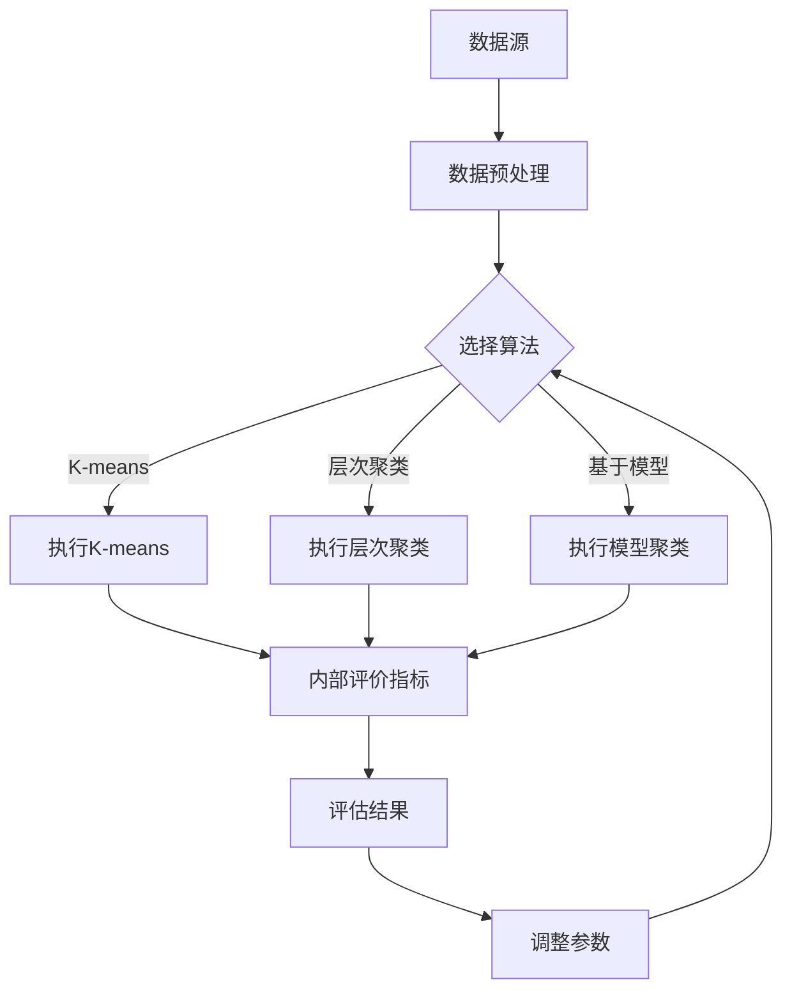

                 

在当今数据驱动的世界中，用户分群管理成为了企业获取竞争优势的关键。通过对用户进行有效的分群，企业可以更精确地满足不同用户群体的需求，提高用户满意度和忠诚度。本文将深入探讨用户分群管理的核心概念、算法原理、数学模型、实践应用，以及未来发展趋势和挑战。

## 文章关键词
- 用户分群管理
- 数据挖掘
- 个性化推荐
- 聚类算法
- 数学模型

## 文章摘要
本文旨在提供一种全面、系统的方法来指导企业进行有效的用户分群管理。文章首先介绍了用户分群管理的基本概念和重要性，然后详细阐述了核心算法原理和具体操作步骤，接着讲解了数学模型和公式，并通过实际项目实践展示了代码实例。文章最后讨论了用户分群管理在实际应用场景中的效果，并对未来发展趋势和面临的挑战进行了展望。

## 1. 背景介绍

### 1.1 用户分群管理的定义
用户分群管理是指通过数据分析方法，将用户群体划分为具有相似特征或行为的子群体，以便更好地理解和服务这些用户。这种管理方法广泛应用于市场研究、个性化推荐系统、用户体验优化等多个领域。

### 1.2 用户分群管理的重要性
有效的用户分群管理有助于企业：
- **提升营销效果**：通过针对性的营销策略，提高用户转化率和销售额。
- **优化产品设计**：根据不同用户群体的需求和偏好，设计更符合市场需求的产品。
- **提高用户满意度**：通过个性化的服务和产品推荐，增强用户的满意度和忠诚度。

### 1.3 用户分群管理的发展历程
用户分群管理起源于市场细分理论，随着数据分析技术的进步，分群方法从简单的统计方法发展到复杂的机器学习算法。近年来，随着大数据和人工智能的发展，用户分群管理进入了新的阶段，变得更加精准和高效。

## 2. 核心概念与联系

### 2.1 数据源与预处理
在进行用户分群之前，首先需要收集用户数据，这包括用户行为数据、交易数据、社交数据等。收集的数据需要进行清洗和预处理，以确保数据的质量和一致性。

### 2.2 用户分群算法
用户分群算法是用户分群管理的核心。常用的算法包括：
- **K-means聚类算法**：基于距离度量，将用户分为K个簇，每个簇内的用户距离中心点较近，不同簇之间的用户距离较远。
- **层次聚类算法**：将用户逐步划分为不同的层次，直到达到预定的聚类数目或满足终止条件。
- **基于模型的聚类算法**：使用机器学习模型进行聚类，如DBSCAN、GMM等。

### 2.3 评价指标
用户分群效果的评价指标包括：
- **内部评价指标**：如轮廓系数、同质性、异质性等，用于评估聚类结果的内部质量。
- **外部评价指标**：如F1值、准确率、召回率等，用于评估聚类结果与实际标签的相关性。

### 2.4 Mermaid 流程图



## 3. 核心算法原理 & 具体操作步骤

### 3.1 算法原理概述
用户分群算法可以分为无监督学习和有监督学习两种类型。无监督学习通过数据内在结构进行分群，不需要标签信息；有监督学习需要预先标注的数据，通过比较聚类结果和标签的匹配度来评估聚类效果。

### 3.2 算法步骤详解
以K-means算法为例，具体操作步骤如下：

1. **初始化中心点**：随机选择K个用户作为初始中心点。
2. **分配用户**：计算每个用户与中心点之间的距离，将用户分配到距离最近的中心点所在的簇。
3. **更新中心点**：计算每个簇的用户均值，将新的均值作为中心点。
4. **迭代优化**：重复步骤2和3，直到聚类中心不再发生变化或满足预定的迭代次数。

### 3.3 算法优缺点
- **优点**：算法简单，易于实现；对大规模数据集效果较好。
- **缺点**：对初始中心点敏感；无法处理非球形聚类结构；无法预测簇的数量。

### 3.4 算法应用领域
用户分群算法广泛应用于：
- **电子商务**：个性化推荐、精准营销。
- **社交媒体**：用户行为分析、社区划分。
- **金融领域**：风险评估、用户画像。

## 4. 数学模型和公式 & 详细讲解 & 举例说明

### 4.1 数学模型构建
K-means算法的核心在于距离度量。常用的距离度量包括欧几里得距离、曼哈顿距离、切比雪夫距离等。

### 4.2 公式推导过程
以欧几里得距离为例，两个用户\(u\)和\(v\)之间的距离公式为：

$$
d(u, v) = \sqrt{\sum_{i=1}^{n} (u_i - v_i)^2}
$$

其中，\(u_i\)和\(v_i\)分别表示用户\(u\)和\(v\)在第\(i\)个特征上的值，\(n\)是特征的数量。

### 4.3 案例分析与讲解
假设有5个用户，每个用户有3个特征，如下表所示：

| 用户 | 特征1 | 特征2 | 特征3 |
| ---- | ---- | ---- | ---- |
| u1   | 1    | 2    | 3    |
| u2   | 2    | 3    | 4    |
| u3   | 1    | 3    | 5    |
| u4   | 2    | 2    | 4    |
| u5   | 3    | 1    | 5    |

我们使用K-means算法将用户分为2个簇。初始中心点随机选择为\(u1\)和\(u5\)。

### 4.4 迭代过程
- **第1次迭代**：
  - 用户与\(u1\)的距离：\(d(u2, u1) = \sqrt{(2-1)^2 + (3-2)^2 + (4-3)^2} = \sqrt{2}\)
  - 用户与\(u5\)的距离：\(d(u2, u5) = \sqrt{(3-2)^2 + (1-3)^2 + (5-4)^2} = \sqrt{5}\)
  - 用户\(u2\)分配到\(u1\)的簇。

- **第2次迭代**：
  - 中心点更新：\(u1\)的新中心点为\((1+2)/2, (2+3)/2, (3+4)/2) = (1.5, 2.5, 3.5)\)
  - 用户\(u2\)仍然分配到\(u1\)的簇。

重复以上过程，直到聚类中心不再变化。最终，用户\(u1\)和\(u3\)属于一个簇，用户\(u2\)和\(u4\)属于另一个簇。

## 5. 项目实践：代码实例和详细解释说明

### 5.1 开发环境搭建
我们使用Python进行用户分群管理的项目实践。首先，确保安装了Python和以下库：NumPy、Matplotlib、Scikit-learn。

### 5.2 源代码详细实现
以下是K-means算法的Python实现：

```python
import numpy as np
from sklearn.cluster import KMeans
import matplotlib.pyplot as plt

# 用户数据
users = np.array([
    [1, 2, 3],
    [2, 3, 4],
    [1, 3, 5],
    [2, 2, 4],
    [3, 1, 5]
])

# K-means算法
kmeans = KMeans(n_clusters=2, random_state=0).fit(users)

# 聚类结果
print("Cluster labels:", kmeans.labels_)

# 绘图
plt.scatter(users[:, 0], users[:, 1], c=kmeans.labels_)
plt.scatter(kmeans.cluster_centers_[:, 0], kmeans.cluster_centers_[:, 1], s=300, c='red')
plt.show()
```

### 5.3 代码解读与分析
- `numpy`用于处理用户数据。
- `scikit-learn`中的`KMeans`类用于实现K-means算法。
- `fit()`方法用于训练模型，`labels_`属性返回聚类结果。
- `scatter()`函数用于绘制用户数据点和聚类中心。

### 5.4 运行结果展示
运行代码后，我们可以看到用户数据被分为两个簇，聚类中心用红色星号标记。

## 6. 实际应用场景

### 6.1 个性化推荐系统
用户分群管理可以帮助个性化推荐系统更准确地推荐产品或内容。例如，根据用户的购买历史和浏览行为，将用户分为不同的兴趣群体，从而推荐更相关的产品。

### 6.2 营销活动优化
通过对用户分群，企业可以更有针对性地设计营销活动。例如，针对高价值用户群体推出特殊的优惠策略，提高用户转化率。

### 6.3 社交网络分析
用户分群管理可以帮助社交网络平台了解用户的行为和兴趣，从而优化推荐算法和社区管理策略。

## 7. 工具和资源推荐

### 7.1 学习资源推荐
- **《用户分群管理：理论、方法与应用》**：介绍了用户分群管理的基本理论和方法。
- **《机器学习实战》**：包含了用户分群管理的实践案例。

### 7.2 开发工具推荐
- **Scikit-learn**：用于实现用户分群管理的Python库。
- **Jupyter Notebook**：用于编写和运行Python代码。

### 7.3 相关论文推荐
- **“User Segmentation in E-Commerce Using Machine Learning”**：介绍了使用机器学习进行用户分群的方法。
- **“Clustering for User Modeling”**：探讨了用户分群在个性化推荐系统中的应用。

## 8. 总结：未来发展趋势与挑战

### 8.1 研究成果总结
用户分群管理已经成为企业提升竞争力的重要手段。随着大数据和人工智能技术的发展，用户分群管理的方法和工具也在不断演进。

### 8.2 未来发展趋势
- **个性化推荐**：结合用户行为和偏好，实现更精准的分群和推荐。
- **实时分群**：利用实时数据分析技术，实现动态分群和实时响应。
- **跨渠道分群**：整合线上线下数据，实现跨渠道的用户分群。

### 8.3 面临的挑战
- **数据隐私**：如何在保障用户隐私的前提下进行分群管理。
- **模型解释性**：如何提高模型的解释性，让企业更好地理解和利用分群结果。
- **技术复杂度**：如何简化算法和模型，降低开发和维护成本。

### 8.4 研究展望
用户分群管理的研究将继续朝着更个性化、实时化、跨渠道的方向发展。同时，研究者将致力于解决数据隐私和模型解释性等挑战，为企业的数据驱动决策提供更有力的支持。

## 9. 附录：常见问题与解答

### 9.1 问题1：K-means算法为什么需要随机初始化中心点？
K-means算法的初始化中心点是随机选择的，因为不同的初始化可能会导致不同的聚类结果。随机初始化有助于算法跳出局部最优，提高聚类效果。

### 9.2 问题2：如何选择合适的聚类数目K？
选择合适的聚类数目K是K-means算法的一个挑战。常用的方法包括：
- **肘部法则**：绘制簇内距离平方和与聚类数目K的关系图，找到“肘部”点对应的K值。
- **交叉验证**：使用不同的K值进行交叉验证，选择验证准确率最高的K值。

### 9.3 问题3：用户分群管理如何应用于社交媒体？
在社交媒体中，用户分群管理可以应用于：
- **社区发现**：将用户划分为具有相似兴趣的社区。
- **内容推荐**：根据用户分群推荐相关内容，提高用户参与度和留存率。

作者：禅与计算机程序设计艺术 / Zen and the Art of Computer Programming

----------------------------------------------------------------
以上就是本文的完整内容。希望本文能为您提供关于用户分群管理的全面、系统的指导，帮助您在实际应用中取得更好的效果。感谢您的阅读！
----------------------------------------------------------------
请注意，本文提供的代码实例和数学公式仅为示例，实际应用中可能需要根据具体情况进行调整。此外，本文所述的算法和模型仅用于学术交流，不应用于商业决策。在应用用户分群管理时，请确保遵循相关法律法规和用户隐私保护政策。如有任何疑问，请咨询专业人士。祝您工作顺利！

