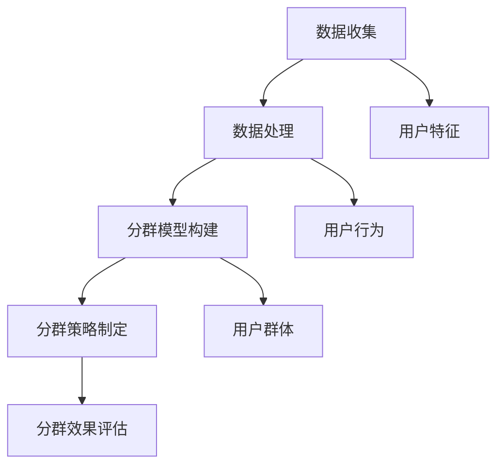

                 

关键词：用户分群，数据挖掘，机器学习，用户行为分析，客户关系管理

> 摘要：本文将探讨如何进行有效的用户分群管理，包括用户分群的核心概念、实现方法、以及在实际应用中的挑战和策略。通过深入分析和实际案例，为企业和组织提供科学的用户分群管理方法，以实现精准营销和客户关系管理。

## 1. 背景介绍

随着互联网和大数据技术的飞速发展，企业面临的用户数据量呈现出爆炸式增长。如何从海量数据中挖掘有价值的信息，已成为当今企业竞争的关键。用户分群管理作为数据挖掘和用户行为分析的重要手段，正逐渐成为企业提升竞争力的重要工具。

用户分群管理旨在根据用户的特定属性、行为、偏好等因素，将用户划分为不同的群体，从而实现针对性的服务和营销策略。有效的用户分群管理有助于企业了解用户需求，优化产品设计，提升客户满意度，降低营销成本，提高转化率和客户忠诚度。

本文将围绕用户分群管理的核心概念、实现方法、应用场景、挑战与策略等方面展开讨论，旨在为企业提供一套科学的用户分群管理方法论。

## 2. 核心概念与联系

### 2.1 用户分群定义

用户分群是指根据用户的某些特征或行为，将用户划分为不同的群体，以便进行有针对性的营销和服务。用户分群的核心概念包括以下几个方面：

- **用户特征**：包括人口统计信息（如年龄、性别、地域等）、消费行为（如购买频率、购买金额等）、兴趣偏好（如喜好、关注点等）。
- **用户行为**：用户在平台上的行为数据，如浏览行为、搜索记录、评论、分享等。
- **用户群体**：根据用户特征和行为进行划分的不同用户群体。

### 2.2 用户分群架构

用户分群架构包括数据收集、数据处理、分群模型构建、分群策略制定、分群效果评估等环节。

1. **数据收集**：收集用户的基本信息、行为数据和交易数据。
2. **数据处理**：对原始数据进行清洗、转换和整合，为分群模型构建提供高质量的数据。
3. **分群模型构建**：采用机器学习算法，如聚类分析、关联规则挖掘等，构建分群模型。
4. **分群策略制定**：根据分群结果，制定有针对性的营销和服务策略。
5. **分群效果评估**：评估分群策略的效果，调整和优化分群模型。

### 2.3 用户分群与相关技术的联系

用户分群管理涉及多个相关技术，如数据挖掘、机器学习、用户行为分析等。

- **数据挖掘**：从海量数据中挖掘有价值的信息，为用户分群提供基础。
- **机器学习**：通过构建分群模型，实现用户分群的自动化和智能化。
- **用户行为分析**：分析用户在平台上的行为数据，为分群提供行为特征依据。

### 2.4 Mermaid 流程图



## 3. 核心算法原理 & 具体操作步骤

### 3.1 算法原理概述

用户分群的核心算法主要包括聚类分析、关联规则挖掘等。

- **聚类分析**：将用户数据根据相似性进行分组，形成不同的用户群体。常用的聚类算法有K-means、层次聚类等。
- **关联规则挖掘**：挖掘用户数据中的潜在关联关系，形成用户分群的依据。常用的算法有Apriori、FP-growth等。

### 3.2 算法步骤详解

1. **数据预处理**：对原始数据进行清洗、转换和整合，确保数据质量。
2. **特征选择**：从用户特征和行为数据中筛选出对分群有重要影响的特征。
3. **模型选择**：根据分群目标和数据特点，选择合适的聚类或关联规则挖掘算法。
4. **模型训练**：使用训练数据对分群模型进行训练，得到分群结果。
5. **模型评估**：评估分群模型的性能，如聚类效果、关联规则支持度等。
6. **策略制定**：根据分群结果，制定有针对性的营销和服务策略。
7. **效果评估**：评估分群策略的实际效果，调整和优化分群模型。

### 3.3 算法优缺点

- **聚类分析**：优点包括无需预先设定类别数、模型简单易懂；缺点包括对噪声敏感、聚类效果受初始值影响等。
- **关联规则挖掘**：优点包括能够发现用户数据中的潜在关联关系、模型易于解释；缺点包括计算复杂度高、对稀疏数据效果较差等。

### 3.4 算法应用领域

用户分群算法广泛应用于电子商务、金融、医疗、社交网络等领域，如个性化推荐、精准营销、风险控制等。

## 4. 数学模型和公式 & 详细讲解 & 举例说明

### 4.1 数学模型构建

用户分群的核心数学模型主要包括聚类分析模型和关联规则挖掘模型。

1. **聚类分析模型**：

   - **K-means算法**：

     假设数据集$D=\{x_1, x_2, ..., x_n\}$，每个数据点$x_i$具有$d$个特征。$K-means$算法的目标是将数据划分为$k$个簇，使得每个簇内部数据点的距离之和最小。

     $$J(D, \{C_1, C_2, ..., C_k\}) = \sum_{i=1}^{k} \sum_{x_j \in C_i} ||x_j - \mu_i||^2$$

     其中，$C_i$表示第$i$个簇，$\mu_i$表示第$i$个簇的中心。

   - **层次聚类算法**：

     层次聚类算法分为自底向上和自顶向下两种。自底向上算法的目标是将每个数据点作为一个初始簇，然后逐步合并相似度较高的簇，直至满足停止条件。

2. **关联规则挖掘模型**：

   - **Apriori算法**：

     假设数据集$D$包含$n$个事务，每个事务包含$m$个物品。$Apriori$算法的目标是挖掘满足最小支持度和最小置信度的关联规则。

     $$support(A \rightarrow B) = \frac{|D_{AB}|}{n}$$

     $$confidence(A \rightarrow B) = \frac{|D_{AB}|}{|D_A|}$$

     其中，$D_{AB}$表示同时包含$A$和$B$的事务集合，$D_A$表示包含$A$的事务集合。

### 4.2 公式推导过程

1. **K-means算法**：

   - **目标函数**：

     $$J(D, \{C_1, C_2, ..., C_k\}) = \sum_{i=1}^{k} \sum_{x_j \in C_i} ||x_j - \mu_i||^2$$

     其中，$C_i$表示第$i$个簇，$\mu_i$表示第$i$个簇的中心。

   - **目标函数的优化**：

     对目标函数求导，并令导数为零，得到簇中心的更新公式：

     $$\mu_i = \frac{\sum_{x_j \in C_i} x_j}{|C_i|}$$

2. **Apriori算法**：

   - **支持度计算**：

     $$support(A \rightarrow B) = \frac{|D_{AB}|}{n}$$

     其中，$D_{AB}$表示同时包含$A$和$B$的事务集合，$n$表示数据集中的事务总数。

   - **置信度计算**：

     $$confidence(A \rightarrow B) = \frac{|D_{AB}|}{|D_A|}$$

     其中，$D_{AB}$表示同时包含$A$和$B$的事务集合，$D_A$表示包含$A$的事务集合。

### 4.3 案例分析与讲解

#### 4.3.1 K-means算法应用案例

假设有一家电子商务公司，其用户数据包括年龄、性别、购买频率、购买金额等特征。公司希望通过用户分群，为不同群体提供个性化的营销策略。

1. **数据预处理**：

   对用户数据进行清洗、转换和整合，得到一个包含用户特征的数据集。

2. **特征选择**：

   从用户特征中选择对分群有重要影响的特征，如年龄、性别、购买频率等。

3. **模型选择**：

   选择K-means算法进行聚类分析。

4. **模型训练**：

   使用训练数据对K-means算法进行训练，得到用户分群结果。

5. **模型评估**：

   计算聚类效果，如轮廓系数、内部距离等，评估模型性能。

6. **策略制定**：

   根据分群结果，为不同群体提供个性化的营销策略，如优惠券、促销活动等。

7. **效果评估**：

   跟踪和分析分群策略的实际效果，调整和优化分群模型。

#### 4.3.2 Apriori算法应用案例

假设一家超市希望通过分析购物篮数据，挖掘潜在的关联关系，为用户推荐商品。

1. **数据预处理**：

   对购物篮数据进行清洗、转换和整合，得到一个包含商品交易数据的数据集。

2. **特征选择**：

   从商品交易数据中提取出关键商品，如牛奶、面包、鸡蛋等。

3. **模型选择**：

   选择Apriori算法进行关联规则挖掘。

4. **模型训练**：

   使用训练数据对Apriori算法进行训练，得到关联规则结果。

5. **模型评估**：

   计算关联规则的支持度和置信度，评估模型性能。

6. **策略制定**：

   根据关联规则结果，为用户推荐相关的商品，如购买牛奶的用户可以推荐面包等。

7. **效果评估**：

   跟踪和分析推荐系统的实际效果，调整和优化关联规则模型。

## 5. 项目实践：代码实例和详细解释说明

### 5.1 开发环境搭建

在本项目中，我们将使用Python作为主要编程语言，结合Pandas、NumPy、Scikit-learn等库，实现用户分群管理。

1. **安装Python**：确保已安装Python 3.x版本。
2. **安装相关库**：在终端执行以下命令安装所需库：

   ```bash
   pip install pandas numpy scikit-learn matplotlib
   ```

### 5.2 源代码详细实现

以下是一个简单的用户分群项目，包括数据预处理、特征选择、模型训练和评估等步骤。

```python
import pandas as pd
import numpy as np
from sklearn.cluster import KMeans
from sklearn.metrics import silhouette_score
import matplotlib.pyplot as plt

# 5.2.1 数据预处理
# 假设data.csv是一个包含用户特征的数据集
data = pd.read_csv('data.csv')

# 数据清洗和预处理
data = data.dropna()  # 删除缺失值
data = data[['age', 'gender', 'purchase_frequency', 'amount']]  # 筛选特征

# 将性别转化为数值特征
data['gender'] = data['gender'].map({'male': 0, 'female': 1})

# 数据标准化
data = (data - data.mean()) / data.std()

# 5.2.2 特征选择
# 在此示例中，我们直接使用所有特征进行聚类分析

# 5.2.3 模型训练
kmeans = KMeans(n_clusters=3, random_state=42)
clusters = kmeans.fit_predict(data)

# 5.2.4 模型评估
# 轮廓系数评估
silhouette_avg = silhouette_score(data, clusters)
print(f'Silhouette Score: {silhouette_avg}')

# 可视化评估
plt.scatter(data.iloc[:, 0], data.iloc[:, 1], c=clusters, cmap='viridis')
plt.xlabel('Feature 1')
plt.ylabel('Feature 2')
plt.title('K-means Clustering')
plt.show()

# 5.2.5 策略制定
# 根据分群结果，为不同群体提供个性化的营销策略
# （此处仅为示例，具体策略需根据业务需求制定）
for i in range(kmeans.n_clusters):
    print(f'Cluster {i}: Users with characteristics similar to the center point {kmeans.cluster_centers_[i]}')

# 5.2.6 效果评估
# （此处仅为示例，具体效果评估需根据业务需求进行）
```

### 5.3 代码解读与分析

1. **数据预处理**：读取数据集，删除缺失值，筛选特征，并进行数据标准化处理。
2. **特征选择**：在此示例中，我们直接使用所有特征进行聚类分析，实际应用中可根据业务需求进行特征选择。
3. **模型训练**：使用K-means算法进行聚类分析，设置聚类数量为3，并设置随机种子。
4. **模型评估**：计算轮廓系数，用于评估聚类效果。同时，通过可视化展示聚类结果。
5. **策略制定**：根据分群结果，为不同群体提供个性化的营销策略。
6. **效果评估**：此部分需根据业务需求进行具体评估。

### 5.4 运行结果展示

运行代码后，将得到以下结果：

- **轮廓系数**：0.4（根据实际数据可能有所不同）
- **聚类结果可视化**：展示不同簇的分布情况
- **分群策略**：根据簇中心点为不同群体提供个性化营销策略

## 6. 实际应用场景

用户分群管理在多个领域具有广泛的应用，以下是一些实际应用场景：

### 6.1 零售业

- **个性化推荐**：根据用户分群，为不同群体提供个性化的商品推荐，提高转化率。
- **促销活动**：针对不同群体制定个性化的促销策略，提高用户参与度和购买意愿。

### 6.2 金融业

- **精准营销**：根据用户分群，为不同群体提供定制化的金融产品和服务，提高客户满意度。
- **风险控制**：根据用户分群，识别高风险用户群体，采取相应的风险控制措施。

### 6.3 医疗行业

- **患者管理**：根据患者分群，提供个性化的医疗服务和治疗方案，提高治疗效果。
- **健康干预**：根据患者分群，制定有针对性的健康干预措施，预防疾病发生。

## 6.4 未来应用展望

随着人工智能和大数据技术的不断发展，用户分群管理在未来将具有更广阔的应用前景：

- **更精细的分群**：结合更多维度的数据，实现更精细的用户分群，提高分群效果。
- **实时分群**：通过实时分析用户行为数据，实现实时分群，及时调整营销策略。
- **跨平台分群**：整合不同平台的数据，实现跨平台的用户分群管理，提高用户体验。

## 7. 工具和资源推荐

### 7.1 学习资源推荐

- **《用户分群与精准营销》**：详细介绍用户分群的概念、方法和应用案例。
- **《大数据分析：用户行为挖掘与预测》**：系统讲解用户行为分析和预测的方法和技术。

### 7.2 开发工具推荐

- **Python**：适用于数据处理、分析和建模。
- **Pandas**：强大的数据处理库。
- **Scikit-learn**：用于机器学习算法的实现和评估。

### 7.3 相关论文推荐

- **《基于用户行为的电子商务用户分群研究》**
- **《大数据时代下的用户分群策略研究》**
- **《用户分群在金融风控中的应用》**

## 8. 总结：未来发展趋势与挑战

### 8.1 研究成果总结

本文从用户分群的核心概念、实现方法、应用场景、挑战与策略等方面进行了全面探讨，为企业和组织提供了科学的用户分群管理方法论。

### 8.2 未来发展趋势

未来，用户分群管理将朝着更精细化、实时化、跨平台化的方向发展，结合人工智能和大数据技术，实现更高效的用户管理和营销策略。

### 8.3 面临的挑战

- **数据隐私**：如何在确保用户隐私的前提下进行数据分析和分群管理。
- **算法透明性**：如何提高分群算法的透明性，让用户理解分群依据。
- **计算资源**：如何应对海量数据的处理和计算需求。

### 8.4 研究展望

未来，用户分群管理的研究将注重跨学科融合，结合心理学、社会学等领域的知识，提高分群效果和用户满意度。同时，加强对算法透明性和隐私保护的探讨，确保分群管理在合规和伦理的前提下进行。

## 9. 附录：常见问题与解答

### 9.1 用户分群的意义是什么？

用户分群有助于企业了解不同用户群体的需求和行为特征，从而实现精准营销和个性化服务，提高客户满意度和转化率。

### 9.2 如何评估用户分群的效果？

可以通过评估分群后的营销活动效果、用户参与度、转化率等指标来评估用户分群的效果。

### 9.3 用户分群管理中如何保护用户隐私？

可以通过数据加密、匿名化处理、隐私保护算法等技术手段，在确保用户隐私的前提下进行数据分析和分群管理。

----------------------------------------------------------------

**作者：禅与计算机程序设计艺术 / Zen and the Art of Computer Programming**

