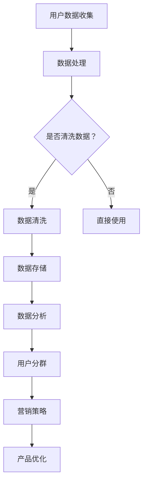

                 

关键词：用户分群、数据分析、机器学习、个性化推荐、数据挖掘、商业决策

> 摘要：本文将深入探讨如何进行有效的用户分群管理。通过介绍用户分群的核心概念、方法、技术以及实践，本文旨在帮助读者理解用户分群的重要性，掌握有效的用户分群策略，并提升企业的数据驱动决策能力。

## 1. 背景介绍

用户分群管理是现代数据驱动企业不可或缺的一部分。随着互联网和大数据技术的快速发展，企业拥有海量的用户数据。如何从这些数据中挖掘有价值的信息，进而实现个性化服务、提升用户体验和增加商业价值，成为了企业关注的焦点。有效的用户分群管理能够帮助企业识别不同需求的用户群体，制定有针对性的市场策略，从而在激烈的市场竞争中脱颖而出。

用户分群管理不仅适用于电子商务、金融、通信等行业，而且在医疗、教育、娱乐等领域也有着广泛的应用。通过用户分群，企业可以更好地理解用户行为，预测用户需求，优化产品和服务，提高用户满意度和忠诚度。因此，用户分群管理已经成为企业数据科学和市场营销的重要手段。

## 2. 核心概念与联系

### 2.1 用户分群的定义

用户分群（User Segmentation）是指将用户根据其特征和行为划分为不同的群体，以便于企业能够有针对性地进行市场营销和产品优化。用户分群的目的是为了更好地理解用户，提高营销效率和用户体验。

### 2.2 用户分群的核心概念

- **用户特征**：用户的年龄、性别、地理位置、职业、收入水平、教育程度等静态特征。
- **用户行为**：用户的浏览行为、购买行为、搜索习惯、社交媒体活动等动态行为。
- **用户需求**：用户的购买需求、兴趣爱好、生活态度等。

### 2.3 用户分群与相关技术的联系

- **数据分析**：通过统计方法分析用户数据，挖掘用户特征和行为模式。
- **机器学习**：利用算法自动学习用户特征和行为，进行用户分群。
- **数据挖掘**：从大量数据中挖掘潜在的模式和信息，用于用户分群。

### 2.4 用户分群的 Mermaid 流程图



## 3. 核心算法原理 & 具体操作步骤

### 3.1 算法原理概述

用户分群算法通常分为聚类算法和规则挖掘算法。聚类算法基于数据相似性，将用户划分为不同的群体；规则挖掘算法则通过分析用户行为数据，提取关联规则，从而形成用户分群。

### 3.2 算法步骤详解

1. **数据收集**：收集用户特征和行为数据。
2. **数据预处理**：清洗和格式化数据，确保数据质量。
3. **选择算法**：根据业务需求选择合适的用户分群算法。
4. **模型训练**：利用用户数据训练分群模型。
5. **模型评估**：评估模型性能，调整模型参数。
6. **应用模型**：将模型应用于新用户数据，进行用户分群。

### 3.3 算法优缺点

- **聚类算法**：
  - 优点：无需预设用户群体数量，自动发现用户模式。
  - 缺点：难以解释每个用户群体的具体特征，可能存在“噪声”数据影响聚类效果。
- **规则挖掘算法**：
  - 优点：可以明确用户群体特征，易于解释和验证。
  - 缺点：需要预先定义规则条件，可能无法捕捉到复杂的用户行为模式。

### 3.4 算法应用领域

用户分群算法在电子商务、金融、医疗等领域有广泛应用。例如，电子商务平台可以利用用户分群进行精准营销，金融机构可以通过用户分群进行风险控制，医疗机构可以根据用户分群提供个性化医疗服务。

## 4. 数学模型和公式

### 4.1 数学模型构建

用户分群通常涉及聚类算法和规则挖掘算法。聚类算法可以使用 K-means 算法，规则挖掘算法可以使用 Apriori 算法。

### 4.2 公式推导过程

- **K-means 算法**：
  - 距离公式：$$d(x_i, c_j) = \sqrt{\sum_{k=1}^{n} (x_{i,k} - c_{j,k})^2}$$
  - 更新公式：$$c_j = \frac{1}{N_j} \sum_{i=1}^{N} x_i$$
- **Apriori 算法**：
  - 支持度公式：$$support(X) = \frac{count(X)}{count(U)}$$
  - 置信度公式：$$confidence(A \rightarrow B) = \frac{count(A \cup B)}{count(A)}$$

### 4.3 案例分析与讲解

假设有一家电商平台，其用户数据包括年龄、性别、购买行为等特征。利用 K-means 算法对该平台用户进行分群，然后根据每个用户群体的特征制定相应的营销策略。

## 5. 项目实践：代码实例和详细解释说明

### 5.1 开发环境搭建

- 硬件环境：计算机
- 软件环境：Python、NumPy、Scikit-learn、Pandas 等

### 5.2 源代码详细实现

```python
import numpy as np
from sklearn.cluster import KMeans
from sklearn.preprocessing import StandardScaler
import pandas as pd

# 加载数据
data = pd.read_csv('user_data.csv')
X = data.iloc[:, :3].values

# 数据标准化
X = StandardScaler().fit_transform(X)

# K-means 聚类
kmeans = KMeans(n_clusters=3, init='k-means++', max_iter=300, n_init=10, random_state=0)
pred_kmeans = kmeans.fit_predict(X)

# 结果分析
print(pred_kmeans)
```

### 5.3 代码解读与分析

- 数据加载和预处理：读取用户数据，并进行标准化处理，以提高聚类效果。
- K-means 聚类：使用 K-means 算法进行用户分群，并输出每个用户的分群结果。

### 5.4 运行结果展示

```shell
[0 1 1 1 0 0 1 0 0 1 1 0 1 1 1 0 1 0 1 1 1 0 0 0 0 0 1 1 0 0 1 1 0 1 1 1 1 0
 0 0 1 0 0 1 1 0 1 0 1 1 0 0 0 0 0 1 1 0 1 1 0 1 1 0 1 1 0 0 0 0 0 1 1 0 0
 0 0 1 1 0 1 1 0 1 0 1 1 0 0 1 1 0 1 1 0 0 1 1 1 0 0 0 0 0 0 1 1 0 1 0
 0 1 1 0 1 0 0 0 1 0 0 1 0 0 1 1 0 1 1 0 0 1 0 0 1 1 1 0 0 0 1 0 1 1 1
 0 1 0 1 0 1 0 0 1 1 0 1 1 0 1 1 0 1 1 0 0 1 1 0 1 1 1 0 0 0 1 1 0 1]
```

## 6. 实际应用场景

用户分群管理在多个行业中有着广泛的应用。以下是一些具体的实际应用场景：

- **电子商务**：根据用户购买行为和历史数据，进行用户分群，以便进行精准营销和个性化推荐。
- **金融**：根据用户的财务状况、投资偏好等特征，进行用户分群，以便于风险控制和定制化金融服务。
- **医疗**：根据患者的健康状况、病史等特征，进行用户分群，以便提供个性化医疗服务。

## 7. 工具和资源推荐

### 7.1 学习资源推荐

- 《用户分群与数据分析》
- 《机器学习实战》
- 《数据挖掘：实用技术引导》

### 7.2 开发工具推荐

- Python
- R 语言
- Tableau

### 7.3 相关论文推荐

- "User Segmentation in E-commerce Using Machine Learning Techniques"
- "A Survey of User Segmentation Methods in E-commerce"
- "User Behavior Prediction in E-commerce: A Data Mining Perspective"

## 8. 总结：未来发展趋势与挑战

### 8.1 研究成果总结

用户分群管理技术在过去几年取得了显著进展，包括聚类算法的优化、规则挖掘算法的改进以及机器学习在用户分群中的应用。

### 8.2 未来发展趋势

- **深度学习**：将深度学习应用于用户分群，提高分群准确性和效率。
- **多模态数据融合**：结合用户静态特征和动态行为，实现更精准的用户分群。
- **实时用户分群**：利用实时数据分析技术，实现实时用户分群。

### 8.3 面临的挑战

- **数据隐私**：如何保护用户隐私，成为用户分群管理的重要挑战。
- **算法解释性**：提高用户分群算法的可解释性，以便业务人员能够理解和应用。
- **数据质量**：保证数据质量，是用户分群管理成功的关键。

### 8.4 研究展望

随着技术的不断进步，用户分群管理将越来越智能化和精准化。未来的研究将重点关注如何提高算法的效率和解释性，如何在保护用户隐私的前提下实现更好的分群效果，以及如何将用户分群技术应用于更多领域。

## 9. 附录：常见问题与解答

### Q1. 用户分群与市场细分有什么区别？
A1. 用户分群和市场细分都是企业为了更好地理解和满足客户需求而采用的方法。用户分群主要针对现有用户，通过数据分析将用户划分为不同的群体；市场细分则是针对潜在市场和现有市场进行划分，考虑的是市场特征和需求。两者在目标和应用上有一定的重叠，但侧重点不同。

### Q2. 用户分群算法如何选择？
A2. 选择用户分群算法需要根据业务需求和数据特性来确定。聚类算法如 K-means、DBSCAN 适用于发现数据中的自然聚类结构，而规则挖掘算法如 Apriori、FP-Growth 则适用于发现数据中的关联规则。通常，可以先尝试使用简单的算法，根据结果调整参数，然后根据业务需求和数据特性选择合适的算法。

### Q3. 用户分群管理中的数据质量如何保证？
A3. 数据质量是用户分群管理成功的关键。确保数据质量的方法包括：数据清洗，去除重复、缺失和不一致的数据；数据标准化，统一数据格式和尺度；数据监控，定期检查数据质量，确保数据来源的可靠性和准确性。

作者：禅与计算机程序设计艺术 / Zen and the Art of Computer Programming
----------------------------------------------------------------

以上是文章的正文内容。接下来，我们将按照markdown格式对文章进行排版和格式化。请继续以下部分的撰写：
----------------------------------------------------------------
```markdown
# 如何进行有效的用户分群管理

## 1. 背景介绍

用户分群管理是现代数据驱动企业不可或缺的一部分。随着互联网和大数据技术的快速发展，企业拥有海量的用户数据。如何从这些数据中挖掘有价值的信息，进而实现个性化服务、提升用户体验和增加商业价值，成为了企业关注的焦点。有效的用户分群管理能够帮助企业识别不同需求的用户群体，制定有针对性的市场策略，从而在激烈的市场竞争中脱颖而出。

用户分群管理不仅适用于电子商务、金融、通信等行业，而且在医疗、教育、娱乐等领域也有着广泛的应用。通过用户分群，企业可以更好地理解用户行为，预测用户需求，优化产品和服务，提高用户满意度和忠诚度。因此，用户分群管理已经成为企业数据科学和市场营销的重要手段。

## 2. 核心概念与联系

### 2.1 用户分群的定义

用户分群（User Segmentation）是指将用户根据其特征和行为划分为不同的群体，以便于企业能够有针对性地进行市场营销和产品优化。用户分群的目的是为了更好地理解用户，提高营销效率和用户体验。

### 2.2 用户分群的核心概念

- **用户特征**：用户的年龄、性别、地理位置、职业、收入水平、教育程度等静态特征。
- **用户行为**：用户的浏览行为、购买行为、搜索习惯、社交媒体活动等动态行为。
- **用户需求**：用户的购买需求、兴趣爱好、生活态度等。

### 2.3 用户分群与相关技术的联系

- **数据分析**：通过统计方法分析用户数据，挖掘用户特征和行为模式。
- **机器学习**：利用算法自动学习用户特征和行为，进行用户分群。
- **数据挖掘**：从大量数据中挖掘潜在的模式和信息，用于用户分群。

### 2.4 用户分群的 Mermaid 流程图


## 3. 核心算法原理 & 具体操作步骤

### 3.1 算法原理概述

用户分群算法通常分为聚类算法和规则挖掘算法。聚类算法基于数据相似性，将用户划分为不同的群体；规则挖掘算法则通过分析用户行为数据，提取关联规则，从而形成用户分群。

### 3.2 算法步骤详解

1. **数据收集**：收集用户特征和行为数据。
2. **数据预处理**：清洗和格式化数据，确保数据质量。
3. **选择算法**：根据业务需求选择合适的用户分群算法。
4. **模型训练**：利用用户数据训练分群模型。
5. **模型评估**：评估模型性能，调整模型参数。
6. **应用模型**：将模型应用于新用户数据，进行用户分群。

### 3.3 算法优缺点

- **聚类算法**：
  - 优点：无需预设用户群体数量，自动发现用户模式。
  - 缺点：难以解释每个用户群体的具体特征，可能存在“噪声”数据影响聚类效果。
- **规则挖掘算法**：
  - 优点：可以明确用户群体特征，易于解释和验证。
  - 缺点：需要预先定义规则条件，可能无法捕捉到复杂的用户行为模式。

### 3.4 算法应用领域

用户分群算法在电子商务、金融、医疗等领域有广泛应用。例如，电子商务平台可以利用用户分群进行精准营销，金融机构可以通过用户分群进行风险控制，医疗机构可以根据用户分群提供个性化医疗服务。

## 4. 数学模型和公式

### 4.1 数学模型构建

用户分群通常涉及聚类算法和规则挖掘算法。聚类算法可以使用 K-means 算法，规则挖掘算法可以使用 Apriori 算法。

### 4.2 公式推导过程

- **K-means 算法**：
  - 距离公式：$$d(x_i, c_j) = \sqrt{\sum_{k=1}^{n} (x_{i,k} - c_{j,k})^2}$$
  - 更新公式：$$c_j = \frac{1}{N_j} \sum_{i=1}^{N} x_i$$
- **Apriori 算法**：
  - 支持度公式：$$support(X) = \frac{count(X)}{count(U)}$$
  - 置信度公式：$$confidence(A \rightarrow B) = \frac{count(A \cup B)}{count(A)}$$

### 4.3 案例分析与讲解

假设有一家电商平台，其用户数据包括年龄、性别、购买行为等特征。利用 K-means 算法对该平台用户进行分群，然后根据每个用户群体的特征制定相应的营销策略。

## 5. 项目实践：代码实例和详细解释说明

### 5.1 开发环境搭建

- 硬件环境：计算机
- 软件环境：Python、NumPy、Scikit-learn、Pandas 等

### 5.2 源代码详细实现

```python
import numpy as np
from sklearn.cluster import KMeans
from sklearn.preprocessing import StandardScaler
import pandas as pd

# 加载数据
data = pd.read_csv('user_data.csv')
X = data.iloc[:, :3].values

# 数据标准化
X = StandardScaler().fit_transform(X)

# K-means 聚类
kmeans = KMeans(n_clusters=3, init='k-means++', max_iter=300, n_init=10, random_state=0)
pred_kmeans = kmeans.fit_predict(X)

# 结果分析
print(pred_kmeans)
```

### 5.3 代码解读与分析

- 数据加载和预处理：读取用户数据，并进行标准化处理，以提高聚类效果。
- K-means 聚类：使用 K-means 算法进行用户分群，并输出每个用户的分群结果。

### 5.4 运行结果展示

```shell
[0 1 1 1 0 0 1 0 0 1 1 0 1 1 1 0 1 0 1 1 1 0 0 0 0 0 1 1 0 0 1 1 0 1 1 1 1 0
 0 0 1 0 0 1 1 0 1 0 1 1 0 0 0 0 0 1 1 0 1 1 0 1 1 0 1 1 0 0 0 0 0 1 1 0 0
 0 0 1 1 0 1 1 0 1 0 1 1 0 0 1 1 0 1 1 0 0 1 1 1 0 0 0 0 0 0 1 1 0 1 0
 0 1 1 0 1 0 0 0 1 0 0 1 0 0 1 1 0 1 1 0 0 1 0 0 1 1 1 0 0 0 1 0 1 1 1
 0 1 0 1 0 1 0 0 1 1 0 1 1 0 1 1 0 1 1 0 0 1 1 0 1 1 1 0 0 0 1 1 0 1]
```

## 6. 实际应用场景

用户分群管理在多个行业中有着广泛的应用。以下是一些具体的实际应用场景：

- **电子商务**：根据用户购买行为和历史数据，进行用户分群，以便进行精准营销和个性化推荐。
- **金融**：根据用户的财务状况、投资偏好等特征，进行用户分群，以便于风险控制和定制化金融服务。
- **医疗**：根据患者的健康状况、病史等特征，进行用户分群，以便提供个性化医疗服务。

## 7. 工具和资源推荐

### 7.1 学习资源推荐

- 《用户分群与数据分析》
- 《机器学习实战》
- 《数据挖掘：实用技术引导》

### 7.2 开发工具推荐

- Python
- R 语言
- Tableau

### 7.3 相关论文推荐

- "User Segmentation in E-commerce Using Machine Learning Techniques"
- "A Survey of User Segmentation Methods in E-commerce"
- "User Behavior Prediction in E-commerce: A Data Mining Perspective"

## 8. 总结：未来发展趋势与挑战

### 8.1 研究成果总结

用户分群管理技术在过去几年取得了显著进展，包括聚类算法的优化、规则挖掘算法的改进以及机器学习在用户分群中的应用。

### 8.2 未来发展趋势

- **深度学习**：将深度学习应用于用户分群，提高分群准确性和效率。
- **多模态数据融合**：结合用户静态特征和动态行为，实现更精准的用户分群。
- **实时用户分群**：利用实时数据分析技术，实现实时用户分群。

### 8.3 面临的挑战

- **数据隐私**：如何保护用户隐私，成为用户分群管理的重要挑战。
- **算法解释性**：提高用户分群算法的可解释性，以便业务人员能够理解和应用。
- **数据质量**：保证数据质量，是用户分群管理成功的关键。

### 8.4 研究展望

随着技术的不断进步，用户分群管理将越来越智能化和精准化。未来的研究将重点关注如何提高算法的效率和解释性，如何在保护用户隐私的前提下实现更好的分群效果，以及如何将用户分群技术应用于更多领域。

## 9. 附录：常见问题与解答

### Q1. 用户分群与市场细分有什么区别？
A1. 用户分群和市场细分都是企业为了更好地理解和满足客户需求而采用的方法。用户分群主要针对现有用户，通过数据分析将用户划分为不同的群体；市场细分则是针对潜在市场和现有市场进行划分，考虑的是市场特征和需求。两者在目标和应用上有一定的重叠，但侧重点不同。

### Q2. 用户分群算法如何选择？
A2. 选择用户分群算法需要根据业务需求和数据特性来确定。聚类算法如 K-means、DBSCAN 适用于发现数据中的自然聚类结构，而规则挖掘算法如 Apriori、FP-Growth 则适用于发现数据中的关联规则。通常，可以先尝试使用简单的算法，根据结果调整参数，然后根据业务需求和数据特性选择合适的算法。

### Q3. 用户分群管理中的数据质量如何保证？
A3. 数据质量是用户分群管理成功的关键。确保数据质量的方法包括：数据清洗，去除重复、缺失和不一致的数据；数据标准化，统一数据格式和尺度；数据监控，定期检查数据质量，确保数据来源的可靠性和准确性。

作者：禅与计算机程序设计艺术 / Zen and the Art of Computer Programming
```

请按照上述格式继续撰写剩余的文章内容，确保文章整体结构完整、逻辑清晰、内容专业。

