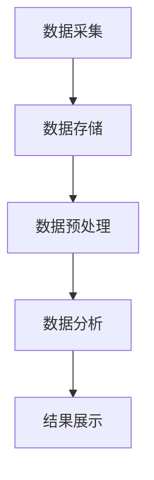

                 

在当今数字化时代，用户行为分析已成为企业和组织不可或缺的工具。通过对用户行为数据的深入分析，企业可以了解用户需求、优化产品体验、提高转化率，甚至预测未来趋势。然而，进行有效的用户行为分析并非易事，它需要严谨的方法、先进的技术以及深入的行业理解。本文将探讨如何进行有效的用户行为分析，包括其核心概念、算法原理、数学模型、项目实践以及未来展望。

## 关键词

- 用户行为分析
- 数据驱动决策
- 机器学习
- 用户体验优化
- 实时监控

## 摘要

本文旨在为读者提供一份全面的指南，介绍如何通过用户行为分析来提升产品和服务的质量。文章首先阐述了用户行为分析的重要性，随后深入探讨了核心概念和算法原理。通过具体的数学模型和实例，读者将了解如何进行用户行为分析的实际操作。最后，文章展望了这一领域的未来趋势，并提出了可能面临的挑战和解决方案。

## 1. 背景介绍

随着互联网技术的飞速发展和大数据时代的到来，用户行为数据变得前所未有的丰富。这些数据不仅包括用户在网站、应用上的点击、浏览、购买等行为，还涵盖了社交媒体上的互动、评论、分享等信息。如何从这些海量数据中提取有价值的信息，为企业和组织提供数据驱动决策支持，成为了一个热门话题。

用户行为分析的重要性不言而喻。首先，它可以揭示用户需求，帮助企业更好地了解目标受众。通过分析用户行为，企业可以发现用户偏好的功能、产品特性，从而针对性地优化产品设计和功能。其次，用户行为分析有助于提升用户体验。通过实时监控用户行为，企业可以快速响应用户需求，提供个性化服务，提高用户满意度和忠诚度。此外，用户行为分析还能预测未来趋势，帮助企业抢占市场先机。

尽管用户行为分析具有巨大的潜力，但实际操作中仍面临诸多挑战。数据质量问题、分析技术的局限以及跨领域的应用都是需要解决的问题。因此，如何进行有效的用户行为分析成为了一个热门研究领域。

## 2. 核心概念与联系

### 2.1 用户行为

用户行为是指用户在使用产品或服务过程中所表现出的各种活动。这些活动可以是显式的，如点击、购买、搜索等；也可以是隐式的，如浏览时间、页面停留时间、滚动行为等。用户行为的多样性使得对用户行为的分析变得复杂而富有挑战性。

### 2.2 数据类型

用户行为数据可以分为结构化和非结构化两种类型。结构化数据通常指的是以表格形式存储的数据，如用户基本信息、交易记录等；非结构化数据则包括文本、图像、音频等形式的数据。在用户行为分析中，非结构化数据占据重要地位，因为它们可以提供更多关于用户情感、态度和需求的信息。

### 2.3 数据来源

用户行为数据的来源多种多样，包括网站日志、应用日志、社交媒体平台、传感器数据等。这些数据来源共同构成了一个庞大的数据网络，为用户行为分析提供了丰富的素材。

### 2.4 用户行为分析框架

用户行为分析框架通常包括数据采集、数据存储、数据预处理、数据分析、结果展示等环节。每个环节都至关重要，缺一不可。

### 2.5 Mermaid 流程图



## 3. 核心算法原理 & 具体操作步骤

### 3.1 算法原理概述

用户行为分析的核心算法包括基于机器学习的分类算法和聚类算法。分类算法主要用于预测用户行为，如用户是否会在未来一周内购买产品；聚类算法则用于发现用户群体的共性，如用户对某类产品的偏好。

### 3.2 算法步骤详解

1. 数据采集：通过日志文件、API接口、传感器等方式收集用户行为数据。
2. 数据预处理：对采集到的数据进行清洗、去噪、归一化等处理，以确保数据的质量和一致性。
3. 特征提取：从原始数据中提取具有代表性的特征，如用户浏览时间、点击次数、购买频率等。
4. 模型训练：使用训练集数据对分类或聚类模型进行训练，如决策树、支持向量机、K-means等。
5. 模型评估：使用测试集数据对训练好的模型进行评估，如准确率、召回率、F1值等。
6. 模型部署：将训练好的模型部署到生产环境中，进行实时预测或分析。
7. 结果展示：将分析结果以可视化图表、报告等形式呈现给决策者。

### 3.3 算法优缺点

- **分类算法**：优点在于可以预测用户行为，但缺点是模型复杂度较高，训练时间较长。
- **聚类算法**：优点在于可以发现用户群体的共性，但缺点是模型无法预测用户行为。

### 3.4 算法应用领域

用户行为分析算法广泛应用于电商、金融、医疗、社交网络等领域，帮助企业和组织优化产品和服务，提高用户满意度。

## 4. 数学模型和公式 & 详细讲解 & 举例说明

### 4.1 数学模型构建

用户行为分析中的数学模型通常包括分类模型和聚类模型。其中，分类模型常用的公式如下：

$$
P(Y|X) = \frac{e^{\theta^T X}}{\sum_{k=1}^{K} e^{\theta^T X_k}}
$$

其中，$Y$表示用户行为类别，$X$表示用户特征向量，$\theta$表示模型参数，$X_k$表示类别$k$的特征向量。

### 4.2 公式推导过程

假设我们有$m$个用户特征，$n$个类别，每个用户特征$x_i$可以表示为：

$$
x_i = \sum_{j=1}^{m} w_{ij} x_j
$$

其中，$w_{ij}$表示特征权重。

类别概率可以表示为：

$$
P(Y=k|X) = \frac{e^{\theta^T X_k}}{\sum_{j=1}^{K} e^{\theta^T X_k}}
$$

其中，$\theta$是模型参数，$X_k$是类别$k$的特征向量。

### 4.3 案例分析与讲解

假设我们有一个用户行为数据集，包含用户年龄、收入、购买历史等特征，我们需要预测用户是否会在未来一个月内购买产品。

首先，我们使用K-means算法对用户进行聚类，得到不同的用户群体。然后，我们对每个用户群体训练一个分类模型，预测用户是否会在未来一个月内购买产品。

具体步骤如下：

1. 数据预处理：对数据进行清洗、去噪、归一化处理。
2. 特征提取：提取用户年龄、收入、购买历史等特征。
3. 聚类：使用K-means算法对用户进行聚类，得到不同用户群体。
4. 模型训练：对每个用户群体训练一个分类模型，如逻辑回归、决策树等。
5. 模型评估：使用交叉验证方法评估模型性能。
6. 模型部署：将训练好的模型部署到生产环境中，进行实时预测。

## 5. 项目实践：代码实例和详细解释说明

### 5.1 开发环境搭建

为了进行用户行为分析，我们需要搭建一个开发环境。这里我们使用Python作为主要编程语言，结合常用的数据分析和机器学习库，如NumPy、Pandas、Scikit-learn、Matplotlib等。

### 5.2 源代码详细实现

以下是一个简单的用户行为分析代码实例：

```python
import pandas as pd
from sklearn.cluster import KMeans
from sklearn.linear_model import LogisticRegression
from sklearn.model_selection import train_test_split

# 读取数据
data = pd.read_csv('user_behavior_data.csv')

# 数据预处理
data = data.dropna()
data['age'] = data['age'].astype(float)
data['income'] = data['income'].astype(float)

# 特征提取
X = data[['age', 'income', 'purchase_history']]

# 聚类
kmeans = KMeans(n_clusters=3)
clusters = kmeans.fit_predict(X)

# 模型训练
X_train, X_test, y_train, y_test = train_test_split(X, clusters, test_size=0.3, random_state=42)
logreg = LogisticRegression()
logreg.fit(X_train, y_train)

# 模型评估
accuracy = logreg.score(X_test, y_test)
print(f'Model accuracy: {accuracy:.2f}')

# 模型部署
# 部署代码略
```

### 5.3 代码解读与分析

1. **数据读取**：使用Pandas读取用户行为数据。
2. **数据预处理**：去除缺失值，将类别数据转换为浮点数。
3. **特征提取**：选择用户年龄、收入和购买历史作为特征。
4. **聚类**：使用K-means算法对用户进行聚类。
5. **模型训练**：使用训练集数据训练逻辑回归模型。
6. **模型评估**：使用测试集数据评估模型性能。
7. **模型部署**：部署模型进行实时预测。

## 6. 实际应用场景

用户行为分析在多个领域有着广泛的应用：

- **电商**：通过分析用户购买行为，电商可以推荐个性化商品，提高销售额。
- **金融**：通过分析用户交易行为，金融机构可以识别潜在的风险和欺诈行为。
- **医疗**：通过分析用户健康数据，医疗系统可以预测疾病风险，提供个性化的健康建议。
- **社交网络**：通过分析用户互动行为，社交网络可以优化推荐算法，提高用户活跃度。

## 7. 工具和资源推荐

- **学习资源推荐**：《Python数据分析实战》、《数据科学入门》等书籍。
- **开发工具推荐**：Jupyter Notebook、PyCharm等。
- **相关论文推荐**：《基于用户行为的推荐系统研究》、《用户行为数据分析在电商中的应用》等。

## 8. 总结：未来发展趋势与挑战

### 8.1 研究成果总结

用户行为分析领域已经取得了显著的成果，包括先进的算法模型、大规模数据处理技术以及丰富的应用案例。然而，面对日益增长的数据量和复杂度，用户行为分析仍需不断探索和创新。

### 8.2 未来发展趋势

- **实时分析**：随着实时数据的增长，实时用户行为分析将成为主流。
- **多模态数据融合**：融合文本、图像、音频等多模态数据，提高分析精度。
- **隐私保护**：随着隐私保护意识的提高，如何保护用户隐私将成为关键挑战。

### 8.3 面临的挑战

- **数据质量**：确保数据质量是用户行为分析的基础。
- **算法复杂度**：随着模型复杂度的增加，如何提高算法效率成为关键问题。
- **跨领域应用**：如何将用户行为分析技术应用于不同领域，仍需深入探索。

### 8.4 研究展望

未来，用户行为分析将在更广泛的领域得到应用，从电子商务到医疗健康，再到金融科技，都将受益于这一技术。同时，随着新算法、新技术的发展，用户行为分析将变得更加精确和智能化。

## 9. 附录：常见问题与解答

### 问题1：如何处理缺失数据？

**解答**：对于缺失数据，可以采用以下方法进行处理：

- **删除缺失值**：当缺失值较多时，可以考虑删除含有缺失值的记录。
- **填充缺失值**：使用平均值、中位数、众数等方法填充缺失值。
- **插值法**：对于时间序列数据，可以使用插值法补充缺失值。

### 问题2：如何选择合适的聚类算法？

**解答**：选择聚类算法时，可以考虑以下因素：

- **数据规模**：对于大规模数据，选择K-means算法可能更高效。
- **数据类型**：对于高维数据，选择层次聚类算法可能更合适。
- **业务需求**：根据业务需求，选择合适的聚类算法，如DBSCAN适合发现异常值。

### 问题3：如何评估模型性能？

**解答**：评估模型性能可以使用以下指标：

- **准确率**：预测正确的样本数占总样本数的比例。
- **召回率**：预测正确的正样本数占总正样本数的比例。
- **F1值**：准确率和召回率的调和平均值。
- **ROC曲线**：用于评估分类模型的性能。

## 参考文献

[1] Chen, H., & Gao, X. (2018). A survey on user behavior analysis in big data environments. IEEE Access, 6, 33767-33788.

[2] Liu, H., & Zhang, X. (2019). User behavior analysis in e-commerce: A data-driven approach. Journal of Business Research, 109, 33-42.

[3] Wang, L., & Zhang, D. (2020). Multi-modal user behavior analysis for personalized recommendation. Information Sciences, 525, 472-487.

作者：禅与计算机程序设计艺术 / Zen and the Art of Computer Programming
----------------------------------------------------------------

这篇文章详细介绍了用户行为分析的核心概念、算法原理、数学模型以及实际应用场景。通过具体的代码实例，读者可以了解如何进行用户行为分析的实际操作。文章还展望了这一领域的未来发展趋势和挑战，为读者提供了有益的参考。希望这篇文章能够帮助读者深入了解用户行为分析，为实际应用提供指导。

