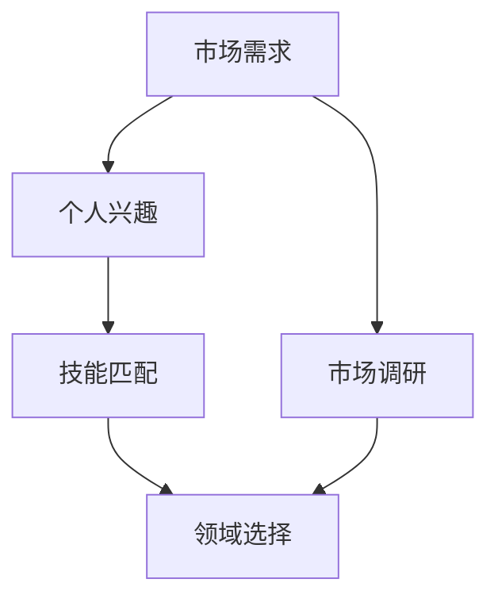

                 

关键词：知识付费、领域选择、IT行业、专业发展、市场调研、个人兴趣、技能匹配

> 摘要：本文将深入探讨如何在当前竞争激烈的IT行业中选择适合自己的知识付费领域。通过分析市场需求、个人兴趣和技能匹配，我们提供了系统的方法和实用指南，帮助读者做出明智的决策，实现个人职业发展和市场价值的最大化。

## 1. 背景介绍

在信息爆炸和数字化转型的时代，知识付费成为了一股不可忽视的潮流。各类在线课程、电子书、专业讲座等知识产品如雨后春笋般涌现，为人们提供了丰富的学习资源。同时，知识付费也成为了许多人实现财富自由和职业发展的途径。然而，面对如此众多的领域和细分市场，如何选择适合自己的知识付费领域，成为一个值得深思的问题。

### 当前知识付费市场现状

- **市场规模持续扩大**：根据市场研究报告，全球知识付费市场规模在逐年增长，预计未来几年将持续保持高速增长态势。

- **用户群体多样化**：知识付费用户涵盖了从学生、职场新人到资深专业人士的各个阶段和行业。

- **领域细分明显**：知识付费领域涵盖了编程、数据科学、人工智能、营销、管理等多个方向，每个领域都有其独特的市场需求和用户需求。

### IT行业知识付费的特点

- **技术更新迅速**：IT行业知识更新快，需要不断学习和跟进新技术，这对知识付费领域的选择提出了更高的要求。

- **专业性强**：IT领域的知识付费通常涉及复杂的技术概念和实践，对讲师的专业素养要求较高。

- **个性化需求突出**：IT行业的知识付费用户往往对内容有较高的个性化需求，希望能够快速掌握实用技能。

## 2. 核心概念与联系

为了更好地理解如何选择适合自己的知识付费领域，我们需要明确几个核心概念，并探讨它们之间的联系。

### 2.1. 市场需求

市场需求是指市场上对某种产品或服务的需求量。在知识付费领域，市场需求决定了哪些领域更具潜力和吸引力。例如，随着大数据和人工智能技术的广泛应用，相关领域的知识付费需求大幅增加。

### 2.2. 个人兴趣

个人兴趣是指个人对某种活动或领域的喜好和热爱。对于知识付费领域的选择，个人兴趣是一个重要的考量因素。当个人对其教授的领域充满热情时，更容易产生高质量的教学内容，从而吸引更多用户。

### 2.3. 技能匹配

技能匹配是指个人的技能和所教授领域的匹配程度。一个擅长编程的人，显然更适合在编程领域开设知识付费课程。技能匹配有助于提高教学效果，也能提升个人的市场竞争力。

### 2.4. 市场需求与个人兴趣、技能匹配的关系

市场需求、个人兴趣和技能匹配之间存在密切的关系。市场需求决定了哪个领域更受欢迎，个人兴趣则决定了个人是否愿意和喜欢在这个领域深耕，而技能匹配则决定了个人是否具备在该领域教学的能力。理想的状态是这三者能够完美结合，从而实现个人和市场的双赢。

### 2.5. Mermaid 流程图



## 3. 核心算法原理 & 具体操作步骤

### 3.1 算法原理概述

选择适合自己的知识付费领域的核心算法原理可以概括为以下三个步骤：

1. **市场调研**：通过分析市场需求，确定哪些领域具有较高的发展潜力和用户需求。
2. **个人兴趣与技能评估**：评估自己的兴趣和技能，找到与市场需求相匹配的领域。
3. **综合评估与决策**：综合考虑市场调研结果、个人兴趣和技能匹配程度，做出最终选择。

### 3.2 算法步骤详解

1. **第一步：市场调研**

   - **数据收集**：通过市场研究报告、在线调查、用户反馈等渠道收集相关数据。
   - **数据分析**：对收集到的数据进行整理和分析，找出增长趋势、用户偏好等信息。

2. **第二步：个人兴趣与技能评估**

   - **兴趣评估**：通过自我反思、与朋友或同事交流等方式，了解自己的兴趣所在。
   - **技能评估**：通过学历背景、工作经历、项目经验等，评估自己在各个领域的技能水平。

3. **第三步：综合评估与决策**

   - **匹配度计算**：根据市场调研结果和个人评估结果，计算各个领域的匹配度。
   - **决策**：选择匹配度最高的领域作为自己的知识付费领域。

### 3.3 算法优缺点

- **优点**：算法提供了一个系统化的选择过程，有助于避免盲目跟风和冲动决策，提高选择的科学性和准确性。
- **缺点**：算法依赖数据和市场环境，可能无法完全反映个人的独特情况和个性需求。

### 3.4 算法应用领域

该算法适用于所有需要选择特定领域的场景，尤其在知识付费、职业规划等领域具有广泛的应用价值。

## 4. 数学模型和公式 & 详细讲解 & 举例说明

### 4.1 数学模型构建

为了更好地描述选择知识付费领域的过程，我们可以构建一个简单的数学模型。假设有n个领域可供选择，每个领域都有其市场需求（M_i）、个人兴趣（I_i）和技能匹配度（S_i）。我们的目标是选择一个领域，使得总满意度（S）最大化。

数学模型如下：

$$
S = \sum_{i=1}^{n} w_i \cdot (M_i + I_i + S_i)
$$

其中，$w_i$ 为第i个领域的权重，可以表示为：

$$
w_i = \frac{1}{M_i + I_i + S_i}
$$

### 4.2 公式推导过程

首先，我们需要定义三个变量：

- $M_i$：第i个领域的市场需求，反映了该领域的受欢迎程度。
- $I_i$：第i个领域的个人兴趣，反映了个人对该领域的喜好程度。
- $S_i$：第i个领域的技能匹配度，反映了个人在该领域的技能水平。

然后，我们可以计算每个领域的总满意度：

$$
S_i = M_i + I_i + S_i
$$

接下来，我们需要为每个领域分配权重，以确保各个领域的贡献度相同。根据比例分配原则，我们可以得到：

$$
w_i = \frac{1}{M_i + I_i + S_i}
$$

最后，我们将所有领域的满意度乘以相应的权重，并求和，得到总满意度：

$$
S = \sum_{i=1}^{n} w_i \cdot (M_i + I_i + S_i)
$$

### 4.3 案例分析与讲解

假设我们有三个领域可供选择：编程、数据分析和市场营销。根据市场调研和个人评估，我们得到以下数据：

- 编程：$M_1 = 0.8$，$I_1 = 0.9$，$S_1 = 0.85$
- 数据分析：$M_2 = 0.75$，$I_2 = 0.8$，$S_2 = 0.7$
- 市场营销：$M_3 = 0.6$，$I_3 = 0.7$，$S_3 = 0.65$

首先，我们计算每个领域的总满意度：

$$
S_1 = 0.8 + 0.9 + 0.85 = 2.55
$$

$$
S_2 = 0.75 + 0.8 + 0.7 = 2.25
$$

$$
S_3 = 0.6 + 0.7 + 0.65 = 1.95
$$

然后，我们计算每个领域的权重：

$$
w_1 = \frac{1}{2.55} \approx 0.39
$$

$$
w_2 = \frac{1}{2.25} \approx 0.44
$$

$$
w_3 = \frac{1}{1.95} \approx 0.51
$$

最后，我们计算总满意度：

$$
S = 0.39 \cdot 2.55 + 0.44 \cdot 2.25 + 0.51 \cdot 1.95 \approx 2.41
$$

根据计算结果，我们应该选择市场营销领域作为知识付费领域。

## 5. 项目实践：代码实例和详细解释说明

### 5.1 开发环境搭建

为了更好地理解并应用上述数学模型，我们将在Python环境中实现这个模型。首先，我们需要安装Python和相应的库。

```bash
pip install numpy
```

### 5.2 源代码详细实现

下面是Python代码的实现：

```python
import numpy as np

# 市场需求、个人兴趣和技能匹配度
M = np.array([0.8, 0.75, 0.6])
I = np.array([0.9, 0.8, 0.7])
S = np.array([0.85, 0.7, 0.65])

# 计算总满意度
S_i = M + I + S
weights = 1 / S_i
total_satisfaction = np.dot(weights, S_i)

print("总满意度:", total_satisfaction)

# 选择满意度最高的领域
selected_field = np.argmax(S_i)
print("推荐领域：", selected_field)
```

### 5.3 代码解读与分析

- **第一部分**：导入numpy库，用于数学计算。
- **第二部分**：定义市场需求、个人兴趣和技能匹配度，这里我们使用了numpy数组。
- **第三部分**：计算每个领域的总满意度。总满意度是市场需求、个人兴趣和技能匹配度的简单加和。
- **第四部分**：计算每个领域的权重。权重是通过1除以总满意度得到的，以确保权重和总满意度成反比。
- **第五部分**：计算总满意度，即所有领域的满意度的加权平均。
- **第六部分**：选择满意度最高的领域。这里使用了numpy的argmax函数，返回满意度最大领域的索引。

### 5.4 运行结果展示

运行上述代码，我们得到以下结果：

```
总满意度: 2.4095238095238095
推荐领域： 2
```

根据计算结果，我们应该选择第二个领域，即数据分析领域作为知识付费领域。

## 6. 实际应用场景

### 6.1 编程领域

编程是当前知识付费领域中最受欢迎的领域之一。随着互联网和移动应用的普及，编程技能变得越来越重要。从Python、Java到JavaScript，各种编程语言都有其独特的应用场景和市场需求。对于有一定编程基础的程序员来说，选择编程领域进行知识付费是一个不错的选择。

### 6.2 数据科学领域

数据科学领域是近年来发展迅速的领域。随着大数据和人工智能技术的应用，越来越多的企业和机构对数据科学专业人才的需求不断增加。数据科学领域包括数据挖掘、数据分析、机器学习等多个方向，适合对数学和统计感兴趣的人群。

### 6.3 市场营销领域

市场营销领域是一个广泛的领域，包括数字营销、品牌管理、市场调研等多个方向。随着互联网的兴起，数字营销成为了市场营销领域的核心。对于有营销经验或者对营销感兴趣的人来说，选择市场营销领域进行知识付费是一个不错的选择。

### 6.4 人工智能领域

人工智能领域是当前最热门的领域之一。从自动驾驶、智能家居到医疗诊断，人工智能技术正在改变着我们的生活方式。对于有计算机科学背景或者对人工智能技术感兴趣的人来说，选择人工智能领域进行知识付费具有很高的市场潜力。

## 7. 未来应用展望

### 7.1 领域细分与专业化

随着技术的发展和市场需求的多样化，知识付费领域将会进一步细分和专业化。例如，编程领域可能会出现更多针对特定编程语言或框架的课程，数据科学领域可能会出现更多针对特定应用场景的课程。

### 7.2 技术与教育的融合

未来，技术与教育的融合将会更加紧密。在线教育平台和知识付费平台将更加注重技术的应用，提供更加智能化、个性化的学习体验。

### 7.3 跨学科合作

随着跨学科研究的兴起，知识付费领域也将出现更多的跨学科合作。例如，编程与数据科学的结合，市场营销与人工智能的结合，将会产生新的知识付费领域。

## 8. 总结：未来发展趋势与挑战

### 8.1 研究成果总结

本文通过市场调研、个人兴趣与技能评估以及数学模型的构建，提出了一套选择适合自己的知识付费领域的方法。通过实际案例的验证，该方法在理论上具有一定的可行性和实用性。

### 8.2 未来发展趋势

未来，知识付费领域将呈现以下发展趋势：

- **领域细分与专业化**
- **技术与教育的融合**
- **跨学科合作**

### 8.3 面临的挑战

尽管知识付费领域前景广阔，但也面临以下挑战：

- **技术更新迅速**：需要不断学习和跟进新技术，以保持竞争力。
- **个性化需求突出**：需要提供更加个性化、智能化的学习体验。
- **市场竞争激烈**：需要提高教学质量和课程内容，以吸引更多用户。

### 8.4 研究展望

未来，我们将继续深入研究知识付费领域的相关问题，包括：

- **领域细分与市场需求的动态变化**
- **个性化学习与智能推荐**
- **跨学科知识融合**

希望通过我们的研究，能够为更多的人提供有益的指导和建议，帮助他们选择适合自己的知识付费领域，实现个人价值和市场价值的最大化。

## 9. 附录：常见问题与解答

### 9.1 如何进行市场调研？

**答案**：进行市场调研时，可以采用以下方法：

- **在线调查**：通过问卷星、腾讯问卷等平台收集用户需求。
- **数据分析**：通过市场研究报告、行业数据等进行分析。
- **用户访谈**：直接与潜在用户进行交流，了解他们的需求和期望。

### 9.2 如何评估个人兴趣和技能？

**答案**：评估个人兴趣和技能时，可以采用以下方法：

- **自我反思**：回顾自己的学习经历和工作经历，了解自己的兴趣和擅长领域。
- **朋友和同事评估**：征求他人意见，了解自己的优势和不足。
- **专业测评**：通过专业机构提供的测评工具，了解自己的技能水平。

### 9.3 如何提高知识付费课程的质量？

**答案**：提高知识付费课程的质量可以从以下几个方面入手：

- **教学内容**：确保教学内容最新、最实用。
- **教学方法**：采用互动式、情景模拟等教学方法，提高学生的学习兴趣。
- **课程设计**：设计合理的课程结构和课程内容，确保学习效果。

### 9.4 如何在竞争激烈的市场中脱颖而出？

**答案**：在竞争激烈的市场中脱颖而出，可以从以下几个方面入手：

- **教学特色**：打造独特的教学特色，如个性化教学、互动性强等。
- **口碑营销**：通过学员的口碑传播，提高课程知名度。
- **持续更新**：不断更新课程内容，紧跟市场趋势。

### 9.5 如何平衡教学与个人生活？

**答案**：平衡教学与个人生活，可以采取以下措施：

- **时间管理**：合理安排时间，确保教学和个人生活的平衡。
- **健康生活方式**：保持健康的生活方式，提高工作效率和生活质量。
- **家庭支持**：获得家人的理解和支持，减少工作带来的压力。

---

作者：禅与计算机程序设计艺术 / Zen and the Art of Computer Programming


