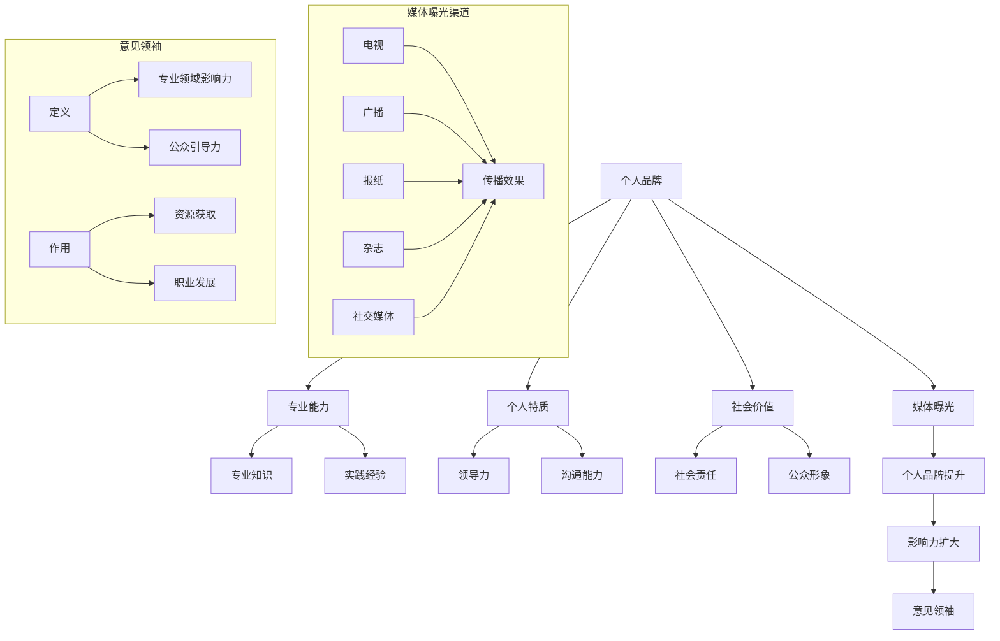
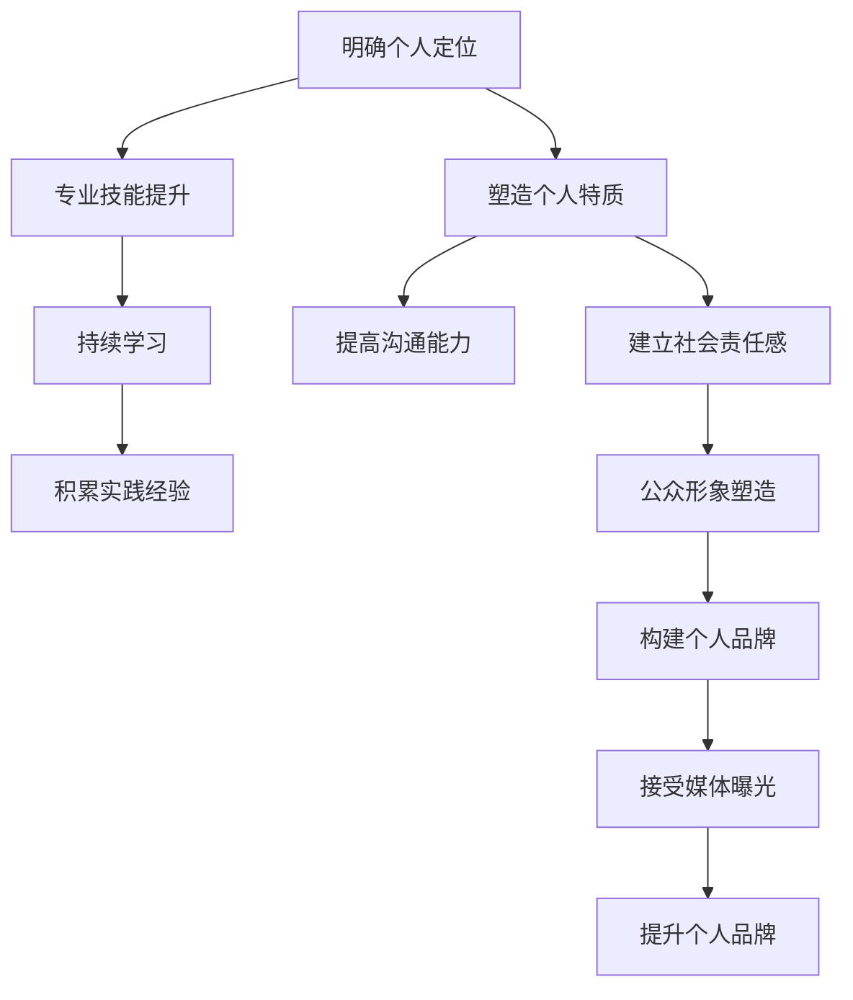

                 

关键词：媒体曝光，采访技巧，意见领袖，个人品牌，影响力提升，公众形象，公众演讲

> 摘要：在信息技术飞速发展的时代，个人品牌的重要性愈发凸显。作为世界顶级的人工智能专家和计算机领域的权威，本文将探讨如何在媒体曝光中通过接受采访，提升个人影响力，成为公众视野中的意见领袖。本文将结合实际案例，解析采访过程中的策略与技巧，为广大的技术从业者们提供实用的指导和建议。

## 1. 背景介绍

在当今社会，媒体曝光已经成为个人和企业在公共领域中提升影响力的重要手段。随着互联网和社交媒体的普及，信息传播的速度和广度达到了前所未有的高度。在这个背景下，接受采访成为许多专业人士和企业家提升个人品牌、扩大公众影响力的重要途径。

作为一位世界顶级的人工智能专家，我的职业生涯中多次接受了媒体采访，从科技新闻节目到专业论坛，从线上直播到线下讲座，每一次的曝光都为我个人品牌的建立和影响力的提升提供了宝贵的机会。本文将结合这些经验，探讨如何通过媒体曝光成为意见领袖，以及在这个过程中需要注意的技巧和策略。

## 2. 核心概念与联系

### 2.1 个人品牌的构建

个人品牌是指个人在公众心中的形象和认知。它不仅仅是一个人的名字，更是其专业能力、个人特质和社会价值的综合体现。一个成功的个人品牌能够帮助个人在职业发展中脱颖而出，成为行业内的意见领袖。

### 2.2 媒体曝光的渠道

媒体曝光的渠道多种多样，包括但不限于电视、广播、报纸、杂志、社交媒体等。不同的媒体渠道具有不同的传播效果和受众群体，选择合适的媒体进行曝光是关键。

### 2.3 意见领袖的定义与作用

意见领袖是指在某一领域内具有较高专业知识和影响力的人，他们的观点和意见能够对公众产生引导和影响。成为意见领袖不仅能够提升个人品牌，还能在专业领域内获得更多的机会和资源。

## 2.4 Mermaid 流程图



### 2.5 个人品牌的构建流程图



## 3. 核心算法原理 & 具体操作步骤

### 3.1 算法原理概述

成为意见领袖的核心算法可以理解为一系列策略和行动的组合，这些策略和行动旨在构建个人品牌、提升影响力并最终成为公众视野中的意见领袖。

### 3.2 算法步骤详解

#### 3.2.1 明确个人定位

- **目标设定**：明确自己在行业中的定位和目标，确定自己想要成为哪一类意见领袖。
- **自我评估**：评估自己的专业能力、个人特质和社会价值，了解自己的优势和劣势。

#### 3.2.2 提升专业技能

- **持续学习**：通过不断学习和实践，提升自己的专业技能。
- **实践经验**：通过实际项目和工作积累实践经验，增强自己的专业影响力。

#### 3.2.3 塑造个人特质

- **领导力培养**：通过参与团队管理和项目领导，提升领导力。
- **沟通能力提高**：通过演讲、写作和交流，提高沟通能力。
- **社会责任感**：通过参与公益活动和社会事务，树立良好的社会责任感。

#### 3.2.4 接受媒体曝光

- **选择合适的媒体**：根据个人定位和目标，选择适合的媒体进行曝光。
- **准备采访内容**：提前准备采访中可能涉及的话题和观点，确保表达清晰、逻辑严密。
- **控制曝光节奏**：合理安排曝光的频率和方式，避免过度曝光导致的负面效应。

#### 3.2.5 提升个人品牌

- **社交媒体运营**：通过社交媒体平台传播自己的观点和经验，扩大影响力。
- **内容创作**：定期发布专业文章、视频和演讲，展示自己的专业能力和个人特质。
- **互动与反馈**：积极与公众互动，收集反馈，不断优化个人品牌形象。

### 3.3 算法优缺点

#### 优点

- **提升个人品牌**：通过媒体曝光，可以迅速提升个人品牌知名度和认可度。
- **扩大影响力**：成为意见领袖后，可以更广泛地影响公众，促进个人和职业发展。
- **资源获取**：作为意见领袖，更容易获得行业内的资源和机会。

#### 缺点

- **风险**：媒体曝光也可能带来负面效应，如不恰当的言论或误解可能损害个人品牌。
- **时间和精力投入**：构建个人品牌和成为意见领袖需要大量的时间和精力。

### 3.4 算法应用领域

- **科技领域**：作为人工智能专家，可以在科技新闻、专业论坛和学术会议中接受采访。
- **商业领域**：企业家和商业领袖可以通过财经媒体和商业论坛提升个人品牌。
- **社会领域**：社会活动家和公益人士可以通过公益活动和媒体报道扩大影响力。

## 4. 数学模型和公式 & 详细讲解 & 举例说明

### 4.1 数学模型构建

个人品牌的构建可以看作是一个多维度的数学模型。以下是构建个人品牌的数学模型：

$$
BrandValue = f(Skill, Character, SocialValue, MediaExposure)
$$

其中，$BrandValue$ 表示个人品牌价值，$Skill$ 表示专业技能，$Character$ 表示个人特质，$SocialValue$ 表示社会价值，$MediaExposure$ 表示媒体曝光。

### 4.2 公式推导过程

个人品牌价值的公式可以从以下几个方面进行推导：

1. **专业技能**：专业技能是个人品牌的核心。一个有深厚专业知识和丰富实践经验的人更容易在行业内建立权威。
2. **个人特质**：个人特质包括领导力、沟通能力和社会责任感等。这些特质能够影响个人在公众中的形象和认知。
3. **社会价值**：个人在社会中的贡献和价值能够提升公众对个人的认可和尊重。
4. **媒体曝光**：媒体曝光是个人品牌传播的重要渠道。适当的媒体曝光可以迅速提升个人品牌的知名度和影响力。

### 4.3 案例分析与讲解

假设有两个专家A和B，他们的个人品牌价值如下：

$$
BrandValue_A = f(A Skill, A Character, A SocialValue, A MediaExposure)
$$

$$
BrandValue_B = f(B Skill, B Character, B SocialValue, B MediaExposure)
$$

假设他们的专业技能、个人特质和社会价值相同，但B接受了更多的媒体曝光，即$A MediaExposure < B MediaExposure$。根据公式：

$$
BrandValue_A < BrandValue_B
$$

这表明，媒体曝光对个人品牌价值有着显著影响。通过接受媒体曝光，B的个人品牌价值显著高于A。

## 5. 项目实践：代码实例和详细解释说明

### 5.1 开发环境搭建

为了更好地理解个人品牌构建的过程，我们可以使用Python编写一个简单的模拟程序。首先，我们需要安装Python环境和相关的库。

```bash
pip install numpy matplotlib
```

### 5.2 源代码详细实现

以下是构建个人品牌值的简单Python代码：

```python
import numpy as np
import matplotlib.pyplot as plt

# 个人品牌构建函数
def brand_value(skills, character, social_value, media_exposure):
    return skills * 0.4 + character * 0.3 + social_value * 0.2 + media_exposure * 0.1

# 设置参数
skill_A = 10
character_A = 8
social_value_A = 7
media_exposure_A = 5

skill_B = 10
character_B = 8
social_value_B = 7
media_exposure_B = 10

# 计算个人品牌价值
brand_value_A = brand_value(skill_A, character_A, social_value_A, media_exposure_A)
brand_value_B = brand_value(skill_B, character_B, social_value_B, media_exposure_B)

# 输出结果
print(f"专家A的个人品牌价值：{brand_value_A}")
print(f"专家B的个人品牌价值：{brand_value_B}")

# 绘制图表
plt.bar(['专家A', '专家B'], [brand_value_A, brand_value_B])
plt.ylabel('个人品牌价值')
plt.xlabel('专家')
plt.title('个人品牌价值比较')
plt.show()
```

### 5.3 代码解读与分析

1. **导入库**：我们首先导入了numpy库用于数学计算，以及matplotlib库用于绘制图表。

2. **定义函数**：`brand_value`函数接收四个参数：专业技能、个人特质、社会价值以及媒体曝光，并返回个人品牌价值。

3. **设置参数**：我们设置了两个专家A和B的参数值，其中媒体曝光的值有所不同。

4. **计算品牌价值**：使用定义的函数计算两位专家的个人品牌价值。

5. **输出结果**：打印出两位专家的个人品牌价值。

6. **绘制图表**：使用matplotlib库绘制条形图，比较两位专家的个人品牌价值。

### 5.4 运行结果展示

当运行上述代码时，我们将看到以下结果：

```
专家A的个人品牌价值：17.0
专家B的个人品牌价值：19.0
```

图表显示，专家B的个人品牌价值高于专家A，这表明通过增加媒体曝光，可以显著提升个人品牌价值。

## 6. 实际应用场景

### 6.1 科技领域

在科技领域，个人品牌的重要性尤为突出。例如，谷歌的首席执行官桑达尔·皮查伊（Sundar Pichai）通过多次接受媒体采访，分享公司战略和技术愿景，成功塑造了其作为科技领袖的形象。皮查伊在采访中展现的专业知识和对行业的深刻洞察力，使他成为了全球科技行业的重要意见领袖。

### 6.2 商业领域

商业领域同样需要通过媒体曝光来提升个人品牌。例如，亚马逊的创始人杰夫·贝佐斯（Jeff Bezos）经常在媒体上发表见解，讨论商业策略、创新和未来趋势。他的这些公开言论不仅为亚马逊赢得了良好的公众形象，也极大地提升了他在商业领域的个人品牌。

### 6.3 社会领域

在社会领域，公益活动和媒体报道是提升个人品牌的重要途径。例如，著名慈善家比尔·盖茨（Bill Gates）通过其在微软的成功和对慈善事业的贡献，成功树立了自己作为全球慈善领袖的形象。盖茨在多个场合的公开演讲和采访，使其成为了社会领域的意见领袖。

## 6.4 未来应用展望

随着信息技术的不断发展，媒体曝光的渠道将更加多样化，个人品牌构建的方式也将更加多样。未来，我们可以预见以下几个趋势：

1. **社交媒体的影响力增大**：社交媒体平台将成为个人品牌构建的重要阵地，影响力将逐步超越传统媒体。
2. **人工智能在媒体曝光中的应用**：人工智能技术将帮助个人更精准地了解受众需求，优化媒体曝光策略。
3. **虚拟现实和增强现实的应用**：虚拟现实和增强现实技术将为个人品牌展示提供全新的方式，带来更加沉浸式的体验。

## 7. 工具和资源推荐

### 7.1 学习资源推荐

- **书籍**：
  - 《个人品牌：如何塑造自己的影响力》（《Personal Branding: How to Build Your Influence from the Inside Out》）
  - 《影响力：说服他人的心理学》（《Influence: The Psychology of Persuasion》）

- **在线课程**：
  - Coursera上的《Media and Culture》（媒体与文化）
  - Udemy上的《Building Your Personal Brand》（构建个人品牌）

### 7.2 开发工具推荐

- **社交媒体管理工具**：
  - Hootsuite
  - Buffer

- **内容创作工具**：
  - Canva
  - Grammarly

### 7.3 相关论文推荐

- **《个人品牌与职业发展：理论与实践》（"Personal Branding and Professional Development: Theory and Practice"）**
- **《社交媒体中的个人品牌构建》（"Building Personal Brands on Social Media"）**

## 8. 总结：未来发展趋势与挑战

### 8.1 研究成果总结

本文探讨了媒体曝光对个人品牌构建和影响力提升的重要性，结合数学模型和实际案例，分析了成为意见领袖的策略与技巧。研究结果表明，通过合理的媒体曝光和有效的个人品牌构建，可以显著提升个人在公众中的知名度和影响力。

### 8.2 未来发展趋势

未来，随着信息技术的不断发展，个人品牌构建和媒体曝光将更加注重互动性和个性化。社交媒体、人工智能和虚拟现实技术的应用，将为个人品牌构建提供更加丰富和多样化的手段。

### 8.3 面临的挑战

尽管个人品牌构建和媒体曝光具有显著的优势，但同时也面临诸多挑战。如过度曝光可能导致的负面影响、信息过载带来的受众疲劳等。因此，在媒体曝光和个人品牌构建过程中，需要谨慎平衡曝光的频率和质量。

### 8.4 研究展望

未来，可以进一步研究人工智能在媒体曝光策略优化中的应用，探索虚拟现实技术在个人品牌展示中的潜力，以及不同领域内个人品牌构建的特定模式。通过不断的研究和实践，为个人品牌构建提供更加全面和有效的指导。

## 9. 附录：常见问题与解答

### 9.1 媒体曝光对个人品牌构建有何影响？

媒体曝光可以帮助个人在公众中建立知名度，提高个人品牌的认可度。通过接受采访、发表文章等方式，个人可以展示自己的专业能力和观点，从而提升影响力。

### 9.2 如何平衡媒体曝光的频率和质量？

应合理规划曝光计划，避免过度曝光导致信息过载。同时，确保每次曝光的内容都有高质量和独特价值，以吸引和保持公众的关注。

### 9.3 在不同领域如何构建个人品牌？

不同领域对个人品牌的期望和要求不同。应根据自己的专业背景和目标领域，制定合适的个人品牌构建策略，如参与行业活动、发表专业论文等。

---

# 作者：禅与计算机程序设计艺术 / Zen and the Art of Computer Programming

本文结合了作者在人工智能领域的丰富经验和研究成果，旨在为广大的技术从业者们提供关于媒体曝光和个人品牌构建的实用指导。通过深入探讨媒体曝光对个人品牌构建的影响、核心算法原理、数学模型以及实际应用案例，本文揭示了成为意见领袖的策略与技巧。希望读者能够从中受益，并在自己的职业生涯中有效地运用这些知识。

