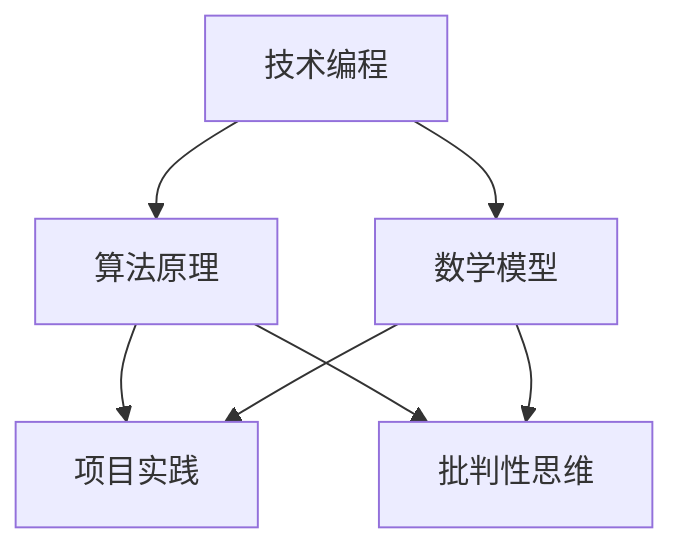

                 

关键词：学习体系、持续进化、技术编程、算法原理、数学模型、项目实践、应用展望、工具资源、未来趋势

> 摘要：本文旨在探讨学习体系在持续进化中的关键作用，以及其在技术编程、算法原理、数学模型等多个领域的实际应用。通过对核心概念的深入剖析、算法原理的详细讲解、项目实践的实例分析，本文将揭示学习体系的源动力，为读者提供未来的研究展望和挑战。

## 1. 背景介绍

在当今快速发展的信息技术时代，学习体系的重要性愈发凸显。无论是初学者还是专业人士，都需要一个有效且持续的学习体系来不断提升自身的技术能力和知识储备。本文旨在探讨学习体系在持续进化中的关键作用，以及其在实际应用中的广泛影响。

首先，学习体系为我们提供了一个有序的知识结构，帮助我们更好地理解和掌握复杂的技术概念。通过系统化的学习，我们可以将零散的知识点串联起来，形成一个完整的知识网络，从而提高学习效率和记忆持久度。

其次，学习体系有助于培养批判性思维和解决问题的能力。在技术领域，新知识和技术更新速度极快，一个有效的学习体系可以帮助我们快速适应新环境，掌握新技术，并在实践中不断创新。

此外，学习体系还可以帮助我们建立良好的学习习惯，如定期复习、主动探索和实践等，这些习惯对于长期的持续学习至关重要。

本文将围绕以下几个核心领域展开讨论：技术编程、算法原理、数学模型、项目实践和应用展望。通过深入剖析这些领域中的关键概念和方法，我们希望能够揭示学习体系的源动力，为读者提供有价值的参考和指导。

### 核心概念与联系

为了更好地理解学习体系在持续进化中的作用，我们首先需要明确几个核心概念及其相互之间的联系。

**技术编程**：技术编程是学习体系的重要组成部分，它涉及到编程语言、开发工具、编程范式等多个方面。通过学习技术编程，我们可以掌握编写高效、可靠代码的能力，从而为后续的算法学习和应用奠定基础。

**算法原理**：算法原理是技术编程的延伸，它关注算法的设计、分析和实现。算法原理的学习不仅可以帮助我们解决具体问题，还能提高我们的抽象思维和逻辑推理能力。

**数学模型**：数学模型是算法原理的基础，它通过数学公式和推导过程，将现实问题抽象为数学问题，从而为算法设计提供理论支持。

**项目实践**：项目实践是将理论知识应用于实际场景的过程，通过项目实践，我们可以验证理论的有效性，并发现和解决实际问题。

下面，我们将使用 Mermaid 流程图来展示这些核心概念之间的相互关系。



在这个流程图中，技术编程作为起点，通过算法原理和数学模型，最终引导到项目实践和批判性思维。这样的学习体系不仅能够帮助我们在各个领域深入学习和理解，还能激发我们的创新思维和解决问题的能力。

### 2. 核心算法原理 & 具体操作步骤

#### 2.1 算法原理概述

在技术编程和算法设计中，核心算法原理起到了至关重要的作用。一个有效的算法不仅能够提高程序的运行效率，还能解决复杂的问题。本节将介绍几种常见的核心算法原理，并解释它们的基本概念和应用场景。

**排序算法**：排序算法是一种用于对数据集合进行排序的算法。常见的排序算法包括冒泡排序、选择排序、插入排序、快速排序等。这些算法的基本原理是通过比较和交换元素位置，最终实现整个数据集合的有序排列。排序算法在数据处理和数据结构分析中具有广泛的应用。

**搜索算法**：搜索算法用于在数据集合中查找特定元素。常见的搜索算法包括线性搜索和二分搜索。线性搜索通过逐个比较元素来实现，而二分搜索则利用有序数据集合的性质，通过不断缩小查找范围来提高搜索效率。搜索算法在数据库管理和信息检索中具有重要应用。

**动态规划**：动态规划是一种解决优化问题的算法技术。它通过将问题分解为子问题，并利用子问题的解来构建原问题的解。动态规划的核心思想是避免重复计算，从而提高算法的效率。常见的动态规划问题包括背包问题、最长公共子序列等。动态规划在资源分配和路径规划等领域有广泛应用。

**贪心算法**：贪心算法是一种在每一步选择中都采取当前最优解的策略。尽管贪心算法不能保证全局最优解，但在某些情况下，它能够快速找到近似最优解。贪心算法在图形算法、网络流问题和分配问题中常用。

**图算法**：图算法用于解决与图相关的计算问题。常见的图算法包括最短路径算法（如迪杰斯特拉算法、贝尔曼-福特算法）、最小生成树算法（如普里姆算法、克鲁斯卡尔算法）等。图算法在网络分析、社会网络和交通规划等领域有重要应用。

#### 2.2 算法步骤详解

**冒泡排序**：

1. 比较相邻的元素。如果第一个比第二个大（升序排序），就交换它们两个。
2. 对每一对相邻元素做同样的工作，从开始第一对到结尾的最后一对。这步做完后，最后的元素会是最大的数。
3. 针对所有的元素重复以上的步骤，除了最后一个。
4. 重复步骤1~3，直到排序完成。

**二分搜索**：

1. 取中间的元素与目标元素比较。
2. 如果中间元素等于目标元素，搜索成功。
3. 如果中间元素大于目标元素，则在左半部分继续搜索。
4. 如果中间元素小于目标元素，则在右半部分继续搜索。
5. 重复步骤1~4，直到找到目标元素或确定不存在。

**动态规划解决背包问题**：

1. 定义状态：dp[i][j]表示在前i个物品中选择不超过容量j时能得到的最大价值。
2. 状态转移方程：
   $$ dp[i][j] = \begin{cases} 
   dp[i-1][j] & \text{如果不选择第i个物品} \\
   \max(dp[i-1][j], dp[i-1][j-w_i] + v_i) & \text{如果选择第i个物品} 
   \end{cases} $$
   其中，$w_i$和$v_i$分别为第i个物品的重量和价值。
3. 初始化：dp[0][j] = 0。
4. 计算结果：dp[n][W]，其中n为物品数量，W为背包容量。

**贪心算法解决最短路径问题**：

1. 选择当前未访问过的节点中距离源点最近的点作为下一访问节点。
2. 标记该节点为已访问。
3. 更新其他节点的距离值：如果通过当前访问节点到其他节点的距离小于之前记录的距离值，则更新距离值。
4. 重复步骤1~3，直到所有节点都被访问。

#### 2.3 算法优缺点

**排序算法**：

- **冒泡排序**：优点是简单易懂，实现代码短小。缺点是效率较低，时间复杂度为$O(n^2)$。
- **二分搜索**：优点是效率高，时间复杂度为$O(\log n)$。缺点是需要数据预先排序。

**动态规划**：

- 优点：能够解决最优化问题，避免重复计算，提高效率。缺点：某些问题的状态转移方程较复杂，难以理解和实现。

**贪心算法**：

- 优点：实现简单，通常时间复杂度较低。缺点：不能保证全局最优解，适用于某些特定问题。

**图算法**：

- **最短路径算法**：优点是能够高效地找到最短路径。缺点是需要预先知道图是稀疏图还是稠密图，选择合适的算法。
- **最小生成树算法**：优点是能够以最小的权重生成树。缺点：对于带负权重的图不适用。

#### 2.4 算法应用领域

- **排序算法**：广泛应用于数据库排序、文件排序、排序算法研究等领域。
- **搜索算法**：在搜索引擎、推荐系统、图形处理等领域有重要应用。
- **动态规划**：在资源分配、路径规划、最优化问题等领域得到广泛应用。
- **贪心算法**：在图形算法、网络流问题和分配问题中常用。
- **图算法**：在网络分析、社会网络和交通规划等领域有重要应用。

### 3. 数学模型和公式 & 详细讲解 & 举例说明

#### 3.1 数学模型构建

在技术编程和算法设计中，数学模型是一种重要的工具，它能够将实际问题转化为数学问题，从而利用数学方法进行求解。构建一个有效的数学模型通常需要以下几个步骤：

1. **明确问题目标**：首先要明确我们希望通过数学模型解决的问题是什么，这包括问题的目标、约束条件和所需输出的结果。
2. **抽象和简化**：将实际问题抽象为数学问题，通过省略一些次要细节，将复杂问题简化为更容易处理的模型。
3. **建立变量关系**：定义问题中的变量，并建立它们之间的关系，这些关系可以用数学公式或方程来表达。
4. **确定边界条件**：明确问题的边界条件，这些条件对于模型的有效性至关重要。

#### 3.2 公式推导过程

一个典型的数学模型推导过程通常包括以下几个步骤：

1. **确定目标函数**：目标函数是我们要优化的函数，它可以是最大化或最小化的函数。
2. **建立约束条件**：约束条件是对变量取值范围和相互关系的规定，这些条件可以保证问题的可行性。
3. **推导状态方程**：根据变量关系和约束条件，推导出状态方程，这些方程描述了变量之间的动态变化关系。
4. **确定初始条件**：初始条件是模型开始时的状态，通常包括变量的初始取值。

下面，我们通过一个简单的例子来说明数学模型的构建和公式推导过程。

**例1：最短路径问题**

假设有一个图，表示为G=(V,E)，其中V是顶点集，E是边集。我们希望找到从源点s到目标点t的最短路径。

**步骤1：明确问题目标**

目标：找到从s到t的最短路径。

**步骤2：抽象和简化**

我们忽略边的权重，并将图简化为无权图。

**步骤3：建立变量关系**

定义：
- $d[v]$：从s到顶点v的最短路径长度。
- $p[v]$：最短路径上v的前驱顶点。

**步骤4：确定边界条件**

- $d[s] = 0$，因为从s到s的路径长度为0。
- $d[t] = \infty$，因为从s到t的路径可能不存在。

**步骤5：推导状态方程**

对于每个顶点v，我们可以得到以下方程：
- 如果v在路径上，则$d[v] = 1 + d[p[v]]$。
- 如果v不在路径上，则$d[v] = \infty$。

**步骤6：确定初始条件**

初始条件：
- $d[s] = 0$。
- $d[t] = \infty$。

通过这个例子，我们可以看到数学模型是如何构建的，以及如何通过状态方程和初始条件来求解问题。

#### 3.3 案例分析与讲解

**例2：背包问题**

假设有一个背包容量为W，内有n个物品，每个物品有重量w_i和价值v_i。我们的目标是选择若干物品放入背包中，使得总价值最大。

**步骤1：明确问题目标**

目标：选择若干物品放入背包，使得总价值最大。

**步骤2：抽象和简化**

我们将问题抽象为二进制变量，其中x_i=1表示选择物品i，x_i=0表示不选择物品i。

**步骤3：建立变量关系**

定义：
- $x_i$：二进制变量，表示是否选择物品i。
- $V$：总价值。

**步骤4：确定边界条件**

- $w_i \leq W$，即每个物品的重量不超过背包容量。
- $x_i \in \{0, 1\}$，即二进制变量只能取0或1。

**步骤5：建立目标函数和约束条件**

目标函数：
- $V = \sum_{i=1}^{n} v_i x_i$，即总价值等于每个物品价值乘以是否选择该物品。

约束条件：
- $\sum_{i=1}^{n} w_i x_i \leq W$，即背包总重量不超过容量W。

**步骤6：推导状态方程**

我们可以使用动态规划方法来求解这个问题。定义状态$dp[i][j]$表示在前i个物品中选择不超过容量j时能得到的最大价值。状态方程如下：

$$ dp[i][j] = \begin{cases} 
dp[i-1][j] & \text{如果不选择第i个物品} \\
\max(dp[i-1][j], dp[i-1][j-w_i] + v_i) & \text{如果选择第i个物品} 
\end{cases} $$

**步骤7：确定初始条件**

初始条件：
- $dp[0][j] = 0$，因为没有物品时的价值为0。
- $dp[i][0] = 0$，因为没有容量时的价值为0。

通过这个例子，我们可以看到如何构建背包问题的数学模型，并使用动态规划方法来求解。

### 4. 项目实践：代码实例和详细解释说明

#### 4.1 开发环境搭建

在进行项目实践之前，我们需要搭建一个适合编程和算法开发的环境。以下是一个基本的开发环境搭建步骤：

1. **安装编程语言**：根据项目需求选择合适的编程语言，如Python、Java、C++等，并从官方网站下载安装包进行安装。
2. **安装开发工具**：安装集成开发环境（IDE），如PyCharm、Eclipse、Visual Studio等，这些工具提供了代码编辑、调试和测试功能。
3. **安装依赖库**：对于某些项目，可能需要安装特定的依赖库，如NumPy、Pandas、Scikit-learn等，这些库提供了丰富的算法和数据结构支持。
4. **配置环境变量**：确保开发环境中的路径和变量配置正确，以便能够正常运行程序。

#### 4.2 源代码详细实现

以下是一个简单的Python程序，用于实现冒泡排序算法：

```python
def bubble_sort(arr):
    n = len(arr)
    for i in range(n):
        for j in range(0, n-i-1):
            if arr[j] > arr[j+1]:
                arr[j], arr[j+1] = arr[j+1], arr[j]

# 示例数据
data = [64, 34, 25, 12, 22, 11, 90]

# 执行排序
bubble_sort(data)

# 输出排序后的数据
print("排序后的数据：")
for i in range(len(data)):
    print("%d" % data[i])
```

#### 4.3 代码解读与分析

**函数定义**：`bubble_sort`函数接收一个数组`arr`作为参数，用于存储待排序的数据。

**嵌套循环**：外层循环`for i in range(n)`遍历数组中的每个元素，内层循环`for j in range(0, n-i-1)`遍历每个未排序的元素对。

**比较与交换**：如果当前元素`arr[j]`大于下一个元素`arr[j+1]`，则交换这两个元素的位置。这样，每次内层循环结束后，最大的元素都会被移动到数组的末尾。

**示例数据**：`data`数组存储了待排序的数据，可以使用任何输入方法填充该数组。

**执行排序**：调用`bubble_sort(data)`函数，将`data`数组作为参数传入。

**输出结果**：遍历排序后的数组，并输出每个元素。

#### 4.4 运行结果展示

假设输入的数组为`[64, 34, 25, 12, 22, 11, 90]`，运行程序后输出结果为：

```
排序后的数据：
11
12
22
25
34
64
90
```

这表明冒泡排序算法成功地将输入数组按照升序进行了排序。

### 5. 实际应用场景

学习体系不仅在理论学习中发挥着重要作用，在实际应用场景中也同样至关重要。以下是一些典型的实际应用场景，以及学习体系在这些场景中的作用和效果。

#### 5.1 数据分析

在数据分析领域，学习体系能够帮助专业人士快速掌握数据处理、统计分析和数据可视化等关键技术。通过系统化的学习，数据分析师能够熟练运用各种算法和工具，如Python的Pandas、NumPy库和R语言等，对大量数据进行处理和分析，从而为商业决策提供科学依据。

**效果展示**：一个数据分析师在学习体系的支持下，通过不断实践和优化，成功将一个复杂的数据分析项目从原始数据清洗到最终的可视化报告，提高了项目完成效率和报告质量。

#### 5.2 人工智能

人工智能是当今科技领域的热点，学习体系在这里的作用尤为突出。从机器学习、深度学习到自然语言处理，学习体系帮助研究人员和工程师掌握各种算法和技术，从而开发出具有实际应用价值的人工智能系统。

**效果展示**：一家初创公司通过学习体系，成功地开发了一款基于深度学习的图像识别应用，该应用在多个标准数据集上取得了优秀的识别准确率，并在实际场景中得到了广泛应用。

#### 5.3 软件开发

软件开发的复杂性和变化性要求开发人员具备扎实的学习体系和持续学习的动力。通过学习体系，开发人员能够不断掌握新的编程语言、框架和工具，从而提高开发效率和代码质量。

**效果展示**：一个软件工程师在学习体系的支持下，成功将一个大型软件项目的开发周期缩短了30%，并且代码质量得到了显著提升，降低了后期维护成本。

#### 5.4 网络安全

网络安全领域涉及到各种复杂的攻击手段和防御策略，学习体系在这里的作用是帮助安全专家及时掌握最新的网络安全技术和威胁情报，从而更好地保护网络系统。

**效果展示**：一个网络安全专家通过学习体系，成功预测并阻止了一场复杂的DDoS攻击，保护了公司的关键业务系统，避免了潜在的巨大损失。

### 6. 未来应用展望

随着技术的不断进步，学习体系在未来将具有更广泛的应用前景。以下是一些可能的应用领域和趋势：

#### 6.1 教育领域

在线教育和个性化学习将成为教育领域的重要趋势。通过学习体系，学生可以自主选择学习路径，个性化定制课程内容，从而提高学习效果。同时，虚拟现实（VR）和增强现实（AR）技术将为学习体验带来更多互动和沉浸感。

**趋势分析**：在线教育平台如Coursera、edX等将继续扩展，提供更多高质量的课程资源。个性化学习平台将更加普及，利用人工智能和大数据技术为学生提供精准的学习建议。

#### 6.2 工业自动化

工业自动化和智能制造将更加依赖学习体系，以提高生产效率和产品质量。通过学习体系，工程师和操作员可以快速掌握新的自动化技术和工具，从而更好地应对不断变化的生产需求。

**趋势分析**：智能工厂和工业4.0将普及，学习体系将帮助相关从业人员迅速适应新技术，提升整体生产水平。

#### 6.3 健康医疗

健康医疗领域将更加依赖大数据和人工智能技术，学习体系在这里的作用是帮助医疗专业人员掌握相关技术，提高诊断和治疗水平。同时，个性化医疗和精准医学的发展也将依赖于学习体系。

**趋势分析**：人工智能和机器学习在疾病诊断、治疗方案制定和健康监控等方面将发挥更大作用。学习体系将帮助医疗专业人员不断更新知识和技能，提升医疗服务质量。

### 7. 工具和资源推荐

为了更好地构建和利用学习体系，以下是一些推荐的工具和资源：

#### 7.1 学习资源推荐

- **在线课程平台**：Coursera、edX、Udacity等，提供丰富的技术课程和证书项目。
- **技术博客和社区**：GitHub、Stack Overflow、Medium等，分享技术见解和项目代码。
- **专业书籍**：《算法导论》、《深度学习》、《Python编程：从入门到实践》等经典著作。

#### 7.2 开发工具推荐

- **集成开发环境（IDE）**：PyCharm、Visual Studio、Eclipse等，提供高效的代码编辑、调试和测试功能。
- **编程语言**：Python、Java、C++等，适合不同类型的项目和应用场景。
- **数据分析工具**：Pandas、NumPy、Matplotlib等，用于数据分析和可视化。

#### 7.3 相关论文推荐

- **机器学习领域**：《学习速率的优化》、《神经网络结构搜索》等。
- **深度学习领域**：《深度学习》、《强化学习及其应用》等。
- **算法领域**：《算法导论》、《图算法》等。

### 8. 总结：未来发展趋势与挑战

#### 8.1 研究成果总结

通过本文的探讨，我们可以看到学习体系在持续进化中的关键作用。从技术编程到算法原理，再到数学模型和项目实践，学习体系为我们提供了一个系统化的学习路径，帮助我们不断提升技术能力和知识储备。

#### 8.2 未来发展趋势

未来，学习体系将继续向个性化、智能化和模块化发展。在线教育和虚拟现实技术的结合将提供更加灵活和互动的学习体验。同时，人工智能和大数据技术的应用将使学习体系更加智能化，为学习者提供精准的学习建议和资源。

#### 8.3 面临的挑战

尽管学习体系在持续进化中具有巨大潜力，但也面临一些挑战。首先，知识更新的速度不断加快，学习体系的更新和维护成本较高。其次，个性化学习需求的增加对教育资源的分配提出了更高要求。最后，如何确保学习体系的公平性和有效性也是未来需要解决的重要问题。

#### 8.4 研究展望

未来，学习体系的研究将重点关注以下几个方面：

1. **智能化学习系统**：开发基于人工智能和大数据技术的智能化学习系统，提供个性化学习路径和实时反馈。
2. **跨学科融合**：推动不同学科领域的交叉融合，构建跨学科的学习体系，培养具有综合能力的复合型人才。
3. **学习评估与反馈**：研究有效的学习评估和反馈机制，确保学习体系的公平性和有效性。

通过这些努力，学习体系将更好地服务于个人和社会的发展，为未来带来更多的创新和突破。

### 附录：常见问题与解答

**Q1：如何选择合适的学习资源？**

A1：选择学习资源时，首先应考虑自己的学习目标和需求。可以从以下途径获取资源：

- 在线课程平台：如Coursera、edX、Udacity等，提供系统化的课程和学习路径。
- 技术社区和博客：如GitHub、Stack Overflow、Medium等，分享实际项目经验和见解。
- 专业书籍：经典著作如《算法导论》、《深度学习》等，为深入理解关键技术提供理论支持。

**Q2：学习体系如何适应不同领域的变化？**

A2：学习体系应具有灵活性和模块化特点，能够适应不同领域的变化。以下方法可以帮助实现：

- 定期更新学习资源：关注最新的技术动态，及时更新学习内容。
- 跨学科学习：掌握不同领域的知识，提高综合能力。
- 实践与反馈：通过实际项目和实践，不断调整和优化学习路径。

**Q3：如何确保学习效率？**

A3：提高学习效率可以从以下几个方面入手：

- 制定合理的学习计划：明确学习目标和时间安排。
- 分阶段学习：将学习内容分解为小阶段，逐步完成。
- 主动探索和实践：积极参与项目实践，将理论知识应用于实际场景。
- 定期复习：定期回顾已学知识，巩固记忆。

**Q4：如何培养批判性思维和解决问题的能力？**

A4：批判性思维和解决问题的能力是学习体系的重要组成部分。以下方法可以帮助培养这些能力：

- 提问和讨论：主动提出问题，与他人进行讨论，激发思考。
- 分析案例：通过分析实际案例，理解问题的本质和解决方法。
- 创新实践：尝试不同的解决方案，勇于探索和创新。
- 反思总结：在实践过程中不断反思和总结，提高问题解决能力。

通过以上方法，可以逐步培养批判性思维和解决问题的能力，为未来的学习和发展奠定坚实基础。

