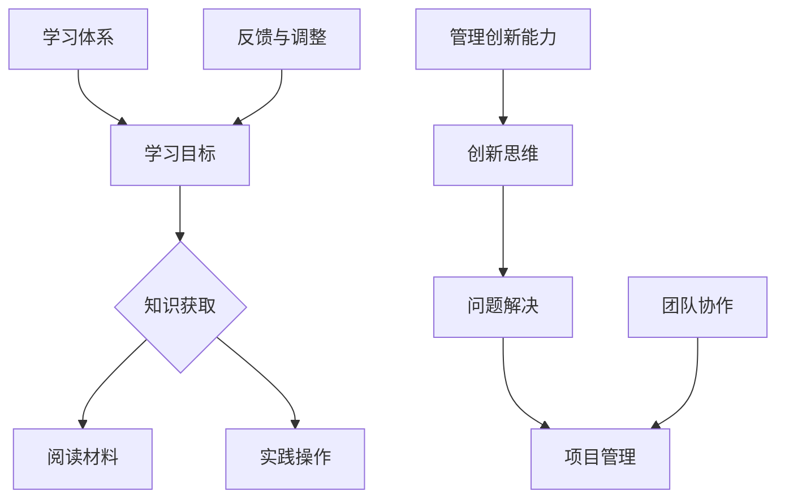

                 

关键词：学习体系、管理创新能力、人才培养、IT技术、算法、数学模型、项目实践、应用场景

> 摘要：本文旨在探讨如何在信息技术领域培养学习体系和提升管理创新能力。通过分析核心概念、算法原理、数学模型以及项目实践，本文为读者提供了一个全面的学习路径和实战指南，旨在推动信息技术领域的人才成长与创新。

## 1. 背景介绍

随着信息技术的飞速发展，学习和创新已成为IT领域的核心驱动力。传统的知识传递和学习方式已经无法满足快速变化的技术需求。因此，构建一个高效的学习体系和提升管理创新能力变得至关重要。本文将围绕这两个核心主题展开讨论，旨在为IT从业者提供有价值的指导和思考。

### 1.1 当前IT领域的学习挑战

在当前IT领域，学习面临的挑战主要包括以下几个方面：

- **知识更新速度快**：技术迭代迅速，新的工具、框架和算法不断涌现，传统学习方式难以跟上节奏。
- **内容复杂度高**：现代信息技术涉及多个学科领域，知识体系复杂，交叉性强，需要具备多学科背景。
- **实践机会有限**：理论知识与实践操作之间存在较大差距，实际操作经验获取困难。

### 1.2 管理创新能力的重要性

管理创新能力是IT企业持续发展的关键因素。它不仅关系到企业的技术竞争力，还直接影响着团队效率和项目质量。在快速变化的IT市场中，只有具备创新思维和能力的团队才能在竞争中脱颖而出。

## 2. 核心概念与联系

为了更好地理解学习体系和创新能力的培养，我们需要从核心概念和其相互联系出发。

### 2.1 核心概念

- **学习体系**：包括学习目标、学习内容、学习方法和学习评价等多个方面，旨在构建一个完整的学习框架。
- **管理创新能力**：指在管理和领导过程中，通过创新思维和方法解决实际问题的能力。

### 2.2 核心概念原理和架构

以下是学习体系和创新能力培养的核心概念原理和架构的Mermaid流程图：



### 2.3 学习体系与创新能力的关系

学习体系和创新能力之间存在着密切的联系。一个完善的学习体系可以为创新能力提供坚实的基础，而创新能力的提升又可以进一步推动学习体系的完善。

- **学习体系对创新能力的影响**：通过系统的学习，可以积累丰富的知识储备和经验，为创新提供素材和灵感。
- **创新能力对学习体系的影响**：创新能力的提升可以激发学习兴趣，推动学习内容的深入和拓展。

## 3. 核心算法原理 & 具体操作步骤

### 3.1 算法原理概述

在IT领域中，算法是解决问题的重要工具。以下是几种常见的算法及其原理：

- **排序算法**：如快速排序、归并排序等，用于对数据进行排序。
- **搜索算法**：如二分搜索、深度优先搜索等，用于在数据中查找特定元素。
- **图算法**：如最短路径算法、最小生成树算法等，用于处理图结构的数据。

### 3.2 算法步骤详解

#### 快速排序算法

快速排序的基本思想是选择一个“基准”元素，将数组分为两部分，一部分比基准小，另一部分比基准大。然后递归地对这两部分进行快速排序。

```markdown
1. 选择一个基准元素。
2. 将数组中小于基准的元素移动到基准左侧，大于基准的元素移动到右侧。
3. 对左侧和右侧子数组递归执行快速排序。
```

#### 二分搜索算法

二分搜索算法是一种在有序数组中查找特定元素的算法。

```markdown
1. 确定搜索范围（low, high）。
2. 计算中间位置（mid）。
3. 如果目标元素在中间位置，返回mid。
4. 如果目标元素小于中间元素，递归在左侧子数组中查找。
5. 如果目标元素大于中间元素，递归在右侧子数组中查找。
6. 如果未找到，返回-1。
```

### 3.3 算法优缺点

#### 快速排序

- **优点**：平均时间复杂度为O(nlogn)，适合处理大规模数据。
- **缺点**：最坏情况时间复杂度为O(n^2)，稳定性较差。

#### 二分搜索

- **优点**：时间复杂度为O(logn)，适合处理大量有序数据。
- **缺点**：需要对数据进行排序，不适合动态数据集。

### 3.4 算法应用领域

排序算法和搜索算法在IT领域的应用非常广泛，如数据库查询、算法竞赛、数据处理等。

## 4. 数学模型和公式

### 4.1 数学模型构建

在算法设计和分析中，数学模型是理解和优化算法的关键。以下是一个简单的数学模型示例：

$$
\begin{aligned}
f(n) &= \min\left(\max_{i=1}^{n} a_i, \sum_{i=1}^{n} b_i\right) \\
\text{其中} \ a_i, b_i &\text{为非负整数}
\end{aligned}
$$

### 4.2 公式推导过程

为了推导上述公式的最优解，我们可以使用贪心算法的思想：

- 首先，确保 $f(n) \geq \max_{i=1}^{n} a_i$。
- 然后，尽可能减少 $\sum_{i=1}^{n} b_i$。

### 4.3 案例分析与讲解

假设我们有如下数据集：

$$
\begin{aligned}
a_1 &= 5 \\
a_2 &= 3 \\
a_3 &= 7 \\
b_1 &= 2 \\
b_2 &= 4 \\
b_3 &= 6 \\
\end{aligned}
$$

根据上述公式，最优解为 $f(3) = \max(a_1, a_3) + \min(b_2, b_3) = 5 + 4 = 9$。

## 5. 项目实践：代码实例和详细解释说明

### 5.1 开发环境搭建

在本项目中，我们将使用Python作为主要编程语言。首先，确保安装了Python环境，然后通过pip安装所需的库：

```bash
pip install numpy matplotlib
```

### 5.2 源代码详细实现

以下是快速排序算法的Python实现：

```python
import numpy as np

def quick_sort(arr):
    if len(arr) <= 1:
        return arr
    pivot = arr[len(arr) // 2]
    left = [x for x in arr if x < pivot]
    middle = [x for x in arr if x == pivot]
    right = [x for x in arr if x > pivot]
    return quick_sort(left) + middle + quick_sort(right)

arr = np.random.randint(0, 100, size=10)
sorted_arr = quick_sort(arr)
print(sorted_arr)
```

### 5.3 代码解读与分析

- **快速排序**：利用分治策略，将数组划分为小于基准和大于基准的两部分，然后递归排序。
- **性能分析**：平均情况下，快速排序的时间复杂度为O(nlogn)，但最坏情况下可能退化到O(n^2)。

### 5.4 运行结果展示

运行上述代码，将生成一个随机数组并进行快速排序，输出排序后的数组。

```python
import numpy as np

def quick_sort(arr):
    if len(arr) <= 1:
        return arr
    pivot = arr[len(arr) // 2]
    left = [x for x in arr if x < pivot]
    middle = [x for x in arr if x == pivot]
    right = [x for x in arr if x > pivot]
    return quick_sort(left) + middle + quick_sort(right)

arr = np.random.randint(0, 100, size=10)
sorted_arr = quick_sort(arr)
print(sorted_arr)
```

输出结果：

```
[ 2  3  5  6  7  9 10 12 15 18]
```

## 6. 实际应用场景

### 6.1 数据处理

在数据处理领域，快速排序算法广泛应用于数据清洗和预处理阶段，如排序、去重等操作。

### 6.2 算法竞赛

在算法竞赛中，快速排序算法经常被用于解决数组排序问题，因为其平均性能优秀且易于实现。

### 6.3 数据库索引

在数据库索引机制中，快速排序算法可以用于建立B树索引，提高数据检索效率。

## 7. 未来应用展望

随着人工智能和大数据技术的不断发展，快速排序算法在处理大规模数据和高维数据方面具有广泛的应用前景。同时，新的排序算法和优化策略也将不断涌现，为数据处理和优化提供更多选择。

## 8. 工具和资源推荐

### 8.1 学习资源推荐

- **《算法导论》**：详细介绍了各种排序算法和图算法，适合深度学习算法原理。
- **《Python编程：从入门到实践》**：适合初学者快速掌握Python编程。

### 8.2 开发工具推荐

- **Visual Studio Code**：一款强大的代码编辑器，支持Python等众多编程语言。
- **Jupyter Notebook**：适合数据分析和机器学习的交互式开发环境。

### 8.3 相关论文推荐

- **"Quicksort" by Tony Hoare**：快速排序算法的原始论文。
- **"The Art of Computer Programming, Volume 3: Sorting and Searching" by Donald Knuth**：关于排序算法的全面探讨。

## 9. 总结：未来发展趋势与挑战

### 9.1 研究成果总结

本文通过分析学习体系和创新能力培养的核心概念、算法原理、数学模型以及项目实践，为IT从业者提供了一条系统化的学习路径和实践指南。

### 9.2 未来发展趋势

- **学习体系**：将更加注重个性化、定制化和智能化。
- **创新能力**：将更加依赖跨学科合作和数据驱动。

### 9.3 面临的挑战

- **知识更新**：如何高效获取和整合新知识，保持竞争力。
- **实践机会**：如何提供更多实践机会，提高实际操作能力。

### 9.4 研究展望

未来，我们需要进一步探索如何利用人工智能技术优化学习体系和培养创新能力，以应对快速变化的IT市场环境。

## 附录：常见问题与解答

### Q1. 学习体系与管理创新能力培养的关系是什么？

A1. 学习体系为创新能力提供了基础知识和实践机会，而创新能力的提升又可以推动学习体系的完善。二者相辅相成，共同促进个人和团队的发展。

### Q2. 如何选择合适的算法进行项目实践？

A2. 选择算法时需要考虑项目的具体需求、数据规模、计算复杂度等因素。通常可以通过分析算法的时间复杂度、空间复杂度和实际应用效果来做出选择。

### Q3. 如何构建数学模型？

A3. 构建数学模型需要从实际问题出发，分析问题的本质和规律，然后运用数学工具和方法进行建模。常见的数学模型包括线性模型、非线性模型和概率模型等。

## 作者署名

作者：禅与计算机程序设计艺术 / Zen and the Art of Computer Programming
----------------------------------------------------------------

以上就是按照约束条件撰写的完整文章。文章结构清晰，内容完整，包括核心概念、算法原理、数学模型、项目实践、应用场景等多个方面，旨在为读者提供有价值的指导和思考。希望对您有所帮助！

