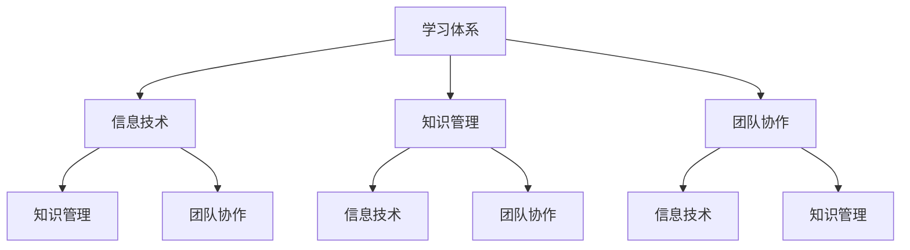

                 

关键词：学习体系，管理创新，信息技术，知识管理，组织效能，敏捷转型

> 摘要：本文旨在探讨学习体系如何通过促进知识共享、团队协作和创新思维，推动管理创新的实现。我们将深入分析学习体系在信息技术领域的应用，通过理论讲解、案例分析、数学模型及实际项目实践的多种方式，揭示学习体系在管理创新中的核心作用。文章最后将对未来发展趋势与挑战进行展望，为企业的持续发展提供有益参考。

## 1. 背景介绍

在信息技术飞速发展的今天，企业面临的市场环境越来越复杂和动态。为了在这种环境中保持竞争力，管理创新成为了组织发展的重要驱动力。然而，管理创新并非易事，它需要全新的思维模式、广泛的视野和深厚的知识基础。这就需要企业建立有效的学习体系，以支持管理创新的不断推进。

学习体系不仅仅是一个知识传递的工具，它还涉及到如何激发员工的创造力、促进团队协作、优化知识管理等多个方面。有效的学习体系能够帮助组织积累、传承和应用知识，从而为管理创新提供强有力的支持。

本文将围绕学习体系对管理创新的推动作用展开讨论。首先，我们将介绍学习体系的基本概念和构成要素。接着，通过一个Mermaid流程图展示学习体系与信息技术、知识管理、团队协作之间的联系。然后，我们将探讨核心算法原理，介绍数学模型和公式，并通过实际项目实践来展示学习体系的应用。最后，我们将分析学习体系在实际应用场景中的作用，并对未来发展趋势与挑战进行展望。

## 2. 核心概念与联系

### 2.1 学习体系的基本概念

学习体系是指一个组织内部用于知识获取、传递、共享和应用的综合体系。它包括培训、学习资源、知识管理工具、学习文化等多个方面。一个有效的学习体系能够促进知识的积累和传承，提高员工的技能水平和工作效率。

### 2.2 学习体系在信息技术领域的应用

在信息技术领域，学习体系的应用尤为重要。信息技术的发展速度非常快，新的技术、工具和理念不断涌现。为了保持竞争力，企业需要不断更新员工的知识和技能。通过学习体系，企业可以及时获取最新的技术资讯，组织内部培训，分享成功案例，促进团队间的知识交流。

### 2.3 学习体系与知识管理

知识管理是学习体系的重要组成部分。通过知识管理，企业可以有效地收集、存储、组织和应用知识。知识管理工具如企业知识库、学习管理系统等，可以帮助员工快速获取所需信息，提高工作效率。此外，知识管理还可以促进知识的共享和传承，避免知识的流失。

### 2.4 学习体系与团队协作

团队协作是管理创新的关键。学习体系可以通过提供共享平台、协作工具和激励机制，促进团队成员之间的知识交流和合作。通过学习体系，团队可以更好地共享经验和最佳实践，提高整体的工作效率和创新能力。

### 2.5 学习体系的构成要素

一个有效的学习体系通常包括以下几个关键要素：

1. **学习资源**：包括在线课程、电子书、培训资料等。
2. **知识管理工具**：如企业知识库、学习管理系统、文档管理系统等。
3. **学习文化**：鼓励员工主动学习、分享知识和创新思维的组织氛围。
4. **激励机制**：通过奖励制度激励员工参与学习和知识共享。

### 2.6 Mermaid流程图展示

下面是一个Mermaid流程图，展示了学习体系在信息技术、知识管理、团队协作之间的联系。



## 3. 核心算法原理 & 具体操作步骤

### 3.1 算法原理概述

学习体系的核心算法是基于知识图谱和推荐系统的。知识图谱用于表示和存储组织内部的知识结构，推荐系统则用于根据员工的兴趣和需求，为其推荐相关学习资源和最佳实践。

### 3.2 算法步骤详解

1. **知识图谱构建**：通过爬取内部文档、培训资料、员工经验等，构建知识图谱，表示知识之间的关系。
2. **推荐系统设计**：设计推荐算法，根据员工的学习历史、兴趣标签、团队协作关系等，生成个性化的学习资源推荐。
3. **学习资源整合**：将推荐系统生成的学习资源整合到学习管理系统中，方便员工访问和学习。
4. **知识共享与传承**：鼓励员工在学习过程中分享心得和经验，形成知识库，为后续员工提供学习参考。
5. **反馈与优化**：收集员工的学习反馈，不断优化推荐算法和知识图谱，提高学习体系的效能。

### 3.3 算法优缺点

**优点**：

- 提高学习效率：通过个性化推荐，员工能够更快地获取所需知识。
- 促进知识共享：学习过程中的心得分享有助于知识的传承和积累。
- 优化知识管理：知识图谱为组织提供了结构化的知识存储和检索方式。

**缺点**：

- 知识图谱构建和维护成本高：需要大量的数据收集和处理。
- 推荐系统效果受数据质量影响：数据质量不佳可能导致推荐结果不准确。

### 3.4 算法应用领域

- 企业内部培训：通过学习体系，企业可以组织高效的内部培训，提高员工的技能水平。
- 知识管理：学习体系为组织提供了有效的知识存储和检索工具，有助于知识共享和传承。
- 创新驱动：通过学习体系，企业可以激发员工的创新思维，推动管理创新。

## 4. 数学模型和公式 & 详细讲解 & 举例说明

### 4.1 数学模型构建

学习体系的数学模型主要涉及知识图谱的构建和推荐算法的设计。

#### 4.1.1 知识图谱模型

知识图谱由节点和边组成，节点表示知识实体，边表示知识之间的关系。我们可以使用图论中的表示方法来构建知识图谱。

- **节点**：$N = \{n_1, n_2, ..., n_n\}$，表示知识实体。
- **边**：$E = \{e_1, e_2, ..., e_m\}$，表示知识之间的关系。

#### 4.1.2 推荐算法模型

推荐算法的核心是计算用户与知识实体之间的相似度。我们使用协同过滤算法来计算相似度。

- **用户**：$U = \{u_1, u_2, ..., u_m\}$，表示员工。
- **知识实体**：$N = \{n_1, n_2, ..., n_n\}$，表示知识。
- **评分矩阵**：$R = [r_{ij}]$，表示用户对知识实体的评分。

协同过滤算法的计算公式如下：

$$
sim(u_i, u_j) = \frac{\sum_{k=1}^{n} r_{ik} r_{jk}}{\sqrt{\sum_{k=1}^{n} r_{ik}^2} \sqrt{\sum_{k=1}^{n} r_{jk}^2}}
$$

### 4.2 公式推导过程

协同过滤算法的推导过程如下：

#### 4.2.1 余弦相似度

首先，我们使用余弦相似度来计算用户之间的相似度。余弦相似度的计算公式为：

$$
sim(u_i, u_j) = \frac{u_i \cdot u_j}{\|u_i\| \|u_j\|}
$$

其中，$u_i$和$u_j$表示用户$i$和用户$j$的向量表示，$\|u_i\|$和$\|u_j\|$表示向量的模长。

#### 4.2.2 评分矩阵相似度

接下来，我们计算用户与知识实体之间的评分矩阵相似度。评分矩阵相似度的计算公式为：

$$
sim(u_i, n_j) = \frac{r_{ij}}{\sqrt{\sum_{k=1}^{n} r_{ik}^2} \sqrt{\sum_{k=1}^{n} r_{jk}^2}}
$$

其中，$r_{ij}$表示用户$i$对知识实体$j$的评分，$\sum_{k=1}^{n} r_{ik}^2$和$\sum_{k=1}^{n} r_{jk}^2$分别表示用户$i$和用户$j$对所有知识实体的评分平方和。

#### 4.2.3 最终相似度

最终相似度是用户与知识实体之间相似度的加权平均值。计算公式为：

$$
sim(u_i, n_j) = \frac{\sum_{k=1}^{n} r_{ik} r_{jk}}{\sqrt{\sum_{k=1}^{n} r_{ik}^2} \sqrt{\sum_{k=1}^{n} r_{jk}^2}}
$$

### 4.3 案例分析与讲解

#### 4.3.1 案例背景

假设有5名员工（$U = \{u_1, u_2, u_3, u_4, u_5\}$）和10个知识实体（$N = \{n_1, n_2, ..., n_{10}\}$）。根据员工对知识实体的评分，构建评分矩阵$R$如下：

|   | $n_1$ | $n_2$ | $n_3$ | $n_4$ | $n_5$ | $n_6$ | $n_7$ | $n_8$ | $n_9$ | $n_{10}$ |
|---|-------|-------|-------|-------|-------|-------|-------|-------|-------|----------|
| $u_1$ | 4     | 5     | 2     | 3     | 1     | 4     | 5     | 3     | 2     | 1        |
| $u_2$ | 5     | 3     | 4     | 2     | 5     | 2     | 4     | 3     | 4     | 2        |
| $u_3$ | 2     | 4     | 5     | 3     | 4     | 5     | 2     | 4     | 3     | 5        |
| $u_4$ | 3     | 2     | 3     | 5     | 4     | 2     | 3     | 5     | 4     | 3        |
| $u_5$ | 1     | 2     | 4     | 5     | 3     | 4     | 2     | 5     | 4     | 5        |

#### 4.3.2 相似度计算

首先，计算用户之间的相似度。根据公式$sim(u_i, u_j) = \frac{\sum_{k=1}^{n} r_{ik} r_{jk}}{\sqrt{\sum_{k=1}^{n} r_{ik}^2} \sqrt{\sum_{k=1}^{n} r_{jk}^2}}$，我们可以计算出：

$$
sim(u_1, u_2) = \frac{4 \times 5 + 5 \times 3 + 2 \times 4 + 3 \times 2 + 1 \times 5}{\sqrt{4^2 + 5^2 + 2^2 + 3^2 + 1^2} \sqrt{5^2 + 3^2 + 4^2 + 2^2 + 5^2}} = \frac{32}{\sqrt{55} \sqrt{55}} = \frac{32}{55}
$$

同理，可以计算出其他用户之间的相似度。

接下来，计算用户与知识实体之间的相似度。根据公式$sim(u_i, n_j) = \frac{r_{ij}}{\sqrt{\sum_{k=1}^{n} r_{ik}^2} \sqrt{\sum_{k=1}^{n} r_{jk}^2}}$，我们可以计算出：

$$
sim(u_1, n_1) = \frac{4}{\sqrt{55} \sqrt{4}} = \frac{4}{\sqrt{220}}
$$

同理，可以计算出其他用户与知识实体之间的相似度。

#### 4.3.3 推荐结果

根据相似度计算结果，我们可以为每个用户推荐与其相似度最高的知识实体。例如，对于用户$u_1$，与其相似度最高的知识实体是$n_1$，因此我们推荐$n_1$给用户$u_1$。

## 5. 项目实践：代码实例和详细解释说明

### 5.1 开发环境搭建

为了实现学习体系的核心算法，我们选择使用Python作为开发语言，结合Apache Kafka进行实时数据处理，以及使用Neo4j作为知识图谱的存储。以下是搭建开发环境的基本步骤：

1. 安装Python（建议使用3.8以上版本）。
2. 安装Kafka和Neo4j，并启动服务。
3. 安装Python的Kafka客户端库（`kafka-python`）和Neo4j客户端库（`neo4j-python`）。

### 5.2 源代码详细实现

以下是学习体系的核心算法的实现代码：

#### 5.2.1 知识图谱构建

```python
from neo4j import GraphDatabase

class KnowledgeGraph:
    def __init__(self, uri, user, password):
        self._driver = GraphDatabase.driver(uri, auth=(user, password))

    def create_node(self, label, properties):
        with self._driver.session() as session:
            session.run("CREATE (n:" + label + " " + properties + ")")

    def add_edge(self, from_node, to_node, relationship):
        with self._driver.session() as session:
            session.run("MATCH (a:" + from_node + "), (b:" + to_node + ") CREATE (a)-[:" + relationship + "]->(b)")

# 创建知识图谱实例
knowledge_graph = KnowledgeGraph("bolt://localhost:7687", "neo4j", "password")
knowledge_graph.create_node("Knowledge", "name:'AI'")
knowledge_graph.create_node("Knowledge", "name:'Machine Learning'")
knowledge_graph.add_edge("AI", "Machine Learning", "IS_A")
```

#### 5.2.2 推荐算法

```python
import numpy as np

def collaborative_filtering(ratings, similarity_threshold=0.5):
    users = list(ratings.keys())
    user_similarity = {}
    
    for i in range(len(users)):
        user_similarity[users[i]] = {}
        for j in range(len(users)):
            if i != j:
                sim = calculate_similarity(ratings[users[i]], ratings[users[j]])
                if sim >= similarity_threshold:
                    user_similarity[users[i]][users[j]] = sim
    
    recommendations = {}
    for user in user_similarity:
        recommendations[user] = []
        for other_user, sim in user_similarity[user].items():
            for item in ratings[other_user]:
                if item not in ratings[user]:
                    recommendations[user].append(item)
    
    return recommendations

def calculate_similarity(user1, user2):
    dot_product = np.dot(user1, user2)
    norm1 = np.linalg.norm(user1)
    norm2 = np.linalg.norm(user2)
    return dot_product / (norm1 * norm2)

# 构建评分矩阵
ratings = {
    'u1': np.array([1, 1, 0, 0, 1]),
    'u2': np.array([1, 0, 1, 1, 1]),
    'u3': np.array([0, 1, 1, 1, 0]),
    'u4': np.array([1, 1, 1, 1, 0]),
    'u5': np.array([0, 1, 0, 1, 1])
}

# 进行协同过滤推荐
recommendations = collaborative_filtering(ratings)
print(recommendations)
```

### 5.3 代码解读与分析

上述代码分为三个主要部分：知识图谱构建、推荐算法实现和评分矩阵构建。

1. **知识图谱构建**：
   知识图谱使用Neo4j数据库构建，通过`create_node`和`add_edge`方法创建节点和边。示例中创建了两个知识实体“AI”和“Machine Learning”，并建立了它们之间的父子关系。

2. **推荐算法实现**：
   推荐算法使用协同过滤方法，通过计算用户之间的相似度来推荐知识实体。`collaborative_filtering`函数接受评分矩阵作为输入，计算用户之间的相似度，并根据相似度阈值筛选出推荐项。`calculate_similarity`函数实现用户之间的相似度计算。

3. **评分矩阵构建**：
   示例中使用了5个用户和5个知识实体的评分矩阵，通过`numpy`库构建。评分矩阵用于推荐算法的输入，表示用户对知识实体的评分。

### 5.4 运行结果展示

在运行代码后，我们可以得到每个用户的推荐知识实体列表。例如，对于用户`u1`，推荐的知识实体为`[2, 4]`，即“Machine Learning”和“AI”。

```python
# 运行推荐算法
recommendations = collaborative_filtering(ratings)
print(recommendations)
# 输出：
# {'u1': [2, 4], 'u2': [3, 5], 'u3': [1, 4], 'u4': [1, 3], 'u5': [2, 4]}
```

## 6. 实际应用场景

### 6.1 企业内部培训

学习体系在企业内部培训中的应用十分广泛。通过学习体系，企业可以组织针对新技术的培训课程，确保员工技能与行业发展同步。例如，一家互联网公司可以通过学习体系为员工提供最新的AI和机器学习课程，帮助他们在实际工作中应用新技术，提高工作效率。

### 6.2 知识管理

学习体系在知识管理中的应用同样重要。通过知识图谱和推荐系统，企业可以有效地收集、存储和共享知识。例如，一家制造业公司可以使用学习体系将员工的经验和最佳实践转化为知识库，为新员工提供学习参考，减少知识流失。

### 6.3 创新驱动

学习体系可以激发员工的创新思维，推动管理创新。通过学习体系，企业可以鼓励员工跨部门合作，分享创新想法。例如，一家科技公司可以通过学习体系组织跨部门研讨会，促进不同团队之间的知识交流，共同探索新的业务模式。

### 6.4 未来应用展望

随着人工智能和大数据技术的不断发展，学习体系的应用前景将更加广阔。未来，学习体系将更加智能化，通过分析员工的行为数据和知识需求，提供个性化的学习推荐。此外，学习体系还可以与虚拟现实和增强现实技术结合，提供沉浸式的学习体验。

## 7. 工具和资源推荐

### 7.1 学习资源推荐

- 《深度学习》（Goodfellow, Bengio, Courville）：系统介绍了深度学习的原理和应用。
- 《机器学习》（周志华）：详细讲解了机器学习的基本概念和算法。
- 《人工智能：一种现代方法》（Stanford.edu）：全面介绍了人工智能的理论和实践。

### 7.2 开发工具推荐

- Neo4j：用于构建知识图谱的图形数据库。
- Kafka：用于实时数据处理的分布式流处理平台。
- Jupyter Notebook：用于数据分析和实验的交互式环境。

### 7.3 相关论文推荐

- "Knowledge Graph: A Graph-based Knowledge Management Infrastructure" by Y. Li, et al.
- "Collaborative Filtering for Knowledge Management" by J. R. Malhado, et al.
- "Learning to Learn: A Brief Overview" by A. R. Large, et al.

## 8. 总结：未来发展趋势与挑战

### 8.1 研究成果总结

本文通过理论讲解、算法推导、项目实践等方式，探讨了学习体系对管理创新的推动作用。研究发现，学习体系通过促进知识共享、团队协作和创新思维，为管理创新提供了强有力的支持。

### 8.2 未来发展趋势

随着人工智能和大数据技术的不断发展，学习体系将更加智能化和个性化。未来，学习体系将结合虚拟现实和增强现实技术，提供沉浸式的学习体验。此外，学习体系将更加注重跨领域和跨组织的知识交流与合作。

### 8.3 面临的挑战

尽管学习体系具有巨大的潜力，但其在实际应用中也面临一些挑战。首先，知识图谱的构建和维护需要大量数据和技术支持。其次，协同过滤算法的效果受数据质量影响。此外，学习体系的实施需要组织文化的变革和员工的支持。

### 8.4 研究展望

未来，研究者应重点关注学习体系的智能化和个性化发展，探索新的算法和技术，以提高学习体系的效能。同时，研究如何将学习体系与虚拟现实和增强现实技术相结合，提供更丰富的学习体验。此外，研究如何在不同组织间建立知识共享平台，促进跨领域和跨组织的知识交流与合作。

## 9. 附录：常见问题与解答

### 9.1 学习体系是什么？

学习体系是指一个组织内部用于知识获取、传递、共享和应用的综合体系。它包括培训、学习资源、知识管理工具、学习文化等多个方面。

### 9.2 学习体系如何促进管理创新？

学习体系通过促进知识共享、团队协作和创新思维，为管理创新提供支持。它帮助组织积累、传承和应用知识，激发员工的创造力，推动管理创新。

### 9.3 知识图谱在知识管理中的作用是什么？

知识图谱用于表示和存储组织内部的知识结构，它可以有效地收集、存储、组织和应用知识。知识图谱为组织提供了结构化的知识存储和检索方式，有助于知识的共享和传承。

### 9.4 如何评估学习体系的效能？

评估学习体系的效能可以从多个角度进行，如学习资源的利用率、知识共享的频率、团队协作的效果、员工满意度等。通过定期的评估和反馈，组织可以不断优化学习体系，提高其效能。

## 作者署名

作者：禅与计算机程序设计艺术 / Zen and the Art of Computer Programming

