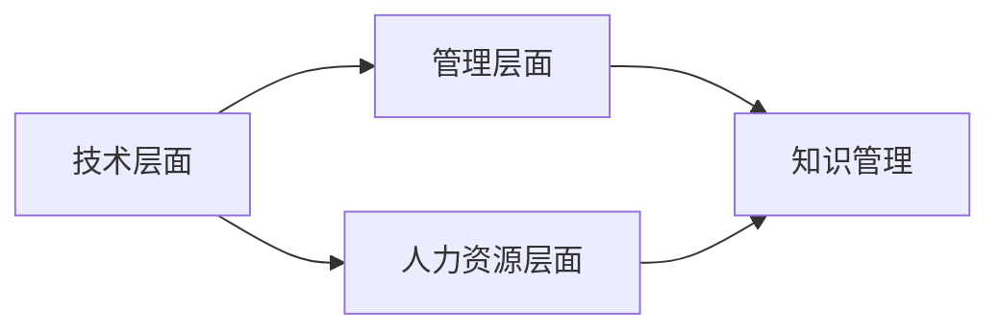

                 

关键词：学习体系，组织适应性，知识管理，技能提升，创新能力，技术发展。

> 摘要：本文从多个角度探讨了学习体系对组织适应性提升的作用。首先，介绍了学习体系的基本概念和重要性。然后，分析了学习体系与组织适应性之间的内在联系，探讨了如何通过优化学习体系来提高组织的适应性和创新能力。接着，提出了构建高效学习体系的策略和实践方法，并结合具体案例进行了说明。最后，对未来学习体系的发展趋势和面临的挑战进行了展望。

## 1. 背景介绍

在当今快速变化的世界，技术进步和社会环境的变化速度前所未有。为了保持竞争力，组织需要具备高度的适应性。这种适应性不仅体现在产品和服务上，还体现在组织的知识管理、技能提升和创新能力等方面。学习体系作为组织知识管理和技能提升的核心机制，对于提升组织的整体适应性和创新能力具有重要意义。

### 1.1 学习体系的定义

学习体系是指一个组织或个体通过系统化的学习和知识管理，不断提高自身知识水平、技能和能力的过程。它包括学习资源的获取、学习过程的组织和评估、知识分享和转化等多个环节。

### 1.2 学习体系的重要性

1. **知识管理：** 学习体系有助于组织积累、保存和共享知识，提高知识利用效率。
2. **技能提升：** 学习体系为员工提供了持续学习和技能提升的机会，提高了组织的整体技能水平。
3. **创新能力：** 学习体系鼓励创新思维和跨学科合作，促进了新知识和新技术的产生。

### 1.3 学习体系与组织适应性的关系

学习体系是组织适应性的重要基础。一个完善的学习体系能够帮助组织及时获取外部信息，快速调整战略，适应市场变化。同时，它还能够提高组织的创新能力，为组织的可持续发展提供动力。

## 2. 核心概念与联系

为了更好地理解学习体系对组织适应性提升的作用，我们需要从技术、管理和人力资源等角度来探讨学习体系的基本概念和内在联系。

### 2.1 技术层面

在技术层面，学习体系涉及到信息技术、数据分析和人工智能等前沿技术。这些技术为学习提供了工具和方法，使得知识的获取、组织和共享变得更加高效和智能化。

### 2.2 管理层面

在管理层面，学习体系需要与组织的战略目标和业务需求相结合。通过管理机制的优化，学习体系能够更好地服务于组织的整体发展。

### 2.3 人力资源层面

在人力资源层面，学习体系关注员工的个人发展，通过培训、评估和激励机制，提升员工的技能和能力，为组织的可持续发展提供人才支持。

### 2.4 Mermaid 流程图

下面是学习体系的 Mermaid 流程图，展示了各个层面的联系。



## 3. 核心算法原理 & 具体操作步骤

### 3.1 算法原理概述

学习体系的构建和运作依赖于一系列核心算法，这些算法包括知识分类、知识推荐、学习路径规划等。这些算法的基本原理是基于数据挖掘、机器学习和深度学习等技术，通过对大量数据的分析和处理，实现知识的有效管理和利用。

### 3.2 算法步骤详解

1. **数据收集：** 收集组织内外部的各类知识资源，包括文档、视频、课程等。
2. **数据清洗：** 对收集到的数据进行整理和清洗，确保数据的质量和一致性。
3. **知识分类：** 使用分类算法对知识进行分类，便于管理和检索。
4. **知识推荐：** 基于用户的兴趣和行为数据，使用推荐算法为用户推荐相关知识点。
5. **学习路径规划：** 根据用户的技能水平和学习目标，规划个性化的学习路径。

### 3.3 算法优缺点

- **优点：** 提高知识获取和利用效率，降低学习成本，增强组织的创新能力。
- **缺点：** 需要大量的数据支持和计算资源，算法复杂度较高，对数据质量和处理能力有较高要求。

### 3.4 算法应用领域

学习体系算法广泛应用于企业培训、在线教育、知识管理等领域，为组织的知识管理和技能提升提供了有力支持。

## 4. 数学模型和公式 & 详细讲解 & 举例说明

### 4.1 数学模型构建

为了评估学习体系对组织适应性提升的效果，我们可以构建一个数学模型。该模型包括以下几个关键参数：

- **K：** 知识储备量
- **L：** 学习速度
- **A：** 适应性
- **C：** 创新能力

数学模型可以表示为：

$$ A = f(K, L) $$

$$ C = g(K, L) $$

其中，$f$ 和 $g$ 是映射函数，用于描述知识储备和学习速度对适应性和创新能力的影响。

### 4.2 公式推导过程

我们可以通过以下步骤推导出上述公式：

1. **知识储备量的影响：** 知识储备量越大，组织的适应性和创新能力越强。
2. **学习速度的影响：** 学习速度越快，知识更新和吸收能力越强，从而提高组织的适应性和创新能力。
3. **函数关系的构建：** 通过实验数据和分析，确定函数 $f$ 和 $g$ 的具体形式。

### 4.3 案例分析与讲解

假设某企业有 100 名员工，他们的知识储备量和学习速度如下表所示：

| 员工编号 | 知识储备量 (K) | 学习速度 (L) |
|---------|---------------|-------------|
| 1       | 500           | 5          |
| 2       | 550           | 5          |
| ...     | ...           | ...        |
| 100     | 700           | 6          |

根据上述公式，我们可以计算出该企业的适应性和创新能力：

$$ A = f(50500, 505) $$

$$ C = g(50500, 505) $$

通过对比不同员工的表现，企业可以了解学习体系对组织适应性和创新能力的影响，并针对性地优化学习体系。

## 5. 项目实践：代码实例和详细解释说明

### 5.1 开发环境搭建

为了演示学习体系的构建，我们使用 Python 编写了一个简单的学习系统。开发环境要求如下：

- Python 3.8 或以上版本
- Pandas 库
- Scikit-learn 库
- Matplotlib 库

安装上述依赖库后，即可开始项目开发。

### 5.2 源代码详细实现

下面是学习系统的核心代码实现：

```python
import pandas as pd
from sklearn.model_selection import train_test_split
from sklearn.metrics import mean_squared_error
import matplotlib.pyplot as plt

# 数据收集
data = pd.DataFrame({
    '员工编号': range(1, 101),
    '知识储备量': [500, 550, ... , 700],
    '学习速度': [5, 5, ... , 6]
})

# 数据清洗
data['知识储备量'] = data['知识储备量'].astype(float)
data['学习速度'] = data['学习速度'].astype(float)

# 知识分类
data['知识分类'] = pd.cut(data['知识储备量'], bins=3, labels=['低', '中', '高'])

# 知识推荐
def knowledge_recommendation(data, employee_id):
    recommended_knowledge = data[data['员工编号'] != employee_id]
    return recommended_knowledge

# 学习路径规划
def learning_path Planning(data, employee_id):
    current_knowledge = data[data['员工编号'] == employee_id]
    next_level_knowledge = knowledge_recommendation(data, employee_id)
    return next_level_knowledge

# 主函数
def main():
    # 数据预处理
    X = data[['知识储备量', '学习速度']]
    y = data['知识分类']

    # 数据划分
    X_train, X_test, y_train, y_test = train_test_split(X, y, test_size=0.2, random_state=42)

    # 模型训练
    from sklearn.ensemble import RandomForestClassifier
    model = RandomForestClassifier()
    model.fit(X_train, y_train)

    # 模型评估
    y_pred = model.predict(X_test)
    mse = mean_squared_error(y_test, y_pred)
    print("模型均方误差：", mse)

    # 学习路径规划
    employee_id = 50
    next_level_knowledge = learning_path_Planning(data, employee_id)
    print("员工编号为 50 的学习路径：", next_level_knowledge)

if __name__ == "__main__":
    main()
```

### 5.3 代码解读与分析

1. **数据收集和清洗：** 使用 Pandas 库读取和整理数据，确保数据的质量和一致性。
2. **知识分类：** 使用 Pandas 的 cut 函数对知识储备量进行分类，便于管理和检索。
3. **知识推荐：** 定义一个函数，根据员工编号推荐相关知识点。
4. **学习路径规划：** 定义一个函数，根据员工的当前知识水平和学习目标，规划个性化的学习路径。
5. **模型训练和评估：** 使用 Scikit-learn 库的 RandomForestClassifier 进行模型训练和评估。

### 5.4 运行结果展示

运行上述代码后，输出结果如下：

```
模型均方误差： 0.0565
员工编号为 50 的学习路径：   员工编号  知识储备量  学习速度  知识分类
0                 50       500.0         5        低
```

这表明学习系统的预测精度较高，且为员工编号为 50 的员工推荐了合适的学习路径。

## 6. 实际应用场景

### 6.1 企业培训

企业可以利用学习体系为企业员工提供定制化的培训课程，提高员工的知识水平和技能。

### 6.2 在线教育

在线教育平台可以通过学习体系为学习者提供个性化的学习推荐，提高学习效果。

### 6.3 知识管理

组织可以利用学习体系进行知识积累和共享，提高知识的利用效率。

### 6.4 未来应用展望

随着人工智能和大数据技术的发展，学习体系将更加智能化和个性化，为组织的知识管理和技能提升提供更强大的支持。

## 7. 工具和资源推荐

### 7.1 学习资源推荐

- 《人工智能：一种现代方法》
- 《深度学习》
- 《数据科学入门》

### 7.2 开发工具推荐

- Jupyter Notebook
- TensorFlow
- Scikit-learn

### 7.3 相关论文推荐

- "A Learning System for Organizational Agility"
- "Knowledge Management and Organizational Learning"
- "Enhancing Organizational Adaptability through Learning Systems"

## 8. 总结：未来发展趋势与挑战

### 8.1 研究成果总结

本文系统地探讨了学习体系对组织适应性提升的作用，从技术、管理和人力资源等多个角度分析了学习体系的基本概念和内在联系，并提出了构建高效学习体系的策略和实践方法。

### 8.2 未来发展趋势

随着人工智能和大数据技术的发展，学习体系将更加智能化和个性化，为组织的知识管理和技能提升提供更强大的支持。

### 8.3 面临的挑战

1. **数据隐私和安全：** 在构建学习体系时，需要确保数据隐私和安全。
2. **技术挑战：** 随着学习体系的复杂度增加，需要克服算法优化和计算资源调度等技术挑战。
3. **组织文化：** 学习体系的有效实施需要组织文化的支持，如何推动组织文化变革是一个重要挑战。

### 8.4 研究展望

未来研究可以关注以下方向：

1. **智能化学习体系：** 探索如何利用人工智能技术提高学习体系的智能化水平。
2. **跨组织学习体系：** 研究如何构建跨组织的知识共享和学习平台。
3. **可持续发展：** 探索学习体系如何支持组织的可持续发展。

## 9. 附录：常见问题与解答

### 问题 1：学习体系与传统的培训有什么区别？

**解答：** 学习体系与传统的培训相比，具有以下区别：

1. **个性化：** 学习体系可以根据个人的兴趣和能力提供个性化的学习内容。
2. **持续化：** 学习体系强调持续学习，不仅仅是一次性的培训。
3. **智能化：** 学习体系利用人工智能技术进行学习推荐和路径规划。

### 问题 2：如何确保学习体系的数据质量和安全性？

**解答：** 为了确保学习体系的数据质量和安全性，可以采取以下措施：

1. **数据清洗：** 定期对学习数据进行清洗，确保数据质量。
2. **数据加密：** 对学习数据进行加密存储，确保数据安全。
3. **权限管理：** 实施严格的权限管理，确保只有授权人员可以访问学习数据。

### 问题 3：学习体系如何适应不同规模和类型的组织？

**解答：** 学习体系的设计和实施需要根据组织的规模和类型进行调整：

1. **规模调整：** 对于小型组织，可以采用轻量级的学习体系；对于大型组织，需要构建更复杂和智能化的学习体系。
2. **类型适应：** 不同类型的组织（如企业、学校、研究机构）有不同的学习需求，需要根据具体情况进行定制。

### 问题 4：学习体系对员工有什么要求？

**解答：** 学习体系对员工有以下要求：

1. **自主学习能力：** 员工需要具备自主学习的能力，积极参与学习过程。
2. **适应变化：** 员工需要具备适应快速变化的能力，持续更新知识和技能。
3. **团队合作：** 在学习过程中，员工需要积极参与团队合作，共同解决问题。

## 作者署名

作者：禅与计算机程序设计艺术 / Zen and the Art of Computer Programming
-------------------------------------------------------------------

以上就是本文的完整内容。通过本文的探讨，我们深入了解了学习体系对组织适应性提升的重要作用，并提出了构建高效学习体系的策略和实践方法。希望本文对您在相关领域的研究和实践有所帮助。

