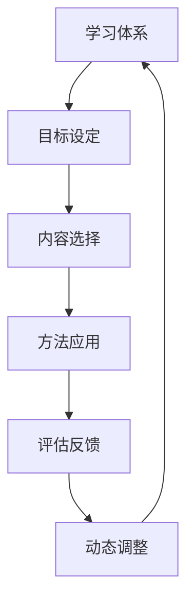

                 

学习体系构建是一个复杂而长期的过程，它需要结合理论与实践，不断迭代和完善。在技术日新月异的今天，构建一个高效的学习体系显得尤为重要。本文将探讨如何通过持续进化的动力，构建一个完整的学习体系，以助力个人和团队在技术领域中不断成长。

## 关键词

- 学习体系
- 持续进化
- 技术成长
- 教育理念
- 项目实践

## 摘要

本文旨在为读者提供一个构建学习体系的框架和方法，强调持续进化的重要性。通过分析学习过程中的关键因素，本文将介绍如何设计一个结构化的学习体系，并结合具体实例，探讨如何通过项目实践和工具资源，实现学习体系的持续优化和进化。

## 1. 背景介绍

在信息技术飞速发展的时代，技能的更新换代速度越来越快，传统的一次性学习方式已经无法满足需求。构建一个能够持续进化的学习体系，成为提升个人和团队技术能力的关键。本文将从以下几个方面展开讨论：

- **学习体系的重要性**：探讨学习体系在个人和团队成长中的关键作用。
- **持续进化的动力**：分析驱动学习体系不断进化的因素。
- **构建学习体系的步骤**：介绍构建学习体系的具体方法和步骤。
- **实践与反馈**：强调项目实践和反馈在学习体系构建中的重要性。
- **工具与资源**：推荐一些有助于构建和优化学习体系的工具和资源。

## 2. 核心概念与联系

### 2.1 学习体系的概念

学习体系是指一套系统化的学习方法和策略，它包括学习的目标、内容、方法、评估和反馈等组成部分。一个完善的学习体系能够帮助学习者明确学习目标，选择合适的学习内容，采用高效的学习方法，并通过评估和反馈不断调整学习策略。

### 2.2 持续进化的动力

持续进化的动力来源于以下几个方面：

- **技术发展趋势**：技术领域的不断进步推动学习体系需要不断更新和优化。
- **个人成长需求**：学习者根据自己的职业规划和兴趣，不断调整学习目标和内容。
- **团队协作需求**：团队在共同学习过程中，需要不断适应和调整，以实现共同成长。
- **市场变化**：市场需求的变动要求学习体系能够快速响应，以保持竞争力。

### 2.3 学习体系与持续进化的联系

学习体系与持续进化的联系体现在以下几个方面：

- **目标一致性**：学习体系的目标与持续进化的目标保持一致，即不断提升学习者的技术能力和适应能力。
- **动态调整**：学习体系需要根据外部环境和内部需求的变化，进行动态调整和优化。
- **反馈机制**：通过持续的评估和反馈，学习体系能够及时发现并解决问题，实现持续进化。

### 2.4 Mermaid 流程图



## 3. 核心算法原理 & 具体操作步骤

### 3.1 算法原理概述

学习体系的构建可以看作是一个迭代优化的过程，核心算法包括以下步骤：

1. **目标设定**：明确学习目标，包括短期和长期目标。
2. **内容选择**：根据目标选择合适的学习内容。
3. **方法应用**：采用多种学习方法，如阅读、实践、交流等。
4. **评估反馈**：对学习效果进行评估，收集反馈信息。
5. **动态调整**：根据评估和反馈，调整学习目标和内容。

### 3.2 算法步骤详解

1. **目标设定**

   - **明确学习目标**：设定清晰、具体、可行的学习目标。

   $$ 目标 = f(学习者需求，职业规划，技术趋势) $$

   - **制定计划**：将目标分解为具体的行动计划。

2. **内容选择**

   - **需求分析**：分析学习者的知识背景和技能需求。

   $$ 需求 = f(目标，现有技能，市场趋势) $$

   - **内容筛选**：选择与需求匹配的学习内容。

   $$ 内容 = g(需求，资源库) $$

3. **方法应用**

   - **多样化方法**：采用多种学习方法，提高学习效果。

   $$ 方法 = h(内容，学习者偏好) $$

   - **实践应用**：通过实际项目和实践，巩固学习成果。

4. **评估反馈**

   - **学习评估**：对学习效果进行定量和定性的评估。

   $$ 评估 = i(学习结果，预期目标) $$

   - **反馈收集**：收集来自学习者、导师、同事的反馈信息。

   $$ 反馈 = j(评估结果，交流互动) $$

5. **动态调整**

   - **目标修正**：根据评估和反馈，调整学习目标。

   $$ 目标修正 = k(原目标，反馈) $$

   - **内容更新**：更新学习内容，以适应新的目标和需求。

   $$ 内容更新 = l(原内容，新需求) $$

### 3.3 算法优缺点

**优点**：

- **灵活性**：算法能够根据外部环境和内部需求的变化进行动态调整。
- **可持续性**：通过持续的评估和反馈，学习体系能够不断优化和进化。
- **适应性**：算法能够适应不同学习者的需求和学习风格。

**缺点**：

- **复杂性**：算法的实现和操作过程相对复杂，需要较高的技术素养。
- **时间成本**：持续进化的过程需要较长的时间，对学习者的耐心和毅力有较高要求。

### 3.4 算法应用领域

算法可以应用于以下领域：

- **个人学习**：帮助个人构建和优化学习体系。
- **团队培训**：用于团队内部的技能提升和知识共享。
- **在线教育**：在线教育平台可以通过算法推荐合适的学习内容。

## 4. 数学模型和公式 & 详细讲解 & 举例说明

### 4.1 数学模型构建

构建学习体系的数学模型主要包括以下几个方面：

- **目标函数**：用于定义学习目标。

  $$ f(x) = g(h(x)) $$

  其中，\( x \) 代表学习内容，\( g \) 和 \( h \) 分别代表学习方法和评估指标。

- **优化策略**：用于优化学习目标和内容。

  $$ 最优化 = \min f(x) $$

- **反馈机制**：用于收集和利用反馈信息。

  $$ 反馈 = j(i(x), 互动) $$

### 4.2 公式推导过程

以目标设定为例，推导过程如下：

1. **定义目标函数**

   设定学习目标为提高代码编写效率，目标函数为：

   $$ f(x) = g(h(x)) $$

   其中，\( h(x) \) 代表代码编写效率，\( g \) 代表评估指标。

2. **选择评估指标**

   选择代码质量作为评估指标，\( g \) 可以定义为：

   $$ g(h(x)) = 质量评分 $$

   其中，质量评分范围为0到100分。

3. **优化目标**

   优化目标为提高代码质量评分，即：

   $$ 最优化 = \min f(x) $$

4. **选择学习方法**

   选择多种学习方法，如阅读、实践、交流等，\( g \) 可以定义为：

   $$ g(h(x)) = \sum_{i=1}^{n} w_i \cdot h(x_i) $$

   其中，\( w_i \) 为学习方法权重，\( x_i \) 为学习方法。

### 4.3 案例分析与讲解

以某软件开发团队为例，分析其学习体系的构建过程。

1. **目标设定**

   - **短期目标**：提高团队开发效率。
   - **长期目标**：培养具有创新能力的开发者。

2. **内容选择**

   - **基础知识**：选择编程语言、数据结构与算法等基础知识。
   - **技术前沿**：关注当前热门技术，如人工智能、大数据等。

3. **方法应用**

   - **内部培训**：定期举办内部培训，分享开发经验和技术知识。
   - **外部交流**：参加行业会议和研讨会，了解行业动态。

4. **评估反馈**

   - **开发效率**：通过任务完成情况和代码质量评分进行评估。
   - **创新能力**：通过项目创新程度和团队业绩进行评估。

5. **动态调整**

   - **目标修正**：根据评估结果，调整学习目标和内容。
   - **内容更新**：引入新技术和知识，保持学习体系的活力。

## 5. 项目实践：代码实例和详细解释说明

### 5.1 开发环境搭建

为了更好地进行项目实践，首先需要搭建一个合适的开发环境。以下是一个简单的开发环境搭建步骤：

1. **安装操作系统**：选择一个适合自己的操作系统，如Linux或macOS。
2. **安装编辑器**：安装一个强大的文本编辑器，如Visual Studio Code。
3. **安装编程语言**：安装常用的编程语言，如Python、Java等。
4. **安装依赖库**：根据项目需求，安装必要的依赖库。

### 5.2 源代码详细实现

以下是一个简单的Python代码实例，用于计算两个数的和：

```python
def add(a, b):
    return a + b

result = add(3, 5)
print("结果：", result)
```

### 5.3 代码解读与分析

1. **函数定义**：定义一个名为`add`的函数，接收两个参数`a`和`b`。
2. **函数实现**：在函数内部，使用`return`语句返回两个参数的和。
3. **函数调用**：调用`add`函数，传入两个数值参数`3`和`5`。
4. **打印结果**：使用`print`函数输出计算结果。

### 5.4 运行结果展示

运行以上代码，输出结果如下：

```
结果： 8
```

## 6. 实际应用场景

学习体系在以下实际应用场景中具有重要意义：

- **个人技能提升**：通过构建学习体系，个人能够系统地学习新技术，提升自身竞争力。
- **团队协作发展**：通过共同构建学习体系，团队可以统一学习目标，提升整体技术水平。
- **教育培训**：在线教育平台可以通过学习体系，为学习者提供个性化的学习方案。

## 7. 工具和资源推荐

为了更好地构建和优化学习体系，以下是一些推荐的工具和资源：

- **学习平台**：如Coursera、edX等。
- **编程社区**：如GitHub、Stack Overflow等。
- **技术书籍**：推荐一些经典的技术书籍，如《设计模式》、《算法导论》等。

## 8. 总结：未来发展趋势与挑战

### 8.1 研究成果总结

通过本文的探讨，我们总结了构建学习体系的关键要素和核心算法原理。这些研究成果为构建和优化学习体系提供了理论依据和实践指导。

### 8.2 未来发展趋势

未来，学习体系将朝着更加智能化、个性化和协同化的方向发展。人工智能技术将在学习体系构建中发挥重要作用，帮助学习者更好地适应不断变化的技术环境。

### 8.3 面临的挑战

学习体系构建过程中，面临以下挑战：

- **技术更新速度快**：如何快速获取和掌握新技术。
- **个性化需求差异大**：如何为不同学习者提供个性化的学习方案。
- **团队合作困难**：如何在团队中实现有效的学习和知识共享。

### 8.4 研究展望

未来的研究可以重点关注以下几个方面：

- **学习体系智能化**：利用人工智能技术，实现学习体系的自动化和智能化。
- **个性化学习路径**：研究如何根据学习者的特点和需求，构建个性化的学习路径。
- **跨学科合作**：探讨跨学科合作在学习体系构建中的应用，实现知识的融合和创新。

## 9. 附录：常见问题与解答

### 问题1：如何快速掌握新技术？

**解答**：通过以下方法，可以帮助你快速掌握新技术：

- **关注技术动态**：定期阅读技术博客、关注技术社区，了解最新技术动态。
- **实践项目**：通过实际项目，将新技术应用到实际场景中，加深理解和掌握。
- **学习资源**：利用在线课程、技术书籍等资源，系统地学习新技术。

### 问题2：如何构建一个有效的学习体系？

**解答**：构建一个有效的学习体系，可以遵循以下步骤：

- **明确目标**：设定清晰的学习目标，包括短期和长期目标。
- **选择内容**：根据目标选择合适的学习内容，包括基础知识和技术前沿。
- **多样化方法**：采用多种学习方法，如阅读、实践、交流等。
- **持续评估**：定期对学习效果进行评估，收集反馈信息。
- **动态调整**：根据评估和反馈，调整学习目标和内容。

### 问题3：学习体系如何保持持续进化？

**解答**：学习体系保持持续进化的关键在于：

- **适应技术趋势**：及时关注技术发展趋势，更新学习内容和方法。
- **个性化需求**：根据学习者的个性化需求，调整学习目标和内容。
- **反馈机制**：建立有效的反馈机制，通过评估和反馈，持续优化学习体系。
- **团队协作**：在团队中实现知识共享和协作学习，共同推进学习体系的进化。

## 作者署名

作者：禅与计算机程序设计艺术 / Zen and the Art of Computer Programming

通过以上内容，我们希望能够为读者提供关于学习体系构建的深入见解和实用方法。在技术不断进步的时代，构建一个高效的学习体系，是每个人和团队持续成长的关键。希望本文能够对您有所启发，助力您在技术领域取得更大的成就。

