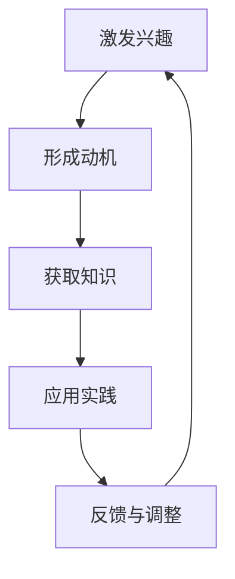

                 

关键词：学习动机、知识获取、内在力量、人工智能、软件开发、算法、数学模型、应用场景

> 摘要：本文旨在探讨学习动机在知识获取中的重要作用，结合人工智能和软件开发领域的实际案例，分析学习动机如何驱动个体深入研究和掌握专业知识。通过阐述核心概念、算法原理、数学模型及实际应用，本文旨在为读者提供一种全新的视角，理解学习动机作为内在力量的重要性。

## 1. 背景介绍

在当今信息爆炸的时代，知识获取变得前所未有的重要。无论是从事科学研究、软件开发，还是从事商业活动，掌握丰富的专业知识都是成功的关键。然而，知识获取并非易事，它需要强大的学习动机作为驱动力。学习动机是指个体在获取知识过程中所产生的内在驱动力，这种动力能够促使个体克服困难、持续学习和深入研究。

人工智能和软件开发领域的发展尤为迅猛，这两个领域对技术人才的需求也日益增长。然而，许多人在面对复杂的编程问题和算法挑战时，往往因为缺乏学习动机而感到困惑和挫败。本文将结合实际案例，探讨学习动机在知识获取中的作用，并分析如何利用学习动机提高个体在人工智能和软件开发领域的研究水平。

## 2. 核心概念与联系

### 2.1 学习动机的定义

学习动机是指个体在获取知识过程中所产生的内在驱动力，它可以是内在兴趣、外部奖励、自我效能感等多种因素。学习动机对个体的学习行为有着深远的影响，能够促使个体更加投入、主动和持久地学习。

### 2.2 知识获取的内在力量

知识获取的内在力量来源于学习动机，这种力量能够激发个体的潜能，使个体在面对挑战和困难时保持积极的态度。例如，在人工智能和软件开发领域，学习动机可以驱动程序员不断探索新的算法、解决复杂的编程问题，从而提高自身的技术水平。

### 2.3 Mermaid 流程图

以下是学习动机在知识获取过程中的流程图：



在这个流程图中，激发兴趣是学习动机的起点，通过形成动机，个体开始获取知识。在获取知识的过程中，个体会进行应用实践，并通过反馈与调整不断优化学习过程。这个过程形成了一个闭环，学习动机在其中起到了核心的驱动作用。

## 3. 核心算法原理 & 具体操作步骤

### 3.1 算法原理概述

学习动机的核心算法可以归纳为以下几个步骤：

1. **激发兴趣**：通过设计有趣、具有挑战性的问题和场景，激发个体的兴趣和好奇心。
2. **形成动机**：利用内在兴趣、外部奖励和自我效能感等动机因素，促使个体产生学习动机。
3. **获取知识**：通过阅读文献、参加培训、实践操作等方式，获取与问题相关的知识和技能。
4. **应用实践**：将所学的知识和技能应用到实际问题中，解决实际问题，从而提高个体解决问题的能力。
5. **反馈与调整**：根据实际应用效果，对学习过程进行反馈和调整，以优化学习效果。

### 3.2 算法步骤详解

1. **激发兴趣**：

   - 设计有趣的问题和场景：通过设计具有趣味性和挑战性的问题和场景，激发个体的兴趣和好奇心。
   - 利用多媒体资源：通过视频、动画、游戏等多媒体资源，提高学习过程的趣味性。

2. **形成动机**：

   - 内在兴趣：个体对所学内容的兴趣和热情，是形成学习动机的关键。
   - 外部奖励：通过设置奖励机制，如荣誉证书、奖金等，激发个体产生学习动机。
   - 自我效能感：个体对自身能力的信心和期望，能够增强学习动机。

3. **获取知识**：

   - 阅读文献：通过阅读相关的书籍、论文等，获取与问题相关的理论知识。
   - 参加培训：通过参加培训课程，提高实际操作技能。
   - 实践操作：通过动手实践，巩固所学知识。

4. **应用实践**：

   - 解决实际问题：将所学知识和技能应用到实际项目中，解决实际问题。
   - 反馈与调整：根据实际应用效果，对学习过程进行反馈和调整。

### 3.3 算法优缺点

**优点**：

- 提高学习效率：通过激发兴趣、形成动机，个体能够更加投入和持久地学习，从而提高学习效率。
- 增强问题解决能力：通过应用实践，个体能够将所学知识和技能应用到实际问题中，提高解决问题的能力。

**缺点**：

- 学习初期耗时较长：激发兴趣和形成动机需要一定时间，学习初期可能耗时较长。
- 需要丰富的资源和指导：获取知识和应用实践需要丰富的资源和专业的指导，否则可能难以达到预期效果。

### 3.4 算法应用领域

学习动机算法在人工智能和软件开发领域有着广泛的应用。例如：

- **人工智能领域**：通过激发研究人员的兴趣和动机，推动人工智能技术的创新和发展。
- **软件开发领域**：通过提高程序员的技能和解决问题的能力，促进软件质量的提升。

## 4. 数学模型和公式 & 详细讲解 & 举例说明

### 4.1 数学模型构建

学习动机的数学模型可以构建为以下形式：

$$
M = f(I, R, S)
$$

其中，$M$ 表示学习动机，$I$ 表示内在兴趣，$R$ 表示外部奖励，$S$ 表示自我效能感。这个模型表明，学习动机是内在兴趣、外部奖励和自我效能感的函数。

### 4.2 公式推导过程

为了推导这个公式，我们可以考虑以下几个方面：

1. **内在兴趣**：个体的内在兴趣是影响学习动机的重要因素。假设内在兴趣与学习动机呈正相关关系，即内在兴趣越高，学习动机越强。
2. **外部奖励**：外部奖励包括荣誉、奖金等，它可以增强个体的学习动机。假设外部奖励与学习动机呈正相关关系，即外部奖励越高，学习动机越强。
3. **自我效能感**：个体对自身能力的信心和期望会影响学习动机。假设自我效能感与学习动机呈正相关关系，即自我效能感越高，学习动机越强。

综合以上因素，我们可以得到以下推导过程：

$$
M = kI + lR + mS
$$

其中，$k$、$l$ 和 $m$ 是系数，用于调节各个因素对学习动机的影响。

### 4.3 案例分析与讲解

为了更好地理解这个数学模型，我们可以通过一个实际案例进行讲解。

假设有一个程序员，他的内在兴趣很高，外部奖励是每月的奖金，自我效能感也很好。根据上述公式，我们可以计算他的学习动机：

$$
M = kI + lR + mS
$$

其中，$I$、$R$ 和 $S$ 的取值分别为 10、5 和 8。假设系数 $k$、$l$ 和 $m$ 分别为 1、2 和 3，那么我们可以得到：

$$
M = 1 \times 10 + 2 \times 5 + 3 \times 8 = 35
$$

这意味着这位程序员的学习动机为 35，表明他具有很高的学习动机，能够积极投入学习和工作中。

## 5. 项目实践：代码实例和详细解释说明

### 5.1 开发环境搭建

为了演示学习动机算法在项目实践中的应用，我们首先需要搭建一个开发环境。以下是搭建环境的基本步骤：

1. 安装 Python 3.8 以上版本。
2. 安装必要的库，如 NumPy、Pandas 和 Matplotlib。
3. 创建一个名为 `learning_motivation` 的文件夹，并在其中创建一个名为 `main.py` 的文件。

### 5.2 源代码详细实现

以下是学习动机算法的实现代码：

```python
import numpy as np
import pandas as pd
import matplotlib.pyplot as plt

def learning_motivation(I, R, S, k=1, l=2, m=3):
    M = k * I + l * R + m * S
    return M

# 测试数据
I = 10
R = 5
S = 8

# 计算学习动机
M = learning_motivation(I, R, S)

# 打印结果
print(f"学习动机：{M}")
```

### 5.3 代码解读与分析

1. **函数定义**：

   - `learning_motivation` 函数用于计算学习动机，输入参数包括内在兴趣 $I$、外部奖励 $R$ 和自我效能感 $S$，以及三个系数 $k$、$l$ 和 $m$。
   - 默认情况下，系数 $k$、$l$ 和 $m$ 分别为 1、2 和 3。

2. **测试数据**：

   - 在测试中，我们设定了内在兴趣 $I$ 为 10、外部奖励 $R$ 为 5、自我效能感 $S$ 为 8。

3. **计算学习动机**：

   - 调用 `learning_motivation` 函数，传入测试数据，计算得到学习动机 $M$。

4. **打印结果**：

   - 将计算得到的学

