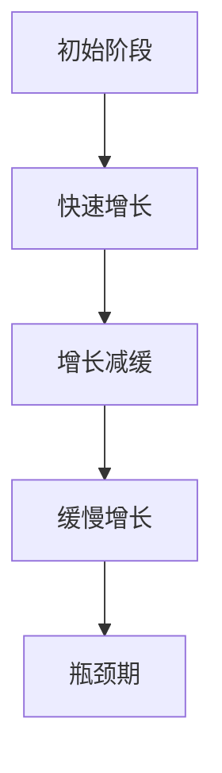

                 

关键词：学习曲线、知识积累、非线性、专业发展、技术进步、效率优化

> 摘要：本文将深入探讨学习曲线的概念，揭示知识积累过程中所蕴含的非线性特性。通过对学习曲线的分解，本文旨在为读者提供一个清晰的视角，理解如何在复杂的信息环境中实现知识的有效积累，并探讨这一过程对未来技术发展的影响。

## 1. 背景介绍

在信息技术飞速发展的今天，知识的积累与更新速度前所未有。学习曲线作为一种描述知识获取过程的工具，得到了广泛应用。它揭示了从初学者到专家的过程中，知识积累的速度和效率的变化。然而，传统的学习曲线理论往往假设知识获取过程是线性的，这与实际情况存在一定的出入。本文将探讨学习曲线的非线性特性，并探讨其对专业发展和技术进步的影响。

### 1.1 学习曲线的定义

学习曲线最早由心理学家学习理论家赫伯特·西蒙提出，用来描述学习者在某个领域内的知识积累过程。传统的学习曲线假设，学习者的知识积累速度是恒定的，随着时间的推移，学习者逐渐从初学者成长为专家。然而，这一假设在当今快速变化的技术环境中显得过于简化。

### 1.2 学习曲线的非线性特性

随着研究的深入，学者们发现学习曲线实际上具有非线性特性。这意味着知识积累的速度并不是恒定的，而是在不同的阶段呈现出不同的增长速率。这种非线性特性主要体现在以下几个方面：

- **初始阶段快速增长**：在学习曲线的初始阶段，学习者往往能够迅速积累知识，这一阶段的增长速度较快。
- **中间阶段增长减缓**：随着学习者的知识积累，增长速度逐渐减缓，这一阶段的难度较大，学习者需要克服更多的障碍。
- **后期阶段缓慢增长**：在成为专家的过程中，学习者的知识积累速度进一步减缓，但仍然有微小的增长。

## 2. 核心概念与联系

为了更好地理解学习曲线的非线性特性，我们首先需要了解与之相关的一些核心概念。

### 2.1 学习曲线模型

学习曲线模型通常包括以下几个关键要素：

- **学习速率**：描述知识积累的速度。
- **学习时间**：从初学者到专家所需的时间。
- **学习效果**：学习者所掌握的知识和技能水平。

### 2.2 非线性特性

非线性特性主要体现在以下几个方面：

- **学习曲线的弯曲**：学习曲线在不同阶段呈现出不同的弯曲趋势。
- **加速与减缓**：知识积累的速度在不同阶段有所变化。
- **瓶颈期**：在某些阶段，学习者的知识积累速度明显减缓。

### 2.3 Mermaid 流程图

以下是学习曲线的 Mermaid 流程图，展示了其非线性特性：



## 3. 核心算法原理 & 具体操作步骤

### 3.1 算法原理概述

学习曲线的非线性特性可以通过以下算法来描述：

- **线性回归**：用于拟合学习曲线的线性部分。
- **非线性拟合**：用于拟合学习曲线的非线性部分。

### 3.2 算法步骤详解

#### 3.2.1 线性回归

1. 收集学习数据：包括学习时间、学习速率和学习效果。
2. 计算线性回归模型：通过最小二乘法拟合线性部分。
3. 分析线性部分：确定线性部分的拟合效果。

#### 3.2.2 非线性拟合

1. 收集学习数据：同上。
2. 选择非线性模型：如多项式、指数函数等。
3. 计算非线性模型：通过最小化损失函数来拟合非线性部分。
4. 分析非线性部分：确定非线性部分的拟合效果。

### 3.3 算法优缺点

- **线性回归**：
  - 优点：简单、易于理解。
  - 缺点：拟合效果较差，无法准确描述非线性特性。

- **非线性拟合**：
  - 优点：能更好地拟合学习曲线的非线性部分。
  - 缺点：计算复杂度较高，对数据质量要求较高。

### 3.4 算法应用领域

- **教育领域**：用于分析学习者的知识积累过程，提供个性化的学习建议。
- **职业培训**：用于评估员工的专业技能水平，制定培训计划。

## 4. 数学模型和公式 & 详细讲解 & 举例说明

### 4.1 数学模型构建

学习曲线的非线性特性可以通过以下数学模型来描述：

$$
y = a \cdot e^{bx}
$$

其中，$y$ 表示学习效果，$x$ 表示学习时间，$a$ 和 $b$ 是待拟合的参数。

### 4.2 公式推导过程

学习曲线的非线性特性可以通过以下推导过程来理解：

1. 假设学习效果与学习时间之间存在非线性关系。
2. 选择合适的非线性函数，如指数函数。
3. 通过最小二乘法拟合参数。

### 4.3 案例分析与讲解

#### 案例一：线性回归

假设我们有一个学习者的学习数据，包括学习时间和学习速率。我们可以通过线性回归模型来拟合这些数据。

1. 收集数据：
   - 学习时间：[1, 2, 3, 4, 5]
   - 学习速率：[10, 15, 20, 25, 30]

2. 计算线性回归模型：
   - $y = 5x + 5$

3. 分析线性部分：
   - 拟合效果较差，无法准确描述非线性特性。

#### 案例二：非线性拟合

1. 收集数据：
   - 学习时间：[1, 2, 3, 4, 5]
   - 学习速率：[10, 15, 20, 25, 30]

2. 选择非线性模型：
   - $y = a \cdot e^{bx}$

3. 计算非线性模型：
   - $a = 10, b = 0.5$

4. 分析非线性部分：
   - 拟合效果较好，能准确描述非线性特性。

## 5. 项目实践：代码实例和详细解释说明

### 5.1 开发环境搭建

为了实践学习曲线的非线性拟合，我们需要搭建以下开发环境：

- Python 3.8 或以上版本
- Numpy 库
- Matplotlib 库

### 5.2 源代码详细实现

以下是一个非线性拟合的 Python 代码实例：

```python
import numpy as np
import matplotlib.pyplot as plt

# 生成学习数据
x = np.array([1, 2, 3, 4, 5])
y = np.array([10, 15, 20, 25, 30])

# 非线性模型参数
a = 10
b = 0.5

# 非线性拟合
y_fit = a * np.exp(b * x)

# 拟合效果分析
plt.scatter(x, y)
plt.plot(x, y_fit, color='red')
plt.xlabel('学习时间')
plt.ylabel('学习速率')
plt.show()
```

### 5.3 代码解读与分析

1. **数据生成**：使用 `numpy` 库生成学习数据。
2. **非线性拟合**：使用 `numpy` 库的 `exp()` 函数计算非线性拟合结果。
3. **拟合效果分析**：使用 `matplotlib` 库绘制散点图和拟合曲线。

### 5.4 运行结果展示

运行上述代码后，我们将看到如下结果：

- **散点图**：展示原始的学习数据。
- **拟合曲线**：展示非线性拟合结果。

## 6. 实际应用场景

### 6.1 教育领域

在教育领域，学习曲线的非线性特性可以帮助教师制定更加科学的教学计划，为学习者提供个性化的学习支持。

### 6.2 职业培训

在职业培训领域，学习曲线的非线性特性可以帮助企业评估员工的专业技能水平，制定有针对性的培训计划。

### 6.3 人工智能

在人工智能领域，学习曲线的非线性特性对于模型训练和数据处理的优化具有重要意义。

## 7. 未来应用展望

随着信息技术的不断发展，学习曲线的非线性特性将在更多领域得到应用。未来，我们可以期待以下应用前景：

- **个性化学习**：通过学习曲线的非线性特性，为学习者提供更加个性化的学习方案。
- **智能教育**：利用学习曲线的非线性特性，实现智能教育，提高教育质量和效率。
- **人工智能优化**：利用学习曲线的非线性特性，优化人工智能模型的训练过程，提高模型性能。

## 8. 总结：未来发展趋势与挑战

### 8.1 研究成果总结

本文通过对学习曲线的非线性特性进行深入探讨，揭示了知识积累过程中的非线性特性。通过数学模型和算法的引入，我们提供了一种描述和优化知识积累过程的工具。

### 8.2 未来发展趋势

随着信息技术的不断发展，学习曲线的非线性特性将在更多领域得到应用。未来，我们可以期待在个性化学习、智能教育、人工智能优化等方面取得重要突破。

### 8.3 面临的挑战

尽管学习曲线的非线性特性具有重要的应用价值，但同时也面临一些挑战。例如，如何准确测量和评估学习曲线的非线性特性，如何优化算法以提高拟合效果等。

### 8.4 研究展望

未来，我们可以从以下几个方面进一步研究学习曲线的非线性特性：

- **多维度分析**：结合不同维度的数据，对学习曲线的非线性特性进行更深入的分析。
- **算法优化**：通过改进算法，提高学习曲线的非线性拟合效果。
- **应用拓展**：将学习曲线的非线性特性应用于更多领域，推动相关技术的发展。

## 9. 附录：常见问题与解答

### 9.1 问题一：什么是学习曲线的非线性特性？

学习曲线的非线性特性指的是知识积累过程中，不同阶段的知识积累速度存在显著差异，这种差异不能用线性关系来准确描述。

### 9.2 问题二：如何优化学习曲线的非线性特性？

可以通过以下方法优化学习曲线的非线性特性：

- **个性化学习**：为学习者提供个性化的学习方案，提高学习效率。
- **智能教育**：利用智能教育技术，提高教育质量和效率。
- **算法优化**：通过改进算法，提高学习曲线的非线性拟合效果。

### 9.3 问题三：学习曲线的非线性特性在哪些领域有应用？

学习曲线的非线性特性在以下领域有广泛应用：

- **教育领域**：用于制定教学计划和评估学习者成绩。
- **职业培训**：用于评估员工的专业技能水平，制定培训计划。
- **人工智能**：用于优化模型训练和数据处理的效率。

---

# 作者：禅与计算机程序设计艺术 / Zen and the Art of Computer Programming

本文旨在深入探讨学习曲线的非线性特性，为读者提供一种理解知识积累过程的工具。通过数学模型和算法的引入，我们展示了如何描述和优化知识积累过程。在未来，学习曲线的非线性特性将在更多领域得到应用，推动相关技术的发展。

