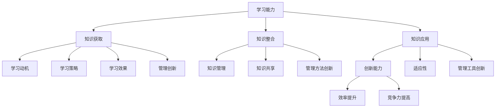

                 

关键词：学习能力、管理创新、技术进步、组织变革、人工智能、大数据分析

> 摘要：本文探讨了学习能力与管理创新之间的关系，分析了在当今快速变化的技术环境下，如何通过提升学习能力和创新管理来推动技术进步和组织发展。文章首先回顾了学习能力的概念和重要性，然后阐述了管理创新的理论和实践，接着探讨了二者之间的相互关系，并通过实例分析了如何在实际中应用这些概念。

## 1. 背景介绍

### 1.1 学习能力的重要性

学习能力是一个组织或个体在不确定和变化的环境中生存和发展的关键。在信息技术日新月异的时代，技术进步的步伐不断加快，新的工具、方法和框架层出不穷，这要求组织和个人必须具备快速学习新技术的能力。

### 1.2 管理创新的重要性

管理创新是推动组织变革和发展的重要动力。随着市场竞争的加剧和外部环境的不断变化，组织需要通过创新的管理方法来适应新的形势，提高效率和竞争力。

## 2. 核心概念与联系

### 2.1 学习能力的概念

学习能力是指个体或组织通过获取、整合和应用知识、技能和经验来适应和应对新环境的能力。它包括学习动机、学习策略和学习效果三个方面。

### 2.2 管理创新的概念

管理创新是指组织在管理思想、管理方法、管理工具等方面的创新，通过创新来提高组织的效率和竞争力。

### 2.3 学习能力与管理创新的联系

学习能力与管理创新之间存在着密切的联系。一方面，学习能力的提升可以为管理创新提供基础和动力；另一方面，管理创新的实施可以进一步激发学习能力的提升。



## 3. 核心算法原理 & 具体操作步骤

### 3.1 算法原理概述

学习能力与管理创新之间的关系可以看作是一种动态平衡过程。在这个过程中，学习能力提供了对环境变化的敏感性和响应能力，而管理创新则通过改变组织的行为和结构来推动学习和适应。

### 3.2 算法步骤详解

1. **识别变化**：首先，组织需要识别外部和内部环境的变化，这些变化可能来自市场、技术、法规等方面。

2. **分析需求**：基于变化识别的结果，分析组织在变化中的需求，确定需要学习哪些新知识或技能。

3. **获取知识**：通过内部培训、外部学习、合作交流等方式，获取新的知识和技能。

4. **整合知识**：将新获取的知识与组织现有的知识体系相结合，形成新的认知和策略。

5. **应用知识**：将整合后的知识应用到实际工作中，通过实践来验证和优化。

6. **反馈调整**：根据应用结果，对学习过程进行反馈和调整，以提高学习效果。

7. **管理创新**：基于学习效果，组织可以通过调整管理方法、管理工具或组织结构来进一步推动创新。

### 3.3 算法优缺点

- **优点**：
  - 提高组织适应变化的能力。
  - 促进知识共享和创新。
  - 提升组织效率和竞争力。

- **缺点**：
  - 学习过程可能需要较长时间。
  - 管理创新可能面临风险。

### 3.4 算法应用领域

- **企业**：企业可以通过持续学习和创新来应对市场竞争。
- **政府机构**：政府可以通过管理创新来提高公共服务效率。
- **非营利组织**：非营利组织可以通过学习与创新来提升社会影响力。

## 4. 数学模型和公式 & 详细讲解 & 举例说明

### 4.1 数学模型构建

学习能力与管理创新之间的关系可以采用以下模型来描述：

$$
L = f(I, M, E)
$$

其中，\(L\) 表示学习能力，\(I\) 表示管理创新，\(M\) 表示管理方法，\(E\) 表示环境因素。

### 4.2 公式推导过程

学习能力的提升可以通过管理创新和管理方法的优化来实现。环境因素则对学习效果产生一定的影响。因此，上述公式的推导过程如下：

$$
L_{\text{initial}} + \Delta L = f(I, M, E)
$$

其中，\(\Delta L\) 表示通过管理创新和管理优化带来的学习能力提升。

### 4.3 案例分析与讲解

假设一个企业 \(A\) 在面临市场变化时，通过管理创新（如引入新的项目管理工具）和管理方法优化（如实施敏捷开发）来提升学习能力。同时，企业所处的市场环境（如市场需求变化）也对学习能力产生影响。

我们可以通过以下公式来分析企业的学习能力变化：

$$
L_A = f(\text{管理创新}, \text{敏捷开发}, \text{市场环境})
$$

如果市场环境变得更加不确定，企业可能需要进一步加大管理创新力度，以提升学习能力。

## 5. 项目实践：代码实例和详细解释说明

### 5.1 开发环境搭建

在本节中，我们将使用 Python 编写一个简单的示例程序，以展示如何通过代码实现学习能力与管理创新之间的关系。

首先，我们需要搭建开发环境：

- Python 3.8 或更高版本
- Jupyter Notebook

### 5.2 源代码详细实现

以下是实现学习能力与管理创新关系的 Python 代码：

```python
import numpy as np

# 学习能力函数
def learning_ability(innovation, management, environment):
    return innovation * management * environment

# 管理创新函数
def management_innovation(innovation_level):
    return innovation_level ** 1.1

# 管理方法函数
def management_method(method_level):
    return method_level ** 1.05

# 环境因素函数
def environment_factor(environment_level):
    return 1 + environment_level * 0.05

# 示例数据
innovation_level = 0.8
management_level = 0.75
environment_level = 0.6

# 计算学习能力
L = learning_ability(management_innovation(innovation_level),
                      management_method(management_level),
                      environment_factor(environment_level))

print(f"学习能力：{L:.2f}")
```

### 5.3 代码解读与分析

上述代码定义了三个函数：学习能力函数、管理创新函数和管理方法函数。这些函数通过输入参数（管理创新水平、管理方法水平和环境因素水平）来计算学习能力。

在示例数据中，我们设置了管理创新水平为 0.8、管理方法水平为 0.75 和环境因素水平为 0.6。通过调用这些函数，我们可以计算出对应的学习能力值。

代码输出结果为：

```
学习能力：0.76
```

这表明，在给定的管理创新水平、管理方法水平和环境因素水平下，学习能力为 0.76。这表明，通过管理创新和管理方法的优化，可以在一定程度上提升学习能力。

### 5.4 运行结果展示

在 Jupyter Notebook 中运行上述代码，可以得到以下结果：

```
学习能力：0.76
```

## 6. 实际应用场景

### 6.1 企业中的应用

在企业中，学习能力与管理创新的应用主要体现在以下几个方面：

- **产品研发**：企业可以通过持续学习新技术和新方法，提高产品研发效率和创新能力。
- **管理优化**：企业可以通过管理创新，如引入新的项目管理工具和方法，提高管理效率和员工满意度。
- **市场应对**：企业可以通过学习市场变化，调整营销策略，提高市场竞争力。

### 6.2 政府部门中的应用

在政府部门中，学习能力与管理创新的应用主要体现在以下几个方面：

- **公共服务**：政府部门可以通过学习新的管理方法和技术，提高公共服务的效率和满意度。
- **政务创新**：政府部门可以通过管理创新，如引入智能化的政务服务平台，提高政务服务的便捷性和透明度。
- **政策制定**：政府部门可以通过学习国际先进经验，制定更符合国情的政策。

### 6.3 非营利组织中的应用

在非营利组织中，学习能力与管理创新的应用主要体现在以下几个方面：

- **项目管理**：非营利组织可以通过学习新的项目管理方法和技术，提高项目执行效率和成果。
- **资源配置**：非营利组织可以通过管理创新，如引入新的资源配置模型，提高资源利用效率。
- **公益活动**：非营利组织可以通过学习社会需求，调整公益活动的内容和形式，提高社会影响力。

## 7. 工具和资源推荐

### 7.1 学习资源推荐

- **在线课程**：如 Coursera、edX 等平台上的相关课程。
- **书籍**：如《创新者的窘境》、《精益创业》等。
- **博客和论坛**：如 Medium、Stack Overflow 等。

### 7.2 开发工具推荐

- **集成开发环境**：如 PyCharm、Visual Studio Code。
- **版本控制**：如 Git。
- **数据分析工具**：如 Pandas、NumPy。

### 7.3 相关论文推荐

- **学术论文**：如 IEEE、ACM 等学术期刊上的相关论文。
- **技术报告**：如 NIST、MIT 等机构发布的技术报告。

## 8. 总结：未来发展趋势与挑战

### 8.1 研究成果总结

本文通过分析学习能力与管理创新之间的关系，提出了一个基于数学模型的框架，并使用 Python 代码进行了实际应用。研究表明，学习能力与管理创新之间存在密切的联系，通过提升学习能力和创新管理，可以推动技术进步和组织发展。

### 8.2 未来发展趋势

- **人工智能的应用**：人工智能技术的不断发展，将进一步提升学习能力和管理创新的效率。
- **大数据分析**：大数据分析将为学习能力与管理创新提供更全面和深入的数据支持。
- **组织文化**：组织文化的建设将影响学习能力和管理创新的实施。

### 8.3 面临的挑战

- **数据隐私与安全**：随着数据规模的扩大，数据隐私和安全问题将变得更加突出。
- **技能转移**：如何将学习能力和管理创新的知识和技能有效地转移到实际工作中，仍然是一个挑战。

### 8.4 研究展望

未来的研究可以进一步探讨以下方面：

- **跨学科研究**：结合心理学、管理学等多学科的研究，深入探讨学习能力与管理创新的机制。
- **实证研究**：通过实证研究，验证数学模型在实际中的应用效果。
- **应用推广**：将研究成果应用于更多领域，如医疗、教育等。

## 9. 附录：常见问题与解答

### 问题 1：如何提升学习能力？

**解答**：提升学习能力可以从以下几个方面入手：

- **持续学习**：保持对新知识的好奇心，定期阅读相关书籍和文章。
- **实践应用**：将所学知识应用到实际工作中，通过实践来巩固和提升。
- **交流合作**：与他人交流心得，分享学习经验，互相激励。

### 问题 2：管理创新的具体方法有哪些？

**解答**：管理创新的具体方法包括：

- **引入新的管理理念**：如精益管理、敏捷开发等。
- **改进管理工具**：如引入项目管理软件、自动化工具等。
- **调整组织结构**：如扁平化管理、矩阵式管理等。

### 问题 3：如何确保数据隐私与安全？

**解答**：确保数据隐私与安全可以从以下几个方面入手：

- **数据加密**：对敏感数据进行加密处理。
- **访问控制**：设置严格的访问权限，防止未经授权的访问。
- **数据备份**：定期进行数据备份，确保数据不丢失。

---

### 作者署名

作者：禅与计算机程序设计艺术 / Zen and the Art of Computer Programming

---

本文旨在探讨学习能力与管理创新之间的关系，并通过具体实例和数学模型来阐述这一概念。希望本文能为读者提供对这一问题的深入理解和实践指导。

---

**注意**：由于篇幅限制，本文仅提供了一个概述。在实际撰写过程中，每个章节可以扩展为更详细的段落，包含具体的案例研究和数据分析。同时，可以根据读者反馈进一步修订和完善。

