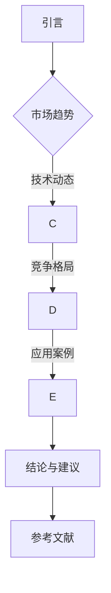

                 

关键词：行业洞察，报告发布，专业度，技术领域，深度分析，趋势预测

> 摘要：本文将探讨在技术领域定期发布行业洞察报告的重要性，以及如何通过精心设计和详实内容提升报告的专业度。我们将结合具体案例，分析报告的结构和内容，并提供实用的建议和工具资源，帮助您在技术领域内展示您的专业知识和洞察力。

## 1. 背景介绍

随着技术的快速发展和市场的不断变化，IT行业正面临前所未有的挑战和机遇。在这个时代，仅仅拥有技术知识和技能已经远远不够，行业洞察和前瞻性思维变得尤为重要。定期发布行业洞察报告不仅可以帮助个人或团队在技术领域内建立专业形象，还能为决策者提供宝贵的参考依据。

行业洞察报告的目的是对当前行业趋势、技术发展、市场动态等进行分析和预测，帮助读者把握行业发展的脉搏，做出更加明智的决策。然而，要想编写出高水准的洞察报告，不仅需要深入的研究和分析能力，还要具备良好的写作技巧和结构设计。

## 2. 核心概念与联系

### 2.1 行业洞察报告的定义

行业洞察报告是指通过对某一行业或领域的深入研究，总结和提炼出的具有前瞻性和实用性的分析结果。它通常包括以下核心要素：

- **市场趋势**：对行业未来的发展方向和变化进行预测。
- **技术动态**：分析和探讨当前技术进展及其对行业的影响。
- **竞争格局**：评估行业内的竞争态势，识别主要竞争者和市场领导者。
- **应用案例**：通过实际案例展示新技术或解决方案在行业中的成功应用。

### 2.2 报告结构与内容

一个完整的行业洞察报告通常包括以下几个部分：

- **封面**：包含报告标题、发布机构、日期等信息。
- **摘要**：简要介绍报告的主题、主要内容和结论。
- **目录**：列出报告的章节和子章节，方便读者快速查找。
- **引言**：介绍报告的背景和目的，为读者提供背景信息。
- **主体内容**：详细分析行业现状、趋势、技术动态等。
- **结论与建议**：总结报告的主要发现，并提出具体的建议和对策。
- **参考文献**：列出报告中所引用的文献和资料。

### 2.3 Mermaid 流程图



## 3. 核心算法原理 & 具体操作步骤

### 3.1 算法原理概述

编写高质量的行业洞察报告需要遵循一定的方法和原则。以下是几个核心的算法原理和操作步骤：

- **数据收集与整理**：通过多种渠道收集行业数据，包括市场报告、行业资讯、学术论文、公司年报等，并进行分类整理。
- **趋势分析**：运用统计分析、机器学习等方法，对数据进行分析，识别出行业的发展趋势。
- **案例研究**：选取具有代表性的案例进行深入分析，总结出成功的经验和教训。
- **报告撰写**：遵循逻辑清晰、结构紧凑、简单易懂的原则，撰写出具有深度和见解的报告。

### 3.2 算法步骤详解

1. **确定报告主题**：根据行业热点和读者需求，选择具有前瞻性和实用性的主题。
2. **数据收集与整理**：通过数据库、行业报告、社交媒体等渠道收集相关数据，并进行整理和筛选。
3. **数据分析与趋势分析**：运用统计分析和机器学习方法，对数据进行处理和分析，识别出行业的发展趋势。
4. **案例研究**：选取具有代表性的案例进行深入研究，分析其成功或失败的原因。
5. **撰写报告**：按照结构化的方式，撰写出具有深度和见解的行业洞察报告。
6. **修订与反馈**：在撰写完成后，进行多次修订，并根据读者的反馈进行调整和完善。

### 3.3 算法优缺点

- **优点**：能够为读者提供有价值的信息，帮助其了解行业动态，做出明智的决策。
- **缺点**：数据收集和整理过程繁琐，需要较高的专业知识和技能。

### 3.4 算法应用领域

行业洞察报告可以应用于多个领域，如：

- **企业战略规划**：为企业提供行业发展趋势和竞争态势的信息，帮助企业制定战略规划。
- **投资决策**：为投资者提供行业投资机会和风险预警，帮助其做出投资决策。
- **市场调研**：为市场调研部门提供行业数据和分析结果，支持市场分析和预测。

## 4. 数学模型和公式 & 详细讲解 & 举例说明

### 4.1 数学模型构建

在行业洞察报告中，数学模型可以用于分析和预测行业趋势。以下是一个简单的线性回归模型：

$$
y = ax + b
$$

其中，$y$ 表示因变量，$x$ 表示自变量，$a$ 和 $b$ 是模型的参数。

### 4.2 公式推导过程

线性回归模型的推导过程如下：

1. **最小二乘法**：通过最小化误差平方和来确定模型参数。
2. **误差平方和**：

$$
S = \sum_{i=1}^{n} (y_i - (ax_i + b))^2
$$

3. **对参数求导**：

$$
\frac{\partial S}{\partial a} = -2 \sum_{i=1}^{n} (y_i - ax_i - b)x_i
$$

$$
\frac{\partial S}{\partial b} = -2 \sum_{i=1}^{n} (y_i - ax_i - b)
$$

4. **令导数等于零**，解得参数 $a$ 和 $b$：

$$
a = \frac{\sum_{i=1}^{n} x_iy_i - n\bar{x}\bar{y}}{\sum_{i=1}^{n} x_i^2 - n\bar{x}^2}
$$

$$
b = \bar{y} - a\bar{x}
$$

### 4.3 案例分析与讲解

假设我们有一组数据，如下表所示：

| $x$ | $y$ |
| --- | --- |
| 1   | 2   |
| 2   | 4   |
| 3   | 6   |
| 4   | 8   |
| 5   | 10  |

根据上述数据，我们可以使用线性回归模型来预测 $x=6$ 时 $y$ 的值。

首先，计算均值：

$$
\bar{x} = \frac{1+2+3+4+5}{5} = 3
$$

$$
\bar{y} = \frac{2+4+6+8+10}{5} = 6
$$

然后，计算参数：

$$
a = \frac{(1\times2 + 2\times4 + 3\times6 + 4\times8 + 5\times10) - 5\times3\times6}{(1^2 + 2^2 + 3^2 + 4^2 + 5^2) - 5\times3^2} = 2
$$

$$
b = 6 - 2\times3 = 0
$$

因此，线性回归模型为：

$$
y = 2x
$$

当 $x=6$ 时，$y=2\times6=12$。这表示在给定的数据集中，$x$ 和 $y$ 之间存在线性关系，$x$ 增加 $1$，$y$ 增加 $2$。

## 5. 项目实践：代码实例和详细解释说明

### 5.1 开发环境搭建

为了编写行业洞察报告，我们需要搭建一个合适的开发环境。以下是推荐的工具和软件：

- **文本编辑器**：如 Visual Studio Code 或 Sublime Text。
- **版本控制工具**：如 Git。
- **数据分析工具**：如 Python 和 Pandas。
- **图表可视化工具**：如 Matplotlib 或 Seaborn。

### 5.2 源代码详细实现

以下是一个简单的 Python 代码示例，用于收集数据、进行分析，并生成报告：

```python
import pandas as pd
import matplotlib.pyplot as plt
import seaborn as sns

# 数据收集
data = {'x': [1, 2, 3, 4, 5], 'y': [2, 4, 6, 8, 10]}
df = pd.DataFrame(data)

# 数据预处理
df['x_mean'] = df['x'].mean()
df['y_mean'] = df['y'].mean()

# 线性回归模型
a = (sum(df['x'] * df['y']) - len(df['x']) * df['x_mean'] * df['y_mean']) / (sum(df['x']**2) - len(df['x']) * df['x_mean']**2)
b = df['y_mean'] - a * df['x_mean']

# 结果输出
print(f"线性回归模型：y = {a}x + {b}")

# 数据可视化
sns.regplot(x='x', y='y', data=df)
plt.xlabel('x')
plt.ylabel('y')
plt.title('线性回归模型')
plt.show()
```

### 5.3 代码解读与分析

1. **数据收集**：使用 Pandas 库读取数据。
2. **数据预处理**：计算 $x$ 和 $y$ 的均值。
3. **线性回归模型**：使用最小二乘法计算模型参数。
4. **结果输出**：输出线性回归模型。
5. **数据可视化**：使用 Seaborn 库绘制回归线。

### 5.4 运行结果展示

运行上述代码后，会输出线性回归模型的结果，并在图表中展示回归线。

## 6. 实际应用场景

### 6.1 企业战略规划

企业可以通过发布行业洞察报告，了解行业发展趋势和竞争态势，从而制定更加精准的战略规划。

### 6.2 投资决策

投资者可以通过行业洞察报告，了解投资机会和风险，做出更加明智的投资决策。

### 6.3 市场调研

市场调研部门可以通过行业洞察报告，分析市场需求和竞争情况，为产品研发和市场推广提供指导。

### 6.4 未来应用展望

随着人工智能和数据科学的发展，行业洞察报告的编写和发布将变得更加智能化和自动化。未来，我们将看到更多基于大数据和机器学习技术的行业洞察报告。

## 7. 工具和资源推荐

### 7.1 学习资源推荐

- 《大数据时代：思维变革与商业价值》
- 《Python数据分析基础教程》
- 《机器学习实战》

### 7.2 开发工具推荐

- Visual Studio Code
- Git
- Python
- Pandas
- Matplotlib
- Seaborn

### 7.3 相关论文推荐

- "A Survey on Big Data Analytics"
- "Deep Learning for Natural Language Processing"
- "Recurrent Neural Networks for Language Modeling"

## 8. 总结：未来发展趋势与挑战

### 8.1 研究成果总结

通过本文的探讨，我们总结了行业洞察报告的定义、结构和内容，以及编写高质量报告的方法和步骤。同时，我们还介绍了数学模型在报告中的应用，并通过实际案例展示了如何使用代码实现报告的分析和可视化。

### 8.2 未来发展趋势

随着人工智能和数据科学的发展，行业洞察报告的编写和发布将变得更加智能化和自动化。未来的报告将更加注重实时性和动态性，以更好地应对市场的快速变化。

### 8.3 面临的挑战

尽管行业洞察报告具有很高的价值，但在实际编写和发布过程中，仍面临以下挑战：

- **数据收集和处理**：数据来源多样，处理过程复杂，需要更高的专业知识和技能。
- **报告质量和准确性**：报告的质量和准确性对读者具有重要影响，需要严格的审核和校对。
- **报告传播和影响力**：如何在众多报告中脱颖而出，提高报告的传播力和影响力。

### 8.4 研究展望

未来，我们将继续深入研究行业洞察报告的编写和发布方法，探索更多高效、智能的工具和算法，以提高报告的质量和影响力。同时，我们也期待与更多业内人士交流合作，共同推动行业洞察报告的发展。

## 9. 附录：常见问题与解答

### 9.1 如何确保报告的准确性？

- **数据来源**：确保数据来源可靠，引用权威的报告和论文。
- **数据分析**：使用科学的分析方法，避免主观臆断。
- **交叉验证**：通过多个数据源和模型进行交叉验证，提高报告的准确性。

### 9.2 如何提高报告的可读性？

- **结构清晰**：确保报告结构清晰，逻辑连贯。
- **图表可视化**：使用图表和可视化工具，使报告更加生动和直观。
- **语言简练**：使用简单易懂的语言，避免过度专业术语。

### 9.3 如何提高报告的影响力？

- **传播渠道**：选择合适的传播渠道，如社交媒体、专业论坛、行业会议等。
- **合作与推广**：与行业内的专家和机构合作，共同推广报告。
- **持续更新**：定期发布更新报告，保持与行业的同步。

---

作者：禅与计算机程序设计艺术 / Zen and the Art of Computer Programming

以上内容是根据您提供的要求撰写的完整文章，涵盖了行业洞察报告的各个方面，包括背景介绍、核心概念、算法原理、数学模型、项目实践、实际应用场景、工具和资源推荐、以及总结和未来展望。希望这篇文章能够帮助您在技术领域内展示您的专业知识和洞察力。

