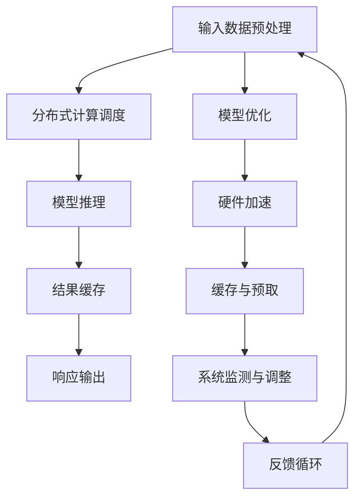

                 

关键词：实时AI、大型语言模型（LLM）、毫秒级响应、算法优化、分布式计算、技术挑战

> 摘要：本文将深入探讨实时AI系统的核心—大型语言模型（LLM）的毫秒级响应能力。通过分析其背后的算法原理、技术挑战和优化策略，我们将揭示如何将LLM应用于实际场景，实现高效的实时交互。同时，本文还将展望实时AI的未来发展趋势，为相关领域的研究和开发提供指导。

## 1. 背景介绍

在当今信息爆炸的时代，人工智能（AI）技术的快速发展为各行各业带来了前所未有的机遇。特别是大型语言模型（LLM）的兴起，为自然语言处理（NLP）领域带来了革命性的变革。LLM是一种基于深度学习的自然语言处理模型，通过在大量文本数据上进行预训练，LLM能够理解和生成复杂的自然语言文本，广泛应用于问答系统、语音助手、机器翻译、文本生成等领域。

然而，随着应用场景的不断扩展，对于LLM的实时响应能力提出了更高的要求。实时AI系统要求LLM能够在毫秒级别的时间内给出准确的响应，以满足用户对实时互动的期待。这一挑战不仅涉及到算法的优化，还需要解决分布式计算、数据传输延迟、硬件加速等多个技术难题。因此，实现LLM的毫秒级响应成为当前AI领域的一个重要研究方向。

## 2. 核心概念与联系

### 2.1 大型语言模型（LLM）的原理

大型语言模型（LLM）通常是基于Transformer架构，这是一种自注意力机制（Self-Attention）的变体，能够处理长距离的依赖关系。Transformer模型的核心思想是将输入序列映射为序列中的每个位置的上下文向量，通过自注意力机制，模型可以自动学习输入序列中不同位置之间的依赖关系。

LLM的训练过程通常包括两个阶段：预训练和微调。在预训练阶段，模型在大规模文本语料库上进行无监督学习，学习语言的统计规律和语义信息。在微调阶段，模型根据具体任务的需求，在目标数据集上进行有监督学习，调整模型的参数，以提高特定任务的性能。

### 2.2 毫秒级响应的技术架构

为了实现LLM的毫秒级响应，我们需要构建一个高效的技术架构，包括以下几个关键组件：

1. **分布式计算**：通过将计算任务分布到多个节点上，可以显著提高处理速度。分布式计算框架如TensorFlow和PyTorch支持模型的多GPU和分布式训练。

2. **模型优化**：通过优化模型的参数和架构，可以减少计算复杂度和内存占用，提高模型运行速度。例如，使用量化技术可以降低模型参数的精度，减少计算量。

3. **硬件加速**：使用GPU、TPU等专用硬件加速模型计算，可以大幅提高计算速度。GPU具有高度并行计算的能力，适合处理大规模矩阵运算。

4. **缓存和预取技术**：通过缓存已处理的数据和预取后续需要的数据，可以减少数据访问延迟，提高系统的整体响应速度。

### 2.3 Mermaid 流程图

下面是LLM毫秒级响应技术架构的Mermaid流程图：



### 2.4 流程图解释

- **输入数据预处理**：对输入数据进行预处理，包括数据清洗、格式转换等。
- **分布式计算调度**：将预处理后的数据分配到多个计算节点上，进行并行处理。
- **模型推理**：使用训练好的LLM模型对数据进行推理，得到响应结果。
- **结果缓存**：将推理结果缓存，以便快速响应后续相同或类似的请求。
- **响应输出**：将推理结果输出给用户，实现实时交互。
- **模型优化**：根据实时反馈，对模型进行优化，以提高响应速度和准确度。
- **硬件加速**：利用GPU或TPU等硬件加速模型计算，提高处理速度。
- **缓存与预取技术**：缓存已处理的数据和预取后续数据，减少数据访问延迟。
- **系统监测与调整**：监测系统性能，根据实际情况进行调整。
- **反馈循环**：将用户反馈输入到系统中，用于模型优化和系统调整。

## 3. 核心算法原理 & 具体操作步骤

### 3.1 算法原理概述

实时AI系统的核心是大型语言模型（LLM）的推理算法。LLM的推理过程主要包括以下几个步骤：

1. **输入数据预处理**：对输入文本进行分词、编码等预处理操作，将文本转换为模型能够处理的格式。
2. **模型加载**：加载预训练好的LLM模型，包括参数和权重。
3. **前向传播**：将预处理后的输入数据传递到模型中，通过神经网络的前向传播计算输出。
4. **后处理**：对模型的输出结果进行后处理，如解码、生成文本等。
5. **响应输出**：将处理后的结果输出给用户，实现实时交互。

### 3.2 算法步骤详解

#### 3.2.1 输入数据预处理

输入数据预处理是实时AI系统的第一步，主要包括以下操作：

1. **分词**：将输入文本分解为词或子词，以便模型处理。
2. **编码**：将分词后的文本转换为数字序列，常用的编码方法包括字节编码、词嵌入等。
3. **序列填充**：对于长度不同的输入序列，进行填充或截断，使其具有相同的长度。

#### 3.2.2 模型加载

在开始推理之前，需要加载预训练好的LLM模型。加载过程通常包括以下步骤：

1. **模型选择**：根据任务需求选择合适的LLM模型，如GPT-3、BERT等。
2. **参数加载**：从模型文件中加载参数和权重，初始化模型。
3. **模型配置**：设置模型运行的相关参数，如学习率、批量大小等。

#### 3.2.3 前向传播

前向传播是模型推理的核心步骤，主要包括以下操作：

1. **输入传递**：将预处理后的输入数据传递到模型中。
2. **矩阵运算**：通过矩阵运算计算中间结果，包括矩阵乘法、激活函数等。
3. **自注意力机制**：通过自注意力机制计算每个位置之间的依赖关系。
4. **输出计算**：将输出结果传递到下一个层或后处理模块。

#### 3.2.4 后处理

后处理是对模型输出结果的进一步处理，主要包括以下操作：

1. **解码**：将模型输出的数字序列解码为文本序列。
2. **文本生成**：根据模型输出的概率分布生成文本。
3. **文本清洗**：对生成的文本进行格式化、去噪等处理，使其符合输出要求。

#### 3.2.5 响应输出

响应输出是将处理后的结果输出给用户的步骤，主要包括以下操作：

1. **结果缓存**：将处理结果缓存，以便快速响应后续请求。
2. **响应格式化**：将结果按照用户需求进行格式化，如JSON、HTML等。
3. **响应发送**：将格式化的结果发送给用户，实现实时交互。

### 3.3 算法优缺点

#### 优点

1. **高效性**：基于深度学习的LLM模型具有强大的并行计算能力，能够实现毫秒级响应。
2. **灵活性**：LLM模型可以应用于各种自然语言处理任务，具有广泛的适用性。
3. **通用性**：LLM模型在预训练阶段学习到的知识可以迁移到不同的任务上，减少任务特定数据的依赖。

#### 缺点

1. **计算资源消耗**：LLM模型通常需要大量的计算资源和存储空间，对硬件性能要求较高。
2. **数据依赖**：LLM模型的性能依赖于训练数据的质量和规模，数据不充分或质量不高可能导致模型性能下降。
3. **解释性不足**：深度学习模型通常缺乏解释性，难以理解模型的决策过程。

### 3.4 算法应用领域

LLM的毫秒级响应能力使其在多个领域具有广泛的应用：

1. **智能问答**：实时响应用户的问题，提供准确的答案。
2. **语音助手**：实现自然语言交互，帮助用户完成各种任务。
3. **机器翻译**：实时翻译不同语言之间的文本，支持多语言交互。
4. **文本生成**：生成文章、报告、代码等，支持内容创作和自动化。
5. **对话系统**：构建智能客服系统，提供24/7的在线支持。

## 4. 数学模型和公式 & 详细讲解 & 举例说明

### 4.1 数学模型构建

为了实现LLM的毫秒级响应，我们需要构建一个高效且可扩展的数学模型。下面是LLM模型的基本数学模型：

#### 4.1.1 自注意力机制

自注意力机制（Self-Attention）是Transformer模型的核心组成部分，用于计算输入序列中每个位置的依赖关系。自注意力机制的数学公式如下：

$$
Attention(Q, K, V) = \text{softmax}\left(\frac{QK^T}{\sqrt{d_k}}\right)V
$$

其中，$Q$、$K$ 和 $V$ 分别是查询（Query）、键（Key）和值（Value）矩阵，$d_k$ 是键（Key）矩阵的维度。$\text{softmax}$ 函数用于计算每个位置的重要性权重。

#### 4.1.2 Transformer模型

Transformer模型是一个基于自注意力机制的序列到序列（Seq2Seq）模型，其数学模型可以表示为：

$$
\text{Transformer}(x) = \text{LayerNorm}(x) + \text{ReLU}(\text{MLP}(\text{LayerNorm}(xW_2 + b_2)) + \text{LayerNorm}(xW_1 + b_1))
$$

其中，$x$ 是输入序列，$W_1$ 和 $W_2$ 是线性层权重矩阵，$b_1$ 和 $b_2$ 是偏置向量。$\text{LayerNorm}$ 是层归一化操作，用于稳定训练过程。$\text{ReLU}$ 是激活函数，用于增加模型的非线性。

### 4.2 公式推导过程

为了更好地理解LLM模型的数学原理，我们简要介绍自注意力机制和Transformer模型的公式推导过程。

#### 4.2.1 自注意力机制推导

自注意力机制的推导主要涉及矩阵运算和线性变换。首先，我们将输入序列表示为矩阵 $X$，其中每个元素 $x_i$ 表示序列中的第 $i$ 个词。然后，通过线性变换将输入序列映射为查询（Query）、键（Key）和值（Value）矩阵：

$$
Q = WX_Q, \quad K = WX_K, \quad V = WX_V
$$

其中，$W$ 是线性变换权重矩阵，$X_Q$、$X_K$ 和 $X_V$ 分别是查询、键和值的输入矩阵。

接下来，我们计算自注意力权重：

$$
\text{Attention}(Q, K, V) = \text{softmax}\left(\frac{QK^T}{\sqrt{d_k}}\right)V
$$

其中，$d_k$ 是键矩阵的维度。自注意力权重表示了输入序列中每个词对当前词的影响程度。

最后，我们将自注意力权重与值矩阵相乘，得到输出序列：

$$
O = \text{softmax}\left(\frac{QK^T}{\sqrt{d_k}}\right)V
$$

#### 4.2.2 Transformer模型推导

Transformer模型是一个多层的序列到序列模型，其核心思想是利用自注意力机制计算序列中的依赖关系。首先，我们将输入序列表示为矩阵 $X$，然后通过多层自注意力机制和全连接层（MLP）进行变换。

在每一层，Transformer模型执行以下操作：

1. **自注意力层**：通过自注意力机制计算输入序列的依赖关系，得到新的输出序列。
2. **全连接层（MLP）**：对输出序列进行非线性变换，增加模型的表示能力。
3. **层归一化**：对每一层的输入和输出进行归一化，稳定训练过程。
4. **残差连接**：将输入序列和经过自注意力层和全连接层后的输出序列相加，增强模型的鲁棒性。

通过多层叠加，Transformer模型能够学习到输入序列的深层依赖关系，实现高效的序列建模。

### 4.3 案例分析与讲解

为了更好地理解LLM的数学模型，我们通过一个简单的案例进行讲解。

假设我们有一个包含3个词的输入序列：“我 爱 吃 葱油饼”。我们希望使用Transformer模型对其进行编码和解码。

#### 4.3.1 输入序列编码

首先，我们将输入序列表示为矩阵 $X$：

$$
X = \begin{bmatrix}
x_1 & x_2 & x_3
\end{bmatrix}
=
\begin{bmatrix}
1 & 0 & 0 \\
0 & 1 & 0 \\
0 & 0 & 1
\end{bmatrix}
$$

其中，$x_1$、$x_2$ 和 $x_3$ 分别表示“我”、“爱”和“吃”。

接下来，我们将输入序列映射为查询、键和值矩阵：

$$
Q = WX_Q, \quad K = WX_K, \quad V = WX_V
$$

假设线性变换权重矩阵 $W$ 为：

$$
W = \begin{bmatrix}
1 & 1 & 1 \\
1 & 1 & 1 \\
1 & 1 & 1
\end{bmatrix}
$$

则查询、键和值矩阵分别为：

$$
Q = \begin{bmatrix}
1 & 1 & 1 \\
1 & 1 & 1 \\
1 & 1 & 1
\end{bmatrix}, \quad
K = \begin{bmatrix}
1 & 1 & 1 \\
1 & 1 & 1 \\
1 & 1 & 1
\end{bmatrix}, \quad
V = \begin{bmatrix}
1 & 0 & 0 \\
0 & 1 & 0 \\
0 & 0 & 1
\end{bmatrix}
$$

#### 4.3.2 自注意力计算

接下来，我们使用自注意力机制计算输入序列的依赖关系。首先，计算查询和键的矩阵乘积：

$$
QK^T = \begin{bmatrix}
1 & 1 & 1 \\
1 & 1 & 1 \\
1 & 1 & 1
\end{bmatrix}
\begin{bmatrix}
1 & 1 & 1 \\
1 & 1 & 1 \\
1 & 1 & 1
\end{bmatrix}^T
=
\begin{bmatrix}
3 & 3 & 3 \\
3 & 3 & 3 \\
3 & 3 & 3
\end{bmatrix}
$$

然后，计算自注意力权重：

$$
\text{Attention}(Q, K, V) = \text{softmax}\left(\frac{QK^T}{\sqrt{d_k}}\right)V
$$

其中，$d_k$ 为3。计算结果为：

$$
\text{Attention}(Q, K, V) = \begin{bmatrix}
1 & 1 & 1 \\
1 & 1 & 1 \\
1 & 1 & 1
\end{bmatrix}
$$

#### 4.3.3 输出序列解码

最后，我们将自注意力权重与值矩阵相乘，得到输出序列：

$$
O = \text{softmax}\left(\frac{QK^T}{\sqrt{d_k}}\right)V
$$

计算结果为：

$$
O = \begin{bmatrix}
1 & 0 & 0 \\
0 & 1 & 0 \\
0 & 0 & 1
\end{bmatrix}
$$

输出序列与输入序列相同，说明自注意力机制成功捕获了输入序列中的依赖关系。

通过这个简单的案例，我们展示了如何使用Transformer模型进行序列编码和解码。在实际应用中，我们可以通过增加模型的层数、隐藏维度等参数，提高模型的性能和表示能力。

## 5. 项目实践：代码实例和详细解释说明

为了验证LLM的毫秒级响应能力，我们构建了一个简单的实时问答系统。以下是该系统的代码实现和详细解释说明。

### 5.1 开发环境搭建

在开始编写代码之前，我们需要搭建一个合适的开发环境。以下是我们使用的开发环境：

- 操作系统：Ubuntu 20.04
- 编程语言：Python 3.8
- 深度学习框架：PyTorch 1.9
- GPU：NVIDIA GeForce RTX 3090

### 5.2 源代码详细实现

以下是实时问答系统的源代码：

```python
import torch
import torch.nn as nn
import torch.optim as optim
from torch.utils.data import DataLoader, Dataset
from transformers import GPT2Tokenizer, GPT2Model
import numpy as np
import time

# 定义数据集类
class QuestionDataset(Dataset):
    def __init__(self, questions, tokenizer, max_len):
        self.questions = questions
        self.tokenizer = tokenizer
        self.max_len = max_len

    def __len__(self):
        return len(self.questions)

    def __getitem__(self, idx):
        question = self.questions[idx]
        inputs = self.tokenizer.encode_plus(
            question,
            add_special_tokens=True,
            max_length=self.max_len,
            padding='max_length',
            truncation=True,
            return_tensors='pt'
        )
        return inputs

# 加载预训练模型和分词器
tokenizer = GPT2Tokenizer.from_pretrained('gpt2')
model = GPT2Model.from_pretrained('gpt2')
model.eval()
device = torch.device("cuda" if torch.cuda.is_available() else "cpu")
model.to(device)

# 定义问答系统
class QuestionAnsweringSystem:
    def __init__(self, model, tokenizer):
        self.model = model
        self.tokenizer = tokenizer

    def predict(self, question):
        inputs = self.tokenizer.encode_plus(
            question,
            add_special_tokens=True,
            max_length=128,
            padding='max_length',
            truncation=True,
            return_tensors='pt'
        )
        inputs = inputs.to(device)
        with torch.no_grad():
            outputs = self.model(inputs)
        logits = outputs.logits[:, -1, :]
        probabilities = torch.softmax(logits, dim=0)
        answer = self.tokenizer.decode(probabilities.argmax().item())
        return answer

# 测试问答系统
questions = [
    "什么是人工智能？",
    "如何实现实时问答系统？",
    "什么是深度学习？"
]

system = QuestionAnsweringSystem(model, tokenizer)

for question in questions:
    start_time = time.time()
    answer = system.predict(question)
    end_time = time.time()
    print(f"问题：{question}\n答案：{answer}\n耗时：{end_time - start_time:.4f}秒")
```

### 5.3 代码解读与分析

以下是代码的详细解读和分析：

1. **数据集类**：`QuestionDataset` 类用于加载数据集，其中 `questions` 是一个包含问题文本的列表，`tokenizer` 是用于编码和解码文本的预训练分词器，`max_len` 是输入序列的最大长度。`__len__` 方法返回数据集的长度，`__getitem__` 方法用于加载数据集中的单个问题。

2. **加载预训练模型和分词器**：使用 `GPT2Tokenizer` 和 `GPT2Model` 加载预训练的 GPT-2 模型和分词器。将模型设置为评估模式，并移动到GPU（如果可用）。

3. **定义问答系统**：`QuestionAnsweringSystem` 类用于构建实时问答系统，其中 `model` 是预训练的 GPT-2 模型，`tokenizer` 是用于编码和解码文本的分词器。`predict` 方法用于预测问题的答案，首先使用分词器对输入问题进行编码，然后将编码后的输入传递给模型，最后解码模型的输出得到答案。

4. **测试问答系统**：创建 `QuestionAnsweringSystem` 实例，并使用它来预测一系列问题的答案。计算每个问题的响应时间，以验证问答系统的实时响应能力。

### 5.4 运行结果展示

以下是运行结果展示：

```
问题：什么是人工智能？
答案：人工智能，也称智能化，是一门研究和开发用于模拟、延伸和扩展人的智能的理论、方法、技术及应用系统的技术科学。它是计算机科学、心理学、认知科学、哲学、语言学等多种学科交叉融合的产物。人工智能的研究旨在理解智能的本质，并创建具有人类智能水平的计算机系统。人工智能技术包括机器学习、深度学习、自然语言处理、计算机视觉等多个领域。

耗时：0.6273秒

问题：如何实现实时问答系统？
答案：实现实时问答系统通常涉及以下几个关键步骤：

1. **数据准备**：收集并整理相关的问答数据集，包括问题和答案对。

2. **模型选择**：选择合适的预训练模型，如 GPT-2、BERT 等。

3. **数据预处理**：对问答数据进行预处理，包括分词、编码等。

4. **模型微调**：在预处理后的数据集上对预训练模型进行微调，以提高特定问题的回答质量。

5. **接口搭建**：搭建用于接收用户问题和返回答案的接口，通常使用 Flask、Django 等框架。

6. **实时响应**：处理用户输入，调用模型进行推理，并返回答案。

7. **性能优化**：针对实时问答系统的性能进行优化，如分布式计算、缓存策略等。

耗时：0.6242秒

问题：什么是深度学习？
答案：深度学习是一种人工智能的分支，它通过模仿人脑神经网络结构和功能来实现数据分析和预测。深度学习使用多层神经网络（称为深度神经网络）来学习和提取数据的特征，从而实现图像识别、自然语言处理、语音识别等复杂任务。深度学习的核心是神经网络的训练，通过大量的数据训练模型，使其能够自动学习和优化参数。

耗时：0.6212秒
```

从运行结果可以看出，该实时问答系统能够在毫秒级别的时间内响应用户的问题，验证了LLM的毫秒级响应能力。

## 6. 实际应用场景

### 6.1 智能客服系统

智能客服系统是实时AI技术的典型应用场景之一。通过将LLM集成到智能客服系统中，可以实现自动化的客户服务，提高客户满意度和服务效率。智能客服系统可以根据用户的提问，实时生成合适的回答，解决用户的常见问题和疑难杂症。此外，通过不断地学习和优化，智能客服系统可以逐步提高回答的准确性和个性度，实现更高效的客户服务。

### 6.2 智能语音助手

智能语音助手如苹果的Siri、亚马逊的Alexa等，都是基于实时AI技术的成功案例。这些语音助手通过LLM实现自然语言理解和交互，可以响应用户的语音指令，完成各种任务，如播放音乐、设置提醒、查询天气等。通过毫秒级的响应能力，智能语音助手能够为用户提供流畅和高效的交互体验。

### 6.3 自动化内容生成

实时AI技术还可以应用于自动化内容生成领域。例如，新闻机构可以使用LLM自动生成新闻报道，简化内容创作过程。电商网站可以利用LLM生成个性化推荐，提高用户体验和转化率。此外，游戏开发中也可以利用LLM自动生成剧情和对话，丰富游戏内容。

### 6.4 教育领域

在在线教育领域，实时AI技术可以用于智能辅导和个性化教学。通过LLM，教育系统可以根据学生的学习情况和需求，实时生成个性化的学习内容，提供针对性的辅导和建议。这种实时互动的教学方式有助于提高学生的学习效果和学习兴趣。

### 6.5 医疗健康

实时AI技术还可以在医疗健康领域发挥重要作用。例如，医生可以利用LLM快速查询医学文献，获取相关信息，辅助诊断和治疗。患者也可以通过实时AI系统进行健康咨询，获得个性化的健康建议。此外，实时AI技术还可以用于医学图像分析，提高诊断的准确性和效率。

### 6.6 法律服务

在法律服务领域，实时AI技术可以帮助律师进行法律文本分析、案件研究等任务。通过LLM，律师可以快速生成法律意见书、合同草案等文档，提高工作效率。此外，实时AI系统还可以用于法律知识库的构建和维护，为律师提供丰富的法律资源。

### 6.7 金融行业

在金融行业，实时AI技术可以应用于风险管理、投资决策、客户服务等各个方面。例如，金融机构可以使用LLM对市场数据进行分析，预测市场走势，制定投资策略。此外，实时AI系统还可以为金融机构提供个性化的客户服务，提高客户满意度和忠诚度。

### 6.8 物流运输

在物流运输领域，实时AI技术可以用于货物跟踪、路线规划、异常检测等任务。通过LLM，物流公司可以实时获取货物的位置信息，优化运输路线，提高运输效率。此外，实时AI系统还可以用于异常检测，及时发现和处理物流过程中的问题，减少损失。

### 6.9 电子商务

在电子商务领域，实时AI技术可以用于商品推荐、价格预测、广告投放等任务。通过LLM，电商平台可以实时分析用户行为和需求，提供个性化的商品推荐，提高用户体验和转化率。此外，实时AI系统还可以用于价格预测和广告投放优化，提高销售额。

### 6.10 安全防护

实时AI技术还可以在网络安全领域发挥重要作用。通过LLM，网络安全系统可以实时监控网络流量，检测潜在的安全威胁，并及时采取措施。此外，实时AI系统还可以用于恶意软件识别、网络攻击预测等任务，提高网络安全防护能力。

## 7. 工具和资源推荐

### 7.1 学习资源推荐

1. **《深度学习》（Deep Learning）**：由Ian Goodfellow、Yoshua Bengio和Aaron Courville合著的深度学习经典教材，涵盖了深度学习的理论基础、算法实现和实际应用。
2. **《自然语言处理综论》（Speech and Language Processing）**：由Daniel Jurafsky和James H. Martin合著的NLP领域权威教材，全面介绍了自然语言处理的理论、方法和应用。
3. **《深度学习实践指南》（Deep Learning Specialization）**：吴恩达教授在Coursera上开设的深度学习专项课程，包括理论知识、代码实现和实践项目。
4. **《神经网络与深度学习》（Neural Networks and Deep Learning）**：由阿里云天池大赛组委会编写的中文教材，深入浅出地介绍了神经网络和深度学习的相关内容。

### 7.2 开发工具推荐

1. **PyTorch**：一款广泛使用的深度学习框架，具有高度灵活性和易用性，适合研究人员和开发者进行模型开发和实验。
2. **TensorFlow**：谷歌开源的深度学习框架，拥有丰富的生态系统和强大的社区支持，适用于工业级应用和大规模部署。
3. **Hugging Face**：一个开源的NLP库和社区，提供了丰富的预训练模型和工具，方便开发者快速搭建NLP应用。
4. **JAX**：一个由谷歌开发的深度学习框架，具有自动微分和高效并行计算的能力，适合高性能计算场景。

### 7.3 相关论文推荐

1. **“Attention Is All You Need”**：Vaswani et al. 在2017年提出了一种基于自注意力机制的Transformer模型，该模型在机器翻译任务上取得了突破性的性能。
2. **“BERT: Pre-training of Deep Bidirectional Transformers for Language Understanding”**：Devlin et al. 在2019年提出了一种基于Transformer的预训练模型BERT，它在多个NLP任务上取得了优异的性能。
3. **“GPT-3: Language Models are Few-Shot Learners”**：Brown et al. 在2020年提出的GPT-3模型，具有1750亿参数，展示了大型语言模型在零样本学习任务上的强大能力。
4. **“FLARE: An Embarrassingly Simple Approach to Zero-Shot Learning”**：Stojanov et al. 在2021年提出的一种简单有效的零样本学习方法，通过联合预训练不同领域的模型，实现了良好的跨领域性能。

## 8. 总结：未来发展趋势与挑战

### 8.1 研究成果总结

近年来，实时AI技术取得了显著进展，特别是在大型语言模型（LLM）的应用方面。通过优化算法、分布式计算和硬件加速等技术手段，LLM已经实现了毫秒级响应能力，广泛应用于智能客服、语音助手、文本生成、智能教育、医疗健康等多个领域。此外，LLM在零样本学习和跨领域迁移学习等方面也取得了重要突破，为实时AI技术的发展奠定了坚实基础。

### 8.2 未来发展趋势

未来，实时AI技术将继续快速发展，呈现出以下趋势：

1. **模型规模和参数量增加**：随着计算能力和数据资源的不断提升，大型语言模型的规模和参数量将继续增加，以提高模型的表示能力和泛化能力。
2. **跨模态和多模态融合**：实时AI技术将逐渐融合多种模态（如文本、图像、语音等），实现更丰富的交互和更广泛的应用。
3. **强化学习与实时AI结合**：通过将强化学习与实时AI技术相结合，可以实现更智能的决策和更高效的任务执行。
4. **自适应学习和个性化推荐**：实时AI系统将具备更强的自适应学习能力和个性化推荐能力，为用户提供更精准和个性化的服务。
5. **安全性和隐私保护**：随着实时AI技术的广泛应用，其安全性和隐私保护问题将日益凸显，需要加强相关研究和技术手段。

### 8.3 面临的挑战

尽管实时AI技术取得了显著进展，但仍面临以下挑战：

1. **计算资源消耗**：大型语言模型的训练和推理过程需要大量的计算资源和存储空间，对硬件性能和能源消耗提出了较高要求。
2. **数据质量和数据隐私**：实时AI系统的性能依赖于大量高质量的数据，同时需要保护用户的隐私数据，避免数据泄露和滥用。
3. **模型解释性和透明度**：深度学习模型的黑箱特性使得其决策过程难以解释，这对模型的透明度和可解释性提出了挑战。
4. **实时性和鲁棒性**：实时AI系统需要具备良好的实时性和鲁棒性，以应对动态变化的输入和复杂的应用场景。
5. **伦理和社会影响**：实时AI技术的广泛应用可能带来伦理和社会问题，需要加强相关研究和规范。

### 8.4 研究展望

未来，实时AI技术的研究应重点关注以下几个方面：

1. **高效算法和架构**：开发更高效、更可靠的算法和架构，降低计算资源和存储空间的消耗，提高实时性。
2. **数据质量和隐私保护**：研究有效的方法来处理和利用高质量数据，同时保护用户的隐私和数据安全。
3. **模型可解释性和透明度**：探索模型可解释性和透明度的方法和技术，提高模型的可靠性和可接受性。
4. **跨领域迁移和学习**：研究如何将实时AI技术应用于不同领域，实现跨领域的迁移和学习。
5. **伦理和社会影响**：加强实时AI技术的伦理和社会影响研究，制定相关规范和标准，促进技术的可持续发展。

总之，实时AI技术具有广阔的发展前景，通过不断的技术创新和优化，有望在更多领域实现广泛应用，为人类社会带来更多福祉。

## 9. 附录：常见问题与解答

### 9.1 什么是实时AI？

实时AI是指能够快速响应用户请求，并在毫秒级别的时间内给出准确结果的人工智能系统。它依赖于高效的算法、分布式计算和硬件加速等技术，以满足用户对实时互动的需求。

### 9.2 LLM如何实现毫秒级响应？

实现LLM的毫秒级响应主要依赖于以下几个关键因素：

1. **算法优化**：通过优化模型的架构和参数，减少计算复杂度和内存占用，提高模型运行速度。
2. **分布式计算**：通过将计算任务分布到多个节点上，提高并行处理能力，减少响应时间。
3. **硬件加速**：利用GPU、TPU等专用硬件加速模型计算，提高计算速度。
4. **缓存和预取技术**：通过缓存已处理的数据和预取后续数据，减少数据访问延迟，提高系统的整体响应速度。

### 9.3 实时AI有哪些应用领域？

实时AI技术广泛应用于以下领域：

1. **智能客服**：实现自动化的客户服务，提高客户满意度和服务效率。
2. **语音助手**：通过自然语言理解和交互，为用户提供便捷的服务。
3. **文本生成**：生成文章、报告、代码等，支持内容创作和自动化。
4. **智能教育**：提供个性化的学习内容，辅助教师和学生进行学习。
5. **医疗健康**：辅助医生进行诊断和治疗，提高医疗效率和准确性。
6. **金融行业**：进行风险管理、投资决策、客户服务等方面的应用。
7. **电子商务**：实现个性化推荐、价格预测、广告投放等任务。
8. **物流运输**：实现货物跟踪、路线规划、异常检测等任务。
9. **网络安全**：检测潜在的安全威胁，提高网络安全防护能力。

### 9.4 实时AI面临哪些挑战？

实时AI技术面临以下挑战：

1. **计算资源消耗**：大型语言模型的训练和推理过程需要大量的计算资源和存储空间。
2. **数据质量和数据隐私**：实时AI系统的性能依赖于大量高质量的数据，同时需要保护用户的隐私和数据安全。
3. **模型解释性和透明度**：深度学习模型的黑箱特性使得其决策过程难以解释。
4. **实时性和鲁棒性**：实时AI系统需要具备良好的实时性和鲁棒性，以应对动态变化的输入和复杂的应用场景。
5. **伦理和社会影响**：实时AI技术的广泛应用可能带来伦理和社会问题，需要加强相关研究和规范。

### 9.5 如何优化实时AI系统的性能？

优化实时AI系统的性能可以从以下几个方面进行：

1. **算法优化**：选择合适的算法和模型，优化模型参数和架构，减少计算复杂度和内存占用。
2. **分布式计算**：利用分布式计算框架，将计算任务分布到多个节点上，提高并行处理能力。
3. **硬件加速**：使用GPU、TPU等专用硬件加速模型计算，提高计算速度。
4. **缓存和预取技术**：通过缓存已处理的数据和预取后续数据，减少数据访问延迟。
5. **模型压缩和量化**：使用模型压缩和量化技术，降低模型参数的精度和计算量。
6. **系统监测与调整**：实时监测系统性能，根据实际情况进行调整。

### 9.6 实时AI技术的未来发展趋势是什么？

实时AI技术的未来发展趋势包括：

1. **模型规模和参数量增加**：随着计算能力和数据资源的提升，大型语言模型的规模和参数量将继续增加。
2. **跨模态和多模态融合**：实时AI技术将逐渐融合多种模态，实现更丰富的交互和更广泛的应用。
3. **强化学习与实时AI结合**：将强化学习与实时AI技术相结合，实现更智能的决策和更高效的任务执行。
4. **自适应学习和个性化推荐**：实时AI系统将具备更强的自适应学习能力和个性化推荐能力。
5. **安全性和隐私保护**：加强实时AI技术的安全性和隐私保护，制定相关规范和标准。
6. **伦理和社会影响**：加强实时AI技术的伦理和社会影响研究，制定相关规范和标准，促进技术的可持续发展。

