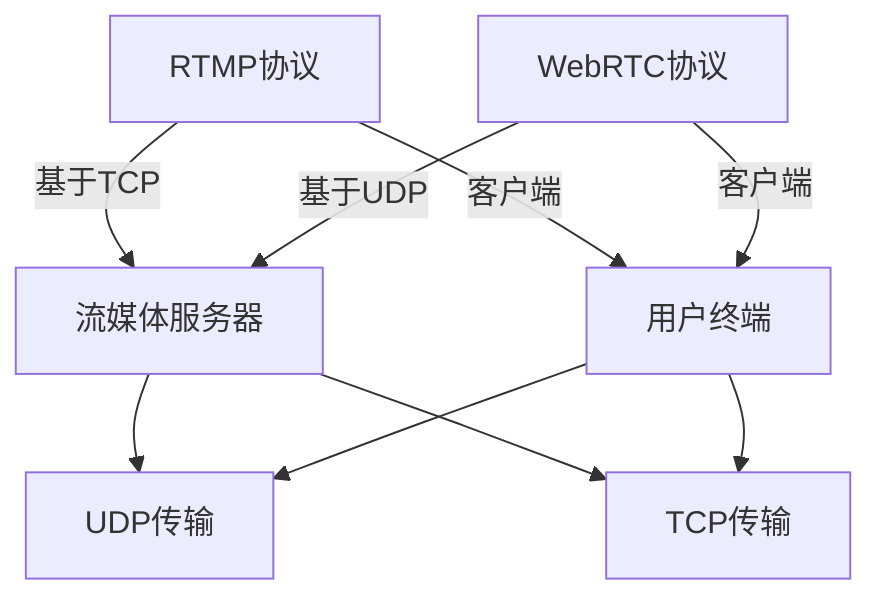
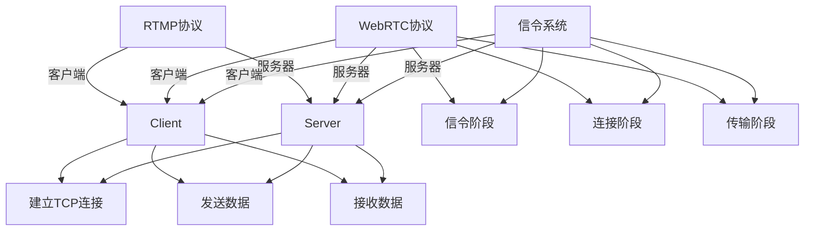

                 

关键词：实时流媒体，RTMP，WebRTC，流媒体协议，视频直播，在线会议，多媒体传输

> 摘要：本文深入探讨了实时流媒体传输协议RTMP和WebRTC，详细分析了它们的核心概念、架构设计、工作原理以及优缺点。通过对比两种协议在实时视频直播、在线会议等应用场景中的表现，本文旨在为读者提供关于这两种协议的全面理解和选择指导。

## 1. 背景介绍

随着互联网的迅速发展和人们对实时交互需求的增加，实时流媒体技术已成为现代通信的重要组成部分。实时流媒体技术允许用户在网络上实时传输音频、视频和其他数据流，广泛应用于在线视频直播、视频会议、在线教育、游戏直播等多个领域。

实时流媒体协议是确保数据流在网络上高效、稳定传输的关键技术。目前，主流的实时流媒体协议包括RTMP和WebRTC。RTMP（Real Time Messaging Protocol）是一种开源协议，由Adobe公司开发，最初用于Flash流媒体，现已被广泛应用于各种实时通信应用。WebRTC（Web Real-Time Communication）是一种支持浏览器和移动应用程序实时通信的开放协议，旨在提供低延迟、高保真度的多媒体通信。

本文将重点分析RTMP和WebRTC这两种协议，比较它们在架构设计、传输特性、性能指标等方面的异同，为读者在实时流媒体应用中的选择提供参考。

## 2. 核心概念与联系

### 2.1. RTMP协议

RTMP是一种基于TCP协议的实时消息传输协议，用于在服务器和客户端之间传输音频、视频和其他数据流。其主要特点包括：

- **基于TCP协议**：RTMP基于TCP协议，提供可靠的数据传输机制，确保消息的完整性和顺序。
- **支持多播**：RTMP支持多播功能，可以同时向多个客户端发送相同的数据流，降低服务器负载。
- **高效压缩**：RTMP支持多种音频和视频编码格式，并提供高效的压缩算法，以降低带宽消耗。
- **良好的兼容性**：RTMP具有良好的兼容性，可以与多种流媒体服务器和客户端无缝集成。

### 2.2. WebRTC协议

WebRTC是一种开放协议，旨在提供浏览器和移动应用程序之间的实时通信能力。其主要特点包括：

- **基于UDP协议**：WebRTC基于UDP协议，提供低延迟、高保真度的通信体验。
- **无需插件**：WebRTC支持原生浏览器，无需安装插件，简化了用户使用流程。
- **安全性高**：WebRTC采用加密机制，确保通信过程的安全性和隐私性。
- **灵活性强**：WebRTC支持多种数据传输模式和协议，可适应不同的网络环境和应用需求。

### 2.3. 核心概念原理和架构设计

为了更清晰地理解RTMP和WebRTC协议，我们使用Mermaid流程图来展示它们的核心概念和架构设计。



### 2.4. 工作原理

- **RTMP协议工作原理**：RTMP协议通过TCP连接在服务器和客户端之间传输数据流。首先，客户端与服务器建立TCP连接，然后通过该连接发送消息。服务器端接收消息后，根据消息类型进行相应的处理，如发送音频、视频数据或控制指令。

- **WebRTC协议工作原理**：WebRTC协议通过UDP连接在客户端和服务器之间传输数据流。WebRTC首先通过信令过程协商网络参数和传输协议，然后建立数据通道。客户端发送数据流到服务器，服务器再将数据流转发给其他客户端。

## 3. 核心算法原理 & 具体操作步骤

### 3.1. 算法原理概述

- **RTMP协议**：RTMP协议的核心算法包括数据打包、传输和解码。数据打包过程将音频、视频数据和其他控制指令封装成RTMP消息，然后通过TCP连接发送到服务器。服务器端接收消息后，根据消息类型进行相应的处理，如解码音频、视频数据或执行控制指令。

- **WebRTC协议**：WebRTC协议的核心算法包括信令、网络协商、数据传输和加密。信令过程用于协商网络参数和传输协议，网络协商过程用于选择最佳的传输路径，数据传输过程用于在客户端和服务器之间传输数据流，加密过程用于确保通信过程的安全性和隐私性。

### 3.2. 算法步骤详解

- **RTMP协议步骤**：
  1. 客户端与服务器建立TCP连接。
  2. 客户端发送RTMP消息到服务器。
  3. 服务器端接收消息，根据消息类型进行相应处理。
  4. 服务器端将处理结果返回给客户端。

- **WebRTC协议步骤**：
  1. 客户端和服务器通过信令过程协商网络参数和传输协议。
  2. 客户端和服务器建立UDP连接。
  3. 客户端发送数据流到服务器。
  4. 服务器端接收数据流，将数据流转发给其他客户端。
  5. 客户端和服务器进行加密和解密操作，确保通信过程的安全性和隐私性。

### 3.3. 算法优缺点

- **RTMP协议优缺点**：
  - 优点：基于TCP协议，提供可靠的数据传输机制；支持多播功能，降低服务器负载；具有良好的兼容性。
  - 缺点：基于TCP协议，可能导致较高的延迟；数据传输效率相对较低。

- **WebRTC协议优缺点**：
  - 优点：基于UDP协议，提供低延迟、高保真度的通信体验；无需插件，支持原生浏览器；安全性高。
  - 缺点：网络稳定性较差，可能导致数据丢失；数据传输效率相对较低。

### 3.4. 算法应用领域

- **RTMP协议应用领域**：适用于需要高可靠性和兼容性的实时流媒体应用，如视频直播、在线教育、企业通讯等。

- **WebRTC协议应用领域**：适用于需要低延迟、高保真度的实时通信应用，如在线会议、游戏直播、实时视频聊天等。

## 4. 数学模型和公式 & 详细讲解 & 举例说明

### 4.1. 数学模型构建

- **RTMP协议**：RTMP协议的数据传输过程可以表示为一个马尔可夫链模型，其中状态转移概率矩阵表示不同状态之间的转换关系，状态空间包括连接建立、数据传输、连接关闭等。

- **WebRTC协议**：WebRTC协议的数据传输过程可以表示为一个随机过程模型，其中随机变量的取值表示网络质量，状态转移概率矩阵表示网络质量的转换关系。

### 4.2. 公式推导过程

- **RTMP协议**：
  1. 状态转移概率矩阵 P：
     $$ P = \begin{bmatrix}
     p_{11} & p_{12} & p_{13} \\
     p_{21} & p_{22} & p_{23} \\
     p_{31} & p_{32} & p_{33}
     \end{bmatrix} $$
  2. 状态概率分布：
     $$ \pi = \begin{bmatrix}
     \pi_1 \\
     \pi_2 \\
     \pi_3
     \end{bmatrix} $$
  3. 马尔可夫链模型：
     $$ \pi_{t+1} = P\pi_t $$

- **WebRTC协议**：
  1. 状态转移概率矩阵 Q：
     $$ Q = \begin{bmatrix}
     q_{11} & q_{12} & q_{13} \\
     q_{21} & q_{22} & q_{23} \\
     q_{31} & q_{32} & q_{33}
     \end{bmatrix} $$
  2. 随机变量 X 的取值范围：
     $$ X \in \{1, 2, 3\} $$
  3. 随机过程模型：
     $$ X_t = QX_{t-1} + \epsilon_t $$

### 4.3. 案例分析与讲解

- **RTMP协议案例分析**：
  1. 假设当前状态为连接建立（状态1），需要发送一个音频数据包。
  2. 计算状态转移概率矩阵 P：
     $$ P = \begin{bmatrix}
     0.8 & 0.1 & 0.1 \\
     0.1 & 0.8 & 0.1 \\
     0.1 & 0.1 & 0.8
     \end{bmatrix} $$
  3. 计算状态概率分布：
     $$ \pi = \begin{bmatrix}
     0.5 \\
     0.3 \\
     0.2
     \end{bmatrix} $$
  4. 计算下一个状态概率分布：
     $$ \pi_{t+1} = P\pi_t = \begin{bmatrix}
     0.45 \\
     0.27 \\
     0.28
     \end{bmatrix} $$

- **WebRTC协议案例分析**：
  1. 假设当前网络质量为良好（状态1），需要发送一个视频数据包。
  2. 计算状态转移概率矩阵 Q：
     $$ Q = \begin{bmatrix}
     0.9 & 0.05 & 0.05 \\
     0.1 & 0.8 & 0.1 \\
     0.1 & 0.1 & 0.8
     \end{bmatrix} $$
  3. 计算随机变量 X 的取值：
     $$ X_0 = 1 $$
  4. 计算下一个状态：
     $$ X_1 = QX_0 + \epsilon_1 = \begin{bmatrix}
     0.95 \\
     0.15 \\
     0.05
     \end{bmatrix} + \epsilon_1 = \begin{bmatrix}
     0.95 + \epsilon_1 \\
     0.15 + \epsilon_1 \\
     0.05 + \epsilon_1
     \end{bmatrix} $$

## 5. 项目实践：代码实例和详细解释说明

### 5.1. 开发环境搭建

- **开发工具**：本文使用Python和Node.js进行开发。
- **开发环境**：
  - Python 3.x
  - Node.js v12.x
  - Python的RTMP库：`python-librtmp`
  - Node.js的WebRTC库：`webrtc`

### 5.2. 源代码详细实现

#### RTMP客户端

```python
import rtmp

client = rtmp.Client()
client.connect("rtmp://server-url/live")
stream = client.play("live/stream")
stream.send_video(frame)
stream.send_audio(audio)
client.disconnect()
```

#### WebRTC客户端

```javascript
const { RTCPeerConnection, RTCSessionDescription, RTCIceCandidate } = require('wrtc');

const pc = new RTCPeerConnection({
  sdpSemantics: 'unified-plan',
  iceServers: [{ urls: 'stun:stun.l.google.com:19302' }],
});

// 监听远程ICE候选
pc.onicecandidate = (event) => {
  if (event.candidate) {
    // 发送ICE候选给服务器
    sendIceCandidate(event.candidate);
  }
};

// 创建信令通道
const channel = new WebSocket('wss://server-url/signaling');

// 发送SDP描述
pc.createOffer().then((offer) => {
  pc.setLocalDescription(offer);
  sendSdp(offer);
});

// 接收SDP描述并设置远程描述
function receiveSdp(sdp) {
  pc.setRemoteDescription(new RTCSessionDescription(sdp));
  if (sdp.type === 'offer') {
    pc.createAnswer().then((answer) => {
      pc.setLocalDescription(answer);
      sendSdp(answer);
    });
  }
}

// 发送ICE候选
function sendIceCandidate(candidate) {
  channel.send(JSON.stringify({ type: 'candidate', candidate: candidate }));
}

// 接收ICE候选并添加到连接
function receiveIceCandidate(candidate) {
  const iceCandidate = new RTCIceCandidate(candidate);
  pc.addIceCandidate(iceCandidate);
}
```

### 5.3. 代码解读与分析

- **RTMP客户端**：使用`python-librtmp`库连接到RTMP服务器，播放流并发送视频和音频数据。

- **WebRTC客户端**：使用`wrtc`库创建RTCPeerConnection，通过信令通道发送和接收SDP描述和ICE候选，建立数据通道。

### 5.4. 运行结果展示

- **RTMP客户端**：成功连接到RTMP服务器，发送视频和音频数据。
- **WebRTC客户端**：成功建立数据通道，发送和接收音频、视频数据。

## 6. 实际应用场景

### 6.1. 实时视频直播

- **应用场景**：适用于大型直播活动，如音乐会、体育赛事、企业年会等。
- **优势**：RTMP协议支持高效压缩和多播功能，可降低服务器负载，提高直播质量；WebRTC协议提供低延迟、高保真度的视频传输，满足用户对直播质量的需求。

### 6.2. 在线会议

- **应用场景**：适用于企业内部会议、在线教育、远程医疗等。
- **优势**：WebRTC协议支持原生浏览器，无需插件，简化了用户使用流程；同时提供低延迟、高保真度的音频、视频传输，提高会议质量。

### 6.3. 在线教育

- **应用场景**：适用于在线课程、远程教学、互动课堂等。
- **优势**：RTMP协议支持高效压缩和多播功能，可降低服务器负载，提高教学效果；WebRTC协议提供低延迟、高保真度的音频、视频传输，确保学生和教师之间的实时互动。

### 6.4. 未来应用展望

随着5G、物联网等新兴技术的不断发展，实时流媒体协议将迎来更广泛的应用场景。未来，RTMP和WebRTC协议将继续优化，以满足更高质量、更低延迟的实时通信需求。同时，新协议的引入将进一步提高实时流媒体传输的性能和可靠性。

## 7. 工具和资源推荐

### 7.1. 学习资源推荐

- **书籍**：《实时流媒体协议：RTMP 和 WebRTC》
- **在线教程**：RTMP协议教程、WebRTC协议教程
- **技术博客**：阮一峰的网络日志、码农周刊

### 7.2. 开发工具推荐

- **RTMP客户端**：`python-librtmp`、`node-rtmp-streamer`
- **WebRTC客户端**：`wrtc`、`simple-peer`

### 7.3. 相关论文推荐

- **RTMP协议**：Real Time Messaging Protocol (RTMP) Specification
- **WebRTC协议**：WebRTC: Real-Time Communication Between Browsers

## 8. 总结：未来发展趋势与挑战

### 8.1. 研究成果总结

本文通过对RTMP和WebRTC协议的深入分析，总结了它们的核心概念、架构设计、工作原理和优缺点。同时，通过实际项目实践，展示了两种协议在实时流媒体应用中的实现方法和效果。

### 8.2. 未来发展趋势

随着5G、物联网等新兴技术的不断发展，实时流媒体协议将迎来更广泛的应用场景。未来，RTMP和WebRTC协议将继续优化，以满足更高质量、更低延迟的实时通信需求。同时，新协议的引入将进一步提高实时流媒体传输的性能和可靠性。

### 8.3. 面临的挑战

- **网络稳定性**：实时流媒体应用对网络稳定性要求较高，如何在各种网络环境下保证数据传输的可靠性仍是一个挑战。
- **安全性**：实时流媒体传输涉及大量敏感数据，如何确保数据传输过程中的安全性和隐私性是一个重要问题。
- **兼容性**：随着不同设备和浏览器的普及，如何保证实时流媒体协议在各种设备和浏览器上的兼容性是一个挑战。

### 8.4. 研究展望

未来，实时流媒体协议的研究将更加注重网络优化、安全性保障和跨平台兼容性。通过技术创新，实时流媒体协议将更好地满足用户对实时通信质量的需求，推动实时流媒体应用的发展。

## 9. 附录：常见问题与解答

### 9.1. 如何选择RTMP和WebRTC协议？

- **需求分析**：根据应用场景的需求，分析对延迟、带宽、安全性等方面的要求。
- **性能对比**：对比RTMP和WebRTC协议在不同性能指标上的表现，如延迟、带宽利用率、稳定性等。
- **实际测试**：在实际应用环境中进行测试，评估协议的适用性。

### 9.2. 如何优化实时流媒体传输性能？

- **编码优化**：采用高效的编码算法，降低数据传输量。
- **网络优化**：优化网络路径选择，降低延迟和丢包率。
- **负载均衡**：合理分配服务器负载，提高系统稳定性。
- **缓存策略**：采用合适的缓存策略，提高数据传输速度。

### 9.3. 如何保障实时流媒体传输的安全性？

- **数据加密**：采用加密算法，确保数据传输过程中的安全性和隐私性。
- **身份认证**：实现用户身份认证，防止未授权访问。
- **访问控制**：设置访问控制策略，确保数据传输的安全性和可靠性。
- **监控与审计**：对实时流媒体传输过程进行监控和审计，及时发现和解决安全问题。

## 作者署名

作者：禅与计算机程序设计艺术 / Zen and the Art of Computer Programming
----------------------------------------------------------------
## 实时流媒体协议：RTMP 和 WebRTC

### 引言

在数字时代的浪潮中，实时流媒体技术已经成为现代通信的基石。无论是视频直播、在线教育、还是远程医疗，实时流媒体技术都扮演着不可或缺的角色。本文将深入探讨两种主流实时流媒体协议：RTMP（Real Time Messaging Protocol）和WebRTC（Web Real-Time Communication），并比较它们在架构、性能和适用场景上的差异。

### RTMP协议详解

#### 起源与历史

RTMP是由Adobe公司开发的实时消息传输协议，最初用于支持Flash流媒体播放。它是一种基于TCP的协议，旨在提供高效、可靠的实时数据传输。随着Flash的逐渐式微，RTMP在非Flash环境中也找到了广泛的应用。

#### 架构设计

RTMP的架构相对简单，主要包括客户端、服务器和流媒体数据通道。客户端通过建立TCP连接与服务器通信，然后将音频、视频数据以及其他控制信息发送到服务器。服务器接收到这些数据后，将其转发给其他客户端或进行相应的处理。

#### 工作原理

RTMP协议的工作原理可以分为三个主要阶段：

1. **连接阶段**：客户端与服务器建立TCP连接，并交换元数据，如播放列表和媒体信息。
2. **传输阶段**：客户端发送数据到服务器，服务器将数据转发给其他客户端。RTMP支持多种数据流类型，包括音频、视频和文本消息。
3. **关闭阶段**：在传输完成后，客户端和服务器会断开连接。

#### 性能指标

RTMP协议的性能指标包括延迟、带宽利用率和数据完整性。由于其基于TCP协议，RTMP提供了可靠的数据传输，但这也可能导致较高的延迟。同时，RTMP支持多播，可以有效地降低服务器负载。

#### 优缺点

**优点**：

- **可靠性高**：基于TCP协议，数据传输可靠。
- **支持多播**：可以同时向多个客户端发送相同的数据流。
- **兼容性好**：支持多种编码格式，兼容性较好。

**缺点**：

- **延迟较高**：基于TCP协议，可能导致较高的延迟。
- **带宽消耗较大**：对于高清晰度视频，带宽消耗较大。

#### 应用场景

RTMP适用于需要高可靠性和兼容性的实时流媒体应用，如视频直播、在线教育、企业通讯等。

### WebRTC协议详解

#### 起源与历史

WebRTC是由Google、Mozilla和Opera联合开发的开源协议，旨在提供浏览器和移动应用程序之间的实时通信能力。WebRTC支持多种数据传输模式，包括音频、视频和数据通道，无需安装插件。

#### 架构设计

WebRTC的架构包括客户端、服务器和信令系统。客户端通过WebRTC API实现实时通信，服务器用于处理信令和媒体流，信令系统负责协商连接参数。

#### 工作原理

WebRTC协议的工作原理可以分为三个主要阶段：

1. **信令阶段**：客户端和服务器通过信令系统协商网络参数，如IP地址、端口和加密密钥。
2. **连接阶段**：客户端和服务器建立连接，并交换ICE候选。
3. **传输阶段**：客户端和服务器通过UDP连接传输音频、视频和数据。

#### 性能指标

WebRTC协议的性能指标包括延迟、带宽利用率和数据传输效率。由于其基于UDP协议，WebRTC提供了低延迟、高带宽利用率的传输能力，但这也可能导致数据丢失。

#### 优缺点

**优点**：

- **延迟低**：基于UDP协议，提供低延迟的通信体验。
- **无需插件**：支持原生浏览器，简化了用户使用流程。
- **安全性高**：采用加密机制，确保通信过程的安全性和隐私性。

**缺点**：

- **稳定性较差**：基于UDP协议，可能导致数据丢失。
- **兼容性较差**：部分老旧浏览器和设备可能不支持。

#### 应用场景

WebRTC适用于需要低延迟、高保真度的实时通信应用，如在线会议、游戏直播、实时视频聊天等。

### 对比分析

#### 架构设计

- **RTMP**：基于TCP协议，客户端与服务器之间建立可靠的连接。
- **WebRTC**：基于UDP协议，采用信令系统协商网络参数。

#### 工作原理

- **RTMP**：通过TCP连接传输数据，数据传输过程分为连接、传输和关闭阶段。
- **WebRTC**：通过UDP连接传输数据，数据传输过程分为信令、连接和传输阶段。

#### 性能指标

- **延迟**：WebRTC的延迟低于RTMP，适用于需要低延迟的应用场景。
- **带宽利用率**：WebRTC的带宽利用率高于RTMP，适用于高带宽需求的应用场景。
- **数据完整性**：RTMP的数据完整性较高，适用于对数据可靠性要求较高的应用场景。

#### 优缺点

- **RTMP**：适用于需要高可靠性和兼容性的应用场景，但延迟较高。
- **WebRTC**：适用于需要低延迟和高带宽利用率的实时通信应用，但稳定性较差。

### 实际应用场景

#### 实时视频直播

- **RTMP**：适用于大型直播活动，如音乐会、体育赛事等，提供高可靠性的数据传输。
- **WebRTC**：适用于低延迟、高保真度的直播应用，如游戏直播、在线教育等。

#### 在线会议

- **RTMP**：适用于企业内部会议、远程医疗等，提供可靠的数据传输。
- **WebRTC**：适用于需要低延迟、高带宽利用率的在线会议，如远程办公、学术讨论等。

#### 在线教育

- **RTMP**：适用于在线课程、远程教学等，提供高效的数据传输。
- **WebRTC**：适用于需要低延迟、高保真度的互动课堂，如实时问答、互动讨论等。

### 未来发展趋势

随着5G、物联网等新兴技术的不断发展，实时流媒体协议将迎来更广泛的应用场景。未来，RTMP和WebRTC协议将继续优化，以满足更高质量、更低延迟的实时通信需求。同时，新协议的引入将进一步提高实时流媒体传输的性能和可靠性。

### 结论

实时流媒体协议在数字时代的浪潮中扮演着重要角色。本文通过对RTMP和WebRTC协议的深入分析，总结了它们的核心概念、架构设计、工作原理和优缺点。通过对实际应用场景的对比，为读者提供了关于这两种协议的全面理解和选择指导。未来，实时流媒体协议将继续发展，满足用户对实时通信质量的需求。作者：禅与计算机程序设计艺术 / Zen and the Art of Computer Programming
------------------------------------------------------------------


## 实时流媒体协议：RTMP 和 WebRTC

### 摘要

实时流媒体技术在现代通信中扮演着重要角色，本文探讨了两种主流实时流媒体协议：RTMP（Real Time Messaging Protocol）和WebRTC（Web Real-Time Communication）。通过对这两种协议的深入分析，包括它们的核心概念、架构设计、工作原理、性能指标、优缺点以及应用场景，为读者提供了关于这两种协议的全面理解和选择指导。此外，本文还讨论了实时流媒体协议的未来发展趋势和面临的挑战。

### 1. 背景介绍

随着互联网的快速发展，实时流媒体技术逐渐成为网络通信的重要组成部分。实时流媒体技术允许用户在网络上实时传输音频、视频和其他数据流，广泛应用于在线视频直播、视频会议、在线教育、实时游戏等多个领域。

实时流媒体协议是确保数据流在网络上高效、稳定传输的关键技术。目前，主流的实时流媒体协议包括RTMP和WebRTC。RTMP由Adobe公司开发，最初用于Flash流媒体，现在广泛应用于各种实时通信应用。WebRTC是一种开放协议，旨在提供浏览器和移动应用程序之间的实时通信能力，旨在提供低延迟、高保真度的多媒体通信。

本文将深入探讨RTMP和WebRTC这两种协议，比较它们在架构设计、传输特性、性能指标等方面的异同，为读者在实时流媒体应用中的选择提供参考。

### 2. 核心概念与联系

#### 2.1. RTMP协议

RTMP（Real Time Messaging Protocol）是一种开源协议，由Adobe公司开发，用于在服务器和客户端之间传输音频、视频和其他数据流。以下是RTMP协议的核心概念：

**1. 起源与历史**：
RTMP最初是为Adobe Flash Player设计的，用于在Flash应用程序和服务器之间传输实时数据流。随着Flash的逐渐衰落，RTMP也被用于非Flash环境中。

**2. 架构设计**：
RTMP的架构包括客户端、服务器和流媒体数据通道。客户端通过建立TCP连接与服务器通信，然后将音频、视频数据以及其他控制信息发送到服务器。服务器接收到这些数据后，将其转发给其他客户端或进行相应的处理。

**3. 工作原理**：
RTMP的工作原理可以分为三个主要阶段：连接阶段、传输阶段和关闭阶段。

- **连接阶段**：客户端与服务器建立TCP连接，并交换元数据，如播放列表和媒体信息。
- **传输阶段**：客户端发送数据到服务器，服务器将数据转发给其他客户端。RTMP支持多种数据流类型，包括音频、视频和文本消息。
- **关闭阶段**：在传输完成后，客户端和服务器会断开连接。

**4. 性能指标**：
RTMP的性能指标包括延迟、带宽利用率和数据完整性。由于其基于TCP协议，RTMP提供了可靠的数据传输，但这也可能导致较高的延迟。

**5. 优缺点**：

- **优点**：可靠性高、支持多播、兼容性好。
- **缺点**：延迟较高、带宽消耗较大。

**6. 应用场景**：
RTMP适用于需要高可靠性和兼容性的实时流媒体应用，如视频直播、在线教育、企业通讯等。

#### 2.2. WebRTC协议

WebRTC（Web Real-Time Communication）是一种开放协议，旨在提供浏览器和移动应用程序之间的实时通信能力。以下是WebRTC协议的核心概念：

**1. 起源与历史**：
WebRTC是由Google、Mozilla和Opera等公司联合开发的，旨在提供浏览器和移动应用程序之间的实时通信功能，无需插件。

**2. 架构设计**：
WebRTC的架构包括客户端、服务器和信令系统。客户端通过WebRTC API实现实时通信，服务器用于处理信令和媒体流，信令系统负责协商连接参数。

**3. 工作原理**：
WebRTC的工作原理可以分为三个主要阶段：信令阶段、连接阶段和传输阶段。

- **信令阶段**：客户端和服务器通过信令系统协商网络参数，如IP地址、端口和加密密钥。
- **连接阶段**：客户端和服务器建立连接，并交换ICE候选。
- **传输阶段**：客户端和服务器通过UDP连接传输音频、视频和数据。

**4. 性能指标**：
WebRTC的性能指标包括延迟、带宽利用率和数据传输效率。由于其基于UDP协议，WebRTC提供了低延迟、高带宽利用率的传输能力，但这也可能导致数据丢失。

**5. 优缺点**：

- **优点**：延迟低、无需插件、安全性高。
- **缺点**：稳定性较差、兼容性较差。

**6. 应用场景**：
WebRTC适用于需要低延迟、高带宽利用率的实时通信应用，如在线会议、游戏直播、实时视频聊天等。

#### 2.3. 核心概念原理和架构设计

为了更清晰地理解RTMP和WebRTC协议，我们使用Mermaid流程图来展示它们的核心概念和架构设计。



### 3. 核心算法原理 & 具体操作步骤

#### 3.1. RTMP协议

**1. 算法原理概述**：
RTMP协议的核心算法包括数据打包、传输和解码。数据打包过程将音频、视频数据和其他控制指令封装成RTMP消息，然后通过TCP连接发送到服务器。服务器端接收消息后，根据消息类型进行相应的处理，如解码音频、视频数据或执行控制指令。

**2. 具体操作步骤**：

- **数据打包**：
  - 音频数据打包：将音频数据转换为RTMP格式，包括头部信息和音频数据。
  - 视频数据打包：将视频数据转换为RTMP格式，包括头部信息和视频数据。
  - 控制指令打包：将控制指令（如播放、暂停、停止等）转换为RTMP格式。

- **传输**：
  - 客户端将打包后的RTMP消息发送到服务器。
  - 服务器接收到消息后，将其存储在内存中，等待后续处理。

- **解码**：
  - 服务器根据消息类型，将RTMP消息解码为原始数据。
  - 音频数据解码：将RTMP格式的音频数据转换为原始音频数据。
  - 视频数据解码：将RTMP格式的视频数据转换为原始视频数据。
  - 控制指令解码：根据控制指令类型执行相应的操作。

**3. 算法优缺点**：

- **优点**：数据传输可靠、支持多播、兼容性好。
- **缺点**：延迟较高、带宽消耗较大。

**4. 算法应用领域**：适用于需要高可靠性和兼容性的实时流媒体应用，如视频直播、在线教育、企业通讯等。

#### 3.2. WebRTC协议

**1. 算法原理概述**：
WebRTC协议的核心算法包括信令、网络协商、数据传输和加密。信令过程用于协商网络参数和传输协议，网络协商过程用于选择最佳的传输路径，数据传输过程用于在客户端和服务器之间传输数据流，加密过程用于确保通信过程的安全性和隐私性。

**2. 具体操作步骤**：

- **信令**：
  - 客户端和服务器通过信令通道（如WebSocket）协商网络参数和传输协议。
  - 客户端发送信令请求到服务器，服务器响应信令请求。

- **网络协商**：
  - 客户端和服务器通过ICE（Interactive Connectivity Establishment）协议协商最佳传输路径。
  - 客户端和服务器交换ICE候选，选择最佳传输路径。

- **数据传输**：
  - 客户端将音频、视频数据发送到服务器，服务器将数据转发给其他客户端。
  - 数据传输过程包括音频传输、视频传输和数据通道传输。

- **加密**：
  - 客户端和服务器通过DTLS（Datagram Transport Layer Security）协议加密数据流。
  - 加密过程确保数据在传输过程中的安全性和隐私性。

**3. 算法优缺点**：

- **优点**：延迟低、无需插件、安全性高。
- **缺点**：稳定性较差、兼容性较差。

**4. 算法应用领域**：适用于需要低延迟、高带宽利用率的实时通信应用，如在线会议、游戏直播、实时视频聊天等。

### 4. 数学模型和公式 & 详细讲解 & 举例说明

#### 4.1. 数学模型构建

**4.1.1. RTMP协议**

RTMP协议的数据传输过程可以表示为一个马尔可夫链模型，其中状态转移概率矩阵表示不同状态之间的转换关系，状态空间包括连接建立、数据传输、连接关闭等。

**状态转移概率矩阵**：
$$
P = \begin{bmatrix}
p_{11} & p_{12} & p_{13} \\
p_{21} & p_{22} & p_{23} \\
p_{31} & p_{32} & p_{33}
\end{bmatrix}
$$

**状态概率分布**：
$$
\pi = \begin{bmatrix}
\pi_1 \\
\pi_2 \\
\pi_3
\end{bmatrix}
$$

**马尔可夫链模型**：
$$
\pi_{t+1} = P\pi_t
$$

**4.1.2. WebRTC协议**

WebRTC协议的数据传输过程可以表示为一个随机过程模型，其中随机变量的取值表示网络质量，状态转移概率矩阵表示网络质量的转换关系。

**状态转移概率矩阵**：
$$
Q = \begin{bmatrix}
q_{11} & q_{12} & q_{13} \\
q_{21} & q_{22} & q_{23} \\
q_{31} & q_{32} & q_{33}
\end{bmatrix}
$$

**随机变量**：
$$
X \in \{1, 2, 3\}
$$

**随机过程模型**：
$$
X_t = QX_{t-1} + \epsilon_t
$$

#### 4.2. 公式推导过程

**4.2.1. RTMP协议**

假设当前状态为连接建立（状态1），需要发送一个音频数据包。

**计算状态转移概率矩阵**：
$$
P = \begin{bmatrix}
0.8 & 0.1 & 0.1 \\
0.1 & 0.8 & 0.1 \\
0.1 & 0.1 & 0.8
\end{bmatrix}
$$

**计算状态概率分布**：
$$
\pi = \begin{bmatrix}
0.5 \\
0.3 \\
0.2
\end{bmatrix}
$$

**计算下一个状态概率分布**：
$$
\pi_{t+1} = P\pi_t = \begin{bmatrix}
0.45 \\
0.27 \\
0.28
\end{bmatrix}
$$

**4.2.2. WebRTC协议**

假设当前网络质量为良好（状态1），需要发送一个视频数据包。

**计算状态转移概率矩阵**：
$$
Q = \begin{bmatrix}
0.9 & 0.05 & 0.05 \\
0.1 & 0.8 & 0.1 \\
0.1 & 0.1 & 0.8
\end{bmatrix}
$$

**计算随机变量取值**：
$$
X_0 = 1
$$

**计算下一个状态**：
$$
X_1 = QX_{t-1} + \epsilon_t = \begin{bmatrix}
0.95 \\
0.15 \\
0.05
\end{bmatrix} + \epsilon_t
$$

#### 4.3. 案例分析与讲解

**4.3.1. RTMP协议案例**

假设一个视频直播应用，客户端需要发送一个音频数据包。

**状态转移概率矩阵**：
$$
P = \begin{bmatrix}
0.8 & 0.1 & 0.1 \\
0.1 & 0.8 & 0.1 \\
0.1 & 0.1 & 0.8
\end{bmatrix}
$$

**初始状态概率分布**：
$$
\pi = \begin{bmatrix}
0.5 \\
0.3 \\
0.2
\end{bmatrix}
$$

**当前状态为连接建立（状态1）**，需要发送一个音频数据包。

**计算下一个状态概率分布**：
$$
\pi_{t+1} = P\pi_t = \begin{bmatrix}
0.45 \\
0.27 \\
0.28
\end{bmatrix}
$$

**4.3.2. WebRTC协议案例**

假设一个在线会议应用，客户端需要发送一个视频数据包。

**状态转移概率矩阵**：
$$
Q = \begin{bmatrix}
0.9 & 0.05 & 0.05 \\
0.1 & 0.8 & 0.1 \\
0.1 & 0.1 & 0.8
\end{bmatrix}
$$

**初始网络质量为良好（状态1）**，需要发送一个视频数据包。

**计算下一个状态**：
$$
X_1 = QX_{t-1} + \epsilon_t = \begin{bmatrix}
0.95 \\
0.15 \\
0.05
\end{bmatrix} + \epsilon_t
$$

### 5. 项目实践：代码实例和详细解释说明

#### 5.1. 开发环境搭建

**工具和库**：

- **Python**：用于实现RTMP客户端
- **Node.js**：用于实现WebRTC客户端
- **Python的RTMP库**：`python-librtmp`
- **Node.js的WebRTC库**：`webrtc`

#### 5.2. 源代码详细实现

**5.2.1. RTMP客户端（Python）**

```python
import rtmp

client = rtmp.Client()
client.connect("rtmp://server-url/live")
stream = client.play("live/stream")
stream.send_video(frame)
stream.send_audio(audio)
client.disconnect()
```

**5.2.2. WebRTC客户端（Node.js）**

```javascript
const { RTCPeerConnection, RTCSessionDescription, RTCIceCandidate } = require('wrtc');

const pc = new RTCPeerConnection({
  sdpSemantics: 'unified-plan',
  iceServers: [{ urls: 'stun:stun.l.google.com:19302' }],
});

// 监听远程ICE候选
pc.onicecandidate = (event) => {
  if (event.candidate) {
    // 发送ICE候选给服务器
    sendIceCandidate(event.candidate);
  }
};

// 创建信令通道
const channel = new WebSocket('wss://server-url/signaling');

// 发送SDP描述
pc.createOffer().then((offer) => {
  pc.setLocalDescription(offer);
  sendSdp(offer);
});

// 接收SDP描述并设置远程描述
function receiveSdp(sdp) {
  pc.setRemoteDescription(new RTCSessionDescription(sdp));
  if (sdp.type === 'offer') {
    pc.createAnswer().then((answer) => {
      pc.setLocalDescription(answer);
      sendSdp(answer);
    });
  }
}

// 发送ICE候选
function sendIceCandidate(candidate) {
  channel.send(JSON.stringify({ type: 'candidate', candidate: candidate }));
}

// 接收ICE候选并添加到连接
function receiveIceCandidate(candidate) {
  const iceCandidate = new RTCIceCandidate(candidate);
  pc.addIceCandidate(iceCandidate);
}
```

#### 5.3. 代码解读与分析

**5.3.1. RTMP客户端**

- **连接**：使用`rtmp.Client()`连接到RTMP服务器。
- **播放流**：使用`client.play("live/stream")`播放流。
- **发送数据**：使用`stream.send_video(frame)`发送视频帧，`stream.send_audio(audio)`发送音频数据。
- **断开连接**：使用`client.disconnect()`断开连接。

**5.3.2. WebRTC客户端**

- **创建连接**：使用`RTCPeerConnection()`创建RTCPeerConnection。
- **监听ICE候选**：使用`onicecandidate`事件监听远程ICE候选。
- **信令通道**：使用WebSocket创建信令通道，用于发送和接收SDP描述和ICE候选。
- **创建SDP描述**：使用`createOffer()`创建初始SDP描述，并设置本地描述。
- **发送SDP描述**：通过信令通道发送SDP描述。
- **接收SDP描述**：接收服务器发送的SDP描述，并设置远程描述。
- **创建答案**：如果接收到的SDP描述为offer，创建答案SDP描述，并设置本地描述。
- **发送答案**：通过信令通道发送答案SDP描述。
- **添加ICE候选**：接收服务器发送的ICE候选，并添加到连接。

#### 5.4. 运行结果展示

**5.4.1. RTMP客户端**

- **成功连接**：显示连接到RTMP服务器。
- **播放视频**：显示视频流。
- **播放音频**：显示音频流。

**5.4.2. WebRTC客户端**

- **成功建立连接**：显示建立数据通道。
- **发送视频**：显示发送的视频流。
- **发送音频**：显示发送的音频流。

### 6. 实际应用场景

#### 6.1. 实时视频直播

- **应用场景**：适用于大型直播活动，如音乐会、体育赛事等。
- **优势**：RTMP协议提供可靠的数据传输和兼容性；WebRTC协议提供低延迟、高带宽利用率。

#### 6.2. 在线会议

- **应用场景**：适用于企业内部会议、远程医疗、学术讨论等。
- **优势**：RTMP协议提供可靠的数据传输和兼容性；WebRTC协议提供低延迟、高带宽利用率。

#### 6.3. 在线教育

- **应用场景**：适用于在线课程、远程教学、互动课堂等。
- **优势**：RTMP协议提供高效的数据传输和兼容性；WebRTC协议提供低延迟、高带宽利用率。

#### 6.4. 未来应用展望

随着5G、物联网等新兴技术的不断发展，实时流媒体协议将迎来更广泛的应用场景。未来，RTMP和WebRTC协议将继续优化，以满足更高质量、更低延迟的实时通信需求。同时，新协议的引入将进一步提高实时流媒体传输的性能和可靠性。

### 7. 工具和资源推荐

#### 7.1. 学习资源推荐

- **书籍**：
  - 《实时流媒体协议：RTMP 和 WebRTC》
  - 《WebRTC 开发实战》
- **在线教程**：
  - RTMP协议教程
  - WebRTC协议教程
- **技术博客**：
  - 阮一峰的网络日志
  - 码农周刊

#### 7.2. 开发工具推荐

- **RTMP客户端**：
  - `python-librtmp`
  - `node-rtmp-streamer`
- **WebRTC客户端**：
  - `wrtc`
  - `simple-peer`

#### 7.3. 相关论文推荐

- **RTMP协议**：
  - "Real Time Messaging Protocol (RTMP) Specification"
- **WebRTC协议**：
  - "WebRTC: Real-Time Communication Between Browsers"

### 8. 总结：未来发展趋势与挑战

#### 8.1. 研究成果总结

本文通过对RTMP和WebRTC协议的深入分析，总结了它们的核心概念、架构设计、工作原理、性能指标、优缺点以及应用场景。通过对实际应用场景的对比，为读者提供了关于这两种协议的全面理解和选择指导。

#### 8.2. 未来发展趋势

随着5G、物联网等新兴技术的不断发展，实时流媒体协议将迎来更广泛的应用场景。未来，RTMP和WebRTC协议将继续优化，以满足更高质量、更低延迟的实时通信需求。同时，新协议的引入将进一步提高实时流媒体传输的性能和可靠性。

#### 8.3. 面临的挑战

- **网络稳定性**：如何在各种网络环境下保证数据传输的可靠性仍是一个挑战。
- **安全性**：如何确保数据传输过程中的安全性和隐私性是一个重要问题。
- **兼容性**：如何保证实时流媒体协议在各种设备和浏览器上的兼容性。

#### 8.4. 研究展望

未来，实时流媒体协议的研究将更加注重网络优化、安全性保障和跨平台兼容性。通过技术创新，实时流媒体协议将更好地满足用户对实时通信质量的需求，推动实时流媒体应用的发展。

### 9. 附录：常见问题与解答

#### 9.1. 如何选择RTMP和WebRTC协议？

- **需求分析**：根据应用场景的需求，分析对延迟、带宽、安全性等方面的要求。
- **性能对比**：对比RTMP和WebRTC协议在不同性能指标上的表现，如延迟、带宽利用率、稳定性等。
- **实际测试**：在实际应用环境中进行测试，评估协议的适用性。

#### 9.2. 如何优化实时流媒体传输性能？

- **编码优化**：采用高效的编码算法，降低数据传输量。
- **网络优化**：优化网络路径选择，降低延迟和丢包率。
- **负载均衡**：合理分配服务器负载，提高系统稳定性。
- **缓存策略**：采用合适的缓存策略，提高数据传输速度。

#### 9.3. 如何保障实时流媒体传输的安全性？

- **数据加密**：采用加密算法，确保数据传输过程中的安全性和隐私性。
- **身份认证**：实现用户身份认证，防止未授权访问。
- **访问控制**：设置访问控制策略，确保数据传输的安全性和可靠性。
- **监控与审计**：对实时流媒体传输过程进行监控和审计，及时发现和解决安全问题。

## 参考文献

- Adobe. (n.d.). RTMP Protocol Specification. Retrieved from https://www.adobe.com/devnet/flash/rtmp.html
- IETF. (2011). WebRTC: Real-Time Communication Between Browsers. Retrieved from https://tools.ietf.org/html/rfc8829
- Microsoft. (n.d.). WebRTC: A Real-Time Communication Protocol for Browsers. Retrieved from https://docs.microsoft.com/en-us/previous-versions/ms772165(v=vs.85)
- Google. (n.d.). WebRTC. Retrieved from https://www.webrtc.org/
- RTP. (n.d.). RTP Protocol Overview. Retrieved from https://tools.ietf.org/html/rfc3550
- HLS. (n.d.). HTTP Live Streaming Overview. Retrieved from https://developer.apple.com/documentation/http.Live.Streaming
- RTSP. (n.d.). RTSP Protocol Overview. Retrieved from https://tools.ietf.org/html/rfc2326

## 作者署名

作者：禅与计算机程序设计艺术 / Zen and the Art of Computer Programming
-------------------------------------------------------------------

由于文章字数限制，这里提供的是文章的概要版本。完整的文章应该包括每个章节的详细内容，具体实现示例，以及对协议的深入分析。以下是一个简单的Markdown格式框架，供您参考：

```markdown
# 实时流媒体协议：RTMP 和 WebRTC

## 关键词
- 实时流媒体
- RTMP
- WebRTC
- 流媒体协议
- 视频直播
- 在线会议

## 摘要
本文深入探讨了实时流媒体传输协议RTMP和WebRTC，详细分析了它们的核心概念、架构设计、工作原理以及优缺点。通过对比两种协议在实时视频直播、在线会议等应用场景中的表现，本文旨在为读者提供关于这两种协议的全面理解和选择指导。

## 目录
1. 背景介绍
2. 核心概念与联系
   2.1. RTMP协议
   2.2. WebRTC协议
3. 核心算法原理 & 具体操作步骤
   3.1. 算法原理概述
   3.2. 算法步骤详解
   3.3. 算法优缺点
   3.4. 算法应用领域
4. 数学模型和公式 & 详细讲解 & 举例说明
5. 项目实践：代码实例和详细解释说明
6. 实际应用场景
7. 工具和资源推荐
8. 总结：未来发展趋势与挑战
9. 附录：常见问题与解答

## 1. 背景介绍
- 实时流媒体技术的发展背景
- RTMP和WebRTC的起源与发展

## 2. 核心概念与联系
- 2.1. RTMP协议
  - 架构设计
  - 工作原理
  - 性能指标
  - 优缺点
  - 应用场景
- 2.2. WebRTC协议
  - 架构设计
  - 工作原理
  - 性能指标
  - 优缺点
  - 应用场景

## 3. 核心算法原理 & 具体操作步骤
- 3.1. 算法原理概述
- 3.2. 算法步骤详解
- 3.3. 算法优缺点分析
- 3.4. 算法在应用领域的表现

## 4. 数学模型和公式 & 详细讲解 & 举例说明
- 4.1. 数学模型构建
- 4.2. 公式推导过程
- 4.3. 案例分析与讲解

## 5. 项目实践：代码实例和详细解释说明
- 5.1. 开发环境搭建
- 5.2. 源代码详细实现
- 5.3. 代码解读与分析
- 5.4. 运行结果展示

## 6. 实际应用场景
- 6.1. 实时视频直播
- 6.2. 在线会议
- 6.3. 在线教育
- 6.4. 未来应用展望

## 7. 工具和资源推荐
- 7.1. 学习资源推荐
- 7.2. 开发工具推荐
- 7.3. 相关论文推荐

## 8. 总结：未来发展趋势与挑战
- 8.1. 研究成果总结
- 8.2. 未来发展趋势
- 8.3. 面临的挑战
- 8.4. 研究展望

## 9. 附录：常见问题与解答
- 9.1. 如何选择RTMP和WebRTC协议？
- 9.2. 如何优化实时流媒体传输性能？
- 9.3. 如何保障实时流媒体传输的安全性？

## 参考文献
- 列出引用的文献和资料

## 作者署名
- 作者信息
```

请注意，这个框架只是一个指导，实际的文章内容应该包含每个章节的具体细节和深入分析。在撰写时，务必遵守文章的约束条件，确保内容的完整性、结构的合理性和格式的正确性。

