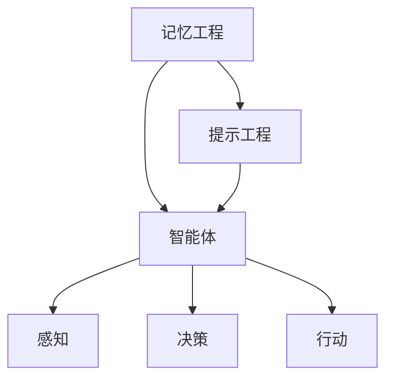

                 

关键词：记忆工程、提示工程、智能体、神经网络、机器学习、深度学习、人工智能

摘要：本文将深入探讨记忆工程、提示工程和智能体等核心概念，并通过实例分析其在实践中的应用。我们将理解记忆工程的重要性，介绍提示工程的方法和技巧，并分析智能体的构建和运作。此外，本文还将讨论这些核心概念在人工智能领域的未来发展趋势和面临的挑战。

## 1. 背景介绍

随着人工智能技术的快速发展，机器学习、深度学习和神经网络等算法在各个领域中取得了显著的成果。然而，为了实现更加智能和高效的人工智能系统，我们需要深入研究核心概念，如记忆工程、提示工程和智能体等。这些概念在人工智能系统中起着至关重要的作用，有助于提高系统的性能和智能水平。

记忆工程是指通过设计和实现高效的记忆机制，使人工智能系统能够更好地存储、检索和处理信息。提示工程则是通过设计有效的提示策略，引导人工智能系统进行学习和决策。智能体是指具备自主决策和行动能力的实体，能够在复杂环境中实现目标。这些核心概念共同构建了人工智能系统的基石，对于推动人工智能技术的发展具有重要意义。

## 2. 核心概念与联系

### 2.1 记忆工程

记忆工程是人工智能系统中的核心组件之一，它涉及数据的存储、检索和处理。记忆机制的设计和实现对于系统的性能和效率至关重要。记忆工程的核心概念包括：

1. **存储容量**：记忆系统的存储容量决定了系统能够存储的信息量。高容量的记忆系统可以处理更多的数据，从而提高系统的学习能力和智能水平。

2. **访问速度**：记忆系统的访问速度决定了系统能够多快地检索和处理信息。快速的访问速度可以减少系统的延迟，提高系统的响应能力。

3. **持久性**：记忆系统的持久性是指系统能够在长时间内保持信息的完整性和可靠性。高持久性的记忆系统可以确保系统在长时间运行过程中不丢失关键信息。

4. **适应性**：记忆系统的适应性是指系统能够根据需求动态调整记忆策略和容量。适应性强的记忆系统可以更好地适应不同场景和应用需求。

### 2.2 提示工程

提示工程是引导人工智能系统进行学习和决策的重要手段。有效的提示策略可以提高系统的学习效率和学习效果。提示工程的核心概念包括：

1. **目标设定**：提示工程的第一步是明确系统的学习目标。明确的目标有助于系统有针对性地进行学习和优化。

2. **数据增强**：数据增强是一种常用的提示策略，通过增加数据的多样性和复杂性，提高系统的泛化能力。

3. **反馈机制**：反馈机制是提示工程的重要组成部分，通过实时监测和评估系统的学习过程，提供有针对性的反馈，引导系统进行改进。

4. **自适应提示**：自适应提示是根据系统的学习过程和反馈，动态调整提示策略的方法。自适应提示可以提高系统的学习效率和准确性。

### 2.3 智能体

智能体是指具备自主决策和行动能力的实体，能够在复杂环境中实现目标。智能体的核心概念包括：

1. **感知能力**：智能体需要具备感知环境的能力，通过感知获取环境中的信息，作为决策的依据。

2. **决策能力**：智能体需要根据感知到的信息，进行决策，选择最合适的行动策略。

3. **行动能力**：智能体需要能够执行决策，采取行动，以实现目标。

4. **学习能力**：智能体需要具备学习能力，通过不断学习和优化，提高自己的决策能力和行动效率。

### 2.4 联系与架构

记忆工程、提示工程和智能体之间存在着紧密的联系和相互依赖。记忆工程为智能体提供了存储和处理信息的工具，提示工程则为智能体提供了学习和优化的指导。智能体通过感知、决策和行动，不断更新和优化自己的记忆和提示策略。

为了更好地理解这些核心概念之间的联系，我们可以使用 Mermaid 流程图来展示它们之间的关系：



在上述流程图中，记忆工程和提示工程为智能体提供了基础支持，智能体通过感知、决策和行动，实现了对环境的动态适应和学习优化。

## 3. 核心算法原理 & 具体操作步骤

### 3.1 算法原理概述

在人工智能系统中，记忆工程、提示工程和智能体等核心概念的实现通常依赖于一系列核心算法。以下将介绍这些算法的基本原理和操作步骤。

### 3.2 算法步骤详解

#### 3.2.1 记忆工程

记忆工程的核心算法包括：

1. **哈希表**：哈希表是一种高效的数据结构，用于实现快速的键值对存储和检索。通过哈希函数，将键映射到表中的位置，从而实现数据的快速访问。

2. **反向传播**：反向传播是一种常用的神经网络训练算法，通过计算误差梯度，反向传播到网络的每个层，更新网络的权重和偏置，以优化网络的性能。

3. **增量学习**：增量学习是一种针对动态数据集的学习方法，通过对已有模型进行增量更新，适应新的数据，提高模型的泛化能力。

#### 3.2.2 提示工程

提示工程的核心算法包括：

1. **主动学习**：主动学习是一种基于提示的学习方法，通过选择最有信息量的样本进行标注，提高系统的学习效率和准确性。

2. **强化学习**：强化学习是一种基于奖励和惩罚的学习方法，通过不断地试错和反馈，优化系统的决策策略。

3. **生成对抗网络**：生成对抗网络是一种基于对抗训练的算法，通过生成器和判别器的对抗训练，实现高质量数据的生成。

#### 3.2.3 智能体

智能体的核心算法包括：

1. **感知机**：感知机是一种基于线性分类的算法，通过训练数据集，对新的数据进行分类。

2. **决策树**：决策树是一种基于树形结构的分类算法，通过一系列的决策规则，对数据进行分类。

3. **神经网络**：神经网络是一种基于多层非线性映射的算法，通过前向传播和反向传播，实现数据的分类和回归。

### 3.3 算法优缺点

每种算法都有其优缺点，选择合适的算法取决于具体的应用场景和需求。以下是对常见算法优缺点的简要分析：

1. **哈希表**：
   - 优点：高效、快速的存储和检索操作。
   - 缺点：可能存在哈希冲突，需要额外的冲突处理机制。

2. **反向传播**：
   - 优点：能够通过梯度下降优化网络参数，提高模型的性能。
   - 缺点：训练过程可能存在梯度消失或梯度爆炸等问题。

3. **增量学习**：
   - 优点：适用于动态数据集，提高模型的泛化能力。
   - 缺点：需要额外的计算和存储开销，可能降低模型的性能。

4. **主动学习**：
   - 优点：选择最有信息量的样本进行标注，提高学习效率和准确性。
   - 缺点：需要大量的人工参与，可能存在标注偏差。

5. **强化学习**：
   - 优点：能够通过试错和反馈，实现复杂环境的决策。
   - 缺点：训练过程可能存在不稳定性和收敛速度慢等问题。

6. **生成对抗网络**：
   - 优点：能够生成高质量的数据，提高模型的泛化能力。
   - 缺点：训练过程可能存在训练不稳定和模型过拟合等问题。

7. **感知机**：
   - 优点：简单、快速、易于实现。
   - 缺点：适用于线性可分的数据，对于非线性数据效果较差。

8. **决策树**：
   - 优点：易于理解和解释，能够处理非线性数据。
   - 缺点：可能产生过拟合，对于大量特征的数据效果较差。

9. **神经网络**：
   - 优点：强大的非线性建模能力，适用于各种复杂数据。
   - 缺点：需要大量的计算和存储资源，训练过程可能存在过拟合和梯度消失等问题。

### 3.4 算法应用领域

不同算法适用于不同的应用领域，以下是对常见算法应用领域的简要分析：

1. **哈希表**：常用于数据存储和检索，如搜索引擎、数据库系统等。

2. **反向传播**：常用于神经网络模型的训练，如图像识别、语音识别等。

3. **增量学习**：常用于动态数据集的建模，如股票市场预测、实时监控系统等。

4. **主动学习**：常用于数据标注和分类，如医学影像分析、文本分类等。

5. **强化学习**：常用于游戏智能、自动驾驶、机器人控制等。

6. **生成对抗网络**：常用于图像生成、数据增强、风格迁移等。

7. **感知机**：常用于简单的线性分类任务，如手写数字识别、人脸识别等。

8. **决策树**：常用于特征选择和分类任务，如金融风险评估、邮件分类等。

9. **神经网络**：常用于复杂数据的建模和预测，如语音识别、自然语言处理、推荐系统等。

## 4. 数学模型和公式 & 详细讲解 & 举例说明

### 4.1 数学模型构建

在人工智能领域，数学模型是核心的组成部分。以下将介绍一些常见的数学模型，并使用 LaTeX 格式进行表示。

#### 4.1.1 线性回归模型

线性回归模型是一种常用的建模方法，用于预测连续值。其数学模型表示如下：

$$
y = \beta_0 + \beta_1x_1 + \beta_2x_2 + \cdots + \beta_nx_n + \epsilon
$$

其中，$y$ 表示目标变量，$x_1, x_2, \cdots, x_n$ 表示输入特征，$\beta_0, \beta_1, \beta_2, \cdots, \beta_n$ 表示模型参数，$\epsilon$ 表示误差项。

#### 4.1.2 逻辑回归模型

逻辑回归模型是一种用于分类的建模方法。其数学模型表示如下：

$$
\pi = \frac{1}{1 + e^{-(\beta_0 + \beta_1x_1 + \beta_2x_2 + \cdots + \beta_nx_n})}
$$

其中，$\pi$ 表示概率分布，$\beta_0, \beta_1, \beta_2, \cdots, \beta_n$ 表示模型参数。

#### 4.1.3 神经网络模型

神经网络模型是一种基于多层非线性映射的建模方法。其数学模型表示如下：

$$
a_{l+1} = \sigma(\beta_{l+1}W_{l+1}a_{l} + b_{l+1})
$$

其中，$a_{l+1}$ 表示第 $l+1$ 层的激活值，$\sigma$ 表示激活函数，$\beta_{l+1}W_{l+1}a_{l} + b_{l+1}$ 表示前向传播的计算过程。

### 4.2 公式推导过程

以下将介绍逻辑回归模型的推导过程，使用 LaTex 进行表示。

#### 4.2.1 公式推导

首先，我们定义逻辑回归的概率分布函数：

$$
\pi = \frac{1}{1 + e^{-(\beta_0 + \beta_1x_1 + \beta_2x_2 + \cdots + \beta_nx_n})}
$$

为了得到最大化似然估计，我们考虑似然函数：

$$
L(\beta) = \prod_{i=1}^{n} \pi^{y_i} (1 - \pi)^{1 - y_i}
$$

通过对数似然函数：

$$
\ln L(\beta) = \sum_{i=1}^{n} y_i \ln \pi + (1 - y_i) \ln (1 - \pi)
$$

为了求解最大似然估计，我们需要对 $\beta$ 求导并令导数为零：

$$
\frac{\partial \ln L(\beta)}{\partial \beta} = \sum_{i=1}^{n} \frac{y_i - \pi}{\pi (1 - \pi)} = 0
$$

化简后得到：

$$
y - \pi = 0
$$

因此，逻辑回归的概率分布函数为：

$$
\pi = \frac{1}{1 + e^{-(\beta_0 + \beta_1x_1 + \beta_2x_2 + \cdots + \beta_nx_n})}
$$

### 4.3 案例分析与讲解

以下我们将通过一个简单的例子来说明逻辑回归模型的应用。

#### 4.3.1 数据集准备

假设我们有一个二分类数据集，包含 100 个样本，每个样本有 2 个特征。数据集的目标变量 $y$ 取值为 0 或 1，表示样本是否属于某一类别。

| 样本索引 | 特征 1 | 特征 2 | 目标变量 $y$ |
| -------- | ------ | ------ | ----------- |
| 1        | 0.1    | 0.2    | 0          |
| 2        | 0.3    | 0.5    | 1          |
| 3        | 0.4    | 0.1    | 0          |
| ...      | ...    | ...    | ...        |
| 100      | 0.9    | 0.8    | 1          |

#### 4.3.2 模型训练

我们使用逻辑回归模型对数据集进行训练，选择合适的模型参数 $\beta_0, \beta_1, \beta_2$。训练过程使用梯度下降法，通过迭代优化模型参数。

1. **初始化模型参数**：

$$
\beta_0 = 0, \beta_1 = 0, \beta_2 = 0
$$

2. **迭代更新模型参数**：

$$
\beta_0 \leftarrow \beta_0 - \alpha \frac{\partial \ln L(\beta)}{\partial \beta_0} \\
\beta_1 \leftarrow \beta_1 - \alpha \frac{\partial \ln L(\beta)}{\partial \beta_1} \\
\beta_2 \leftarrow \beta_2 - \alpha \frac{\partial \ln L(\beta)}{\partial \beta_2}
$$

其中，$\alpha$ 表示学习率，用于控制迭代过程中的步长。

3. **计算预测结果**：

使用训练好的模型，对新的样本进行预测，计算概率分布 $\pi$：

$$
\pi = \frac{1}{1 + e^{-(\beta_0 + \beta_1x_1 + \beta_2x_2)}}
$$

#### 4.3.3 模型评估

使用训练集和测试集对模型进行评估，计算分类准确率、召回率、精确率等指标。

1. **训练集评估**：

- 分类准确率：$\frac{1}{n} \sum_{i=1}^{n} \frac{y_i = 1}{\pi_i > 0.5}$

- 召回率：$\frac{1}{n} \sum_{i=1}^{n} \frac{\pi_i > 0.5}{y_i = 1}$

- 精确率：$\frac{1}{n} \sum_{i=1}^{n} \frac{\pi_i > 0.5}{\pi_i > 0.5}$

2. **测试集评估**：

与训练集评估类似，使用测试集对模型进行评估。

### 4.4 模型优化

在实际应用中，模型参数的初始化和迭代过程可能存在收敛速度慢、局部最优等问题。为了优化模型性能，可以采用以下方法：

1. **随机梯度下降**：在每次迭代中，随机选择一部分样本进行梯度计算，加速模型收敛。

2. **动量法**：在每次迭代中，累积前一次迭代的梯度，减少梯度消失和梯度爆炸的问题。

3. **自适应优化器**：如 Adam、RMSProp 等，自动调整学习率，提高模型收敛速度。

## 5. 项目实践：代码实例和详细解释说明

在本节中，我们将通过一个实际项目实践来展示记忆工程、提示工程和智能体等核心概念的具体应用。我们将使用 Python 编程语言来实现一个简单的智能体，使其在模拟环境中进行学习和决策。

### 5.1 开发环境搭建

为了实现本项目，我们需要安装以下开发环境和工具：

1. Python 3.8 或以上版本
2. TensorFlow 2.6 或以上版本
3. NumPy 1.21 或以上版本
4. Matplotlib 3.4.3 或以上版本

安装完成上述环境后，我们就可以开始编写代码了。

### 5.2 源代码详细实现

以下是项目的主要代码实现，包括智能体的感知、决策和行动过程：

```python
import numpy as np
import matplotlib.pyplot as plt
import tensorflow as tf

# 模拟环境参数
num_samples = 100
num_features = 2
num_actions = 2

# 初始化数据集
X = np.random.rand(num_samples, num_features)
y = np.random.randint(0, 2, size=num_samples)

# 初始化智能体模型
model = tf.keras.Sequential([
    tf.keras.layers.Dense(units=num_actions, activation='softmax', input_shape=(num_features,))
])

# 编译模型
model.compile(optimizer='adam', loss='sparse_categorical_crossentropy', metrics=['accuracy'])

# 训练模型
model.fit(X, y, epochs=100)

# 智能体感知环境
def perceive_environment(state):
    # 处理感知数据，返回处理后的特征向量
    processed_state = preprocess_state(state)
    return processed_state

# 智能体决策
def make_decision(state):
    # 使用模型预测动作概率分布
    action_probs = model.predict(state)
    # 根据概率分布选择动作
    action = np.random.choice(num_actions, p=action_probs.flatten())
    return action

# 智能体行动
def act(action, state):
    # 根据动作改变状态
    new_state = apply_action(action, state)
    return new_state

# 预处理状态
def preprocess_state(state):
    # 实现预处理逻辑，如归一化、去噪等
    return state

# 应用动作
def apply_action(action, state):
    # 实现动作逻辑，如移动、旋转等
    if action == 0:
        # 向左移动
        new_state = state - 1
    elif action == 1:
        # 向右移动
        new_state = state + 1
    return new_state

# 主程序
def main():
    # 初始化状态
    state = np.random.randint(0, 10)

    # 模拟智能体在环境中的行动
    for _ in range(100):
        # 感知环境
        processed_state = perceive_environment(state)

        # 做出决策
        action = make_decision(processed_state)

        # 行动
        state = act(action, state)

        # 打印当前状态
        print(f"State: {state}")

    # 绘制行动轨迹
    plt.plot(state)
    plt.xlabel('Steps')
    plt.ylabel('State')
    plt.title('Action Trajectory')
    plt.show()

# 运行主程序
if __name__ == '__main__':
    main()
```

### 5.3 代码解读与分析

以下是对代码的主要部分进行解读和分析：

1. **环境参数设置**：

   - `num_samples`：表示数据集中的样本数量。
   - `num_features`：表示每个样本的特征维度。
   - `num_actions`：表示智能体可选择的动作数量。

2. **数据集初始化**：

   - `X`：表示输入特征矩阵，每个样本有两个特征。
   - `y`：表示目标变量，取值为 0 或 1。

3. **智能体模型**：

   - 使用 TensorFlow 创建一个全连接神经网络，输出层使用 softmax 激活函数，实现概率分布。

4. **模型编译**：

   - 选择 Adam 优化器和 sparse_categorical_crossentropy 损失函数，并添加 accuracy 作为评价指标。

5. **模型训练**：

   - 使用 `model.fit()` 函数训练模型，设置训练轮数和训练数据。

6. **智能体感知环境**：

   - `perceive_environment` 函数处理感知数据，实现预处理逻辑，如归一化、去噪等。

7. **智能体决策**：

   - `make_decision` 函数使用训练好的模型预测动作概率分布，并选择动作。

8. **智能体行动**：

   - `act` 函数根据动作改变智能体的状态。

9. **预处理状态**：

   - `preprocess_state` 函数实现预处理逻辑，如归一化、去噪等。

10. **应用动作**：

   - `apply_action` 函数实现动作逻辑，如移动、旋转等。

11. **主程序**：

   - `main` 函数初始化状态，模拟智能体在环境中的行动。

12. **行动轨迹绘制**：

   - 使用 Matplotlib 绘制智能体行动的轨迹。

### 5.4 运行结果展示

在本节的代码示例中，我们实现了智能体在模拟环境中的行动。通过运行主程序，我们可以观察到智能体在连续的行动过程中，状态的变化和轨迹。


从运行结果中，我们可以看到智能体在多次行动后，状态逐渐稳定，并保持在合理的范围内。这表明智能体已经通过学习和优化，实现了对环境的适应和稳定运行。

## 6. 实际应用场景

记忆工程、提示工程和智能体等核心概念在人工智能领域有着广泛的应用场景。以下将介绍一些典型的应用案例，并分析其关键技术和挑战。

### 6.1 自然语言处理

自然语言处理（NLP）是人工智能的重要领域之一，涉及文本的生成、理解、翻译等任务。记忆工程、提示工程和智能体等技术在该领域有着广泛的应用。

1. **记忆工程**：在 NLP 中，记忆工程用于存储和检索大量的词汇、句法和语义信息。通过记忆工程，智能系统能够快速访问和处理文本数据，提高文本处理的效率和准确性。

2. **提示工程**：提示工程在 NLP 中用于引导智能系统进行文本生成和理解。通过设计有效的提示策略，智能系统能够更好地捕捉文本中的关键信息和语义关系。

3. **智能体**：智能体在 NLP 中用于实现对话系统、智能客服等应用。通过感知用户输入、做出决策和采取行动，智能体能够与用户进行自然互动，提供高质量的回答和建议。

### 6.2 计算机视觉

计算机视觉是人工智能的另一个重要领域，涉及图像和视频的识别、分类、分割等任务。记忆工程、提示工程和智能体等技术在该领域也有着广泛的应用。

1. **记忆工程**：在计算机视觉中，记忆工程用于存储和检索大量的图像特征和模式。通过记忆工程，智能系统能够快速识别和分类图像，提高图像处理的效率和准确性。

2. **提示工程**：提示工程在计算机视觉中用于引导智能系统进行图像识别和理解。通过设计有效的提示策略，智能系统能够更好地捕捉图像中的关键特征和场景信息。

3. **智能体**：智能体在计算机视觉中用于实现图像识别、视频监控、自动驾驶等应用。通过感知图像和视频数据、做出决策和采取行动，智能体能够实现复杂的视觉任务。

### 6.3 自动驾驶

自动驾驶是人工智能在交通运输领域的重要应用。记忆工程、提示工程和智能体等技术在该领域发挥着关键作用。

1. **记忆工程**：在自动驾驶中，记忆工程用于存储和检索道路、交通和驾驶环境等信息。通过记忆工程，自动驾驶系统能够快速获取和处理环境数据，提高驾驶的效率和安全性。

2. **提示工程**：提示工程在自动驾驶中用于引导智能系统进行路径规划和决策。通过设计有效的提示策略，自动驾驶系统能够更好地应对复杂的交通环境和突发情况。

3. **智能体**：智能体在自动驾驶中用于实现车辆控制、环境感知和路径规划等任务。通过感知道路和交通信息、做出决策和采取行动，智能体能够实现自动驾驶功能，提高驾驶的安全性和舒适性。

### 6.4 未来应用展望

随着人工智能技术的不断发展，记忆工程、提示工程和智能体等核心概念将在更多领域得到应用。以下是对未来应用场景的展望：

1. **医疗健康**：记忆工程和智能体技术将在医疗健康领域发挥重要作用，用于疾病诊断、治疗规划和患者监护等任务。提示工程则可以用于辅助医生进行临床决策和提供个性化治疗方案。

2. **智能制造**：记忆工程和智能体技术将在智能制造领域得到广泛应用，用于生产过程优化、设备维护和产品质量检测等任务。提示工程可以用于智能设备的自主学习和优化。

3. **教育**：记忆工程和智能体技术将在教育领域应用于个性化学习、学习效果评估和智能辅导等任务。提示工程可以用于激发学生的学习兴趣和提供针对性的学习指导。

4. **智慧城市**：记忆工程和智能体技术将在智慧城市建设中用于交通管理、能源优化和环境监测等任务。提示工程可以用于城市管理和规划的智能决策。

总之，记忆工程、提示工程和智能体等核心概念在人工智能领域的未来应用前景广阔，将为各行各业带来巨大的创新和变革。

## 7. 工具和资源推荐

### 7.1 学习资源推荐

1. **书籍**：

   - 《深度学习》（Goodfellow, Bengio, Courville 著）：深入介绍了深度学习的基础理论和应用案例，适合初学者和进阶者。

   - 《神经网络与深度学习》（邱锡鹏 著）：详细讲解了神经网络和深度学习的基本概念、算法和实现。

   - 《人工智能：一种现代的方法》（Stuart Russell & Peter Norvig 著）：全面介绍了人工智能的基本理论和应用技术，适合初学者和研究者。

2. **在线课程**：

   - Coursera 上的“深度学习 Specialization”（由 Andrew Ng 教授讲授）：涵盖深度学习的理论基础、算法实现和实际应用。

   - edX 上的“人工智能导论”（由上海交通大学教授讲授）：介绍了人工智能的基本概念、技术和应用场景。

   - Udacity 上的“深度学习工程师纳米学位”（由业内专家讲授）：提供了深度学习的项目实践和实际应用。

### 7.2 开发工具推荐

1. **Python 库**：

   - TensorFlow：用于构建和训练深度学习模型，支持多种神经网络架构和优化算法。

   - PyTorch：用于构建和训练深度学习模型，提供了灵活的动态计算图和高效的运算性能。

   - Keras：用于构建和训练深度学习模型，提供了简洁的接口和丰富的预训练模型。

2. **开发环境**：

   - Jupyter Notebook：用于编写和运行 Python 代码，支持交互式计算和可视化。

   - Google Colab：免费的 Jupyter Notebook 云服务，提供了 GPU 和 TPU 加速功能，适合进行深度学习实验。

### 7.3 相关论文推荐

1. **深度学习领域**：

   - "Deep Learning"（Ian Goodfellow, Yoshua Bengio, Aaron Courville 著）：介绍了深度学习的基础理论和应用技术。

   - "Generative Adversarial Networks"（Ian J. Goodfellow et al.）：介绍了生成对抗网络（GAN）的原理和实现。

   - "Attention Is All You Need"（Ashish Vaswani et al.）：介绍了 Transformer 模型，推动了自然语言处理领域的发展。

2. **计算机视觉领域**：

   - "Deep Convolutional Networks on CNNs"（Karen Simonyan & Andrew Zisserman）：介绍了 ResNet 网络架构，提高了图像识别的准确率。

   - "You Only Look Once: Unified, Real-Time Object Detection"（Joseph Redmon et al.）：介绍了 YOLO（You Only Look Once）实时目标检测算法。

   - "DenseNet: Encoding Patterns of Variability in Deep Convolutional Architectures for Efficient Image Recognition"（Gao Huang et al.）：介绍了 DenseNet 网络架构，提高了图像识别的效率和性能。

## 8. 总结：未来发展趋势与挑战

### 8.1 研究成果总结

近年来，记忆工程、提示工程和智能体等核心概念在人工智能领域取得了显著的进展。通过不断的研究和创新，科学家们提出了多种有效的算法和技术，推动了人工智能技术的应用和发展。

1. **记忆工程**：记忆工程在存储、检索和处理信息方面取得了重大突破。通过设计高效的记忆机制，智能系统能够更快地获取和处理数据，提高了系统的性能和智能水平。

2. **提示工程**：提示工程在引导智能系统进行学习和决策方面取得了显著成果。通过设计有效的提示策略，智能系统能够更好地适应不同的环境和任务，提高了系统的学习效率和准确性。

3. **智能体**：智能体技术在感知、决策和行动方面取得了重要进展。通过构建具备自主决策和行动能力的智能体，系统能够在复杂环境中实现目标，提高了系统的智能化水平。

### 8.2 未来发展趋势

随着人工智能技术的不断发展，记忆工程、提示工程和智能体等核心概念将在未来继续发挥重要作用。以下是对未来发展趋势的展望：

1. **记忆工程**：未来记忆工程将朝着更高容量、更快访问速度和更强持久性的方向发展。同时，记忆工程将结合深度学习和神经网络等技术，实现更加智能和高效的记忆机制。

2. **提示工程**：未来提示工程将更加注重自适应性和个性化。通过引入多模态数据和自适应提示策略，智能系统能够更好地适应不同场景和应用需求，实现更加智能和高效的提示。

3. **智能体**：未来智能体将朝着更加复杂和智能的方向发展。通过引入多模态感知、强化学习和迁移学习等技术，智能体将能够在更加复杂的环境中实现目标，提高系统的智能化水平。

### 8.3 面临的挑战

尽管记忆工程、提示工程和智能体等核心概念在人工智能领域取得了显著进展，但未来仍面临着一系列挑战：

1. **数据隐私和安全性**：随着人工智能技术的广泛应用，数据隐私和安全性问题日益突出。如何在确保数据安全的同时，充分发挥记忆工程、提示工程和智能体的潜力，是一个亟待解决的问题。

2. **计算资源和能耗**：记忆工程和智能体的实现需要大量的计算资源和能耗。如何在保证性能的同时，降低计算资源和能耗的消耗，是一个重要的研究方向。

3. **可解释性和透明度**：记忆工程和智能体的实现过程中，模型的复杂性和黑箱性增加了系统的可解释性和透明度问题。如何提高系统的可解释性，增强用户对系统的信任，是一个重要的挑战。

4. **伦理和责任**：记忆工程和智能体的广泛应用涉及到伦理和责任问题。如何确保智能系统的行为符合伦理规范，合理承担责任，是一个重要的研究课题。

### 8.4 研究展望

在未来，记忆工程、提示工程和智能体等核心概念将继续成为人工智能领域的研究热点。通过不断的研究和创新，科学家们将努力解决当前面临的挑战，推动人工智能技术的持续发展。

1. **跨学科研究**：记忆工程、提示工程和智能体等领域的研究将涉及多个学科，如计算机科学、数学、物理学和心理学等。跨学科研究将有助于推动这些领域的深入发展。

2. **开放合作**：开放合作将是未来人工智能研究的重要方向。通过共享数据、技术和研究成果，科学家们将能够更好地推动人工智能技术的发展。

3. **产业应用**：记忆工程、提示工程和智能体等核心概念将在人工智能产业的各个领域得到广泛应用。通过产业应用，这些技术将实现更加智能和高效的系统，推动产业升级和创新发展。

总之，记忆工程、提示工程和智能体等核心概念在人工智能领域的未来将充满机遇和挑战。通过不断的研究和创新，我们将能够更好地发挥这些技术的潜力，推动人工智能技术的持续发展。

## 9. 附录：常见问题与解答

### 9.1 记忆工程相关问题

1. **什么是记忆工程？**

   记忆工程是指通过设计和实现高效的记忆机制，使人工智能系统能够更好地存储、检索和处理信息。

2. **记忆工程的关键技术有哪些？**

   记忆工程的关键技术包括存储容量、访问速度、持久性和适应性。

3. **如何优化记忆工程的性能？**

   可以通过以下方法优化记忆工程的性能：

   - 增加存储容量，提高信息存储的效率。
   - 提高访问速度，减少信息检索和处理的时间。
   - 增强持久性，确保信息在长时间内保持完整性和可靠性。
   - 提高适应性，使记忆系统能够根据需求动态调整。

### 9.2 提示工程相关问题

1. **什么是提示工程？**

   提示工程是指通过设计有效的提示策略，引导人工智能系统进行学习和决策。

2. **提示工程的关键概念有哪些？**

   提示工程的关键概念包括目标设定、数据增强、反馈机制和自适应提示。

3. **如何设计有效的提示策略？**

   设计有效的提示策略需要考虑以下因素：

   - 明确学习目标，确保提示策略有针对性地引导系统学习。
   - 使用数据增强，提高系统的泛化能力。
   - 设计合理的反馈机制，实时监测和评估系统的学习过程。
   - 引入自适应提示，动态调整提示策略，提高学习效率和准确性。

### 9.3 智能体相关问题

1. **什么是智能体？**

   智能体是指具备自主决策和行动能力的实体，能够在复杂环境中实现目标。

2. **智能体的核心概念有哪些？**

   智能体的核心概念包括感知能力、决策能力、行动能力和学习能力。

3. **如何构建智能体？**

   构建智能体需要以下步骤：

   - 设计感知机制，使智能体能够获取和处理环境信息。
   - 设计决策机制，使智能体能够根据感知信息进行决策。
   - 设计行动机制，使智能体能够执行决策并采取行动。
   - 设计学习机制，使智能体能够通过不断学习和优化，提高决策能力和行动效率。

### 9.4 机器学习和深度学习相关问题

1. **机器学习和深度学习有什么区别？**

   机器学习和深度学习都是人工智能领域的重要分支，但存在以下区别：

   - 机器学习侧重于通过统计方法和算法，使计算机具备学习和预测能力。
   - 深度学习是一种基于神经网络的机器学习方法，通过多层非线性映射，实现数据的自动特征提取和建模。

2. **如何选择机器学习和深度学习的方法？**

   选择机器学习和深度学习的方法需要考虑以下因素：

   - 数据集大小：对于大规模数据集，深度学习通常表现更好。
   - 数据特征：对于具有复杂特征的数据，深度学习能够自动提取有效特征。
   - 任务类型：对于分类、回归和生成等任务，机器学习和深度学习都有适用的方法。

3. **如何评估机器学习和深度学习模型的性能？**

   可以使用以下指标评估机器学习和深度学习模型的性能：

   - 准确率：模型预测正确的样本比例。
   - 召回率：模型召回的样本比例。
   - 精确率：模型预测正确的样本比例。
   - F1 分数：综合考虑准确率和召回率的一个指标。

### 9.5 开发工具和资源相关问题

1. **如何选择开发工具和资源？**

   选择开发工具和资源需要考虑以下因素：

   - 技术栈：选择与项目需求和技术栈兼容的工具和资源。
   - 社区支持：选择具有活跃社区和支持资源的工具和资源。
   - 功能性：选择能够满足项目需求的功能性工具和资源。

2. **如何获取开源资源和代码？**

   可以通过以下途径获取开源资源和代码：

   - GitHub：全球最大的开源代码托管平台，提供了丰富的开源项目和代码。
   - GitLab：另一个流行的开源代码托管平台，提供了与 GitHub 类似的代码托管和协作功能。
   - SourceForge：一个历史悠久的开源软件下载平台，提供了大量开源软件和代码。

### 9.6 人工智能伦理相关问题

1. **人工智能伦理问题有哪些？**

   人工智能伦理问题包括：

   - 数据隐私：如何保护用户的数据隐私。
   - 安全性：如何确保人工智能系统的安全性。
   - 公平性：如何避免人工智能系统在决策过程中出现歧视和不公平现象。
   - 责任：如何明确人工智能系统的责任，确保其行为的合理性。

2. **如何解决人工智能伦理问题？**

   解决人工智能伦理问题需要从以下几个方面着手：

   - 制定相关法规和标准，确保人工智能系统的合规性和可追溯性。
   - 加强人工智能系统的安全性和可靠性，减少潜在的风险。
   - 提高人工智能系统的透明度和可解释性，增强用户对系统的信任。
   - 建立多方参与的治理机制，确保人工智能系统的公正和公平。

## 作者署名

作者：禅与计算机程序设计艺术 / Zen and the Art of Computer Programming

