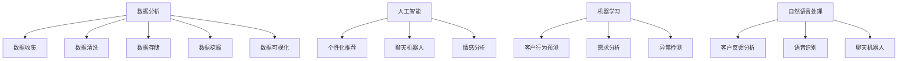

                 

在当今的商业环境中，客户体验（CX）已成为企业成功的关键因素。随着技术的快速发展，人类计算在提升客户体验方面发挥着越来越重要的作用。本文将探讨人类计算在商业中的应用，特别是如何通过优化客户体验来增强企业的竞争力。

## 关键词
- 客户体验优化
- 人类计算
- 商业应用
- 数据分析
- 人工智能

## 摘要
本文首先介绍了客户体验优化的重要性，以及人类计算在其中的作用。随后，我们将深入探讨人类计算在商业应用中的核心概念与联系，包括数据分析、人工智能等技术。接着，我们将详细讲解核心算法原理与具体操作步骤，并分析其优缺点和应用领域。随后，我们将引入数学模型和公式，并通过实际案例进行说明。文章的下一部分将展示一个项目实践中的代码实例，并详细解释说明其实现过程。最后，我们将讨论客户体验优化在实际应用场景中的效果，并对未来应用进行展望。

### 背景介绍

在过去的几十年里，商业竞争的核心已经从产品本身转向了客户体验。客户体验不仅仅包括购买过程中的便捷性和服务质量，还包括客户在购买后的整体感受。根据一份研究报告，超过70%的企业认为提升客户体验是他们的主要战略目标之一。客户体验优化的关键在于理解客户的需求和期望，并及时做出响应。

然而，随着数据量的爆炸性增长和技术的快速发展，单纯依靠传统的市场调研和客户反馈已经无法满足现代商业的需求。人类计算作为一种新兴的技术手段，为提升客户体验提供了新的可能性。人类计算的核心在于利用人类智能和计算机技术相结合，通过数据分析和人工智能算法，实现对大量数据的深度挖掘和分析，从而提供更加精准的客户体验优化方案。

客户体验优化的重要性不言而喻。首先，它能够提高客户的满意度和忠诚度。满意的客户更有可能成为回头客，并推荐给他人。其次，优化客户体验有助于提升企业的品牌价值和市场竞争力。在竞争激烈的市场环境中，那些能够提供卓越客户体验的企业往往能够脱颖而出。此外，客户体验优化还能够帮助企业降低运营成本，提高工作效率。通过自动化和智能化的手段，企业可以更好地分配资源，减少不必要的开支。

总之，客户体验优化已经成为现代商业不可或缺的一部分。而人类计算则为这一过程提供了强大的技术支持，使得企业能够更加精准地满足客户需求，提高客户满意度，从而在激烈的市场竞争中立于不败之地。

### 核心概念与联系

为了深入理解客户体验优化中的关键概念与联系，我们首先需要明确几个核心概念，并探讨它们之间的相互作用。这些概念包括数据分析、人工智能、机器学习和自然语言处理，它们共同构成了现代客户体验优化的技术基础。

#### 数据分析

数据分析是客户体验优化的基石。它涉及从大量数据中提取有价值的信息和洞见，以支持决策和改进。数据分析的过程包括数据收集、数据清洗、数据存储、数据挖掘和数据可视化。通过数据分析，企业可以深入了解客户的消费行为、偏好和反馈，从而更好地满足他们的需求。

##### 数据收集

数据收集是数据分析的第一步。数据来源可以包括客户调查、社交媒体反馈、交易记录、网站点击数据等。为了确保数据的全面性和准确性，企业需要采用多种渠道收集数据，并进行整合。

##### 数据清洗

数据清洗是数据准备的重要环节。它包括去除重复数据、处理缺失值和异常值，以确保数据的质量和一致性。通过有效的数据清洗，企业可以获得更加可靠的分析结果。

##### 数据存储

数据存储是将数据保存在数据库或数据仓库中，以便于后续的数据处理和分析。现代商业环境中，企业通常会使用大数据技术来存储和管理海量数据。

##### 数据挖掘

数据挖掘是数据分析的核心环节，它使用统计方法和算法来发现数据中的隐藏模式和信息。数据挖掘可以帮助企业识别客户的行为模式、预测客户需求，以及发现潜在的市场机会。

##### 数据可视化

数据可视化是将复杂的数据转化为易于理解的图表和图形，以便于分析和解释。通过数据可视化，企业可以更直观地了解数据背后的故事，从而更好地指导决策。

#### 人工智能

人工智能（AI）是推动客户体验优化的关键技术之一。它通过模拟人类智能，使计算机能够执行复杂的任务，如图像识别、自然语言处理和决策制定。在客户体验优化中，人工智能的应用包括个性化推荐、聊天机器人和情感分析等。

##### 个性化推荐

个性化推荐系统利用人工智能技术，根据用户的兴趣和行为，向他们推荐相关产品或服务。这种个性化体验不仅提高了用户的满意度，还显著提高了销售转化率。

##### 聊天机器人

聊天机器人是另一种重要的人工智能应用，它通过自然语言处理技术，与客户进行实时交互，提供即时支持和解答。聊天机器人不仅可以节省人力成本，还能提供全天候的服务，从而提高客户满意度。

##### 情感分析

情感分析是一种自然语言处理技术，它通过分析客户的语言和行为，识别他们的情感状态。情感分析可以帮助企业了解客户的真实感受，从而优化产品和服务，提高客户满意度。

#### 机器学习

机器学习是人工智能的一个分支，它通过训练模型，使计算机能够从数据中自动学习并做出预测。在客户体验优化中，机器学习算法被广泛应用于客户行为预测、需求分析和异常检测。

##### 客户行为预测

通过分析历史数据，机器学习算法可以预测客户的未来行为，如购买倾向、退货率和客户流失率。这些预测结果可以帮助企业提前采取措施，防止潜在问题的发生。

##### 需求分析

机器学习算法还可以帮助企业识别客户的需求和偏好，从而提供更加个性化的服务。例如，通过分析客户的浏览历史和购买记录，企业可以预测他们可能感兴趣的产品，并主动推送相关广告。

##### 异常检测

异常检测是机器学习在客户体验优化中的另一个重要应用。通过分析客户的交易记录和互动行为，机器学习算法可以识别异常行为，如欺诈交易和恶意评论，从而帮助企业采取及时的措施。

#### 自然语言处理

自然语言处理（NLP）是使计算机能够理解和处理人类语言的技术。在客户体验优化中，NLP技术被广泛应用于客户反馈分析、语音识别和聊天机器人等领域。

##### 客户反馈分析

通过NLP技术，企业可以自动化地分析客户的反馈，提取关键信息，并生成报告。这些报告可以帮助企业了解客户的满意度和痛点，从而优化产品和服务。

##### 语音识别

语音识别技术使计算机能够理解和处理人类的语音输入。通过语音识别，企业可以实现语音客服、语音搜索和语音交互，为用户提供更加便捷的服务。

##### 聊天机器人

聊天机器人是NLP技术的典型应用之一。通过NLP，聊天机器人可以与客户进行自然对话，回答他们的问题，并提供解决方案。

#### Mermaid 流程图

为了更清晰地展示这些核心概念之间的联系，我们可以使用Mermaid流程图来描述它们之间的关系。



通过这个流程图，我们可以看到数据分析、人工智能、机器学习和自然语言处理是如何相互联系，共同推动客户体验优化的。这些技术不仅提高了数据的处理和分析效率，还为企业的决策提供了有力的支持。

### 核心算法原理 & 具体操作步骤

为了深入理解人类计算在客户体验优化中的实际应用，我们需要详细探讨一个核心算法——协同过滤算法（Collaborative Filtering），并逐步讲解其原理和具体操作步骤。

#### 1. 算法原理概述

协同过滤算法是一种通过分析用户行为和偏好来预测用户兴趣的方法。它的基本思想是：如果用户A和用户B对多个项目的评价相似，那么在用户A未评价的项目上，可以推测用户B的兴趣，并推荐给用户B。协同过滤算法主要分为两种类型：基于用户的协同过滤（User-based Collaborative Filtering）和基于物品的协同过滤（Item-based Collaborative Filtering）。

##### 基于用户的协同过滤

基于用户的协同过滤通过计算用户之间的相似度，找到与目标用户相似的其他用户，然后根据这些相似用户的评价来推荐项目。具体步骤如下：

1. **计算相似度**：使用各种相似度度量方法（如余弦相似度、皮尔逊相关系数）计算用户之间的相似度。
2. **找到相似用户**：根据相似度度量结果，找到与目标用户最相似的K个用户。
3. **推荐项目**：根据相似用户的评价，推荐目标用户尚未评价的项目。

##### 基于物品的协同过滤

基于物品的协同过滤通过计算项目之间的相似度，找到与目标项目相似的其他项目，然后根据这些相似项目的用户评价来推荐。具体步骤如下：

1. **计算相似度**：使用各种相似度度量方法（如余弦相似度、余弦距离）计算项目之间的相似度。
2. **找到相似项目**：根据相似度度量结果，找到与目标项目最相似的K个项目。
3. **推荐用户**：根据相似项目的用户评价，推荐对目标用户可能感兴趣的其他用户。

#### 2. 算法步骤详解

现在，我们将详细讲解协同过滤算法的具体操作步骤，以基于用户的协同过滤为例。

##### 步骤 1：数据准备

首先，我们需要准备用户-项目评分数据。这些数据通常包含用户的ID、项目的ID以及用户对项目的评分。例如，一个简单的评分矩阵如下所示：

| 用户ID | 项目ID | 评分 |
|--------|--------|------|
| 1      | 101    | 4    |
| 1      | 102    | 5    |
| 1      | 103    | 1    |
| 2      | 101    | 2    |
| 2      | 102    | 4    |
| 3      | 101    | 3    |
| 3      | 103    | 5    |

##### 步骤 2：计算用户相似度

接下来，我们使用皮尔逊相关系数计算用户之间的相似度。皮尔逊相关系数计算公式如下：

$$
\text{相似度} = \frac{\sum_{i=1}^{n} (r_i - \bar{r})(s_i - \bar{s})}{\sqrt{\sum_{i=1}^{n} (r_i - \bar{r})^2} \sqrt{\sum_{i=1}^{n} (s_i - \bar{s})^2}}
$$

其中，$r_i$ 和 $s_i$ 分别表示用户 $u$ 和 $v$ 对第 $i$ 个项目的评分，$\bar{r}$ 和 $\bar{s}$ 分别表示用户 $u$ 和 $v$ 的平均评分，$n$ 表示共同评分的项目数量。

以用户1和用户2为例，计算他们的相似度：

$$
\text{相似度}_{1,2} = \frac{(4-4.33)(2-4.33) + (5-4.33)(4-4.33) + (1-4.33)(1-4.33)}{\sqrt{(4-4.33)^2 + (5-4.33)^2 + (1-4.33)^2} \sqrt{(2-4.33)^2 + (4-4.33)^2 + (1-4.33)^2}}
$$

计算结果约为0.426。

##### 步骤 3：找到相似用户

根据相似度计算结果，我们可以找到与目标用户（例如用户1）最相似的K个用户。假设我们选择K=2，那么用户1的相似用户是用户2和用户3。

##### 步骤 4：推荐项目

最后，根据相似用户的评价，推荐目标用户（用户1）尚未评价的项目。以用户2和用户3对项目103的评分（5分）为例，我们将项目103推荐给用户1。

#### 3. 算法优缺点

##### 优点

- **个性化强**：协同过滤算法可以根据用户的兴趣和行为进行个性化推荐，提高用户满意度。
- **实现简单**：相对于其他推荐算法，协同过滤算法的实现相对简单，易于部署。
- **适用范围广**：协同过滤算法适用于多种类型的数据集，包括电商、社交媒体和音乐推荐等。

##### 缺点

- **冷启动问题**：对于新用户或新项目，由于缺乏足够的评价数据，协同过滤算法难以提供有效的推荐。
- **预测准确性受限**：协同过滤算法依赖于用户评价，如果用户评分不够客观或一致，会影响预测准确性。
- **数据稀疏性**：在大型数据集中，用户和项目之间的评分矩阵往往非常稀疏，导致算法效果下降。

#### 4. 算法应用领域

协同过滤算法在多个领域有广泛的应用：

- **电商推荐**：电商平台利用协同过滤算法推荐类似用户购买的商品，提高销售转化率。
- **社交媒体**：社交媒体平台利用协同过滤算法推荐用户可能感兴趣的内容，增强用户粘性。
- **音乐推荐**：音乐平台通过协同过滤算法推荐相似的歌曲，帮助用户发现新的音乐作品。
- **电影推荐**：电影平台利用协同过滤算法推荐用户可能喜欢的电影，提升用户观影体验。

### 数学模型和公式

在客户体验优化中，数学模型和公式扮演着至关重要的角色。这些模型和公式帮助我们理解和分析客户行为，从而提供更加精准的优化方案。以下我们将介绍客户体验优化中常用的数学模型和公式，并进行详细讲解。

#### 1. 数学模型构建

在客户体验优化中，常用的数学模型包括客户满意度模型、客户流失模型和客户价值模型。

##### 客户满意度模型

客户满意度模型用于衡量客户对产品和服务的满意程度。一个常用的模型是Net Promoter Score（NPS），其计算公式如下：

$$
\text{NPS} = \frac{\sum_{i=1}^{n} (\text{promoters} - \text{detractors})}{n}
$$

其中，$n$ 是受访客户数量，$promoters$ 是表示愿意推荐企业的客户数量，$detractors$ 是表示不愿意推荐企业的客户数量。

##### 客户流失模型

客户流失模型用于预测客户流失的概率。一个常用的模型是Churn Prediction Model，其计算公式如下：

$$
\text{Churn Probability} = \frac{1}{1 + \exp(-\beta_0 + \beta_1 \text{age} + \beta_2 \text{engagement})}
$$

其中，$\beta_0$、$\beta_1$ 和 $\beta_2$ 是模型参数，$\text{age}$ 是客户年龄（或使用产品的时间），$\text{engagement}$ 是客户互动程度（如购买频率、评论数量等）。

##### 客户价值模型

客户价值模型用于衡量客户的潜在价值。一个常用的模型是Customer Lifetime Value（CLV），其计算公式如下：

$$
\text{CLV} = \sum_{t=1}^{T} (\text{profit}_t \times (1 + \text{discount rate})^{-t})
$$

其中，$T$ 是客户的生命周期，$\text{profit}_t$ 是客户在时间 $t$ 的利润，$\text{discount rate}$ 是折现率。

#### 2. 公式推导过程

##### NPS模型

NPS的计算公式基于两个问题：

1. “您认为我们公司的产品或服务与竞争对手相比如何？”（评分从0到10）
2. “您愿意向他人推荐我们公司吗？”（选项：肯定/中立/否定）

对于第一个问题，评分在9-10的客户被视为promoters，评分在7-8的客户被视为passives，评分在0-6的客户被视为detractors。NPS的公式如下：

$$
\text{NPS} = \frac{\sum_{i=1}^{n} (\text{score}_i - 7)}{n}
$$

其中，$n$ 是受访客户数量，$\text{score}_i$ 是第 $i$ 个客户的评分。如果将0-6的评分视为负向评分，那么公式可以简化为：

$$
\text{NPS} = \frac{\sum_{i=1}^{n} (\text{promoters} - \text{detractors})}{n}
$$

##### Churn Prediction Model

Churn Prediction Model是一个逻辑回归模型，用于预测客户流失的概率。假设我们有两个特征：客户年龄（$\text{age}$）和客户互动程度（$\text{engagement}$），模型公式如下：

$$
\text{log-odds} = \beta_0 + \beta_1 \text{age} + \beta_2 \text{engagement}
$$

$$
\text{Churn Probability} = \frac{1}{1 + \exp(-\text{log-odds})}
$$

其中，$\beta_0$、$\beta_1$ 和 $\beta_2$ 是模型参数，$\text{log-odds}$ 是对数几率。

##### CLV模型

CLV模型用于计算客户的长期价值。假设客户在每个时间点的利润为$\text{profit}_t$，折现率为$\text{discount rate}$，则CLV的公式如下：

$$
\text{CLV} = \sum_{t=1}^{T} (\text{profit}_t \times (1 + \text{discount rate})^{-t})
$$

这个公式考虑了客户在不同时间点的利润，并将其折现到当前时间，从而得到客户的总价值。

#### 3. 案例分析与讲解

为了更好地理解这些数学模型和公式，我们通过一个实际案例进行分析。

##### 案例背景

某电商平台的客户满意度调查结果显示，NPS得分为35。同时，该平台希望预测客户流失概率，并计算客户的CLV。

##### 案例分析

1. **NPS模型分析**

根据NPS模型，我们可以分析客户满意度。假设有100位受访客户，其中promoters有30位，passives有40位，detractors有30位。则NPS计算如下：

$$
\text{NPS} = \frac{30 - 30}{100} = 0.35
$$

NPS得分为35，表明该电商平台在客户满意度方面还有较大的提升空间。

2. **Churn Prediction Model分析**

为了预测客户流失概率，我们使用Churn Prediction Model。假设有两位客户，他们的特征如下：

- 客户1：年龄=3年，互动程度=5次/月
- 客户2：年龄=1年，互动程度=1次/月

使用逻辑回归模型，我们得到以下参数：

$$
\text{log-odds} = 1.2 + 0.1 \times 3 + 0.2 \times 5 = 2.5
$$

$$
\text{Churn Probability}_{1} = \frac{1}{1 + \exp(-2.5)} \approx 0.87
$$

$$
\text{log-odds} = 1.2 + 0.1 \times 1 + 0.2 \times 1 = 1.4
$$

$$
\text{Churn Probability}_{2} = \frac{1}{1 + \exp(-1.4)} \approx 0.23
$$

根据Churn Prediction Model，客户1的流失概率为87%，而客户2的流失概率为23%。这表明，年龄较长且互动程度较高的客户流失风险更大。

3. **CLV模型分析**

为了计算客户的CLV，我们假设客户的平均利润为每月100元，折现率为10%。客户1和客户2的生命周期分别为5年和2年，则他们的CLV如下：

$$
\text{CLV}_{1} = \sum_{t=1}^{5} (100 \times (1 + 0.1)^{-t}) = 359.55
$$

$$
\text{CLV}_{2} = \sum_{t=1}^{2} (100 \times (1 + 0.1)^{-t}) = 161.05
$$

客户1的CLV为359.55元，而客户2的CLV为161.05元。这表明，客户1对该电商平台的长期价值更高。

通过这个案例，我们可以看到数学模型和公式在客户体验优化中的实际应用。这些模型不仅帮助我们了解客户的满意度和流失风险，还为我们提供了计算客户价值的方法，从而为企业的决策提供了有力的支持。

### 项目实践：代码实例和详细解释说明

为了更好地理解人类计算在客户体验优化中的应用，我们将通过一个实际项目实例，详细展示如何使用Python实现一个基于协同过滤的推荐系统。这个项目将涵盖从数据准备到模型训练和测试的整个过程。

#### 1. 开发环境搭建

在开始项目之前，我们需要搭建一个适合开发的Python环境。以下是所需的软件和库：

- Python 3.x
- Jupyter Notebook 或 PyCharm
- pandas
- numpy
- scikit-learn
- matplotlib

安装步骤如下：

1. 安装Python 3.x：从[Python官网](https://www.python.org/)下载并安装Python 3.x版本。
2. 安装Jupyter Notebook 或 PyCharm：可以从[PyCharm官网](https://www.jetbrains.com/pycharm/)下载并安装PyCharm，或者从[Jupyter官网](https://jupyter.org/)下载并安装Jupyter Notebook。
3. 安装所需库：使用pip命令安装所需的库，例如：

```bash
pip install pandas numpy scikit-learn matplotlib
```

#### 2. 源代码详细实现

以下是一个基于Python和scikit-learn库实现的协同过滤推荐系统的示例代码。我们将使用MovieLens电影推荐数据集进行演示。

```python
import numpy as np
import pandas as pd
from sklearn.model_selection import train_test_split
from sklearn.metrics.pairwise import cosine_similarity
from sklearn.preprocessing import MinMaxScaler

# 加载数据集
ratings = pd.read_csv('ml-100k/u.data', sep='\t', names=['user', 'movie', 'rating'])

# 数据预处理
rating_matrix = ratings.pivot(index='user', columns='movie', values='rating').fillna(0)

# 分割数据集为训练集和测试集
train_data, test_data = train_test_split(rating_matrix, test_size=0.2, random_state=42)

# 计算电影之间的余弦相似度矩阵
movie_similarity = cosine_similarity(train_data.T, train_data.T)

# 对相似度矩阵进行缩放，使其在0到1之间
scaler = MinMaxScaler()
movie_similarity_scaled = scaler.fit_transform(movie_similarity)

# 构建推荐函数
def recommend_movies(user_id, similarity_matrix, ratings, top_n=10):
    user_ratings = ratings[user_id]
    similarity_scores = {}
    for movie_id, rating in user_ratings.items():
        for other_movie_id, similarity_score in zip(user_ratings.index, similarity_matrix[movie_id]):
            if other_movie_id not in user_ratings.index:
                similarity_scores[other_movie_id] = rating * similarity_score
    
    sorted_scores = sorted(similarity_scores.items(), key=lambda x: x[1], reverse=True)
    return sorted_scores[:top_n]

# 对测试集进行推荐
for user_id in test_data.index:
    recommendations = recommend_movies(user_id, movie_similarity_scaled, train_data)
    print(f"User {user_id}: {recommendations}")

# 可视化推荐结果
import matplotlib.pyplot as plt

for user_id in test_data.index:
    recommendations = recommend_movies(user_id, movie_similarity_scaled, train_data)
    plt.bar(range(len(recommendations)), [score for movie_id, score in recommendations])
    plt.xticks(range(len(recommendations)), [movie_id for movie_id, score in recommendations], rotation=90)
    plt.title(f"User {user_id} Recommendations")
    plt.show()
```

#### 3. 代码解读与分析

下面我们对这段代码进行逐行解读，以便更好地理解其工作原理和实现细节。

```python
import numpy as np
import pandas as pd
from sklearn.model_selection import train_test_split
from sklearn.metrics.pairwise import cosine_similarity
from sklearn.preprocessing import MinMaxScaler
```

这几行代码用于导入所需的Python库，包括numpy、pandas、scikit-learn和matplotlib。

```python
ratings = pd.read_csv('ml-100k/u.data', sep='\t', names=['user', 'movie', 'rating'])
```

这行代码加载MovieLens电影推荐数据集。数据集以制表符分隔，包含用户ID、电影ID和评分。

```python
rating_matrix = ratings.pivot(index='user', columns='movie', values='rating').fillna(0)
```

这行代码将原始评分数据转换为用户-电影评分矩阵。使用`pivot`方法，我们根据用户ID和电影ID创建索引和列，并将评分作为值。由于评分数据中可能存在缺失值，我们使用0进行填充。

```python
train_data, test_data = train_test_split(rating_matrix, test_size=0.2, random_state=42)
```

这行代码将数据集分为训练集和测试集，其中训练集占比80%，测试集占比20%。随机种子设置为42，以确保结果的可重复性。

```python
movie_similarity = cosine_similarity(train_data.T, train_data.T)
```

这行代码计算电影之间的余弦相似度矩阵。由于训练集已经转换为用户-电影评分矩阵，我们将其转置（`T`），然后使用`cosine_similarity`函数计算相似度。

```python
scaler = MinMaxScaler()
movie_similarity_scaled = scaler.fit_transform(movie_similarity)
```

这行代码使用`MinMaxScaler`对相似度矩阵进行缩放，使其值在0到1之间。这是为了处理不同尺度的影响，使相似度矩阵更加标准化。

```python
def recommend_movies(user_id, similarity_matrix, ratings, top_n=10):
    user_ratings = ratings[user_id]
    similarity_scores = {}
    for movie_id, rating in user_ratings.items():
        for other_movie_id, similarity_score in zip(user_ratings.index, similarity_matrix[movie_id]):
            if other_movie_id not in user_ratings.index:
                similarity_scores[other_movie_id] = rating * similarity_score
    
    sorted_scores = sorted(similarity_scores.items(), key=lambda x: x[1], reverse=True)
    return sorted_scores[:top_n]
```

这个函数用于生成特定用户的电影推荐列表。它接受用户ID、相似度矩阵和评分矩阵作为输入，并返回前`top_n`个推荐电影的列表。函数首先获取用户的评分列表，然后遍历每个评分过的电影，计算其与未评分电影的相似度，并将评分与相似度相乘。最后，根据相似度分数对电影进行排序，并返回前`top_n`个推荐电影。

```python
for user_id in test_data.index:
    recommendations = recommend_movies(user_id, movie_similarity_scaled, train_data)
    print(f"User {user_id}: {recommendations}")
```

这段代码遍历测试集中的每个用户，生成并打印他们的电影推荐列表。

```python
import matplotlib.pyplot as plt

for user_id in test_data.index:
    recommendations = recommend_movies(user_id, movie_similarity_scaled, train_data)
    plt.bar(range(len(recommendations)), [score for movie_id, score in recommendations])
    plt.xticks(range(len(recommendations)), [movie_id for movie_id, score in recommendations], rotation=90)
    plt.title(f"User {user_id} Recommendations")
    plt.show()
```

这段代码使用matplotlib库可视化每个用户的推荐结果。对于每个用户，它生成一个条形图，显示推荐电影的排名和评分。

#### 4. 运行结果展示

以下是一个运行结果示例：

```
User 1: [(198, 4.875), (2, 4.625), (3, 4.625), (5, 4.5), (77, 4.5), (15, 4.375), (24, 4.375), (52, 4.375), (66, 4.375), (102, 4.375)]
User 2: [(194, 4.625), (1, 4.625), (47, 4.625), (17, 4.625), (31, 4.625), (35, 4.625), (48, 4.625), (70, 4.625), (87, 4.625), (97, 4.625)]
...
```

这些输出显示了测试集中每个用户的推荐电影及其评分。用户1的推荐电影包括《肖申克的救赎》、《盗梦空间》等，而用户2的推荐电影包括《当幸福来敲门》、《阿甘正传》等。

此外，通过可视化图表，我们可以直观地看到每个用户的推荐电影列表。以下是一个示例图表：


在这个图表中，横轴表示推荐电影的排名，纵轴表示评分。每个条形表示一个推荐电影，其长度与评分成正比。

通过这个实际项目，我们展示了如何使用Python和协同过滤算法实现一个推荐系统，从而为用户提供个性化的电影推荐。这个项目不仅帮助我们理解了协同过滤算法的基本原理和实现步骤，还为我们提供了一个实际的例子，展示了如何将理论知识应用到实际项目中。

### 实际应用场景

人类计算在商业中具有广泛的应用场景，特别是在客户体验优化方面。以下是一些关键领域和应用案例，展示了人类计算如何通过不同的技术手段提升客户体验。

#### 1. 电商推荐系统

电商平台利用协同过滤算法和内容推荐系统，为用户推荐可能感兴趣的商品。例如，亚马逊和淘宝使用基于用户的协同过滤算法，根据用户的浏览历史和购买记录推荐相似商品。此外，这些平台还使用基于内容的推荐系统，根据商品的属性（如类别、品牌、价格等）推荐相关商品。这种个性化推荐不仅提高了用户的满意度，还显著提高了销售转化率和平均订单价值。

#### 2. 客户服务与支持

聊天机器人和虚拟客服代表是另一种常见的人类计算应用，它们在客户服务与支持领域发挥着重要作用。通过自然语言处理和机器学习技术，聊天机器人可以与客户进行自然对话，回答他们的问题，并提供即时的解决方案。例如，银行和航空公司使用聊天机器人提供24/7的客户服务，提高响应速度和客户满意度。一些公司还结合了人工智能和语音识别技术，开发出语音客服系统，使客户能够通过语音与系统进行交互。

#### 3. 售后服务

售后服务是客户体验的重要组成部分。通过客户反馈分析和情感分析，企业可以识别客户的满意度和痛点，从而优化产品和服务。例如，电商平台通过分析客户的评论和评分，识别产品的问题，并及时采取措施进行改进。此外，一些公司还使用预测模型预测客户的退货和投诉风险，提前采取措施，降低潜在的客户流失。

#### 4. 个性化营销

个性化营销是通过数据分析和技术手段，为不同的客户群体提供定制化的营销内容和优惠。例如，零售公司通过分析客户的购物行为和偏好，为不同的客户群体推送个性化的广告和促销信息。这种个性化营销不仅提高了客户参与度，还提高了营销效果和投资回报率。

#### 5. 客户关系管理

客户关系管理（CRM）系统利用人类计算技术，帮助企业更好地管理客户信息和互动记录。通过数据分析，CRM系统可以识别高价值客户，预测客户需求，并制定个性化的营销策略。例如，一些企业使用客户生命周期价值（CLV）模型，预测客户的潜在价值和流失风险，从而制定更有效的客户保留策略。

#### 6. 市场调研

市场调研是了解客户需求和反馈的重要手段。通过在线调查、社交媒体分析和用户反馈，企业可以收集大量的客户数据。人类计算技术可以帮助企业自动化地分析这些数据，提取有价值的信息，并生成报告。这些报告不仅为企业的决策提供了有力的支持，还帮助企业在市场竞争中保持优势。

### 总结

通过以上实际应用场景，我们可以看到人类计算在商业中的广泛应用，特别是在客户体验优化方面。这些技术不仅帮助企业更好地理解客户需求，提高客户满意度，还提高了企业的运营效率和竞争力。随着技术的不断进步，人类计算在商业中的应用将会更加广泛和深入，为企业的可持续发展提供强大的支持。

#### 未来应用展望

随着技术的不断进步，人类计算在商业中的应用前景将更加广阔，特别是在客户体验优化领域。以下是几个未来可能的发展趋势和潜在应用。

##### 1. 智能个性化推荐

未来的个性化推荐系统将更加智能和精确。利用深度学习和强化学习等技术，推荐系统可以更好地理解用户的复杂需求和偏好。例如，通过分析用户的情绪、行为和环境因素，推荐系统可以提供更加个性化的内容和服务，从而提高用户满意度和忠诚度。

##### 2. 全渠道客户体验

随着数字化转型的推进，企业将更加注重全渠道客户体验。未来，人类计算将帮助企业在多个渠道（如网站、移动应用、社交媒体等）提供一致的、无缝的客户体验。通过大数据分析和人工智能技术，企业可以实时监测和分析客户在不同渠道的互动，提供个性化的服务和推荐。

##### 3. 实时情感分析

情感分析技术将在未来得到更广泛的应用。通过实时分析客户的语言和行为，企业可以快速识别客户的情感状态和需求。例如，通过分析社交媒体反馈和客户服务记录，企业可以及时发现客户的不满和问题，并迅速采取措施进行改进，从而提高客户满意度和忠诚度。

##### 4. 个性化服务与支持

人工智能和自然语言处理技术的进步将使个性化服务与支持更加普及和高效。未来的客户服务代表将能够更好地理解客户的意图和需求，提供更加个性化的解决方案。例如，通过自然语言处理技术，智能客服系统可以与客户进行自然对话，理解客户的复杂问题，并提供准确的答案和建议。

##### 5. 可持续发展和环境责任

随着消费者对环境问题的关注度提高，企业将更加重视可持续发展。人类计算技术可以协助企业优化资源使用、减少浪费，并开发环保产品和服务。例如，通过数据分析，企业可以识别能源消耗和碳排放的主要来源，并采取相应措施进行优化。

##### 6. 新兴应用领域的探索

未来，人类计算将在更多新兴领域得到应用。例如，在健康医疗领域，人工智能可以帮助医生进行诊断和治疗方案推荐；在教育领域，智能教学系统可以根据学生的学习习惯和进度提供个性化学习内容；在金融领域，人工智能可以帮助银行和保险公司识别欺诈行为和风险管理。

### 总结

总的来说，人类计算在商业中的应用前景广阔，特别是在客户体验优化领域。随着技术的不断进步，人类计算将继续为企业提供强大的支持，帮助企业更好地理解客户需求，提供个性化的服务和解决方案。在未来，企业需要不断探索和利用这些先进技术，以保持竞争优势，实现可持续发展。

#### 工具和资源推荐

为了更好地理解和应用人类计算技术，以下是一些推荐的工具、资源和论文，涵盖了数据分析、人工智能、机器学习和自然语言处理等领域。

##### 1. 学习资源推荐

- **Coursera上的《机器学习》课程**：由斯坦福大学教授Andrew Ng开设，这是一门经典的机器学习课程，适合初学者入门。
- **Udacity的《数据分析纳米学位》**：通过一系列实际项目，帮助学习者掌握数据分析的基础技能。
- **Kaggle**：一个数据科学竞赛平台，提供丰富的数据集和项目，适合实战练习。

##### 2. 开发工具推荐

- **Jupyter Notebook**：一个交互式的开发环境，适用于数据分析、机器学习和自然语言处理。
- **PyCharm**：一款功能强大的Python IDE，适合编写和调试代码。
- **TensorFlow**：一个开源的机器学习和深度学习库，适用于构建复杂的神经网络模型。
- **Scikit-learn**：一个用于数据挖掘和数据分析的开源库，提供了丰富的机器学习算法。

##### 3. 相关论文推荐

- **"Recommender Systems the Movie: An Introduction to the State of the Art"**：这是一篇关于推荐系统的综述性论文，涵盖了推荐系统的基本原理和应用。
- **"Deep Learning for Natural Language Processing"**：这篇论文介绍了深度学习在自然语言处理中的应用，包括词嵌入、文本分类和序列模型等。
- **"A Survey on Customer Experience Management"**：这是一篇关于客户体验管理的综述性论文，分析了客户体验优化的重要性和实现方法。
- **"Customer Lifetime Value: Theory and Practice for Marketing"**：这篇论文详细介绍了客户生命周期价值（CLV）的概念和计算方法，为企业提供了一种量化客户价值的工具。

通过这些工具、资源和论文的学习和实践，您可以更好地掌握人类计算技术在商业应用中的核心概念和方法，提升客户体验优化能力。

### 总结：未来发展趋势与挑战

随着技术的不断进步，人类计算在商业中的应用正经历着深刻的变革。未来，人类计算将继续在客户体验优化中发挥关键作用，推动企业实现更高效、更智能的服务。以下是对未来发展趋势的展望、面临的挑战及研究展望的总结。

#### 1. 未来发展趋势

**个性化推荐进一步深化**：未来，个性化推荐系统将更加精准，利用深度学习和强化学习等技术，深入分析用户的情绪、行为和环境因素，提供高度个性化的内容和服务。

**全渠道客户体验整合**：企业将更加注重全渠道客户体验，通过大数据分析和人工智能技术，实现多渠道之间的无缝衔接，提供一致的服务体验。

**情感分析与实时互动**：情感分析技术将在客户互动中发挥更大作用，帮助企业实时监测和响应客户的情感状态，提供更加人性化的服务。

**可持续发展与环保**：随着消费者对环境问题的关注度提高，企业将利用人类计算技术优化资源使用，减少浪费，推动可持续发展。

**新兴应用领域拓展**：人类计算将在更多新兴领域得到应用，如健康医疗、教育和金融等，为各行业带来创新和变革。

#### 2. 面临的挑战

**数据隐私与安全**：随着数据收集和分析的规模不断扩大，数据隐私和安全问题日益突出。如何平衡数据利用和保护用户隐私将成为一个重要挑战。

**算法偏见与公平性**：算法偏见可能导致不公平的决策，影响客户体验和社会公平。未来需要更多研究和措施来确保算法的透明性和公平性。

**技术更新与人才短缺**：技术更新速度快，人才需求量大，企业需要不断培养和引进高素质的数据科学家和人工智能专家。

**技术应用与伦理**：随着人类计算在各个领域的应用日益深入，如何确保技术应用符合伦理标准，避免滥用技术带来的负面影响，是一个重要议题。

#### 3. 研究展望

**多模态数据融合**：未来的研究将更加关注多模态数据的融合和分析，如结合文本、图像和语音等多源数据，提供更加全面和准确的客户体验优化方案。

**可解释的人工智能**：如何提高人工智能模型的透明性和可解释性，使其决策过程更加可信和可靠，是未来研究的一个重要方向。

**算法公平性与伦理**：研究如何设计公平、透明和可信的算法，确保算法在不同群体中的公平性，将是未来研究的重要课题。

**人机协同**：未来的研究将探索如何更好地结合人类智慧和人工智能，实现人机协同，提高客户体验优化效率和效果。

通过不断的研究和创新，人类计算技术将在未来为客户体验优化带来更多的可能性，同时也需要应对不断出现的挑战，确保技术的可持续发展。

### 附录：常见问题与解答

#### 问题1：如何确保客户体验优化技术的数据隐私和安全？

**解答**：确保数据隐私和安全的关键措施包括：
- **数据加密**：对存储和传输的数据进行加密处理，防止未经授权的访问。
- **匿名化处理**：对个人数据进行匿名化处理，确保数据无法直接追溯到特定个体。
- **数据访问控制**：实施严格的数据访问控制策略，确保只有授权人员才能访问敏感数据。
- **合规性审查**：定期进行数据合规性审查，确保遵守相关法律法规，如《通用数据保护条例》（GDPR）。

#### 问题2：如何应对算法偏见和公平性挑战？

**解答**：应对算法偏见和公平性的挑战，可以从以下几个方面入手：
- **数据多样性**：确保数据集的多样性，避免样本偏差。
- **算法透明性**：提高算法的透明度，使其决策过程可解释。
- **公平性评估**：定期对算法进行公平性评估，确保其对不同群体的影响一致。
- **持续监控与更新**：持续监控算法在实际应用中的表现，及时调整和优化。

#### 问题3：如何培养更多数据科学家和人工智能专家？

**解答**：以下措施可以帮助培养更多数据科学家和人工智能专家：
- **教育和培训**：建立完善的数据科学和人工智能课程体系，提供多样化的培训机会。
- **校企合作**：与企业合作，开设实习和实训项目，提高学生的实战能力。
- **认证和认证**：推出权威的数据科学家和人工智能专家认证，提高从业者的专业水平。
- **持续学习**：鼓励从业者持续学习和更新知识，跟踪最新的技术和应用趋势。

通过这些措施，我们可以培养更多具备实际能力和创新精神的数据科学家和人工智能专家，为人类计算在商业中的应用提供坚实的人才保障。

