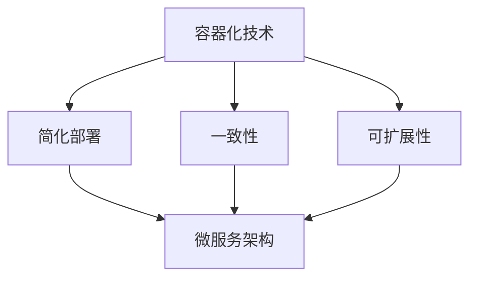

                 

关键词：容器化，微服务，部署，扩展，敏捷开发，持续集成

摘要：随着云原生技术的普及，容器化微服务逐渐成为现代软件架构的主流。本文将探讨容器化微服务的核心概念，如何简化部署和扩展，以及其在敏捷开发中的重要性。

## 1. 背景介绍

在传统软件架构中，应用程序通常是一个庞大的单体应用，所有的功能和服务都紧密耦合在一起。这种架构在初期开发阶段可能足够使用，但随着系统的复杂度增加，维护和扩展变得日益困难。为了解决这些问题，软件工程师开始采用微服务架构。

微服务架构将应用程序拆分成多个独立的小服务，每个服务负责不同的业务功能，并且使用轻量级的通信机制进行交互。这种架构的优点包括：

- **高可维护性**：各个服务可以独立开发、测试和部署，降低了系统的复杂度。
- **高可扩展性**：可以单独扩展某些服务，而不会影响整个系统。
- **高容错性**：某个服务的故障不会影响整个系统。

然而，微服务架构也带来了新的挑战，特别是服务部署和扩展的复杂性。容器化技术的出现，为解决这些问题提供了有效的方案。

## 2. 核心概念与联系

### 容器化技术

容器是一种轻量级的、可移植的、自给自足的软件打包运行环境。它封装了应用程序及其运行时环境，使得应用程序可以在任何支持容器引擎的操作系统上无缝运行。

### 微服务架构

微服务架构将应用程序拆分成多个独立的服务，每个服务负责不同的业务功能。这些服务使用轻量级的通信机制（如HTTP/REST、消息队列等）进行交互。

### 容器化与微服务的结合

容器化技术为微服务架构提供了以下优势：

- **简化部署**：容器化使得服务部署变得更加简单和快速。开发者可以将应用程序及其依赖打包成一个容器镜像，然后部署到任何支持容器引擎的节点上。
- **一致性**：容器化确保了开发、测试和生产环境的一致性，减少了环境差异带来的问题。
- **可扩展性**：容器引擎如Docker和Kubernetes可以方便地进行水平扩展，根据需求动态调整服务实例的数量。

### Mermaid 流程图



## 3. 核心算法原理 & 具体操作步骤

### 3.1 算法原理概述

容器化微服务的核心算法原理是基于容器镜像和容器引擎。容器镜像是一种静态的、不可变的文件系统打包，包含了应用程序及其依赖。容器引擎如Docker可以创建、启动和管理容器实例。

### 3.2 算法步骤详解

1. **构建容器镜像**：使用Dockerfile定义应用程序及其依赖的构建过程，生成容器镜像。
2. **部署容器实例**：使用容器引擎将容器镜像部署到节点上，启动容器实例。
3. **服务发现与负载均衡**：容器引擎提供内置的服务发现和负载均衡功能，可以根据需求动态调整容器实例的数量。
4. **监控与日志管理**：容器引擎提供了监控和日志管理功能，可以帮助开发者实时了解系统的运行状态。

### 3.3 算法优缺点

**优点**：

- **简化部署**：容器化技术使得服务部署变得更加简单和快速。
- **一致性**：容器化确保了开发、测试和生产环境的一致性。
- **可扩展性**：容器引擎可以方便地进行水平扩展。

**缺点**：

- **复杂性**：容器化引入了新的概念和工具，需要开发者具备一定的技能和知识。
- **性能开销**：容器引擎和容器实例的创建和管理引入了一定的性能开销。

### 3.4 算法应用领域

容器化微服务主要应用于以下领域：

- **云计算**：在云计算环境中，容器化微服务可以方便地进行部署和扩展。
- **大数据**：在处理大规模数据时，容器化微服务可以单独扩展某些服务，提高系统的性能。
- **移动应用**：在移动应用开发中，容器化技术可以简化应用的部署和分发。

## 4. 数学模型和公式 & 详细讲解 & 举例说明

### 4.1 数学模型构建

容器化微服务的数学模型主要涉及到服务实例的数量、资源消耗和性能指标。以下是一个简化的数学模型：

$$
C = \frac{R \times P}{T}
$$

其中，$C$表示服务实例的数量，$R$表示资源消耗（如CPU、内存等），$P$表示性能指标，$T$表示任务完成时间。

### 4.2 公式推导过程

该公式是通过分析容器化微服务的资源利用率、性能指标和任务完成时间推导出来的。具体推导过程如下：

- **资源利用率**：容器化微服务通过容器引擎进行资源管理，资源利用率可以表示为$R = \frac{C \times R_{\text{单个实例}}}{T}$，其中$R_{\text{单个实例}}$表示单个服务实例的资源消耗。
- **性能指标**：性能指标可以表示为$P = \frac{R \times P_{\text{单个实例}}}{T}$，其中$P_{\text{单个实例}}$表示单个服务实例的性能指标。
- **任务完成时间**：任务完成时间可以表示为$T = \frac{1}{C \times P}$。

将上述公式代入容器化微服务的数学模型，得到：

$$
C = \frac{R \times P}{T} = \frac{\frac{C \times R_{\text{单个实例}}}{T} \times \frac{R \times P_{\text{单个实例}}}{T}}{\frac{1}{C \times P}} = \frac{R \times P}{T}
$$

### 4.3 案例分析与讲解

假设一个微服务应用需要处理1000个并发请求，单个服务实例的资源消耗为1个CPU和2GB内存，性能指标为100个请求/秒。我们需要根据上述数学模型计算服务实例的数量。

根据数学模型，我们有：

$$
C = \frac{R \times P}{T} = \frac{(1 \times 2) \times 100}{1000} = \frac{2}{10} = 0.2
$$

因此，需要0.2个服务实例。在实际应用中，服务实例的数量通常是整数，因此我们可以向上取整，得到1个服务实例。

## 5. 项目实践：代码实例和详细解释说明

### 5.1 开发环境搭建

在开始项目实践之前，我们需要搭建一个开发环境。以下是使用Docker和Kubernetes搭建开发环境的步骤：

1. 安装Docker：在Linux系统上，可以使用以下命令安装Docker：
   ```bash
   sudo apt-get update
   sudo apt-get install docker-ce docker-ce-cli containerd.io
   ```
2. 安装Kubernetes：在Linux系统上，可以使用以下命令安装Kubernetes：
   ```bash
   sudo apt-get update
   sudo apt-get install -y apt-transport-https ca-certificates curl
   curl -s https://mirrors.aliyun.com/kubernetes/apt/doc/apt-key.gpg | sudo apt-key add -
   cat <<EOF | sudo tee /etc/apt/sources.list.d/kubernetes.list
   deb https://mirrors.aliyun.com/kubernetes/apt/ kubernetes-xenial main
   EOF
   sudo apt-get update
   sudo apt-get install -y kubelet kubeadm kubectl
   ```

### 5.2 源代码详细实现

以下是一个简单的微服务应用示例，使用Golang编写：

```go
package main

import (
    "fmt"
    "log"
    "net/http"
)

func helloHandler(w http.ResponseWriter, r *http.Request) {
    fmt.Fprintf(w, "Hello, World!")
}

func main() {
    http.HandleFunc("/", helloHandler)
    log.Fatal(http.ListenAndServe(":8080", nil))
}
```

我们需要将这个应用打包成一个Docker镜像，并部署到Kubernetes集群中。以下是具体的步骤：

1. **编写Dockerfile**：
   ```Dockerfile
   FROM golang:1.18-alpine
   WORKDIR /app
   COPY main.go .
   RUN go build -o main .
   EXPOSE 8080
   CMD ["./main"]
   ```

2. **构建Docker镜像**：
   ```bash
   docker build -t hello-world:latest .
   ```

3. **创建Kubernetes部署文件**：
   ```yaml
   apiVersion: apps/v1
   kind: Deployment
   metadata:
     name: hello-world
   spec:
     replicas: 3
     selector:
       matchLabels:
         app: hello-world
     template:
       metadata:
         labels:
           app: hello-world
       spec:
         containers:
         - name: hello-world
           image: hello-world:latest
           ports:
           - containerPort: 8080
   ```

4. **部署到Kubernetes集群**：
   ```bash
   kubectl apply -f deployment.yaml
   ```

### 5.3 代码解读与分析

1. **Dockerfile解读**：

   - `FROM golang:1.18-alpine`：基于Golang官方镜像，版本为1.18，操作系统为Alpine。
   - `WORKDIR /app`：设置工作目录为/app。
   - `COPY main.go .`：将main.go文件复制到工作目录。
   - `RUN go build -o main .`：使用Golang编译器编译main.go文件，生成可执行文件main。
   - `EXPOSE 8080`：暴露8080端口。
   - `CMD ["./main"]`：设置启动命令为./main。

2. **Kubernetes部署文件解读**：

   - `apiVersion: apps/v1`：指定Kubernetes API版本为v1。
   - `kind: Deployment`：定义一个部署对象。
   - `metadata`：部署的元数据，包括名称。
   - `spec`：部署的详细规格。
     - `replicas`：指定 replicas 数量为3。
     - `selector`：定义选择器标签。
     - `template`：部署的模板。
       - `metadata`：模板的元数据。
       - `spec`：模板的详细规格。
         - `containers`：容器列表。
           - `name`：容器名称。
           - `image`：容器镜像名称。
           - `ports`：容器端口映射。

### 5.4 运行结果展示

部署完成后，我们可以通过以下命令查看部署状态：

```bash
kubectl get deployments
```

输出结果如下：

```
NAME    READY   UP-TO-DATE   AVAILABLE   AGE
hello-world   3/3     3           3           5m
```

表示部署成功，所有容器都已启动。我们还可以通过以下命令查看Pod的详细信息：

```bash
kubectl get pods
```

输出结果如下：

```
NAME                     READY   STATUS    RESTARTS   AGE
hello-world-6c68bdf4b7-5k8n4   1/1     Running     0          5m
hello-world-6c68bdf4b7-ccl5q   1/1     Running     0          5m
hello-world-6c68bdf4b7-h5tqf   1/1     Running     0          5m
```

表示3个容器实例都已成功运行。我们可以通过以下命令访问服务：

```bash
kubectl get svc
```

输出结果如下：

```
NAME          TYPE        CLUSTER-IP       EXTERNAL-IP   PORT(S)     AGE
hello-world   ClusterIP   10.96.238.97     <none>        8080/TCP    5m
```

其中，Cluster-IP为10.96.238.97，表示服务所在的IP地址。我们可以在本地主机上通过以下命令访问服务：

```bash
curl http://10.96.238.97:8080
```

输出结果如下：

```
Hello, World!
```

表示服务已经成功启动并运行。

## 6. 实际应用场景

容器化微服务在实际应用场景中具有广泛的应用，以下是一些典型的应用场景：

1. **云计算平台**：云计算平台如Amazon Web Services（AWS）、Microsoft Azure和Google Cloud Platform（GCP）都支持容器化微服务，为开发者提供了强大的部署和扩展能力。

2. **大数据处理**：在大数据处理领域，容器化微服务可以方便地进行资源分配和任务调度，提高数据处理效率。

3. **移动应用**：在移动应用开发中，容器化微服务可以简化应用的部署和分发，提高开发效率。

4. **金融服务**：在金融服务领域，容器化微服务可以用于构建高可用、高可靠、可扩展的金融系统，提高金融服务的质量。

5. **物联网（IoT）**：在物联网领域，容器化微服务可以用于处理海量设备数据，提供实时的数据分析和决策支持。

## 7. 工具和资源推荐

### 7.1 学习资源推荐

1. **书籍**：

   - 《容器化微服务：从设计到部署》（Containerization of Microservices: From Design to Deployment）
   - 《Docker容器与容器化应用实战》（Docker Deep Dive）
   - 《Kubernetes权威指南》（Kubernetes: Up and Running）

2. **在线课程**：

   - Pluralsight：Docker和Kubernetes课程
   - Udemy：容器化微服务实战课程
   - Coursera：云计算与容器化技术课程

### 7.2 开发工具推荐

1. **Docker**：Docker是一个开源的应用容器引擎，用于构建、运行和分发应用程序。
2. **Kubernetes**：Kubernetes是一个开源的容器编排平台，用于自动化容器的部署、扩展和管理。
3. **Docker Compose**：Docker Compose是一个用于定义和运行多容器Docker应用程序的工具。
4. **Helm**：Helm是一个Kubernetes的包管理工具，用于简化Kubernetes应用程序的部署和管理。

### 7.3 相关论文推荐

1. **“Microservices: A Definition”**（Microservices：一个定义）：该论文对微服务架构进行了详细定义，并分析了其优缺点。
2. **“Docker: A Brief History of the Container Revolution”**（Docker：容器革命的简史）：该论文回顾了Docker的起源和发展历程。
3. **“Kubernetes: A Brief History of Big Cluster Management”**（Kubernetes：大集群管理的简史）：该论文回顾了Kubernetes的起源和发展历程。

## 8. 总结：未来发展趋势与挑战

容器化微服务在过去的几年中取得了显著的进展，为软件开发带来了革命性的变化。然而，随着技术的不断发展，容器化微服务也面临着一些新的挑战。

### 8.1 研究成果总结

1. **容器化技术**：容器化技术逐渐成熟，为微服务架构提供了强大的支持。
2. **Kubernetes**：Kubernetes已经成为容器编排的事实标准，广泛应用于各个领域。
3. **服务网格**：服务网格如Istio和Linkerd等为微服务提供了强大的服务发现、负载均衡和安全性保障。

### 8.2 未来发展趋势

1. **智能化**：容器化微服务将逐渐融入人工智能技术，实现智能化管理和自动化运维。
2. **云计算与边缘计算结合**：容器化微服务将更好地支持云计算和边缘计算的融合，提供更高效、更灵活的计算服务。
3. **标准化**：容器化微服务的标准化工作将进一步加强，降低开发者使用门槛。

### 8.3 面临的挑战

1. **复杂性**：容器化微服务引入了新的概念和工具，需要开发者具备一定的技能和知识。
2. **性能开销**：容器引擎和容器实例的创建和管理引入了一定的性能开销。
3. **安全性**：容器化微服务面临着新的安全挑战，需要加强安全性保障。

### 8.4 研究展望

1. **智能化运维**：通过引入人工智能技术，实现容器化微服务的智能化运维和管理。
2. **性能优化**：通过优化容器引擎和容器实例的创建和管理，降低性能开销。
3. **安全性保障**：加强容器化微服务的安全性保障，防止安全漏洞和攻击。

## 9. 附录：常见问题与解答

### 9.1 容器化与虚拟化的区别

容器化与虚拟化都是用于隔离和运行应用程序的技术，但它们有本质的区别：

- **虚拟化**：通过虚拟化技术，可以在一个物理主机上运行多个虚拟机，每个虚拟机都有独立的操作系统和硬件资源。虚拟化提供了更彻底的隔离，但性能开销较大。
- **容器化**：容器化通过共享宿主机的操作系统和硬件资源，在操作系统层面实现应用程序的隔离。容器化性能开销较小，但隔离性相对较低。

### 9.2 Kubernetes与Docker的区别

Kubernetes和Docker都是用于容器化微服务的工具，但它们的职责和功能有所不同：

- **Docker**：Docker是一个开源的应用容器引擎，主要用于构建、运行和分发应用程序。它负责创建和管理容器实例。
- **Kubernetes**：Kubernetes是一个开源的容器编排平台，主要用于自动化容器的部署、扩展和管理。它负责协调和管理容器集群。

### 9.3 容器化微服务的优点

容器化微服务的优点包括：

- **简化部署**：容器化技术使得服务部署变得更加简单和快速。
- **一致性**：容器化确保了开发、测试和生产环境的一致性。
- **可扩展性**：容器引擎可以方便地进行水平扩展，根据需求动态调整服务实例的数量。
- **高可维护性**：各个服务可以独立开发、测试和部署，降低了系统的复杂度。
- **高容错性**：某个服务的故障不会影响整个系统。

