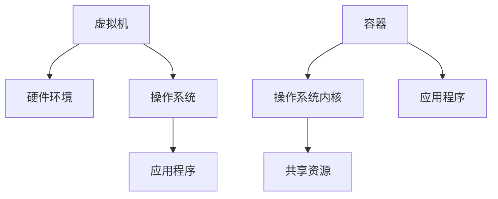
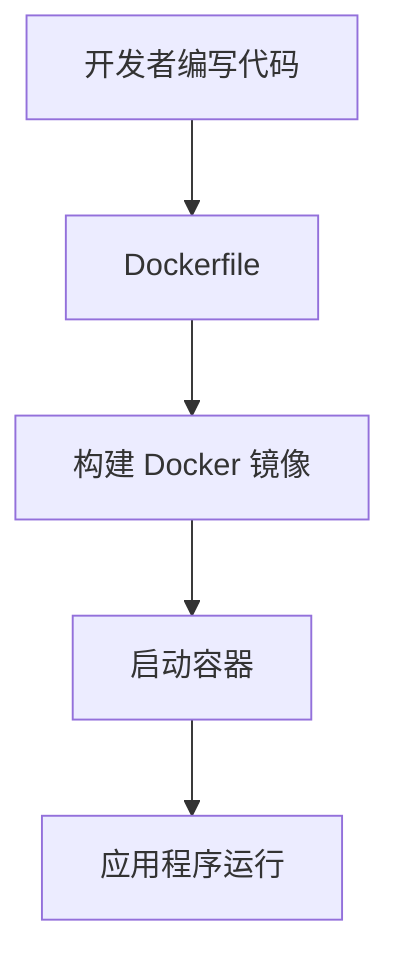
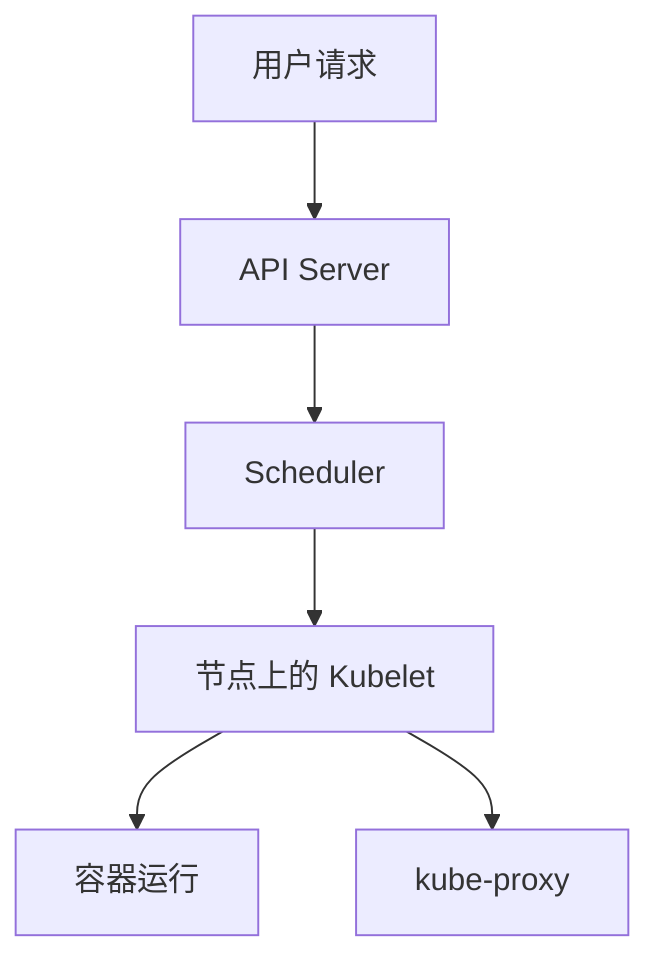

                 

## 1. 背景介绍

在现代软件开发领域，容器化技术已成为一种革命性的创新。传统的虚拟化技术虽然能够隔离应用程序及其运行环境，但开销较大，资源占用过多。容器化技术则通过轻量级、可移植、自给自足的容器来简化应用部署，提高了开发效率和系统资源利用率。Docker 和 Kubernetes 是当前最流行的容器化技术和编排系统，它们在云原生架构中扮演着至关重要的角色。

**Docker** 是一个开源的应用容器引擎，它允许开发者将应用程序及其依赖项打包到一个可移植的容器中，然后发布到任何流行的 Linux 或 Windows 操作系统中，确保环境一致性。Docker 的核心组件包括 Docker 引擎、Dockerfile（用于创建镜像的脚本文件）、Docker Compose（用于管理多容器应用的工具）等。

**Kubernetes**（简称 K8s）是一个开源的容器编排平台，用于自动化部署、扩展和管理容器化应用程序。Kubernetes 提供了一个平台，使开发者可以轻松地管理大量的容器，同时提供高可用性、资源优化和自动化管理。其主要组件包括 Kubernetes 集群（包含主节点和工作者节点）、控制平面（如 API Server、Scheduler、Controller Manager）、kubectl（集群管理的命令行工具）等。

本文将深入探讨 Docker 和 Kubernetes 在云原生架构中的应用，通过对其核心概念、架构原理、算法原理、数学模型、项目实践等方面的详细讲解，帮助读者全面了解容器化技术的优势和实践方法。

## 2. 核心概念与联系

### 2.1. 容器和虚拟机

容器和虚拟机都是用于隔离应用程序及其运行环境的虚拟化技术，但它们在实现方式上有所不同。虚拟机通过模拟完整的硬件环境来运行操作系统，从而实现应用程序的隔离。而容器则通过操作系统的命名空间（Namespace）和管控（Control Group）机制来隔离进程，共享宿主机的操作系统内核，从而大大降低了资源开销。

**Mermaid 流程图：**



### 2.2. Docker 镜像和容器

Docker 镜像是用于打包应用程序及其运行环境的只读模板。一个 Docker 镜像包含应用程序所需的所有依赖项和配置文件。通过 Dockerfile，开发者可以定义如何构建 Docker 镜像，包括安装依赖项、配置环境变量等。

容器则是基于 Docker 镜像创建的、运行中的实例。Docker 客户端可以使用 `docker run` 命令来启动一个容器，指定所需镜像和其他配置参数。

**Mermaid 流程图：**



### 2.3. Kubernetes 集群和工作原理

Kubernetes 集群是由多个节点（Node）组成的分布式系统，其中每个节点都是一个运行着 Kubernetes 组件的工作机器。集群中的主节点（Master）负责集群的监控、调度和管理，而工作者节点（Worker）则负责运行容器化的应用程序。

Kubernetes 的核心组件包括：

- **API Server**：提供 Kubernetes 集群的统一入口点，处理集群状态和配置数据的 API 请求。
- **Scheduler**：负责将容器化的应用程序调度到合适的节点上运行。
- **Controller Manager**：管理 Kubernetes 集群中的各种控制器，如副本控制器（Replica Controller）、网络控制器（Network Controller）等。

Kubernetes 的工作原理是通过控制平面（Control Plane）和节点上的 Kubelet、kube-proxy 等组件协同工作，确保集群中的容器化应用程序能够正常运行。

**Mermaid 流程图：**



## 3. 核心算法原理 & 具体操作步骤

### 3.1  算法原理概述

容器化技术的核心算法主要涉及镜像构建、容器启动和调度算法。

- **镜像构建算法**：基于 Dockerfile 的脚本文件，通过一系列指令（如 FROM、RUN、CMD 等）来构建 Docker 镜像。这些指令定义了如何安装依赖项、配置环境变量和安装应用程序等。
- **容器启动算法**：容器启动过程中，Docker 引擎会加载指定的 Docker 镜像，创建一个容器实例，并设置相应的命名空间和管控参数。
- **调度算法**：Kubernetes Scheduler 负责将容器化的应用程序调度到集群中的合适节点上。调度算法主要考虑节点的资源可用性、应用程序的优先级、标签匹配等因素。

### 3.2  算法步骤详解

- **镜像构建步骤**：
  1. 编写 Dockerfile 脚本文件。
  2. 使用 `docker build` 命令构建 Docker 镜像。
  3. 使用 `docker images` 命令查看已构建的镜像列表。

- **容器启动步骤**：
  1. 使用 `docker run` 命令启动一个容器。
  2. 指定所需的 Docker 镜像和其他配置参数（如容器名、容器端口映射等）。
  3. 使用 `docker ps` 命令查看正在运行的容器列表。

- **调度步骤**：
  1. Kubernetes Scheduler 接收到部署请求后，开始调度过程。
  2. Scheduler 根据节点的资源可用性、应用程序的优先级和标签匹配等因素，选择合适的节点。
  3. Scheduler 向节点上的 Kubelet 发送调度指令，通知其启动容器。

### 3.3  算法优缺点

- **镜像构建算法**：
  - 优点：简化了应用程序的打包和部署过程，提高了开发效率。
  - 缺点：构建过程依赖于 Dockerfile，需要一定的编程知识。

- **容器启动算法**：
  - 优点：快速启动容器，提高了系统的响应速度。
  - 缺点：容器生命周期管理较为复杂，需要定期维护和更新。

- **调度算法**：
  - 优点：实现了应用程序的高可用性和资源优化。
  - 缺点：调度过程较为复杂，需要一定的运维经验。

### 3.4  算法应用领域

容器化技术在多个领域都有广泛的应用，如云计算、大数据、人工智能、物联网等。其主要应用场景包括：

- **云计算**：容器化技术简化了云计算平台的部署和管理，提高了资源利用率和灵活性。
- **大数据**：容器化技术适用于大数据处理平台的部署和扩展，提高了处理效率和稳定性。
- **人工智能**：容器化技术有助于实现人工智能算法的快速部署和迭代，提高了研发效率。
- **物联网**：容器化技术适用于物联网设备的开发和部署，提高了设备的可移植性和兼容性。

## 4. 数学模型和公式 & 详细讲解 & 举例说明

### 4.1  数学模型构建

容器化技术涉及多个数学模型，其中最核心的是资源分配模型和调度模型。

- **资源分配模型**：

  资源分配模型用于计算容器所需的资源量，包括 CPU、内存、存储和带宽等。设 C 为容器集合，R 为资源需求集合，R = {CPU, Memory, Storage, Bandwidth}，则资源分配模型可以表示为：

  $$ R(C) = \sum_{i \in C} r_i $$

  其中，$r_i$ 为容器 $i$ 的资源需求量。

- **调度模型**：

  调度模型用于优化容器在节点上的分配，以最大化资源利用率和系统性能。设 N 为节点集合，T 为时间集合，则调度模型可以表示为：

  $$ S(N, T) = \{ (c, n, t) | c \in C, n \in N, t \in T \} $$

  其中，$c$ 为容器，$n$ 为节点，$t$ 为时间。

### 4.2  公式推导过程

- **资源分配模型**推导：

  资源分配模型的核心任务是计算容器在节点上的资源需求量。假设容器 $c_i$ 的 CPU 需求为 $c_{i,CPU}$，内存需求为 $c_{i,Memory}$，存储需求为 $c_{i,Storage}$，带宽需求为 $c_{i,Bandwidth}$。则资源需求总量为：

  $$ r_i = c_{i,CPU} + c_{i,Memory} + c_{i,Storage} + c_{i,Bandwidth} $$

  对于所有容器 $i \in C$，总资源需求量为：

  $$ R(C) = \sum_{i \in C} r_i $$

- **调度模型**推导：

  调度模型的目标是在给定节点和时间的约束条件下，选择最优的容器分配方案。设节点 $n_j$ 的可用资源量为 $r_j$，时间 $t_k$ 的可用资源量为 $r_k$。则调度模型可以表示为：

  $$ S(N, T) = \{ (c, n, t) | c \in C, n \in N, t \in T, r_j \geq r(c), r_k \geq r(c) \} $$

### 4.3  案例分析与讲解

假设有一个包含三个容器的应用程序，需要在两个节点上部署。容器 $c_1$ 需要 2 CPU、4 GB 内存、100 GB 存储和 10 Mbps 带宽；容器 $c_2$ 需要 1 CPU、2 GB 内存、50 GB 存储和 5 Mbps 带宽；容器 $c_3$ 需要 3 CPU、6 GB 内存、150 GB 存储和 15 Mbps 带宽。节点 $n_1$ 有 4 CPU、8 GB 内存、200 GB 存储和 20 Mbps 带宽；节点 $n_2$ 有 2 CPU、4 GB 内存、100 GB 存储和 10 Mbps 带宽。

- **资源分配模型**：

  容器 $c_1$ 的资源需求量为 $r_1 = 2 + 4 + 100 + 10 = 116$；容器 $c_2$ 的资源需求量为 $r_2 = 1 + 2 + 50 + 5 = 58$；容器 $c_3$ 的资源需求量为 $r_3 = 3 + 6 + 150 + 15 = 174$。总资源需求量为 $R(C) = 116 + 58 + 174 = 348$。

- **调度模型**：

  节点 $n_1$ 的可用资源量为 $r_1 = 4 + 8 + 200 + 20 = 232$，大于总资源需求量 348，因此可以将所有容器部署在节点 $n_1$ 上。

  节点 $n_2$ 的可用资源量为 $r_2 = 2 + 4 + 100 + 10 = 116$，小于总资源需求量 348，因此无法将所有容器部署在节点 $n_2$ 上。

综上所述，容器 $c_1$、$c_2$ 和 $c_3$ 可以部署在节点 $n_1$ 上。

## 5. 项目实践：代码实例和详细解释说明

### 5.1  开发环境搭建

为了实践容器化技术，我们需要搭建一个开发环境。以下是一个简单的步骤指南：

1. 安装 Docker：

   在 Ubuntu 系统上，可以通过以下命令安装 Docker：

   ```bash
   sudo apt-get update
   sudo apt-get install docker.io
   ```

2. 启动 Docker 服务：

   ```bash
   sudo systemctl start docker
   ```

3. 验证 Docker 安装：

   ```bash
   docker --version
   ```

### 5.2  源代码详细实现

以下是使用 Dockerfile 创建一个简单的 Web 应用程序容器的示例。

**Dockerfile：**

```Dockerfile
# 使用官方 Python 镜像作为基础镜像
FROM python:3.8-slim

# 设置工作目录
WORKDIR /app

# 复制应用程序代码到容器中
COPY . .

# 安装依赖项
RUN pip install -r requirements.txt

# 暴露容器的 Web 服务器端口
EXPOSE 80

# 运行应用程序
CMD ["python", "app.py"]
```

**requirements.txt：**

```txt
Flask
```

**app.py：**

```python
from flask import Flask

app = Flask(__name__)

@app.route('/')
def hello_world():
    return 'Hello, World!'

if __name__ == '__main__':
    app.run(host='0.0.0.0', port=80)
```

### 5.3  代码解读与分析

**Dockerfile**：这个文件用于定义如何构建 Docker 镜像。我们使用了 Python 3.8-slim 镜像作为基础镜像，并设置工作目录为 `/app`。接着，我们将本地应用程序代码复制到容器中，并安装所需的依赖项。最后，我们暴露容器的 Web 服务器端口（80），并定义了容器的启动命令为 `python app.py`。

**requirements.txt**：这个文件列出了应用程序所需的 Python 依赖项，如 Flask 框架。

**app.py**：这是一个简单的 Flask 应用程序，用于响应 Web 请求。我们使用 `app.run()` 方法启动应用程序，并允许外部访问（`host='0.0.0.0'`）。

### 5.4  运行结果展示

1. 构建 Docker 镜像：

   ```bash
   docker build -t my-web-app .
   ```

2. 运行容器：

   ```bash
   docker run -d -p 8080:80 my-web-app
   ```

3. 在浏览器中访问应用程序：

   打开浏览器，输入 `http://localhost:8080`，应看到 "Hello, World!" 消息。

### 5.5  问题与解决方案

- **问题**：容器无法访问宿主机的网络。
  - **解决方案**：使用 `docker run` 命令中的 `--network` 参数指定网络模式，如 `--network host` 或 `--network bridge`。

- **问题**：容器启动后无法访问宿主机的文件系统。
  - **解决方案**：使用 `docker run` 命令中的 `--volume` 参数挂载宿主机的文件系统到容器中。

## 6. 实际应用场景

容器化技术在各种实际应用场景中发挥了重要作用，以下是一些常见应用场景：

### 6.1 云计算平台

容器化技术为云计算平台提供了高效的部署和管理方式。例如，在 Kubernetes 上，用户可以轻松地部署和管理大规模的容器化应用程序，实现自动化扩展和负载均衡。容器化技术还使得云计算资源池的利用率大大提高，从而降低了运营成本。

### 6.2 大数据应用

容器化技术在大数据处理领域也得到了广泛应用。例如，Hadoop 和 Spark 等大数据处理框架可以通过容器化技术进行部署和扩展，实现高效的数据处理和计算。容器化技术简化了大数据应用的部署过程，提高了系统的可移植性和兼容性。

### 6.3 人工智能平台

人工智能算法通常需要大量的计算资源和存储资源。容器化技术可以为人工智能平台提供灵活的资源分配和调度方案，从而提高算法的研发效率和计算性能。此外，容器化技术还可以实现人工智能算法的快速部署和迭代，加速模型开发和验证过程。

### 6.4 物联网应用

物联网设备通常具有资源受限的特点。容器化技术可以通过轻量级的容器来运行物联网设备的应用程序，从而提高设备的可移植性和兼容性。此外，容器化技术还可以实现物联网设备的远程监控和管理，提高设备的运维效率。

## 7. 工具和资源推荐

为了更好地掌握容器化技术，以下是一些推荐的学习资源、开发工具和相关论文：

### 7.1 学习资源推荐

- **官方文档**：Docker 和 Kubernetes 的官方文档是学习容器化技术的最佳资源。它们提供了详细的指南和文档，涵盖了从入门到高级的知识点。
- **在线教程**：有许多优秀的在线教程和课程，如 Coursera、Udemy 和 Pluralsight 等平台上的相关课程。
- **书籍**：《Docker 实战》和《Kubernetes 实战》等书籍提供了深入浅出的讲解，适合不同层次的读者。

### 7.2 开发工具推荐

- **Docker Desktop**：Docker 的官方桌面应用程序，适合初学者快速搭建本地容器化开发环境。
- **Kubernetes Dashboard**：Kubernetes 的 Web 界面，可以方便地管理和监控集群中的容器化应用程序。
- **Kubeadm**：用于快速部署 Kubernetes 集群的工具，适合进行本地测试和实验。

### 7.3 相关论文推荐

- **“Docker: Lightweight Linux Containers for Developing, Shipping, and Running Applications”**：Docker 的开创性论文，详细介绍了 Docker 的架构和设计理念。
- **“Kubernetes: System Architecture”**：Kubernetes 的官方文档之一，提供了 Kubernetes 集群的核心架构和组件的详细介绍。
- **“Containerization: A Technical Perspective”**：容器化技术的高级论文，涵盖了容器化技术的各个方面，包括历史、原理和应用。

## 8. 总结：未来发展趋势与挑战

### 8.1 研究成果总结

容器化技术在过去的几年中取得了显著的发展。Docker 和 Kubernetes 等开源项目已经成为云计算和容器化技术的事实标准。容器化技术不仅提高了应用程序的部署和管理效率，还推动了云计算、大数据和人工智能等领域的发展。

### 8.2 未来发展趋势

1. **容器化技术的普及**：随着云原生架构的普及，容器化技术将继续在各个行业和应用场景中广泛应用。
2. **集成与自动化**：容器化技术与自动化工具（如 CI/CD 流水线）的集成将进一步简化应用程序的部署、扩展和管理。
3. **开源生态的壮大**：更多的开源项目和企业将加入容器化技术的生态，推动技术的创新和发展。
4. **性能优化**：随着容器化技术的普及，性能优化将成为一个重要研究方向，以进一步提高系统性能和资源利用率。

### 8.3 面临的挑战

1. **安全性**：容器化技术面临的安全问题（如容器逃逸、数据泄露等）需要得到有效解决。
2. **复杂度**：容器化技术的部署和管理复杂度较高，需要进一步降低学习和使用门槛。
3. **标准化和兼容性**：尽管 Docker 和 Kubernetes 已经成为行业标准，但仍然存在多个开源项目之间的兼容性问题，需要统一和标准化。

### 8.4 研究展望

未来，容器化技术将在以下几个方面进行深入研究：

1. **安全性**：加强容器化技术的安全性，包括容器隔离、数据保护和网络安全性。
2. **性能优化**：通过改进容器运行时和调度算法，提高容器化技术的性能和资源利用率。
3. **多租户架构**：研究多租户容器化架构，支持大规模容器化应用程序的部署和管理。
4. **跨云和混合云部署**：研究容器化技术在跨云和混合云部署中的应用，实现灵活的资源管理和负载均衡。

## 9. 附录：常见问题与解答

### 9.1 Docker 和虚拟机的区别是什么？

- **资源开销**：虚拟机需要模拟完整的硬件环境，包括 CPU、内存、存储和网络等，而容器仅共享宿主机的操作系统内核和资源，资源开销较小。
- **隔离性**：虚拟机提供完整的操作系统隔离，而容器通过命名空间和管控机制实现进程隔离，但共享操作系统内核。

### 9.2 Kubernetes 的主要组件有哪些？

- **API Server**：提供 Kubernetes 集群的统一入口点，处理集群状态和配置数据的 API 请求。
- **Scheduler**：负责将容器化的应用程序调度到合适的节点上运行。
- **Controller Manager**：管理 Kubernetes 集群中的各种控制器，如副本控制器、网络控制器等。
- **Kubelet**：节点上的核心组件，负责在节点上运行容器化的应用程序和监控节点状态。
- **kube-proxy**：负责在集群中实现网络负载均衡和服务发现。

### 9.3 如何在 Kubernetes 中进行水平扩展和垂直扩展？

- **水平扩展**：通过增加副本数量（Replicas）来实现，即创建多个相同容器的实例。
- **垂直扩展**：通过增加容器资源限制（如 CPU、内存）来实现，即调整容器的资源需求。

### 9.4 容器化技术有哪些优势？

- **可移植性**：容器可以在不同的操作系统和硬件平台上运行，提高了应用程序的可移植性。
- **隔离性**：容器通过命名空间和管控机制实现进程隔离，提高了系统的安全性。
- **高效性**：容器仅共享宿主机的操作系统内核和资源，降低了资源开销。
- **自动化**：容器化技术简化了应用程序的部署、扩展和管理，提高了开发效率。

