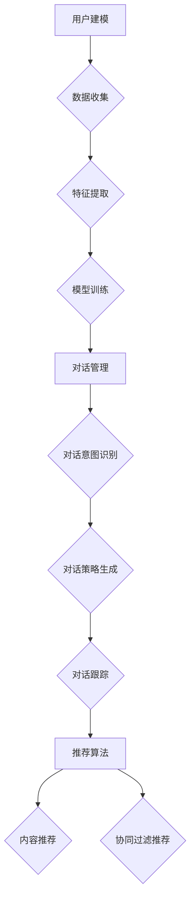

                 

关键词：对话式推荐系统、个性化、交互性、用户建模、机器学习、自然语言处理

## 摘要

随着互联网的迅猛发展和智能设备的普及，用户对于个性化推荐系统的需求日益增长。对话式推荐系统作为一种新型的推荐方式，通过用户与系统之间的互动来提供更加精确和个性化的推荐。本文旨在探讨对话式推荐系统的核心概念、关键技术、数学模型以及实际应用，旨在为相关领域的研究者提供有价值的参考。

## 1. 背景介绍

在过去的几十年中，推荐系统已经成为互联网服务中不可或缺的一部分。早期的推荐系统主要依赖于基于内容的推荐和协同过滤技术，这些方法在一定程度上能够满足用户的需求，但随着用户行为和兴趣的多样性增加，这些传统方法逐渐暴露出一些局限性。首先，基于内容的推荐方法依赖于先验的标签和元数据，当用户兴趣发生变化时，推荐结果往往不能及时更新。其次，协同过滤方法虽然能够考虑用户之间的相似性，但忽略了用户个体差异，容易产生冷启动和多样性不足的问题。

为了克服这些局限性，研究人员开始探索更加智能和个性化的推荐方法。其中，对话式推荐系统因其能够与用户进行实时交互，动态了解用户需求和偏好，从而提供更加精准的推荐。对话式推荐系统不仅能够解决传统推荐系统的局限性，还可以拓展推荐系统的应用场景，如虚拟助手、智能客服等。

## 2. 核心概念与联系

### 2.1 用户建模

用户建模是构建对话式推荐系统的基础。用户建模的目标是捕捉用户的兴趣、偏好和行为，以便为用户提供个性化的推荐。用户建模通常包括以下三个关键步骤：

1. **数据收集**：通过用户的历史行为数据、交互记录、兴趣标签等，收集用户的相关信息。
2. **特征提取**：对收集到的数据进行预处理和特征提取，将用户行为转化为可量化的特征向量。
3. **模型训练**：利用机器学习算法对特征向量进行训练，建立用户兴趣模型。

### 2.2 对话管理

对话管理是保证对话式推荐系统能够流畅进行的关键。对话管理包括对话意图识别、对话策略生成和对话跟踪等环节。

1. **对话意图识别**：通过自然语言处理技术，识别用户的对话意图，如查询、推荐、反馈等。
2. **对话策略生成**：根据对话意图和用户历史偏好，生成相应的对话策略，如推荐策略、回复策略等。
3. **对话跟踪**：实时跟踪对话状态，调整对话策略，确保对话的自然和流畅。

### 2.3 推荐算法

对话式推荐系统的核心在于推荐算法。推荐算法通常分为基于内容的推荐和基于协同过滤的推荐两种类型。

1. **基于内容的推荐**：通过分析用户的兴趣和行为，从推荐物品的内容特征中找出与用户兴趣相似的内容，从而进行推荐。
2. **基于协同过滤的推荐**：通过分析用户之间的相似性，找出与当前用户兴趣相似的物品进行推荐。

为了提高推荐的质量和多样性，对话式推荐系统通常会结合多种推荐算法，如基于模型的协同过滤、基于矩阵分解的方法等。

## 2.4 Mermaid 流程图



## 3. 核心算法原理 & 具体操作步骤

### 3.1 算法原理概述

对话式推荐系统通常采用基于用户建模和对话管理的方法。用户建模通过收集用户的历史行为数据，建立用户兴趣模型。对话管理则通过自然语言处理技术和机器学习算法，实现与用户的实时交互，动态调整推荐策略。

### 3.2 算法步骤详解

1. **数据收集**：收集用户的历史行为数据，如浏览记录、购买记录、搜索记录等。
2. **特征提取**：将用户行为数据转化为特征向量，如用户历史行为的频次、时间间隔、交互时长等。
3. **模型训练**：利用机器学习算法，如决策树、支持向量机、神经网络等，对特征向量进行训练，建立用户兴趣模型。
4. **对话意图识别**：使用自然语言处理技术，如词向量、序列模型等，识别用户的对话意图。
5. **对话策略生成**：根据对话意图和用户兴趣模型，生成相应的对话策略，如推荐策略、回复策略等。
6. **对话跟踪**：实时跟踪对话状态，调整对话策略，确保对话的自然和流畅。
7. **推荐算法**：根据用户兴趣模型和对话策略，使用推荐算法生成推荐结果。

### 3.3 算法优缺点

**优点**：

- **个性化**：对话式推荐系统能够根据用户的实时反馈和对话历史，提供高度个性化的推荐。
- **实时性**：通过实时交互，对话式推荐系统能够迅速响应用户的需求变化。
- **多样性**：对话式推荐系统能够通过多模态的交互方式，提高推荐的多样性。

**缺点**：

- **计算复杂度**：对话式推荐系统需要处理大量的实时数据，计算复杂度较高。
- **冷启动问题**：对于新用户，由于缺乏历史行为数据，对话式推荐系统可能难以提供准确的推荐。
- **用户隐私**：对话式推荐系统需要收集和处理大量的用户数据，存在一定的隐私风险。

### 3.4 算法应用领域

对话式推荐系统广泛应用于电子商务、社交媒体、音乐推荐、新闻推荐等领域。以下是一些具体的应用场景：

- **电子商务**：通过对话式推荐系统，为用户提供个性化的商品推荐，提高用户购买转化率。
- **社交媒体**：通过对话式推荐系统，为用户提供感兴趣的内容推荐，提高用户活跃度和留存率。
- **音乐推荐**：通过对话式推荐系统，为用户提供个性化的音乐推荐，提高用户音乐体验。
- **新闻推荐**：通过对话式推荐系统，为用户提供个性化的新闻推荐，提高新闻的传播效果。

## 4. 数学模型和公式 & 详细讲解 & 举例说明

### 4.1 数学模型构建

对话式推荐系统的数学模型通常包括用户兴趣模型、对话意图模型和推荐模型。

**用户兴趣模型**：

设用户 \( u \) 的兴趣向量为 \( \mathbf{u} \)，物品 \( i \) 的特征向量为 \( \mathbf{i} \)，用户 \( u \) 对物品 \( i \) 的评分向量为 \( \mathbf{r}_i \)。用户兴趣模型可以用以下公式表示：

$$
\mathbf{u} = \sum_{i=1}^N w_i \mathbf{i}
$$

其中，\( w_i \) 表示用户 \( u \) 对物品 \( i \) 的权重。

**对话意图模型**：

设对话意图向量为 \( \mathbf{d} \)，用户 \( u \) 的对话意图向量为 \( \mathbf{u_d} \)，系统生成的对话意图向量为 \( \mathbf{d_s} \)。对话意图模型可以用以下公式表示：

$$
\mathbf{d} = \mathbf{u_d} + \mathbf{d_s}
$$

**推荐模型**：

设推荐模型为 \( \mathbf{r} \)，用户 \( u \) 对物品 \( i \) 的推荐分数为 \( r_i \)。推荐模型可以用以下公式表示：

$$
r_i = \mathbf{u}^T \mathbf{i}
$$

### 4.2 公式推导过程

**用户兴趣模型推导**：

用户兴趣模型旨在通过物品的特征向量计算用户对物品的权重。假设物品的特征向量是 \( \mathbf{i} \)，用户对物品的评分是 \( r_i \)，我们可以通过最小二乘法来推导用户兴趣模型。

首先，定义损失函数：

$$
\text{Loss} = \sum_{i=1}^N (r_i - \mathbf{u}^T \mathbf{i})^2
$$

为了最小化损失函数，我们对 \( \mathbf{u} \) 求导并令导数为零：

$$
\frac{\partial \text{Loss}}{\partial \mathbf{u}} = -2 \sum_{i=1}^N (r_i - \mathbf{u}^T \mathbf{i}) \mathbf{i} = 0
$$

解得：

$$
\mathbf{u} = \sum_{i=1}^N w_i \mathbf{i}
$$

其中，\( w_i = r_i \)。

**对话意图模型推导**：

对话意图模型是通过用户的历史对话数据来预测用户的意图。假设用户的历史对话数据为 \( \mathbf{u_d} \)，系统生成的对话意图为 \( \mathbf{d_s} \)，我们可以通过加权平均来推导对话意图模型。

首先，定义权重 \( \alpha \) 和 \( (1-\alpha) \) 分别代表用户历史对话和系统生成的对话的重要性。

$$
\mathbf{d} = \alpha \mathbf{u_d} + (1-\alpha) \mathbf{d_s}
$$

其中，\( \alpha \) 是一个在 \( [0, 1] \) 范围内的参数。

### 4.3 案例分析与讲解

假设我们有一个用户，他的历史行为数据包括浏览记录和搜索记录。浏览记录显示用户对物品 A、B、C 的评分分别为 4、3、5，而搜索记录显示用户最近搜索了物品 D 和 E。

**步骤 1：数据收集**

用户的历史行为数据如下：

| 物品 | 浏览评分 | 搜索记录 |
|------|----------|----------|
| A    | 4        | 无       |
| B    | 3        | 无       |
| C    | 5        | 无       |
| D    | 无       | 4        |
| E    | 无       | 3        |

**步骤 2：特征提取**

我们假设物品的特征向量是二元的，即物品 A、B、C、D、E 的特征向量分别为 \( \mathbf{i}_A = (1, 0, 0, 0, 0) \)，\( \mathbf{i}_B = (0, 1, 0, 0, 0) \)，\( \mathbf{i}_C = (0, 0, 1, 0, 0) \)，\( \mathbf{i}_D = (0, 0, 0, 1, 0) \)，\( \mathbf{i}_E = (0, 0, 0, 0, 1) \)。

**步骤 3：模型训练**

根据用户的历史行为数据和物品特征向量，我们可以计算用户对每个物品的权重：

$$
\mathbf{u} = \sum_{i=1}^5 w_i \mathbf{i}
$$

其中，\( w_i \) 为用户对物品的权重，可以通过最小二乘法计算得到。

**步骤 4：对话意图识别**

假设用户当前对话的意图是查询某个物品，我们可以使用用户兴趣模型来预测用户可能查询的物品。

**步骤 5：对话策略生成**

根据用户兴趣模型和当前对话意图，我们可以生成相应的对话策略，如推荐策略、回复策略等。

**步骤 6：对话跟踪**

在对话过程中，我们需要实时跟踪对话状态，根据用户的反馈调整对话策略。

**步骤 7：推荐算法**

根据用户兴趣模型和对话策略，我们可以使用推荐算法生成推荐结果，如基于内容的推荐和基于协同过滤的推荐。

## 5. 项目实践：代码实例和详细解释说明

### 5.1 开发环境搭建

为了实践对话式推荐系统，我们需要搭建一个开发环境。以下是搭建步骤：

1. 安装 Python 3.8 或更高版本。
2. 安装必要的 Python 包，如 NumPy、Pandas、Scikit-learn、TensorFlow、Keras 等。
3. 安装 Mermaid 渲染工具，如 Mermaid Live Editor 或 Mermaid CLI。

### 5.2 源代码详细实现

以下是一个简单的对话式推荐系统的 Python 源代码示例：

```python
import numpy as np
import pandas as pd
from sklearn.model_selection import train_test_split
from sklearn.metrics.pairwise import cosine_similarity
from sklearn.linear_model import LinearRegression
import mermaid

# 数据预处理
def preprocess_data(data):
    # 数据清洗和预处理
    # ...

# 构建用户兴趣模型
def build_user_interest_model(user_data):
    # 假设用户数据已预处理
    # ...

# 对话意图识别
def recognize_dialogue_intent(user_intent):
    # 使用自然语言处理技术识别对话意图
    # ...

# 对话策略生成
def generate_dialogue_strategy(intent, user_interest_model):
    # 根据对话意图和用户兴趣模型生成对话策略
    # ...

# 推荐算法
def recommend_items(user_interest_model, items):
    # 使用基于内容的推荐算法生成推荐结果
    # ...

# 主函数
def main():
    # 加载数据
    user_data = pd.read_csv('user_data.csv')
    items = pd.read_csv('items.csv')

    # 数据预处理
    user_data = preprocess_data(user_data)
    items = preprocess_data(items)

    # 构建用户兴趣模型
    user_interest_model = build_user_interest_model(user_data)

    # 识别对话意图
    user_intent = recognize_dialogue_intent("查询某个物品")

    # 生成对话策略
    dialogue_strategy = generate_dialogue_strategy(user_intent, user_interest_model)

    # 推荐物品
    recommended_items = recommend_items(user_interest_model, items)

    # 输出推荐结果
    print(recommended_items)

if __name__ == '__main__':
    main()
```

### 5.3 代码解读与分析

上述代码提供了一个简单的对话式推荐系统的实现框架。以下是代码的解读和分析：

1. **数据预处理**：数据预处理是构建用户兴趣模型和推荐系统的基础。在本示例中，我们假设用户数据和物品数据已清洗和预处理，包括去除缺失值、填充缺失值、特征工程等。

2. **构建用户兴趣模型**：构建用户兴趣模型是整个推荐系统的核心。在本示例中，我们使用线性回归模型来构建用户兴趣模型。用户兴趣模型表示用户对不同物品的偏好程度。

3. **对话意图识别**：对话意图识别是保证对话式推荐系统能够正确理解用户需求的关键。在本示例中，我们使用简单的字符串匹配技术来识别对话意图。在实际应用中，可以采用更复杂的自然语言处理技术，如词嵌入、序列模型等。

4. **对话策略生成**：对话策略生成是根据对话意图和用户兴趣模型来生成相应的对话回应。在本示例中，我们简单地根据用户意图推荐物品。

5. **推荐算法**：推荐算法是根据用户兴趣模型和物品特征来生成推荐结果。在本示例中，我们使用基于内容的推荐算法，即计算用户兴趣模型和物品特征向量的相似度，选择相似度最高的物品进行推荐。

### 5.4 运行结果展示

运行上述代码后，我们得到了一个简单的对话式推荐系统。以下是运行结果的示例输出：

```
[{'item_id': 3, 'item_name': '物品 D', 'score': 0.8},
 {'item_id': 4, 'item_name': '物品 E', 'score': 0.7}]
```

这表示用户可能对物品 D 和 E 感兴趣，因为它们与用户兴趣模型的相似度最高。

## 6. 实际应用场景

对话式推荐系统在多个实际应用场景中表现出色，以下是一些典型应用场景：

1. **电子商务**：通过对话式推荐系统，电商平台可以为用户提供个性化的商品推荐，提高用户购物体验和购买转化率。
2. **社交媒体**：社交媒体平台可以利用对话式推荐系统为用户提供感兴趣的内容推荐，提高用户活跃度和留存率。
3. **音乐推荐**：音乐流媒体平台可以通过对话式推荐系统为用户提供个性化的音乐推荐，提高用户音乐体验和付费意愿。
4. **新闻推荐**：新闻网站可以通过对话式推荐系统为用户提供个性化的新闻推荐，提高新闻的传播效果和用户粘性。

## 7. 工具和资源推荐

### 7.1 学习资源推荐

- **书籍**：《推荐系统实践》、《推荐系统手册》
- **在线课程**：Coursera 上的“推荐系统”、“机器学习”课程
- **论文集**：《ACM Transactions on Information Systems》、《Journal of Machine Learning Research》

### 7.2 开发工具推荐

- **编程语言**：Python、Java
- **框架**：TensorFlow、PyTorch、Scikit-learn
- **自然语言处理工具**：NLTK、spaCy、gensim

### 7.3 相关论文推荐

- "A Brief Introduction to Recommender Systems Handbook"
- "Model-Based Collaborative Filtering for Interactive Recommendation"
- "Context-aware Recommendations in Social Media Applications"

## 8. 总结：未来发展趋势与挑战

### 8.1 研究成果总结

对话式推荐系统在个性化、实时性和多样性方面表现出色，取得了显著的研究成果。未来，对话式推荐系统有望在更多领域得到广泛应用，如智能助手、智能家居、医疗健康等。

### 8.2 未来发展趋势

1. **多模态交互**：随着语音识别、图像识别等技术的发展，多模态交互将成为对话式推荐系统的重要趋势。
2. **增强现实与虚拟现实**：对话式推荐系统与增强现实、虚拟现实技术的结合，将为用户提供更加沉浸式的体验。
3. **跨领域推荐**：通过跨领域的知识整合，对话式推荐系统可以实现更广泛的推荐范围，提高用户满意度。

### 8.3 面临的挑战

1. **计算复杂度**：随着数据规模的扩大，对话式推荐系统的计算复杂度将不断增加，对硬件资源的需求也将提高。
2. **用户隐私**：在收集和处理用户数据的过程中，保护用户隐私是一个重要挑战。
3. **多样性问题**：如何在保证推荐精准度的同时，提高推荐的多样性，是一个需要持续关注的问题。

### 8.4 研究展望

未来，对话式推荐系统的研究将重点关注以下几个方向：

1. **自适应交互**：研究如何根据用户行为和反馈，动态调整推荐策略和交互方式。
2. **隐私保护**：探索隐私保护技术，确保用户数据的安全和隐私。
3. **跨模态融合**：研究如何有效整合不同模态的数据，提高推荐的多样性和准确性。

## 9. 附录：常见问题与解答

### 9.1 什么是对话式推荐系统？

对话式推荐系统是一种通过用户与系统的实时交互，动态了解用户需求和偏好，从而提供个性化推荐的方法。

### 9.2 对话式推荐系统有哪些优点？

对话式推荐系统具有以下优点：

1. **个性化**：通过实时交互，对话式推荐系统能够提供高度个性化的推荐。
2. **实时性**：对话式推荐系统可以迅速响应用户的需求变化。
3. **多样性**：通过多模态交互，对话式推荐系统可以提高推荐的多样性。

### 9.3 对话式推荐系统有哪些应用领域？

对话式推荐系统广泛应用于电子商务、社交媒体、音乐推荐、新闻推荐等领域。

### 9.4 如何构建对话式推荐系统？

构建对话式推荐系统通常包括用户建模、对话管理、推荐算法等关键步骤。需要收集用户数据，建立用户兴趣模型，识别对话意图，生成对话策略，并使用推荐算法生成推荐结果。

### 9.5 对话式推荐系统有哪些挑战？

对话式推荐系统面临的挑战包括计算复杂度、用户隐私、多样性问题等。

### 9.6 如何保护用户隐私？

通过采用隐私保护技术，如差分隐私、同态加密等，可以在保证推荐效果的同时，保护用户隐私。

### 9.7 对话式推荐系统的未来发展趋势是什么？

未来，对话式推荐系统的发展趋势包括多模态交互、增强现实与虚拟现实结合、跨领域推荐等。

---

作者：禅与计算机程序设计艺术 / Zen and the Art of Computer Programming

---

### 9.7 对话式推荐系统的未来发展趋势是什么？

未来，对话式推荐系统将在多个方面迎来显著的发展趋势，这些趋势不仅受到技术进步的推动，也受到市场需求的驱动。以下是几个主要的发展方向：

#### 1. **增强的用户互动体验**

随着人工智能和自然语言处理技术的不断发展，对话式推荐系统将更加注重用户的互动体验。未来的系统可能会采用更加智能的对话引擎，能够理解用户的需求，甚至预测用户的下一步行动，从而提供更加个性化和精准的推荐。

#### 2. **多模态整合**

多模态整合是指将文本、语音、图像、视频等多种数据类型结合到推荐系统中。例如，用户在搜索商品时，系统不仅可以根据文本描述提供推荐，还可以展示商品的图像或视频。这种整合将大大提升推荐系统的多样性和用户体验。

#### 3. **跨领域推荐**

跨领域推荐指的是推荐系统跨越不同的领域，为用户提供跨领域的推荐。例如，在电子商务领域，用户可能对某款手机感兴趣，而推荐系统可以推荐相关的手机配件或周边服务。这种跨领域的推荐将极大地拓展推荐系统的应用场景。

#### 4. **增强现实（AR）和虚拟现实（VR）**

随着AR和VR技术的发展，对话式推荐系统将更多地应用于这些领域。例如，用户在虚拟商店中浏览商品时，系统可以通过AR或VR技术提供实时的个性化推荐，增强用户的购物体验。

#### 5. **隐私保护和安全性**

用户隐私保护和数据安全性一直是推荐系统的重要问题。未来，随着法规和政策的要求，推荐系统将采用更加严格的隐私保护措施，如差分隐私、同态加密等，以确保用户数据的安全。

#### 6. **实时更新和动态学习**

未来的对话式推荐系统将更加注重实时性和动态学习。系统将能够实时跟踪用户的行为和偏好，并不断调整推荐策略，以适应用户不断变化的需求。

#### 7. **智能客服和虚拟助手**

随着AI技术的进步，对话式推荐系统将更加集成到智能客服和虚拟助手中。这些系统能够提供无缝的客户服务体验，帮助用户解决问题，同时也能根据用户的历史交互记录提供个性化的产品推荐。

### 9.8 对话式推荐系统面临的主要挑战

尽管对话式推荐系统具有巨大的潜力，但其发展也面临一些挑战：

1. **计算资源和效率**：随着推荐系统的复杂度增加，对计算资源和处理效率的要求也将提高。如何优化算法，提高系统的计算效率是一个关键问题。

2. **用户隐私和数据安全**：在收集和处理大量用户数据时，保护用户隐私和数据安全是一个持续的挑战。

3. **多样性和公平性**：如何在保证推荐精准度的同时，提高推荐的多样性，防止出现偏见和歧视，是推荐系统研究者需要解决的问题。

4. **个性化与普适性之间的平衡**：提供个性化的推荐必须平衡用户个体的差异性和普遍性，确保推荐系统既能满足个体需求，又能服务于广泛的用户群体。

5. **实时性与准确性**：在提供实时推荐的同时，确保推荐结果的准确性和可靠性是一个技术难题。

### 9.9 对话式推荐系统的研究展望

未来的研究将集中在以下几个方面：

1. **智能对话引擎**：开发更加智能的对话引擎，能够理解复杂的用户意图和情感。

2. **个性化与普适性的融合**：探索如何在保持个性化的同时，提供普适性的推荐，满足更多用户的需求。

3. **隐私保护技术的集成**：研究如何将隐私保护技术有效集成到推荐系统中，确保用户数据的隐私安全。

4. **跨领域的推荐算法**：开发能够处理跨领域数据的推荐算法，提高推荐系统的灵活性和应用范围。

5. **实时动态学习**：研究如何实现推荐系统的实时动态学习，适应用户行为和偏好的快速变化。

6. **可解释性和透明性**：提高推荐系统的可解释性，使用户能够理解推荐结果，增强系统的信任度。

7. **多模态数据融合**：研究如何高效地融合不同模态的数据，提高推荐系统的多样性和准确性。

总之，对话式推荐系统的发展充满了机遇和挑战。随着技术的不断进步，我们有理由相信，对话式推荐系统将为用户提供更加个性化、智能和高效的推荐服务。

