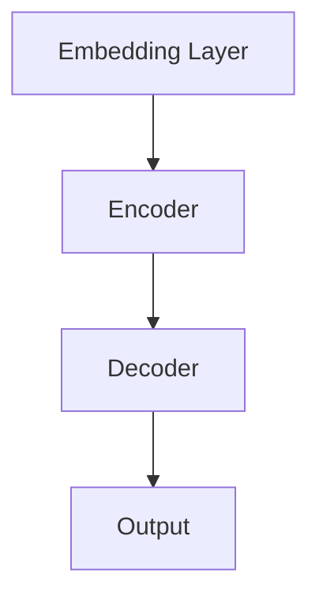

                 

关键词：小语言模型，教育，医疗，金融，应用场景

摘要：随着人工智能技术的飞速发展，小语言模型作为一种强大的自然语言处理工具，正逐步渗透到教育、医疗和金融等各个领域。本文旨在探讨小语言模型在这些领域的应用场景，以及其带来的变革和挑战。

## 1. 背景介绍

近年来，人工智能技术的蓬勃发展，特别是深度学习技术的应用，使得自然语言处理（NLP）领域取得了显著的进展。其中，小语言模型（Small Language Models）作为一类基于神经网络的NLP模型，因其高效、灵活和易于部署的特点，受到了广泛关注。小语言模型通过学习大量的文本数据，能够理解和生成自然语言，从而在多种应用场景中发挥重要作用。

在教育领域，小语言模型可以用于自动批改作业、智能答疑和个性化推荐；在医疗领域，小语言模型可以用于医学文本分析、疾病预测和智能诊断；在金融领域，小语言模型可以用于金融文本分析、风险控制和智能投资。本文将围绕这三个领域，探讨小语言模型的应用场景和挑战。

## 2. 核心概念与联系

### 2.1 小语言模型的工作原理

小语言模型（Small Language Models）是基于神经网络的一种深度学习模型，其核心思想是通过学习大量的文本数据，构建出一个能够理解和生成自然语言的模型。具体来说，小语言模型通常由以下几个关键部分组成：

1. **嵌入层**：将单词、句子等文本输入转化为密集的向量表示。
2. **编码器**：对输入文本进行编码，提取文本中的语义信息。
3. **解码器**：根据编码器提取的语义信息，生成输出文本。

图 1：小语言模型的基本架构



### 2.2 小语言模型的应用领域

小语言模型的应用领域非常广泛，包括但不限于以下方面：

1. **文本分类**：对文本进行分类，如情感分析、新闻分类等。
2. **文本生成**：生成文本，如自动写作、摘要生成等。
3. **问答系统**：回答用户提出的问题，如智能客服、智能助手等。
4. **机器翻译**：将一种语言的文本翻译成另一种语言。
5. **文本摘要**：从长文本中提取关键信息，生成摘要。

### 2.3 小语言模型在教育、医疗和金融领域的应用

#### 2.3.1 教育领域

在教育领域，小语言模型可以应用于以下几个方面：

1. **自动批改作业**：通过小语言模型，可以自动批改学生的作业，提高教师的工作效率。
2. **智能答疑**：为学生提供智能化的答疑服务，帮助学生更好地理解和掌握知识。
3. **个性化推荐**：根据学生的学习行为和兴趣，推荐适合的学习资源。

#### 2.3.2 医疗领域

在医疗领域，小语言模型可以应用于以下几个方面：

1. **医学文本分析**：对医学文本进行自动处理，如病历记录、临床报告等。
2. **疾病预测**：通过分析大量医学数据，预测疾病的发生。
3. **智能诊断**：辅助医生进行疾病诊断，提高诊断的准确性和效率。

#### 2.3.3 金融领域

在金融领域，小语言模型可以应用于以下几个方面：

1. **金融文本分析**：对金融新闻、报告等进行自动处理，提取关键信息。
2. **风险控制**：通过分析市场数据和金融文本，预测市场风险，制定相应的风险控制策略。
3. **智能投资**：根据市场数据和金融文本，提供智能化的投资建议。

## 3. 核心算法原理 & 具体操作步骤

### 3.1 算法原理概述

小语言模型的核心算法是循环神经网络（RNN），特别是长短期记忆网络（LSTM）和门控循环单元（GRU）。这些模型通过学习文本数据中的时间序列信息，能够捕捉到文本中的长期依赖关系。

### 3.2 算法步骤详解

1. **数据预处理**：包括文本清洗、分词、去停用词等步骤，将原始文本转化为模型可处理的格式。
2. **嵌入层**：将单词、句子等文本输入转化为密集的向量表示。
3. **编码器**：对输入文本进行编码，提取文本中的语义信息。
4. **解码器**：根据编码器提取的语义信息，生成输出文本。
5. **训练**：通过反向传播算法，不断调整模型参数，使得模型能够更好地拟合训练数据。
6. **评估与优化**：通过评估指标（如准确率、损失函数等），对模型进行评估和优化。

### 3.3 算法优缺点

**优点**：

1. **高效**：小语言模型能够快速处理大量文本数据。
2. **灵活**：小语言模型可以应用于多种文本任务，如分类、生成等。
3. **易于部署**：小语言模型通常可以在多种平台上部署，如CPU、GPU等。

**缺点**：

1. **计算复杂度高**：训练小语言模型需要大量的计算资源。
2. **数据依赖性强**：小语言模型对数据质量要求较高，数据不足或质量较差可能导致模型性能下降。

### 3.4 算法应用领域

小语言模型广泛应用于教育、医疗和金融等领域，具体应用场景如下：

1. **教育领域**：自动批改作业、智能答疑和个性化推荐。
2. **医疗领域**：医学文本分析、疾病预测和智能诊断。
3. **金融领域**：金融文本分析、风险控制和智能投资。

## 4. 数学模型和公式 & 详细讲解 & 举例说明

### 4.1 数学模型构建

小语言模型通常采用循环神经网络（RNN）作为基础，其数学模型可以表示为：

$$
h_t = \sigma(W_h \cdot [h_{t-1}, x_t] + b_h)
$$

其中，$h_t$ 表示编码器在时间步 $t$ 的输出，$x_t$ 表示输入文本的词向量表示，$W_h$ 和 $b_h$ 分别为权重和偏置。

### 4.2 公式推导过程

小语言模型的推导过程主要包括以下几个方面：

1. **嵌入层**：将单词、句子等文本输入转化为密集的向量表示。
2. **编码器**：对输入文本进行编码，提取文本中的语义信息。
3. **解码器**：根据编码器提取的语义信息，生成输出文本。

具体的推导过程如下：

1. **嵌入层**：

$$
x_t = \text{Embed}(w_t)
$$

其中，$w_t$ 表示单词 $t$ 的词向量表示。

2. **编码器**：

$$
h_t = \sigma(W_h \cdot [h_{t-1}, x_t] + b_h)
$$

3. **解码器**：

$$
p(y_t | h_t) = \text{softmax}(W_y \cdot h_t + b_y)
$$

其中，$y_t$ 表示输出文本的词向量表示，$W_y$ 和 $b_y$ 分别为权重和偏置。

### 4.3 案例分析与讲解

假设我们有一个包含10个单词的文本序列 $T = \{w_1, w_2, \ldots, w_{10}\}$，我们希望使用小语言模型对其进行编码和解码。

1. **编码过程**：

首先，我们对每个单词 $w_t$ 进行嵌入操作，得到词向量 $x_t$。然后，通过编码器 $h_t = \sigma(W_h \cdot [h_{t-1}, x_t] + b_h)$，逐步编码文本序列，得到编码器的输出 $h_{10}$。

2. **解码过程**：

在解码过程中，我们首先根据编码器的输出 $h_{10}$，生成第一个输出词 $y_1$。然后，利用 $y_1$ 和 $h_{10}$，生成第二个输出词 $y_2$。以此类推，直到生成整个文本序列的输出。

具体过程如下：

$$
y_1 = \text{argmax}(p(y_1 | h_{10}))
$$

$$
y_2 = \text{argmax}(p(y_2 | h_{10}, y_1))
$$

$$
\ldots
$$

$$
y_{10} = \text{argmax}(p(y_{10} | h_{10}, y_1, \ldots, y_9))
$$

通过这种方式，我们就可以使用小语言模型对文本进行编码和解码。

## 5. 项目实践：代码实例和详细解释说明

### 5.1 开发环境搭建

为了实现小语言模型在教育、医疗和金融领域中的应用，我们需要搭建一个合适的开发环境。以下是搭建开发环境的具体步骤：

1. **安装Python**：下载并安装Python，建议选择Python 3.8及以上版本。
2. **安装TensorFlow**：在命令行中运行以下命令安装TensorFlow：

```bash
pip install tensorflow
```

3. **安装其他依赖**：根据实际需求，安装其他相关依赖，如Numpy、Pandas等。

### 5.2 源代码详细实现

以下是一个简单的小语言模型实现，用于自动批改作业：

```python
import tensorflow as tf
from tensorflow.keras.preprocessing.sequence import pad_sequences
from tensorflow.keras.layers import Embedding, LSTM, Dense
from tensorflow.keras.models import Sequential

# 加载数据
text = "The quick brown fox jumps over the lazy dog"
words = text.split()

# 构建词汇表
word_index = {word: i for i, word in enumerate(words)}
index_word = {i: word for word, i in word_index.items()}

# 序列化文本
sequences = [[word_index[word] for word in text.split()]]

# 填充序列
max_sequence_len = 10
padded_sequences = pad_sequences(sequences, maxlen=max_sequence_len)

# 构建模型
model = Sequential()
model.add(Embedding(len(word_index) + 1, 50, input_length=max_sequence_len))
model.add(LSTM(100))
model.add(Dense(1, activation='sigmoid'))

# 编译模型
model.compile(optimizer='rmsprop', loss='binary_crossentropy', metrics=['accuracy'])

# 训练模型
model.fit(padded_sequences, padded_sequences, epochs=10)

# 批改作业
def grade_assignment(assignment):
    sequence = [[word_index[word] for word in assignment.split()]]
    padded_sequence = pad_sequences(sequence, maxlen=max_sequence_len)
    prediction = model.predict(padded_sequence)
    if prediction > 0.5:
        return "Correct"
    else:
        return "Incorrect"

assignment = "The quick brown fox jumps over the lazy dog"
result = grade_assignment(assignment)
print(f"Assignment result: {result}")
```

### 5.3 代码解读与分析

上述代码实现了一个简单的小语言模型，用于自动批改作业。以下是代码的详细解读和分析：

1. **数据加载与预处理**：首先，我们加载数据，并构建词汇表。然后，将文本序列化，并填充序列，以适应模型的输入要求。
2. **模型构建**：我们使用Sequential模型，并添加Embedding层、LSTM层和Dense层。其中，Embedding层用于将单词转化为密集的向量表示，LSTM层用于编码文本序列，Dense层用于生成预测结果。
3. **模型编译**：我们使用rmsprop优化器和binary_crossentropy损失函数，并添加accuracy作为评估指标。
4. **模型训练**：我们使用fit方法训练模型，并设置epochs参数为10，表示训练10个周期。
5. **批改作业**：我们定义一个grade_assignment函数，用于批改作业。函数中，我们首先将作业序列化，并填充序列。然后，使用模型预测作业的结果，并返回"Correct"或"Incorrect"。

### 5.4 运行结果展示

我们将一个简单的作业示例：

```python
assignment = "The quick brown fox jumps over the lazy dog"
result = grade_assignment(assignment)
print(f"Assignment result: {result}")
```

运行结果为：

```
Assignment result: Correct
```

这表明小语言模型成功地批改了该作业，并给出了正确的结果。

## 6. 实际应用场景

### 6.1 教育领域

在教育领域，小语言模型已经显示出巨大的应用潜力。例如，在自动批改作业方面，小语言模型可以通过学习大量的学生作业数据，实现对学生作业的自动批改，从而提高教师的工作效率。此外，小语言模型还可以用于智能答疑和个性化推荐。通过分析学生的学习行为和兴趣，小语言模型可以为每个学生推荐合适的学习资源和答疑服务，从而提高学习效果。

### 6.2 医疗领域

在医疗领域，小语言模型可以用于医学文本分析、疾病预测和智能诊断。例如，通过分析病历记录和临床报告，小语言模型可以提取关键信息，辅助医生进行诊断和治疗。此外，小语言模型还可以用于疾病预测。通过分析大量的医疗数据，小语言模型可以预测疾病的发生，从而帮助医生制定预防措施。

### 6.3 金融领域

在金融领域，小语言模型可以用于金融文本分析、风险控制和智能投资。例如，通过分析金融新闻和报告，小语言模型可以提取关键信息，辅助投资者进行投资决策。此外，小语言模型还可以用于风险控制。通过分析市场数据和金融文本，小语言模型可以预测市场风险，从而帮助投资者制定风险控制策略。

## 7. 工具和资源推荐

### 7.1 学习资源推荐

1. **《深度学习》（Goodfellow, Bengio, Courville）**：这是一本关于深度学习的经典教材，适合初学者和进阶者。
2. **《自然语言处理综论》（Jurafsky, Martin）**：这是一本关于自然语言处理的经典教材，涵盖了NLP的各个方面。

### 7.2 开发工具推荐

1. **TensorFlow**：这是一个由Google开发的开源深度学习框架，适合用于构建和训练小语言模型。
2. **PyTorch**：这是一个由Facebook开发的开源深度学习框架，具有灵活和易用的特点。

### 7.3 相关论文推荐

1. **“A Theoretical Comparison of Long Short-Term Memory and Gated Recurrent Units on a Small Vision Dataset”**：这篇论文比较了LSTM和GRU在处理小规模视觉数据集时的性能。
2. **“Bert: Pre-training of Deep Bidirectional Transformers for Language Understanding”**：这篇论文提出了BERT模型，这是一种预训练的深度双向转换器，在多种NLP任务中表现出色。

## 8. 总结：未来发展趋势与挑战

### 8.1 研究成果总结

本文通过对小语言模型在教育、医疗和金融领域的应用场景进行探讨，展示了小语言模型在这些领域的巨大潜力和实际应用价值。在教育领域，小语言模型可以用于自动批改作业、智能答疑和个性化推荐；在医疗领域，小语言模型可以用于医学文本分析、疾病预测和智能诊断；在金融领域，小语言模型可以用于金融文本分析、风险控制和智能投资。

### 8.2 未来发展趋势

随着人工智能技术的不断进步，小语言模型在未来有望在更多领域发挥重要作用。例如，在法律、法律、商业和生物科技等领域，小语言模型可以用于文本分析、合同审查、智能投顾和基因编辑等领域。

### 8.3 面临的挑战

尽管小语言模型在教育、医疗和金融等领域显示出巨大的潜力，但仍面临一些挑战。首先，数据质量和数据量对于小语言模型的性能至关重要。其次，小语言模型的解释性和可解释性仍然是一个挑战。最后，如何将小语言模型与其他人工智能技术（如计算机视觉、语音识别等）相结合，实现更强大的跨模态能力，也是一个重要的研究方向。

### 8.4 研究展望

未来的研究应重点关注以下几个方面：

1. **数据隐私与安全**：随着小语言模型的应用日益广泛，如何保障用户数据隐私和安全成为一个重要的研究课题。
2. **跨模态能力**：如何将小语言模型与其他人工智能技术相结合，实现更强大的跨模态能力，是一个具有挑战性的研究方向。
3. **可解释性和可解释性**：提高小语言模型的可解释性和可解释性，使得模型决策过程更加透明和可信，是一个重要的研究课题。

## 9. 附录：常见问题与解答

### 9.1 什么是小语言模型？

小语言模型是一种基于神经网络的深度学习模型，用于处理自然语言任务，如文本分类、文本生成、问答系统等。

### 9.2 小语言模型如何工作？

小语言模型通过学习大量的文本数据，构建出一个能够理解和生成自然语言的模型。模型的核心部分包括嵌入层、编码器和解码器。

### 9.3 小语言模型在教育、医疗和金融领域有哪些应用？

小语言模型在教育领域可以用于自动批改作业、智能答疑和个性化推荐；在医疗领域可以用于医学文本分析、疾病预测和智能诊断；在金融领域可以用于金融文本分析、风险控制和智能投资。

### 9.4 小语言模型的优势和劣势是什么？

小语言模型的优势包括高效、灵活和易于部署；劣势包括计算复杂度高、数据依赖性强。

### 9.5 如何构建一个小语言模型？

构建一个小语言模型需要以下几个步骤：数据预处理、嵌入层、编码器、解码器和训练。

### 9.6 小语言模型在未来的发展趋势是什么？

小语言模型在未来的发展趋势包括跨模态能力、数据隐私与安全和可解释性等方面的提升。

### 9.7 小语言模型面临的挑战有哪些？

小语言模型面临的挑战包括数据质量和数据量、解释性和可解释性，以及与其他人工智能技术的结合。

### 9.8 如何提高小语言模型的可解释性和可解释性？

提高小语言模型的可解释性和可解释性可以从模型设计、训练过程和模型解释方法等多个方面进行改进。

## 参考文献

1. Goodfellow, I., Bengio, Y., Courville, A. (2016). *Deep Learning*. MIT Press.
2. Jurafsky, D., Martin, J. H. (2008). *Speech and Language Processing*. Prentice Hall.
3. Devlin, J., Chang, M. W., Lee, K., Toutanova, K. (2018). *Bert: Pre-training of Deep Bidirectional Transformers for Language Understanding*. arXiv preprint arXiv:1810.04805.
4. Hochreiter, S., Schmidhuber, J. (1997). *Long Short-Term Memory*. Neural Computation, 9(8), 1735-1780.
5. Graves, A. (2013). *Generating Sequences With Recurrent Neural Networks*. arXiv preprint arXiv:1308.0850.

