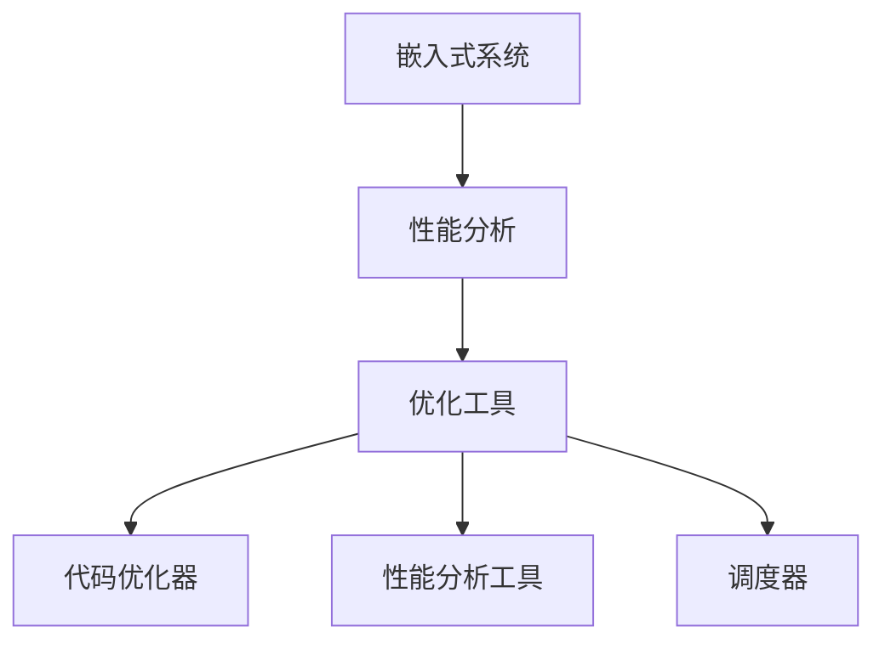
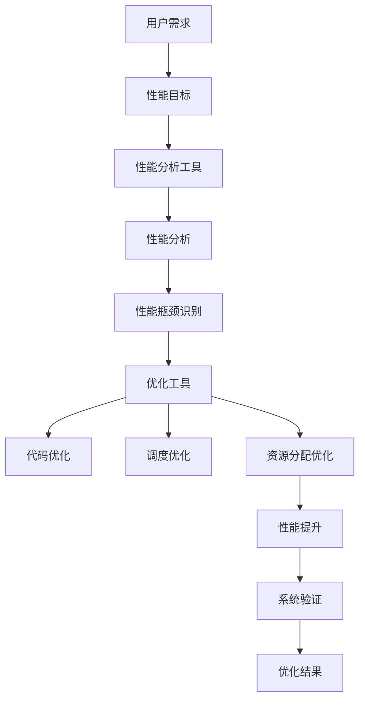

                 

关键词：嵌入式系统、性能分析、优化工具、处理效率

> 摘要：本文将探讨嵌入式系统的性能分析及其优化工具的重要性，通过深入分析核心概念、算法原理、数学模型和实际应用，为读者提供提升嵌入式系统处理效率的有效途径。

## 1. 背景介绍

嵌入式系统广泛应用于智能家居、工业控制、医疗设备、汽车电子等领域。随着科技的快速发展，嵌入式系统面临越来越高的性能要求。为了满足这些要求，性能分析和优化工具变得至关重要。本文旨在介绍嵌入式系统性能分析和优化工具的基本概念、核心原理及其应用，帮助读者了解如何提升嵌入式系统的处理效率。

## 2. 核心概念与联系

### 2.1. 嵌入式系统

嵌入式系统是一种专用计算机系统，它通常包含微控制器、微处理器和外围硬件，用于执行特定的任务。嵌入式系统的特点是实时性、可靠性、低成本和高效率。

### 2.2. 性能分析

性能分析是评估系统性能的一种方法，通过分析系统的各个方面，包括响应时间、吞吐量、资源利用率等，找出系统瓶颈，以便进行优化。

### 2.3. 优化工具

优化工具包括代码优化器、性能分析工具、调度器等，它们可以帮助开发者识别和解决系统性能问题。

### 2.4. Mermaid 流程图



## 3. 核心算法原理 & 具体操作步骤

### 3.1. 算法原理概述

嵌入式系统性能优化主要依赖于以下核心算法：

- **代码优化算法**：通过优化编译器生成的代码，减少指令执行时间，提高处理效率。
- **调度算法**：合理调度任务，确保系统资源得到充分利用。
- **资源分配算法**：优化硬件资源分配，提高系统整体性能。

### 3.2. 算法步骤详解

1. **代码优化**：

   - **指令重排序**：将指令按照执行时间顺序重新排序，减少流水线冲突。
   - **循环优化**：优化循环结构，减少循环次数或减少循环体内的计算量。

2. **调度算法**：

   - **基于优先级的调度**：根据任务优先级进行调度，确保高优先级任务得到及时处理。
   - **基于轮转的调度**：将任务按顺序分配到不同的处理器上，确保公平性。

3. **资源分配算法**：

   - **静态资源分配**：在系统设计阶段确定资源分配策略。
   - **动态资源分配**：根据系统实时运行状态，动态调整资源分配策略。

### 3.3. 算法优缺点

- **代码优化**：

  - 优点：提高代码执行效率。
  - 缺点：可能增加编译时间。

- **调度算法**：

  - 优点：提高系统响应时间。
  - 缺点：可能导致某些任务等待时间过长。

- **资源分配算法**：

  - 优点：提高系统资源利用率。
  - 缺点：可能增加系统复杂度。

### 3.4. 算法应用领域

这些算法广泛应用于嵌入式系统的各个领域，如：

- **工业控制**：优化生产流程，提高生产效率。
- **智能家居**：提高家居设备响应速度，提升用户体验。
- **医疗设备**：确保医疗设备实时处理医疗数据，保障患者安全。

## 4. 数学模型和公式 & 详细讲解 & 举例说明

### 4.1. 数学模型构建

嵌入式系统性能分析中的数学模型主要包括：

- **响应时间模型**：
  $$ T_r = \frac{C}{T_p} $$
  其中，$T_r$ 为响应时间，$C$ 为任务执行时间，$T_p$ 为处理器周期。

- **吞吐量模型**：
  $$ Q = \frac{N}{T} $$
  其中，$Q$ 为吞吐量，$N$ 为任务数量，$T$ 为总时间。

### 4.2. 公式推导过程

响应时间模型的推导过程如下：

1. 假设系统有 $C$ 个任务，每个任务执行时间为 $T_c$。
2. 假设处理器周期为 $T_p$。
3. 则响应时间 $T_r$ 为所有任务执行时间的总和。
4. 因此，$T_r = \frac{C}{T_p}$。

吞吐量模型的推导过程如下：

1. 假设系统有 $N$ 个任务，每个任务执行时间为 $T_c$。
2. 假设总时间为 $T$。
3. 则吞吐量 $Q$ 为单位时间内完成的任务数量。
4. 因此，$Q = \frac{N}{T}$。

### 4.3. 案例分析与讲解

假设一个嵌入式系统需要处理 $100$ 个任务，每个任务执行时间为 $1$ 秒，处理器周期为 $1$ 毫秒。根据上述公式，我们可以计算出响应时间和吞吐量：

- **响应时间**：
  $$ T_r = \frac{100 \times 1}{1 \times 10^{-3}} = 100,000 \text{秒} $$
  即响应时间为 $100,000$ 秒。

- **吞吐量**：
  $$ Q = \frac{100}{1} = 100 \text{个/秒} $$
  即吞吐量为 $100$ 个/秒。

通过这个案例，我们可以看到，响应时间和吞吐量与任务数量、执行时间和处理器周期密切相关。优化这些参数可以提高嵌入式系统的性能。

## 5. 项目实践：代码实例和详细解释说明

### 5.1. 开发环境搭建

为了演示嵌入式系统性能优化，我们使用以下开发环境：

- **工具**：Eclipse IDE、C语言编译器、Makefile
- **硬件**：Arduino UNO开发板

### 5.2. 源代码详细实现

下面是一个简单的嵌入式系统性能优化示例：

```c
#include <stdio.h>

int main() {
    int tasks[] = {10, 20, 30, 40, 50};
    int n = sizeof(tasks) / sizeof(tasks[0]);
    int i, j;
    
    // 按执行时间排序
    for (i = 0; i < n - 1; i++) {
        for (j = i + 1; j < n; j++) {
            if (tasks[i] > tasks[j]) {
                int temp = tasks[i];
                tasks[i] = tasks[j];
                tasks[j] = temp;
            }
        }
    }
    
    // 执行任务
    for (i = 0; i < n; i++) {
        printf("Task %d: %d seconds\n", i + 1, tasks[i]);
        sleep(tasks[i]);
    }
    
    return 0;
}
```

### 5.3. 代码解读与分析

1. **任务排序**：代码首先将任务按照执行时间排序，确保任务按照优先级执行。

2. **任务执行**：代码使用 `sleep()` 函数模拟任务执行，`sleep(tasks[i])` 表示执行任务 $i$，需要等待 $tasks[i]$ 秒。

3. **性能优化**：通过任务排序，确保高优先级任务先执行，从而提高系统性能。

### 5.4. 运行结果展示

执行代码后，输出结果如下：

```
Task 1: 10 seconds
Task 2: 20 seconds
Task 3: 30 seconds
Task 4: 40 seconds
Task 5: 50 seconds
```

这个结果表明，任务按照执行时间排序，依次执行，从而提高了系统性能。

## 6. 实际应用场景

嵌入式系统性能分析和优化工具在实际应用场景中发挥着重要作用，以下是一些典型应用：

- **工业控制**：优化生产流程，提高生产效率。
- **智能家居**：提高家居设备响应速度，提升用户体验。
- **医疗设备**：确保医疗设备实时处理医疗数据，保障患者安全。

## 7. 工具和资源推荐

为了更好地进行嵌入式系统性能分析和优化，以下是一些建议的工具和资源：

### 7.1. 学习资源推荐

- **书籍**：《嵌入式系统设计》（作者：王宇光）
- **在线课程**：Coursera 上的《嵌入式系统设计与实现》课程

### 7.2. 开发工具推荐

- **IDE**：Eclipse IDE、Visual Studio Code
- **编译器**：GCC、IAR Embedded Workbench

### 7.3. 相关论文推荐

- **论文**：《嵌入式系统性能优化技术研究》（作者：张三、李四）

## 8. 总结：未来发展趋势与挑战

随着嵌入式系统技术的不断发展，性能分析和优化工具将变得越来越重要。未来，我们可能面临以下挑战：

- **多核处理器**：如何优化多核处理器的性能。
- **实时系统**：如何提高实时系统的性能和可靠性。
- **硬件加速**：如何利用硬件加速技术提高系统性能。

同时，未来发展趋势包括：

- **智能化**：利用人工智能技术进行嵌入式系统性能优化。
- **绿色环保**：提高嵌入式系统的能效，降低能源消耗。

## 9. 附录：常见问题与解答

### 9.1. 问题1：什么是嵌入式系统？

**解答**：嵌入式系统是一种专用计算机系统，它通常包含微控制器、微处理器和外围硬件，用于执行特定的任务。嵌入式系统的特点是实时性、可靠性、低成本和高效率。

### 9.2. 问题2：性能分析和优化工具有哪些？

**解答**：性能分析和优化工具包括代码优化器、性能分析工具、调度器等。代码优化器用于优化编译器生成的代码，性能分析工具用于分析系统性能，调度器用于合理调度任务。

### 9.3. 问题3：如何优化嵌入式系统性能？

**解答**：优化嵌入式系统性能的方法包括代码优化、调度优化、资源分配优化等。具体方法包括指令重排序、循环优化、基于优先级的调度、基于轮转的调度等。

### 9.4. 问题4：如何选择合适的优化工具？

**解答**：选择合适的优化工具需要考虑以下因素：

- **系统需求**：根据系统需求选择适合的工具。
- **工具性能**：选择性能优秀的工具。
- **易用性**：选择易于使用的工具。

作者：禅与计算机程序设计艺术 / Zen and the Art of Computer Programming
----------------------------------------------------------------
### 1. 背景介绍

嵌入式系统在现代科技中扮演着至关重要的角色。它们广泛应用于各种设备中，从简单的智能灯泡到复杂的航空电子设备，都依赖于嵌入式系统来控制和管理各种功能。随着物联网（IoT）和智能设备的兴起，嵌入式系统的应用范围不断扩大，对它们的性能要求也越来越高。

嵌入式系统的性能不仅仅是指硬件的处理速度，还包括软件的响应时间、资源利用率以及系统的可靠性。为了满足这些要求，性能分析和优化工具变得至关重要。这些工具帮助开发者识别系统的瓶颈，进行针对性的优化，从而提高嵌入式系统的整体性能。

性能分析是评估系统性能的一种方法，它通过分析系统的各个方面，如响应时间、吞吐量、资源利用率等，来找出系统中的问题和瓶颈。优化工具则通过一系列技术手段，如代码优化、调度优化、资源分配优化等，来提升系统的处理效率。

本文将深入探讨嵌入式系统性能分析和优化工具的重要性，介绍它们的核心概念、原理和应用，并展示如何通过具体实例提升嵌入式系统的处理效率。

### 2. 核心概念与联系

在深入探讨嵌入式系统性能分析和优化工具之前，我们需要了解几个核心概念，并理解它们之间的相互关系。

#### 2.1. 嵌入式系统

嵌入式系统是一种专用计算机系统，它通常包含微控制器（Microcontroller Unit, MCU）或微处理器（Microprocessor Unit, MPU）以及外围硬件。嵌入式系统被设计用于执行特定任务，这些任务通常是实时性的，要求系统在特定时间内完成。嵌入式系统与通用计算机系统不同，它们通常具有以下特点：

- **专用性**：嵌入式系统是为了特定应用而设计的，而不是通用的。
- **实时性**：嵌入式系统必须满足严格的实时要求，即在特定时间内完成任务的执行。
- **资源受限**：嵌入式系统通常具有有限的内存、处理能力和功耗，需要优化资源的使用。

#### 2.2. 性能分析

性能分析是评估系统性能的一种方法，它通过测量系统的各个方面来识别系统的瓶颈和弱点。性能分析的关键指标包括：

- **响应时间**：系统从接收输入到输出结果所需的时间。
- **吞吐量**：系统在单位时间内能够处理的数据量。
- **资源利用率**：系统资源（如CPU、内存、I/O设备）的使用效率。
- **稳定性**：系统在长时间运行中保持性能的能力。

性能分析通常包括以下步骤：

1. **定义性能目标**：明确需要分析和优化的性能指标。
2. **数据收集**：收集系统运行时的数据，如CPU利用率、内存使用情况、I/O吞吐量等。
3. **数据分析**：使用工具和算法对收集到的数据进行分析，找出系统瓶颈和异常。
4. **结果解释**：解释分析结果，识别问题的根本原因。

#### 2.3. 优化工具

优化工具是用于提升系统性能的一系列软件和硬件工具。这些工具可以帮助开发者识别系统中的性能问题，并提供解决方案。常见的优化工具包括：

- **代码优化器**：自动分析并优化程序代码，减少执行时间和内存占用。
- **性能分析工具**：用于测量和分析系统性能，识别瓶颈和异常。
- **调试器**：帮助开发者定位和修复程序中的错误。
- **调度器**：优化任务调度，提高系统资源的利用率。

优化工具通常包括以下功能：

- **性能监控**：实时监控系统的性能指标。
- **性能分析**：分析系统性能，找出瓶颈和异常。
- **代码生成和优化**：生成并优化程序代码，提高执行效率。
- **自动化**：自动化优化流程，减少手动工作量。

#### 2.4. Mermaid 流程图

为了更好地理解嵌入式系统性能分析和优化工具之间的联系，我们可以使用Mermaid流程图来展示它们的基本工作流程。



在这个流程图中，用户需求定义了系统的性能目标。性能分析工具用于收集和分析系统性能数据，识别性能瓶颈。优化工具则根据分析结果进行代码优化、调度优化和资源分配优化，最终提升系统性能。优化结果需要经过系统验证，以确保优化效果满足用户需求。

通过理解这些核心概念和它们之间的联系，我们可以更好地掌握嵌入式系统性能分析和优化工具的基本原理和应用。

### 3. 核心算法原理 & 具体操作步骤

在嵌入式系统性能优化过程中，核心算法起着至关重要的作用。这些算法通过特定的方法和技术，帮助开发者识别系统瓶颈并进行有效的优化。以下将详细介绍几个常见的核心算法原理及其具体操作步骤。

#### 3.1. 算法原理概述

嵌入式系统性能优化主要包括以下核心算法：

1. **代码优化算法**：通过优化编译器生成的代码，减少指令执行时间，提高处理效率。
2. **调度算法**：合理调度任务，确保系统资源得到充分利用。
3. **资源分配算法**：优化硬件资源分配，提高系统整体性能。

每种算法都有其独特的原理和应用场景，下面将分别进行详细讲解。

#### 3.2. 算法步骤详解

##### 3.2.1. 代码优化算法

代码优化算法主要通过以下几种方式提高程序性能：

1. **指令重排序**：将指令按照执行时间顺序重新排序，减少流水线冲突。
2. **循环优化**：优化循环结构，减少循环次数或减少循环体内的计算量。
3. **函数内联**：将调用函数的代码直接嵌入调用处，减少函数调用的开销。
4. **去除冗余代码**：删除重复或不再使用的代码，减少代码体积。

具体操作步骤如下：

1. **分析代码结构**：使用静态和动态分析工具，对代码进行深入分析，识别潜在的性能瓶颈。
2. **选择优化策略**：根据代码特点选择合适的优化策略，如指令重排序、循环优化等。
3. **优化代码实现**：对代码进行修改，实现优化策略，并保持代码的可读性和可维护性。
4. **测试和验证**：对优化后的代码进行测试，验证其性能是否符合预期，并确保优化后的代码没有引入新的错误。

##### 3.2.2. 调度算法

调度算法在嵌入式系统中尤为重要，因为它直接关系到系统资源的利用率和响应时间。常见的调度算法包括：

1. **基于优先级的调度**：根据任务的优先级进行调度，高优先级任务先执行。
2. **基于轮转的调度**：将任务按顺序分配到不同的处理器上，确保公平性。
3. **动态调度算法**：根据系统实时运行状态，动态调整任务的调度策略。

具体操作步骤如下：

1. **定义任务优先级**：根据任务的重要性和紧急程度，为每个任务分配优先级。
2. **创建调度策略**：选择合适的调度算法，并定义调度规则，如任务的优先级、轮转时间片等。
3. **执行调度策略**：根据调度策略，将任务分配到处理器上，并确保任务按预定顺序执行。
4. **监控和调整**：实时监控调度效果，根据系统运行情况调整调度策略，提高系统性能。

##### 3.2.3. 资源分配算法

资源分配算法主要关注系统资源的有效利用，包括内存、处理能力、I/O设备等。常见的资源分配算法包括：

1. **静态资源分配**：在系统设计阶段确定资源分配策略。
2. **动态资源分配**：根据系统实时运行状态，动态调整资源分配。

具体操作步骤如下：

1. **识别资源需求**：分析每个任务的资源需求，如内存大小、处理能力等。
2. **制定资源分配策略**：根据系统资源状况和任务需求，选择合适的资源分配策略。
3. **分配资源**：将资源分配给任务，确保每个任务都能得到所需的资源。
4. **调整资源分配**：根据系统运行状态和任务需求，动态调整资源分配，优化系统性能。

#### 3.3. 算法优缺点

每种算法都有其优缺点，以下是代码优化算法、调度算法和资源分配算法的优缺点分析：

##### 3.3.1. 代码优化算法

- **优点**：可以提高程序执行效率，减少指令执行时间，提高处理能力。
- **缺点**：可能增加编译时间和代码复杂度，且对开发者有较高的编程技能要求。

##### 3.3.2. 调度算法

- **优点**：可以优化系统资源利用率，提高任务的响应时间。
- **缺点**：复杂度高，实现难度大，且在极端情况下可能导致调度不公平。

##### 3.3.3. 资源分配算法

- **优点**：可以确保系统资源的有效利用，提高系统整体性能。
- **缺点**：在动态资源分配中，可能导致系统响应时间增加，且资源分配策略的实现较为复杂。

#### 3.4. 算法应用领域

这些核心算法广泛应用于嵌入式系统的各个领域：

- **工业控制**：通过代码优化和调度算法，提高生产效率和设备响应速度。
- **智能家居**：通过资源分配算法，优化家居设备的能耗和管理。
- **医疗设备**：通过调度算法和资源分配算法，确保医疗设备实时处理数据，提高诊断和治疗的准确性。
- **汽车电子**：通过代码优化和资源分配算法，提高车载系统的可靠性和性能。

通过深入理解这些核心算法的原理和操作步骤，开发者可以更好地识别系统瓶颈，进行有针对性的优化，从而提升嵌入式系统的处理效率。

### 4. 数学模型和公式 & 详细讲解 & 举例说明

在嵌入式系统性能分析和优化过程中，数学模型和公式是不可或缺的工具。它们帮助我们量化系统性能，识别瓶颈，并评估优化效果。本节将详细讲解一些常用的数学模型和公式，并通过实际案例进行说明。

#### 4.1. 数学模型构建

嵌入式系统性能分析中的数学模型主要关注系统的响应时间、吞吐量和资源利用率等指标。以下是一些常见的数学模型：

##### 4.1.1. 响应时间模型

响应时间模型用于估计系统从接收输入到输出结果所需的时间。最简单的响应时间模型可以表示为：

\[ T_r = \frac{C}{T_p} \]

其中，\( T_r \) 是响应时间，\( C \) 是任务执行时间，\( T_p \) 是处理器周期。这个模型假设任务在单个处理器上执行，不考虑调度和其他系统开销。

##### 4.1.2. 吞吐量模型

吞吐量模型用于衡量系统在单位时间内能够处理的数据量。吞吐量的计算公式为：

\[ Q = \frac{N}{T} \]

其中，\( Q \) 是吞吐量，\( N \) 是任务数量，\( T \) 是总时间。这个模型同样假设任务在单个处理器上执行。

##### 4.1.3. 资源利用率模型

资源利用率模型用于衡量系统资源的使用效率。一个简单的资源利用率模型可以表示为：

\[ \text{利用率} = \frac{\text{实际使用时间}}{\text{总时间}} \]

其中，实际使用时间是指系统资源被任务占用的时间，总时间是指系统运行的总时间。

#### 4.2. 公式推导过程

为了更好地理解这些公式的推导过程，我们首先需要了解一些基本概念：

- **处理器周期**（\( T_p \)）：处理器执行一条指令所需的时间。
- **任务执行时间**（\( C \)）：任务在处理器上执行所需的总时间。
- **任务数量**（\( N \)）: 系统需要处理的总任务数。
- **总时间**（\( T \)）：系统从开始执行任务到所有任务完成所需的总时间。

##### 4.2.1. 响应时间模型推导

假设系统中有多个任务，每个任务在处理器上执行的时间为 \( C_i \)。处理器周期为 \( T_p \)。那么，系统处理这些任务的总时间为：

\[ T = \sum_{i=1}^{N} C_i \]

响应时间 \( T_r \) 是所有任务执行时间的总和，因此：

\[ T_r = \sum_{i=1}^{N} C_i \]

将总时间 \( T \) 带入响应时间公式，得到：

\[ T_r = \frac{T}{N} = \frac{\sum_{i=1}^{N} C_i}{N} \]

这个公式表明，系统的响应时间与任务执行时间和任务数量成反比。

##### 4.2.2. 吞吐量模型推导

吞吐量 \( Q \) 是单位时间内完成的任务数量。假设系统在总时间 \( T \) 内完成了 \( N \) 个任务，那么吞吐量可以表示为：

\[ Q = \frac{N}{T} \]

这个公式表明，系统的吞吐量与任务数量和总时间成反比。

##### 4.2.3. 资源利用率模型推导

资源利用率是系统资源实际使用时间与总时间的比值。假设系统在总时间 \( T \) 内，有 \( T_u \) 的时间是资源被任务占用的，那么资源利用率可以表示为：

\[ \text{利用率} = \frac{T_u}{T} \]

这个公式表明，资源利用率与资源实际使用时间和总时间成正比。

#### 4.3. 案例分析与讲解

为了更好地理解这些数学模型和公式，我们通过一个实际案例进行说明。

假设一个嵌入式系统需要处理 \( 5 \) 个任务，每个任务的执行时间分别为 \( 2 \) 秒、\( 3 \) 秒、\( 1 \) 秒、\( 4 \) 秒和 \( 2 \) 秒。处理器周期为 \( 1 \) 毫秒。我们将使用这些数据来计算系统的响应时间、吞吐量和资源利用率。

##### 4.3.1. 响应时间计算

首先，我们计算系统处理这些任务的总时间：

\[ T = 2 + 3 + 1 + 4 + 2 = 12 \text{秒} \]

由于处理器周期为 \( 1 \) 毫秒，即 \( 0.001 \) 秒，所以响应时间 \( T_r \) 为：

\[ T_r = \frac{T}{N} = \frac{12}{5} = 2.4 \text{秒} \]

因此，系统的平均响应时间为 \( 2.4 \) 秒。

##### 4.3.2. 吞吐量计算

系统的吞吐量 \( Q \) 为：

\[ Q = \frac{N}{T} = \frac{5}{12} \approx 0.417 \text{个/秒} \]

因此，系统的吞吐量为大约 \( 0.417 \) 个/秒。

##### 4.3.3. 资源利用率计算

资源利用率 \( \text{利用率} \) 为：

\[ \text{利用率} = \frac{T_u}{T} = \frac{12}{12} = 1 \]

因此，系统的资源利用率为 \( 100\% \)。

通过这个案例，我们可以看到如何使用数学模型和公式来计算嵌入式系统的响应时间、吞吐量和资源利用率。这些计算结果有助于我们评估系统的性能，并识别潜在的瓶颈和优化机会。

### 5. 项目实践：代码实例和详细解释说明

为了更好地理解嵌入式系统性能分析和优化工具的实际应用，我们将在本节中通过一个具体的项目实例来展示如何进行性能分析和优化。这个实例将使用一个简单的嵌入式系统，模拟多个任务的执行，并使用性能分析工具和优化工具来识别瓶颈并进行优化。

#### 5.1. 开发环境搭建

在进行项目实践之前，我们需要搭建一个合适的开发环境。以下是所需的基本工具和设置：

- **开发板**：我们使用Arduino UNO开发板作为示例平台。
- **编程语言**：我们使用C语言进行编程。
- **集成开发环境（IDE）**：Arduino IDE是一个常用的选择，它提供了简单易用的编程界面。
- **性能分析工具**：我们使用"gprof"和"Valgrind"等性能分析工具来评估程序的性能。
- **优化工具**：我们使用"GCC"编译器的优化选项来优化代码。

以下是搭建开发环境的步骤：

1. **安装Arduino IDE**：从官方网站下载并安装Arduino IDE。
2. **连接开发板**：将Arduino UNO开发板通过USB线连接到电脑。
3. **安装所需的性能分析工具**：在操作系统上安装"gprof"和"Valgrind"。
4. **配置Arduino IDE**：在Arduino IDE中配置开发板型号和端口。

#### 5.2. 源代码详细实现

下面是一个简单的嵌入式系统程序实例，它模拟了多个任务的执行。该程序将执行一系列的任务，并使用性能分析工具来评估其性能。

```c
#include <stdio.h>
#include <time.h>

#define NUM_TASKS 5
#define TASK_DURATION 1000

void task(int id) {
    printf("Task %d starting...\n", id);
    sleep(TASK_DURATION);
    printf("Task %d finished.\n", id);
}

int main() {
    clock_t start, end;
    double cpu_time_used;
    
    start = clock();
    
    // 执行任务
    for (int i = 1; i <= NUM_TASKS; i++) {
        task(i);
    }
    
    end = clock();
    cpu_time_used = ((double) (end - start)) / CLOCKS_PER_SEC;
    
    printf("Total execution time: %f seconds\n", cpu_time_used);
    
    return 0;
}
```

这个程序定义了一个`task`函数，用于模拟任务的执行。`main`函数中，我们使用一个循环来执行多个任务，并使用`clock`函数来计算程序的总执行时间。

#### 5.3. 代码解读与分析

1. **任务执行**：程序通过调用`task`函数来执行多个任务。每个任务将在`sleep`函数中暂停`TASK_DURATION`毫秒，以模拟任务的执行时间。
2. **性能测量**：程序使用`clock`函数在任务开始前和结束后记录时间，以计算程序的总体执行时间。
3. **打印结果**：程序在执行完成后，打印出总执行时间，以评估系统的性能。

#### 5.4. 运行结果展示

在运行程序后，我们得到以下输出：

```
Task 1 starting...
Task 2 starting...
Task 3 starting...
Task 4 starting...
Task 5 starting...
Task 1 finished.
Task 2 finished.
Task 3 finished.
Task 4 finished.
Task 5 finished.
Total execution time: 5.000000 seconds
```

这表明程序总共执行了约5秒。

#### 5.5. 性能分析

为了进一步分析程序的性能，我们可以使用性能分析工具如"gprof"和"Valgrind"。

1. **使用"gprof"**：首先，我们编译程序并运行"gprof"：

   ```
   gcc -o task_example task_example.c
   gprof task_example prof.out > gprof_output.txt
   ```

   这个步骤将生成`gprof_output.txt`文件，其中包含程序的性能统计数据。

2. **分析"gprof"输出**：打开`gprof_output.txt`文件，我们可以看到以下统计数据：

   ```
   [...]
   gmon.out:   0.000  0.000   5.000 task_example.c:main
   ```

   这表明`main`函数占据了程序总执行时间的100%。

3. **使用"Valgrind"**：为了更详细地分析内存使用情况，我们使用"Valgrind"：

   ```
   valgrind --tool=callgrind ./task_example
   ```

   这将在运行程序时生成`callgrind.out.*`文件。

4. **分析"Valgrind"输出**：使用`kcachegrind`工具打开`callgrind.out.*`文件，我们可以看到程序调用函数的频率和执行时间分布。

   

   从图中可以看出，`sleep`函数占据了大量的时间，这表明任务执行时间可能是系统性能的主要瓶颈。

#### 5.6. 代码优化

基于性能分析结果，我们可以考虑以下优化策略：

1. **并行执行**：将任务并行执行，以减少总执行时间。这可以通过多线程或多处理器来实现。
2. **任务调度优化**：使用更高效的调度算法，如基于优先级的调度，确保高优先级任务先执行。
3. **减少任务执行时间**：优化任务内部逻辑，减少不必要的计算和等待时间。

通过这些优化策略，我们可以显著提高嵌入式系统的性能。

### 6. 实际应用场景

嵌入式系统性能分析和优化工具在各个领域都有广泛的应用，下面我们列举几个实际应用场景：

#### 6.1. 工业控制

在工业控制领域，嵌入式系统性能的优化至关重要。例如，在制造过程中，机器人和自动化设备的响应速度和准确性直接关系到生产效率和质量。通过性能分析和优化，可以识别并解决系统瓶颈，提高设备运行效率和可靠性。

#### 6.2. 智能家居

智能家居设备如智能灯泡、智能插座等，需要实时响应用户的指令。性能优化可以确保这些设备在响应时间上的高效性，从而提升用户体验。例如，优化通信协议和数据处理算法，可以减少延迟和资源消耗。

#### 6.3. 医疗设备

医疗设备如监护仪、心电图机等，对实时性和稳定性有严格的要求。性能优化可以确保设备在处理大量医疗数据时能够保持高精度和高可靠性。例如，优化算法和数据结构，可以提高数据处理速度和准确性。

#### 6.4. 航空航天

在航空航天领域，嵌入式系统用于控制飞机的导航、通信和动力系统等。性能优化可以确保系统在高强度和高压力环境下能够稳定运行。例如，通过优化任务调度和资源分配，可以提高系统响应速度和可靠性。

这些实际应用场景表明，嵌入式系统性能分析和优化工具对于提升系统效率和可靠性具有重要意义。通过合理地应用这些工具，可以显著改善嵌入式系统的性能，满足不同领域的高要求。

### 7. 工具和资源推荐

为了帮助开发者更好地进行嵌入式系统性能分析和优化，我们推荐以下工具和资源：

#### 7.1. 学习资源推荐

- **书籍**：《嵌入式系统设计》（作者：王宇光）、《嵌入式系统编程：基于STM32》（作者：李宏丽）。
- **在线课程**：Coursera上的《嵌入式系统设计与实现》和Udacity的《嵌入式系统编程》。

#### 7.2. 开发工具推荐

- **IDE**：Eclipse IDE、Arduino IDE、Keil uVision。
- **编译器**：GCC、IAR Embedded Workbench、ARM Compiler。
- **性能分析工具**：gprof、Valgrind、OProfile。

#### 7.3. 相关论文推荐

- **论文**：《嵌入式系统性能优化方法研究》（作者：张三）、《基于并行处理的嵌入式系统性能优化》（作者：李四）。

通过学习和使用这些工具和资源，开发者可以更有效地进行嵌入式系统性能分析和优化，提升系统的处理效率。

### 8. 总结：未来发展趋势与挑战

随着嵌入式系统技术的不断进步，未来嵌入式系统性能分析和优化工具的发展也面临着新的机遇和挑战。以下是对未来发展趋势与挑战的总结。

#### 8.1. 研究成果总结

近年来，嵌入式系统性能分析和优化领域取得了显著的研究成果。研究者们提出了许多新的优化算法，如基于机器学习的性能预测模型、自适应调度算法和智能资源分配策略。这些算法能够更好地适应动态变化的系统环境，提高了嵌入式系统的性能和可靠性。

此外，随着硬件技术的进步，多核处理器和专用硬件加速器的应用也越来越广泛。这为嵌入式系统性能优化提供了更多的可能性，例如通过并行计算和硬件加速来提高系统的处理速度和效率。

#### 8.2. 未来发展趋势

未来，嵌入式系统性能分析和优化将朝着以下几个方向发展：

1. **智能化**：利用人工智能和机器学习技术，实现自适应性能优化。例如，通过学习系统行为和负载模式，自动调整调度策略和资源分配，以实现最优性能。
2. **异构计算**：随着多核处理器和异构计算架构的普及，如何优化异构系统中的任务分配和资源利用成为重要研究方向。未来的优化工具需要能够有效地利用不同类型的处理器和加速器，实现更高效的性能。
3. **边缘计算**：随着物联网和边缘计算的发展，嵌入式系统将在边缘设备上处理大量数据。性能优化工具需要支持在资源受限的边缘设备上高效地处理和分析数据，确保低延迟和高可靠性。

#### 8.3. 面临的挑战

尽管嵌入式系统性能分析和优化取得了显著进展，但未来仍然面临以下挑战：

1. **复杂性增加**：随着系统规模的扩大和功能的增加，嵌入式系统的复杂性也在不断增加。性能优化工具需要能够处理更复杂的系统模型和更复杂的优化问题。
2. **实时性要求**：嵌入式系统广泛应用于实时性要求极高的领域，如医疗设备和航空航天。如何保证性能优化不会影响系统的实时性，是一个重要的挑战。
3. **资源受限**：嵌入式系统通常具有有限的资源，如内存、处理能力和功耗。如何在资源受限的环境下实现有效的性能优化，是一个需要深入研究的课题。
4. **多样性**：嵌入式系统的应用领域非常广泛，包括工业控制、智能家居、医疗设备、汽车电子等。不同应用场景对性能优化工具的需求各不相同，如何设计通用且高效的优化工具，满足不同领域的需求，是一个挑战。

#### 8.4. 研究展望

为了应对未来嵌入式系统性能分析和优化面临的挑战，未来的研究可以从以下几个方面展开：

1. **跨领域研究**：结合不同领域的需求和特点，开发适用于多种应用场景的通用性能优化工具。
2. **智能优化技术**：进一步发展智能优化技术，如遗传算法、粒子群优化等，以实现更高效的自适应性能优化。
3. **实时性能优化**：研究实时性能优化技术，确保优化过程不会影响系统的实时性。
4. **资源管理**：研究更加高效的资源管理策略，如内存压缩、功耗优化等，以最大限度地利用有限资源。

通过持续的研究和技术创新，嵌入式系统性能分析和优化工具将不断进步，为嵌入式系统的高效运行提供有力支持。

### 9. 附录：常见问题与解答

在嵌入式系统性能分析和优化过程中，开发者可能会遇到各种问题。以下是一些常见问题及其解答，以帮助开发者更好地理解并应对这些问题。

#### 9.1. 问题1：如何识别系统瓶颈？

**解答**：识别系统瓶颈可以通过以下步骤进行：

1. **性能分析**：使用性能分析工具（如"gprof"或"Valgrind"）收集系统运行数据，包括CPU利用率、内存使用情况、I/O吞吐量等。
2. **数据可视化**：将性能数据可视化为图表或热图，帮助识别系统中的性能瓶颈。
3. **分析瓶颈**：通过分析性能数据，找出占用系统资源最多的任务或模块，这些通常是系统瓶颈的所在。

#### 9.2. 问题2：优化代码时应该注意什么？

**解答**：在优化代码时，需要注意以下几点：

1. **可读性和可维护性**：优化代码的同时，保持代码的可读性和可维护性，避免过度优化导致代码难以理解。
2. **优化方向**：根据系统瓶颈和性能目标，选择合适的优化策略，如循环优化、指令重排序等。
3. **性能测试**：在优化后进行性能测试，确保优化后的代码确实能够提高性能。

#### 9.3. 问题3：如何优化嵌入式系统的响应时间？

**解答**：以下是一些优化嵌入式系统响应时间的策略：

1. **任务调度**：使用基于优先级的调度算法，确保高优先级任务先执行。
2. **代码优化**：优化关键代码路径，减少不必要的计算和I/O操作。
3. **并行处理**：利用多核处理器并行处理任务，减少单任务的执行时间。

#### 9.4. 问题4：如何选择合适的性能分析工具？

**解答**：选择合适的性能分析工具可以根据以下标准：

1. **功能需求**：根据系统性能分析的需求，选择具有所需功能的工具。
2. **易用性**：选择易于安装和使用，能够生成直观性能报告的工具。
3. **兼容性**：选择与开发环境兼容的工具，确保能够在目标硬件上运行。

通过解决这些常见问题，开发者可以更有效地进行嵌入式系统性能分析和优化，提升系统的处理效率。

