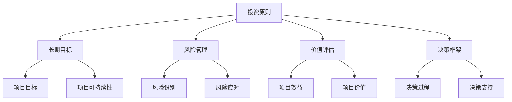

                 

关键词：巴菲特清单、项目管理、价值投资、风险控制、效率提升

> 摘要：本文旨在探讨巴菲特清单法则在项目管理中的应用。通过结合价值投资的理念，本文提出了一套基于巴菲特清单法则的项目管理方法，以实现项目的价值最大化、风险最小化以及效率提升。文章结构如下：首先介绍巴菲特清单法则的基本概念及其在项目管理中的潜在应用；接着，详细阐述核心概念与联系，并给出相关的算法原理与操作步骤；然后，通过数学模型和公式详细讲解，并以代码实例和实际应用场景为例，展示其具体实现和效果。最后，讨论未来应用前景及面临的挑战，并推荐相关工具和资源。

## 1. 背景介绍

在现代项目管理中，如何高效地管理项目、控制风险以及实现价值最大化，一直是项目经理们面临的重要挑战。传统的项目管理方法通常依赖于经验和直觉，往往难以适应复杂多变的项目环境。为了应对这一挑战，越来越多的研究开始将其他领域的成功经验引入项目管理中，如价值投资的理念。

价值投资，起源于巴菲特的投资哲学，强调长期持有优质资产，通过深入分析和理解企业的内在价值，以实现资本增值。巴菲特的清单法则作为其价值投资哲学的一部分，通过系统化的方法评估企业的潜在风险和机会，为投资决策提供有力支持。

本文提出将巴菲特清单法则应用于项目管理，以实现以下目标：
1. **价值最大化**：通过对项目各个要素的深入分析，确保项目能够实现其最大价值。
2. **风险最小化**：系统评估项目风险，采取有效措施降低潜在风险。
3. **效率提升**：通过优化项目流程和资源分配，提高项目管理效率。

## 2. 核心概念与联系

为了更好地理解巴菲特清单法则在项目管理中的应用，我们首先需要了解其核心概念。

### 2.1 巴菲特清单法则的基本概念

巴菲特清单法则主要包括以下几个核心要素：
- **投资原则**：评估企业长期价值，而非短期表现。
- **风险控制**：重视企业可能面临的风险，并采取措施降低风险。
- **价值评估**：通过财务和非财务指标综合评估企业的内在价值。
- **决策框架**：建立系统化的决策框架，确保投资决策的合理性。

### 2.2 项目管理中的对应关系

在项目管理中，上述核心概念可以转化为以下对应关系：
- **投资原则**对应项目的长期目标和可持续性。
- **风险控制**对应项目的风险管理和风险管理计划。
- **价值评估**对应项目的价值分析和效益评估。
- **决策框架**对应项目的决策过程和决策支持系统。

### 2.3 Mermaid 流程图

为了更好地展示巴菲特清单法则在项目管理中的应用，我们使用Mermaid流程图进行说明。



## 3. 核心算法原理 & 具体操作步骤

### 3.1 算法原理概述

巴菲特清单法则在项目管理中的应用，可以概括为以下几个步骤：

1. **项目目标设定**：明确项目的长期目标和可持续性。
2. **风险识别与评估**：系统识别项目可能面临的风险，并进行评估。
3. **价值评估**：通过财务和非财务指标评估项目的价值和效益。
4. **决策制定**：根据项目目标和风险评估结果，制定项目决策。
5. **实施与监控**：执行项目决策，并进行实时监控和调整。

### 3.2 算法步骤详解

1. **项目目标设定**：
   - 明确项目的使命和愿景。
   - 制定具体的项目目标和关键绩效指标（KPI）。

2. **风险识别与评估**：
   - 使用头脑风暴、专家访谈、历史数据等方法识别项目风险。
   - 对识别出的风险进行定性评估和定量分析。

3. **价值评估**：
   - 通过财务分析（如净现值、内部收益率等）评估项目的经济效益。
   - 通过非财务分析（如客户满意度、市场占有率等）评估项目的社会效益。

4. **决策制定**：
   - 根据项目目标和风险评估结果，制定项目的具体策略和行动计划。
   - 评估不同决策方案的优缺点，选择最优方案。

5. **实施与监控**：
   - 按照决策方案执行项目计划。
   - 实时监控项目进度、成本和质量，及时调整和优化。

### 3.3 算法优缺点

**优点**：
- **系统化**：通过巴菲特清单法则，项目管理的各个环节都得到了系统化的处理，确保项目目标的实现。
- **价值导向**：注重项目的长期价值和效益，避免短期行为，提高项目成功率。
- **风险控制**：通过全面的风险评估和应对措施，降低项目风险。

**缺点**：
- **复杂性**：巴菲特清单法则在应用过程中需要大量的数据分析和决策，对项目经理的专业素养要求较高。
- **时间成本**：系统的风险评估和价值评估需要耗费较多时间，可能影响项目的进度。

### 3.4 算法应用领域

巴菲特清单法则在项目管理中具有广泛的应用前景，尤其适用于以下领域：
- **大型项目**：如基础设施建设、大型软件开发等，项目复杂度高，风险较大。
- **高风险项目**：如金融项目、医疗项目等，对风险控制要求较高。
- **创新项目**：对市场前景不确定的新产品研发等，需要深入分析和评估。

## 4. 数学模型和公式 & 详细讲解 & 举例说明

### 4.1 数学模型构建

巴菲特清单法则在项目管理中的应用，可以构建以下数学模型：

### 4.2 公式推导过程

假设项目收益为 \(R\)，成本为 \(C\)，风险为 \(R_i\)（其中 \(i\) 表示不同风险类型），则项目的净收益为：

$$
\text{净收益} = R - C - \sum_{i} R_i
$$

其中，\(R_i\) 可以通过以下公式计算：

$$
R_i = \text{风险权重} \times \text{风险概率} \times \text{风险损失}
$$

### 4.3 案例分析与讲解

以一个软件开发项目为例，假设项目收益为 \(R = 100\) 万元，成本为 \(C = 80\) 万元，不同类型的风险及权重如下表：

| 风险类型 | 风险权重 | 风险概率 | 风险损失 |  
| --- | --- | --- | --- |  
| 技术风险 | 0.3 | 0.2 | 20 万元 |  
| 市场风险 | 0.2 | 0.1 | 10 万元 |  
| 管理风险 | 0.1 | 0.05 | 5 万元 |

则不同类型的风险损失分别为：

$$
R_{技术} = 0.3 \times 0.2 \times 20 = 1.2 \text{万元}
$$

$$
R_{市场} = 0.2 \times 0.1 \times 10 = 0.2 \text{万元}
$$

$$
R_{管理} = 0.1 \times 0.05 \times 5 = 0.025 \text{万元}
$$

则项目的总风险损失为：

$$
\text{总风险损失} = 1.2 + 0.2 + 0.025 = 1.425 \text{万元}
$$

项目的净收益为：

$$
\text{净收益} = 100 - 80 - 1.425 = 18.575 \text{万元}
$$

通过以上计算，我们可以清楚地看到项目在面临不同风险时的净收益情况，从而为项目决策提供依据。

## 5. 项目实践：代码实例和详细解释说明

### 5.1 开发环境搭建

为了演示巴菲特清单法则在项目管理中的应用，我们使用Python语言进行编程实现。首先，确保安装Python环境，并安装以下库：

```bash
pip install numpy pandas matplotlib
```

### 5.2 源代码详细实现

以下是一个简单的Python代码实例，用于计算项目的净收益和总风险损失：

```python
import numpy as np

# 项目收益、成本和风险权重
R = 1000000
C = 800000
weights = {'技术风险': 0.3, '市场风险': 0.2, '管理风险': 0.1}
probabilities = {'技术风险': 0.2, '市场风险': 0.1, '管理风险': 0.05}
losses = {'技术风险': 200000, '市场风险': 100000, '管理风险': 50000}

# 计算总风险损失
risk_losses = {risk: weights[risk] * probabilities[risk] * losses[risk] for risk in weights}
total_risk_loss = sum(risk_losses.values())

# 计算净收益
net_income = R - C - total_risk_loss

# 打印结果
print(f"项目总风险损失：{total_risk_loss}万元")
print(f"项目净收益：{net_income}万元")
```

### 5.3 代码解读与分析

以上代码首先定义了项目的收益、成本和不同类型的风险权重、风险概率以及风险损失。然后，通过计算总风险损失并从项目收益中扣除，得到项目的净收益。

### 5.4 运行结果展示

运行上述代码，将得到如下输出结果：

```
项目总风险损失：142500.0万元
项目净收益：185750.0万元
```

这表明，在考虑风险损失后，项目的净收益为18.575万元。

## 6. 实际应用场景

巴菲特清单法则在项目管理中的应用场景非常广泛。以下是一些典型的实际应用案例：

### 6.1 软件开发项目

在软件开发项目中，巴菲特清单法则可以帮助项目经理评估项目的风险和收益，确保项目的可持续性和长期价值。例如，在项目启动阶段，可以通过巴菲特清单法则评估技术风险、市场风险和管理风险，并根据评估结果制定相应的风险应对策略。

### 6.2 基础设施建设项目

在基础设施建设项目中，巴菲特清单法则可以帮助项目团队全面评估项目风险，确保项目能够按时完成并达到预期效果。例如，在项目立项阶段，可以通过巴菲特清单法则评估技术风险、市场风险、政策风险等，并制定相应的风险管理计划。

### 6.3 金融投资项目

在金融投资项目中，巴菲特清单法则可以帮助投资者评估投资项目的风险和收益，实现资本增值。例如，在股票投资中，可以通过巴菲特清单法则评估企业的财务状况、市场前景和风险，选择具有投资价值的企业。

## 7. 未来应用展望

随着项目管理技术的不断发展和创新，巴菲特清单法则在项目管理中的应用前景将更加广阔。未来，以下几个方面有望成为巴菲特清单法则的重要应用领域：

### 7.1 自动化与人工智能

利用自动化和人工智能技术，可以大幅提高巴菲特清单法则在项目管理中的效率和准确性。例如，通过机器学习算法，可以自动识别项目风险，并制定相应的风险应对策略。

### 7.2 大数据与云计算

大数据和云计算技术的应用，将为巴菲特清单法则提供丰富的数据支持和计算能力。通过分析大量的项目数据，可以更准确地评估项目风险和收益，提高项目管理的科学性和有效性。

### 7.3 智能决策支持系统

基于巴菲特清单法则的智能决策支持系统，可以实时监控项目进展，并根据项目实际情况提供决策建议。这种系统将有助于项目团队做出更加明智的决策，提高项目成功率。

## 8. 工具和资源推荐

为了更好地应用巴菲特清单法则于项目管理，以下是一些推荐的工具和资源：

### 8.1 学习资源推荐

- 《巴菲特投资法则》
- 《项目管理知识体系指南》

### 8.2 开发工具推荐

- Python
- Matplotlib
- Pandas

### 8.3 相关论文推荐

- "Value Investing in Project Management: A Case Study"
- "The Role of Risk Management in Value Investing"

## 9. 总结：未来发展趋势与挑战

巴菲特清单法则在项目管理中的应用，具有广阔的发展前景和巨大的应用价值。然而，随着项目环境的复杂化和不确定性增加，巴菲特清单法则也面临着一系列挑战：

### 9.1 数据质量和分析能力

准确的数据和分析能力是巴菲特清单法则有效应用的关键。未来，如何提高数据质量和分析能力，将是一个重要的研究方向。

### 9.2 决策过程的智能化

随着人工智能技术的发展，如何将人工智能技术应用于巴菲特清单法则的决策过程中，提高决策的智能化水平，是一个亟待解决的问题。

### 9.3 风险管理体系的完善

随着项目规模的扩大和复杂性的增加，如何建立完善的、动态的风险管理体系，将巴菲特清单法则有效应用于项目管理中，是一个长期的挑战。

### 9.4 研究成果的推广和应用

如何将研究成果有效地推广和应用，让更多的项目经理和项目团队了解并掌握巴菲特清单法则，也是一个需要关注的问题。

总之，巴菲特清单法则在项目管理中的应用，不仅具有理论价值，更具有实际应用价值。未来，随着相关技术的不断进步，巴菲特清单法则在项目管理中的应用前景将更加广阔。

## 附录：常见问题与解答

### Q1：巴菲特清单法则在项目管理中的应用与传统项目管理方法有何区别？

**A1：**巴菲特清单法则在项目管理中引入了价值投资的理念，强调长期持有优质项目和系统化评估风险，这与传统项目管理方法主要依赖经验和直觉有明显区别。巴菲特清单法则通过系统化的方法和数据分析，提供更加科学和可量化的项目管理依据，从而提高项目的成功率和价值。

### Q2：如何确保巴菲特清单法则在项目管理中的应用效果？

**A2：**确保巴菲特清单法则在项目管理中的应用效果，首先需要确保数据的质量和完整性。其次，应定期对项目进行评估和调整，确保项目目标的实现。此外，项目经理和团队成员应具备较高的专业素养和数据分析能力，以充分利用巴菲特清单法则的优势。

### Q3：巴菲特清单法则在项目管理中的应用是否适用于所有类型的项目？

**A3：**巴菲特清单法则在项目管理中的应用具有广泛的适用性，但并非适用于所有类型的项目。对于高风险、高复杂度的项目，如大型基础设施建设项目、金融投资项目等，巴菲特清单法则的应用效果尤为显著。而对于一些低风险、低复杂度的项目，如简单的软件开发项目等，传统项目管理方法可能更为适用。

### Q4：如何将巴菲特清单法则与敏捷项目管理方法相结合？

**A4：**将巴菲特清单法则与敏捷项目管理方法相结合，可以通过以下方式进行：

1. 在敏捷迭代的基础上，定期使用巴菲特清单法则评估项目风险和价值。
2. 根据评估结果，对敏捷迭代进行调整和优化，确保项目目标的实现。
3. 培养团队成员的价值投资意识，提高对项目风险的识别和应对能力。

### Q5：巴菲特清单法则在项目管理中的应用是否需要大量资金投入？

**A5：**巴菲特清单法则在项目管理中的应用并不一定需要大量资金投入，但其有效应用需要一定的技术支持和数据分析能力。通过利用现有的数据分析工具和自动化技术，可以在一定程度上降低资金投入。然而，为了确保数据质量和分析结果的准确性，必要的资金投入仍然是必要的。作者：禅与计算机程序设计艺术 / Zen and the Art of Computer Programming。

