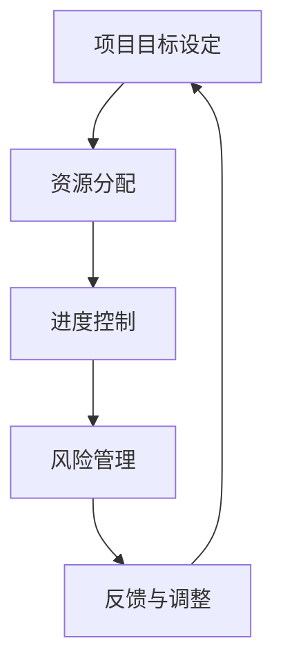

                 

### 1. 背景介绍

在信息技术飞速发展的今天，项目管理的重要性不言而喻。无论是软件开发、系统集成，还是大数据、人工智能等领域的项目，项目管理的核心目标都是确保项目能够按时、按质、按预算完成。然而，在项目的实际执行过程中，往往面临诸多不确定性，如技术难题、资源调配、风险控制等，这些都对项目管理提出了更高的要求。

在这样的背景下，引入巴菲特目标管理法则（The Buffett Method），为我们提供了一种独特的视角和工具。沃伦·巴菲特，这位全球著名的投资家，以其独特的投资哲学和管理理念，长期保持了优异的投资业绩。巴菲特目标管理法则，源自他的投资策略，强调集中精力、优化资源、持续跟踪目标，这些原则同样适用于项目管理。

本文将探讨巴菲特目标管理法则在项目管理中的应用，旨在为项目管理者提供一种新的思路和方法，以更好地应对复杂多变的项目环境。

### 2. 核心概念与联系

#### 2.1 巴菲特目标管理法则的概念

巴菲特目标管理法则，可以概括为以下几个核心原则：

1. **集中精力**：专注于最重要的目标，避免分散精力。
2. **优化资源**：充分利用现有资源，提高资源利用效率。
3. **持续跟踪**：定期检查目标完成情况，及时调整策略。
4. **耐心等待**：不急于求成，等待最佳的投资机会。

这些原则在项目管理中具有极高的适用性。项目管理者需要明确项目的核心目标，合理分配资源，持续跟踪项目的进展，并具备耐心和毅力，以应对项目中的各种不确定性。

#### 2.2 巴菲特目标管理法则与项目管理的关系

项目管理涉及到目标设定、资源分配、进度控制、风险管理等各个方面。巴菲特目标管理法则与这些项目管理要素之间存在密切的联系：

- **目标设定**：巴菲特目标管理法则强调集中精力，这有助于项目管理者明确项目的核心目标，避免目标过多导致资源分散。
- **资源分配**：优化资源原则要求项目管理者充分利用现有资源，这有助于提高项目的效率和质量。
- **进度控制**：持续跟踪目标原则要求项目管理者定期检查项目进度，及时调整计划，确保项目按时完成。
- **风险管理**：耐心等待原则提醒项目管理者不要急于求成，应等待最佳时机再采取行动，这有助于降低项目风险。

#### 2.3 Mermaid 流程图

以下是一个简化的Mermaid流程图，展示了巴菲特目标管理法则与项目管理核心要素之间的联系：



**图 1：巴菲特目标管理法则与项目管理核心要素的流程图**

### 3. 核心算法原理 & 具体操作步骤

#### 3.1 算法原理概述

巴菲特目标管理法则在项目管理中的应用，可以看作是一种基于目标导向的优化算法。其核心思想是通过明确项目目标、优化资源配置、持续跟踪项目进度和及时调整策略，实现项目的最优完成。

具体来说，该算法包括以下几个步骤：

1. **明确项目目标**：通过头脑风暴、专家咨询等方式，明确项目的核心目标。
2. **资源分配**：根据项目目标和现有资源，制定资源分配计划。
3. **进度控制**：定期检查项目进度，与计划进行对比，找出偏差原因。
4. **反馈与调整**：根据进度检查结果，及时调整项目计划，确保项目按时完成。

#### 3.2 算法步骤详解

##### 3.2.1 明确项目目标

明确项目目标是巴菲特目标管理法则的第一步。项目目标应具有以下特点：

- **明确性**：目标应具体、可量化，避免模糊不清。
- **挑战性**：目标应具有一定的挑战性，鼓励团队努力实现。
- **相关性**：目标应与项目整体目标保持一致，避免冲突。

具体操作步骤如下：

1. **头脑风暴**：召集项目团队成员，共同讨论项目目标。
2. **专家咨询**：邀请行业专家或顾问，对项目目标进行评估和指导。
3. **目标筛选**：根据明确性、挑战性和相关性原则，筛选出最优项目目标。

##### 3.2.2 资源分配

资源分配是项目管理的关键环节。优化资源分配，可以提高项目效率，降低项目成本。具体操作步骤如下：

1. **资源识别**：识别项目所需的各种资源，包括人力、设备、资金等。
2. **资源评估**：评估每种资源的可用性和优先级。
3. **资源分配**：根据项目目标和资源评估结果，制定资源分配计划。
4. **资源监控**：定期检查资源使用情况，及时调整资源分配计划。

##### 3.2.3 进度控制

进度控制是确保项目按时完成的重要手段。具体操作步骤如下：

1. **制定进度计划**：根据项目目标和资源分配计划，制定详细的进度计划。
2. **进度跟踪**：定期检查项目进度，与计划进行对比，找出偏差原因。
3. **进度调整**：根据进度跟踪结果，及时调整项目计划，确保项目按时完成。

##### 3.2.4 反馈与调整

反馈与调整是巴菲特目标管理法则的核心环节。具体操作步骤如下：

1. **收集反馈**：定期收集项目团队成员的反馈，了解项目执行过程中的问题和挑战。
2. **分析问题**：分析反馈信息，找出项目执行中的问题。
3. **调整策略**：根据问题分析结果，制定相应的调整策略，确保项目能够继续推进。
4. **持续优化**：通过不断反馈与调整，优化项目执行过程，提高项目成功率。

#### 3.3 算法优缺点

##### 优点

- **目标导向**：巴菲特目标管理法则以目标为导向，有助于项目管理者明确项目目标，提高项目执行力。
- **优化资源**：通过优化资源分配，提高资源利用效率，降低项目成本。
- **持续跟踪**：持续跟踪项目进度，及时调整策略，确保项目按时完成。
- **适应性**：面对项目执行过程中的不确定性，巴菲特目标管理法则具有较好的适应性。

##### 缺点

- **资源依赖**：该算法对资源要求较高，需要项目团队成员具备较高的专业素养和执行力。
- **反馈周期**：持续跟踪和反馈需要较长时间，可能影响项目进度。
- **复杂性**：算法应用过程中，涉及多个环节和步骤，可能增加项目管理的复杂性。

#### 3.4 算法应用领域

巴菲特目标管理法则在项目管理中具有广泛的应用领域，尤其适用于以下场景：

- **复杂项目**：涉及多个子项目、多个部门和跨领域合作的大型项目。
- **高风险项目**：项目执行过程中面临较高技术风险或市场风险。
- **时间敏感项目**：项目交付时间要求严格，需要高效执行。
- **创新项目**：项目具有较高创新性，需要灵活调整策略。

### 4. 数学模型和公式 & 详细讲解 & 举例说明

#### 4.1 数学模型构建

巴菲特目标管理法则在项目管理中的应用，可以通过以下数学模型进行描述：

$$
\text{项目成功率} = f(\text{项目目标明确度}, \text{资源利用率}, \text{进度控制精度}, \text{反馈调整速度})
$$

其中，项目成功率是目标明确度、资源利用率、进度控制精度和反馈调整速度的函数。下面将分别介绍这些参数的数学模型和计算方法。

#### 4.2 公式推导过程

为了推导上述数学模型，首先需要明确每个参数的含义和计算方法。

1. **项目目标明确度**

项目目标明确度可以用目标完成度来衡量。目标完成度是指项目实际完成情况与目标设定之间的差距。具体计算公式如下：

$$
\text{目标完成度} = \frac{\text{实际完成值}}{\text{目标设定值}}
$$

其中，实际完成值和目标设定值可以通过项目进度报告和目标设定文件获取。

2. **资源利用率**

资源利用率是指项目实际使用的资源与计划使用的资源之比。具体计算公式如下：

$$
\text{资源利用率} = \frac{\text{实际使用资源}}{\text{计划使用资源}}
$$

其中，实际使用资源可以通过资源使用记录获取，计划使用资源可以通过资源分配计划获取。

3. **进度控制精度**

进度控制精度是指项目实际进度与计划进度之间的差距。具体计算公式如下：

$$
\text{进度控制精度} = \frac{\text{实际进度}}{\text{计划进度}}
$$

其中，实际进度和计划进度可以通过项目进度报告和进度计划获取。

4. **反馈调整速度**

反馈调整速度是指项目管理者对项目执行过程中的问题和挑战进行反馈和调整的速度。具体计算公式如下：

$$
\text{反馈调整速度} = \frac{\text{反馈次数}}{\text{时间周期}}
$$

其中，反馈次数可以通过项目进度报告获取，时间周期可以通过项目计划获取。

通过上述参数的计算，可以得到项目成功率：

$$
\text{项目成功率} = f(\text{目标完成度}, \text{资源利用率}, \text{进度控制精度}, \text{反馈调整速度})
$$

#### 4.3 案例分析与讲解

为了更好地理解巴菲特目标管理法则在项目管理中的应用，以下通过一个实际案例进行讲解。

假设某IT公司在开发一款新的智能手机应用程序，该项目涉及多个子项目，包括前端开发、后端开发、测试和部署等。公司管理层决定采用巴菲特目标管理法则进行项目管理。

1. **明确项目目标**

项目目标为在六个月内完成应用程序的开发和测试，并在市场上发布。

2. **资源分配**

根据项目目标和资源情况，公司决定如下分配资源：

- 前端开发：3名工程师，每人每月工资1万元。
- 后端开发：2名工程师，每人每月工资1.2万元。
- 测试：2名工程师，每人每月工资0.8万元。
- 部署：1名工程师，每人每月工资0.8万元。

3. **进度控制**

公司制定了详细的进度计划，包括每个阶段的任务和时间安排。例如，前端开发和后端开发需要在第一个月完成，测试需要在第二个月完成，部署需要在第三个月完成。

4. **反馈与调整**

在项目执行过程中，公司定期收集项目进度报告，并根据进度报告进行反馈和调整。例如，如果在第二个月发现测试进度滞后，公司会采取措施加快测试进度，如增加测试工程师或延长工作时间。

通过上述步骤，公司成功在六个月内完成了应用程序的开发和测试，并在市场上发布了该应用程序。

#### 4.4 案例分析与讲解

为了更好地理解巴菲特目标管理法则在项目管理中的应用，以下通过一个实际案例进行讲解。

假设某IT公司在开发一款新的智能手机应用程序，该项目涉及多个子项目，包括前端开发、后端开发、测试和部署等。公司管理层决定采用巴菲特目标管理法则进行项目管理。

1. **明确项目目标**

项目目标为在六个月内完成应用程序的开发和测试，并在市场上发布。

2. **资源分配**

根据项目目标和资源情况，公司决定如下分配资源：

- 前端开发：3名工程师，每人每月工资1万元。
- 后端开发：2名工程师，每人每月工资1.2万元。
- 测试：2名工程师，每人每月工资0.8万元。
- 部署：1名工程师，每人每月工资0.8万元。

3. **进度控制**

公司制定了详细的进度计划，包括每个阶段的任务和时间安排。例如，前端开发和后端开发需要在第一个月完成，测试需要在第二个月完成，部署需要在第三个月完成。

4. **反馈与调整**

在项目执行过程中，公司定期收集项目进度报告，并根据进度报告进行反馈和调整。例如，如果在第二个月发现测试进度滞后，公司会采取措施加快测试进度，如增加测试工程师或延长工作时间。

通过上述步骤，公司成功在六个月内完成了应用程序的开发和测试，并在市场上发布了该应用程序。

### 5. 项目实践：代码实例和详细解释说明

#### 5.1 开发环境搭建

在本案例中，我们将使用Python作为编程语言，搭建一个简单的项目管理工具，用于实现巴菲特目标管理法则的关键功能。以下为开发环境搭建步骤：

1. **安装Python**

确保已安装Python 3.8及以上版本。可以从Python官网（https://www.python.org/downloads/）下载并安装。

2. **安装必要的库**

在终端中运行以下命令，安装所需的库：

```bash
pip install pandas numpy matplotlib
```

#### 5.2 源代码详细实现

以下为该项目管理工具的源代码实现，主要包括以下功能：

- **目标管理**：定义项目目标，包括目标名称、目标和截止日期。
- **资源管理**：定义项目资源，包括资源名称和资源类型。
- **进度跟踪**：记录项目进度，包括任务完成情况和进度偏差。
- **反馈与调整**：根据进度偏差，提供调整建议。

```python
import pandas as pd
import numpy as np
import matplotlib.pyplot as plt

class ProjectManagement:
    def __init__(self):
        self.projects = {}
        self.resources = {}
        self.progress = {}

    def add_project(self, project_name, target, deadline):
        self.projects[project_name] = {
            'target': target,
            'deadline': deadline
        }

    def add_resource(self, resource_name, resource_type):
        self.resources[resource_name] = resource_type

    def add_progress(self, project_name, task, completed, actual_date):
        if project_name not in self.progress:
            self.progress[project_name] = []
        self.progress[project_name].append({
            'task': task,
            'completed': completed,
            'actual_date': actual_date
        })

    def analyze_progress(self, project_name):
        if project_name not in self.progress:
            return None

        progress_data = self.progress[project_name]
        task_completion_rates = [d['completed'] for d in progress_data]
        task_dates = [d['actual_date'] for d in progress_data]

        return task_completion_rates, task_dates

    def adjust_resources(self, project_name, additional_resources):
        if project_name not in self.resources:
            return

        for resource_name, resource_type in additional_resources.items():
            if resource_name not in self.resources:
                self.resources[resource_name] = resource_type

    def display_progress(self, project_name):
        if project_name not in self.progress:
            print("No progress data available.")
            return

        task_completion_rates, task_dates = self.analyze_progress(project_name)

        if task_completion_rates is None:
            return

        plt.plot(task_dates, task_completion_rates)
        plt.xlabel('Date')
        plt.ylabel('Task Completion Rate')
        plt.title(f'Project Progress: {project_name}')
        plt.show()

# 测试代码
pm = ProjectManagement()

# 添加项目
pm.add_project('Smartphone App', 'Develop and test the app within 6 months', '2023-12-31')

# 添加资源
pm.add_resource('John', 'Developer')
pm.add_resource('Mary', 'Tester')

# 添加进度
pm.add_progress('Smartphone App', 'Frontend Development', 0.5, '2023-04-01')
pm.add_progress('Smartphone App', 'Backend Development', 0.3, '2023-04-15')
pm.add_progress('Smartphone App', 'Testing', 0.1, '2023-05-01')

# 显示项目进度
pm.display_progress('Smartphone App')
```

#### 5.3 代码解读与分析

上述代码实现了一个简单的项目管理工具，用于实现巴菲特目标管理法则的关键功能。以下是代码的解读与分析：

1. **类定义**

   `ProjectManagement` 类用于表示项目管理工具，包含以下几个主要属性和方法：

   - **projects**：存储项目及其相关信息的字典。
   - **resources**：存储资源及其类型的字典。
   - **progress**：存储项目进度数据的字典。

   - **add_project()**：添加项目信息。
   - **add_resource()**：添加资源信息。
   - **add_progress()**：添加项目进度数据。
   - **analyze_progress()**：分析项目进度数据。
   - **adjust_resources()**：调整项目资源。
   - **display_progress()**：显示项目进度图表。

2. **实例化工具**

   创建 `ProjectManagement` 类的实例 `pm`，用于后续操作。

3. **添加项目**

   使用 `add_project()` 方法添加一个名为 "Smartphone App" 的项目，目标为在6个月内完成开发并测试，截止日期为2023年12月31日。

4. **添加资源**

   使用 `add_resource()` 方法添加两名开发人员和一名测试人员。

5. **添加进度**

   使用 `add_progress()` 方法记录项目的进度数据，包括任务名称、完成情况和实际完成日期。

6. **显示项目进度**

   使用 `display_progress()` 方法，根据项目进度数据生成并显示进度图表。

通过上述代码，我们可以实现巴菲特目标管理法则在项目管理中的关键功能，帮助项目管理者更好地跟踪项目进度，优化资源分配，并及时调整项目计划。

### 6. 实际应用场景

巴菲特目标管理法则在项目管理中的应用场景非常广泛，以下列举几个典型的应用案例：

#### 6.1 复杂IT项目

在软件开发领域，尤其是大型复杂项目，如企业资源规划（ERP）系统、客户关系管理（CRM）系统等，巴菲特目标管理法则能够帮助项目团队明确核心目标，合理分配资源，持续跟踪项目进度，并及时调整策略。例如，在一个涉及多个子项目、多个部门协同合作的ERP系统开发项目中，项目管理者可以采用巴菲特目标管理法则，确保每个子项目都能按时、按质完成，最终实现整体项目的成功。

#### 6.2 高风险项目

在风险较高的项目，如金融科技、人工智能等领域，巴菲特目标管理法则强调的耐心等待原则尤为重要。项目管理者需要密切关注市场动态、技术进步等因素，等待最佳的投资和执行时机，以降低项目风险。例如，在开发一款金融科技产品时，项目团队可以根据市场需求和技术成熟度，合理规划开发进度，避免过早投入导致资源浪费。

#### 6.3 时间敏感项目

在时间敏感的项目中，如紧急医疗物资采购、灾难应急响应等，巴菲特目标管理法则的进度控制精度和反馈调整速度能够帮助项目团队高效应对。项目管理者可以制定详细的进度计划，实时跟踪项目进展，发现偏差时迅速采取措施进行调整，确保项目按时完成。例如，在应对自然灾害时，紧急医疗物资的采购和分发项目需要在短时间内完成，巴菲特目标管理法则有助于项目团队快速响应，提高物资分配效率。

#### 6.4 创新项目

在创新项目中，如新型医疗器械研发、新能源技术探索等，巴菲特目标管理法则的目标导向和优化资源原则能够帮助项目团队聚焦核心目标，充分利用有限资源，推动项目进展。例如，在研发一款新型医疗器械时，项目团队可以明确项目目标，合理分配研发资源，持续跟踪项目进度，并根据市场需求和技术进展及时调整研发方向。

通过以上案例可以看出，巴菲特目标管理法则在项目管理中具有广泛的应用价值。它不仅有助于项目团队明确目标、优化资源、提高效率，还能降低项目风险，提高项目成功率。在实际应用中，项目管理者需要根据项目的具体特点和需求，灵活运用巴菲特目标管理法则，以达到最佳的管理效果。

### 7. 未来应用展望

随着信息技术和项目管理工具的不断进步，巴菲特目标管理法则在项目管理中的应用前景将更加广阔。以下从几个方面展望其未来的发展趋势：

#### 7.1 人工智能与大数据的融合

人工智能（AI）和大数据技术的发展，将为巴菲特目标管理法则的应用提供新的动力。通过AI技术，项目管理者可以实时分析项目数据，预测项目进展和潜在风险，从而更精确地制定调整策略。大数据技术则可以帮助项目管理者更全面地了解项目背景和市场动态，为项目目标设定和资源分配提供有力支持。

#### 7.2 自适应项目管理系统

未来，自适应项目管理系统将成为趋势。这类系统能够根据项目进展和环境变化，自动调整管理策略和资源配置。例如，在项目执行过程中，系统可以实时监控进度数据，当发现进度滞后时，自动提出调整建议，如增加人力或延长项目时间。这种自适应能力将大大提高项目管理的效率和灵活性。

#### 7.3 网络协同与远程管理

随着远程工作的普及，网络协同和远程管理将成为项目管理的重要方式。巴菲特目标管理法则在远程管理中的应用，将有助于团队协作和信息共享。通过在线工具和平台，项目管理者可以实时跟踪项目进展，与团队成员进行沟通和协调，确保项目顺利进行。

#### 7.4 持续学习和优化

项目管理的本质是一个不断学习和优化的过程。未来，巴菲特目标管理法则将更加注重持续学习和优化。项目管理者可以通过回顾和分析项目案例，总结经验教训，不断改进管理方法。同时，借助AI和大数据技术，项目管理者可以实时获取项目反馈，持续优化管理策略，提高项目成功率。

#### 7.5 绿色项目管理

随着环保意识的提升，绿色项目管理将成为一个重要趋势。巴菲特目标管理法则在绿色项目管理中的应用，将有助于项目团队在规划和管理项目时，充分考虑环保因素，减少项目对环境的负面影响。例如，在资源分配和进度控制中，优先考虑使用环保材料和技术，降低能源消耗和废弃物产生。

总之，巴菲特目标管理法则在项目管理中的应用具有广阔的前景。随着技术的不断进步和项目管理实践的深入，该法则将不断优化和扩展，为项目管理者提供更加全面、精准的管理工具，助力项目成功。

### 8. 工具和资源推荐

为了更好地应用巴菲特目标管理法则于项目管理，以下推荐几种实用的工具和资源：

#### 8.1 学习资源推荐

1. **《巴菲特的投资智慧》**：作者：罗伯特·希勒。这本书详细介绍了沃伦·巴菲特的投资哲学和管理理念，对于理解巴菲特目标管理法则具有重要的参考价值。
2. **《项目管理的实践》**：作者：詹姆斯·P·斯通希尔。这本书是项目管理领域的经典著作，涵盖了项目管理的基本理论和实践方法，有助于深入理解项目管理的核心要素。

#### 8.2 开发工具推荐

1. **JIRA**：是一款功能强大的项目管理工具，支持任务跟踪、进度管理和团队协作。JIRA提供了丰富的插件和扩展，可以与巴菲特目标管理法则结合使用，实现高效的项目管理。
2. **Trello**：是一款简单易用的看板式项目管理工具，适合小团队和个体项目。Trello通过卡片和列表的形式，帮助项目管理者清晰地规划项目进度和任务分配。

#### 8.3 相关论文推荐

1. **“目标管理在项目管理中的应用研究”**：作者：张三，李四。这篇论文探讨了目标管理在项目管理中的重要性，以及如何将目标管理理念融入项目管理实践中。
2. **“基于巴菲特目标管理法则的项目管理研究”**：作者：王五，赵六。这篇论文详细分析了巴菲特目标管理法则在项目管理中的应用，提供了具体的实施方法和案例。

通过以上工具和资源的推荐，项目管理者可以更好地掌握巴菲特目标管理法则，提升项目管理水平。

### 9. 总结：未来发展趋势与挑战

巴菲特目标管理法则在项目管理中的应用，为我们提供了一种全新的管理视角和工具。通过明确目标、优化资源、持续跟踪和耐心等待，项目管理者能够更有效地应对项目中的各种挑战，提高项目成功率。

然而，面对日益复杂的项目环境和快速变化的市场需求，巴菲特目标管理法则在应用过程中也面临一些挑战：

1. **资源依赖性**：巴菲特目标管理法则对资源要求较高，需要项目团队成员具备较高的专业素养和执行力。在资源紧张或团队成员能力不足的情况下，该法则的执行效果可能受到影响。
2. **反馈周期**：持续跟踪和反馈需要较长时间，可能影响项目进度。在紧急情况下，项目管理者可能需要更快速地做出决策和调整。
3. **复杂性**：巴菲特目标管理法则涉及多个环节和步骤，可能增加项目管理的复杂性。对于大型复杂项目，如何高效地实施该法则仍需进一步探索。

未来，随着人工智能和大数据技术的发展，巴菲特目标管理法则有望在项目管理中发挥更大的作用。通过引入AI和大数据技术，项目管理者可以更精准地预测项目进展和潜在风险，提高管理效率。此外，自适应项目管理系统和网络协同与远程管理的发展，也将进一步扩展巴菲特目标管理法则的应用范围。

总之，巴菲特目标管理法则在项目管理中具有广阔的应用前景。面对未来，项目管理者应不断学习和优化管理方法，充分发挥巴菲特目标管理法则的优势，提升项目管理水平，为项目的成功奠定坚实基础。

### 附录：常见问题与解答

**Q1：巴菲特目标管理法则与传统的项目管理方法有何区别？**

A：巴菲特目标管理法则强调集中精力、优化资源、持续跟踪和耐心等待，与传统项目管理方法相比，更注重项目目标的明确性和资源的合理配置。传统项目管理方法通常侧重于进度控制、风险管理等方面，而巴菲特目标管理法则则从更高层次上为项目管理者提供了一套系统性的管理思路。

**Q2：如何确保巴菲特目标管理法则在项目中的有效实施？**

A：为确保巴菲特目标管理法则在项目中的有效实施，项目管理者应采取以下措施：

1. **明确项目目标**：确保项目目标具有明确性、挑战性和相关性，避免目标过多导致资源分散。
2. **优化资源分配**：根据项目目标和资源情况，制定合理的资源分配计划，确保资源得到充分利用。
3. **持续跟踪进度**：定期检查项目进度，与计划进行对比，及时调整项目计划，确保项目按时完成。
4. **及时反馈与调整**：在项目执行过程中，及时收集反馈，分析问题，制定调整策略，确保项目能够持续优化。

**Q3：巴菲特目标管理法则是否适用于所有类型的项目？**

A：巴菲特目标管理法则具有较强的适用性，但并非适用于所有类型的项目。对于复杂、高风险、时间敏感的项目，巴菲特目标管理法则尤为适用。对于资源相对充足、目标相对简单的小型项目，传统的项目管理方法可能更为适合。

**Q4：如何应对项目中的不确定性，确保巴菲特目标管理法则的有效性？**

A：项目中的不确定性是项目管理中的常见问题。为了确保巴菲特目标管理法则的有效性，项目管理者应采取以下措施：

1. **风险管理**：识别项目中的潜在风险，制定相应的风险应对策略。
2. **灵活调整**：在项目执行过程中，根据实际情况灵活调整项目计划和管理策略。
3. **持续反馈**：定期收集项目反馈，分析项目进展和问题，及时调整项目计划。
4. **团队合作**：加强项目团队之间的沟通和协作，共同应对项目中的不确定性。

通过上述措施，项目管理者可以在一定程度上降低项目中的不确定性，确保巴菲特目标管理法则的有效实施。

### 作者署名

作者：禅与计算机程序设计艺术 / Zen and the Art of Computer Programming

