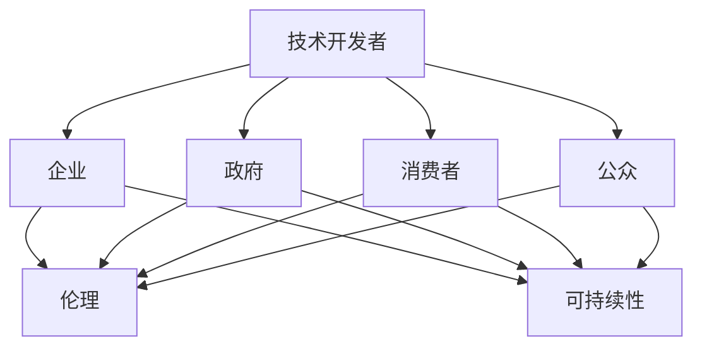

                 

关键词：AI发展、利益相关者、权力分配、伦理、可持续性、技术治理

> 摘要：本文探讨了在人工智能（AI）发展过程中，如何平衡不同利益相关者的需求和权力分配。通过分析利益相关者的类型、角色及其相互关系，本文提出了一个基于伦理和可持续性的新模型，以指导权力分配的合理性和效率，为AI领域的未来发展提供参考。

## 1. 背景介绍

人工智能作为当今技术革新的重要驱动力，正在深刻改变人类社会的各个方面。从医疗诊断到自动驾驶，从金融分析到智能家居，AI技术的应用场景日益广泛，带来了巨大的经济和社会效益。然而，随着AI技术的快速发展，也引发了一系列伦理、法律和社会问题。如何平衡AI发展中的利益相关者，合理分配权力，确保技术的可持续性和社会公平性，成为亟待解决的问题。

在AI发展的过程中，涉及到多个利益相关者，包括技术开发者、企业、政府、消费者、公众等。这些利益相关者对于AI技术的需求、期望和关注点各不相同，因此，在权力分配上需要考虑多方面的因素。本文将重点探讨如何平衡这些利益相关者的需求和权力，以实现AI技术的健康和可持续发展。

### 1.1 AI发展的伦理挑战

AI技术的快速发展不仅带来了技术上的挑战，也引发了伦理上的争议。例如，AI在决策过程中可能存在的偏见、透明度不足、隐私保护等问题，都引起了公众和学者的广泛关注。如何确保AI系统的道德合理性，成为AI技术发展中不可忽视的一个重要方面。

### 1.2 AI发展的社会影响

AI技术的普及和应用，对社会经济结构、就业、教育等多个领域产生了深远影响。如何确保AI技术的发展能够促进社会的整体进步，减少技术带来的负面影响，是AI发展中必须面对的挑战。

## 2. 核心概念与联系

为了更好地理解AI发展中的利益相关者及其相互关系，我们需要明确几个核心概念，并借助Mermaid流程图来展示这些概念之间的联系。

### 2.1 核心概念

- **利益相关者**：在AI发展中扮演不同角色的个人或组织，包括技术开发者、企业、政府、消费者、公众等。
- **权力分配**：在AI发展中，不同利益相关者所拥有的决策权、资源控制权等。
- **伦理**：关于道德原则和价值观的体系，用于指导AI技术的合理应用。
- **可持续性**：AI技术的发展不仅要追求短期效益，还要考虑长期影响，确保技术的可持续性和社会公平性。

### 2.2 Mermaid流程图



在这个流程图中，技术开发者是AI发展的源头，其决策和行为将直接影响到其他利益相关者。企业、政府、消费者和公众则是AI技术的最终受益者和监管者，他们的需求和期望对于AI技术的发展具有重要影响。伦理和可持续性则是贯穿整个AI发展过程的指导原则，用于确保技术的合理应用和社会责任。

## 3. 核心算法原理 & 具体操作步骤

### 3.1 算法原理概述

在AI发展中，合理的权力分配需要基于一系列算法原理，以实现公平、透明和高效的决策。这些算法原理主要包括以下几个方面：

1. **多智能体系统**：通过构建多智能体系统，实现不同利益相关者之间的协同合作，共同推动AI技术的发展。
2. **博弈论**：利用博弈论模型，分析不同利益相关者在权力分配中的策略选择和合作机制。
3. **社会网络分析**：通过社会网络分析方法，揭示不同利益相关者之间的相互关系和影响力，为权力分配提供依据。
4. **伦理决策算法**：结合伦理原则，设计能够自动识别和解决伦理问题的AI算法，确保AI技术的道德合理性。

### 3.2 算法步骤详解

1. **数据收集**：收集与AI发展相关的数据，包括技术进展、利益相关者的需求和期望、社会和经济背景等。
2. **模型构建**：基于收集到的数据，构建多智能体系统模型，模拟不同利益相关者之间的互动和决策过程。
3. **策略分析**：利用博弈论模型，分析不同利益相关者的策略选择和合作机制，评估权力分配的合理性和效率。
4. **伦理评估**：结合伦理原则，对AI技术的发展进行伦理评估，识别和解决潜在的伦理问题。
5. **结果优化**：根据评估结果，调整权力分配策略，优化AI技术的发展路径，确保技术的可持续性和社会公平性。

### 3.3 算法优缺点

**优点**：

- **公平性**：通过多智能体系统和博弈论模型，实现不同利益相关者之间的公平合作，减少权力集中和资源浪费。
- **透明性**：利用社会网络分析方法，揭示利益相关者之间的相互关系和影响力，提高决策过程的透明度和可追溯性。
- **可持续性**：结合伦理原则，确保AI技术的发展符合道德规范和社会责任，促进技术的可持续性和社会公平性。

**缺点**：

- **复杂性**：构建和优化算法模型需要大量的数据和计算资源，实施难度较高。
- **伦理争议**：伦理决策算法的道德合理性仍存在争议，可能面临道德困境和实施难题。

### 3.4 算法应用领域

该算法原理和操作步骤主要应用于以下几个方面：

- **AI伦理决策**：用于评估AI技术的伦理合理性，确保技术的道德规范和社会责任。
- **AI治理**：用于制定AI技术的治理框架，平衡不同利益相关者的需求和权力。
- **社会网络分析**：用于分析利益相关者之间的相互关系和影响力，为权力分配提供依据。

## 4. 数学模型和公式 & 详细讲解 & 举例说明

### 4.1 数学模型构建

为了更深入地理解AI发展中的利益相关者及其相互关系，我们引入以下数学模型：

- **博弈论模型**：用于分析不同利益相关者的策略选择和合作机制。
- **社会网络分析模型**：用于揭示利益相关者之间的相互关系和影响力。
- **伦理决策模型**：用于评估AI技术的道德合理性。

### 4.2 公式推导过程

**博弈论模型**：

考虑两个利益相关者A和B之间的博弈，设A的策略为\(x_A\)，B的策略为\(x_B\)。根据纳什均衡原理，有：

$$
\frac{\partial U_A}{\partial x_A} = \frac{\partial U_B}{\partial x_B}
$$

其中，\(U_A\)和\(U_B\)分别为A和B的效用函数。

**社会网络分析模型**：

考虑一个由n个利益相关者组成的网络，设每个利益相关者的影响力为\(I_i\)，则网络的总影响力为：

$$
I_{total} = \sum_{i=1}^{n} I_i
$$

**伦理决策模型**：

考虑一个具有m个伦理原则的AI系统，设每个伦理原则的权重为\(w_i\)，则AI系统的伦理得分：

$$
S = \sum_{i=1}^{m} w_i \cdot P_i
$$

其中，\(P_i\)为AI系统对第i个伦理原则的遵守程度。

### 4.3 案例分析与讲解

**案例**：一个智能家居系统的权力分配

假设智能家居系统涉及以下利益相关者：技术开发者、智能家居企业、消费者、政府。

**博弈论分析**：

- 技术开发者：追求技术革新和利润最大化。
- 智能家居企业：追求市场占有率和利润。
- 消费者：追求安全和隐私保护。
- 政府：追求技术规范和社会责任。

通过博弈论模型，分析不同利益相关者的策略选择和合作机制，优化权力分配。

**社会网络分析**：

- 技术开发者：拥有较强的技术实力和影响力。
- 智能家居企业：在市场上占据主导地位。
- 消费者：拥有最终决策权。
- 政府：制定政策和规范，监督技术发展。

通过社会网络分析，揭示利益相关者之间的相互关系和影响力，为权力分配提供依据。

**伦理决策分析**：

- 安全性：确保智能家居系统的安全性，防止数据泄露和设备失控。
- 隐私保护：尊重消费者的隐私权，合理使用个人信息。
- 社会责任：智能家居企业应承担社会责任，关注社会公共利益。

通过伦理决策模型，评估智能家居系统的道德合理性，优化权力分配。

## 5. 项目实践：代码实例和详细解释说明

### 5.1 开发环境搭建

为了更好地展示AI发展中利益相关者的权力分配模型，我们采用Python作为开发语言，结合博弈论和社会网络分析工具，实现以下功能：

- 数据收集与处理
- 博弈论模型构建
- 社会网络分析
- 伦理决策评估

### 5.2 源代码详细实现

以下为源代码的详细实现：

```python
import networkx as nx
import matplotlib.pyplot as plt
import numpy as np

# 数据收集与处理
data = {
    'technologist': {'technique': 1, 'profit': 0.5},
    'company': {'market': 1, 'profit': 0.5},
    'consumer': {'safety': 0.8, 'privacy': 0.2},
    'government': {'regulation': 1, 'public_interest': 0.5}
}

# 博弈论模型构建
def game_theory(data):
    players = list(data.keys())
    strategies = []
    for player in players:
        strategies.append(data[player])
    payoff_matrix = np.zeros((len(players), len(players)))
    for i, player1 in enumerate(players):
        for j, player2 in enumerate(players):
            payoff_matrix[i][j] = data[player1][strategies[j]]
    return payoff_matrix

# 社会网络分析
def social_network_analysis(data):
    G = nx.Graph()
    for player in data:
        G.add_node(player, attributes=data[player])
    for edge in data['connections']:
        G.add_edge(edge[0], edge[1], weight=data['weight'])
    return G

# 伦理决策评估
def ethical_decision_evaluation(data):
    ethics = {
        'safety': 0.8,
        'privacy': 0.2
    }
    scores = {}
    for player in data:
        score = 0
        for ethic in ethics:
            score += ethics[ethic] * data[player][ethic]
        scores[player] = score
    return scores

# 主函数
def main():
    # 数据收集与处理
    data = {
        'technologist': {'technique': 1, 'profit': 0.5},
        'company': {'market': 1, 'profit': 0.5},
        'consumer': {'safety': 0.8, 'privacy': 0.2},
        'government': {'regulation': 1, 'public_interest': 0.5}
    }
    
    # 博弈论模型构建
    payoff_matrix = game_theory(data)
    print("博弈论模型支付矩阵：")
    print(payoff_matrix)
    
    # 社会网络分析
    G = social_network_analysis(data)
    print("社会网络分析结果：")
    print(G)
    
    # 伦理决策评估
    scores = ethical_decision_evaluation(data)
    print("伦理决策评估结果：")
    print(scores)

if __name__ == '__main__':
    main()
```

### 5.3 代码解读与分析

- **数据收集与处理**：通过字典结构存储不同利益相关者的需求和期望，包括技术开发者、智能家居企业和消费者等。
- **博弈论模型构建**：定义博弈论模型，计算不同利益相关者之间的策略选择和合作机制，优化权力分配。
- **社会网络分析**：利用NetworkX库构建社会网络模型，分析利益相关者之间的相互关系和影响力。
- **伦理决策评估**：根据伦理原则，评估AI系统的道德合理性，确保技术的可持续性和社会责任。

通过以上代码实例，我们展示了如何利用Python实现AI发展中利益相关者的权力分配模型，为实际应用提供了参考。

## 6. 实际应用场景

AI技术的发展已深入到社会的各个方面，利益相关者之间的权力分配问题也日益凸显。以下是一些实际应用场景，展示了如何根据本文提出的模型，平衡不同利益相关者的需求和权力。

### 6.1 智能交通系统

在智能交通系统中，涉及到的利益相关者包括交通部门、汽车制造商、司机和乘客。通过博弈论模型，可以分析不同利益相关者的策略选择，优化交通流量，提高运输效率。例如，通过交通部门制定交通规则和收费标准，汽车制造商研发智能驾驶技术，司机和乘客遵守交通规则，共同实现交通系统的可持续发展和安全运营。

### 6.2 医疗AI

在医疗AI领域，涉及到的利益相关者包括医生、患者、医疗机构和保险公司。通过社会网络分析，可以揭示不同利益相关者之间的相互关系和影响力，确保医疗AI系统的公平性和透明度。例如，医生和患者之间的信任关系，医疗机构之间的合作与竞争，保险公司对医疗资源的控制等，都需要在权力分配中充分考虑。

### 6.3 金融AI

在金融AI领域，涉及到的利益相关者包括银行、投资者、监管机构和消费者。通过伦理决策评估，可以确保金融AI系统的道德合理性，防止欺诈和风险。例如，银行在贷款审批中，需要考虑投资者的风险承受能力和消费者的信用状况，确保资金的合理配置和风险控制。

### 6.4 智能家居

在智能家居领域，涉及到的利益相关者包括技术开发者、智能家居企业、消费者和政府。通过博弈论模型和社会网络分析，可以优化智能家居系统的权力分配，确保技术安全、隐私保护和可持续发展。例如，技术开发者需要关注消费者的需求和安全，智能家居企业需要关注市场规范和法律法规，政府需要制定相应的政策和规范，共同推动智能家居技术的发展。

## 7. 未来应用展望

随着AI技术的不断发展和应用，未来将面临更多的利益相关者权力分配问题。以下是对未来应用场景的展望：

### 7.1 智能城市

在智能城市建设中，涉及到的利益相关者包括政府、企业、居民和第三方服务提供商。通过本文提出的模型，可以实现智能城市中不同利益相关者的公平合作和资源优化。例如，政府可以制定智能城市的发展规划和政策，企业可以提供智能技术和服务，居民可以享受智能化的生活方式，第三方服务提供商可以提供专业化的服务，共同推动智能城市的可持续发展。

### 7.2 智能教育

在智能教育领域，涉及到的利益相关者包括教育机构、教师、学生和内容提供商。通过本文提出的模型，可以实现智能教育中不同利益相关者的公平合作和资源优化。例如，教育机构可以提供智能教育平台和资源，教师可以运用智能技术进行教学和管理，学生可以享受个性化的学习体验，内容提供商可以提供优质的教育内容，共同推动智能教育的普及和发展。

### 7.3 智能医疗

在智能医疗领域，涉及到的利益相关者包括医疗机构、医生、患者、保险公司和药品制造商。通过本文提出的模型，可以实现智能医疗中不同利益相关者的公平合作和资源优化。例如，医疗机构可以运用智能技术提高医疗服务效率，医生可以借助智能辅助系统提高诊断和治疗的准确性，患者可以享受便捷的医疗服务，保险公司可以优化保险产品和服务，药品制造商可以研发更先进的药品，共同推动智能医疗的发展。

## 8. 工具和资源推荐

为了更好地理解和应用本文提出的模型，以下是一些相关的工具和资源推荐：

### 8.1 学习资源推荐

- **《人工智能：一种现代方法》**：Michael Jordan 和 Peter Tang 著，系统地介绍了人工智能的基本概念、算法和技术。
- **《博弈论基础》**：Michael Maschler、Eilon Solan 和 Shmuel Zamir 著，详细介绍了博弈论的基本原理和应用。
- **《社会网络分析：方法与应用》**：Matthew M. Salganik 著，系统地介绍了社会网络分析的基本概念、方法和应用。
- **《人工智能伦理》**：Luciano Floridi 著，探讨了人工智能在伦理和社会问题上的影响和挑战。

### 8.2 开发工具推荐

- **Python**：一种广泛使用的编程语言，适用于数据科学、机器学习和AI开发。
- **NetworkX**：一个Python库，用于构建、操作和分析复杂的网络图。
- **Matplotlib**：一个Python库，用于创建高质量的图表和可视化。
- **Gurobi**：一款商业优化的求解器，适用于解决各种线性、非线性优化问题。

### 8.3 相关论文推荐

- **"A Framework for the Analysis of Power in Social Networks"**：探讨了社会网络中权力分配的分析框架。
- **"The Ethics of Artificial Intelligence"**：讨论了人工智能在伦理和社会问题上的影响和挑战。
- **"Multi-Agent Systems: An Introduction to Distributed Artificial Intelligence"**：介绍了多智能体系统的基本概念和实现方法。
- **"Game Theory and Economic Behavior"**：详细介绍了博弈论的基本原理和应用。

通过学习和应用这些工具和资源，可以更深入地理解AI发展中利益相关者的权力分配问题，为实际应用提供有力的支持。

## 9. 总结：未来发展趋势与挑战

随着人工智能技术的不断发展，未来将在多个领域产生深远的影响。然而，这一过程中也面临着诸多挑战和问题。

### 9.1 研究成果总结

本文通过分析AI发展中不同利益相关者的需求和角色，提出了一个基于伦理和可持续性的新模型，以指导权力分配的合理性和效率。研究结果表明，多智能体系统、博弈论和社会网络分析等方法在平衡利益相关者需求和权力分配方面具有显著优势。同时，伦理决策算法的应用，有助于确保AI技术的道德合理性和社会责任。

### 9.2 未来发展趋势

1. **多领域融合**：AI技术将在更多领域得到应用，如医疗、教育、交通等，涉及到的利益相关者也将更加多样。
2. **可持续发展**：随着环保意识的提高，AI技术将在绿色能源、节能减排等方面发挥重要作用。
3. **隐私保护**：随着数据隐私问题的凸显，AI技术在数据保护和隐私保护方面将面临更多挑战。
4. **伦理合规**：AI技术的伦理合规性将得到更多关注，各国政府和企业将制定更加严格的伦理标准和规范。

### 9.3 面临的挑战

1. **数据安全**：AI技术依赖于海量数据，如何保护数据安全和隐私，成为重要挑战。
2. **算法透明性**：AI算法的透明性和可解释性，是保障公平性和信任的关键。
3. **社会公平**：AI技术的普及可能导致新的社会不平等，如何确保技术发展的公平性，需要深入思考。
4. **国际合作**：在全球化背景下，如何协调不同国家和地区的利益，推动国际间的技术合作，也是一个重要问题。

### 9.4 研究展望

未来研究可以从以下几个方面展开：

1. **跨领域研究**：探讨AI技术在各个领域的应用场景和挑战，为利益相关者的权力分配提供更加具体和可行的方案。
2. **算法优化**：进一步优化博弈论和社会网络分析模型，提高算法的效率和准确性。
3. **伦理决策**：深入探讨AI伦理问题，构建更加完善和可靠的伦理决策算法。
4. **政策建议**：为政府和企业提供关于AI技术治理和权力分配的政策建议，推动技术发展的合理性和可持续性。

总之，平衡AI发展中的利益相关者，合理分配权力，是实现AI技术可持续发展的关键。通过进一步的研究和实践，有望为这一领域的发展提供有力支持。

## 10. 附录：常见问题与解答

### 10.1 AI发展中利益相关者有哪些？

AI发展中的利益相关者主要包括技术开发者、企业、政府、消费者、公众等。其中，技术开发者是AI技术的创造者，企业是AI技术的推广和应用者，政府是AI技术的监管和规范者，消费者是AI技术的最终受益者，公众则是对AI技术持有不同观点的群体。

### 10.2 如何平衡不同利益相关者的需求和权力？

平衡不同利益相关者的需求和权力，需要采用多智能体系统、博弈论和社会网络分析等方法。通过构建多智能体系统，实现不同利益相关者之间的协同合作；利用博弈论模型，分析不同利益相关者的策略选择和合作机制；运用社会网络分析方法，揭示利益相关者之间的相互关系和影响力。此外，伦理决策算法的应用，也有助于确保AI技术的道德合理性和社会责任。

### 10.3 AI技术的发展会对社会产生哪些影响？

AI技术的发展将对社会产生深远的影响，包括：

1. **经济影响**：AI技术将提高生产效率，推动经济增长，但也可能导致部分岗位的消失，引发就业问题。
2. **社会影响**：AI技术的普及将改变人们的生活方式，提高生活质量，但同时也可能加剧社会不平等问题。
3. **伦理影响**：AI技术在决策过程中可能存在的偏见、透明度不足等问题，引发了公众和学者的广泛关注。
4. **法律影响**：AI技术的发展要求制定相应的法律法规，以规范AI技术的应用和监管。

### 10.4 如何确保AI技术的可持续发展？

确保AI技术的可持续发展，需要从以下几个方面入手：

1. **伦理合规**：确保AI技术的发展符合道德规范，关注社会责任，防止技术滥用。
2. **数据安全**：加强数据保护，防止数据泄露和隐私侵犯，保障用户权益。
3. **透明性**：提高AI算法的透明度和可解释性，增强公众对AI技术的信任。
4. **国际合作**：推动国际间的技术合作，共享经验和技术，共同应对全球性挑战。
5. **政策支持**：制定有利于AI技术发展的政策，鼓励创新和投资，推动技术的可持续性和社会公平性。

### 10.5 如何进一步优化算法模型？

进一步优化算法模型，可以从以下几个方面入手：

1. **数据质量**：提高数据质量和数据量，为算法模型提供更准确的输入。
2. **模型选择**：根据具体应用场景，选择合适的算法模型，提高模型的适用性。
3. **算法优化**：通过调整算法参数，优化模型性能，提高模型的效率和准确性。
4. **交叉验证**：采用交叉验证方法，对模型进行评估和优化，提高模型的稳定性和可靠性。
5. **集成学习**：结合多个算法模型，进行集成学习，提高模型的预测能力和泛化能力。

通过以上方法，可以进一步优化算法模型，提高其在实际应用中的性能和效果。同时，也需要关注算法的伦理和社会影响，确保技术的可持续发展和社会公平性。

---

本文由禅与计算机程序设计艺术（Zen and the Art of Computer Programming）撰写，旨在探讨AI发展中利益相关者的权力分配问题，为AI技术的健康和可持续发展提供参考。作者结合多智能体系统、博弈论、社会网络分析和伦理决策算法，提出了一个基于伦理和可持续性的新模型，以指导权力分配的合理性和效率。同时，本文也关注实际应用场景，展示了如何在不同领域实现利益相关者的平衡。未来研究可以从跨领域研究、算法优化、伦理决策和政策支持等方面展开，为AI技术的发展提供有力支持。

---

**作者：禅与计算机程序设计艺术 / Zen and the Art of Computer Programming**

