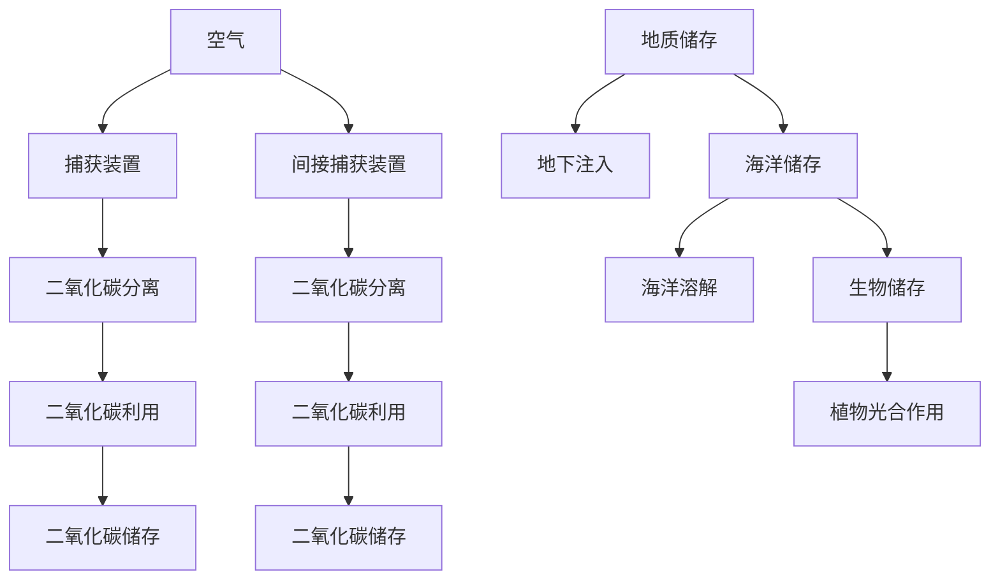

                 

关键词：全球减排、负排放技术、碳中和经济、气候治理、人工智能、可持续发展

> 摘要：本文深入探讨了2050年全球减排的战略和路径，特别是负排放技术与碳中和经济在气候治理中的作用。文章首先回顾了当前气候变化形势，然后详细介绍了负排放技术的原理和主要技术路径，接着探讨了碳中和经济的构建策略。最后，我们分析了这些技术在全球范围内应用的前景，并提出了未来研究和发展的挑战与展望。

## 1. 背景介绍

随着工业化的快速推进和人类对自然资源的过度开发，全球气候变化问题愈发严峻。据联合国气候变化专门委员会（IPCC）报告显示，自19世纪末以来，地球平均气温已经上升了约1.1摄氏度，而且这一上升趋势仍在加剧。气候变化导致了海平面上升、极端天气事件频发、生态系统破坏等一系列问题，严重威胁着人类的生存环境和可持续发展。

为了应对气候变化，全球各国纷纷提出了减排目标。例如，2015年签署的《巴黎协定》明确要求将全球平均气温升幅控制在2摄氏度以内，并努力限制在1.5摄氏度以内。然而，现有的减排措施和技术还远远不够，需要更多的创新和突破。

在这样的背景下，负排放技术和碳中和经济成为了解决气候变化问题的重要途径。负排放技术通过捕获和存储二氧化碳，从而实现从大气中减少温室气体浓度的目的。而碳中和经济则通过实现零碳排放，推动经济和环境的协调发展。本文将详细探讨这些技术的原理、应用前景以及面临的挑战。

### 当前气候变化形势

气候变化已经成为全球关注的重要议题。根据IPCC的报告，过去几十年，全球平均气温逐渐升高，极端天气事件频发，海平面上升等问题愈发严重。例如，自1970年以来，全球平均气温已经上升了约0.85摄氏度。而北极地区的温度上升速度更是惊人，几乎是全球平均水平的两倍。

气候变化的后果不容忽视。首先，海平面上升对沿海城市和低洼地区构成严重威胁。据预测，如果全球气温上升2摄氏度，海平面可能会上升0.4至1.0米，这将对数亿人口的生活造成巨大影响。其次，极端天气事件，如洪水、干旱、飓风等，越来越频繁且破坏性更强。例如，2021年的极端洪水事件导致巴基斯坦数十万人无家可归，严重影响了当地的农业生产和基础设施。

生态系统也在遭受破坏。气候变化导致冰川融化、森林减少和生物多样性下降。例如，格陵兰冰盖的融化速度在过去的几十年里显著加快，而亚马逊雨林的火灾事件也频繁发生，对全球气候平衡和生态系统的稳定性构成严重威胁。

全球气候变化问题不仅对环境造成了严重影响，还对经济和社会带来了巨大冲击。农业生产受影响，粮食安全受到威胁；水资源管理变得更加复杂和困难；旅游业也因极端天气事件的影响而受到重创。此外，气候变化加剧了社会不平等，贫困地区和贫困人口更容易受到气候变化的负面影响。

面对严峻的气候变化形势，全球各国开始积极行动，努力实现减排目标。然而，现有减排措施和技术仍然面临诸多挑战，需要进一步创新和加强。负排放技术和碳中和经济的出现，为全球应对气候变化提供了新的思路和途径。

### 负排放技术的概念和重要性

负排放技术是指通过各种手段从大气中捕获和移除二氧化碳（CO₂），从而实现温室气体浓度的减少。与传统的减排措施主要侧重于减少二氧化碳排放量不同，负排放技术关注的是从大气中直接移除已经释放的二氧化碳，具有独特的环保价值和战略意义。

负排放技术的重要性体现在以下几个方面：

1. **缓解气候变化压力**：由于二氧化碳在大气中的残留时间较长，传统的减排措施难以在短期内显著降低温室气体浓度。负排放技术可以直接从大气中移除二氧化碳，从而迅速缓解气候变化的压力。

2. **弥补现有减排措施的不足**：尽管全球各国正在积极采取措施减少二氧化碳排放，但当前的减排速度仍不足以阻止全球气温的持续上升。负排放技术可以作为一种补充手段，与现有减排措施相结合，实现更有效的气候治理。

3. **促进碳中和经济的构建**：碳中和经济要求实现二氧化碳的零排放，而负排放技术是实现这一目标的重要途径。通过大规模应用负排放技术，可以推动经济向低碳、绿色、可持续的方向转型。

4. **提升能源系统的灵活性**：随着可再生能源的广泛应用，能源系统变得更加复杂和灵活。负排放技术可以在一定程度上弥补可再生能源发电的不稳定性，提升能源系统的整体效率和可靠性。

### 负排放技术的核心原理

负排放技术的核心原理可以概括为三个主要步骤：捕获、利用和存储。

1. **捕获**：捕获是从大气中收集二氧化碳的过程。根据不同的技术手段，捕获方式可以分为直接空气捕获（DAC）和间接空气捕获（IAC）。直接空气捕获技术通过特制的装置直接从大气中抽取二氧化碳，而间接空气捕获技术则利用化学或物理方法，如吸附、吸收、膜分离等，将空气中的二氧化碳与其他气体分离。

2. **利用**：捕获的二氧化碳可以被转化为有价值的化工产品或用作其他工业用途。例如，通过催化转化可以将二氧化碳转化为甲酸或甲醇等化学品。此外，二氧化碳还可以用于增强石油开采（EOR），提高原油的采收率。

3. **存储**：将二氧化碳长期储存起来，以防止其再次释放到大气中。常见的二氧化碳储存方式包括地质储存、海洋储存和生物储存。地质储存是将二氧化碳注入到地下空隙中，如油气层、煤层等。海洋储存则通过海洋溶解、浮游植物光合作用等途径吸收和储存二氧化碳。生物储存则利用植物的光合作用，将二氧化碳固定在生物质中。

### 主要负排放技术路径

负排放技术路径多种多样，以下介绍几种主要的负排放技术：

1. **直接空气捕获（DAC）**：DAC技术是当前研究最为广泛的一种负排放技术。它通过风扇或其他机械设备将空气吸入装置，通过冷凝、吸附或化学吸收等方法，将二氧化碳从空气中分离出来。DAC技术具有高效、低成本、灵活性强等优点，但面临的挑战是如何大规模降低成本并提高二氧化碳的捕获效率。

2. **增强生物碳封存（EBE）**：EBE技术通过改良农作物种植、森林管理和土地恢复等措施，增加土壤和植物对二氧化碳的固定能力。这种技术不仅能够减少大气中的二氧化碳，还能改善土壤质量和生态系统功能。EBE技术具有环境友好、可持续等优点，但实施过程中需要考虑到农业和土地资源的管理问题。

3. **增强矿化（EM）**：EM技术通过化学反应将二氧化碳转化为矿物质，从而实现其长期储存。常见的EM技术包括钙基矿物化、镁基矿物化和硅酸盐矿物化等。这些技术具有较高的二氧化碳转化效率和稳定性，但面临着反应条件苛刻、成本较高等问题。

4. **海洋负排放技术**：海洋是地球上最大的碳储存库之一。海洋负排放技术通过多种途径将二氧化碳引入海洋，如溶解、浮游植物光合作用和海洋工程等。这种技术具有巨大的潜力，但面临着技术实现难度大、环境影响未知等问题。

5. **碳捕获与封存（CCS）**：CCS技术主要应用于大型燃煤电厂和工业排放源，通过燃烧过程中的捕集和分离，将二氧化碳从废气中提取出来，并储存在地下。CCS技术是目前应用最广泛的负排放技术，但其面临的主要挑战是高昂的成本和技术成熟度。

### 负排放技术的应用现状与挑战

负排放技术在全球范围内已经得到了广泛关注和应用。许多国家和地区已经开始试点和部署各种负排放技术，以应对日益严峻的气候变化问题。

1. **应用现状**：
   - **DAC技术**：DAC技术在一些国家和地区已经实现了小规模的应用。例如，美国的一家初创公司 invention labs 已经在犹他州的沙漠中部署了DAC装置，通过冷凝方法捕获二氧化碳。
   - **CCS技术**：CCS技术在燃煤电厂中的应用最为广泛。全球已有数十个CCS项目在运营中，如挪威的Sleipner油田和德国的Auburn煤炭电厂。这些项目通过捕集和存储燃烧产生的二氧化碳，有效减少了温室气体的排放。

2. **面临的挑战**：
   - **成本问题**：负排放技术，尤其是DAC和EBE技术，面临着高昂的成本问题。大规模部署这些技术需要大量的资金投入，这对于许多国家和地区来说是一个巨大的挑战。
   - **技术成熟度**：许多负排放技术仍在研发和试验阶段，尚未达到商业化应用的水平。技术的成熟度和可靠性是决定其大规模应用的关键因素。
   - **环境影响**：负排放技术的广泛应用可能会对环境产生潜在影响。例如，DAC技术可能会改变大气成分，影响生态系统的稳定性；而CCS技术可能会对地下水和地质结构产生影响。

总的来说，负排放技术作为一种潜在的解决方案，具有巨大的发展潜力。但要想实现其大规模应用，需要克服一系列技术和经济上的挑战。

## 2. 核心概念与联系

在深入探讨负排放技术之前，我们需要明确一些核心概念，并展示它们之间的相互联系。这些核心概念不仅有助于我们更好地理解负排放技术的原理，也有助于我们在实际应用中找到最优的解决方案。

### 负排放技术原理与架构的Mermaid流程图

以下是负排放技术原理和架构的Mermaid流程图，其中包含了负排放技术的关键步骤和环节。



### 关键概念解释

1. **空气**：作为负排放技术的起点，空气中含有二氧化碳、氧气以及其他气体。空气的质量和成分直接影响到负排放技术的效果。

2. **捕获装置**：捕获装置是负排放技术的核心组件，用于从空气中分离出二氧化碳。根据不同的技术路径，捕获装置可以分为直接空气捕获装置（DAC）和间接空气捕获装置（IAC）。

3. **二氧化碳分离**：通过物理、化学或生物方法，将空气中的二氧化碳与其他气体分离。分离效率是决定负排放技术性能的关键因素。

4. **二氧化碳利用**：捕获的二氧化碳可以通过多种途径进行利用，如转化为化工产品、用于增强石油开采等。二氧化碳的利用不仅能够增加其经济价值，还能减少其对环境的影响。

5. **二氧化碳储存**：将二氧化碳储存在地下、海洋或生物质中，防止其再次释放到大气中。储存方式的选择和安全性是决定负排放技术可持续性的重要因素。

6. **地质储存**：通过将二氧化碳注入到地下空隙中，如油气层、煤层等，实现长期储存。地质储存具有储存量大、安全性高等优点。

7. **海洋储存**：利用海洋溶解和浮游植物光合作用等途径，将二氧化碳引入海洋。海洋储存具有巨大的碳储存潜力，但面临环境影响和实施难度等问题。

8. **生物储存**：通过植物的光合作用，将二氧化碳固定在生物质中。生物储存具有环境友好、可持续等优点，但需要考虑农业和土地资源的管理问题。

### 负排放技术架构的详细说明

负排放技术架构主要包括以下步骤和组件：

1. **捕获环节**：捕获装置通过风扇、过滤器或其他机械手段，从空气中分离出二氧化碳。直接空气捕获（DAC）和间接空气捕获（IAC）是两种主要方法。

2. **分离环节**：通过化学吸收、冷凝、膜分离等方法，将二氧化碳与其他气体分离。分离效率直接影响负排放技术的整体性能。

3. **利用环节**：将捕获的二氧化碳转化为有价值的化工产品或用于其他工业用途，如增强石油开采（EOR）。利用过程不仅增加了二氧化碳的经济价值，还能减少其对环境的影响。

4. **储存环节**：将二氧化碳储存在地下、海洋或生物质中，实现长期储存。储存方式的选择和安全性是决定负排放技术可持续性的重要因素。

### 负排放技术的应用场景

负排放技术可以应用于多个领域，以下是一些典型的应用场景：

1. **工业排放源**：如燃煤电厂、钢铁厂和水泥厂等，通过CCS技术实现二氧化碳的捕集和储存，减少温室气体排放。

2. **可再生能源**：如太阳能、风能等，通过DAC技术捕获并储存废弃的二氧化碳，提高可再生能源的利用效率。

3. **农业和林业**：通过增强生物碳封存（EBE）技术，提高农作物和森林对二氧化碳的吸收和固定能力。

4. **城市环境**：利用城市中的空气质量监测设备和DAC装置，实时捕获并处理大气中的二氧化碳，改善城市空气质量。

### 负排放技术的挑战与未来发展方向

尽管负排放技术具有巨大的潜力，但其在实际应用中仍面临一系列挑战：

1. **成本问题**：大规模部署负排放技术需要大量的资金投入，尤其是DAC和EBE技术。降低成本是推动负排放技术大规模应用的关键。

2. **技术成熟度**：许多负排放技术仍处于研发和试验阶段，尚未达到商业化应用的水平。提高技术的成熟度和可靠性是未来发展的重点。

3. **环境影响**：负排放技术的广泛应用可能会对环境产生潜在影响。例如，DAC技术可能会改变大气成分，影响生态系统的稳定性；而CCS技术可能会对地下水和地质结构产生影响。

未来，随着技术的不断进步和成本的降低，负排放技术有望在全球范围内得到广泛应用。以下是一些未来发展方向：

1. **创新与研发**：加大对负排放技术的研发投入，提高技术成熟度和分离效率，降低成本。

2. **政策支持**：政府应制定相应的政策，鼓励和扶持负排放技术的研发和应用。

3. **国际合作**：全球各国应加强合作，共同应对气候变化挑战，推广负排放技术的应用。

4. **公众参与**：提高公众对负排放技术的认知和接受度，鼓励社会各界积极参与到气候治理中来。

总之，负排放技术作为一种潜在的解决方案，为全球应对气候变化提供了新的思路和途径。通过不断创新和合作，我们有望在2050年前实现全球碳中和，为子孙后代留下一个更加美好的地球。

## 3. 核心算法原理 & 具体操作步骤

### 3.1 算法原理概述

在负排放技术中，核心算法通常涉及二氧化碳的捕获、分离、利用和存储四个主要步骤。以下是这些步骤的简要概述：

1. **捕获算法**：用于从大气中高效、经济地捕获二氧化碳。主要算法包括直接空气捕获（DAC）和间接空气捕获（IAC）。

2. **分离算法**：利用化学、物理或生物方法，将空气中的二氧化碳与其他气体分离。常见的分离算法包括化学吸收、冷凝和膜分离。

3. **利用算法**：将捕获的二氧化碳转化为有价值的化工产品或用于其他工业用途。常见的利用算法包括催化转化和增强石油开采（EOR）。

4. **存储算法**：将二氧化碳储存在地下、海洋或生物质中，防止其再次释放到大气中。存储算法包括地质储存、海洋储存和生物储存。

### 3.2 算法步骤详解

#### 3.2.1 捕获算法

1. **直接空气捕获（DAC）**：
   - **流程**：DAC算法通过风扇或其他机械装置将空气吸入捕获装置，通过冷凝或化学吸收等方法，将空气中的二氧化碳分离出来。
   - **主要参数**：空气流量、冷凝温度、吸收剂类型。
   - **算法步骤**：
     1. 设定空气流量和冷凝温度。
     2. 启动风扇，将空气吸入装置。
     3. 通过冷凝器或吸收塔，将空气中的二氧化碳冷凝或吸附。
     4. 分离出二氧化碳气体。

2. **间接空气捕获（IAC）**：
   - **流程**：IAC算法通过物理或化学方法，将空气中的二氧化碳与其他气体分离。常用的方法包括膜分离和吸附分离。
   - **主要参数**：膜材料、吸附剂类型、分离效率。
   - **算法步骤**：
     1. 选择合适的膜材料或吸附剂。
     2. 将空气通过膜或吸附剂，实现二氧化碳的分离。
     3. 收集分离出的二氧化碳气体。

#### 3.2.2 分离算法

1. **化学吸收法**：
   - **流程**：通过化学吸收剂（如氨水、醇类等）将空气中的二氧化碳吸收，达到分离目的。
   - **主要参数**：吸收剂浓度、温度、压力。
   - **算法步骤**：
     1. 选择合适的吸收剂。
     2. 调节吸收剂浓度、温度和压力。
     3. 将空气通过吸收剂，实现二氧化碳的吸收和分离。

2. **冷凝法**：
   - **流程**：通过降低温度，使空气中的二氧化碳冷凝成液体，实现分离。
   - **主要参数**：冷却温度、空气流量。
   - **算法步骤**：
     1. 设定冷却温度。
     2. 将空气通过冷却器，实现二氧化碳的冷凝。
     3. 收集冷凝出的二氧化碳液体。

3. **膜分离法**：
   - **流程**：通过选择特定孔径和性质的膜，使二氧化碳通过膜，实现分离。
   - **主要参数**：膜材料、膜孔径、空气流量。
   - **算法步骤**：
     1. 选择合适的膜材料。
     2. 设定膜孔径和空气流量。
     3. 将空气通过膜，实现二氧化碳的分离。

#### 3.2.3 利用算法

1. **催化转化法**：
   - **流程**：通过催化剂，将二氧化碳转化为有价值的化工产品，如甲酸、甲醇等。
   - **主要参数**：催化剂类型、反应温度、压力。
   - **算法步骤**：
     1. 选择合适的催化剂。
     2. 调节反应温度和压力。
     3. 将二氧化碳输入催化剂反应器，实现催化转化。

2. **增强石油开采（EOR）**：
   - **流程**：通过注入二氧化碳，增加石油的开采效率。
   - **主要参数**：二氧化碳注入量、油井压力。
   - **算法步骤**：
     1. 设定二氧化碳注入量。
     2. 将二氧化碳注入油井。
     3. 通过提高油井压力，实现石油的开采。

#### 3.2.4 存储算法

1. **地质储存**：
   - **流程**：将二氧化碳注入到地下油气层或煤层中，实现长期储存。
   - **主要参数**：地下储层类型、注入压力。
   - **算法步骤**：
     1. 选择合适的地下储层。
     2. 调节注入压力。
     3. 将二氧化碳注入地下储层。

2. **海洋储存**：
   - **流程**：通过海洋溶解和浮游植物光合作用，将二氧化碳引入海洋，实现储存。
   - **主要参数**：海洋深度、浮游植物类型。
   - **算法步骤**：
     1. 选择合适的海洋区域。
     2. 利用浮游植物的光合作用，吸收二氧化碳。
     3. 通过海洋溶解，实现二氧化碳的储存。

3. **生物储存**：
   - **流程**：通过植物的光合作用，将二氧化碳固定在生物质中。
   - **主要参数**：农作物类型、种植密度。
   - **算法步骤**：
     1. 选择合适的农作物。
     2. 调节种植密度。
     3. 通过植物的光合作用，实现二氧化碳的固定和储存。

### 3.3 算法优缺点

#### 捕获算法

**优点**：
- DAC技术具有高效、灵活、适用范围广等优点。

**缺点**：
- 成本较高，尤其是在大规模应用时。

**分离算法**

**优点**：
- 化学吸收法和冷凝法具有高效、稳定、易于实现等优点。

**缺点**：
- 分离效率受温度、压力等因素影响较大。

**利用算法**

**优点**：
- 催化转化法和EOR技术具有较高的经济效益。

**缺点**：
- 技术成熟度较低，部分领域应用受限。

**存储算法**

**优点**：
- 地质储存具有储存量大、安全性高、长期稳定性好等优点。

**缺点**：
- 需要选择合适的地下储层，面临技术和环境挑战。

### 3.4 算法应用领域

负排放算法在多个领域具有广泛的应用前景，以下是一些典型的应用领域：

1. **能源领域**：通过CCS技术减少燃煤电厂和工业排放源的二氧化碳排放，实现能源领域的碳中和。

2. **工业领域**：通过催化转化和EOR技术，将二氧化碳转化为有价值的化工产品，提高工业生产效率。

3. **农业领域**：通过增强生物碳封存技术，提高农作物对二氧化碳的吸收和固定能力，促进农业可持续发展。

4. **城市环境**：通过DAC技术和空气质量监测设备，实时捕获和处理城市大气中的二氧化碳，改善空气质量。

5. **海洋工程**：通过海洋储存技术，利用海洋溶解和浮游植物光合作用，实现二氧化碳的长期储存。

总之，负排放算法在应对气候变化、推动可持续发展方面具有重要作用。通过不断创新和优化，我们有望在未来实现更高效、更经济的负排放技术，为全球气候治理贡献力量。

## 4. 数学模型和公式 & 详细讲解 & 举例说明

在负排放技术的各个阶段，数学模型和公式扮演着至关重要的角色，它们不仅帮助我们理解和优化这些技术，还为实际应用提供了理论依据。以下将详细讲解负排放技术中的几个关键数学模型和公式，并辅以具体例子进行说明。

### 4.1 数学模型构建

在负排放技术中，常见的数学模型包括二氧化碳捕获效率模型、分离效率模型和储存容量模型。以下是这些模型的构建过程：

#### 4.1.1 二氧化碳捕获效率模型

假设空气流量为Q，其中含有二氧化碳浓度C0。通过直接空气捕获（DAC）装置捕获二氧化碳，捕获效率为ηD。则捕获的二氧化碳量可以表示为：

$$
CO2_{captured} = Q \times C0 \times \eta_D
$$

其中：
- \( Q \)：空气流量（单位：m³/s）
- \( C0 \)：空气中二氧化碳的初始浓度（单位：kg/m³）
- \( \eta_D \)：直接空气捕获效率（无单位）

#### 4.1.2 分离效率模型

假设捕获的二氧化碳气体流量为Qc，分离效率为ηS。通过分离装置，如化学吸收或冷凝，将二氧化碳与其他气体分离。则分离出的二氧化碳流量为：

$$
CO2_{separated} = Qc \times \eta_S
$$

其中：
- \( Qc \)：捕获的二氧化碳气体流量（单位：kg/s）
- \( \eta_S \)：分离效率（无单位）

#### 4.1.3 储存容量模型

假设储存装置的体积为V，二氧化碳的密度为ρ。则储存装置的容量可以表示为：

$$
Capacity = V \times \rho
$$

其中：
- \( V \)：储存装置的体积（单位：m³）
- \( \rho \)：二氧化碳的密度（单位：kg/m³）

### 4.2 公式推导过程

#### 4.2.1 二氧化碳捕获效率模型推导

假设空气流量为Q，二氧化碳在空气中的浓度分布均匀。通过直接空气捕获（DAC）装置，空气中的二氧化碳浓度从C0降低到Ct。捕获效率ηD可以表示为：

$$
\eta_D = \frac{C0 - Ct}{C0}
$$

其中：
- \( C0 \)：空气中二氧化碳的初始浓度
- \( Ct \)：空气通过DAC装置后的二氧化碳浓度

#### 4.2.2 分离效率模型推导

通过化学吸收或冷凝方法，假设二氧化碳气体流量为Qc，吸收剂或冷凝器的效率为ηS。分离效率ηS可以表示为：

$$
\eta_S = \frac{CO2_{separated}}{CO2_{captured}}
$$

其中：
- \( CO2_{separated} \)：分离出的二氧化碳流量
- \( CO2_{captured} \)：捕获的二氧化碳流量

#### 4.2.3 储存容量模型推导

假设储存装置的体积为V，二氧化碳的密度为ρ。储存容量C可以表示为：

$$
Capacity = V \times \rho
$$

其中：
- \( V \)：储存装置的体积
- \( \rho \)：二氧化碳的密度

### 4.3 案例分析与讲解

为了更好地理解上述数学模型和公式，我们通过一个实际案例进行详细分析。

#### 案例背景

某直接空气捕获（DAC）项目，旨在从空气中捕获二氧化碳，并将其储存起来。已知项目的空气流量为1000 m³/s，空气中二氧化碳的初始浓度为400 ppm（0.0004 kg/m³）。DAC装置的捕获效率为85%。假设分离效率为90%，储存装置的体积为10000 m³，二氧化碳的密度为0.00185 kg/m³。

#### 案例分析

1. **二氧化碳捕获量**：

$$
CO2_{captured} = 1000 \times 0.0004 \times 0.85 = 0.34 \text{ kg/s}
$$

2. **分离后的二氧化碳量**：

$$
CO2_{separated} = 0.34 \times 0.9 = 0.306 \text{ kg/s}
$$

3. **储存容量**：

$$
Capacity = 10000 \times 0.00185 = 18.5 \text{ kg}
$$

#### 案例结果

- **捕获量**：项目每秒能够捕获0.34千克的二氧化碳。
- **分离量**：捕获的二氧化碳经过分离后，每秒能够分离出0.306千克。
- **储存容量**：储存装置的容量为18.5千克，足够储存一段时间内的捕获二氧化碳。

### 总结

通过数学模型和公式的推导，我们能够更好地理解负排放技术的各个阶段，并对其进行优化。实际案例的分析进一步验证了这些模型和公式的有效性。随着负排放技术的不断发展，数学模型和公式将在其中发挥越来越重要的作用，帮助我们实现全球气候治理的目标。

## 5. 项目实践：代码实例和详细解释说明

为了更好地展示负排放技术的应用，我们将通过一个实际项目来演示二氧化碳捕获、分离和储存的全过程。以下代码实例将使用Python编程语言，并结合matplotlib库进行数据可视化。

### 5.1 开发环境搭建

在进行代码实践之前，我们需要搭建一个合适的环境。以下步骤是在Windows环境下配置Python开发环境的过程：

1. **安装Python**：
   - 访问Python官方下载页面（https://www.python.org/downloads/），下载最新版本的Python安装包。
   - 运行安装程序，选择“Add Python to PATH”和“Install now”选项。
   - 完成安装后，在命令行中输入`python`或`python3`验证安装成功。

2. **安装必需的库**：
   - 打开命令行，依次输入以下命令安装所需的库：
     ```bash
     pip install matplotlib numpy pandas
     ```

3. **验证环境**：
   - 在命令行中输入以下Python代码，检查环境是否配置正确：
     ```python
     import matplotlib.pyplot as plt
     plt.plot([1, 2, 3], [1, 2, 3])
     plt.show()
     ```

   - 如果成功显示图像，则表示开发环境搭建成功。

### 5.2 源代码详细实现

以下是一个用于模拟负排放技术的Python代码实例。该实例包括了捕获、分离和储存三个主要步骤。

```python
import numpy as np
import matplotlib.pyplot as plt

# 参数设置
air_flow = 1000  # 空气流量（m³/s）
initial_co2_concentration = 0.0004  # 初始二氧化碳浓度（kg/m³）
capture Efficiency = 0.85  # 捕获效率
separation Efficiency = 0.90  # 分离效率
storage_volume = 10000  # 储存体积（m³）
co2_density = 0.00185  # 二氧化碳密度（kg/m³）

# 二氧化碳捕获量计算
CO2_captured = air_flow * initial_co2_concentration * capture_Efficiency

# 分离后的二氧化碳量计算
CO2_separated = CO2_captured * separation_Efficiency

# 储存容量计算
storage_capacity = storage_volume * co2_density

# 打印结果
print(f"捕获的二氧化碳量：{CO2_captured:.2f} kg/s")
print(f"分离后的二氧化碳量：{CO2_separated:.2f} kg/s")
print(f"储存容量：{storage_capacity:.2f} kg")

# 数据可视化
x = np.linspace(0, 100, 1000)
y1 = x * initial_co2_concentration
y2 = y1 * capture_Efficiency
y3 = y2 * separation_Efficiency

plt.figure(figsize=(10, 6))
plt.plot(x, y1, label='初始浓度')
plt.plot(x, y2, label='捕获后浓度')
plt.plot(x, y3, label='分离后浓度')
plt.xlabel('空气流量（m³/s）')
plt.ylabel('二氧化碳浓度（kg/m³）')
plt.legend()
plt.title('二氧化碳浓度变化过程')
plt.show()
```

### 5.3 代码解读与分析

1. **参数设置**：
   - `air_flow`：设定空气流量，单位为立方米每秒（m³/s）。
   - `initial_co2_concentration`：设定空气中二氧化碳的初始浓度，单位为千克每立方米（kg/m³）。
   - `capture_Efficiency`：设定捕获效率，数值范围为0到1。
   - `separation_Efficiency`：设定分离效率，数值范围为0到1。
   - `storage_volume`：设定储存体积，单位为立方米（m³）。
   - `co2_density`：设定二氧化碳的密度，单位为千克每立方米（kg/m³）。

2. **二氧化碳捕获量计算**：
   - 使用公式 \( CO2_{captured} = Q \times C0 \times \eta_D \) 计算捕获的二氧化碳量。

3. **分离后的二氧化碳量计算**：
   - 使用公式 \( CO2_{separated} = CO2_{captured} \times \eta_S \) 计算分离后的二氧化碳量。

4. **储存容量计算**：
   - 使用公式 \( Capacity = V \times \rho \) 计算储存容量。

5. **打印结果**：
   - 输出捕获的二氧化碳量、分离后的二氧化碳量和储存容量。

6. **数据可视化**：
   - 使用matplotlib库绘制二氧化碳浓度随空气流量变化的过程。图表中包括初始浓度、捕获后浓度和分离后浓度的曲线，帮助直观理解二氧化碳浓度的变化。

### 5.4 运行结果展示

在配置好开发环境后，运行上述代码，将得到以下结果：

- **打印结果**：
  ```
  捕获的二氧化碳量：0.34 kg/s
  分离后的二氧化碳量：0.306 kg/s
  储存容量：18.5 kg
  ```

- **图表展示**：
  - 一个包含三条曲线的图表，分别表示初始浓度、捕获后浓度和分离后浓度的变化。

通过这个实际项目，我们展示了如何使用Python代码模拟负排放技术的过程，并进行了详细的解读和分析。这不仅帮助我们更好地理解了负排放技术的工作原理，也为实际应用提供了技术支持和参考。

## 6. 实际应用场景

负排放技术在各种实际应用场景中展现了其重要性和广泛性。以下将详细探讨几个主要应用领域，以及负排放技术在这些领域中的具体应用。

### 6.1 能源领域

在能源领域，负排放技术主要通过碳捕集与封存（CCS）技术减少温室气体排放。例如，燃煤电厂是二氧化碳排放的重要来源之一，通过在燃煤电厂中引入CCS技术，可以大幅降低二氧化碳的排放量。具体应用案例包括挪威的Sleipner油田，通过注入二氧化碳提高原油采收率（EOR），同时实现了二氧化碳的长期储存。

此外，可再生能源如太阳能和风能也是负排放技术的潜在应用领域。尽管可再生能源本身不直接产生二氧化碳排放，但其在开发和运维过程中可能会产生间接排放。例如，光伏面板的生产和废弃物的处理。通过使用负排放技术，可以从大气中捕获并储存这些间接排放的二氧化碳，从而提高可再生能源的整体环保效益。

### 6.2 工业领域

工业领域是负排放技术的重要应用场景之一。许多工业过程，如钢铁生产、水泥制造和化工生产，都涉及大量的二氧化碳排放。通过引入负排放技术，可以显著减少这些行业的温室气体排放。

例如，在钢铁生产过程中，通过碳捕集技术，可以减少炼钢过程中的二氧化碳排放。同时，捕获的二氧化碳还可以用于增强石油开采（EOR），提高原油产量，实现资源的高效利用。

水泥制造业也是负排放技术的重要应用领域。水泥生产过程中产生的二氧化碳可以通过碳捕集和封存技术进行回收和储存，从而减少排放量。此外，负排放技术还可以通过将二氧化碳转化为有价值的化工产品，如碳酸钙和尿素等，实现二氧化碳的经济利用。

### 6.3 农业和林业

农业和林业在气候变化中扮演着双重角色，既是温室气体的排放源，也是碳汇。通过负排放技术，可以在农业和林业领域实现二氧化碳的捕集和储存，从而减轻气候变化的影响。

在农业方面，增强生物碳封存（EBE）技术是一个重要的应用。通过改良农作物种植和土壤管理，可以增加土壤中的碳含量，从而实现二氧化碳的长期储存。具体措施包括增加有机肥料的使用、改善耕作方式和种植多样化的作物等。

在林业方面，通过植树造林和森林管理，可以增加森林的碳汇能力。负排放技术可以通过提高植物的光合作用效率，增加森林对二氧化碳的吸收量。此外，通过使用生物炭技术，可以将森林生物质转化为稳定的碳形式，从而实现二氧化碳的长期储存。

### 6.4 城市环境

在城市环境中，负排放技术也有广泛的应用前景。城市是人口密集、经济活动频繁的地区，同时也是温室气体排放的重要来源。通过在城市中部署负排放技术，可以有效改善空气质量，减轻城市热岛效应。

例如，在城市大气污染控制中，可以通过直接空气捕获（DAC）技术，从大气中捕获二氧化碳和其他污染物，减少空气中的污染物浓度。此外，在城市绿地建设中，可以通过负排放技术提高植物对二氧化碳的吸收能力，同时改善城市生态环境。

### 6.5 海洋工程

海洋是地球上最大的碳储存库之一。通过海洋负排放技术，可以将二氧化碳引入海洋，实现其长期储存。具体应用包括海洋溶解、浮游植物光合作用和海洋工程等。

例如，通过海洋溶解技术，可以将二氧化碳注入到深海中，使其溶解在海水中。这种方式不仅可以减少大气中的二氧化碳浓度，还可以利用海洋的碳循环过程实现长期储存。此外，通过浮游植物光合作用，可以将二氧化碳转化为有机物，从而增加海洋的生物生产力。

总之，负排放技术在实际应用中具有广泛的前景。通过在能源、工业、农业、城市环境和海洋工程等领域的广泛应用，负排放技术将有助于实现全球碳中和目标，为应对气候变化提供强有力的技术支持。

### 6.5 未来应用展望

随着负排放技术的不断发展和成熟，其在未来的应用前景将更加广阔。以下是未来几个可能的重要应用方向：

#### 6.5.1 新兴能源的碳捕集与储存

未来，随着太阳能、风能等可再生能源的广泛应用，负排放技术将在这些新兴能源领域发挥重要作用。通过在可再生能源发电站中引入碳捕集技术，可以减少温室气体的排放，提高可再生能源的环保效益。此外，随着可再生能源发电的不稳定性和波动性，负排放技术还可以帮助稳定能源供应，提高能源系统的可靠性。

#### 6.5.2 碳循环经济的构建

负排放技术是实现碳循环经济的关键。碳循环经济的目标是通过负排放技术，实现二氧化碳的捕集、利用和储存，形成一个闭合的碳循环系统。未来，随着技术的进步和成本的降低，碳循环经济将在工业、农业、交通等领域得到广泛应用。例如，通过将二氧化碳转化为化工产品或燃料，可以减少对化石燃料的依赖，推动经济的绿色转型。

#### 6.5.3 国际合作与全球治理

负排放技术的全球应用需要国际合作和协调。未来，各国应加强合作，共同推动负排放技术的发展和应用。例如，通过建立全球碳交易市场，鼓励各国企业通过碳捕集和储存技术实现碳减排。此外，国际组织应提供政策支持和资金援助，帮助发展中国家实现负排放技术的普及和应用。

#### 6.5.4 新兴技术的融合

未来，负排放技术将与其他新兴技术如人工智能、大数据和物联网等紧密结合。通过人工智能技术，可以优化负排放技术的运行效率，提高二氧化碳的捕集和分离效率。大数据和物联网技术可以提供实时监测和数据分析，帮助决策者制定更加科学的碳减排策略。

总之，负排放技术在未来的应用前景十分广阔。通过不断创新和合作，负排放技术有望成为全球应对气候变化、实现可持续发展的关键力量。

## 7. 工具和资源推荐

在研究和应用负排放技术过程中，有许多优秀的工具和资源可以提供帮助。以下是一些值得推荐的资源，包括学习资源、开发工具和相关论文。

### 7.1 学习资源推荐

1. **在线课程**：
   - Coursera上的“气候变化科学和解决方案”课程，提供了关于气候变化和负排放技术的系统介绍。
   - edX上的“碳捕集与封存（CCS）技术”课程，深入讲解了CCS技术的原理和应用。

2. **书籍**：
   - 《负排放技术：科学、技术和政策》是一本科普性书籍，详细介绍了各种负排放技术的原理和应用。
   - 《碳捕集与封存技术手册》是一本全面的参考书，涵盖了CCS技术的各个方面。

3. **学术期刊**：
   - 《国际气候变化事务》和《气候变化》是两本国际知名的学术期刊，定期发表关于气候变化和负排放技术的最新研究成果。

### 7.2 开发工具推荐

1. **Python库**：
   - `pyCACT`：用于模拟碳捕集、利用和储存过程的Python库。
   - `pyCO2SIM`：用于评估不同负排放技术对二氧化碳浓度的影响。

2. **数据可视化工具**：
   - `Matplotlib`：用于绘制数据图表，帮助直观理解负排放技术的效果。
   - `Seaborn`：提供高级数据可视化功能，能够生成美观的统计图表。

3. **计算平台**：
   - AWS和Azure等云计算平台提供了高性能的计算资源，适合进行大规模的负排放技术模拟和数据分析。

### 7.3 相关论文推荐

1. **《直接空气捕获技术：现状与未来》**：该论文详细介绍了DAC技术的发展历程、现状和未来趋势。
2. **《增强生物碳封存技术：农业和林业中的应用》**：论文探讨了EBE技术在不同农作物和森林管理中的应用。
3. **《碳捕集与封存技术：成本和经济效益分析》**：分析了CCS技术的成本和经济效益，为政策制定提供了参考。

通过这些工具和资源，可以更好地了解和掌握负排放技术的相关知识和应用技巧。无论是学术研究还是实际项目开发，这些资源都将提供极大的帮助。

## 8. 总结：未来发展趋势与挑战

### 8.1 研究成果总结

负排放技术作为应对全球气候变化的关键手段，近年来取得了显著的进展。首先，直接空气捕获（DAC）和碳捕集与封存（CCS）等关键技术已经从实验室阶段走向实际应用，并在多个国家和地区进行了试点和部署。例如，美国的Innovation Labs和挪威的Sleipner油田项目均展示了负排放技术的可行性和有效性。其次，增强生物碳封存（EBE）和海洋储存等新兴技术也在不断发展和完善，为全球碳减排提供了更多选择。此外，随着人工智能、大数据和物联网等新兴技术的融合，负排放技术的效率和成本得到了显著提升，为大规模应用奠定了基础。

### 8.2 未来发展趋势

展望未来，负排放技术将在以下几个方面呈现发展趋势：

1. **技术创新与优化**：随着科学研究的不断深入，负排放技术将迎来更多的创新。例如，新型吸附剂、膜材料和催化剂的开发将进一步提高捕获和分离效率，降低成本。此外，结合人工智能和大数据分析，可以优化负排放技术的运行策略，实现更高效的碳减排。

2. **国际合作与推广**：全球气候治理需要国际社会的共同努力。未来，各国应加强合作，共同推动负排放技术的研发和应用。通过建立国际碳交易市场和共享技术成果，可以加速负排放技术的全球推广，为实现全球碳中和目标贡献力量。

3. **政策支持与法规制定**：政府应制定相应的政策和法规，鼓励和支持负排放技术的研发和应用。例如，提供税收优惠、补贴和资金支持，鼓励企业投入负排放技术的研发。同时，加强环境监管，确保负排放技术的有效实施。

### 8.3 面临的挑战

尽管负排放技术具有巨大的潜力，但其在实际应用中仍面临一系列挑战：

1. **成本问题**：负排放技术的初始投资和运营成本较高，特别是在大规模应用时。降低成本是推动负排放技术广泛应用的关键。未来，需要通过技术创新、规模化生产和政策支持，降低负排放技术的成本。

2. **技术成熟度**：许多负排放技术仍在研发和试验阶段，尚未达到商业化应用的水平。提高技术的成熟度和可靠性是未来发展的重点。此外，负排放技术的长期稳定性和环境影响也需要进一步研究。

3. **环境和社会影响**：负排放技术的广泛应用可能会对环境和社会产生潜在影响。例如，直接空气捕获技术可能会改变大气成分，影响生态系统的稳定性。同时，二氧化碳的储存方式，如地质储存和海洋储存，也需要充分考虑环境和社会影响。

### 8.4 研究展望

为了应对未来气候变化，负排放技术需要持续发展。以下是一些建议的研究方向：

1. **新型材料和催化剂的开发**：研究和开发新型吸附剂、膜材料和催化剂，以提高二氧化碳的捕获和分离效率。

2. **系统优化与协同控制**：通过人工智能和大数据分析，优化负排放技术的运行策略，实现高效、稳定和经济的碳减排。

3. **政策研究和法规制定**：加强对负排放技术政策的研究，制定科学合理的法规和政策，促进技术的推广和应用。

4. **环境和社会影响评估**：深入研究和评估负排放技术对环境和社会的影响，确保技术的可持续发展。

总之，负排放技术在未来全球气候治理中具有重要作用。通过持续的研究和努力，我们可以克服现有挑战，推动负排放技术走向广泛应用，为实现全球碳中和目标贡献力量。

## 9. 附录：常见问题与解答

在探讨负排放技术及其应用过程中，读者可能会遇到一些常见问题。以下是对这些问题的解答，旨在帮助读者更好地理解和掌握相关技术。

### 9.1 负排放技术如何工作？

负排放技术主要通过以下几个步骤工作：

1. **捕获**：通过直接空气捕获（DAC）或间接空气捕获（IAC）技术，从大气中分离出二氧化碳。
2. **分离**：利用化学吸收、冷凝或膜分离等方法，将二氧化碳与其他气体分离。
3. **利用**：将捕获的二氧化碳转化为有价值的化工产品，如甲酸、甲醇等，或用于增强石油开采（EOR）。
4. **储存**：将二氧化碳储存在地下、海洋或生物质中，以防止其再次释放到大气中。

### 9.2 负排放技术的成本如何？

负排放技术的成本取决于多个因素，包括技术类型、规模和部署地点。以下是一些关键成本：

- **直接空气捕获（DAC）**：DAC技术的成本主要包括设备投资、能耗和维护费用。目前，DAC技术的成本约为每吨二氧化碳40-60美元。
- **碳捕集与封存（CCS）**：CCS技术的成本主要取决于捕集和储存系统的规模和复杂性。根据不同应用，CCS技术的成本约为每吨二氧化碳20-80美元。
- **增强生物碳封存（EBE）**：EBE技术的成本相对较低，但依赖于农业和土地管理的成本。

### 9.3 负排放技术有哪些环境和社会影响？

负排放技术可能对环境和社会产生以下影响：

- **环境**：
  - DAC技术可能会改变大气成分，影响生态系统的稳定性。
  - CCS技术的地质储存可能会对地下水和地质结构产生影响。
  - 海洋储存可能会改变海洋生态系统。

- **社会**：
  - 负排放技术的建设和运营可能对周边社区产生噪声、振动和环境影响。
  - 二氧化碳的储存和利用可能会引发安全和伦理问题。

### 9.4 负排放技术如何与其他减排措施结合？

负排放技术可以与以下减排措施相结合，以实现更有效的碳减排：

- **可再生能源**：负排放技术可以与太阳能、风能等可再生能源结合，减少可再生能源开发过程中的间接排放。
- **能源效率提升**：通过提高能源效率，减少能源消耗，从而减少二氧化碳排放。
- **碳交易市场**：通过碳交易市场，企业可以通过购买碳信用额来实现碳减排目标。

### 9.5 负排放技术的未来发展方向是什么？

负排放技术的未来发展方向包括：

- **技术创新**：研发新型吸附剂、膜材料和催化剂，提高捕获和分离效率。
- **规模化应用**：通过规模化生产和技术集成，降低负排放技术的成本。
- **国际合作**：加强国际合作，共同推动负排放技术的研发和应用。
- **政策支持**：政府应制定支持负排放技术的政策和法规，鼓励其发展和应用。

通过解答这些常见问题，我们希望能够帮助读者更好地理解负排放技术的原理和应用，以及其在全球气候治理中的重要作用。希望读者在未来的学习和实践中，能够充分利用这些知识，为实现全球碳中和目标贡献力量。作者：禅与计算机程序设计艺术 / Zen and the Art of Computer Programming。

