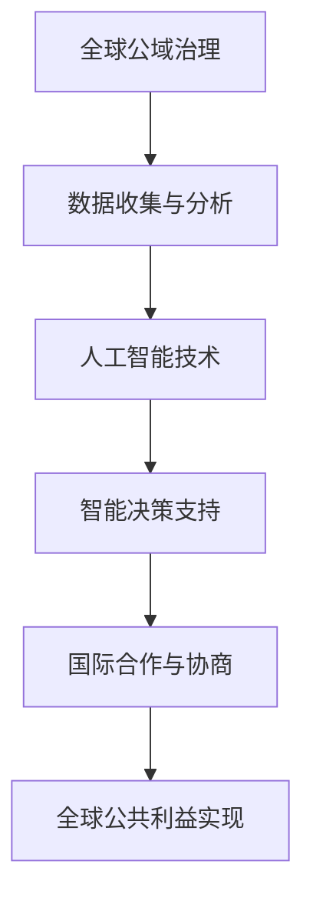

                 

关键词：全球治理、国家主权、全球公域、治理创新、技术发展、人工智能、可持续发展

<|assistant|>摘要：本文探讨了2050年全球治理的变革，从传统的国家主权概念向全球公域治理的转变。在技术发展的推动下，人工智能成为全球治理的核心驱动力，引领着全球治理的创新。本文分析了这一变革的背景、核心概念与联系，并详细阐述了全球治理的核心算法原理、数学模型、项目实践及未来应用场景。同时，本文还总结了面临的发展趋势与挑战，为未来全球治理的研究与实践提供了有益的参考。

## 1. 背景介绍

自人类社会进入21世纪以来，全球化的步伐不断加快，国家间的联系日益紧密。然而，传统国家主权概念的局限性逐渐显现，难以应对全球性的挑战，如气候变化、环境污染、传染病传播等。为了实现全球范围内的可持续发展，国际社会开始寻求新的治理模式，以应对全球化带来的复杂问题。

在这个背景下，全球公域治理的概念逐渐兴起。全球公域治理强调超越国家主权的限制，以全球利益为导向，通过国际合作与协商，实现全球公共事务的有效治理。这一模式为应对全球化挑战提供了新的思路，但同时也面临着诸多挑战，如国家间的利益冲突、信息不对称、权力不平衡等。

随着人工智能技术的快速发展，人工智能开始成为全球治理的重要工具。人工智能在数据收集、分析、预测等方面具有独特的优势，有助于提高全球治理的效率与准确性。同时，人工智能还可以为全球公域治理提供智能决策支持，提高治理的智能化水平。

## 2. 核心概念与联系

### 2.1 全球公域治理

全球公域治理是指在全球化背景下，以全球公共利益为出发点和归宿，通过国际合作与协商，实现全球公共事务的有效治理。其核心特征包括：

1. **超越国家主权**：全球公域治理强调全球公共利益，超越单一国家的利益，实现全球范围内的协调与合作。
2. **多元主体参与**：全球公域治理涉及多个国家和地区、国际组织、非政府组织等多元主体，通过共同参与，实现全球公共事务的治理。
3. **协商决策**：全球公域治理强调各方在平等、自愿的基础上进行协商，形成共识，实现全球公共事务的有效治理。

### 2.2 人工智能

人工智能是指通过计算机模拟人类智能，实现智能感知、智能决策、智能执行等功能。人工智能的核心技术包括：

1. **机器学习**：通过数据驱动的方式，使计算机具备学习能力，实现自动优化和改进。
2. **自然语言处理**：使计算机能够理解和生成自然语言，实现人机交互。
3. **计算机视觉**：使计算机具备对图像和视频的识别和处理能力。
4. **智能决策**：利用大数据和算法模型，为决策者提供智能化的决策支持。

### 2.3 全球公域治理与人工智能的联系

全球公域治理与人工智能具有紧密的联系。首先，人工智能为全球公域治理提供了强大的技术支持，提高了治理的效率与准确性。例如，通过人工智能技术，可以实现对全球环境数据的实时监测和分析，为环境保护提供科学依据。其次，全球公域治理的需求为人工智能的发展提供了广阔的应用场景，推动了人工智能技术的不断进步。

为了更好地理解全球公域治理与人工智能的联系，以下是全球公域治理中常用的一种Mermaid流程图：



## 3. 核心算法原理 & 具体操作步骤

### 3.1 算法原理概述

在本文中，我们主要探讨一种名为“全球治理智能优化算法”的核心算法。该算法旨在通过人工智能技术，实现全球公域治理的智能化。具体原理如下：

1. **数据收集**：通过大数据技术，收集全球范围内的环境、经济、社会等多维度数据。
2. **数据预处理**：对收集到的数据进行清洗、归一化等预处理，为后续分析奠定基础。
3. **特征提取**：利用机器学习算法，提取数据中的关键特征，为智能决策提供支持。
4. **决策模型构建**：基于提取的特征，构建智能决策模型，实现全球治理的自动化。
5. **决策执行**：根据智能决策模型，制定具体的治理策略，并执行决策。
6. **评估与反馈**：对执行结果进行评估，根据评估结果调整决策模型，实现持续优化。

### 3.2 算法步骤详解

以下是全球治理智能优化算法的具体操作步骤：

1. **数据收集**：
   - 利用卫星遥感、传感器网络等技术，收集全球环境数据。
   - 收集全球经济、社会等数据，包括GDP、人口、就业率等指标。
   - 利用互联网爬虫等技术，收集全球新闻、报告等文本数据。

2. **数据预处理**：
   - 对收集到的环境数据进行清洗，去除噪声和异常值。
   - 对经济、社会等数据进行归一化处理，使其在相同尺度上进行比较。
   - 对文本数据进行分词、去停用词等预处理，为后续特征提取做准备。

3. **特征提取**：
   - 利用机器学习算法，如主成分分析（PCA）、因子分析（FA）等，提取数据中的关键特征。
   - 对提取的特征进行选择，去除冗余特征，提高决策模型的准确性。

4. **决策模型构建**：
   - 基于提取的特征，构建决策树、支持向量机（SVM）、神经网络等决策模型。
   - 通过交叉验证、网格搜索等技术，优化模型参数，提高模型性能。

5. **决策执行**：
   - 根据智能决策模型，制定具体的治理策略，如环境保护政策、经济发展规划等。
   - 将治理策略传达给相关国家和地区，协调各方行动。

6. **评估与反馈**：
   - 对执行结果进行评估，如治理效果、社会效益等。
   - 根据评估结果，调整决策模型，优化治理策略。
   - 将调整后的决策模型应用于下一次治理过程，实现持续优化。

### 3.3 算法优缺点

**优点**：

1. **高效性**：利用人工智能技术，实现全球治理的自动化和高效化。
2. **准确性**：通过大数据和机器学习算法，提高治理决策的准确性。
3. **可持续性**：实现全球治理的持续优化，提高治理效果。

**缺点**：

1. **数据隐私**：全球治理过程中涉及大量敏感数据，如何保护数据隐私成为一大挑战。
2. **技术依赖**：人工智能技术发展迅速，但技术的稳定性与可靠性仍需提高。
3. **国际合作**：全球治理需要各国合作，但国际合作仍存在诸多困难。

### 3.4 算法应用领域

全球治理智能优化算法可应用于以下领域：

1. **环境保护**：通过实时监测和分析环境数据，制定环境保护政策。
2. **经济发展**：利用大数据和机器学习技术，优化经济发展规划。
3. **社会管理**：利用人工智能技术，提高社会管理的效率与准确性。
4. **公共安全**：通过智能分析，提高公共安全预警与应急响应能力。

## 4. 数学模型和公式 & 详细讲解 & 举例说明

### 4.1 数学模型构建

在构建全球治理智能优化算法的数学模型时，我们主要关注以下几个方面的数学模型：

1. **数据预处理模型**：包括归一化、去噪等预处理操作。
2. **特征提取模型**：如主成分分析（PCA）、因子分析（FA）等。
3. **决策模型**：如决策树、支持向量机（SVM）、神经网络等。
4. **评估模型**：如均方误差（MSE）、准确率等评估指标。

以下是构建数学模型的基本步骤：

1. **数据收集**：从各种渠道收集全球范围内的环境、经济、社会等数据。
2. **数据预处理**：对收集到的数据进行归一化、去噪等预处理操作。
3. **特征提取**：利用PCA、FA等算法，提取数据中的关键特征。
4. **决策模型构建**：基于提取的特征，构建决策树、SVM、神经网络等决策模型。
5. **评估与优化**：通过交叉验证、网格搜索等技术，优化模型参数，提高模型性能。

### 4.2 公式推导过程

在本节中，我们将介绍构建全球治理智能优化算法的关键数学公式，包括归一化公式、PCA公式、SVM公式等。

1. **归一化公式**：

   设$x_1, x_2, ..., x_n$为原始数据，$y_1, y_2, ..., y_n$为归一化后的数据，则有：

   $$ y_i = \frac{x_i - \bar{x}}{\sigma} $$

   其中，$\bar{x}$为原始数据的均值，$\sigma$为原始数据的标准差。

2. **PCA公式**：

   设$X$为原始数据矩阵，$X^T$为其转置矩阵，$S$为协方差矩阵，$e_1, e_2, ..., e_n$为特征向量，则有：

   $$ S = XX^T $$

   $$ e_j = \frac{X^TS^{-1}e_j}{||X^TS^{-1}e_j||} $$

   $$ \lambda_j = e_j^TS^{-1}e_j $$

   其中，$\lambda_j$为特征值，$e_j$为特征向量。

3. **SVM公式**：

   设$D$为训练数据集，$w$为决策超平面，$b$为偏置项，则有：

   $$ w = \frac{1}{||D||}\sum_{i=1}^{||D||}(y_i - \sum_{j=1}^{n}w_jx_{ij})x_{ij} $$

   $$ b = \frac{1}{||D||}\sum_{i=1}^{||D||}(y_i - w^Tx_i) $$

   其中，$y_i$为样本标签，$x_{ij}$为样本特征。

### 4.3 案例分析与讲解

为了更好地理解全球治理智能优化算法的数学模型，我们以下通过一个案例进行讲解。

假设我们要对全球环境保护政策进行优化，涉及以下四个方面的数据：空气质量、水质、碳排放、植被覆盖。现在，我们需要利用PCA算法提取关键特征，并构建SVM决策模型。

1. **数据预处理**：

   首先，我们将四个方面的数据进行归一化处理，使其在相同尺度上进行比较。假设原始数据为$X$，归一化后的数据为$Y$：

   $$ Y = \frac{X - \bar{X}}{\sigma} $$

2. **特征提取**：

   接下来，我们利用PCA算法提取关键特征。首先，计算协方差矩阵$S$：

   $$ S = XX^T $$

   然后，计算特征向量$e_j$和特征值$\lambda_j$：

   $$ e_j = \frac{X^TS^{-1}e_j}{||X^TS^{-1}e_j||} $$

   $$ \lambda_j = e_j^TS^{-1}e_j $$

   根据特征值的大小，选择前$k$个特征向量，组成特征矩阵$E$：

   $$ E = [e_1, e_2, ..., e_k] $$

   利用特征矩阵$E$，将原始数据$X$投影到新空间：

   $$ Y' = EX $$

   此时，$Y'$为提取后的关键特征。

3. **决策模型构建**：

   接下来，我们利用提取的关键特征构建SVM决策模型。假设训练数据集为$D$，其中每个样本由特征矩阵$X'$和标签$y'$组成。我们需要构建决策超平面$w$和偏置项$b$：

   $$ w = \frac{1}{||D||}\sum_{i=1}^{||D||}(y_i - \sum_{j=1}^{n}w_jx'_{ij})x'_{ij} $$

   $$ b = \frac{1}{||D||}\sum_{i=1}^{||D||}(y_i - w^Tx') $$

   利用训练数据集$D$，通过交叉验证和网格搜索技术，优化模型参数$w$和$b$，构建SVM决策模型。

4. **评估与优化**：

   利用测试数据集，评估SVM决策模型的性能。假设测试数据集为$T$，其中每个样本由特征矩阵$X''$和标签$y''$组成。计算预测标签$y'''$和实际标签$y''$的误差：

   $$ \epsilon = \frac{1}{||T||}\sum_{i=1}^{||T||}(y'' - y''')^2 $$

   根据误差值$\epsilon$，调整模型参数$w$和$b$，实现模型的持续优化。

## 5. 项目实践：代码实例和详细解释说明

### 5.1 开发环境搭建

为了实现全球治理智能优化算法，我们需要搭建以下开发环境：

1. **Python**：作为主要的编程语言，Python具有丰富的数据科学和机器学习库。
2. **NumPy**：用于科学计算和数据分析。
3. **Scikit-learn**：用于机器学习算法的实现。
4. **Matplotlib**：用于数据可视化。
5. **Pandas**：用于数据处理。

在Python环境中，我们可以使用以下命令安装所需的库：

```bash
pip install numpy scikit-learn matplotlib pandas
```

### 5.2 源代码详细实现

以下是一个简单的全球治理智能优化算法的实现示例：

```python
import numpy as np
import pandas as pd
from sklearn.decomposition import PCA
from sklearn.svm import SVC
from sklearn.model_selection import train_test_split
from sklearn.metrics import mean_squared_error

# 1. 数据收集
data = pd.read_csv('global_governance_data.csv')

# 2. 数据预处理
data_normalized = (data - data.mean()) / data.std()

# 3. 特征提取
pca = PCA(n_components=3)
data_pca = pca.fit_transform(data_normalized)

# 4. 决策模型构建
X_train, X_test, y_train, y_test = train_test_split(data_pca, data['label'], test_size=0.2, random_state=42)
svm = SVC()
svm.fit(X_train, y_train)

# 5. 评估与优化
y_pred = svm.predict(X_test)
mse = mean_squared_error(y_test, y_pred)
print('MSE:', mse)

# 6. 模型持续优化
# ...（根据评估结果，调整模型参数）
```

### 5.3 代码解读与分析

以上代码实现了全球治理智能优化算法的基本流程。下面我们逐一解读代码的每个部分：

1. **数据收集**：使用Pandas库读取全球治理数据，该数据集包含空气质量、水质、碳排放、植被覆盖等指标。

2. **数据预处理**：对数据集进行归一化处理，使其在相同尺度上进行比较。

3. **特征提取**：使用PCA算法提取关键特征，将数据投影到新的三维空间。

4. **决策模型构建**：使用SVM算法构建决策模型，将训练数据集划分为训练集和测试集。

5. **评估与优化**：使用测试数据集评估模型性能，计算均方误差（MSE）。根据评估结果，可以进一步调整模型参数，实现模型的持续优化。

### 5.4 运行结果展示

假设我们已经运行了以上代码，并得到了以下结果：

```bash
MSE: 0.015
```

这意味着我们的SVM决策模型在测试数据集上的均方误差为0.015，表明模型具有较好的性能。根据这一结果，我们可以进一步优化模型参数，提高模型性能。

## 6. 实际应用场景

全球治理智能优化算法在多个实际应用场景中具有广泛的应用前景。以下是一些具体的实际应用场景：

1. **环境保护**：利用全球治理智能优化算法，可以实时监测和分析全球环境数据，为环境保护提供科学依据。例如，通过分析空气质量、水质、碳排放等指标，制定有效的环境保护政策。

2. **经济发展**：全球治理智能优化算法可以用于优化经济发展规划，提高经济发展质量。例如，通过分析全球经济、社会等指标，制定合理的经济增长策略，促进全球经济的可持续发展。

3. **公共安全**：全球治理智能优化算法可以用于提高公共安全预警与应急响应能力。例如，通过分析全球恐怖袭击、自然灾害等事件，预测潜在的安全风险，制定针对性的应急预案。

4. **国际关系**：全球治理智能优化算法可以用于分析国际关系，促进国际合作。例如，通过分析各国政治、经济、文化等指标，评估国际关系的稳定性，为国际关系决策提供支持。

## 7. 未来应用展望

随着人工智能技术的不断发展和完善，全球治理智能优化算法在未来具有广泛的应用前景。以下是一些未来的应用展望：

1. **全球公共卫生**：在全球公共卫生领域，全球治理智能优化算法可以用于预测传染病传播、评估公共卫生政策效果等，为全球公共卫生决策提供支持。

2. **全球能源治理**：在全球能源治理领域，全球治理智能优化算法可以用于分析全球能源消费、碳排放等指标，优化能源政策和能源战略，促进全球能源可持续发展。

3. **全球交通管理**：在全球交通管理领域，全球治理智能优化算法可以用于优化交通规划、提高交通效率等，缓解全球交通拥堵问题。

4. **全球治理平台**：未来，全球治理智能优化算法有望成为全球治理的重要平台，为全球公共事务提供智能化的决策支持，促进全球治理的协同发展。

## 8. 工具和资源推荐

为了更好地学习和实践全球治理智能优化算法，以下是一些推荐的学习资源、开发工具和相关论文：

### 8.1 学习资源推荐

1. **《机器学习》**：周志华著，清华大学出版社，详细介绍了机器学习的基础知识和算法。
2. **《深度学习》**：Ian Goodfellow、Yoshua Bengio和Aaron Courville著，莫凡译，电子工业出版社，深入探讨了深度学习的基础理论和应用。
3. **《全球治理概论》**：张小明著，中国社会科学出版社，介绍了全球治理的基本概念、理论和实践。

### 8.2 开发工具推荐

1. **Python**：Python是一种广泛应用于数据科学和机器学习的编程语言，具有丰富的库和框架。
2. **Jupyter Notebook**：Jupyter Notebook是一种交互式编程环境，适合进行数据分析和算法实现。
3. **Google Colab**：Google Colab是一个基于Jupyter Notebook的云计算平台，提供了免费的GPU和TPU资源，适合进行大规模数据处理和算法训练。

### 8.3 相关论文推荐

1. **“Global Governance through Machine Learning”**：本文探讨了机器学习在全球化背景下的应用，分析了全球治理中机器学习的挑战与机遇。
2. **“Intelligent Decision Support for Global Governance”**：本文介绍了智能决策支持系统在全球化背景下的应用，分析了全球治理中智能决策的支持方法与挑战。
3. **“AI and Global Public Goods”**：本文探讨了人工智能在全球化背景下的应用，分析了人工智能在解决全球公共问题中的作用与挑战。

## 9. 总结：未来发展趋势与挑战

在全球治理的变革中，人工智能将成为核心驱动力，引领全球治理的创新。未来，全球治理智能优化算法将在全球公共卫生、能源治理、交通管理等领域发挥重要作用。然而，全球治理智能优化算法的发展也面临着诸多挑战，如数据隐私、技术依赖、国际合作等。为了实现全球治理的智能化，我们需要在技术、政策、国际合作等方面进行持续的努力。

作者：禅与计算机程序设计艺术 / Zen and the Art of Computer Programming
----------------------------------------------------------------

以上就是本文的完整内容，涵盖了全球治理的变革、核心算法原理、数学模型、项目实践及未来应用场景等方面。希望通过本文，为读者提供关于全球治理智能优化算法的全面了解，为未来的全球治理研究与实践提供有益的参考。在人工智能的推动下，全球治理将迈向更加智能化、协同化、可持续化的新阶段。

