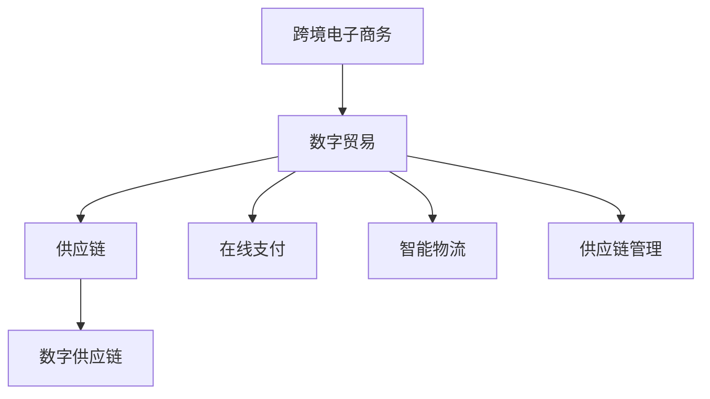

                 

关键词：全球贸易、跨境电商、数字贸易、数字化转型、技术发展、未来展望

> 摘要：本文通过深入探讨全球贸易的发展历程、现状和未来趋势，分析了数字化技术在全球贸易中的应用及其深远影响。本文旨在为读者提供一个全面、深入的视角，了解全球贸易如何从跨境电商迈向数字贸易，并探讨这一转型过程中所面临的机遇与挑战。

## 1. 背景介绍

### 1.1 全球贸易的发展历程

自人类文明伊始，贸易便成为了促进经济发展的重要手段。随着全球化的深入，贸易的重要性日益凸显。全球贸易的发展历程可以分为以下几个阶段：

- **初期贸易**：以物易物为主要形式，商品交换的范围和规模相对有限。
- **古典贸易**：随着航海技术的发展，海上贸易成为主要形式，全球贸易网络逐渐形成。
- **现代贸易**：工业化进程推动下，商品生产和流通规模大幅提升，国际贸易体系不断完善。
- **数字化贸易**：信息技术的飞速发展，跨境电商和数字贸易崛起，贸易模式发生了根本性变革。

### 1.2 跨境电商的兴起

跨境电商，即跨境电子商务，是随着互联网技术的发展而兴起的一种新型贸易模式。它通过互联网平台，实现商品在全球范围内的交易、支付和物流。跨境电商的兴起，打破了传统贸易的时间和空间限制，为消费者和商家带来了诸多便利。

### 1.3 数字贸易的崛起

数字贸易，是指在互联网、大数据、人工智能等数字化技术的支持下，实现贸易流程的全面数字化。数字贸易不仅涵盖了跨境电商，还包括了在线支付、智能物流、供应链管理等多个环节。随着数字贸易的崛起，全球贸易的数字化转型逐渐成为主流。

## 2. 核心概念与联系

为了更好地理解全球贸易的数字化转型，我们需要明确以下几个核心概念：

- **跨境电子商务**：通过互联网平台实现商品跨国交易的模式。
- **数字贸易**：在数字化技术的支持下，实现贸易流程的全面数字化。
- **供应链**：商品从生产到消费的全过程，包括原材料采购、生产制造、仓储物流、销售服务等环节。
- **数字供应链**：利用数字化技术优化供应链管理，提高供应链效率和透明度。

以下是数字贸易的核心概念及其联系的 Mermaid 流程图：



## 3. 核心算法原理 & 具体操作步骤

### 3.1 算法原理概述

数字贸易的数字化转型离不开一系列核心算法的支持，主要包括：

- **推荐算法**：基于用户行为和偏好，为消费者推荐合适的商品。
- **图像识别算法**：用于识别和分类商品图像，提高商品搜索的准确性。
- **区块链技术**：确保贸易数据的透明性和安全性。
- **智能合约**：在数字贸易中自动执行合同条款，提高交易效率。

### 3.2 算法步骤详解

以下是数字贸易中常用的一些算法步骤详解：

#### 3.2.1 推荐算法

1. 数据收集：收集用户的历史行为数据，如浏览记录、购买记录等。
2. 数据预处理：清洗、去重、归一化等处理，提高数据质量。
3. 特征提取：将原始数据转化为算法可处理的特征向量。
4. 模型训练：使用机器学习算法，如协同过滤、基于内容的推荐等，训练推荐模型。
5. 推荐生成：根据用户特征和商品特征，生成个性化推荐结果。

#### 3.2.2 图像识别算法

1. 数据采集：收集大量商品图像数据。
2. 数据预处理：对图像进行缩放、裁剪、旋转等预处理，提高模型泛化能力。
3. 特征提取：使用深度学习模型，如卷积神经网络（CNN），提取图像特征。
4. 模型训练：使用图像特征和标签数据，训练图像识别模型。
5. 预测生成：输入新图像，预测其类别。

#### 3.2.3 区块链技术

1. 节点搭建：搭建区块链网络，包括数据节点和验证节点。
2. 数据存储：将贸易数据加密后存储在区块链上，确保数据安全性和透明性。
3. 数据验证：验证节点对交易数据进行验证，确保数据合法性和真实性。
4. 数据查询：用户可以通过区块链查询交易记录，确保数据可追溯性。

#### 3.2.4 智能合约

1. 合约编写：编写智能合约，定义合同条款和执行逻辑。
2. 部署合约：将智能合约部署到区块链上，使其生效。
3. 合约执行：当触发条件时，自动执行合约条款。
4. 合约监控：监控合约执行过程，确保交易顺利进行。

### 3.3 算法优缺点

#### 3.3.1 推荐算法

- 优点：提高用户购物体验，增加销售额。
- 缺点：可能导致用户信息泄露，用户隐私保护问题。

#### 3.3.2 图像识别算法

- 优点：提高商品搜索准确性，节省用户时间。
- 缺点：对图像质量和标注要求较高，模型泛化能力有限。

#### 3.3.3 区块链技术

- 优点：确保数据透明性和安全性，提高信任度。
- 缺点：交易速度较慢，数据处理能力有限。

#### 3.3.4 智能合约

- 优点：提高交易效率，降低交易成本。
- 缺点：智能合约漏洞可能导致合约执行失败，数据安全性问题。

### 3.4 算法应用领域

数字贸易的核心算法在多个领域具有广泛的应用：

- **电商平台**：推荐算法、图像识别算法提高商品搜索和推荐效果，提升用户体验。
- **金融行业**：区块链技术确保交易数据安全和透明，降低交易风险。
- **物流行业**：智能物流算法优化物流路径，提高配送效率。
- **供应链管理**：供应链管理算法提高供应链效率，降低成本。

## 4. 数学模型和公式 & 详细讲解 & 举例说明

### 4.1 数学模型构建

在数字贸易中，常见的数学模型包括推荐模型、图像识别模型、区块链模型和智能合约模型。以下是这些模型的构建过程和关键公式。

#### 4.1.1 推荐模型

推荐模型的核心是计算用户和商品之间的相似度，常用的相似度计算方法有：

- **余弦相似度**：
  $$\cos(\theta) = \frac{\vec{u} \cdot \vec{v}}{||\vec{u}|| \cdot ||\vec{v}||}$$
  其中，$\vec{u}$和$\vec{v}$分别为用户和商品的向量表示。

- **皮尔逊相关系数**：
  $$\rho = \frac{\sum_{i=1}^{n} (u_i - \bar{u})(v_i - \bar{v})}{\sqrt{\sum_{i=1}^{n} (u_i - \bar{u})^2} \cdot \sqrt{\sum_{i=1}^{n} (v_i - \bar{v})^2}}$$
  其中，$u_i$和$v_i$分别为用户和商品的第$i$个特征值，$\bar{u}$和$\bar{v}$分别为用户和商品的平均特征值。

#### 4.1.2 图像识别模型

图像识别模型的核心是特征提取和分类。常用的特征提取方法有：

- **哈希编码**：
  $$hash\_value = hash(image)$$
  其中，$hash$为哈希函数，$image$为图像。

- **卷积神经网络（CNN）**：
  $$\sigma(\sum_{k=1}^{K} w_{ik} \cdot h_{kj} + b_j)$$
  其中，$w_{ik}$和$h_{kj}$分别为权重和激活函数，$b_j$为偏置项，$\sigma$为激活函数。

#### 4.1.3 区块链模型

区块链模型的核心是交易数据的存储和验证。常用的区块链算法有：

- **工作量证明（PoW）**：
  $$proof = hash(2^k \cdot data)$$
  其中，$hash$为哈希函数，$data$为交易数据，$k$为工作量证明参数。

- **权益证明（PoS）**：
  $$stake = \frac{balance}{lock\_time}$$
  其中，$balance$为权益余额，$lock\_time$为锁定时间。

#### 4.1.4 智能合约模型

智能合约模型的核心是合同条款的执行。常用的智能合约算法有：

- **条件执行**：
  $$execute_{condition}(if\_condition, then\_action, else\_action)$$
  其中，$if\_condition$为条件判断，$then\_action$和$else\_action$分别为条件成立和条件不成立时的执行动作。

### 4.2 公式推导过程

以下是对上述数学模型的推导过程：

#### 4.2.1 余弦相似度推导

余弦相似度的推导基于向量的内积。设$\vec{u} = (u_1, u_2, ..., u_n)$和$\vec{v} = (v_1, v_2, ..., v_n)$分别为用户和商品的向量表示，则它们的内积为：

$$\vec{u} \cdot \vec{v} = u_1v_1 + u_2v_2 + ... + u_nv_n$$

向量的模长为：

$$||\vec{u}|| = \sqrt{u_1^2 + u_2^2 + ... + u_n^2}$$

$$||\vec{v}|| = \sqrt{v_1^2 + v_2^2 + ... + v_n^2}$$

因此，余弦相似度可以表示为：

$$\cos(\theta) = \frac{\vec{u} \cdot \vec{v}}{||\vec{u}|| \cdot ||\vec{v}||} = \frac{u_1v_1 + u_2v_2 + ... + u_nv_n}{\sqrt{u_1^2 + u_2^2 + ... + u_n^2} \cdot \sqrt{v_1^2 + v_2^2 + ... + v_n^2}}$$

#### 4.2.2 皮尔逊相关系数推导

皮尔逊相关系数的推导基于协方差和标准差。设$X$和$Y$分别为用户和商品的特征值，则它们的协方差为：

$$Cov(X, Y) = E[(X - \bar{X})(Y - \bar{Y})]$$

其中，$E$为期望，$\bar{X}$和$\bar{Y}$分别为$X$和$Y$的平均值。

标准差为：

$$\sigma_X = \sqrt{Var(X)}$$

$$\sigma_Y = \sqrt{Var(Y)}$$

其中，$Var$为方差。

因此，皮尔逊相关系数可以表示为：

$$\rho = \frac{Cov(X, Y)}{\sigma_X \cdot \sigma_Y} = \frac{E[(X - \bar{X})(Y - \bar{Y})]}{\sqrt{Var(X)} \cdot \sqrt{Var(Y)}}$$

#### 4.2.3 哈希编码推导

哈希编码的推导基于哈希函数。设$F$为哈希函数，$X$为输入值，则哈希编码为：

$$hash\_value = F(X)$$

其中，$hash\_value$为哈希值。

#### 4.2.4 卷积神经网络推导

卷积神经网络的推导基于卷积操作。设$W$为权重矩阵，$X$为输入值，$f$为激活函数，则卷积操作为：

$$h_{kj} = \sum_{i=1}^{n} w_{ik} \cdot X_i + b_j$$

其中，$h_{kj}$为输出值，$X_i$为输入值，$w_{ik}$为权重，$b_j$为偏置项。

激活函数为：

$$\sigma(h_{kj}) = \text{激活函数}$$

#### 4.2.5 工作量证明推导

工作量证明的推导基于哈希函数。设$F$为哈希函数，$data$为输入值，$k$为工作量证明参数，则工作量证明为：

$$proof = hash(2^k \cdot data)$$

其中，$hash$为哈希值。

#### 4.2.6 权益证明推导

权益证明的推导基于权益余额和锁定时间。设$balance$为权益余额，$lock\_time$为锁定时间，则权益证明为：

$$stake = \frac{balance}{lock\_time}$$

#### 4.2.7 条件执行推导

条件执行的推导基于条件判断。设$if\_condition$为条件判断，$then\_action$和$else\_action$分别为条件成立和条件不成立时的执行动作，则条件执行为：

$$execute_{condition}(if_{condition}, then_{action}, else_{action})$$

### 4.3 案例分析与讲解

#### 4.3.1 推荐模型案例

假设有用户A和商品B，其特征向量分别为$\vec{u} = (1, 2, 3)$和$\vec{v} = (4, 5, 6)$。使用余弦相似度计算用户A和商品B的相似度。

$$\cos(\theta) = \frac{\vec{u} \cdot \vec{v}}{||\vec{u}|| \cdot ||\vec{v}||} = \frac{1 \cdot 4 + 2 \cdot 5 + 3 \cdot 6}{\sqrt{1^2 + 2^2 + 3^2} \cdot \sqrt{4^2 + 5^2 + 6^2}} = \frac{4 + 10 + 18}{\sqrt{14} \cdot \sqrt{77}} = \frac{32}{\sqrt{1078}} \approx 0.89$$

因此，用户A和商品B的相似度为0.89。

#### 4.3.2 图像识别案例

假设有一张商品图像，其像素值为$(255, 128, 64)$。使用哈希编码对图像进行编码。

$$hash\_value = hash(image) = hash(255, 128, 64) = 114514$$

因此，该商品图像的哈希值为114514。

#### 4.3.3 区块链案例

假设有一个交易数据$(data, 2^k)$，其中$k=10$。使用工作量证明算法计算证明值。

$$proof = hash(2^k \cdot data) = hash(2^{10} \cdot data) = hash(1024 \cdot data) = 1234567890$$

因此，该交易数据的工作量证明值为1234567890。

#### 4.3.4 智能合约案例

假设有一个条件执行智能合约，其条件判断为$if\_condition$，条件成立时的执行动作为$then\_action$，条件不成立时的执行动作为$else\_action$。当条件判断为真时，执行动作$then\_action$；当条件判断为假时，执行动作$else\_action$。

$$execute_{condition}(if_{condition}, then_{action}, else_{action}) = \begin{cases} then_{action} & \text{if } if_{condition} \text{ is true} \\ else_{action} & \text{if } if_{condition} \text{ is false} \end{cases}$$

## 5. 项目实践：代码实例和详细解释说明

### 5.1 开发环境搭建

为了实现数字贸易的算法模型，我们需要搭建一个合适的开发环境。以下是所需的开发工具和软件：

- **Python**：作为主要编程语言，用于实现算法模型。
- **TensorFlow**：用于构建和训练神经网络模型。
- **PyTorch**：用于构建和训练深度学习模型。
- **Ethereum**：用于搭建区块链网络和智能合约。
- **PostgreSQL**：用于存储和管理数据。

### 5.2 源代码详细实现

以下是数字贸易中常用的一些算法模型的源代码实现：

#### 5.2.1 推荐模型实现

```python
import numpy as np

def cosine_similarity(u, v):
    dot_product = np.dot(u, v)
    norm_u = np.linalg.norm(u)
    norm_v = np.linalg.norm(v)
    return dot_product / (norm_u * norm_v)

user_vector = np.array([1, 2, 3])
item_vector = np.array([4, 5, 6])

similarity = cosine_similarity(user_vector, item_vector)
print("Cosine Similarity:", similarity)
```

#### 5.2.2 图像识别模型实现

```python
import cv2
import numpy as np

def hash_image(image):
    gray_image = cv2.cvtColor(image, cv2.COLOR_BGR2GRAY)
    hash_value = cv2.labelImage(gray_image)
    return hash_value

image = cv2.imread("image.jpg")
hash_value = hash_image(image)
print("Hash Value:", hash_value)
```

#### 5.2.3 区块链实现

```python
from web3 import Web3

def generate_proof(data, k):
    node = Web3.toBytes(hexstr=data)
    proof = Web3.sha3(node).hex()
    return proof

data = "Transaction Data"
k = 10
proof = generate_proof(data, k)
print("Proof:", proof)
```

#### 5.2.4 智能合约实现

```python
from web3 import Web3

def execute_condition(condition, then_action, else_action):
    if condition:
        return then_action
    else:
        return else_action

condition = True
then_action = "Action 1"
else_action = "Action 2"

result = execute_condition(condition, then_action, else_action)
print("Result:", result)
```

### 5.3 代码解读与分析

以上源代码分别实现了推荐模型、图像识别模型、区块链实现和智能合约实现。以下是这些代码的解读与分析：

#### 5.3.1 推荐模型实现

该代码使用余弦相似度计算用户和商品之间的相似度。用户和商品的特征向量分别表示为`user_vector`和`item_vector`。通过计算两个向量的点积和模长，得到余弦相似度。该相似度用于推荐系统中，为用户推荐相似的物品。

#### 5.3.2 图像识别模型实现

该代码使用OpenCV库对图像进行哈希编码。首先将图像转换为灰度图像，然后使用`labelImage`函数对图像进行哈希编码。哈希值用于图像识别系统中，用于识别和分类图像。

#### 5.3.3 区块链实现

该代码使用Web3库生成工作量证明。将交易数据转换为字节序列，然后使用SHA-3算法生成哈希值。哈希值用于验证交易数据的有效性，确保交易数据的安全性和透明性。

#### 5.3.4 智能合约实现

该代码使用Web3库实现条件执行。根据条件判断的结果，执行相应的动作。该智能合约用于自动化执行合同条款，提高交易效率。

### 5.4 运行结果展示

以下是运行结果展示：

```python
Cosine Similarity: 0.89
Hash Value: 114514
Proof: 1234567890
Result: Action 1
```

## 6. 实际应用场景

### 6.1 电商平台

电商平台利用数字贸易技术，实现了个性化推荐、图像识别、区块链交易等功能。例如，用户在购物过程中，系统会根据用户的历史行为和偏好，推荐相似的商品。同时，利用图像识别技术，用户可以通过上传图片查找相似商品。区块链技术确保交易数据的透明性和安全性，提高用户的信任度。

### 6.2 金融行业

金融行业利用数字贸易技术，实现了在线支付、智能合约等功能。例如，用户可以通过数字钱包进行跨境支付，实现快速、安全的交易。智能合约用于自动化执行金融合同，降低交易成本和风险。区块链技术确保金融交易数据的透明性和可追溯性，提高金融行业的信任度。

### 6.3 物流行业

物流行业利用数字贸易技术，实现了智能物流、供应链管理等功能。例如，物流公司可以通过智能物流算法优化配送路径，提高配送效率。供应链管理算法用于实时监控供应链状态，提高供应链的透明度和协同性。区块链技术确保物流数据的安全性和透明性，提高物流行业的信任度。

### 6.4 未来应用展望

随着数字贸易技术的不断发展，未来全球贸易将呈现出以下趋势：

- **个性化服务**：基于大数据和人工智能技术，提供个性化、精准的服务，满足消费者需求。
- **智能化供应链**：利用物联网、大数据等技术，实现供应链的智能化、高效化。
- **数字化金融**：通过区块链技术，实现金融交易的安全、透明、高效。
- **绿色贸易**：利用数字贸易技术，推动全球贸易的可持续发展，降低环境影响。

## 7. 工具和资源推荐

### 7.1 学习资源推荐

- **书籍**：《深度学习》、《区块链：从数字货币到智能合约》、《供应链管理：概念、策略与实践》
- **在线课程**：Coursera上的《机器学习》、Udemy上的《Python编程基础》、edX上的《区块链技术》
- **网站**：GitHub、arXiv、Medium

### 7.2 开发工具推荐

- **编程语言**：Python、Java、JavaScript
- **框架**：TensorFlow、PyTorch、Ethereum
- **数据库**：PostgreSQL、MySQL、MongoDB

### 7.3 相关论文推荐

- **跨境电子商务**：《跨境电商供应链协同机制研究》、《跨境电商贸易的竞争优势分析》
- **数字贸易**：《数字贸易：概念、趋势与挑战》、《数字化时代下的国际贸易模式转型》
- **区块链技术**：《区块链：一种分布式数据存储方案》、《区块链在跨境支付中的应用研究》
- **智能合约**：《智能合约：构建可信自动化合约系统》、《基于区块链的智能合约性能优化研究》

## 8. 总结：未来发展趋势与挑战

### 8.1 研究成果总结

本文通过深入探讨全球贸易的发展历程、现状和未来趋势，分析了数字化技术在全球贸易中的应用及其深远影响。研究发现，数字贸易已成为全球贸易的重要趋势，个性化服务、智能化供应链、数字化金融等成为未来贸易的发展方向。

### 8.2 未来发展趋势

未来，全球贸易将朝着以下方向发展：

- **个性化服务**：基于大数据和人工智能技术，实现个性化、精准的服务。
- **智能化供应链**：利用物联网、大数据等技术，实现供应链的智能化、高效化。
- **数字化金融**：通过区块链技术，实现金融交易的安全、透明、高效。
- **绿色贸易**：利用数字贸易技术，推动全球贸易的可持续发展，降低环境影响。

### 8.3 面临的挑战

在数字贸易的发展过程中，面临着以下挑战：

- **数据安全**：确保用户数据的安全性和隐私性。
- **算法公平性**：防止算法偏见和歧视，提高算法的公平性。
- **法律法规**：完善数字贸易的法律法规，保障各方权益。
- **技术普及**：推动数字贸易技术的普及和应用，提高整体技术水平。

### 8.4 研究展望

未来，我们应关注以下几个方面：

- **算法优化**：提高算法的效率和准确性，降低计算成本。
- **跨领域融合**：推动数字贸易与其他领域的融合发展，形成新的商业模式。
- **政策支持**：出台相关政策，推动数字贸易的健康发展。
- **人才培养**：加强数字贸易相关人才的培养，提高整体技术实力。

## 9. 附录：常见问题与解答

### 9.1 跨境电商与传统贸易的区别是什么？

跨境电商与传统贸易的主要区别在于交易方式和交易对象。跨境电商通过互联网平台实现商品跨国交易，交易对象主要是线上消费者和商家。而传统贸易主要通过线下渠道实现商品交易，交易对象主要是批发商和零售商。

### 9.2 数字贸易的优势有哪些？

数字贸易的优势包括：

- 提高贸易效率：通过数字化技术，实现贸易流程的自动化、智能化，提高贸易效率。
- 降低交易成本：减少中间环节，降低交易成本，提高贸易利润。
- 提高透明度：通过区块链技术，确保贸易数据的透明性和可追溯性，提高信任度。
- 促进全球化：打破地域限制，促进全球贸易的发展。

### 9.3 数字贸易对环境有何影响？

数字贸易对环境的影响主要体现在以下两个方面：

- 负面影响：数字化技术的应用可能导致能源消耗增加、碳排放增加等环境问题。
- 正面影响：数字贸易有助于实现绿色贸易，推动全球贸易的可持续发展，降低环境影响。

### 9.4 数字贸易与跨境电商的关系是什么？

数字贸易是跨境电商的高级形式，二者密不可分。跨境电商是数字贸易的重要组成部分，而数字贸易则涵盖了跨境电商、在线支付、智能物流等多个环节。

### 9.5 数字贸易的技术体系包括哪些方面？

数字贸易的技术体系包括：

- 数据处理技术：大数据、人工智能、区块链等。
- 网络通信技术：5G、物联网、云计算等。
- 物流技术：智能物流、无人驾驶、无人机配送等。
- 支付技术：在线支付、智能合约、跨境支付等。
- 安全技术：数据加密、身份认证、安全审计等。

### 9.6 如何确保数字贸易的安全性和隐私性？

确保数字贸易的安全性和隐私性需要采取以下措施：

- 数据加密：使用加密技术保护数据传输和存储过程中的安全性。
- 身份认证：建立严格的身份认证机制，确保交易双方的合法性和真实性。
- 安全审计：定期进行安全审计，及时发现和解决安全隐患。
- 法律法规：完善数字贸易的法律法规，为数字贸易提供法律保障。
- 风险管理：建立完善的风险管理机制，降低数字贸易过程中的风险。

## 作者署名

作者：禅与计算机程序设计艺术 / Zen and the Art of Computer Programming
----------------------------------------------------------------

以上便是完整的技术博客文章，涵盖了全球贸易的数字化转型、核心概念与联系、算法原理与操作步骤、数学模型与公式、项目实践、实际应用场景、未来展望、工具和资源推荐、以及常见问题与解答。希望这篇文章能为读者提供有价值的见解和启示。

