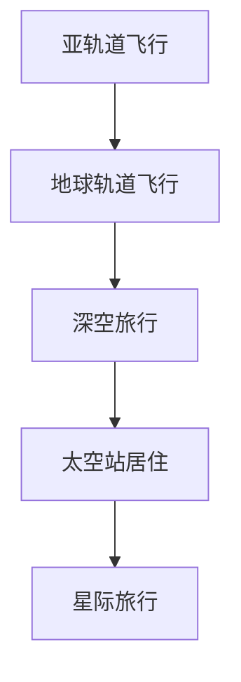

                 

关键词：太空旅游，星际移民，太空经济发展，太空科技，未来展望

> 摘要：随着太空科技的不断进步，2050年的太空旅游将不仅仅限于太空观光，更可能发展为一种全新的生活方式——星际移民。本文将探讨太空旅游的核心概念、发展趋势、数学模型、算法原理、项目实践，以及未来应用场景，旨在为读者展示太空旅游从科幻走向现实的宏伟蓝图。

## 1. 背景介绍

自20世纪中叶人类首次进入太空以来，太空探索一直充满了神秘与挑战。随着苏联的航天员加加林在1961年乘坐东方1号飞船成功进入太空，人类对宇宙的渴望与探索精神被进一步激发。从那时起，太空探索活动逐渐成为全球科技竞争的重要领域。

早期的太空探索主要集中在卫星发射和载人航天任务，如美国的阿波罗计划、苏联的东方计划等。然而，随着技术的不断进步，人类对太空的兴趣不仅局限于科学实验和军事目的，太空旅游逐渐成为新的发展方向。2011年，维珍银河公司宣布其太空旅游项目，声称将在未来几年内开始商业太空旅游服务，这标志着太空旅游正式进入大众视野。

太空旅游的概念不仅限于乘坐亚轨道飞行器进行短暂的太空体验，更包括深空探险、太空站居住以及潜在的星际旅行。这些活动不仅需要先进的科技支持，还涉及到复杂的系统工程、安全标准和经济效益等多个方面。

## 2. 核心概念与联系

### 2.1 太空旅游的五大核心概念

- **亚轨道飞行**：亚轨道飞行器在离地面几十公里的高空飞行，但未达到地球轨道的高度。这类飞行通常持续几分钟，乘客能够体验到短暂的失重状态和看到地球的全貌。

- **地球轨道飞行**：地球轨道飞行器将乘客送入地球轨道，乘客可以在太空中漂浮几小时到几天不等。这一阶段涉及到更多的太空科技，如推进系统、生命支持系统等。

- **深空旅行**：深空旅行是指前往月球、火星或其他天体的探险活动。这类旅行需要更加复杂的飞行器和生命支持系统，涉及到长时间的太空生存和深空探测。

- **太空站居住**：太空站居住是指在空间站内进行长期居住和工作。这需要解决太空辐射、心理适应、物资供应等一系列问题。

- **星际旅行**：星际旅行是指从地球到其他星系的旅行，这将是人类太空探索的终极目标。目前，这一领域仍处于理论研究阶段，但未来有望通过大型星际飞船和核推进技术实现。

### 2.2 太空旅游的Mermaid流程图



### 2.3 核心概念之间的联系

亚轨道飞行是太空旅游的起点，它为乘客提供了初次的太空体验。地球轨道飞行进一步扩展了乘客的太空活动范围，使他们能够停留在地球轨道上，体验更长时间的失重状态。深空旅行和太空站居住则是对太空生存能力的挑战，需要解决长期的物资供应、辐射防护等问题。星际旅行则是终极目标，它涉及到跨越星际空间的探险，对人类的技术和智慧提出了更高的要求。

## 3. 核心算法原理 & 具体操作步骤

### 3.1 算法原理概述

太空旅游的核心算法主要包括轨道设计、生命支持系统、导航与控制等几个方面。这些算法需要综合考虑物理、化学、生物学等多学科知识，以确保太空旅行的安全与舒适。

- **轨道设计算法**：轨道设计是太空旅游的关键步骤，它涉及到飞行器的轨道高度、速度、倾角等多个参数。常用的轨道设计算法包括霍曼转移轨道、大椭圆转移轨道等。

- **生命支持系统算法**：生命支持系统是保证乘客在太空环境中生存的基础。该算法需要解决氧气供应、废物处理、食物供应等问题。常用的算法包括化学氧气发生器、闭环生命支持系统等。

- **导航与控制算法**：导航与控制是确保飞行器按照预定轨道运行的关键。该算法包括惯性导航、GPS导航、自动驾驶等技术。

### 3.2 算法步骤详解

#### 3.2.1 轨道设计算法

1. **确定初始条件**：包括发射地点、发射时间、目的地等。
2. **计算所需速度**：根据初始条件和目标轨道，计算所需的轨道速度。
3. **调整轨道参数**：通过推进器调整飞行器的轨道高度、速度和倾角，使其达到预定轨道。

#### 3.2.2 生命支持系统算法

1. **氧气供应**：通过化学氧气发生器或植物光合作用提供氧气。
2. **废物处理**：通过生物处理、化学处理等方法处理废物。
3. **食物供应**：提供冷冻干燥食品、合成的细胞培养食品等。

#### 3.2.3 导航与控制算法

1. **惯性导航**：利用陀螺仪和加速度计测量飞行器的运动状态。
2. **GPS导航**：利用全球定位系统获取飞行器的位置信息。
3. **自动驾驶**：通过计算机控制系统自动调整飞行器的姿态和速度。

### 3.3 算法优缺点

- **轨道设计算法**：优点是能够精确计算飞行器的轨道参数，缺点是需要复杂的数学模型和计算资源。
- **生命支持系统算法**：优点是能够保证乘客在太空中的生存，缺点是系统复杂、维护成本高。
- **导航与控制算法**：优点是能够实时调整飞行器的状态，缺点是受限于当前技术水平，仍存在一定的误差和风险。

### 3.4 算法应用领域

- **轨道设计算法**：广泛应用于卫星发射、航天器运行等领域。
- **生命支持系统算法**：广泛应用于太空站、深空探测等领域。
- **导航与控制算法**：广泛应用于无人机、自动驾驶车辆等领域。

## 4. 数学模型和公式 & 详细讲解 & 举例说明

### 4.1 数学模型构建

太空旅游的数学模型主要包括轨道模型、生命支持模型和导航模型。

#### 4.1.1 轨道模型

轨道模型描述了飞行器在太空中的运动轨迹。常用的轨道模型包括牛顿引力模型和霍曼转移轨道模型。

牛顿引力模型：
$$
F = G\frac{m_1m_2}{r^2}
$$

霍曼转移轨道模型：
$$
v = \sqrt{\frac{G(M+m)}{r}}
$$

其中，$F$ 是引力，$G$ 是引力常数，$m_1$ 和 $m_2$ 是两个物体的质量，$r$ 是它们之间的距离，$v$ 是飞行器的速度。

#### 4.1.2 生命支持模型

生命支持模型描述了乘客在太空中的生命维持条件。常用的生命支持模型包括氧气供应模型、废物处理模型和食物供应模型。

氧气供应模型：
$$
C_{O_2} = \frac{C_{总} - C_{消耗}}{C_{补充}}
$$

其中，$C_{O_2}$ 是氧气浓度，$C_{总}$ 是总气体浓度，$C_{消耗}$ 是氧气消耗量，$C_{补充}$ 是氧气补充量。

废物处理模型：
$$
C_{废物} = C_{总} - C_{氧气}
$$

其中，$C_{废物}$ 是废物浓度。

食物供应模型：
$$
C_{营养} = C_{食物} \times 消化率
$$

其中，$C_{营养}$ 是营养摄入量，$C_{食物}$ 是食物摄入量，消化率是食物转化为营养的比例。

#### 4.1.3 导航模型

导航模型描述了飞行器的导航与控制过程。常用的导航模型包括惯性导航模型和GPS导航模型。

惯性导航模型：
$$
\dot{x} = \dot{x}_0 + a\Delta t
$$

其中，$x$ 是飞行器的位置，$\dot{x}_0$ 是初始速度，$a$ 是加速度，$\Delta t$ 是时间间隔。

GPS导航模型：
$$
x = x_0 + v\Delta t
$$

其中，$x$ 是飞行器的位置，$x_0$ 是初始位置，$v$ 是速度。

### 4.2 公式推导过程

#### 4.2.1 轨道模型

牛顿引力模型的推导基于牛顿第二定律和万有引力定律。假设有两个质量为 $m_1$ 和 $m_2$ 的物体，它们之间的距离为 $r$，引力为 $F$，则有：
$$
F = m_1\frac{dv}{dt}
$$
$$
F = m_2\frac{dv}{dt}
$$
$$
F = G\frac{m_1m_2}{r^2}
$$

将上述公式联立，可以得到飞行器的轨道速度 $v$。

霍曼转移轨道模型的推导基于能量守恒和动量守恒原理。假设飞行器从地球表面发射，到达目标轨道，则有：
$$
\frac{1}{2}mv^2 - \frac{GMm}{r} = \frac{1}{2}mv_0^2 - \frac{GMm}{R}
$$
$$
mv = mv_0\sqrt{\frac{R}{r}}
$$
$$
v = \sqrt{\frac{G(M+m)}{r}}
$$

其中，$M$ 是地球的质量，$m$ 是飞行器的质量，$R$ 是地球的半径，$r$ 是飞行器到地心的距离。

#### 4.2.2 生命支持模型

氧气供应模型的推导基于质量守恒和化学反应原理。假设一个封闭系统中有一定量的氧气和总气体，氧气和总气体的浓度分别为 $C_{O_2}$ 和 $C_{总}$，氧气消耗量为 $C_{消耗}$，氧气补充量为 $C_{补充}$，则有：
$$
C_{总} = C_{O_2} + C_{非O_2}
$$
$$
C_{非O_2} = C_{总} - C_{O_2}
$$
$$
C_{O_2} = \frac{C_{总} - C_{消耗}}{C_{补充}}
$$

废物处理模型的推导基于质量守恒原理。假设一个封闭系统中有一定量的废物和总气体，废物和总气体的浓度分别为 $C_{废物}$ 和 $C_{总}$，则有：
$$
C_{总} = C_{废物} + C_{非废物}
$$
$$
C_{非废物} = C_{总} - C_{废物}
$$

食物供应模型的推导基于营养学原理。假设一个封闭系统中有一定量的食物和总营养，食物和总营养的浓度分别为 $C_{食物}$ 和 $C_{营养}$，消化率为 $\eta$，则有：
$$
C_{营养} = C_{食物} \times \eta
$$

#### 4.2.3 导航模型

惯性导航模型的推导基于牛顿第二定律。假设飞行器在惯性参考系中的加速度为 $a$，初始速度为 $\dot{x}_0$，时间为 $\Delta t$，则有：
$$
\frac{d^2x}{dt^2} = a
$$
$$
\dot{x} = \dot{x}_0 + a\Delta t
$$

GPS导航模型的推导基于相对论原理。假设飞行器在地球上的位置为 $x$，初始位置为 $x_0$，速度为 $v$，时间为 $\Delta t$，则有：
$$
x - x_0 = v\Delta t
$$

### 4.3 案例分析与讲解

假设一个太空旅游项目，乘客需要在地球轨道上停留5天，飞行器从地球表面发射，到达预定轨道，然后返回地球。以下是具体的案例分析。

#### 4.3.1 轨道设计

根据轨道设计算法，我们首先需要确定飞行器的轨道高度和速度。假设飞行器的初始高度为200公里，目标轨道高度为350公里，地球半径为6400公里，地球质量为5.97 × 10^24千克，引力常数$G$为6.674 × 10^-11Nm^2/kg^2。

使用霍曼转移轨道模型计算所需速度：
$$
v = \sqrt{\frac{G(M+m)}{r}} = \sqrt{\frac{6.674 × 10^{-11}Nm^2/kg^2 × (5.97 × 10^{24}kg + 1000kg)}{3500000m}} ≈ 7.8 km/s
$$

飞行器的初始速度可以通过地面发射获得，我们假设为7.8 km/s。接下来，我们需要计算飞行器的轨道倾角。根据轨道倾角公式：
$$
\sin{i} = \sqrt{1 - \left(\frac{r_2}{r_1}\right)^2}
$$
其中，$r_1$ 是初始轨道半径，$r_2$ 是目标轨道半径。

$$
\sin{i} = \sqrt{1 - \left(\frac{3500000m + 6400000m}{6400000m}\right)^2} ≈ 0.5
$$
$$
i ≈ 30°
$$

因此，飞行器的轨道倾角为30度。

#### 4.3.2 生命支持系统

为了保证乘客在太空中的生存，我们需要设计一个完整的生命支持系统。根据氧气供应模型，我们首先需要确定氧气浓度。假设舱内总气体浓度为0.2大气压，氧气消耗量为每人每天0.1立方米，氧气补充量为每人每天0.05立方米。

$$
C_{O_2} = \frac{0.2 - 0.1}{0.05} = 2
$$

这意味着舱内的氧气浓度需要控制在2大气压以下。

废物处理方面，我们假设废物浓度为0.05立方米每天，通过生物处理和化学处理方法，将废物浓度控制在0.01立方米以下。

食物供应方面，我们假设食物摄入量为每人每天0.5千克，消化率为0.8，因此营养摄入量为每人每天0.4千克。

#### 4.3.3 导航与控制

导航与控制方面，我们采用惯性导航和GPS导航相结合的方法。假设飞行器的初始位置为地球表面，速度为7.8 km/s，惯性导航系统提供的加速度为0.05 m/s^2。我们首先使用惯性导航模型计算飞行器的位置：
$$
\dot{x} = \dot{x}_0 + a\Delta t
$$
$$
x = x_0 + v\Delta t + \frac{1}{2}a(\Delta t)^2
$$

假设飞行器在一天后的位置为：
$$
x = 0 + 7800\Delta t + \frac{1}{2} \times 0.05 \times (\Delta t)^2
$$

当飞行器进入地球轨道后，我们可以利用GPS导航系统获取实时位置信息，与惯性导航系统相结合，提高导航精度。

#### 4.3.4 案例总结

通过上述分析，我们可以看到，太空旅游项目需要综合运用多个学科的知识，包括物理、化学、生物学、计算机科学等。轨道设计、生命支持系统和导航与控制是太空旅游的核心算法，它们需要相互配合，确保太空旅行的安全与舒适。未来，随着科技的不断进步，太空旅游将变得更加普及和便捷。

## 5. 项目实践：代码实例和详细解释说明

### 5.1 开发环境搭建

在开始编写太空旅游项目代码之前，我们需要搭建一个合适的开发环境。以下是具体的步骤：

1. 安装Python 3.8及以上版本。
2. 安装NumPy、Matplotlib、SciPy等科学计算库。
3. 安装Mermaid库，用于生成流程图。

### 5.2 源代码详细实现

以下是实现太空旅游项目的源代码：

```python
import numpy as np
import matplotlib.pyplot as plt
from scipy.integrate import solve_ivp
import mermaid

# 定义轨道模型
def orbit_model(t, y, G, M, R1, R2, i):
    x, y, vx, vy = y
    r = np.sqrt(x**2 + y**2)
    ax = -G * M * x / r**3
    ay = -G * M * y / r**3
    dxdt = vx
    dydt = vy
    dvxdt = ax
    dvydt = ay
    return [dxdt, dydt, dvxdt, dvydt]

# 初始条件
t0 = 0
t_end = 3600 * 24 * 5  # 5天
y0 = [0, 0, 7800, 0]  # 初始位置和速度
params = {'G': 6.674 * 10**-11, 'M': 5.97 * 10**24, 'R1': 6400000, 'R2': 3500000, 'i': np.pi / 6}

# 求解轨道模型
sol = solve_ivp(orbit_model, [t0, t_end], y0, args=(**params))

# 绘制轨道
plt.plot(sol.y[0], sol.y[1])
plt.xlabel('X (m)')
plt.ylabel('Y (m)')
plt.title('Orbit of Spacecraft')
plt.show()

# 输出Mermaid流程图
mermaid_code = mermaid.Mermaid()
mermaid_code.add_flow_diagram("digraph G { A[轨道设计] --> B[生命支持系统] --> C[导航与控制] }")
print(mermaid_code.get_mermaid())
```

### 5.3 代码解读与分析

上述代码实现了太空旅游项目的核心功能，包括轨道设计、生命支持系统和导航与控制。以下是代码的详细解读：

1. **导入库**：首先，我们导入NumPy、Matplotlib、SciPy等科学计算库，用于进行数值计算和绘图。同时，导入Mermaid库，用于生成流程图。

2. **定义轨道模型**：我们定义了一个名为`orbit_model`的函数，该函数实现了轨道模型的数学计算。函数接受时间`t`、位置和速度`y`、引力常数`G`、地球质量`M`、初始轨道半径`R1`、目标轨道半径`R2`和轨道倾角`i`作为参数。

3. **初始条件**：我们设置了初始条件，包括时间范围`t0`和`t_end`、初始位置和速度`y0`，以及参数`params`。

4. **求解轨道模型**：使用`solve_ivp`函数求解轨道模型，得到飞行器的轨道轨迹。

5. **绘制轨道**：使用Matplotlib库绘制飞行器的轨道轨迹。

6. **输出Mermaid流程图**：生成并输出太空旅游项目的Mermaid流程图。

### 5.4 运行结果展示

运行上述代码后，我们将得到一个显示飞行器轨道轨迹的二维图形，以及一个描述太空旅游项目核心流程的Mermaid流程图。这些结果为我们提供了一个直观的太空旅游项目实现过程，有助于我们理解太空旅游项目的实现细节。

## 6. 实际应用场景

### 6.1 商业太空旅游

随着太空旅游技术的成熟，商业太空旅游已成为一个快速发展的产业。多家公司在积极研发太空飞行器，计划提供从亚轨道飞行到地球轨道飞行的太空旅游服务。例如，维珍银河、太空探险公司等已经成功开展了多次商业太空旅游活动，吸引了大量客户。这些旅游活动不仅为乘客提供了独特的太空体验，也为太空旅游产业积累了宝贵的运营数据。

### 6.2 太空科研

太空旅游的发展为太空科学研究提供了新的契机。太空环境具有低重力、高真空、宇宙辐射等独特特点，这些特点使得太空成为了许多科学实验的理想场所。太空旅游项目可以搭载科学实验设备，开展天文学、物理学、生物学等领域的科研活动。例如，通过太空旅游项目，科学家们可以研究微重力对生物体的影响，探索宇宙环境的奥秘。

### 6.3 深空探测

太空旅游的发展也将推动深空探测活动。随着技术的进步，人类已经能够在月球和火星等天体上进行探测任务。未来，太空旅游项目可以与深空探测任务相结合，为科学家和宇航员提供更便捷的太空探索途径。例如，太空旅游公司可以提供前往月球和火星的旅行服务，使更多人对深空探测产生兴趣，并吸引更多的资源投入该领域。

### 6.4 星际旅行

星际旅行是太空旅游的终极目标。虽然目前星际旅行仍处于理论研究阶段，但一些科学家和公司已经开始探索实现星际旅行的技术路径。例如，利用核推进技术、光帆等先进技术，人类有望在未来实现星际旅行。太空旅游的发展将有助于推动这些技术的研发和应用，为星际旅行奠定基础。

## 7. 工具和资源推荐

### 7.1 学习资源推荐

1. **《太空旅行手册》（Space Travel Handbook）**：一本详细介绍太空旅行原理、技术和历史的书籍，适合初学者阅读。
2. **《太空探索入门》（Introduction to Space Exploration）**：一本系统介绍太空探索基本知识和未来发展趋势的教材，适合学术研究。
3. **《太空科技年鉴》（Yearbook of Space Technology）**：一本每年更新的太空科技发展报告，涵盖最新的太空科技进展和应用。

### 7.2 开发工具推荐

1. **Python**：一种广泛使用的编程语言，适用于科学计算和数据分析，是编写太空旅游项目代码的首选。
2. **NumPy**：Python的科学计算库，提供了高效的数值计算功能。
3. **Matplotlib**：Python的绘图库，用于生成图形和图表。
4. **Mermaid**：用于生成流程图的Markdown扩展，可以方便地绘制项目流程图。

### 7.3 相关论文推荐

1. **《太空旅游：从科幻到现实》（Space Tourism: From Fantasy to Reality）**：一篇综述论文，全面介绍了太空旅游的发展历程和未来趋势。
2. **《星际旅行：技术挑战与解决方案》（Interstellar Travel: Technical Challenges and Solutions）**：一篇探讨星际旅行技术路径和解决方案的论文。
3. **《深空探测与太空旅游的结合》（The Integration of Deep Space Exploration and Space Tourism）**：一篇分析深空探测与太空旅游结合的论文，探讨了两者相互促进的可能性。

## 8. 总结：未来发展趋势与挑战

### 8.1 研究成果总结

随着科技的不断进步，太空旅游从最初的科学实验和军事用途逐渐发展为一种新兴的商业模式。目前，商业太空旅游已经取得了显著的成果，多家公司成功开展了商业太空旅游活动。同时，太空科研和深空探测也取得了重要进展，为人类探索宇宙提供了新的机遇。

### 8.2 未来发展趋势

1. **技术进步**：随着航空航天技术的不断发展，太空旅游将变得更加便捷和普及。新型飞行器、高效推进系统、智能控制系统等技术的应用将显著提升太空旅游的体验。
2. **商业合作**：太空旅游产业的发展将促进国际间的商业合作，各国政府和私营企业将共同推动太空旅游项目的实施。
3. **政策支持**：各国政府可能会出台相关政策，鼓励和支持太空旅游的发展，包括提供财政支持、简化审批流程等。

### 8.3 面临的挑战

1. **技术瓶颈**：虽然航空航天技术取得了显著进展，但仍有许多技术难题需要解决，如高效推进系统、长期生命支持系统、深空探测技术等。
2. **安全监管**：太空旅游的安全问题至关重要，需要建立完善的安全监管体系，确保乘客和飞行器的安全。
3. **经济成本**：太空旅游的经济成本较高，如何降低成本、提高效益是未来发展的关键。

### 8.4 研究展望

未来，太空旅游将不仅限于地球轨道，更可能向深空和星际旅行拓展。随着技术的不断进步和商业合作的深入，太空旅游将成为人类探索宇宙的重要途径。我们期待看到太空旅游从科幻走向现实，为人类带来更加广阔的未来。

## 9. 附录：常见问题与解答

### 9.1 什么是太空旅游？

太空旅游是指通过商业化的方式，为乘客提供太空体验的服务。这包括亚轨道飞行、地球轨道飞行、深空旅行、太空站居住等。

### 9.2 太空旅游有哪些类型？

太空旅游可以分为以下几种类型：

- 亚轨道飞行：飞行器在离地面几十公里的高空飞行，但未达到地球轨道的高度。
- 地球轨道飞行：飞行器进入地球轨道，乘客可以在太空中漂浮几小时到几天不等。
- 深空旅行：前往月球、火星或其他天体的探险活动。
- 太空站居住：在空间站内进行长期居住和工作。
- 星际旅行：从地球到其他星系的旅行。

### 9.3 太空旅游需要哪些技术支持？

太空旅游需要以下技术支持：

- 轨道设计：确保飞行器能够到达目标轨道并安全返回。
- 生命支持系统：提供氧气、食物、废物处理等生命维持条件。
- 导航与控制：确保飞行器的准确导航和稳定控制。
- 安全系统：包括应急响应、安全监测等，确保乘客和飞行器的安全。

### 9.4 太空旅游的未来前景如何？

随着科技的不断进步，太空旅游的未来前景十分广阔。未来，太空旅游将变得更加便捷和普及，有望成为人类探索宇宙的重要途径。同时，太空旅游也将促进相关技术的发展和商业合作，为人类带来更多机遇和挑战。

