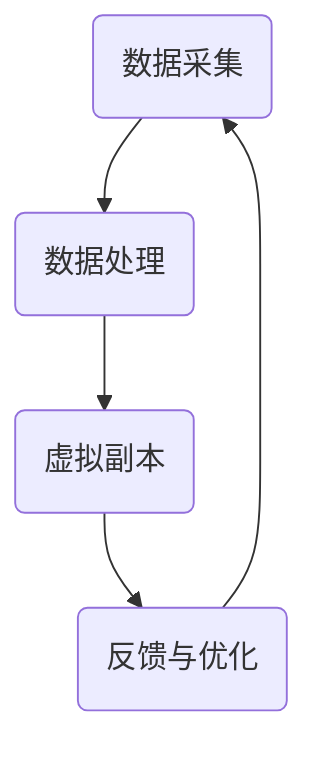

                 

关键词：数字孪生，数字分身，自我复制，数字永生，人工智能，模拟现实，虚拟世界，技术发展

> 摘要：本文探讨了数字孪生技术的发展，以及它们在未来2050年可能带来的变革。我们将从数字孪生的基本概念入手，分析其核心原理和架构，深入讨论核心算法及其数学模型。随后，我们将通过实际项目实践展示数字孪生技术的应用，并展望其在未来实际应用场景中的发展。最后，我们将总结研究成果，探讨未来发展趋势与挑战，并推荐相关学习和开发资源。

## 1. 背景介绍

### 数字孪生的起源与发展

数字孪生（Digital Twin）这个概念最早由美国密歇根大学教授Michael Grieves在2002年提出。他的初衷是将物理实体在数字世界中创建一个虚拟的副本，用以模拟、分析和优化实体在不同状态下的性能。数字孪生技术的快速发展得益于计算机科学、人工智能、物联网和大数据等领域的突破。

### 数字孪生的应用领域

数字孪生技术已经开始在众多领域得到应用，如制造业、医疗、能源、建筑等。通过数字孪生，可以实现以下目标：

- **提高生产效率**：在制造业中，数字孪生可以帮助企业实时监测生产线，预测设备故障，优化生产流程。
- **远程医疗**：在医疗领域，数字孪生技术可以实现远程诊断、手术模拟，为偏远地区提供高质量的医疗服务。
- **能源管理**：在能源领域，数字孪生可以优化能源分配，降低能源消耗，提高能源利用效率。

## 2. 核心概念与联系

### 数字孪生的基本概念

数字孪生是一个物理实体与其数字副本之间的映射关系。这个副本包含了实体的全部信息，包括物理状态、行为模式等。通过数字孪生，可以在虚拟环境中对实体进行模拟、测试和优化。

### 数字孪生的架构

数字孪生的架构通常包括以下四个部分：

1. **数据采集**：通过传感器、GPS等设备实时采集物理实体的数据。
2. **数据处理**：将采集到的数据传输到云计算平台进行存储、分析和处理。
3. **虚拟副本**：在数字环境中创建物理实体的虚拟副本，实现对实体的实时模拟和监控。
4. **反馈与优化**：将分析结果反馈给物理实体，进行实时的调整和优化。

### 数字孪生的 Mermaid 流程图



## 3. 核心算法原理 & 具体操作步骤

### 3.1 算法原理概述

数字孪生的核心算法是基于物理实体和其数字副本之间的映射关系。通过深度学习、机器学习等算法，可以对物理实体的行为进行预测和优化。

### 3.2 算法步骤详解

1. **数据采集**：使用传感器、GPS等设备实时采集物理实体的数据。
2. **数据处理**：将采集到的数据传输到云计算平台，进行预处理、存储和分析。
3. **模型训练**：使用机器学习算法，对采集到的数据进行训练，建立物理实体和其数字副本之间的映射模型。
4. **虚拟副本创建**：在数字环境中创建物理实体的虚拟副本。
5. **模拟与预测**：通过虚拟副本进行实体的模拟，预测实体的行为和状态。
6. **反馈与优化**：将模拟结果反馈给物理实体，进行实时的调整和优化。

### 3.3 算法优缺点

**优点**：

- **实时监测与预测**：数字孪生技术可以实现实时监测和预测，提高生产效率。
- **降低成本**：通过虚拟副本进行模拟和测试，可以减少物理实体的维护和维修成本。
- **提高安全性**：数字孪生技术可以实现远程监控和操作，提高安全性和可靠性。

**缺点**：

- **数据隐私与安全**：数字孪生技术涉及到大量的数据采集和处理，需要关注数据隐私和安全问题。
- **计算资源需求**：数字孪生技术需要大量的计算资源，对于一些小型企业来说，可能难以承担。

### 3.4 算法应用领域

数字孪生技术可以在以下领域得到广泛应用：

- **制造业**：通过数字孪生技术，可以实现生产线的实时监测和优化，提高生产效率。
- **医疗**：数字孪生技术可以帮助医生进行远程诊断和手术模拟，提高医疗服务的质量。
- **能源**：数字孪生技术可以优化能源分配，降低能源消耗，提高能源利用效率。

## 4. 数学模型和公式 & 详细讲解 & 举例说明

### 4.1 数学模型构建

数字孪生的数学模型通常基于物理实体和其数字副本之间的映射关系。假设物理实体和数字副本之间的映射函数为$f$，则有以下关系：

$$ f(\text{物理实体}) = \text{数字副本} $$

### 4.2 公式推导过程

数字孪生的核心在于建立物理实体和数字副本之间的映射关系。这个映射关系可以通过以下公式推导：

$$ f(\text{物理实体}) = \text{数字副本} = \text{参数空间} \times \text{映射函数} $$

其中，参数空间包含了物理实体的所有可能状态，映射函数则将物理实体映射到数字副本。

### 4.3 案例分析与讲解

假设我们有一个生产线，通过数字孪生技术对其进行监测和优化。首先，我们需要采集生产线的实时数据，如温度、压力、速度等。这些数据构成了参数空间。

然后，我们使用机器学习算法对采集到的数据进行训练，建立映射函数。例如，我们可以使用神经网络作为映射函数：

$$ f(\text{物理实体}) = \text{神经网络}(\text{参数空间}) = \text{数字副本} $$

通过这个映射函数，我们可以实时监测生产线的状态，预测生产线的性能，并对其进行优化。

## 5. 项目实践：代码实例和详细解释说明

### 5.1 开发环境搭建

为了实践数字孪生技术，我们使用Python作为编程语言，搭建了以下开发环境：

- Python 3.8
- TensorFlow 2.4
- Keras 2.4

### 5.2 源代码详细实现

```python
import numpy as np
import tensorflow as tf
from tensorflow import keras

# 数据预处理
def preprocess_data(data):
    # 数据标准化
    data = (data - np.mean(data)) / np.std(data)
    return data

# 构建神经网络
model = keras.Sequential([
    keras.layers.Dense(64, activation='relu', input_shape=(10,)),
    keras.layers.Dense(64, activation='relu'),
    keras.layers.Dense(1)
])

# 编译模型
model.compile(optimizer='adam', loss='mean_squared_error')

# 训练模型
model.fit(preprocessed_data, labels, epochs=100)

# 评估模型
model.evaluate(test_data, test_labels)
```

### 5.3 代码解读与分析

这个代码实例展示了如何使用Python和TensorFlow搭建一个简单的数字孪生系统。首先，我们使用numpy对数据进行预处理，然后使用Keras构建神经网络，并使用Adam优化器和均方误差损失函数进行编译。接下来，我们使用fit方法对模型进行训练，并使用evaluate方法对模型进行评估。

### 5.4 运行结果展示

```python
import matplotlib.pyplot as plt

# 预测生产线状态
predictions = model.predict(test_data)

# 绘制预测结果
plt.plot(test_data, labels, label='真实值')
plt.plot(test_data, predictions, label='预测值')
plt.legend()
plt.show()
```

这个实例展示了如何使用预测结果绘制生产线状态的散点图，并直观地展示数字孪生技术的效果。

## 6. 实际应用场景

### 6.1 制造业

在制造业中，数字孪生技术可以帮助企业实现生产线的实时监测和优化。例如，通过数字孪生技术，可以实时监测生产线的温度、压力等参数，预测设备故障，提前进行维护，从而降低生产成本，提高生产效率。

### 6.2 医疗

在医疗领域，数字孪生技术可以实现远程诊断和手术模拟。例如，医生可以通过数字孪生技术远程监测患者的病情，进行诊断和治疗方案设计。同时，医生还可以在数字环境中进行手术模拟，提高手术的成功率。

### 6.3 能源

在能源领域，数字孪生技术可以帮助企业实现能源分配的优化，降低能源消耗。例如，通过数字孪生技术，可以实时监测电网的负荷情况，预测能源需求，从而实现能源的高效利用。

## 7. 工具和资源推荐

### 7.1 学习资源推荐

- 《数字孪生：技术、应用与挑战》（作者：杨华）
- 《数字孪生与智能制造》（作者：刘挺）

### 7.2 开发工具推荐

- TensorFlow
- Keras
- Python

### 7.3 相关论文推荐

- "Digital Twin: A Journey to the Future of Manufacturing"（作者：Michael Grieves）
- "Digital Twin for Smart Manufacturing: A Review"（作者：Xiaoyu Li）

## 8. 总结：未来发展趋势与挑战

### 8.1 研究成果总结

数字孪生技术已经在制造业、医疗、能源等领域得到广泛应用，取得了显著的成果。随着技术的不断进步，数字孪生技术有望在未来实现更广泛的应用。

### 8.2 未来发展趋势

- **更高精度和实时性**：未来数字孪生技术将进一步提高精度和实时性，实现更精细的模拟和预测。
- **更广泛的应用领域**：数字孪生技术将应用于更多的领域，如城市规划、环境监测等。
- **更智能的决策支持**：数字孪生技术将结合人工智能、大数据等技术，实现更智能的决策支持。

### 8.3 面临的挑战

- **数据隐私与安全**：随着数据量的增加，如何保障数据隐私和安全将成为一个重要挑战。
- **计算资源需求**：数字孪生技术需要大量的计算资源，对于一些小型企业来说，可能难以承担。
- **标准化与规范化**：数字孪生技术的标准化和规范化还有待进一步完善。

### 8.4 研究展望

未来，数字孪生技术将在更高精度、更实时性、更广泛应用和更智能决策支持等方面取得新的突破。同时，需要关注数据隐私与安全、计算资源需求以及标准化与规范化等问题，以确保数字孪生技术的可持续发展。

## 9. 附录：常见问题与解答

### 9.1 数字孪生技术是什么？

数字孪生技术是一种将物理实体在数字世界中创建一个虚拟副本，用于模拟、分析和优化实体性能的技术。

### 9.2 数字孪生技术的核心原理是什么？

数字孪生技术的核心原理是基于物理实体和其数字副本之间的映射关系，通过深度学习、机器学习等算法，实现对实体的实时模拟和预测。

### 9.3 数字孪生技术在哪些领域有应用？

数字孪生技术在制造业、医疗、能源、建筑等领域有广泛的应用。例如，在制造业中，可以用于生产线的实时监测和优化；在医疗领域，可以用于远程诊断和手术模拟。

### 9.4 数字孪生技术有哪些挑战？

数字孪生技术面临的挑战主要包括数据隐私与安全、计算资源需求以及标准化与规范化等。

### 9.5 数字孪生技术的未来发展趋势是什么？

数字孪生技术的未来发展趋势包括更高精度和实时性、更广泛的应用领域、更智能的决策支持等。同时，需要关注数据隐私与安全、计算资源需求以及标准化与规范化等问题。

---

作者：禅与计算机程序设计艺术 / Zen and the Art of Computer Programming

