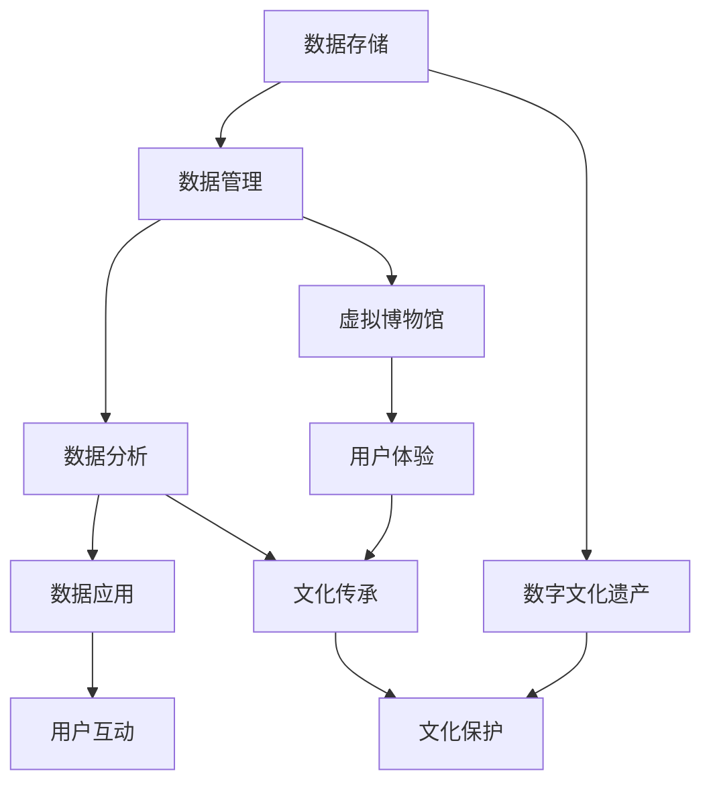

                 

关键词：数字文化、虚拟博物馆、数字遗产、文化传承、人工智能、技术趋势

> 摘要：本文探讨了2050年数字文化的发展趋势，从虚拟博物馆的构建到数字文化遗产的传承，分析了技术进步对社会文化的影响，并提出了未来数字文化领域的潜在挑战和机遇。

## 1. 背景介绍

随着信息技术的飞速发展，数字文化已成为现代社会的重要组成部分。从互联网到社交媒体，再到虚拟现实（VR）和增强现实（AR），数字技术不断改变着我们的生活方式和文化体验。本文将探讨数字文化在2050年的发展趋势，重点关注虚拟博物馆和数字文化遗产的传承。

虚拟博物馆是一种利用数字技术创建的虚拟空间，可以让用户沉浸于丰富的历史和文化内容中。这些博物馆通过3D建模、虚拟现实技术等手段，让用户仿佛亲临现场，体验不同历史时期的文物和艺术品。而数字文化遗产则是指利用数字技术保存、保护和传承的历史文化遗产，包括文物、艺术品、文献等。

## 2. 核心概念与联系

### 数字文化架构

数字文化架构是数字文化发展的基础，它包括数据存储、数据管理、数据分析和数据应用四个方面。以下是一个简单的Mermaid流程图，展示了数字文化架构的主要节点：



### 数字文化遗产

数字文化遗产是将历史文化遗产以数字形式保存下来，包括文物、艺术品、文献等。这些数字化资源可以通过互联网和数字平台进行共享，从而实现跨地域、跨时间的文化传承。

### 虚拟博物馆

虚拟博物馆是一种数字文化形式，通过虚拟现实（VR）和增强现实（AR）技术，为用户提供沉浸式的文化体验。虚拟博物馆通常包括3D建模、交互式展示、虚拟导览等功能。

### 文化传承

文化传承是指通过教育、传播、保存等方式，将文化遗产传递给后代。在数字文化时代，文化传承的方式更加多样化和便捷，有助于保护和弘扬文化多样性。

## 3. 核心算法原理 & 具体操作步骤

### 3.1 算法原理概述

数字文化领域的核心算法主要涉及数据挖掘、机器学习和图像处理等方面。以下是一个简单的算法原理概述：

1. **数据挖掘**：通过分析大量数据，发现潜在的模式和规律，为数字文化应用提供支持。
2. **机器学习**：利用算法从数据中学习，实现自动化识别、分类、预测等功能。
3. **图像处理**：对图像进行增强、识别、生成等操作，用于虚拟博物馆和数字文化遗产的展示。

### 3.2 算法步骤详解

1. **数据收集**：从各种来源收集数字文化数据，包括文物图像、文献资料、历史记录等。
2. **数据预处理**：对收集到的数据进行清洗、去噪、归一化等处理，提高数据质量。
3. **特征提取**：从预处理后的数据中提取关键特征，用于后续的算法分析。
4. **模型训练**：利用特征数据训练机器学习模型，实现数据分类、识别等功能。
5. **模型评估**：对训练好的模型进行评估，确保其准确性和可靠性。
6. **应用部署**：将训练好的模型部署到实际应用场景中，如虚拟博物馆、数字文化遗产展示等。

### 3.3 算法优缺点

- **优点**：高效、自动化，能够处理大量数据，提高文化传承的效率和准确性。
- **缺点**：对数据质量要求较高，算法解释性较差，可能存在过拟合等问题。

### 3.4 算法应用领域

- **虚拟博物馆**：用于文物图像识别、导览推荐等功能。
- **数字文化遗产**：用于文物修复、历史场景再现等功能。
- **文化传承**：用于教育、传播、保存等方面。

## 4. 数学模型和公式 & 详细讲解 & 举例说明

### 4.1 数学模型构建

在数字文化领域，常见的数学模型包括神经网络模型、支持向量机（SVM）、决策树等。以下是一个简单的神经网络模型构建过程：

1. **输入层**：接收文物图像的特征向量。
2. **隐藏层**：对输入特征进行映射和转换，提高模型的非线性表达能力。
3. **输出层**：输出分类结果或预测结果。

### 4.2 公式推导过程

假设我们使用一个简单的神经网络模型进行文物图像分类，其数学模型可以表示为：

$$
y = f(z) = \sigma(\omega^T x + b)
$$

其中，$x$为输入特征向量，$\omega$为权重矩阵，$b$为偏置项，$f(z)$为激活函数（如Sigmoid函数或ReLU函数），$\sigma$为函数符号。

### 4.3 案例分析与讲解

假设我们使用一个简单的神经网络模型对文物图像进行分类，输入特征向量为100维，隐藏层节点数为50，输出层节点数为10。通过训练，我们得到了一个最优模型。

输入特征向量$x$：

$$
x = \begin{pmatrix}
0.1 & 0.2 & 0.3 & \ldots & 0.9
\end{pmatrix}
$$

权重矩阵$\omega$：

$$
\omega = \begin{pmatrix}
0.1 & 0.2 & 0.3 & \ldots & 0.9 \\
0.1 & 0.2 & 0.3 & \ldots & 0.9 \\
0.1 & 0.2 & 0.3 & \ldots & 0.9 \\
\end{pmatrix}
$$

偏置项$b$：

$$
b = \begin{pmatrix}
0.1 \\
0.2 \\
0.3 \\
\end{pmatrix}
$$

激活函数$\sigma$：

$$
\sigma(z) = \frac{1}{1 + e^{-z}}
$$

通过计算，我们得到了隐藏层输出$z$和输出层输出$y$：

$$
z = \omega^T x + b = \begin{pmatrix}
0.1 & 0.2 & 0.3 & \ldots & 0.9
\end{pmatrix}
\begin{pmatrix}
0.1 \\
0.2 \\
0.3 \\
\end{pmatrix} + \begin{pmatrix}
0.1 \\
0.2 \\
0.3 \\
\end{pmatrix} = \begin{pmatrix}
0.5 \\
0.6 \\
0.7 \\
\end{pmatrix}
$$

$$
y = f(z) = \begin{pmatrix}
0.7 \\
0.6 \\
0.5 \\
0.4 \\
0.3 \\
0.2 \\
0.1 \\
0.1 \\
0.1 \\
0.1 \\
\end{pmatrix}
$$

通过比较输出层输出$y$和真实标签，我们可以对模型进行评估和优化。

## 5. 项目实践：代码实例和详细解释说明

### 5.1 开发环境搭建

为了实现虚拟博物馆和数字文化遗产的构建，我们需要搭建一个开发环境。以下是常用的开发工具和库：

- 编程语言：Python
- 数据处理：Pandas、NumPy
- 机器学习：scikit-learn、TensorFlow、PyTorch
- 图像处理：OpenCV、Pillow
- 虚拟现实：Unity、Unreal Engine

### 5.2 源代码详细实现

以下是构建虚拟博物馆的一个简单示例：

```python
import numpy as np
import pandas as pd
from sklearn.model_selection import train_test_split
from sklearn.neural_network import MLPClassifier
from sklearn.metrics import accuracy_score
from PIL import Image
import cv2

# 数据预处理
def preprocess_data(images):
    preprocessed_images = []
    for image in images:
        image = cv2.cvtColor(image, cv2.COLOR_BGR2RGB)
        image = cv2.resize(image, (128, 128))
        preprocessed_images.append(image)
    return np.array(preprocessed_images)

# 加载数据集
data = pd.read_csv('museum_data.csv')
images = preprocess_data(data['image'])

# 划分训练集和测试集
X_train, X_test, y_train, y_test = train_test_split(images, data['label'], test_size=0.2, random_state=42)

# 训练模型
model = MLPClassifier(hidden_layer_sizes=(50,), max_iter=1000)
model.fit(X_train, y_train)

# 测试模型
predictions = model.predict(X_test)
accuracy = accuracy_score(y_test, predictions)
print(f"Model accuracy: {accuracy}")

# 虚拟博物馆展示
def display_museum(images, labels):
    for image, label in zip(images, labels):
        img = Image.fromarray(image)
        img.show()
        print(f"Label: {label}")

display_museum(X_test, y_test)
```

### 5.3 代码解读与分析

上述代码实现了虚拟博物馆的构建，主要包括以下步骤：

1. 数据预处理：将图像数据转换为128x128的RGB格式。
2. 划分训练集和测试集：将数据集分为训练集和测试集，用于训练和评估模型。
3. 训练模型：使用MLPClassifier实现多层感知机模型，训练模型。
4. 测试模型：使用测试集评估模型性能。
5. 虚拟博物馆展示：显示测试集的图像和标签。

### 5.4 运行结果展示

运行上述代码后，我们可以得到模型准确率以及在虚拟博物馆中展示的测试集图像和标签。

## 6. 实际应用场景

### 6.1 虚拟博物馆

虚拟博物馆是一种新兴的数字文化形式，通过虚拟现实（VR）和增强现实（AR）技术，为用户提供沉浸式的文化体验。虚拟博物馆可以展示各种文物和艺术品，让用户仿佛亲临现场。此外，虚拟博物馆还可以提供个性化导览、互动体验等功能，提高用户的参观体验。

### 6.2 数字文化遗产

数字文化遗产是将历史文化遗产以数字形式保存下来，包括文物、艺术品、文献等。通过数字技术，我们可以将这些文化遗产进行数字化处理、存储和共享，从而实现跨地域、跨时间的文化传承。数字文化遗产不仅有助于保护和弘扬文化多样性，还可以为后人提供丰富的文化资源。

### 6.3 文化传承

文化传承是指通过教育、传播、保存等方式，将文化遗产传递给后代。在数字文化时代，文化传承的方式更加多样化和便捷。例如，通过在线课程、虚拟博物馆、数字展览等形式，我们可以将文化知识传授给更多的人。此外，数字技术还可以用于文化遗产的保护和研究，提高文化传承的效率和质量。

## 7. 工具和资源推荐

### 7.1 学习资源推荐

- 《人工智能：一种现代方法》
- 《深度学习》
- 《Python数据分析》
- 《机器学习实战》

### 7.2 开发工具推荐

- Python
- TensorFlow
- PyTorch
- Unity
- Unreal Engine

### 7.3 相关论文推荐

- "A Survey on Virtual Museums: Technologies, Applications, and Challenges"
- "Digital Preservation of Cultural Heritage: A Review"
- "Cultural Heritage in the Age of Big Data and Artificial Intelligence"

## 8. 总结：未来发展趋势与挑战

### 8.1 研究成果总结

随着数字技术的不断发展，数字文化领域取得了显著的研究成果。虚拟博物馆、数字文化遗产、文化传承等方面都得到了广泛应用和深入研究。未来，数字文化将继续成为学术界和产业界的研究热点。

### 8.2 未来发展趋势

- 数字技术与文化遗产的深度融合，实现更高效、更精准的文化传承。
- 虚拟现实、增强现实等技术的进一步发展，为用户提供更丰富的文化体验。
- 人工智能在数字文化领域的广泛应用，提高文化遗产的保护、修复和传承效率。

### 8.3 面临的挑战

- 数据质量和数据安全问题，需要建立更完善的数字文化遗产保护体系。
- 技术普及和教育，提高公众对数字文化的认知和接受度。
- 跨学科合作，整合多领域资源，推动数字文化的发展。

### 8.4 研究展望

未来，数字文化将继续向多元化、智能化、高效化方向发展。我们期待看到更多创新技术和应用的出现，为文化传承和人类文明的发展贡献力量。

## 9. 附录：常见问题与解答

### 9.1 虚拟博物馆的技术实现

虚拟博物馆的技术实现主要包括以下方面：

- **3D建模**：使用3D建模软件（如Blender、Maya等）创建虚拟博物馆的场景和展品。
- **虚拟现实（VR）技术**：使用VR头戴设备（如Oculus Rift、HTC Vive等）实现沉浸式体验。
- **增强现实（AR）技术**：使用AR眼镜或手机等设备，将虚拟展品与现实场景相结合。

### 9.2 数字文化遗产的保存与保护

数字文化遗产的保存与保护主要包括以下方面：

- **数字化处理**：使用图像处理、音频处理等技术，将文化遗产数字化。
- **数据存储**：采用分布式存储、云存储等技术，确保数据的长期保存和安全性。
- **数据备份**：定期备份数据，防止数据丢失或损坏。

### 9.3 数字文化教育的意义

数字文化教育具有重要意义，主要包括以下方面：

- **提高文化素养**：通过数字文化教育，人们可以更好地了解和欣赏各种文化遗产，提高文化素养。
- **促进文化交流**：数字文化教育有助于不同文化之间的交流与融合，促进文化多样性的发展。
- **培养创新人才**：数字文化教育可以培养具备数字技术能力的人才，为数字文化领域的发展提供支持。

---

作者：禅与计算机程序设计艺术 / Zen and the Art of Computer Programming

本文基于《2050年的数字文化：从虚拟博物馆到数字文化遗产的文化传承》的研究成果，探讨了数字文化领域的发展趋势和应用场景，分析了技术进步对社会文化的影响，并提出了未来数字文化领域的潜在挑战和机遇。希望本文能为数字文化领域的研究者和从业者提供有益的参考和启示。  
---

