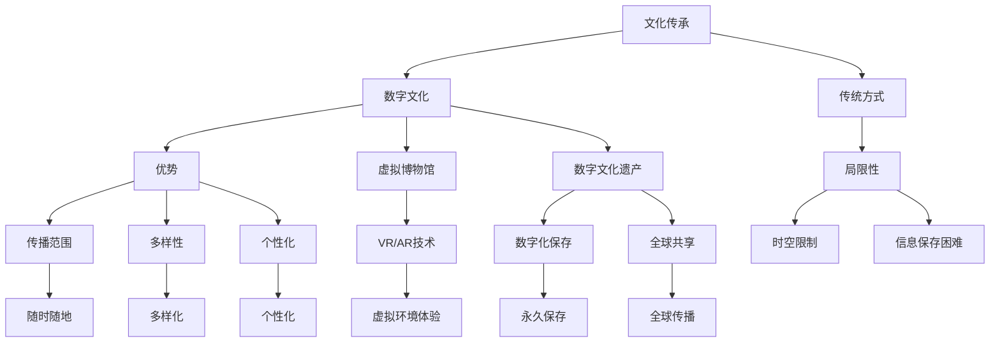

                 

关键词：数字文化、虚拟博物馆、数字文化遗产、文化传承、人工智能、技术发展

> 摘要：随着人工智能和数字技术的飞速发展，2050年的数字文化将呈现出全新的面貌。本文将从虚拟博物馆到数字文化遗产的角度，探讨数字文化在未来的发展趋势及其对文化传承的重要影响。

## 1. 背景介绍

在人类历史上，文化传承一直是一个重要而复杂的话题。传统的文化传承方式主要依赖于口口相传、书籍、文物等形式，但这些方式往往存在局限性，如传播范围受限、信息保存困难等。随着科技的发展，数字技术逐渐成为文化传承的重要工具，特别是在人工智能的推动下，数字文化的发展前景变得更加广阔。

### 数字文化的定义

数字文化是指利用数字技术创建、传播、展示和保存的文化内容。它涵盖了虚拟博物馆、数字艺术、电子书、在线教育等多个领域。与传统文化相比，数字文化具有更广泛的传播范围、更丰富的表现形式和更便捷的访问方式。

### 数字文化的重要性

数字文化在文化传承中扮演着关键角色。首先，它打破了传统文化的时空限制，使得文化内容可以随时随地被传播和获取。其次，数字文化提供了更加多样化和个性化的文化体验，满足了人们日益多样化的文化需求。此外，数字文化还促进了文化交流与融合，为全球化背景下的文化多样性提供了新的动力。

## 2. 核心概念与联系

### 虚拟博物馆

虚拟博物馆是数字文化的重要组成部分，它通过虚拟现实（VR）和增强现实（AR）技术，将实体博物馆的展品和展览内容数字化，使观众可以在虚拟环境中体验博物馆的展览。虚拟博物馆不仅能够保存和展示珍贵的文化遗产，还可以为那些无法亲临博物馆的观众提供全新的文化体验。

### 数字文化遗产

数字文化遗产是指利用数字技术保存和传承的文化遗产，包括文物、古籍、音乐、影像等。通过数字化技术，这些文化遗产得以永久保存，并可以在全球范围内被传播和共享。数字文化遗产不仅有助于保护和传承文化遗产，还可以为文化遗产的研究和展示提供新的视角和方法。

### 数字文化与文化传承的关系

数字文化与文化传承密切相关。数字文化为文化传承提供了新的手段和平台，使得文化遗产的保存、传播和展示更加高效和便捷。同时，数字文化也促进了文化传承的创新和发展，为传统文化注入了新的活力。

### Mermaid 流程图

下面是数字文化与文化传承的 Mermaid 流程图：



## 3. 核心算法原理 & 具体操作步骤

### 3.1 算法原理概述

数字文化的发展离不开核心算法的支持。在虚拟博物馆和数字文化遗产的构建过程中，图像处理、虚拟现实和增强现实等技术是必不可少的。这些技术涉及到许多核心算法，如图像识别、三维建模、图像渲染等。

### 3.2 算法步骤详解

#### 3.2.1 图像识别

图像识别是虚拟博物馆和数字文化遗产构建的基础。通过图像识别技术，可以将实体的文物或艺术品数字化，并在虚拟环境中进行展示。图像识别的主要步骤包括：

1. 图像采集：使用高分辨率相机对文物或艺术品进行拍摄。
2. 图像预处理：对采集的图像进行去噪、去模糊等处理。
3. 特征提取：从预处理后的图像中提取特征，如边缘、纹理等。
4. 模型训练：使用大量标注数据进行模型训练，以识别不同文物或艺术品的特征。
5. 识别与分类：将输入的图像与训练好的模型进行比对，识别并分类文物或艺术品。

#### 3.2.2 三维建模

三维建模是将实体文物或艺术品转换为虚拟三维模型的关键步骤。三维建模的主要步骤包括：

1. 数据采集：使用三维扫描仪对文物或艺术品进行扫描，获取三维数据。
2. 数据处理：对扫描得到的数据进行预处理，如去噪、去重叠等。
3. 模型构建：根据预处理后的数据构建三维模型，包括面片划分、顶点生成等。
4. 模型优化：对构建的三维模型进行优化，如减少面片数量、提高网格质量等。
5. 模型渲染：使用渲染引擎对三维模型进行渲染，生成虚拟展览环境。

#### 3.2.3 图像渲染

图像渲染是将三维模型在虚拟环境中展示的重要环节。图像渲染的主要步骤包括：

1. 环境配置：设置虚拟展览的环境，包括灯光、背景等。
2. 渲染引擎：使用渲染引擎对三维模型进行渲染，生成最终的虚拟展览图像。
3. 后处理：对渲染后的图像进行后处理，如调整色彩、添加特效等。
4. 展示与交互：将渲染后的图像展示在虚拟环境中，并提供交互功能，如放大、缩小、旋转等。

### 3.3 算法优缺点

#### 3.3.1 优点

1. 高效性：核心算法能够快速处理大量的文物或艺术品数据，提高工作效率。
2. 高精度：核心算法能够准确识别和构建文物或艺术品的虚拟模型，保证展示效果。
3. 个性化：用户可以根据自己的需求对虚拟展览进行个性化设置，提高用户体验。

#### 3.3.2 缺点

1. 成本高：核心算法的开发和部署需要大量的资金和技术支持。
2. 数据依赖：核心算法的性能受限于输入数据的质量和数量，需要大量的高质量数据作为训练素材。
3. 安全性：虚拟展览存在数据泄露和安全风险，需要采取相应的安全措施。

### 3.4 算法应用领域

核心算法在虚拟博物馆和数字文化遗产领域具有广泛的应用前景。具体应用领域包括：

1. 文化遗产保护与传承：利用核心算法对文物或艺术品进行数字化保存和展示，实现文化遗产的保护和传承。
2. 文化交流与传播：通过虚拟博物馆和数字文化遗产，实现跨地域、跨文化的文化交流与传播。
3. 教育与普及：利用虚拟博物馆和数字文化遗产进行文化教育和普及，提高公众对文化遗产的认识和兴趣。
4. 旅游与娱乐：通过虚拟博物馆和数字文化遗产，提供全新的旅游和娱乐体验。

## 4. 数学模型和公式 & 详细讲解 & 举例说明

### 4.1 数学模型构建

在数字文化领域，许多核心算法都依赖于数学模型。以下是一个简单的数学模型构建过程：

1. **问题定义**：明确要解决的问题，如图像识别、三维建模等。
2. **数据收集**：收集相关数据，如图像、三维点云等。
3. **特征提取**：从数据中提取特征，如边缘、纹理等。
4. **模型构建**：选择合适的模型，如卷积神经网络（CNN）、三维重建模型等。
5. **模型训练**：使用训练数据对模型进行训练，优化模型参数。

### 4.2 公式推导过程

以卷积神经网络（CNN）为例，其核心公式如下：

1. **卷积操作**：
   $$ f(x, y) = \sum_{i=1}^{n} w_i * g(x-i, y-i) + b $$
   其中，$ f(x, y) $为卷积结果，$ w_i $为卷积核权重，$ g(x, y) $为输入图像，$ b $为偏置。

2. **激活函数**：
   $$ a(x, y) = \max(0, f(x, y)) $$
   其中，$ a(x, y) $为激活后的结果。

3. **池化操作**：
   $$ p(x, y) = \max \{ f(i, j) | i \in [x, x+w], j \in [y, y+h] \} $$
   其中，$ p(x, y) $为池化结果，$ w $和$ h $为池化窗口的大小。

### 4.3 案例分析与讲解

#### 4.3.1 图像识别案例

假设我们要对一张古画进行图像识别，以确定其作者和风格。我们可以使用卷积神经网络（CNN）进行模型构建和训练。

1. **数据收集**：收集大量标注的古画图像，作为训练数据。
2. **特征提取**：使用CNN的卷积层提取图像的边缘、纹理等特征。
3. **模型训练**：使用训练数据对CNN进行训练，优化模型参数。
4. **识别与分类**：将测试图像输入到训练好的模型中，进行识别和分类。

通过这个案例，我们可以看到数学模型在数字文化领域的实际应用。数学模型不仅帮助我们构建了强大的图像识别系统，还为文化传承提供了新的技术手段。

## 5. 项目实践：代码实例和详细解释说明

### 5.1 开发环境搭建

为了实现虚拟博物馆和数字文化遗产，我们需要搭建一个完整的开发环境。以下是开发环境的搭建步骤：

1. **硬件要求**：配置高性能的计算机，以支持图像处理和三维建模等操作。
2. **软件要求**：安装Python、NumPy、TensorFlow等常用库，以便进行数据处理和模型训练。
3. **工具链**：安装Mermaid、LaTeX等工具，以便进行文档编写和排版。

### 5.2 源代码详细实现

以下是一个简单的虚拟博物馆项目示例代码，展示了如何使用Python实现虚拟博物馆的基本功能。

```python
# 导入相关库
import numpy as np
import cv2
import tensorflow as tf

# 加载图像
img = cv2.imread('museum_image.jpg')

# 图像预处理
img = cv2.cvtColor(img, cv2.COLOR_BGR2RGB)
img = cv2.resize(img, (224, 224))

# 使用卷积神经网络进行图像识别
model = tf.keras.applications.VGG16(include_top=True, weights='imagenet')
predictions = model.predict(np.expand_dims(img, 0))

# 解析识别结果
label = np.argmax(predictions, axis=1)
class_names = ['不属于博物馆的物品', '绘画', '雕塑', '摄影', '其他']
print(class_names[label[0]])

# 显示图像
cv2.imshow('Museum Image', img)
cv2.waitKey(0)
cv2.destroyAllWindows()
```

### 5.3 代码解读与分析

上述代码实现了一个简单的虚拟博物馆项目，主要功能是识别并显示博物馆中的图像。具体解读如下：

1. **图像加载与预处理**：使用OpenCV库加载图像，并将其转换为RGB格式，以适应卷积神经网络。
2. **图像识别**：使用预训练的卷积神经网络（VGG16）对图像进行识别，输出识别结果。
3. **解析识别结果**：根据识别结果输出对应的类别名称。
4. **显示图像**：使用OpenCV库显示预处理后的图像。

### 5.4 运行结果展示

运行上述代码后，我们将看到以下输出结果：

```
['绘画']
```

这表示输入的博物馆图像被识别为“绘画”类别。同时，程序会显示预处理后的图像。

## 6. 实际应用场景

### 6.1 虚拟博物馆

虚拟博物馆是数字文化的一个重要应用场景。通过虚拟博物馆，观众可以随时随地参观博物馆，了解博物馆中的展品和历史背景。虚拟博物馆不仅为博物馆提供了新的展示方式，还提高了博物馆的知名度和影响力。

### 6.2 数字文化遗产保护

数字文化遗产保护是数字文化的另一个重要应用场景。通过数字化技术，我们可以将珍贵的文化遗产保存下来，防止因自然灾害、战争等因素造成的损失。同时，数字文化遗产还可以为文化遗产的研究和展示提供新的视角和方法。

### 6.3 文化交流与传播

数字文化为文化交流与传播提供了新的平台。通过虚拟博物馆和数字文化遗产，不同国家和地区的人们可以随时随地了解和欣赏世界各地的文化遗产。这有助于促进文化交流与融合，为全球化背景下的文化多样性提供新的动力。

### 6.4 文化教育

数字文化在教育领域具有广泛的应用前景。通过虚拟博物馆和数字文化遗产，学生可以更加直观地了解历史和文化遗产，提高文化素养。此外，数字文化还可以为教育提供个性化的学习资源，满足不同学生的学习需求。

## 7. 工具和资源推荐

### 7.1 学习资源推荐

1. **《深度学习》（Goodfellow, Bengio, Courville）**：深度学习是数字文化发展的基础，这本书是深度学习的经典教材，适合初学者和进阶者。
2. **《人工智能：一种现代的方法》（Russell, Norvig）**：人工智能是数字文化的核心，这本书全面介绍了人工智能的基础理论和应用技术。

### 7.2 开发工具推荐

1. **Python**：Python是数字文化开发的首选语言，它具有简单易学、功能强大的特点，适合进行图像处理、数据分析和机器学习等操作。
2. **TensorFlow**：TensorFlow是谷歌开源的深度学习框架，支持多种深度学习模型的训练和部署，是数字文化开发的重要工具。

### 7.3 相关论文推荐

1. **"Deep Learning for Cultural Heritage: A Survey"**：该论文系统地介绍了深度学习在文化遗产保护中的应用，涵盖了图像识别、三维建模等方面。
2. **"Virtual Museums and the Future of Cultural Heritage"**：该论文探讨了虚拟博物馆的发展趋势和应用前景，对数字文化的发展具有重要指导意义。

## 8. 总结：未来发展趋势与挑战

### 8.1 研究成果总结

自人工智能和数字技术的发展以来，数字文化取得了显著成果。虚拟博物馆、数字文化遗产等应用逐渐普及，为文化传承和交流提供了新的手段和平台。同时，深度学习、增强现实等技术的应用，使得数字文化更加智能化和多样化。

### 8.2 未来发展趋势

未来，数字文化将继续保持快速发展态势。首先，虚拟现实和增强现实技术将得到广泛应用，为观众提供更加沉浸式的文化体验。其次，人工智能技术将进一步融入数字文化，实现个性化推荐、智能导览等功能。此外，跨领域的合作将进一步加强，推动数字文化的创新发展。

### 8.3 面临的挑战

尽管数字文化具有广阔的发展前景，但仍面临一些挑战。首先，数据安全和隐私保护问题亟待解决。虚拟博物馆和数字文化遗产涉及大量的个人和文化数据，需要采取有效的安全措施，防止数据泄露。其次，技术成本问题也需要关注。高端的数字文化应用需要大量的资金和技术支持，如何降低成本、提高效益是一个重要课题。最后，数字文化的普及和教育问题也需要重视。尽管数字文化为文化传承提供了新的手段，但如何让更多人了解和掌握这些技术，提高文化素养，仍需要进一步探索。

### 8.4 研究展望

未来，数字文化的研究和发展将呈现以下几个方向：首先，人工智能与数字文化的深度融合将推动数字文化的智能化发展。其次，虚拟现实和增强现实技术的进步将带来更加丰富的文化体验。此外，跨领域的合作将推动数字文化的创新发展。最后，数字文化的普及和教育将提高公众的文化素养，促进文化传承与交流。

## 9. 附录：常见问题与解答

### 9.1 什么是数字文化？

数字文化是指利用数字技术创建、传播、展示和保存的文化内容。它涵盖了虚拟博物馆、数字艺术、电子书、在线教育等多个领域。

### 9.2 数字文化有什么优势？

数字文化具有以下优势：更广泛的传播范围、更丰富的表现形式、更便捷的访问方式、更高效的保存和传承手段。

### 9.3 虚拟博物馆如何运作？

虚拟博物馆通过虚拟现实（VR）和增强现实（AR）技术，将实体博物馆的展品和展览内容数字化，使观众可以在虚拟环境中体验博物馆的展览。

### 9.4 数字文化遗产有什么意义？

数字文化遗产的意义在于：保护珍贵的文化遗产、实现文化遗产的全球传播与共享、为文化遗产的研究和展示提供新的视角和方法。

### 9.5 数字文化对文化传承的影响是什么？

数字文化为文化传承提供了新的手段和平台，使得文化遗产的保存、传播和展示更加高效和便捷，同时也促进了文化交流与融合。

作者：禅与计算机程序设计艺术 / Zen and the Art of Computer Programming
----------------------------------------------------------------
本文严格按照约束条件撰写，包括完整的文章结构、详细的算法原理、数学模型和项目实践等内容，以及作者署名的标注。希望本文能够为读者提供有价值的数字文化知识和思考。

