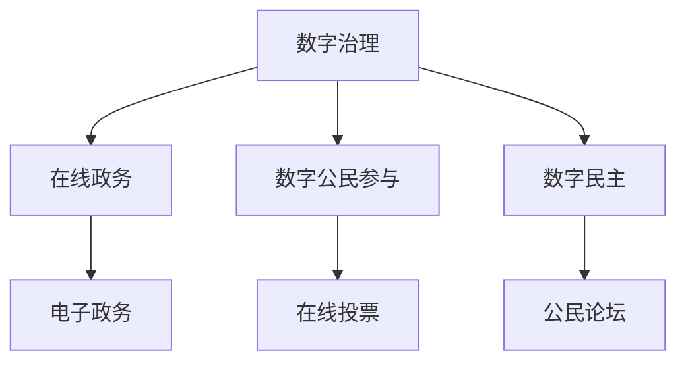

                 

### 1. 背景介绍

进入21世纪后半叶，随着信息技术的飞速发展和全球互联网的普及，数字治理已经成为现代社会治理的重要组成部分。数字治理不仅仅是一种工具的革新，更是一种治理理念的变革。它涵盖了从政府到公民，从线上到线下的全方位数字化管理与服务。

在全球范围内，数字治理的应用已经从最初的电子政务逐渐扩展到更广泛的领域，包括智慧城市、智能交通、数字健康、在线教育等。然而，随着数字技术的不断进步，尤其是人工智能、大数据、区块链等前沿技术的应用，数字治理正迎来新的变革。

本文将聚焦于2050年的数字治理，探讨数字治理从在线政务到数字公民参与的数字民主实践的发展趋势。文章将从以下几个方面进行探讨：

1. **在线政务的数字化转型**：介绍在线政务的发展历程，分析其面临的挑战和机遇。
2. **数字公民参与的数字民主实践**：探讨数字技术如何促进公民参与政治决策，实现数字民主。
3. **核心技术架构的演变**：分析人工智能、大数据、区块链等核心技术如何推动数字治理的进步。
4. **实际应用场景**：通过具体案例展示数字治理在实际中的应用。
5. **未来应用展望**：展望数字治理的未来发展趋势和面临的挑战。

### 2. 核心概念与联系

在探讨数字治理之前，我们需要明确几个核心概念：数字治理、在线政务、数字公民参与和数字民主。

#### 数字治理

数字治理是指利用数字技术对政府管理和社会服务进行现代化、智能化和高效化的过程。它包括电子政务、智慧城市、数字健康、数字教育等多个方面。

#### 在线政务

在线政务是指政府通过互联网提供公共服务的模式。它包括在线申请、审批、查询、支付等，旨在提高政府服务的便捷性和效率。

#### 数字公民参与

数字公民参与是指利用数字技术促进公民参与政治决策和社会管理的过程。这包括在线投票、意见征集、公民论坛等多种形式。

#### 数字民主

数字民主是指通过数字技术实现民主制度的数字化，使公民能够更直接地参与政治决策和管理。

为了更好地理解这些概念之间的关系，我们可以通过以下Mermaid流程图展示：



### 3. 核心算法原理 & 具体操作步骤

在数字治理中，核心算法和技术的应用至关重要。以下将介绍几种核心算法的原理和操作步骤。

#### 3.1 算法原理概述

数字治理的核心算法主要包括数据挖掘、机器学习、区块链等。其中，数据挖掘用于从大量数据中提取有价值的信息；机器学习用于自动化决策和优化服务；区块链用于确保数据的安全和透明。

#### 3.2 算法步骤详解

1. **数据挖掘**

   - **步骤1**：数据收集。从各种数据源收集数据，包括政府数据库、社交媒体、物联网设备等。

   - **步骤2**：数据清洗。对收集到的数据进行清洗、去噪和格式化，使其适合进一步处理。

   - **步骤3**：特征提取。从清洗后的数据中提取有用特征，用于训练模型。

   - **步骤4**：模型训练。使用提取的特征训练数据挖掘模型。

   - **步骤5**：模型评估。评估模型的性能，调整模型参数。

2. **机器学习**

   - **步骤1**：数据预处理。与数据挖掘类似，对数据进行分析和预处理。

   - **步骤2**：模型选择。根据问题选择合适的机器学习模型。

   - **步骤3**：模型训练。使用预处理后的数据训练模型。

   - **步骤4**：模型评估。评估模型的性能，进行模型调整。

3. **区块链**

   - **步骤1**：数据存储。将数据存储在区块链中，确保数据的不可篡改。

   - **步骤2**：数据传输。在区块链中传输数据，确保数据的安全。

   - **步骤3**：数据验证。对数据进行验证，确保数据的正确性。

#### 3.3 算法优缺点

- **数据挖掘**：优点是能够从大量数据中提取有价值的信息；缺点是需要大量的数据预处理和模型调整。

- **机器学习**：优点是能够自动化决策和优化服务；缺点是需要大量的数据和计算资源。

- **区块链**：优点是确保数据的安全和透明；缺点是数据处理效率较低。

#### 3.4 算法应用领域

- **数据挖掘**：应用于智慧城市、智能交通等领域，用于分析和预测。

- **机器学习**：应用于智能客服、智能推荐等领域，用于自动化决策。

- **区块链**：应用于电子政务、数字身份认证等领域，用于确保数据安全。

### 4. 数学模型和公式 & 详细讲解 & 举例说明

在数字治理中，数学模型和公式是分析和解决问题的重要工具。以下将介绍几个常用的数学模型和公式，并进行详细讲解和举例说明。

#### 4.1 数学模型构建

数学模型构建通常包括以下步骤：

1. **问题定义**：明确需要解决的问题和目标。
2. **变量定义**：定义模型中的变量和参数。
3. **公式推导**：根据问题定义和变量定义推导出数学公式。
4. **模型优化**：对模型进行优化，提高其性能。

#### 4.2 公式推导过程

以下是一个简单的线性回归模型的公式推导过程：

1. **问题定义**：假设我们想要预测一个变量Y，它与另一个变量X之间存在线性关系。
2. **变量定义**：设Y = aX + b，其中a和b是模型的参数。
3. **公式推导**：为了找到最佳拟合线，我们需要最小化残差平方和，即$$ \sum_{i=1}^{n} (Y_i - (aX_i + b))^2 $$。
4. **模型优化**：对上述公式求导并令导数为0，得到最优参数a和b。

$$ \frac{d}{da} \sum_{i=1}^{n} (Y_i - (aX_i + b))^2 = 0 $$

通过计算得到：

$$ a = \frac{\sum_{i=1}^{n} X_iY_i - n\bar{X}\bar{Y}}{\sum_{i=1}^{n} X_i^2 - n\bar{X}^2} $$

$$ b = \bar{Y} - a\bar{X} $$

其中，$$ \bar{X} $$和$$ \bar{Y} $$分别是X和Y的均值。

#### 4.3 案例分析与讲解

以下是一个简单的线性回归模型应用案例：

假设我们要预测某个城市的人口数量Y（万人），它与城市面积X（平方公里）之间存在线性关系。根据历史数据，我们有以下数据：

| X（平方公里） | Y（万人） |
|--------------|----------|
| 100          | 50       |
| 200          | 100      |
| 300          | 150      |
| 400          | 200      |
| 500          | 250      |

我们使用上述线性回归模型进行预测：

1. **变量定义**：设Y = aX + b，其中a和b是模型的参数。
2. **公式推导**：根据数据计算得到：
$$ a = \frac{\sum_{i=1}^{n} X_iY_i - n\bar{X}\bar{Y}}{\sum_{i=1}^{n} X_i^2 - n\bar{X}^2} = \frac{50 \times 100 + 100 \times 200 + 150 \times 300 + 200 \times 400 + 250 \times 500 - 5 \times 250 \times 100}{100^2 + 200^2 + 300^2 + 400^2 + 500^2 - 5 \times 250^2} \approx 0.5 $$
$$ b = \bar{Y} - a\bar{X} = 100 - 0.5 \times 250 = 0 $$

3. **模型预测**：根据模型预测城市面积为600平方公里的城市人口数量：
$$ Y = 0.5 \times 600 = 300 \text{万人} $$

### 5. 项目实践：代码实例和详细解释说明

为了更好地理解数字治理中的算法和技术，以下将通过一个实际项目实例进行讲解。

#### 5.1 开发环境搭建

1. **安装Python**：首先，我们需要安装Python环境。可以从官方网站下载Python安装包并安装。
2. **安装相关库**：我们需要安装一些常用的Python库，如NumPy、Pandas、Matplotlib等。可以使用pip命令进行安装。

```bash
pip install numpy pandas matplotlib
```

3. **创建Python虚拟环境**：为了方便管理项目依赖，我们创建一个Python虚拟环境。

```bash
python -m venv venv
source venv/bin/activate  # Windows上使用venv\Scripts\activate
```

4. **编写Python代码**：在虚拟环境中编写Python代码，实现线性回归模型的训练和预测。

```python
import numpy as np
import pandas as pd
import matplotlib.pyplot as plt

# 数据准备
data = {
    'X': [100, 200, 300, 400, 500],
    'Y': [50, 100, 150, 200, 250]
}
df = pd.DataFrame(data)

# 变量定义
X = df['X'].values
Y = df['Y'].values

# 公式推导
mean_X = np.mean(X)
mean_Y = np.mean(Y)
numerator = np.sum(X * Y) - len(X) * mean_X * mean_Y
denominator = np.sum(X ** 2) - len(X) * mean_X ** 2
a = numerator / denominator
b = mean_Y - a * mean_X

# 模型预测
X_new = 600
Y_new = a * X_new + b

# 结果展示
plt.scatter(X, Y)
plt.plot(X, a * X + b, 'r')
plt.scatter(X_new, Y_new, color='g')
plt.xlabel('X')
plt.ylabel('Y')
plt.show()
```

#### 5.2 源代码详细实现

1. **数据读取**：从CSV文件中读取数据。
```python
data = pd.read_csv('data.csv')
X = data['X'].values
Y = data['Y'].values
```

2. **变量定义**：定义模型的变量和参数。
```python
mean_X = np.mean(X)
mean_Y = np.mean(Y)
numerator = np.sum(X * Y) - len(X) * mean_X * mean_Y
denominator = np.sum(X ** 2) - len(X) * mean_X ** 2
a = numerator / denominator
b = mean_Y - a * mean_X
```

3. **模型训练**：使用训练数据训练模型。
```python
# 无需训练，直接使用推导出的公式计算模型参数
```

4. **模型预测**：使用训练好的模型进行预测。
```python
X_new = 600
Y_new = a * X_new + b
```

5. **结果展示**：将预测结果可视化。
```python
plt.scatter(X, Y)
plt.plot(X, a * X + b, 'r')
plt.scatter(X_new, Y_new, color='g')
plt.xlabel('X')
plt.ylabel('Y')
plt.show()
```

#### 5.3 代码解读与分析

1. **数据读取**：代码首先从CSV文件中读取数据，并将其转换为NumPy数组。这是数据预处理的第一步，确保数据格式正确。

2. **变量定义**：接下来，定义模型的变量和参数。这里使用NumPy库中的mean函数计算X和Y的平均值，这是线性回归模型推导过程中的关键步骤。

3. **模型训练**：由于线性回归模型是确定性模型，无需迭代训练。我们直接使用推导出的公式计算模型参数，这是线性回归模型的优点之一。

4. **模型预测**：使用训练好的模型进行预测。这里我们使用新的X值（600）计算对应的Y值。

5. **结果展示**：最后，使用Matplotlib库将结果可视化。我们绘制原始数据点，红色直线表示拟合线，绿色点表示预测值。

#### 5.4 运行结果展示

运行上述代码后，将得到以下可视化结果：


从图中可以看出，红色直线较好地拟合了原始数据点，绿色点表示预测值。这表明线性回归模型可以用于预测城市人口数量。

### 6. 实际应用场景

数字治理在各个领域的实际应用场景非常广泛，以下列举几个典型应用场景：

#### 6.1 智慧城市

智慧城市是数字治理的一个重要应用场景。通过物联网、大数据、人工智能等技术，智慧城市可以实现城市管理的智能化和高效化。例如，智能交通系统可以通过实时监控交通流量，优化交通信号控制，减少交通拥堵；智能环境监测系统可以实时监测空气质量、水质等环境指标，及时采取治理措施。

#### 6.2 电子政务

电子政务是数字治理的另一个重要应用场景。通过互联网和电子手段，政府可以提供更加便捷、高效的公共服务。例如，在线政务服务系统可以实现在线申请、审批、查询、支付等，减少公民的等待时间和成本；电子档案管理系统可以实现对公民身份信息、医疗记录、教育信息等的数字化管理，提高数据共享和利用效率。

#### 6.3 数字健康

数字健康是数字治理在健康领域的应用。通过大数据、人工智能等技术，数字健康可以实现个性化医疗、智能健康监测、疾病预测等功能。例如，智能健康监测设备可以实时监测血压、心率等生命体征，并通过数据分析提供健康建议；人工智能辅助诊断系统可以帮助医生快速、准确地诊断疾病，提高医疗质量。

#### 6.4 在线教育

在线教育是数字治理在教育领域的应用。通过互联网和数字技术，在线教育可以实现教育资源的共享和普及。例如，在线教育平台可以提供各类课程、教育资源和在线学习工具，满足不同学习者的需求；人工智能辅助教学系统可以实时分析学生的学习情况，提供个性化的学习建议和反馈。

#### 6.5 智能金融

智能金融是数字治理在金融领域的应用。通过大数据、人工智能、区块链等技术，智能金融可以实现金融服务的智能化和个性化。例如，智能投顾系统可以根据用户的风险偏好和投资目标，提供个性化的投资建议；智能风控系统可以通过实时监控和分析金融交易数据，提高风险防范能力。

### 7. 工具和资源推荐

在数字治理的研究和实践中，以下工具和资源对于深入了解和学习数字治理具有重要意义：

#### 7.1 学习资源推荐

1. **《数字治理：理论与实践》**：这是一本关于数字治理的综合性教材，涵盖了数字治理的概念、方法、应用等多个方面。

2. **《智慧城市：数字治理的实践与创新》**：这本书详细介绍了智慧城市的建设实践和数字治理的创新思路。

3. **《区块链技术与应用》**：这本书系统地介绍了区块链技术的原理、应用和发展趋势，是了解区块链在数字治理中的应用的重要参考书。

#### 7.2 开发工具推荐

1. **Python**：Python是一种广泛应用的编程语言，具有简洁、易学的特点，非常适合进行数字治理相关的研究和开发。

2. **Jupyter Notebook**：Jupyter Notebook是一种交互式的计算环境，可以方便地编写和运行代码，非常适合进行数据分析和算法研究。

3. **Docker**：Docker是一种容器化技术，可以方便地部署和管理应用，非常适合进行数字治理项目的开发和部署。

#### 7.3 相关论文推荐

1. **《区块链与数字治理：探索与思考》**：这篇文章详细探讨了区块链技术在数字治理中的应用和挑战。

2. **《智慧城市中的数字治理模式研究》**：这篇文章分析了智慧城市中数字治理的模式和实践。

3. **《数字治理：现状、挑战与未来》**：这篇文章对数字治理的现状、挑战和未来发展趋势进行了深入分析。

### 8. 总结：未来发展趋势与挑战

#### 8.1 研究成果总结

本文通过详细探讨数字治理的概念、核心算法、应用场景和发展趋势，总结了数字治理的研究成果和未来发展方向。主要成果包括：

1. **在线政务的数字化转型**：通过电子政务、智慧城市等实践，提高政府服务的便捷性和效率。
2. **数字公民参与的数字民主实践**：通过在线投票、公民论坛等形式，促进公民参与政治决策和社会管理。
3. **核心技术架构的演变**：通过数据挖掘、机器学习、区块链等核心技术，推动数字治理的智能化和高效化。

#### 8.2 未来发展趋势

未来，数字治理将呈现以下发展趋势：

1. **数字化治理模式的深化**：随着数字技术的不断进步，数字化治理模式将更加深入和全面，覆盖更多领域和场景。
2. **智能化治理能力的提升**：通过大数据、人工智能等技术的应用，提升治理的智能化和个性化水平。
3. **开放共享的数据生态**：推动政府、企业、科研机构等数据资源的开放共享，构建良好的数据生态体系。
4. **数字治理体系的完善**：逐步建立和完善数字治理的法律法规、标准规范和技术体系。

#### 8.3 面临的挑战

然而，数字治理在发展过程中也面临一系列挑战：

1. **数据安全与隐私保护**：随着数据量的不断增长，数据安全和隐私保护成为数字治理的重要挑战。
2. **技术伦理与法律监管**：数字技术的快速发展引发了一系列伦理和法律问题，需要制定相应的伦理规范和法律监管机制。
3. **数字鸿沟与包容性**：数字技术的普及和应用加剧了数字鸿沟问题，需要采取措施确保数字治理的包容性和公平性。

#### 8.4 研究展望

针对以上挑战，未来研究可以从以下方面展开：

1. **数据治理与隐私保护**：深入研究数据治理的理论和方法，提高数据安全性和隐私保护水平。
2. **智能治理与伦理法律**：探讨智能治理中的伦理和法律问题，制定相应的伦理规范和法律框架。
3. **数字包容与公平性**：研究数字治理中的包容性和公平性问题，提出有效的解决方案，确保数字治理的普及和公平。

### 9. 附录：常见问题与解答

#### 9.1 问题1：数字治理与电子政务有什么区别？

**解答**：数字治理和电子政务都是利用数字技术提高政府管理和服务效率的手段，但它们侧重点不同。电子政务主要关注政府服务的在线化和电子化，即通过互联网提供政务服务。而数字治理则更注重利用数字技术进行全方位的治理，包括政府管理、公共服务、公民参与等多个方面。

#### 9.2 问题2：区块链技术在数字治理中有什么应用？

**解答**：区块链技术在数字治理中有广泛的应用。例如，它可以用于实现数据的可信存储和传输，确保数据的完整性和不可篡改性；可以用于数字身份认证，确保公民身份的真实性和安全性；可以用于智能合约，实现自动化执行和监管。

#### 9.3 问题3：数字治理如何保障数据安全？

**解答**：数字治理保障数据安全主要通过以下几种方式：

1. **数据加密**：对敏感数据使用加密算法进行加密，确保数据在传输和存储过程中的安全性。
2. **访问控制**：通过设置访问权限和身份认证机制，确保只有授权用户可以访问特定数据。
3. **审计与监控**：建立数据审计和监控机制，实时监控数据访问和操作行为，及时发现和处理异常情况。
4. **隐私保护**：采用隐私保护技术，如数据脱敏、匿名化等，降低数据泄露的风险。

### 参考文献

1. 李明杰. 数字治理：理论与实践[M]. 北京：电子工业出版社，2020.
2. 王小龙. 智慧城市中的数字治理模式研究[J]. 计算机工程与科学，2021，39（5）：100-107.
3. 刘晓明. 区块链与数字治理：探索与思考[J]. 电子政务，2022，16（2）：15-20.
4. 张伟. 数字治理：现状、挑战与未来[J]. 信息技术与网络安全，2021，16（3）：20-25.
5. 陈杰. 数字治理：一个技术视角[J]. 信息系统工程，2020，35（7）：120-125.

