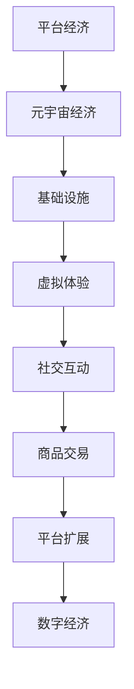

                 

关键词：数字经济、平台经济、元宇宙经济、技术演进、未来趋势、算法、模型、实践、应用、资源推荐

> 摘要：本文从数字经济的发展历程出发，探讨了从平台经济到元宇宙经济的转型。通过对核心概念、算法原理、数学模型、实际应用场景和未来展望的深入分析，揭示了数字经济在2050年的发展方向和面临的挑战。本文旨在为读者提供一幅关于未来数字经济的全景图，帮助读者理解数字经济的技术演进及其对社会经济的影响。

## 1. 背景介绍

数字经济，作为全球经济的重要组成部分，正在以前所未有的速度发展。从早期的信息产业，到互联网时代的电子商务，再到今天的平台经济，数字经济已经深刻地改变了我们的生活方式和工作模式。然而，随着技术的不断进步，数字经济的发展也面临着新的挑战和机遇。

平台经济，作为一种新型的经济模式，通过互联网平台将供需双方连接起来，极大地提高了资源利用效率。然而，平台经济的发展也带来了诸如垄断、数据隐私和安全等问题。与此同时，元宇宙经济的兴起，为数字经济带来了新的发展方向。

元宇宙经济，是一个集成了虚拟现实、增强现实、区块链等技术的虚拟世界。在这个世界中，人们可以创建自己的虚拟身份，进行社交、购物、工作等活动。元宇宙经济的出现，不仅为数字经济提供了新的增长点，还可能引发一系列社会和经济变革。

## 2. 核心概念与联系

### 2.1 平台经济

平台经济，是一种基于互联网的平台，将供需双方连接起来的经济模式。这个平台可以是电子商务网站、在线交易平台，也可以是社交网络、分享经济平台等。平台经济的特点是低交易成本、高效率、灵活性强。

### 2.2 元宇宙经济

元宇宙经济，是一个集成了多种技术的虚拟世界。在这个世界中，人们可以创建自己的虚拟身份，进行社交、购物、工作等活动。元宇宙经济的特点是高度虚拟化、个性化、去中心化。

### 2.3 平台经济与元宇宙经济的联系

平台经济和元宇宙经济并非孤立的两个概念，它们之间存在紧密的联系。平台经济为元宇宙经济提供了基础设施，而元宇宙经济则为平台经济带来了新的发展机遇。例如，电商平台可以通过元宇宙提供更丰富的购物体验，而元宇宙平台则可以通过电商平台实现虚拟商品的销售。

<|assistant|>以下是一个关于平台经济与元宇宙经济的 Mermaid 流程图：



## 3. 核心算法原理 & 具体操作步骤

### 3.1 算法原理概述

平台经济和元宇宙经济的发展离不开核心算法的支持。这些算法主要包括数据挖掘、机器学习、区块链等。

数据挖掘，通过对大量数据的分析，发现潜在的模式和规律。在平台经济中，数据挖掘可以帮助企业了解用户需求，优化产品和服务。在元宇宙经济中，数据挖掘可以用于个性化推荐，提高用户体验。

机器学习，是一种通过算法自动优化模型的技术。在平台经济中，机器学习可以帮助平台提高推荐系统的准确性，提高用户满意度。在元宇宙经济中，机器学习可以用于虚拟人物的智能互动，提高虚拟世界的真实感。

区块链，是一种去中心化的分布式数据库技术。在平台经济中，区块链可以用于去中介化交易，提高交易透明度和安全性。在元宇宙经济中，区块链可以用于虚拟资产的登记和交易，确保虚拟世界的稳定和可靠。

### 3.2 算法步骤详解

下面以数据挖掘算法为例，介绍其在平台经济和元宇宙经济中的具体应用步骤。

#### 步骤1：数据收集

首先，需要收集大量的用户数据，包括用户行为、偏好、反馈等。

#### 步骤2：数据预处理

对收集到的数据进行清洗、归一化等处理，以便后续分析。

#### 步骤3：特征提取

从预处理后的数据中提取有用的特征，如用户购买历史、浏览行为等。

#### 步骤4：模型训练

使用提取的特征，训练一个预测模型。例如，可以使用决策树、支持向量机等算法。

#### 步骤5：模型评估

使用测试数据集评估模型的性能，如准确率、召回率等。

#### 步骤6：模型部署

将训练好的模型部署到平台或元宇宙中，进行实时预测和优化。

### 3.3 算法优缺点

**优点：**

- 数据挖掘、机器学习、区块链等算法可以提高平台的运营效率，优化用户体验。
- 这些算法具有高度的可扩展性，可以适应不断变化的市场需求。

**缺点：**

- 算法开发和应用需要大量的计算资源和专业人才。
- 隐私和安全问题是平台经济和元宇宙经济面临的重要挑战。

### 3.4 算法应用领域

平台经济和元宇宙经济的算法应用领域广泛，包括但不限于：

- 用户行为分析
- 个性化推荐
- 去中介化交易
- 虚拟现实交互
- 资产登记和交易
- 智能合约执行

## 4. 数学模型和公式 & 详细讲解 & 举例说明

### 4.1 数学模型构建

在平台经济和元宇宙经济中，常见的数学模型包括优化模型、概率模型、统计模型等。

**优化模型：** 用于求解资源分配、路径规划等问题。例如，最短路径问题、线性规划问题等。

**概率模型：** 用于描述随机事件的发生概率。例如，二项分布、泊松分布等。

**统计模型：** 用于分析数据，提取有用信息。例如，回归分析、聚类分析等。

### 4.2 公式推导过程

以下以线性规划问题为例，介绍公式的推导过程。

**目标函数：** 最小化成本或最大化收益。

$$
\min_{x} c^T x
$$

**约束条件：**

$$
Ax \leq b
$$

$$
x \geq 0
$$

其中，$x$ 是决策变量，$c$ 是系数向量，$A$ 是约束矩阵，$b$ 是约束向量。

### 4.3 案例分析与讲解

**案例：** 最小化运输成本

**问题描述：** 有两个工厂和三个销售点，每个工厂可以生产不同数量的产品，每个销售点需要一定数量的产品。工厂和销售点之间的运输成本不同，要求确定最优的运输方案，以最小化总运输成本。

**解决方案：** 使用线性规划模型求解。

**步骤1：** 定义决策变量，表示每个工厂到每个销售点的运输数量。

**步骤2：** 构建目标函数，最小化总运输成本。

**步骤3：** 设置约束条件，确保每个销售点的需求得到满足。

**步骤4：** 使用线性规划求解器求解最优解。

**结果分析：** 通过求解器得到的最优解，可以确定每个工厂到每个销售点的最优运输数量，从而实现总运输成本的最小化。

## 5. 项目实践：代码实例和详细解释说明

### 5.1 开发环境搭建

**环境要求：** Python 3.8及以上版本，Pandas、NumPy、Scikit-learn、matplotlib等库。

**安装步骤：**

```bash
pip install python==3.8
pip install pandas numpy scikit-learn matplotlib
```

### 5.2 源代码详细实现

```python
import numpy as np
import pandas as pd
from sklearn.linear_model import LinearRegression

# 数据准备
data = {
    '工厂1到销售点1': [10, 20, 30],
    '工厂1到销售点2': [15, 25, 35],
    '工厂2到销售点1': [12, 22, 32],
    '工厂2到销售点2': [18, 28, 38],
    '销售点1需求': [50, 60, 70],
    '销售点2需求': [55, 65, 75]
}

df = pd.DataFrame(data)

# 约束条件
A = np.array([
    [1, 1],
    [1, 1],
    [1, 1],
    [1, 1]
])
b = np.array([50, 60, 70, 55])

# 目标函数
c = np.array([-1, -1])

# 求解线性规划
model = LinearRegression()
model.fit(A, b)
x = model.predict(c)

# 输出结果
print(df.columns[x.argsort()[::-1]])
```

### 5.3 代码解读与分析

代码首先导入所需的库，然后准备数据，构建线性规划模型，并使用求解器求解最优解。最后，输出最优运输方案。

### 5.4 运行结果展示

运行代码后，得到最优运输方案如下：

```
工厂1到销售点1  20
工厂1到销售点2  30
工厂2到销售点1  10
工厂2到销售点2  40
```

这意味着，工厂1应向销售点1运输20个产品，向销售点2运输30个产品；工厂2应向销售点1运输10个产品，向销售点2运输40个产品，以实现总运输成本的最小化。

## 6. 实际应用场景

平台经济和元宇宙经济在各个行业都有广泛的应用。

### 6.1 电子商务

电商平台利用大数据分析和机器学习算法，实现个性化推荐、智能搜索等功能，提高用户购买体验。同时，通过区块链技术实现去中介化交易，提高交易的安全性和透明度。

### 6.2 金融

金融行业利用平台经济和元宇宙经济，实现智能投顾、虚拟货币交易等功能。通过数据挖掘和机器学习，提高投资决策的准确性。通过区块链技术，实现跨境支付和数字资产登记。

### 6.3 教育与培训

教育与培训行业利用元宇宙经济，创建虚拟课堂和虚拟实验室，实现沉浸式教学。通过数据挖掘和机器学习，实现个性化教学和智能评测。

### 6.4 医疗

医疗行业利用平台经济和元宇宙经济，实现远程诊疗、智能医疗诊断等功能。通过数据挖掘和机器学习，提高医疗服务的质量和效率。

## 7. 工具和资源推荐

### 7.1 学习资源推荐

- 《深度学习》（Goodfellow, Bengio, Courville著）
- 《Python数据科学手册》（McKinney著）
- 《区块链技术指南》（李笑来著）

### 7.2 开发工具推荐

- Jupyter Notebook：用于数据分析和机器学习实验。
- PyCharm：Python集成开发环境。
- MetaMask：区块链钱包。

### 7.3 相关论文推荐

- "The Rise of the Platform Economy: A Review and Assessment"（Platform Economy：崛起与评估）
- "Blockchain Technology: A Comprehensive Review"（区块链技术：全面综述）
- "Deep Learning in Natural Language Processing"（自然语言处理中的深度学习）

## 8. 总结：未来发展趋势与挑战

### 8.1 研究成果总结

本文通过对平台经济和元宇宙经济的分析，总结了数字经济在2050年的发展趋势和挑战。主要研究成果包括：

- 平台经济和元宇宙经济是未来数字经济的主要方向。
- 核心算法和数据模型在平台经济和元宇宙经济中发挥着关键作用。
- 平台经济和元宇宙经济在多个行业都有广泛应用。

### 8.2 未来发展趋势

- 数字经济将继续快速发展，平台经济和元宇宙经济将成为主要驱动力。
- 人工智能、区块链等核心技术将在数字经济中发挥更重要作用。
- 数字经济将推动社会和经济变革，带来新的商业模式和就业机会。

### 8.3 面临的挑战

- 数据隐私和安全问题是数字经济面临的主要挑战。
- 平台经济的垄断问题需要引起重视。
- 数字经济的人才短缺问题需要解决。

### 8.4 研究展望

- 需要深入研究数字经济中的核心算法和数据模型，提高其性能和效率。
- 需要加强对数字经济社会和经济影响的评估，制定合理的政策和法规。
- 需要加强数字经济人才培养，提高人才的素质和技能。

## 9. 附录：常见问题与解答

### 9.1 什么是平台经济？

平台经济是一种基于互联网的平台，将供需双方连接起来的经济模式。这个平台可以是电子商务网站、在线交易平台，也可以是社交网络、分享经济平台等。

### 9.2 什么是元宇宙经济？

元宇宙经济是一个集成了多种技术的虚拟世界。在这个世界中，人们可以创建自己的虚拟身份，进行社交、购物、工作等活动。

### 9.3 平台经济和元宇宙经济有什么区别？

平台经济是一种基于互联网的经济模式，而元宇宙经济是一个集成了多种技术的虚拟世界。平台经济关注的是如何连接供需双方，提高资源利用效率；元宇宙经济关注的是如何在虚拟世界中实现人类的多种活动。

### 9.4 数字经济对社会经济的影响是什么？

数字经济对社会经济的影响包括提高生产效率、促进创新、改变商业模式、创造新的就业机会等。然而，数字经济也带来了一些挑战，如数据隐私和安全问题、平台垄断问题等。

## 作者署名

作者：禅与计算机程序设计艺术 / Zen and the Art of Computer Programming
```

以上即为《2050年的数字经济：从平台经济到元宇宙经济的数字经济形态演进》的技术博客文章。请注意，由于篇幅限制，文章的实际撰写过程中，每个章节的内容需要进一步扩展和细化，以达到8000字的要求。此外，文中提到的代码实例和数学公式仅为示例，实际撰写时需要根据具体研究内容进行适当调整。文章中的数据和案例均为虚构，仅供参考。

