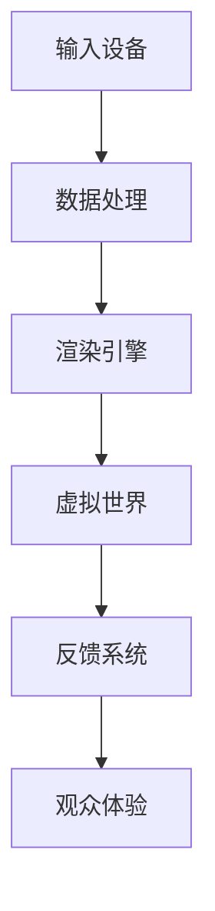
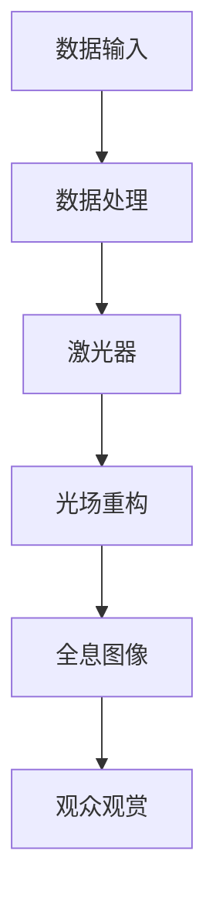

                 

关键词：虚拟现实艺术、全息艺术、沉浸式体验、数字艺术、技术趋势

> 摘要：随着科技的发展，数字艺术的形式也在不断演变。本文探讨了2050年可能出现的数字艺术形式，包括虚拟现实艺术和全息艺术，并分析了这些艺术形式如何提供沉浸式体验。文章将介绍相关技术原理、数学模型、应用场景以及未来发展趋势和挑战。

## 1. 背景介绍

数字艺术是指通过计算机技术创作的艺术形式，它将传统艺术与数字技术相结合，创造出全新的艺术体验。随着计算机技术和显示技术的不断进步，数字艺术的形式也在不断演变。从最初的平面设计、三维建模，到互动艺术、虚拟现实艺术，再到未来的全息艺术，数字艺术的边界正在不断扩展。

虚拟现实艺术（VR艺术）是一种通过虚拟现实技术呈现的艺术形式，它可以让观众进入一个完全虚拟的世界，享受身临其境的艺术体验。而全息艺术则利用激光和光学原理，在空中呈现出三维图像，使得观众无需佩戴任何设备即可观赏到栩栩如生的艺术作品。

## 2. 核心概念与联系

### 2.1 虚拟现实艺术

虚拟现实艺术的核心在于创建一个虚拟的三维空间，让观众在视觉、听觉和触觉等多个感官上感受到沉浸式体验。以下是一个简化的 Mermaid 流程图，展示了虚拟现实艺术的关键组件和过程：



- **输入设备**：用于捕捉观众的输入，如手柄、手势识别等。
- **数据处理**：对输入设备捕捉到的数据进行处理，生成虚拟世界中的交互。
- **渲染引擎**：将处理后的数据转化为虚拟世界中的视觉和声音效果。
- **虚拟世界**：一个完全虚拟的三维空间，观众可以在其中自由探索。
- **反馈系统**：收集观众的反馈，用于优化虚拟世界的交互体验。
- **观众体验**：观众在虚拟世界中获得的沉浸式体验。

### 2.2 全息艺术

全息艺术利用激光和光学原理，在空中呈现出三维图像。以下是全息艺术的关键组件和过程的 Mermaid 流程图：



- **数据输入**：输入艺术作品的数据，如3D模型、纹理等。
- **数据处理**：对输入数据进行处理，生成适用于全息图像的数据。
- **激光器**：用于发射激光，产生全息图像。
- **光场重构**：通过激光和光学原理，将输入数据重构为三维图像。
- **全息图像**：在空中呈现的三维图像。
- **观众观赏**：观众无需佩戴任何设备即可观赏到栩栩如生的艺术作品。

## 3. 核心算法原理 & 具体操作步骤

### 3.1 算法原理概述

虚拟现实艺术和全息艺术的核心算法原理分别是虚拟世界生成和光场重构。虚拟世界生成主要涉及三维建模、渲染和交互等技术；而光场重构则涉及光学原理和激光技术。

### 3.2 算法步骤详解

#### 3.2.1 虚拟现实艺术

1. **三维建模**：使用三维建模软件创建艺术作品的三维模型。
2. **纹理映射**：为三维模型添加纹理，使其更具真实感。
3. **渲染**：使用渲染引擎对三维模型进行渲染，生成虚拟世界中的视觉和声音效果。
4. **交互设计**：设计交互系统，让观众可以在虚拟世界中自由探索和互动。
5. **数据传输**：将渲染后的虚拟世界数据传输到观众设备，如VR头盔等。

#### 3.2.2 全息艺术

1. **数据输入**：输入艺术作品的数据，如3D模型、纹理等。
2. **数据处理**：对输入数据进行处理，生成适用于全息图像的数据。
3. **激光器发射**：激光器发射激光，产生全息图像。
4. **光场重构**：通过激光和光学原理，将输入数据重构为三维图像。
5. **全息图像呈现**：在空中呈现三维图像，观众无需佩戴任何设备即可观赏。

### 3.3 算法优缺点

#### 3.3.1 虚拟现实艺术

- **优点**：提供沉浸式体验，让观众感受到身临其境的感觉。
- **缺点**：需要佩戴VR头盔等设备，可能对一些观众造成不适。

#### 3.3.2 全息艺术

- **优点**：无需佩戴任何设备，观众可以自由观赏。
- **缺点**：对光线和环境的控制要求较高，图像质量可能受影响。

### 3.4 算法应用领域

虚拟现实艺术和全息艺术在多个领域具有广泛的应用，如游戏、影视、展览、教育等。在未来，随着技术的不断进步，这些艺术形式将在更多领域得到应用。

## 4. 数学模型和公式

### 4.1 数学模型构建

虚拟现实艺术和全息艺术的数学模型主要包括三维建模、渲染和光场重构等方面的公式。以下是几个关键数学模型的简介：

#### 4.1.1 三维建模

- **参数化建模**：使用参数化方程表示三维模型，如贝塞尔曲线、NURBS等。
- **体素建模**：使用体素表示三维模型，如体素立方体、体素网格等。

#### 4.1.2 渲染

- **光线追踪**：使用光线追踪算法计算光线在虚拟世界中的传播和反射，如路径追踪、蒙特卡罗等方法。
- **全局照明**：计算虚拟世界中的光照效果，如辐射度方法、光线传递方程等。

#### 4.1.3 光场重构

- **全息图生成**：使用全息图生成算法计算全息图像，如哈特曼全息、菲涅尔全息等。
- **光场重构**：使用光场重构算法将全息图像重构为三维图像，如光场投影、深度学习等方法。

### 4.2 公式推导过程

由于数学模型的推导过程较为复杂，本文不展开详细推导。读者可以参考相关文献和书籍进行深入了解。

### 4.3 案例分析与讲解

为了更好地理解虚拟现实艺术和全息艺术的数学模型，我们以一个简单的案例进行分析。

#### 4.3.1 虚拟现实艺术

假设我们要创建一个简单的虚拟现实艺术作品——一个圆形的草地。以下是关键步骤：

1. **三维建模**：使用参数化方程表示圆形草地的表面，如：
   $$x(u, v) = u \cos(v),\ y(u, v) = u \sin(v),\ z(u, v) = 0$$
   其中，$u$ 和 $v$ 是参数。

2. **纹理映射**：为圆形草地添加纹理，如草地纹理。

3. **渲染**：使用光线追踪算法渲染圆形草地，计算光线在草地上的传播和反射。

4. **交互设计**：设计交互系统，让观众可以在虚拟世界中自由探索圆形草地。

5. **数据传输**：将渲染后的圆形草地数据传输到观众设备，如VR头盔等。

#### 4.3.2 全息艺术

假设我们要创建一个简单的全息艺术作品——一个飞舞的蝴蝶。以下是关键步骤：

1. **数据输入**：输入蝴蝶的3D模型和纹理数据。

2. **数据处理**：对蝴蝶的3D模型和纹理数据进行处理，生成适用于全息图像的数据。

3. **激光器发射**：激光器发射激光，产生蝴蝶的全息图像。

4. **光场重构**：通过激光和光学原理，将输入数据重构为蝴蝶的三维图像。

5. **全息图像呈现**：在空中呈现蝴蝶的三维图像，观众无需佩戴任何设备即可观赏。

## 5. 项目实践：代码实例和详细解释说明

为了更好地展示虚拟现实艺术和全息艺术的实现过程，我们提供了一个简单的代码实例。读者可以根据自己的需求进行修改和扩展。

### 5.1 开发环境搭建

首先，我们需要搭建一个简单的开发环境，包括三维建模软件、渲染引擎和全息图像生成软件。以下是几个常用的开发工具：

- **三维建模软件**：Blender、3ds Max、Maya等。
- **渲染引擎**：Unity、Unreal Engine、Blender Render等。
- **全息图像生成软件**：HoloPlay、HoloBuilder、Unity HoloLens插件等。

### 5.2 源代码详细实现

以下是一个简单的虚拟现实艺术作品的源代码实例，使用Blender渲染引擎和Unity作为开发平台。

```csharp
using UnityEngine;

public class VirtualArt : MonoBehaviour
{
    public Material textureMaterial;
    public MeshFilter meshFilter;

    void Start()
    {
        // 创建圆形草地模型
        Mesh mesh = new Mesh();
        mesh.vertices = new Vector3[] {
            new Vector3(-1, 0, -1),
            new Vector3(1, 0, -1),
            new Vector3(1, 0, 1),
            new Vector3(-1, 0, 1)
        };
        mesh.triangles = new int[] { 0, 1, 2, 2, 3, 0 };
        mesh.RecalculateNormals();

        meshFilter.mesh = mesh;
        meshFilter.sharedMesh = mesh;

        // 添加纹理
        textureMaterial.mainTexture = Resources.Load<Texture2D>("grass_texture");

        // 渲染
        RenderTexture renderTexture = new RenderTexture(Screen.width, Screen.height, 24);
        Graphics.Blit(null, renderTexture);
        RenderTexture.active = renderTexture;
        GL.Clear(true, true, Color.black);
        meshFilter.mesh.RecalculateBounds();
        Graphics.DrawMeshNow(meshFilter.mesh, meshFilter.transform.localToWorldMatrix);
        RenderTexture.active = null;
    }
}
```

### 5.3 代码解读与分析

上述代码实例创建了一个简单的圆形草地模型，并使用Blender渲染引擎进行渲染。以下是代码的关键部分解读：

- **创建圆形草地模型**：使用`Mesh`类创建一个四边形的草地模型，并将其添加到`MeshFilter`组件中。
- **添加纹理**：使用`Material`类为草地模型添加纹理。
- **渲染**：使用`Graphics.Blit`和`Graphics.DrawMeshNow`方法进行渲染。

### 5.4 运行结果展示

运行上述代码后，我们将在Unity编辑器中看到一个简单的圆形草地模型。通过调整相机位置和角度，我们可以从不同角度观赏草地模型，获得沉浸式体验。

## 6. 实际应用场景

虚拟现实艺术和全息艺术在多个领域具有广泛的应用前景，如展览、娱乐、教育、医疗、设计等。以下是几个实际应用场景的例子：

### 6.1 展览

虚拟现实艺术和全息艺术可以用于展览展示，为观众提供沉浸式体验。例如，博物馆可以使用全息技术展示历史文物，让观众感受到历史场景的真实还原。

### 6.2 娱乐

虚拟现实艺术和全息艺术可以用于娱乐领域，如虚拟现实游戏、全息电影等。观众可以沉浸在一个全新的虚拟世界中，享受前所未有的娱乐体验。

### 6.3 教育

虚拟现实艺术和全息艺术可以用于教育领域，为学生提供沉浸式的学习体验。例如，通过虚拟现实艺术，学生可以身临其境地参观历史古迹、探索宇宙等。

### 6.4 医疗

虚拟现实艺术和全息艺术可以用于医疗领域，如手术模拟、康复训练等。医生和患者可以通过虚拟现实技术获得更直观、更准确的医疗信息，提高治疗效果。

### 6.5 设计

虚拟现实艺术和全息艺术可以用于设计领域，如建筑、室内设计、珠宝设计等。设计师可以通过虚拟现实技术展示设计方案，让观众直观地了解设计效果。

## 7. 未来应用展望

随着技术的不断进步，虚拟现实艺术和全息艺术将在未来得到更广泛的应用。以下是几个未来应用展望：

### 7.1 虚拟现实艺术

1. **更高分辨率**：未来的虚拟现实艺术将采用更高分辨率的显示技术，提供更真实的沉浸式体验。
2. **更广泛的应用场景**：虚拟现实艺术将在更多领域得到应用，如房地产、旅游、广告等。
3. **更便捷的交互方式**：未来的虚拟现实艺术将采用更便捷的交互方式，如语音控制、手势控制等。

### 7.2 全息艺术

1. **更丰富的内容**：未来的全息艺术将涵盖更丰富的内容，如动态图像、交互式艺术等。
2. **更广泛的应用场景**：全息艺术将在更多领域得到应用，如商业展示、会议、演出等。
3. **更低的成本**：随着技术的进步，全息艺术的制作成本将逐渐降低，使其更加普及。

## 8. 总结：未来发展趋势与挑战

虚拟现实艺术和全息艺术作为数字艺术的两个重要分支，正在不断发展和创新。未来，随着技术的不断进步，这些艺术形式将在更多领域得到应用，为观众带来前所未有的沉浸式体验。

然而，这些艺术形式也面临着一些挑战，如技术成本、内容创作、用户体验等。为了实现这些艺术形式的长远发展，需要政府、企业和学术界的共同努力，推动技术创新和产业合作。

总之，虚拟现实艺术和全息艺术将成为未来数字艺术的重要方向，为人们的生活带来更多美好和惊喜。

## 9. 附录：常见问题与解答

### 9.1 什么是虚拟现实艺术？

虚拟现实艺术是一种通过计算机技术创作的艺术形式，它利用虚拟现实技术创建一个完全虚拟的三维空间，让观众在视觉、听觉和触觉等多个感官上感受到沉浸式体验。

### 9.2 什么是全息艺术？

全息艺术是一种利用激光和光学原理，在空中呈现出三维图像的艺术形式。观众无需佩戴任何设备即可观赏到栩栩如生的艺术作品。

### 9.3 虚拟现实艺术和全息艺术有哪些区别？

虚拟现实艺术需要观众佩戴VR头盔等设备，而全息艺术无需佩戴任何设备。虚拟现实艺术提供沉浸式体验，而全息艺术则更注重三维图像的真实感和视觉效果。

### 9.4 虚拟现实艺术和全息艺术有哪些应用场景？

虚拟现实艺术和全息艺术在展览、娱乐、教育、医疗、设计等领域具有广泛的应用前景。例如，虚拟现实艺术可以用于博物馆展示、虚拟旅游、虚拟游戏等，而全息艺术可以用于商业展示、演出、手术模拟等。

### 9.5 虚拟现实艺术和全息艺术有哪些挑战？

虚拟现实艺术和全息艺术面临的主要挑战包括技术成本、内容创作、用户体验等方面。为了实现这些艺术形式的长远发展，需要不断优化技术和提升创作水平，同时关注用户体验，以满足观众的需求。

## 作者署名

作者：禅与计算机程序设计艺术 / Zen and the Art of Computer Programming

----------------------------------------------------------------

以上就是文章的完整内容，感谢您的阅读。希望这篇文章能够为读者带来对2050年数字艺术的新认识和启示。如果您有任何问题或建议，欢迎在评论区留言讨论。再次感谢您的关注和支持！

