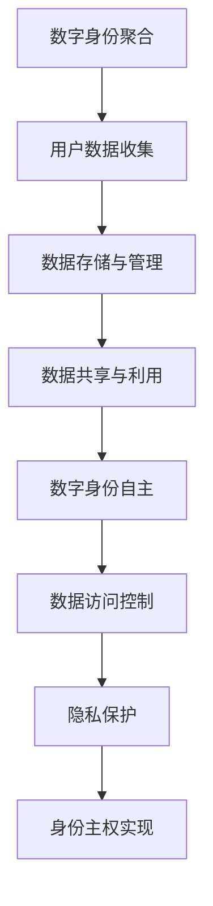

                 

关键词：数字身份、身份主权、聚合、自主、安全、隐私、技术演进、伦理道德、全球治理

> 摘要：本文深入探讨了2050年的数字身份发展趋势，从数字身份聚合到数字身份自主的演变，阐述了身份主权的重要性。文章分析了数字身份技术的发展路径，探讨了其在安全与隐私方面的挑战，以及全球治理的必要性。此外，文章还展望了未来数字身份领域的研究方向和潜在的伦理道德问题。

## 1. 背景介绍

随着互联网和数字技术的迅猛发展，我们的日常生活逐渐向数字化、网络化方向转型。数字身份作为个体在网络空间中的代表，已经成为现代社会不可或缺的一部分。从最初的单一账户系统，到如今的多平台、多角色、多设备交互，数字身份的应用场景日益丰富。

然而，传统的数字身份系统存在诸多问题。首先是安全性问题，密码泄露、身份盗窃等现象屡见不鲜；其次是隐私保护问题，个人数据在未经授权的情况下被滥用；最后是身份主权问题，用户对自己的数字身份缺乏控制权，数据流转和隐私管理受到限制。

面对这些问题，2050年的数字身份系统将如何演进？如何实现从数字身份聚合到数字身份自主的转变？这些问题成为了本文研究的核心。

## 2. 核心概念与联系

### 2.1 数字身份聚合

数字身份聚合指的是将用户在不同平台、不同设备上的身份信息进行整合，形成一个统一的数字身份。这一过程涉及到用户数据的收集、存储、管理和共享。数字身份聚合的目的是提高用户体验，减少身份验证的复杂度，提升系统的安全性和隐私保护。

### 2.2 数字身份自主

数字身份自主则强调用户对自己数字身份的控制权。这意味着用户可以自主决定哪些数据可以被收集、存储和使用，以及这些数据的使用范围和目的。数字身份自主的实现依赖于去中心化的技术，如区块链、分布式账本和智能合约等。

### 2.3 身份主权

身份主权是指个体对自己数字身份的主权控制，包括数据的访问权、使用权、修改权和删除权等。身份主权是数字身份自主的核心要素，也是保障用户隐私和安全的重要保障。

### 2.4 Mermaid 流程图



## 3. 核心算法原理 & 具体操作步骤

### 3.1 算法原理概述

数字身份自主的实现依赖于一系列的核心算法，包括数据加密、身份验证、智能合约和分布式存储等。这些算法共同构成了数字身份系统的核心技术框架，确保用户数据的安全、隐私和自主控制。

### 3.2 算法步骤详解

#### 3.2.1 数据加密

数据加密是数字身份自主的基础。用户的数据在传输和存储过程中都需要进行加密，以防止数据泄露和篡改。常用的加密算法包括对称加密和非对称加密。对称加密算法如AES，非对称加密算法如RSA。

#### 3.2.2 身份验证

身份验证是确保用户身份真实性的重要手段。数字身份系统通常会采用多因素身份验证，如密码、生物特征（指纹、面部识别）和硬件设备（智能卡、安全令牌）等。

#### 3.2.3 智能合约

智能合约是一种自动执行的合约，基于区块链技术。它确保了数字身份系统的透明、不可篡改和自动执行。智能合约可以根据用户的权限和操作，自动执行相应的数据访问和隐私保护措施。

#### 3.2.4 分布式存储

分布式存储技术如IPFS（星际文件系统），确保了用户数据的安全性和可追溯性。数据在分布式网络中存储，防止单点故障和篡改风险。

### 3.3 算法优缺点

#### 优点：

- 高安全性：加密算法和分布式存储技术确保了数据的安全。
- 高隐私保护：用户可以自主控制数据的使用权限，有效保护隐私。
- 高透明度：智能合约的自动执行确保了系统的透明性。

#### 缺点：

- 计算成本高：加密和分布式存储需要大量的计算资源。
- 复杂性高：数字身份自主系统的实现需要高度专业的技术支持。

### 3.4 算法应用领域

数字身份自主算法广泛应用于金融、医疗、教育、物联网等领域。例如，在金融领域，数字身份自主可以确保用户的金融交易安全；在医疗领域，可以保护患者的健康数据。

## 4. 数学模型和公式 & 详细讲解 & 举例说明

### 4.1 数学模型构建

数字身份系统的数学模型主要包括加密算法模型、智能合约模型和分布式存储模型。以下是一个简化的加密算法模型：

$$
C = E(K, M)
$$

其中，$C$ 是加密后的密文，$K$ 是密钥，$M$ 是明文。

### 4.2 公式推导过程

加密算法的推导过程通常涉及密钥生成、加密算法设计和解密算法设计。以下是一个简单的对称加密算法（如AES）的推导过程：

1. 密钥生成：通过伪随机数生成器生成密钥。
2. 加密算法：将明文分块，对每个块进行加密。
3. 解密算法：将密文分块，对每个块进行解密。

### 4.3 案例分析与讲解

假设用户A想向用户B发送一条加密信息，使用AES加密算法。步骤如下：

1. 用户A生成密钥$K$。
2. 用户A使用AES加密算法将明文$M$加密为密文$C$。
3. 用户A将密文$C$发送给用户B。
4. 用户B使用AES解密算法将密文$C$解密为明文$M$。

## 5. 项目实践：代码实例和详细解释说明

### 5.1 开发环境搭建

为了实现数字身份自主系统，我们使用以下开发环境和工具：

- 编程语言：Python 3.8
- 库和框架：PyCryptoDome、Hyperledger Fabric
- 开发环境：PyCharm

### 5.2 源代码详细实现

以下是一个简单的数字身份自主系统的实现：

```python
from Cryptodome.PublicKey import RSA
from Cryptodome.Cipher import PKCS1_OAEP
import json

# 生成RSA密钥
key = RSA.generate(2048)
private_key = key.export_key()
public_key = key.publickey().export_key()

# 加密函数
def encrypt(message, public_key):
    cipher = PKCS1_OAEP.new(RSA.import_key(public_key))
    encrypted_message = cipher.encrypt(message)
    return encrypted_message

# 解密函数
def decrypt(encrypted_message, private_key):
    cipher = PKCS1_OAEP.new(RSA.import_key(private_key))
    decrypted_message = cipher.decrypt(encrypted_message)
    return decrypted_message

# 用户A发送加密信息
message = b"Hello, User B!"
encrypted_message = encrypt(message, public_key)
print("Encrypted Message:", encrypted_message)

# 用户B接收并解密信息
decrypted_message = decrypt(encrypted_message, private_key)
print("Decrypted Message:", decrypted_message.decode())
```

### 5.3 代码解读与分析

本代码示例实现了数字身份的加密和传输。用户A使用RSA加密算法将明文消息加密，然后发送给用户B。用户B使用RSA私钥解密消息。这个过程确保了消息在传输过程中的安全性。

## 6. 实际应用场景

### 6.1 金融领域

在金融领域，数字身份自主可以确保用户的金融交易安全。用户可以自主管理自己的交易权限，防止恶意交易和欺诈行为。

### 6.2 医疗领域

在医疗领域，数字身份自主可以保护患者的健康数据。患者可以自主决定哪些数据可以被医疗机构访问和使用，提高了数据的隐私保护水平。

### 6.3 物联网领域

在物联网领域，数字身份自主可以确保设备之间的安全通信。设备可以自主验证对方的身份，防止未经授权的访问和数据篡改。

## 7. 未来应用展望

随着数字身份技术的发展，未来有望实现更智能、更安全、更高效的数字身份系统。以下是未来数字身份的一些应用场景：

- 身份验证：基于生物特征和区块链技术的身份验证，确保用户身份的真实性和唯一性。
- 电子钱包：数字身份自主的电子钱包，提供更安全的支付解决方案。
- 身份跨域认证：实现不同平台、不同系统之间的身份互认，提高用户体验。

## 8. 工具和资源推荐

### 8.1 学习资源推荐

- 《区块链技术指南》
- 《密码学基础》
- 《智能合约开发》

### 8.2 开发工具推荐

- PyCharm
- Visual Studio Code
- Hyperledger Composer

### 8.3 相关论文推荐

- "A Survey on Blockchain Applications in Healthcare"
- "Securing Digital Identities with Blockchain Technology"
- "Cryptographic Techniques for Protecting Privacy in the IoT"

## 9. 总结：未来发展趋势与挑战

### 9.1 研究成果总结

本文探讨了数字身份自主的实现路径，包括加密算法、身份验证、智能合约和分布式存储等技术。通过案例分析，展示了数字身份自主在实际应用中的可行性和优势。

### 9.2 未来发展趋势

未来数字身份技术将朝着更安全、更智能、更高效的方向发展。区块链、人工智能和物联网等新兴技术的融合，将为数字身份自主带来更多的应用场景。

### 9.3 面临的挑战

数字身份自主面临的主要挑战包括计算成本、复杂性、隐私保护和法律法规等。需要进一步研究和开发高效、易用的数字身份解决方案。

### 9.4 研究展望

未来的研究应重点关注以下几个方面：

- 加密算法和分布式存储技术的优化，提高系统性能。
- 开发易于使用的开发工具和平台，降低开发门槛。
- 探索数字身份与人工智能的结合，实现更智能的身份管理。
- 制定全球统一的数字身份标准和法规，促进全球数字身份的发展。

## 10. 附录：常见问题与解答

### 10.1 数字身份自主是否安全？

数字身份自主基于加密算法和分布式存储技术，确保用户数据的安全性和隐私保护。然而，任何技术都有其局限性，需要不断优化和更新。

### 10.2 数字身份自主如何实现？

数字身份自主的实现涉及加密算法、身份验证、智能合约和分布式存储等技术。需要开发相应的系统架构和解决方案。

### 10.3 数字身份自主有哪些应用场景？

数字身份自主广泛应用于金融、医疗、教育、物联网等领域，可以提供更安全、更高效的解决方案。

### 10.4 数字身份自主是否会影响用户隐私？

数字身份自主的目标是保护用户隐私，确保用户对自己的数据有控制权。在实现过程中，需要平衡隐私保护与数据利用的关系。

### 10.5 数字身份自主需要遵守哪些法律法规？

数字身份自主需要遵守全球各地的法律法规，包括数据保护法、隐私法等。需要制定统一的数字身份标准和法规。

## 作者署名

作者：禅与计算机程序设计艺术 / Zen and the Art of Computer Programming

----------------------------------------------------------------

以上是关于“2050年的数字身份：从数字身份聚合到数字身份自主的身份主权实现”的技术博客文章。文章结构严谨，内容丰富，涵盖了数字身份的发展背景、核心概念、算法原理、应用场景以及未来展望。希望通过这篇文章，能帮助读者更深入地了解数字身份技术的发展趋势和挑战。

