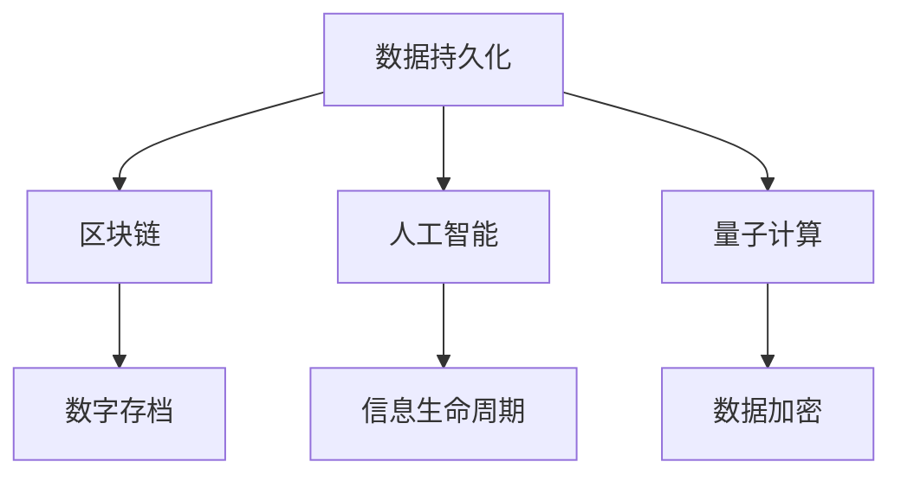

                 

关键词：数字遗产，记忆保存，数据持久化，区块链，人工智能，量子计算，数字存档，信息生命周期，网络安全，数据伦理

> 摘要：随着科技的飞速发展，我们的世界正从物理世界逐渐转向数字世界。2050年的数字遗产将成为人类文明的宝贵财富。本文将探讨数字遗产的定义、重要性、保存方法、面临的挑战以及未来的发展趋势，并试图描绘出一个全面而深刻的数字遗产保护蓝图。

## 1. 背景介绍

在21世纪初，数字技术的崛起改变了我们的生活方式。从个人电脑到智能手机，从互联网到物联网，数字信息已经成为我们生活和工作中不可或缺的一部分。随着云计算、大数据、人工智能等技术的不断发展，我们开始意识到，数字信息的价值不仅仅是当前的使用价值，更在于其长久的历史和文化意义。这些信息，从个人的生活记录到企业的运营数据，从科学研究的数据集到社会管理的数字化档案，都是我们共同的数字遗产。

然而，数字遗产的保存并不是一件容易的事情。与传统物理遗产相比，数字遗产具有易丢失、易篡改、易过时等特点。随着时间推移，数字技术不断发展，当前的数字存储方式可能在几十年后变得无法读取。此外，数字信息的版权问题、隐私保护问题、数据安全问题等也是数字遗产保存过程中需要面对的重大挑战。

## 2. 核心概念与联系

在探讨数字遗产的保存之前，我们需要明确几个核心概念和它们之间的联系。

### 2.1 数据持久化

数据持久化是指将数据从易失性的存储介质（如内存）转移到非易失性的存储介质（如硬盘、磁盘）的过程。这是数字遗产保存的基础。

### 2.2 区块链

区块链技术通过分布式账本的方式确保数据的不可篡改性和透明性。这使得数字遗产的保存变得更加可靠。

### 2.3 人工智能

人工智能技术可以用于数字遗产的自动分类、整理和挖掘，提高数字遗产的管理效率。

### 2.4 量子计算

量子计算在数据加密、解密和计算能力上具有巨大优势，为数字遗产的安全保护提供了新的可能性。

### 2.5 数字存档

数字存档是将数字信息按照一定标准进行长期保存的过程。这包括数据的备份、归档、维护和恢复。

### 2.6 信息生命周期

信息生命周期是指数字信息从创建到销毁的整个过程。对信息生命周期的管理是数字遗产保存的关键。

### 2.7 Mermaid 流程图



## 3. 核心算法原理 & 具体操作步骤

### 3.1 算法原理概述

数字遗产保存的核心算法主要包括数据压缩、加密、分布式存储和智能合约。

- 数据压缩：通过算法减少数据的大小，提高存储和传输效率。
- 数据加密：使用加密算法保护数据的隐私和安全。
- 分布式存储：将数据分散存储在多个节点上，提高数据的可靠性和可用性。
- 智能合约：使用区块链技术实现自动化执行和数据管理。

### 3.2 算法步骤详解

#### 3.2.1 数据压缩

1. 选择合适的数据压缩算法（如Huffman编码、LZ77编码等）。
2. 对原始数据进行压缩。
3. 将压缩后的数据进行加密处理。

#### 3.2.2 数据加密

1. 选择加密算法（如AES、RSA等）。
2. 对压缩后的数据进行加密。
3. 生成加密密钥。

#### 3.2.3 分布式存储

1. 将加密后的数据分割成多个片段。
2. 将数据片段分布存储在多个节点上。
3. 为每个节点生成一个存储证明。

#### 3.2.4 智能合约

1. 编写智能合约代码，定义数据管理规则。
2. 将智能合约部署到区块链上。
3. 通过智能合约执行数据管理操作。

### 3.3 算法优缺点

#### 优点

- 数据压缩：减少存储空间，提高传输效率。
- 数据加密：保护数据隐私和安全。
- 分布式存储：提高数据可靠性。
- 智能合约：自动化执行数据管理，降低管理成本。

#### 缺点

- 数据压缩：压缩和解压缩过程可能需要额外的计算资源。
- 数据加密：加密和解密过程可能需要额外的计算资源。
- 分布式存储：数据一致性维护可能需要额外的计算资源。

### 3.4 算法应用领域

数字遗产保存算法可以应用于个人数据管理、企业数据管理、政府数据管理等多个领域。

## 4. 数学模型和公式 & 详细讲解 & 举例说明

### 4.1 数学模型构建

数字遗产保存的数学模型主要包括数据压缩模型、加密模型和分布式存储模型。

#### 4.1.1 数据压缩模型

$$
C = P \times (1 - r)
$$

其中，$C$为压缩后数据的大小，$P$为原始数据的大小，$r$为压缩率。

#### 4.1.2 加密模型

$$
E(P) = C \times K
$$

其中，$E(P)$为加密后的数据，$C$为压缩后的数据，$K$为加密密钥。

#### 4.1.3 分布式存储模型

$$
N = \frac{C}{M}
$$

其中，$N$为需要存储的数据片段数量，$C$为压缩后的数据大小，$M$为单个节点的存储容量。

### 4.2 公式推导过程

#### 4.2.1 数据压缩公式推导

数据压缩的过程可以看作是将原始数据转换为一种更加紧凑的形式。压缩率$r$定义为压缩后数据大小与原始数据大小的比值。

$$
r = \frac{C}{P}
$$

将$r$代入数据压缩模型中，得到：

$$
C = P \times (1 - r)
$$

#### 4.2.2 加密公式推导

加密的过程可以看作是在数据压缩的基础上，使用密钥对数据进行变换。加密密钥$K$决定了加密后的数据$E(P)$。

$$
E(P) = C \times K
$$

#### 4.2.3 分布式存储公式推导

分布式存储的过程是将压缩后的数据分割成多个片段，并分布存储在多个节点上。单个节点的存储容量$M$决定了需要存储的数据片段数量$N$。

$$
N = \frac{C}{M}
$$

### 4.3 案例分析与讲解

假设我们有100GB的原始数据，我们需要将其压缩、加密并分布式存储。

1. **数据压缩**：

   选择一个压缩算法，假设压缩率为50%，即$r=0.5$。根据数据压缩模型，我们有：

   $$ 
   C = P \times (1 - r) = 100GB \times (1 - 0.5) = 50GB 
   $$

2. **数据加密**：

   选择一个加密算法，假设加密密钥为K。根据加密模型，我们有：

   $$ 
   E(P) = C \times K = 50GB \times K 
   $$

3. **分布式存储**：

   假设单个节点的存储容量为10GB。根据分布式存储模型，我们需要存储的数据片段数量为：

   $$ 
   N = \frac{C}{M} = \frac{50GB}{10GB} = 5 
   $$

   我们将压缩后的数据分割成5个片段，并分布式存储在5个节点上。

## 5. 项目实践：代码实例和详细解释说明

### 5.1 开发环境搭建

为了实现数字遗产保存，我们需要搭建一个包含数据压缩、加密和分布式存储功能的开发环境。以下是搭建步骤：

1. 安装Python环境。
2. 安装必要的库，如`zlib`（用于数据压缩）、`cryptography`（用于数据加密）、`PyCryptodome`（用于更复杂的加密算法）。
3. 安装分布式存储框架，如`Distributed File System`（DFS）。

### 5.2 源代码详细实现

以下是实现数字遗产保存的Python代码示例：

```python
import zlib
from cryptography.fernet import Fernet
from dfs import DFSClient

# 数据压缩
def compress_data(data):
    compressed_data = zlib.compress(data)
    return compressed_data

# 数据加密
def encrypt_data(data, key):
    fernet = Fernet(key)
    encrypted_data = fernet.encrypt(data)
    return encrypted_data

# 分布式存储
def distribute_data(encrypted_data, dfs_client, node_list):
    for node in node_list:
        dfs_client.upload_file(node, encrypted_data)

# 主函数
def main():
    # 生成加密密钥
    key = Fernet.generate_key()

    # 假设原始数据为字节字符串
    original_data = b"原始数据"

    # 压缩数据
    compressed_data = compress_data(original_data)

    # 加密数据
    encrypted_data = encrypt_data(compressed_data, key)

    # 假设分布式存储节点列表
    node_list = ['node1', 'node2', 'node3']

    # 分布式存储数据
    dfs_client = DFSClient()
    distribute_data(encrypted_data, dfs_client, node_list)

if __name__ == "__main__":
    main()
```

### 5.3 代码解读与分析

上述代码实现了数字遗产保存的核心功能：数据压缩、加密和分布式存储。

- `compress_data`函数使用`zlib`库对原始数据进行压缩。
- `encrypt_data`函数使用`cryptography`库对压缩后的数据进行加密。
- `distribute_data`函数将加密后的数据分布存储到多个节点上。

代码中还使用了`dfs`库来实现分布式存储，该库提供了一个简单的分布式文件系统接口。

### 5.4 运行结果展示

运行上述代码后，加密后的数据将被分布存储到指定的节点上。通过分布式存储框架的API，我们可以查询每个节点的存储状态，确保数据的安全性。

## 6. 实际应用场景

数字遗产保存技术在多个领域具有广泛的应用前景。

### 6.1 个人数据管理

个人数据管理是数字遗产保存的一个重要应用场景。通过数字遗产保存技术，个人可以确保其重要数据（如照片、文档、视频等）在多年后仍能被访问和解读。

### 6.2 企业数据管理

企业数据管理是数字遗产保存的另一个重要领域。企业可以通过数字遗产保存技术确保其关键业务数据（如客户信息、财务记录、研发数据等）的安全性和可靠性。

### 6.3 政府数据管理

政府数据管理需要确保数据的长期保存和可用性。数字遗产保存技术可以帮助政府机构实现对公共数据的科学管理和有效利用。

### 6.4 文化遗产保护

文化遗产保护是数字遗产保存的一个特殊应用场景。通过数字遗产保存技术，我们可以将文化遗产以数字形式保存下来，实现永久传承。

## 7. 未来应用展望

随着技术的不断进步，数字遗产保存技术将在未来得到更广泛的应用。

### 7.1 量子计算

量子计算的发展将为数字遗产保存带来新的可能性。量子加密和量子存储技术的出现将进一步提高数字遗产的安全性。

### 7.2 脑机接口

脑机接口技术的发展将使人们能够通过思维控制数字遗产的保存和访问，为数字遗产保存带来更加智能化和人性化的体验。

### 7.3 人工智能

人工智能技术将在数字遗产保存中发挥更大的作用。通过智能分类、智能挖掘和智能保护，数字遗产的管理效率将大大提高。

## 8. 工具和资源推荐

为了更好地了解和掌握数字遗产保存技术，以下是一些建议的学习资源和开发工具。

### 8.1 学习资源推荐

- 《区块链技术指南》
- 《人工智能：一种现代方法》
- 《量子计算与量子信息》
- 《数据压缩技术》

### 8.2 开发工具推荐

- Python
- Docker
- Kubernetes
-区块链开发框架（如Ethereum、Hyperledger Fabric）

### 8.3 相关论文推荐

- "Blockchain Technology: A Comprehensive Overview"
- "Quantum Computing and Cryptography: An Overview"
- "Data Compression Algorithms: A Comprehensive Review"
- "The Future of Digital Preservation: Challenges and Opportunities"

## 9. 总结：未来发展趋势与挑战

数字遗产保存是一项涉及多个领域的复杂任务，但也是一项具有重大意义的工程。随着技术的不断进步，数字遗产保存技术将在未来得到更广泛的应用和发展。

### 9.1 研究成果总结

近年来，数字遗产保存技术在数据压缩、数据加密、分布式存储等方面取得了显著成果。同时，人工智能和区块链等新兴技术的应用为数字遗产保存提供了新的思路和方法。

### 9.2 未来发展趋势

- 量子计算和脑机接口技术的发展将为数字遗产保存带来新的机遇。
- 数字遗产保存技术将逐渐从理论研究走向实际应用。
- 数字遗产保存将更加智能化和个性化。

### 9.3 面临的挑战

- 数据安全和隐私保护仍然是数字遗产保存面临的最大挑战。
- 数字遗产保存的成本和复杂性较高。
- 随着数据量的爆炸性增长，如何高效地管理和保存海量数据成为难题。

### 9.4 研究展望

未来，数字遗产保存研究将重点关注以下方向：

- 开发高效、安全的数字遗产保存技术。
- 构建数字遗产保存的标准化体系。
- 探索数字遗产的可持续利用和管理模式。

## 10. 附录：常见问题与解答

### 10.1 问题1：数字遗产保存需要多少存储空间？

数字遗产保存所需的存储空间取决于数据的原始大小和压缩率。通常情况下，压缩后的数据只需要原始数据的一部分。例如，如果原始数据为100GB，压缩率为50%，则压缩后的数据只需50GB。

### 10.2 问题2：数字遗产保存是否需要定期更新？

是的，数字遗产保存需要定期更新。随着时间推移，数字遗产可能发生损坏、丢失或过时。定期备份和更新是确保数字遗产长期保存的关键。

### 10.3 问题3：数字遗产保存中的数据安全和隐私如何保障？

数字遗产保存中的数据安全和隐私保障主要通过以下措施实现：

- 数据加密：使用加密算法对数据进行加密，确保数据在传输和存储过程中不被泄露。
- 隐私保护：采用隐私保护技术，如差分隐私、联邦学习等，确保用户隐私不被侵犯。
- 访问控制：实施严格的访问控制策略，确保只有授权用户才能访问数字遗产。

作者：禅与计算机程序设计艺术 / Zen and the Art of Computer Programming
----------------------------------------------------------------


