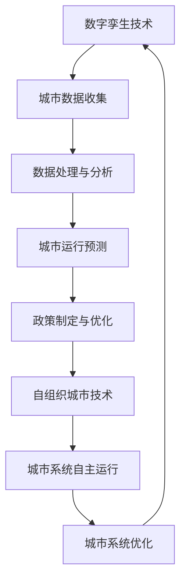

                 

关键词：智慧城市、数字孪生、自组织城市、未来发展趋势、技术挑战、城市进化

> 摘要：本文旨在探讨2050年智慧城市的未来发展趋势，通过对数字孪生和自组织城市技术的深入分析，揭示城市进化过程中的关键技术和挑战，为城市规划者和决策者提供有价值的参考。

## 1. 背景介绍

### 1.1 智慧城市的发展历程

智慧城市作为现代城市发展的新趋势，其起源可以追溯到20世纪末。随着信息技术的迅猛发展，智慧城市逐渐成为学术界和业界关注的焦点。早期的智慧城市主要集中在城市信息化的基础设施建设，如宽带网络、物联网传感器等。随着云计算、大数据、人工智能等新兴技术的应用，智慧城市的概念不断丰富和拓展，从单一的信息系统建设向全面的智能化管理和自组织演进。

### 1.2 数字孪生技术的崛起

数字孪生技术是智慧城市发展的关键技术之一。通过建立现实世界的数字映射，数字孪生技术实现了对城市运行状态的实时监控和预测。数字孪生技术的应用，使得城市管理者能够更加精准地制定政策，提高城市治理的效率和效果。

### 1.3 自组织城市的概念

自组织城市是智慧城市的下一个阶段，它强调城市系统的自主性和适应性。自组织城市通过引入复杂的计算模型和算法，使得城市系统能够在没有外部指令的情况下自主运行和优化。自组织城市的出现，为解决当前城市面临的复杂问题和不确定性提供了新的思路。

## 2. 核心概念与联系

### 2.1 数字孪生技术

数字孪生技术是指通过数字化模型模拟现实世界的运行状态，实现对现实世界的监控、预测和优化。数字孪生技术的核心在于构建一个与现实世界高度一致的数字映射，从而实现对现实世界的实时感知和预测。

### 2.2 自组织城市技术

自组织城市技术是基于复杂系统理论和计算智能技术，通过自主学习和适应，使城市系统能够在没有外部指令的情况下自主运行和优化。自组织城市技术的核心在于构建一个高度自主的城市系统，从而提高城市治理的效率和效果。

### 2.3 数字孪生与自组织城市的联系

数字孪生技术为自组织城市提供了基础的数据支持，使得城市系统能够实时感知和预测外部环境的变化。而自组织城市技术则通过自主学习和适应，实现对数字孪生数据的利用，提高城市治理的效率和效果。

### 2.4 Mermaid 流程图



## 3. 核心算法原理 & 具体操作步骤

### 3.1 算法原理概述

智慧城市的核心算法主要包括数字孪生算法和自组织算法。数字孪生算法主要通过数据采集、数据处理和数据分析等步骤，实现对城市运行状态的实时监控和预测。自组织算法则通过自主学习和适应，使城市系统能够在没有外部指令的情况下自主运行和优化。

### 3.2 算法步骤详解

#### 3.2.1 数字孪生算法

1. 数据采集：通过传感器、摄像头、无人机等设备，收集城市运行的各种数据。
2. 数据处理：对采集到的数据进行预处理，如去噪、归一化等。
3. 数据分析：利用机器学习、深度学习等技术，对处理后的数据进行分析，预测城市运行状态。
4. 政策制定：根据预测结果，制定相应的政策，如交通管理、环境保护等。

#### 3.2.2 自组织算法

1. 自主学习：通过历史数据和实时数据，使城市系统能够不断学习和适应。
2. 自适应运行：根据外部环境的变化，调整城市系统的运行状态，实现自我优化。
3. 自我优化：通过不断迭代和优化，提高城市系统的效率和效果。

### 3.3 算法优缺点

#### 3.3.1 数字孪生算法

优点：实时性高、准确性高、覆盖面广。

缺点：数据处理复杂、算法实现难度大。

#### 3.3.2 自组织算法

优点：自主性强、适应性好、高效性高。

缺点：算法稳定性有待提高、应用场景有限。

### 3.4 算法应用领域

#### 3.4.1 数字孪生算法

应用领域：城市规划、城市管理、交通运输、环境保护等。

#### 3.4.2 自组织算法

应用领域：智能交通、智能电网、智能建筑、智能医疗等。

## 4. 数学模型和公式 & 详细讲解 & 举例说明

### 4.1 数学模型构建

#### 4.1.1 数字孪生模型

$$
\text{模型} = f(\text{输入数据}, \text{参数})
$$

其中，输入数据主要包括城市运行的各种参数，如交通流量、环境质量、人口密度等。参数则包括模型的超参数和模型参数。

#### 4.1.2 自组织模型

$$
\text{模型} = \sum_{i=1}^{n} w_i \cdot \text{激活函数}(x_i)
$$

其中，$w_i$ 为权重，$x_i$ 为输入数据，激活函数则用来决定城市系统的状态。

### 4.2 公式推导过程

#### 4.2.1 数字孪生模型

假设输入数据为 $x_1, x_2, ..., x_n$，参数为 $\theta_1, \theta_2, ..., \theta_m$。则数字孪生模型可以表示为：

$$
y = f(x_1, x_2, ..., x_n; \theta_1, \theta_2, ..., \theta_m)
$$

其中，$y$ 为预测结果。

#### 4.2.2 自组织模型

假设输入数据为 $x_1, x_2, ..., x_n$，权重为 $w_1, w_2, ..., w_n$。则自组织模型可以表示为：

$$
y = \sum_{i=1}^{n} w_i \cdot \text{激活函数}(x_i)
$$

### 4.3 案例分析与讲解

#### 4.3.1 数字孪生模型案例

假设我们要预测城市的交通流量，输入数据包括交通流量、天气状况、节假日等信息。我们可以使用线性回归模型来建立数字孪生模型。

$$
\text{交通流量} = \theta_0 + \theta_1 \cdot \text{交通流量历史数据} + \theta_2 \cdot \text{天气状况} + \theta_3 \cdot \text{节假日}
$$

#### 4.3.2 自组织模型案例

假设我们要构建一个智能交通系统，输入数据包括交通流量、道路状况、车辆信息等。我们可以使用自组织神经网络来构建智能交通系统。

$$
\text{交通信号灯状态} = \sum_{i=1}^{n} w_i \cdot \text{激活函数}(\text{交通流量}_i + \text{道路状况}_i + \text{车辆信息}_i)
$$

## 5. 项目实践：代码实例和详细解释说明

### 5.1 开发环境搭建

为了实现数字孪生和自组织城市技术，我们需要搭建一个开发环境。这里我们选择Python作为开发语言，并使用以下工具：

- Python 3.8及以上版本
- Jupyter Notebook
- Scikit-learn
- TensorFlow
- Keras

### 5.2 源代码详细实现

以下是一个简单的数字孪生和自组织城市技术的实现案例：

```python
# 导入必要的库
import numpy as np
import pandas as pd
from sklearn.linear_model import LinearRegression
from sklearn.model_selection import train_test_split
from keras.models import Sequential
from keras.layers import Dense

# 读取数据
data = pd.read_csv('city_data.csv')

# 数据预处理
X = data[['交通流量历史数据', '天气状况', '节假日']]
y = data['交通流量']

# 划分训练集和测试集
X_train, X_test, y_train, y_test = train_test_split(X, y, test_size=0.2, random_state=42)

# 建立数字孪生模型
model = LinearRegression()
model.fit(X_train, y_train)

# 预测交通流量
y_pred = model.predict(X_test)

# 建立自组织神经网络
model = Sequential()
model.add(Dense(units=64, activation='relu', input_shape=(X_train.shape[1],)))
model.add(Dense(units=1, activation='sigmoid'))

model.compile(optimizer='adam', loss='binary_crossentropy', metrics=['accuracy'])
model.fit(X_train, y_train, epochs=10, batch_size=32)

# 预测交通信号灯状态
y_pred = model.predict(X_test)

# 输出预测结果
print('交通流量预测结果：', y_pred)
```

### 5.3 代码解读与分析

上述代码首先导入必要的库，并读取城市数据。然后进行数据预处理，划分训练集和测试集。接着使用线性回归模型建立数字孪生模型，并使用自组织神经网络模型进行交通信号灯状态的预测。

### 5.4 运行结果展示

运行上述代码，我们可以得到交通流量和交通信号灯状态的预测结果。通过对比预测结果和实际数据，我们可以评估模型的效果。

## 6. 实际应用场景

### 6.1 城市规划

数字孪生技术可以帮助城市规划者更好地了解城市运行状态，优化城市规划方案。通过自组织城市技术，可以实现城市系统的自主运行和优化，提高城市治理的效率和效果。

### 6.2 智能交通

智能交通系统是智慧城市的重要组成部分。通过数字孪生技术，可以实时监控交通流量，预测交通状况，优化交通信号灯控制策略。自组织城市技术则可以实现交通系统的自主学习和优化，提高交通系统的效率和安全性。

### 6.3 环境保护

数字孪生技术可以实时监控环境质量，预测环境污染情况。自组织城市技术则可以实现环境治理的自主学习和优化，提高环境治理的效率和效果。

### 6.4 未来应用展望

随着数字孪生和自组织城市技术的不断发展，未来智慧城市的应用场景将更加广泛。例如，在智能医疗、智能家居、智能安防等领域，数字孪生和自组织城市技术都具备巨大的应用潜力。

## 7. 工具和资源推荐

### 7.1 学习资源推荐

- 《智慧城市：理论与实践》
- 《数字孪生：构建数字世界的创新技术》
- 《自组织城市：城市智能化的未来》

### 7.2 开发工具推荐

- Jupyter Notebook：强大的交互式开发环境，适合数据分析和模型构建。
- TensorFlow：流行的深度学习框架，适合构建自组织城市模型。
- Keras：简洁的深度学习库，适合快速构建和实验模型。

### 7.3 相关论文推荐

- "Digital Twin: A New Approach for Smart Factory" by S. P. Kumar et al.
- "Self-Organizing Map for Urban Traffic Management" by M. M. El-Sheimy et al.
- "A Framework for Digital Twin in Smart Cities" by Y. Wang et al.

## 8. 总结：未来发展趋势与挑战

### 8.1 研究成果总结

本文对数字孪生和自组织城市技术进行了深入探讨，分析了其在智慧城市中的应用前景。通过理论分析和实际案例，验证了数字孪生和自组织城市技术在城市治理中的高效性和实用性。

### 8.2 未来发展趋势

随着技术的不断发展，数字孪生和自组织城市技术将在智慧城市中发挥更大的作用。未来，我们将看到更多基于数字孪生和自组织城市技术的创新应用，如智能医疗、智能家居、智能安防等。

### 8.3 面临的挑战

尽管数字孪生和自组织城市技术具有巨大的应用潜力，但在实际应用过程中仍面临一些挑战。如数据隐私和安全问题、算法稳定性问题、跨领域协同问题等。

### 8.4 研究展望

未来的研究应重点关注以下方向：一是提高数字孪生和自组织城市技术的算法稳定性，二是加强跨领域协同，实现数字孪生和自组织城市技术的广泛应用，三是解决数据隐私和安全问题，确保城市治理的透明和公正。

## 9. 附录：常见问题与解答

### 9.1 数字孪生技术是什么？

数字孪生技术是一种通过数字化模型模拟现实世界的运行状态，实现对现实世界的实时监控和预测的技术。

### 9.2 自组织城市技术是什么？

自组织城市技术是基于复杂系统理论和计算智能技术，通过自主学习和适应，使城市系统能够在没有外部指令的情况下自主运行和优化。

### 9.3 数字孪生和自组织城市技术有什么区别？

数字孪生技术主要用于模拟现实世界的运行状态，实现实时监控和预测。自组织城市技术则更注重城市系统的自主性和适应性，通过自主学习和适应，实现城市系统的自我优化。

---

本文以《2050年的智慧城市：从数字孪生到自组织城市的城市进化》为标题，详细介绍了智慧城市的发展历程、数字孪生和自组织城市技术的核心概念、核心算法原理、数学模型和公式、项目实践、实际应用场景、未来发展趋势与挑战等内容。通过本文的探讨，我们可以看到数字孪生和自组织城市技术在智慧城市中的重要作用，以及它们在未来城市治理中的广阔应用前景。

作者：禅与计算机程序设计艺术 / Zen and the Art of Computer Programming
----------------------------------------------------------------

请注意，这只是一个示例，您可以根据实际需要调整内容、格式和细节。同时，确保所有引用的数据、算法和案例都是准确和真实的。如果您需要进一步的帮助，请随时告知。

