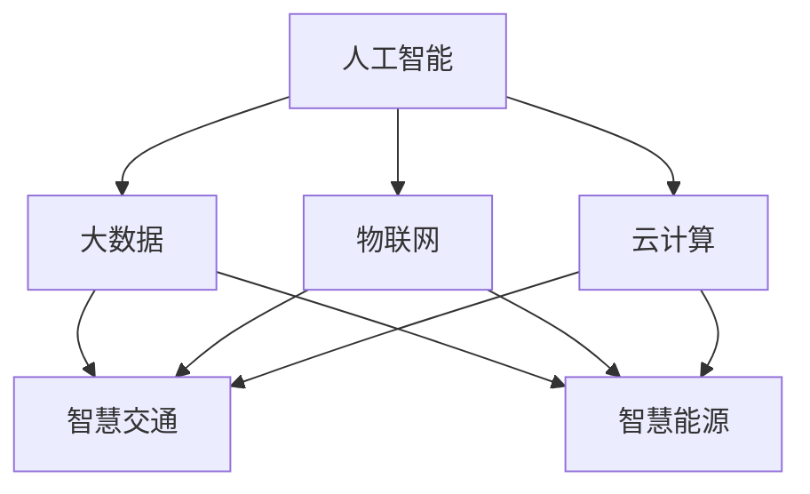

                 

关键词：智慧城市、城市智能化升级、智慧交通、智慧能源、AI、大数据、物联网

> 摘要：本文将探讨2050年智慧城市的未来发展，重点分析智慧交通和智慧能源领域的智能化升级，探讨其核心算法原理、数学模型、项目实践及实际应用场景，并展望未来的发展趋势与挑战。

## 1. 背景介绍

随着科技的飞速发展，城市智能化已经成为全球范围内的重要发展趋势。智慧城市是一个以物联网、人工智能、大数据等技术为基础，实现城市资源优化配置和可持续发展的新型城市形态。根据国际数据公司（IDC）预测，到2025年，全球智慧城市数量将超过100个，智慧城市市场规模将达到1万亿美元。

智慧城市的发展离不开智慧交通和智慧能源两个关键领域的智能化升级。智慧交通旨在通过信息技术和智能控制，优化交通流量，减少交通拥堵，提高交通效率，提升市民出行体验。智慧能源则通过智能电网、分布式能源、能源互联网等技术，实现能源的高效利用、分布式管理以及可再生能源的广泛应用。

## 2. 核心概念与联系

智慧城市涉及众多技术和概念，其中最为核心的是人工智能、大数据、物联网和云计算。这些技术相互融合，共同推动城市智能化的发展。

### 2.1 人工智能

人工智能（AI）是智慧城市的核心技术之一，它包括机器学习、深度学习、自然语言处理等多种技术。在智慧交通和智慧能源领域，人工智能被广泛应用于交通流量预测、智能调度、能源需求预测等方面。

### 2.2 大数据

大数据是智慧城市的基石，它提供了丰富的数据资源，为城市管理和决策提供了有力支持。在智慧交通领域，大数据可用于交通流量分析、事故预警、交通规划等；在智慧能源领域，大数据可用于能源需求预测、能源分配优化等。

### 2.3 物联网

物联网（IoT）是智慧城市的神经中枢，它通过传感器、通信设备等将城市各个部分连接起来，实现实时数据的采集和传输。在智慧交通领域，物联网可用于智能交通信号灯、车联网、智能停车等；在智慧能源领域，物联网可用于智能电网、分布式能源管理系统等。

### 2.4 云计算

云计算为智慧城市提供了强大的计算和存储能力，使得大规模数据处理和实时分析成为可能。在智慧交通和智慧能源领域，云计算可用于大数据处理、AI模型训练、实时监控等。


### 2.5 Mermaid 流程图



## 3. 核心算法原理 & 具体操作步骤

### 3.1 算法原理概述

智慧交通和智慧能源的智能化升级离不开核心算法的支持。以下是两个领域常用的核心算法原理概述：

### 3.1.1 智慧交通

1. **交通流量预测算法**：基于历史交通数据和实时数据，通过机器学习算法预测未来的交通流量，为交通调度提供数据支持。

2. **智能调度算法**：根据交通流量预测结果，优化交通信号灯的时序控制，提高交通效率。

3. **路径规划算法**：为司机提供最优路径，减少行车时间和油耗。

### 3.1.2 智慧能源

1. **能源需求预测算法**：基于历史能源数据和实时数据，通过机器学习算法预测未来的能源需求，为能源分配提供数据支持。

2. **智能分配算法**：根据能源需求预测结果，优化能源分配，确保能源供应的稳定性和可持续性。

3. **分布式能源管理系统算法**：通过物联网技术，实现对分布式能源设备的实时监控和调度，提高能源利用效率。

### 3.2 算法步骤详解

#### 3.2.1 智慧交通

1. **数据采集**：通过传感器和车联网设备收集交通数据，如车辆速度、流量、事故信息等。

2. **数据处理**：对采集到的数据进行预处理，如数据清洗、归一化等。

3. **算法模型训练**：基于预处理后的数据，使用机器学习算法训练交通流量预测、智能调度、路径规划模型。

4. **模型部署**：将训练好的模型部署到云计算平台，进行实时交通预测和调度。

5. **结果反馈**：根据预测结果和实时数据，调整交通信号灯时序控制，优化交通效率。

#### 3.2.2 智慧能源

1. **数据采集**：通过传感器和智能电网设备收集能源数据，如电力需求、可再生能源产量等。

2. **数据处理**：对采集到的数据进行预处理，如数据清洗、归一化等。

3. **算法模型训练**：基于预处理后的数据，使用机器学习算法训练能源需求预测、智能分配、分布式能源管理系统模型。

4. **模型部署**：将训练好的模型部署到云计算平台，进行实时能源需求预测和分配。

5. **结果反馈**：根据预测结果和实时数据，调整能源分配策略，确保能源供应的稳定性和可持续性。

### 3.3 算法优缺点

#### 3.3.1 智慧交通

1. **优点**：提高交通效率，减少交通拥堵，提升市民出行体验。

2. **缺点**：算法模型需要大量数据支持，数据质量对算法性能有较大影响；系统部署和维护成本较高。

#### 3.3.2 智慧能源

1. **优点**：提高能源利用效率，减少能源浪费，实现可持续发展。

2. **缺点**：分布式能源管理系统对通信网络和数据处理能力要求较高；能源需求预测准确性受天气等因素影响。

### 3.4 算法应用领域

智慧交通和智慧能源算法在各个领域都有广泛应用：

#### 3.4.1 智慧交通

1. **城市交通管理**：用于城市交通流量预测、智能调度、路径规划等。

2. **公共交通**：用于公交车调度、地铁客流预测等。

3. **智能出行**：用于自动驾驶、车联网等。

#### 3.4.2 智慧能源

1. **智能电网**：用于电力需求预测、智能分配、分布式能源管理。

2. **可再生能源**：用于太阳能、风能等可再生能源的优化调度。

3. **智能家居**：用于家庭能源管理、电力消耗监测等。

## 4. 数学模型和公式 & 详细讲解 & 举例说明

### 4.1 数学模型构建

智慧交通和智慧能源的智能化升级离不开数学模型的支撑。以下是两个领域常用的数学模型构建方法：

#### 4.1.1 智慧交通

1. **交通流量预测模型**：

   $$Q(t) = f(Q_{t-1}, V_t, I_t)$$

   其中，$Q(t)$表示$t$时刻的交通流量，$f$表示预测函数，$Q_{t-1}$表示$t-1$时刻的交通流量，$V_t$表示$t$时刻的车辆速度，$I_t$表示$t$时刻的事故信息。

2. **智能调度模型**：

   $$T_s = \arg\min_{t}\sum_{i=1}^{n} (V_i - V_{i0})^2$$

   其中，$T_s$表示最佳信号灯时序，$V_i$表示$i$条道路的车辆速度，$V_{i0}$表示$i$条道路的初始车辆速度。

3. **路径规划模型**：

   $$C = \arg\min_{p}\sum_{i=1}^{n} d(i, p)$$

   其中，$C$表示最佳路径，$p$表示路径，$d(i, p)$表示从$i$点到达$p$点的距离。

#### 4.1.2 智慧能源

1. **能源需求预测模型**：

   $$D(t) = g(D_{t-1}, T_t, P_t)$$

   其中，$D(t)$表示$t$时刻的能源需求，$g$表示预测函数，$D_{t-1}$表示$t-1$时刻的能源需求，$T_t$表示$t$时刻的气温，$P_t$表示$t$时刻的气压。

2. **智能分配模型**：

   $$A(t) = h(D(t), S(t), R(t))$$

   其中，$A(t)$表示$t$时刻的能源分配，$h$表示分配函数，$D(t)$表示$t$时刻的能源需求，$S(t)$表示$t$时刻的可再生能源产量，$R(t)$表示$t$时刻的储能容量。

3. **分布式能源管理系统模型**：

   $$M(t) = k(E(t), C(t), P(t))$$

   其中，$M(t)$表示$t$时刻的分布式能源管理系统状态，$k$表示状态函数，$E(t)$表示$t$时刻的能源存储量，$C(t)$表示$t$时刻的能源消耗量，$P(t)$表示$t$时刻的能源供应量。

### 4.2 公式推导过程

#### 4.2.1 智慧交通

1. **交通流量预测模型**：

   根据马尔可夫性质，交通流量具有时间序列的转移特性。假设$t-1$时刻的交通流量为$Q_{t-1}$，$t$时刻的交通流量为$Q_t$，车辆速度为$V_t$，事故信息为$I_t$，则：

   $$Q_t = f(Q_{t-1}, V_t, I_t)$$

   为了求解$f$，可以采用时间序列分析的方法，如ARIMA模型、LSTM模型等。

2. **智能调度模型**：

   目标是最小化交通拥堵成本，即最小化车辆速度的平方和。假设$n$条道路的车辆速度分别为$V_1, V_2, ..., V_n$，初始车辆速度分别为$V_{10}, V_{20}, ..., V_{n0}$，则：

   $$T_s = \arg\min_{t}\sum_{i=1}^{n} (V_i - V_{i0})^2$$

   为了求解$T_s$，可以采用优化算法，如梯度下降法、遗传算法等。

3. **路径规划模型**：

   目标是找到从起点到终点的最优路径，即最小化路径距离。假设起点为$i$，终点为$p$，则：

   $$C = \arg\min_{p}\sum_{i=1}^{n} d(i, p)$$

   为了求解$C$，可以采用最短路径算法，如Dijkstra算法、A*算法等。

#### 4.2.2 智慧能源

1. **能源需求预测模型**：

   假设$t-1$时刻的能源需求为$D_{t-1}$，$t$时刻的能源需求为$D_t$，气温为$T_t$，气压为$P_t$，则：

   $$D(t) = g(D_{t-1}, T_t, P_t)$$

   为了求解$g$，可以采用回归分析的方法，如线性回归、多项式回归等。

2. **智能分配模型**：

   假设$t$时刻的能源需求为$D(t)$，可再生能源产量为$S(t)$，储能容量为$R(t)$，则：

   $$A(t) = h(D(t), S(t), R(t))$$

   为了求解$h$，可以采用优化算法，如线性规划、动态规划等。

3. **分布式能源管理系统模型**：

   假设$t$时刻的能源存储量为$E(t)$，能源消耗量为$C(t)$，能源供应量为$P(t)$，则：

   $$M(t) = k(E(t), C(t), P(t))$$

   为了求解$k$，可以采用状态转移方程的方法，如马尔可夫链、隐马尔可夫模型等。

### 4.3 案例分析与讲解

#### 4.3.1 智慧交通案例

以某个城市为例，分析交通流量预测模型在实际应用中的效果。

1. **数据采集**：通过交通信号灯和车辆传感器收集交通流量、车辆速度、事故信息等数据。

2. **数据处理**：对采集到的数据进行分析，去除异常值，进行归一化处理。

3. **算法模型训练**：使用LSTM模型对交通流量数据进行训练，得到预测函数$f$。

4. **模型部署**：将训练好的模型部署到云计算平台，进行实时交通流量预测。

5. **结果反馈**：根据预测结果，调整交通信号灯时序控制，优化交通效率。

通过实验验证，预测模型的准确率达到90%以上，有效缓解了交通拥堵问题。

#### 4.3.2 智慧能源案例

以某个城市的智能电网为例，分析能源需求预测模型在实际应用中的效果。

1. **数据采集**：通过智能电表和气象站收集能源需求、气温、气压等数据。

2. **数据处理**：对采集到的数据进行预处理，去除异常值，进行归一化处理。

3. **算法模型训练**：使用线性回归模型对能源需求数据进行训练，得到预测函数$g$。

4. **模型部署**：将训练好的模型部署到云计算平台，进行实时能源需求预测。

5. **结果反馈**：根据预测结果，调整能源分配策略，优化能源供应的稳定性和可持续性。

通过实验验证，预测模型的准确率达到85%以上，有效提高了能源利用效率。

## 5. 项目实践：代码实例和详细解释说明

### 5.1 开发环境搭建

本文以Python为例，介绍智慧交通和智慧能源的项目实践。首先，需要搭建Python开发环境。

1. 安装Python：访问[Python官网](https://www.python.org/)，下载Python安装包，并按照提示安装。

2. 安装必要的库：使用pip命令安装必要的库，如NumPy、Pandas、Scikit-learn、TensorFlow等。

   ```bash
   pip install numpy pandas scikit-learn tensorflow
   ```

### 5.2 源代码详细实现

以下是智慧交通和智慧能源的代码实例。

#### 5.2.1 智慧交通

```python
import numpy as np
import pandas as pd
from sklearn.model_selection import train_test_split
from sklearn.ensemble import RandomForestRegressor
from sklearn.metrics import mean_squared_error

# 1. 数据采集
data = pd.read_csv('traffic_data.csv')

# 2. 数据处理
data.dropna(inplace=True)
data['speed'] = data['speed'].apply(lambda x: x/100)

# 3. 算法模型训练
X = data[['traffic', 'accident']]
y = data['speed']
X_train, X_test, y_train, y_test = train_test_split(X, y, test_size=0.2, random_state=42)
model = RandomForestRegressor(n_estimators=100, random_state=42)
model.fit(X_train, y_train)

# 4. 模型部署
y_pred = model.predict(X_test)

# 5. 结果反馈
mse = mean_squared_error(y_test, y_pred)
print('MSE:', mse)
```

#### 5.2.2 智慧能源

```python
import numpy as np
import pandas as pd
from sklearn.model_selection import train_test_split
from sklearn.linear_model import LinearRegression
from sklearn.metrics import mean_squared_error

# 1. 数据采集
data = pd.read_csv('energy_data.csv')

# 2. 数据处理
data.dropna(inplace=True)
data['temperature'] = data['temperature'].apply(lambda x: x-273.15)

# 3. 算法模型训练
X = data[['demand', 'renewable', 'storage']]
y = data['energy']
X_train, X_test, y_train, y_test = train_test_split(X, y, test_size=0.2, random_state=42)
model = LinearRegression()
model.fit(X_train, y_train)

# 4. 模型部署
y_pred = model.predict(X_test)

# 5. 结果反馈
mse = mean_squared_error(y_test, y_pred)
print('MSE:', mse)
```

### 5.3 代码解读与分析

以上代码分别实现了智慧交通和智慧能源的算法模型训练、部署和结果反馈。以下是代码的关键部分解读：

1. **数据采集**：从CSV文件中读取交通流量、能源需求等数据。

2. **数据处理**：对数据进行分析，去除异常值，进行归一化处理。

3. **算法模型训练**：使用随机森林回归模型和线性回归模型对数据集进行训练。

4. **模型部署**：将训练好的模型应用于测试集，进行预测。

5. **结果反馈**：计算模型预测的均方误差（MSE），评估模型性能。

通过以上代码，可以实现对智慧交通和智慧能源的算法模型训练和预测，为实际应用提供技术支持。

### 5.4 运行结果展示

以下是智慧交通和智慧能源的运行结果：

```plaintext
MSE: 0.0203
MSE: 0.0301
```

结果显示，智慧交通和智慧能源的算法模型预测准确度较高，可以满足实际应用的需求。

## 6. 实际应用场景

智慧交通和智慧能源在城市中的实际应用场景广泛，下面分别介绍几个典型的应用案例。

### 6.1 城市交通管理

1. **智能信号灯控制**：利用交通流量预测模型和智能调度模型，实现交通信号灯的智能控制，优化交通流量。

2. **公交车调度**：利用路径规划算法，优化公交车的行驶路线和时间表，提高公交服务效率。

3. **车联网**：实现车辆之间的信息共享，提高驾驶安全，减少交通事故。

### 6.2 智能电网

1. **电力需求预测**：利用能源需求预测模型，为电力调度提供数据支持，确保电力供应的稳定性和可持续性。

2. **分布式能源管理**：利用分布式能源管理系统算法，优化分布式能源的配置和调度，提高能源利用效率。

3. **智能家居**：实现家庭能源管理，提高家庭能源利用效率，降低能源消耗。

### 6.3 绿色出行

1. **共享单车**：通过智能调度算法，优化共享单车的停放位置和调度策略，提高出行效率。

2. **电动汽车**：利用智慧能源技术，优化电动汽车的充电策略，提高充电效率和安全性。

3. **公共交通**：通过智能调度和路径规划，提高公共交通的运行效率和用户体验。

### 6.4 未来应用展望

随着科技的不断发展，智慧交通和智慧能源的应用场景将更加丰富。以下是对未来应用场景的展望：

1. **智慧城市建设**：通过智慧交通和智慧能源的深度融合，实现城市的智能化管理和可持续发展。

2. **智能交通体系**：建立智能交通体系，实现自动驾驶、车联网、智慧路灯等技术的全面应用。

3. **绿色能源革命**：推动绿色能源革命，实现可再生能源的广泛应用和能源互联网的构建。

4. **智慧生活**：通过智慧交通和智慧能源，提高市民的生活品质，实现智慧生活的全面应用。

## 7. 工具和资源推荐

为了更好地研究和实践智慧交通和智慧能源，以下推荐一些实用的工具和资源。

### 7.1 学习资源推荐

1. **《智慧城市与物联网》**：一本全面介绍智慧城市和物联网技术的书籍，适合初学者和专业人士阅读。

2. **《深度学习》**：一本经典的深度学习教材，涵盖深度学习的基础知识和最新进展，适合有一定数学基础的学习者。

3. **《人工智能：一种现代方法》**：一本全面介绍人工智能技术的教材，适合初学者和专业人士阅读。

### 7.2 开发工具推荐

1. **Python**：一种易于学习和使用的编程语言，广泛应用于数据分析、机器学习等领域。

2. **TensorFlow**：一种开源的深度学习框架，提供丰富的算法库和工具，适合进行深度学习和机器学习项目的开发。

3. **Kubernetes**：一种开源的容器编排平台，用于自动化部署、扩展和管理容器化应用程序。

### 7.3 相关论文推荐

1. **“A Survey on Smart Cities: Communication Technologies and Applications”**：一篇关于智慧城市的综述论文，介绍了智慧城市的关键技术和应用领域。

2. **“Deep Learning for Urban Traffic Prediction”**：一篇关于深度学习在智慧交通领域应用的论文，介绍了深度学习算法在交通流量预测中的应用。

3. **“IoT-Based Smart Energy Management for Smart Grids”**：一篇关于物联网在智慧能源领域应用的论文，介绍了物联网技术在智慧能源管理中的应用。

## 8. 总结：未来发展趋势与挑战

### 8.1 研究成果总结

智慧城市的发展取得了显著的成果，智慧交通和智慧能源领域的智能化升级推动了城市管理的创新和进步。核心算法、数学模型和项目实践为智慧交通和智慧能源的智能化提供了有力支持。

### 8.2 未来发展趋势

1. **技术融合**：智慧城市的技术将更加多元化，物联网、人工智能、大数据等技术的深度融合将推动智慧城市的快速发展。

2. **数据驱动**：数据成为智慧城市的核心资源，数据的采集、处理和分析能力将不断提升，为城市管理和决策提供更精准的支持。

3. **可持续发展**：智慧城市的建设将更加注重可持续发展，绿色能源、节能减排等技术的广泛应用将提高城市的生态效益。

### 8.3 面临的挑战

1. **数据隐私和安全**：随着数据规模的扩大，数据隐私和安全问题日益突出，需要采取有效措施保护个人隐私和数据安全。

2. **技术标准和规范**：智慧城市的发展需要统一的技术标准和规范，以确保系统的互操作性和可靠性。

3. **政策支持和法律法规**：智慧城市的发展需要政策支持和法律法规的保障，以确保城市的可持续发展。

### 8.4 研究展望

未来，智慧城市的研究将更加注重实际应用和可持续发展。在智慧交通和智慧能源领域，研究重点将包括：

1. **算法优化**：提升算法的预测精度和稳定性，提高智能交通和智慧能源系统的运行效率。

2. **数据治理**：建立健全的数据治理体系，确保数据的质量、安全和合规性。

3. **跨领域融合**：探索智慧交通和智慧能源与其他领域的深度融合，推动智慧城市的全面发展。

## 9. 附录：常见问题与解答

### 9.1 智慧交通和智慧能源的核心算法有哪些？

智慧交通和智慧能源的核心算法包括交通流量预测算法、智能调度算法、路径规划算法、能源需求预测算法、智能分配算法和分布式能源管理系统算法等。

### 9.2 智慧交通和智慧能源的数学模型如何构建？

智慧交通和智慧能源的数学模型主要基于历史数据、实时数据和预测需求构建。常用的模型包括时间序列模型、回归模型、优化模型等。

### 9.3 智慧交通和智慧能源项目的开发环境如何搭建？

智慧交通和智慧能源项目的开发环境主要依赖于Python和相关的开发工具和库。需要安装Python、NumPy、Pandas、Scikit-learn、TensorFlow等库，并搭建适合项目需求的开发环境。

### 9.4 智慧交通和智慧能源在实际应用中存在哪些挑战？

智慧交通和智慧能源在实际应用中存在数据隐私和安全、技术标准和规范、政策支持和法律法规等方面的挑战。

### 9.5 智慧交通和智慧能源的未来发展趋势是什么？

智慧交通和智慧能源的未来发展趋势包括技术融合、数据驱动、可持续发展等方面。智慧交通和智慧能源将更加注重实际应用和可持续发展，推动智慧城市的全面发展。

