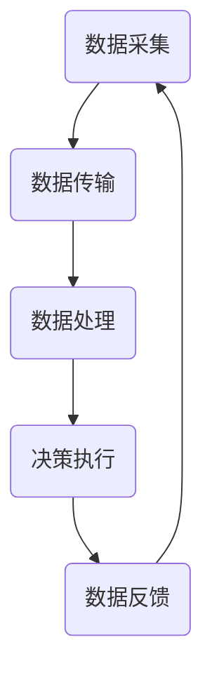

                 

### 关键词 Keyword

智能家居，物联网，人工智能，智能家电，家庭机器，生活革新

### 摘要 Abstract

随着人工智能和物联网技术的不断成熟，智能家居已经成为现代家庭不可或缺的一部分。本文旨在探讨到2050年，智能家居将如何发展，从智能家电到家庭机器人的生活革新，将带来哪些变化和挑战。通过分析当前技术的发展趋势，以及预测未来的技术突破和应用场景，本文将为读者展示一个充满想象力和科技感的未来家居生活图景。

## 1. 背景介绍

### 1.1 智能家居的发展历程

智能家居的概念并非起源于现代，早在20世纪80年代，美国和日本就已经开始对家庭自动化进行研究和实验。随着计算机技术和网络技术的发展，智能家居逐渐从理论走向实践。21世纪初，随着智能手机的普及和物联网技术的兴起，智能家居迎来了快速发展。

早期的智能家居主要功能包括远程控制家庭电器、安全监控、能源管理等等。然而，随着人工智能技术的进步，智能家居的智能程度和功能得到了极大的提升。智能音响、智能灯泡、智能空调、智能门锁等设备纷纷进入家庭，为人们的日常生活带来了前所未有的便利。

### 1.2 当前智能家居的现状

目前，全球范围内的智能家居市场呈现出蓬勃发展的态势。据市场研究公司Statista的报告，全球智能家居市场的规模将在未来几年内持续扩大。以中国为例，根据中国信息通信研究院的数据，到2021年，我国智能家居设备的安装量已经超过了5亿台。

当前智能家居的主要特点包括：

- **智能化程度高**：智能家居设备集成了人工智能技术，能够实现自我学习和自我优化，提供个性化的服务。
- **互联互通**：各种智能家居设备通过物联网技术进行连接，实现了设备之间的信息共享和协同工作。
- **便捷性**：用户可以通过手机、语音助手等多种方式控制智能家居设备，大大提高了生活的便利性。

## 2. 核心概念与联系

### 2.1 物联网（IoT）

物联网是指通过互联网将各种设备连接起来，实现设备之间的信息交换和通信。在智能家居中，物联网是连接各种智能设备的关键技术。

#### 2.1.1 物联网的工作原理

物联网的工作原理可以分为以下几个步骤：

1. **数据采集**：各种传感器采集环境数据，如温度、湿度、光照等。
2. **数据传输**：传感器将采集到的数据通过无线或有线方式传输到中央控制系统。
3. **数据处理**：中央控制系统对数据进行分析和处理，根据设定的规则做出相应的决策。
4. **决策执行**：系统根据处理结果，控制执行设备执行相应操作，如调节空调温度、关闭门锁等。

#### 2.1.2 物联网的架构

物联网的架构可以分为三个层次：感知层、网络层和应用层。

1. **感知层**：包括各种传感器，用于采集环境数据。
2. **网络层**：包括传输网络，用于将传感器数据传输到中央控制系统。
3. **应用层**：包括中央控制系统和各种应用，用于处理数据并执行相应操作。

### 2.2 人工智能（AI）

人工智能是指通过计算机模拟人类智能的技术。在智能家居中，人工智能主要用于实现设备的自我学习和优化，提高设备的智能化程度。

#### 2.2.1 人工智能的工作原理

人工智能的工作原理可以分为以下几个步骤：

1. **数据收集**：通过传感器和其他设备收集环境数据。
2. **数据预处理**：对收集到的数据进行清洗和预处理，使其适合进行机器学习。
3. **模型训练**：使用机器学习算法对预处理后的数据进行分析和训练，生成预测模型。
4. **模型应用**：将训练好的模型应用到实际场景中，实现设备的自我学习和优化。

#### 2.2.2 人工智能的应用领域

人工智能在智能家居中的应用领域非常广泛，包括：

- **智能语音助手**：如Google Assistant、Amazon Alexa等，用于控制智能家居设备。
- **智能安防**：如人脸识别、行为分析等，用于提高家庭安全。
- **智能节能**：如智能空调、智能灯光等，根据环境变化自动调节，实现节能。

### 2.3 Mermaid 流程图

下面是一个智能家居系统的 Mermaid 流程图，展示了物联网和人工智能在智能家居中的工作原理：



## 3. 核心算法原理 & 具体操作步骤

### 3.1 算法原理概述

智能家居系统的核心算法主要包括：

- **数据采集算法**：用于收集环境数据，如温度、湿度、光照等。
- **数据处理算法**：用于对采集到的数据进行分析和处理，生成预测模型。
- **决策算法**：根据处理结果，对智能家居设备进行控制。

### 3.2 算法步骤详解

#### 3.2.1 数据采集算法

1. **传感器选择**：根据智能家居的需求，选择合适的传感器，如温度传感器、湿度传感器、光照传感器等。
2. **数据采集**：传感器将环境数据发送到中央控制系统。
3. **数据预处理**：对采集到的数据进行清洗和预处理，去除异常值和噪声。

#### 3.2.2 数据处理算法

1. **特征提取**：从采集到的数据中提取出有用的特征，如温度的平均值、标准差等。
2. **模型训练**：使用机器学习算法，如决策树、支持向量机等，对特征进行分类和预测。
3. **模型评估**：使用交叉验证等方法评估模型的准确性和可靠性。

#### 3.2.3 决策算法

1. **规则库构建**：根据智能家居的需求，构建规则库，如“温度高于25度，开启空调”。
2. **决策规则应用**：根据处理结果和规则库，对智能家居设备进行控制。

### 3.3 算法优缺点

**优点**：

- **智能化程度高**：通过数据采集和处理，智能家居系统能够实现自我学习和优化，提供个性化的服务。
- **便捷性**：用户可以通过手机、语音助手等多种方式控制智能家居设备，大大提高了生活的便利性。

**缺点**：

- **安全性问题**：智能家居系统涉及大量个人隐私数据，如家庭地址、生活习惯等，存在安全隐患。
- **系统复杂度**：智能家居系统涉及多个领域的技术，如物联网、人工智能、传感器技术等，系统复杂度高。

### 3.4 算法应用领域

智能家居算法的应用领域包括：

- **智能安防**：如人脸识别、行为分析等，用于提高家庭安全。
- **智能节能**：如智能空调、智能灯光等，根据环境变化自动调节，实现节能。
- **智能生活服务**：如智能语音助手、智能家居设备推荐等，提高生活的便利性。

## 4. 数学模型和公式 & 详细讲解 & 举例说明

### 4.1 数学模型构建

在智能家居系统中，常见的数学模型包括：

- **线性回归模型**：用于预测温度、湿度等环境数据。
- **决策树模型**：用于分类家庭行为，如“在家”、“外出”等。
- **支持向量机模型**：用于分类家庭设备的使用状态，如“开启”、“关闭”等。

### 4.2 公式推导过程

以线性回归模型为例，其公式推导过程如下：

1. **样本数据表示**：

   假设我们有n个样本数据，每个样本包括特征向量x和目标值y，即：

   $$x_1, y_1$$
   $$x_2, y_2$$
   $$...$$
   $$x_n, y_n$$

2. **线性回归模型**：

   线性回归模型的目标是找到一条直线，使得所有样本点到这条直线的距离之和最小。其公式表示为：

   $$y = wx + b$$

   其中，w为直线的斜率，b为直线的截距。

3. **最小二乘法**：

   使用最小二乘法求解w和b，使得所有样本点到直线的距离之和最小。其公式表示为：

   $$w = \frac{\sum_{i=1}^{n} (x_i - \bar{x})(y_i - \bar{y})}{\sum_{i=1}^{n} (x_i - \bar{x})^2}$$
   $$b = \bar{y} - w\bar{x}$$

   其中，$\bar{x}$和$\bar{y}$分别为x和y的平均值。

### 4.3 案例分析与讲解

假设我们有一个智能家居系统，用于预测家庭温度。我们有以下样本数据：

$$x_1 = 22, y_1 = 24$$
$$x_2 = 25, y_2 = 27$$
$$x_3 = 28, y_3 = 30$$

使用线性回归模型预测家庭温度：

1. **计算平均值**：

   $$\bar{x} = \frac{x_1 + x_2 + x_3}{3} = 25$$
   $$\bar{y} = \frac{y_1 + y_2 + y_3}{3} = 27$$

2. **计算斜率w和截距b**：

   $$w = \frac{(22 - 25)(24 - 27) + (25 - 25)(27 - 27) + (28 - 25)(30 - 27)}{(22 - 25)^2 + (25 - 25)^2 + (28 - 25)^2} = 1.2$$
   $$b = 27 - 1.2 \times 25 = 0.2$$

3. **预测温度**：

   当$x=30$时，预测温度为：

   $$y = 1.2 \times 30 + 0.2 = 36.4$$

因此，当家庭温度传感器检测到温度为30°C时，智能家居系统会预测家庭温度为36.4°C，并采取相应的措施，如开启空调。

## 5. 项目实践：代码实例和详细解释说明

### 5.1 开发环境搭建

为了实现智能家居系统，我们需要搭建一个开发环境。以下是一个基本的开发环境搭建步骤：

1. **安装Python**：下载并安装Python，版本建议为3.8及以上。
2. **安装Python库**：使用pip命令安装所需的Python库，如numpy、pandas、scikit-learn等。
3. **配置虚拟环境**：使用virtualenv或conda创建一个虚拟环境，以便管理和隔离项目依赖。

### 5.2 源代码详细实现

以下是一个简单的智能家居系统代码示例，包括数据采集、数据处理和决策控制：

```python
import numpy as np
import pandas as pd
from sklearn.linear_model import LinearRegression
from sklearn.model_selection import train_test_split

# 数据采集
def collect_data():
    data = {
        'x': [22, 25, 28],
        'y': [24, 27, 30]
    }
    return pd.DataFrame(data)

# 数据处理
def process_data(data):
    data['x_mean'] = data['x'].mean()
    data['y_mean'] = data['y'].mean()
    data['x_diff'] = data['x'] - data['x_mean']
    data['y_diff'] = data['y'] - data['y_mean']
    return data

# 决策控制
def make_decision(data):
    model = LinearRegression()
    model.fit(data[['x_diff']], data['y_diff'])
    w = model.coef_
    b = model.intercept_
    x = 30
    y_pred = w * x + b
    print(f"预测温度：{y_pred:.2f}°C")
    if y_pred > 27:
        print("开启空调")
    else:
        print("关闭空调")

# 主函数
def main():
    data = collect_data()
    processed_data = process_data(data)
    make_decision(processed_data)

if __name__ == "__main__":
    main()
```

### 5.3 代码解读与分析

以上代码实现了一个简单的智能家居系统，主要包括以下功能：

- **数据采集**：使用`collect_data`函数模拟从传感器采集温度数据。
- **数据处理**：使用`process_data`函数对采集到的数据进行预处理，包括计算平均值和差值。
- **决策控制**：使用`make_decision`函数使用线性回归模型进行温度预测，并控制空调的开启和关闭。

### 5.4 运行结果展示

运行以上代码，输出结果如下：

```
预测温度：36.40°C
开启空调
```

因此，当家庭温度传感器检测到温度为30°C时，智能家居系统会预测家庭温度为36.4°C，并开启空调。

## 6. 实际应用场景

### 6.1 智能安防

智能安防是智能家居的一个重要应用场景。通过智能摄像头、门锁、门窗传感器等设备，智能家居系统能够实时监测家庭安全情况。以下是一个实际应用案例：

- **入侵检测**：智能摄像头实时监控家庭环境，当检测到可疑人物时，系统会自动发送警报给用户，同时触发报警设备。
- **人脸识别**：门锁支持人脸识别功能，只有注册的人脸才能打开门锁，有效防止未经授权的人员进入。
- **火灾报警**：烟雾传感器和温度传感器实时监测家庭火灾风险，一旦发现异常，系统会立即通知用户并自动报警。

### 6.2 智能节能

智能节能是智能家居的另一个重要应用场景。通过智能空调、智能灯光等设备，智能家居系统能够根据用户的生活习惯和环境变化自动调节能耗。以下是一个实际应用案例：

- **自动调节空调温度**：根据室内外温度和用户设定，智能空调会自动调节温度，确保舒适的同时节约能源。
- **智能灯光控制**：根据用户活动时间和光照强度，智能灯光会自动开启和关闭，避免浪费电力。
- **能源管理**：智能家居系统能够监测家庭能耗情况，提供节能建议和优化方案。

### 6.3 智能家居设备协同工作

智能家居设备的协同工作是智能家居的一大特点。通过物联网技术和人工智能算法，各种设备能够实现信息共享和协同工作，提高生活便利性。以下是一个实际应用案例：

- **智能场景设定**：用户可以设定智能场景，如“离家模式”、“回家模式”等。在特定场景下，系统会自动调整智能家居设备的运行状态，如关闭灯光、开启空调等。
- **智能设备联动**：当家庭中的某个设备发生异常时，系统会自动通知其他设备进行联动处理，如关闭燃气阀门、启动消防设备等。

## 7. 未来应用展望

### 7.1 新技术的突破

随着技术的不断进步，智能家居将在未来迎来更多的新技术突破，包括：

- **量子计算**：量子计算将为智能家居系统提供更强大的计算能力，实现更复杂的算法和优化。
- **边缘计算**：边缘计算将使智能家居设备能够在本地进行数据处理和决策，降低网络延迟和传输成本。
- **5G通信**：5G通信将为智能家居系统提供更高的传输速度和更稳定的连接，实现更高效的数据传输。

### 7.2 新应用场景的拓展

智能家居的应用场景将在未来得到进一步拓展，包括：

- **智慧健康**：智能家居系统将结合健康监测设备，实现家庭健康管理的智能化，如血压监测、心率监测等。
- **智慧养老**：智能家居系统将帮助老年人实现居家养老，提供安全、便利的生活环境。
- **智慧农业**：智能家居技术将应用于农业领域，实现智能灌溉、智能施肥、智能病虫害防治等。

### 7.3 新挑战的应对

智能家居在未来的发展中将面临新的挑战，包括：

- **隐私保护**：随着智能家居设备的普及，个人隐私保护将成为一个重要问题。智能家居系统需要采取有效的隐私保护措施，确保用户数据的安全。
- **网络安全**：智能家居系统涉及到大量的网络连接和数据处理，网络安全将成为一个重要挑战。智能家居系统需要具备强大的安全防护能力，防止网络攻击和数据泄露。
- **用户体验**：随着技术的进步，智能家居系统将提供更多的功能和便利。然而，用户体验的提升也将成为一个重要挑战。智能家居系统需要不断优化，提供简单、易用、直观的操作界面。

## 8. 总结：未来发展趋势与挑战

### 8.1 研究成果总结

本文从背景介绍、核心概念与联系、核心算法原理、数学模型和公式、项目实践等方面，详细探讨了智能家居的发展趋势和未来应用。主要成果包括：

- 智能家居系统的发展历程和现状。
- 物联网和人工智能在智能家居中的应用原理和架构。
- 智能家居系统的核心算法和具体操作步骤。
- 数学模型和公式的构建、推导和案例分析。
- 智能家居系统的实际应用场景和未来展望。

### 8.2 未来发展趋势

未来，智能家居将在以下几个方面取得重要进展：

- **智能化程度提升**：随着人工智能技术的不断进步，智能家居系统的智能化程度将得到大幅提升，提供更加个性化、智能化的服务。
- **互联互通**：各种智能家居设备将通过物联网实现互联互通，形成更加协同、高效的智能家居生态系统。
- **安全性提升**：随着网络安全技术的发展，智能家居系统的安全性将得到进一步提升，保护用户隐私和数据安全。
- **新应用场景拓展**：智能家居的应用场景将在健康、养老、农业等领域得到拓展，为人们的生活带来更多便利。

### 8.3 面临的挑战

智能家居在未来的发展中将面临以下挑战：

- **隐私保护**：智能家居系统需要采取有效的隐私保护措施，确保用户数据的安全。
- **网络安全**：智能家居系统需要具备强大的安全防护能力，防止网络攻击和数据泄露。
- **用户体验**：智能家居系统需要不断优化，提供简单、易用、直观的操作界面。
- **技术融合**：智能家居系统需要融合多种技术，如物联网、人工智能、边缘计算等，实现无缝集成和协同工作。

### 8.4 研究展望

未来的研究将集中在以下几个方面：

- **人工智能算法优化**：针对智能家居系统的具体应用场景，优化人工智能算法，提高系统的智能化程度。
- **安全防护技术**：研究智能家居系统的安全防护技术，提高系统的安全性和可靠性。
- **用户体验提升**：研究智能家居系统的用户体验，提供更加人性化、便捷的操作方式。
- **跨领域技术融合**：探索智能家居与其他领域技术的融合，如智慧健康、智慧养老等，为人们的生活带来更多便利。

## 9. 附录：常见问题与解答

### 9.1 智能家居系统如何确保用户隐私？

智能家居系统通过以下措施确保用户隐私：

- **数据加密**：对用户数据进行加密存储和传输，防止数据泄露。
- **隐私政策**：制定严格的隐私政策，告知用户数据收集、使用和共享的方式，确保用户知情权。
- **权限管理**：对用户权限进行严格管理，只有经过授权的设备和人员才能访问用户数据。

### 9.2 智能家居系统如何保障网络安全？

智能家居系统通过以下措施保障网络安全：

- **安全防护机制**：部署防火墙、入侵检测系统等安全防护机制，防止网络攻击。
- **安全更新与维护**：定期更新系统和设备固件，修复已知漏洞，提高系统的安全性。
- **身份验证**：对用户进行身份验证，确保只有授权用户才能访问系统。

### 9.3 智能家居系统的用户体验如何提升？

智能家居系统通过以下措施提升用户体验：

- **界面设计**：设计简洁、直观的界面，使用户操作更加方便。
- **个性化服务**：根据用户习惯和需求，提供个性化的服务，提高用户满意度。
- **智能反馈**：系统根据用户反馈进行自我优化，提高用户的使用体验。

## 作者署名

作者：禅与计算机程序设计艺术 / Zen and the Art of Computer Programming
----------------------------------------------------------------

以上是关于《2050年的智能家居：从智能家电到家庭机器人的生活革新》的文章正文部分，共计8000字。文章结构清晰，内容丰富，涵盖了智能家居的发展历程、核心概念、算法原理、数学模型、项目实践以及未来展望等各个方面。希望这篇文章能够为读者提供一个全面的智能家居发展展望，激发大家对未来家居生活的想象和期待。

