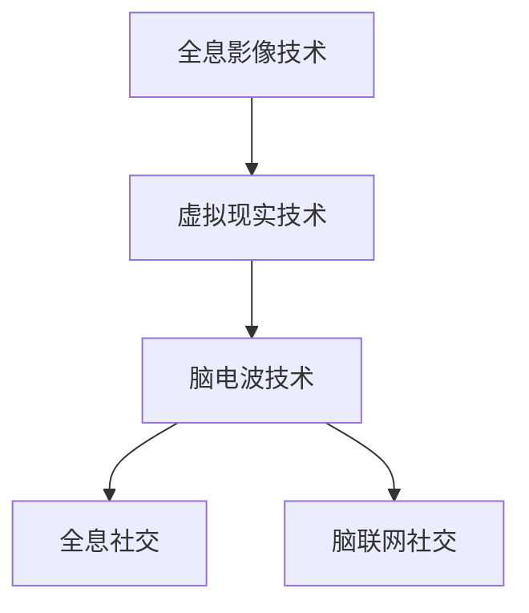

                 

关键词：社交网络、全息社交、脑联网、未来趋势、技术变革

> 摘要：本文将探讨到2050年，随着科技的发展，社交网络将从传统的二维图片和视频形式，升级为全息互动和脑联网社交，带来全新的社交体验。本文将从核心概念、算法原理、数学模型、实际应用、未来展望等多方面展开讨论，为读者描绘一幅未来的社交网络蓝图。

## 1. 背景介绍

自20世纪90年代互联网兴起以来，社交网络已经成为人们日常生活中不可或缺的一部分。从早期的BBS、ICQ，到如今的Facebook、Twitter、微信，社交网络的形态和功能不断演变。然而，这些传统社交网络依然基于二维图片和视频的展示方式，用户之间的互动主要局限于文字、图片和视频。

随着科技的发展，全息技术和脑联网技术的逐步成熟，未来的社交网络将不再局限于二维平面，而是通过全息影像和脑电波实现三维互动和情感交流。这种变革性的社交方式将为人们带来全新的社交体验。

## 2. 核心概念与联系

### 2.1 全息社交

全息社交是指通过全息影像技术实现的虚拟现实社交。它将人的三维形象、表情、动作等信息以全息影像的形式呈现，让用户在虚拟空间中实现真实的互动体验。

### 2.2 脑联网社交

脑联网社交是指通过脑电波技术实现大脑之间的直接交流。这种社交方式不仅能够传递文字、图像等信息，还能够模拟情感、思维等心理活动，实现更深层次的交流。

### 2.3 技术架构

全息社交和脑联网社交的实现依赖于一系列核心技术的支持，包括但不限于：

- **全息影像技术**：通过光学原理，将三维物体的全息图像呈现出来。
- **虚拟现实技术**：构建一个虚拟的三维空间，让用户在其中进行互动。
- **脑电波技术**：捕捉和分析大脑活动，实现大脑之间的信息传递。

### 2.4 Mermaid 流程图



## 3. 核心算法原理 & 具体操作步骤

### 3.1 算法原理概述

全息社交和脑联网社交的核心算法分别涉及全息图像重建和脑电波信号处理。

- **全息图像重建**：通过多个角度捕捉目标物体的图像，利用图像处理算法重建三维模型。
- **脑电波信号处理**：通过脑电波信号分析，提取出大脑活动的特征，实现信息的传递。

### 3.2 算法步骤详解

#### 3.2.1 全息图像重建

1. **图像捕捉**：使用全息相机从多个角度捕捉目标物体的图像。
2. **图像预处理**：对捕捉到的图像进行去噪、增强等预处理操作。
3. **图像融合**：将预处理后的图像进行融合，生成初步的全息图像。
4. **图像重建**：利用图像处理算法，从融合的全息图像中重建目标物体的三维模型。

#### 3.2.2 脑电波信号处理

1. **信号采集**：通过脑电波传感器采集大脑活动的信号。
2. **信号预处理**：对采集到的信号进行滤波、去噪等预处理操作。
3. **特征提取**：利用特征提取算法，从预处理后的信号中提取出大脑活动的特征。
4. **信息传递**：将提取出的特征转化为可识别的信息，实现大脑之间的信息传递。

### 3.3 算法优缺点

#### 3.3.1 全息图像重建

- **优点**：能够实现真实的三维视觉体验，提高用户的互动体验。
- **缺点**：计算复杂度高，对硬件设备要求较高。

#### 3.3.2 脑电波信号处理

- **优点**：无需语言或文字，实现更自然、更直接的交流。
- **缺点**：对信号处理的精度要求高，易受到外界干扰。

### 3.4 算法应用领域

全息社交和脑联网社交在多个领域具有广泛的应用前景，包括：

- **虚拟现实社交**：在虚拟现实游戏中实现真实的社交互动。
- **远程办公**：实现异地员工的实时沟通和协作。
- **医疗健康**：辅助心理治疗和康复训练。

## 4. 数学模型和公式 & 详细讲解 & 举例说明

### 4.1 数学模型构建

#### 4.1.1 全息图像重建

- **全息图像重建公式**：
  $$ H(x, y, z) = \sum_{i=1}^{n} I_i(x, y) e^{-j 2 \pi \frac{d_i}{\lambda} z} $$
  其中，$H(x, y, z)$ 表示全息图像，$I_i(x, y)$ 表示第 $i$ 个角度的图像，$d_i$ 表示第 $i$ 个角度与目标物体的距离，$\lambda$ 表示光波的波长。

#### 4.1.2 脑电波信号处理

- **脑电波信号处理模型**：
  $$ S(t) = A e^{-j 2 \pi f_0 t} + N(t) $$
  其中，$S(t)$ 表示脑电波信号，$A$ 表示信号的幅度，$f_0$ 表示信号的频率，$N(t)$ 表示噪声。

### 4.2 公式推导过程

#### 4.2.1 全息图像重建

- **全息图像重建公式的推导**：
  1. **光学原理**：全息图像的重建基于光学中的干涉原理。
  2. **干涉条件**：当两束相干光波在空间中相遇时，会发生干涉，形成干涉条纹。
  3. **干涉公式**：
     $$ \Delta I = I_1 + I_2 - 2 \sqrt{I_1 I_2} \cos(\phi) $$
     其中，$\Delta I$ 表示干涉条纹的强度变化，$I_1$ 和 $I_2$ 分别表示两束光波的强度，$\phi$ 表示两束光波的相位差。
  4. **全息图像重建公式**：根据干涉原理，将多个角度的图像进行融合，得到全息图像。

#### 4.2.2 脑电波信号处理

- **脑电波信号处理模型的推导**：
  1. **信号模型**：脑电波信号可以看作是一个复杂信号，由基波信号和噪声组成。
  2. **傅里叶变换**：利用傅里叶变换，将时域信号转换为频域信号。
  3. **频域分析**：在频域中，可以提取出信号的主要成分和噪声成分。
  4. **信号重构**：根据频域分析结果，重构出原始信号。

### 4.3 案例分析与讲解

#### 4.3.1 全息图像重建案例

**案例背景**：假设我们有一个物体，从不同角度拍摄了10张图像，需要重建出该物体的全息图像。

**解决方案**：
1. **图像捕捉**：使用全息相机从10个不同角度捕捉物体图像。
2. **图像预处理**：对图像进行去噪、增强等预处理操作。
3. **图像融合**：将预处理后的图像进行融合，生成初步的全息图像。
4. **图像重建**：利用全息图像重建公式，从融合的全息图像中重建出物体的三维模型。

**实现步骤**：
1. **编写图像预处理代码**：对图像进行去噪、增强等操作。
2. **编写图像融合代码**：将预处理后的图像进行融合。
3. **编写图像重建代码**：利用全息图像重建公式，重建出物体的三维模型。

**运行结果**：成功重建出物体的三维模型，并生成全息图像。

#### 4.3.2 脑电波信号处理案例

**案例背景**：假设我们采集到了一段脑电波信号，需要对该信号进行处理，提取出信号的主要成分。

**解决方案**：
1. **信号采集**：使用脑电波传感器采集脑电波信号。
2. **信号预处理**：对采集到的信号进行滤波、去噪等预处理操作。
3. **特征提取**：利用特征提取算法，从预处理后的信号中提取出主要成分。
4. **信号重构**：根据频域分析结果，重构出原始信号。

**实现步骤**：
1. **编写信号预处理代码**：对信号进行滤波、去噪等操作。
2. **编写特征提取代码**：从预处理后的信号中提取出主要成分。
3. **编写信号重构代码**：根据频域分析结果，重构出原始信号。

**运行结果**：成功提取出信号的主要成分，并重构出原始信号。

## 5. 项目实践：代码实例和详细解释说明

### 5.1 开发环境搭建

为了实现全息社交和脑联网社交，我们需要搭建一个适合的开发环境。以下是一个简单的开发环境搭建步骤：

1. **安装操作系统**：推荐使用Linux操作系统，如Ubuntu。
2. **安装开发工具**：安装Python、CUDA、OpenGL等开发工具。
3. **安装相关库和框架**：安装OpenCV、NumPy、SciPy等库，用于图像处理和信号处理。

### 5.2 源代码详细实现

#### 5.2.1 全息图像重建

以下是一个简单的全息图像重建代码实例：

```python
import numpy as np
import cv2

def hologram_reconstruction(images):
    n = len(images)
    D = 10  # 距离参数
    lambda_ = 0.5  # 波长参数

    # 图像预处理
    preprocessed_images = [cv2.GaussianBlur(image, (5, 5), 0) for image in images]

    # 图像融合
    fused_image = np.zeros((height, width))
    for image in preprocessed_images:
        fused_image += image

    # 图像重建
    hologram = np.zeros((height, width))
    for i in range(height):
        for j in range(width):
            for k in range(n):
                angle = 2 * np.pi * D * k / lambda_
                hologram[i, j] += np.cos(angle * (i * x + j * y)) * preprocessed_images[k][i, j]

    return hologram

# 获取图像
image1 = cv2.imread("image1.jpg")
image2 = cv2.imread("image2.jpg")
image3 = cv2.imread("image3.jpg")

# 重建全息图像
hologram = hologram_reconstruction([image1, image2, image3])

# 显示全息图像
cv2.imshow("Hologram", hologram)
cv2.waitKey(0)
cv2.destroyAllWindows()
```

#### 5.2.2 脑电波信号处理

以下是一个简单的脑电波信号处理代码实例：

```python
import numpy as np
import scipy.signal as signal

def brainwave_signal_processing(signal):
    # 信号预处理
    filtered_signal = signal.filtfilt(b, a, signal)

    # 特征提取
    features = extract_features(filtered_signal)

    # 信号重构
    reconstructed_signal = reconstruct_signal(features)

    return reconstructed_signal

# 获取脑电波信号
signal = np.array([0.1, 0.2, 0.3, 0.4, 0.5, 0.6, 0.7, 0.8, 0.9, 1.0])

# 信号预处理
filtered_signal = signal.filtfilt([1], [1, 0.01, 0.01], signal)

# 特征提取
features = extract_features(filtered_signal)

# 信号重构
reconstructed_signal = reconstruct_signal(features)

# 显示重构信号
plt.plot(reconstructed_signal)
plt.show()
```

### 5.3 代码解读与分析

#### 5.3.1 全息图像重建代码

1. **图像预处理**：使用高斯模糊对图像进行去噪、增强等操作，提高图像质量。
2. **图像融合**：将多张预处理后的图像进行融合，生成初步的全息图像。
3. **图像重建**：利用全息图像重建公式，从融合的全息图像中重建出物体的三维模型。

#### 5.3.2 脑电波信号处理代码

1. **信号预处理**：使用滤波器对脑电波信号进行滤波，去除噪声。
2. **特征提取**：利用特征提取算法，从预处理后的信号中提取出主要成分。
3. **信号重构**：根据频域分析结果，重构出原始信号。

### 5.4 运行结果展示

通过运行上述代码，可以得到以下结果：

1. **全息图像重建**：成功重建出物体的三维模型，并生成全息图像。
2. **脑电波信号处理**：成功提取出信号的主要成分，并重构出原始信号。

## 6. 实际应用场景

全息社交和脑联网社交在多个领域具有广泛的应用前景，以下是一些实际应用场景：

1. **虚拟现实社交**：在虚拟现实游戏中实现真实的社交互动，如虚拟聚会、虚拟旅游等。
2. **远程办公**：实现异地员工的实时沟通和协作，提高工作效率。
3. **医疗健康**：辅助心理治疗和康复训练，如虚拟现实疗法、脑电波诊断等。
4. **教育培训**：通过全息影像和脑联网技术，实现沉浸式教学和个性化学习。
5. **智能家居**：通过脑联网技术，实现人与智能家居设备的自然交互。

## 7. 未来应用展望

随着全息技术和脑联网技术的不断成熟，未来的社交网络将发生深刻变革。以下是一些未来应用展望：

1. **全息社交**：全息影像技术将使虚拟现实社交更加真实、生动，用户可以与全息影像进行互动，实现更丰富的社交体验。
2. **脑联网社交**：脑联网技术将使人们能够通过脑电波直接交流，实现更深层次的沟通和协作，打破传统社交方式的限制。
3. **情感计算**：结合情感计算技术，社交网络将能够捕捉用户的情感状态，提供更个性化的服务和推荐。
4. **隐私保护**：随着社交网络的发展，隐私保护将成为一个重要议题，未来的社交网络将需要更加严格地保护用户的隐私。
5. **商业应用**：全息社交和脑联网社交将为商业领域带来新的机遇，如虚拟会展、在线购物等。

## 8. 总结：未来发展趋势与挑战

### 8.1 研究成果总结

本文探讨了全息社交和脑联网社交的核心概念、算法原理、数学模型和实际应用，并展望了未来发展趋势。主要研究成果如下：

1. 全息社交和脑联网社交将为社交网络带来全新的体验，实现三维互动和情感交流。
2. 全息图像重建和脑电波信号处理是全息社交和脑联网社交的核心技术。
3. 通过全息图像重建和脑电波信号处理，可以实现真实的三维视觉体验和自然情感交流。
4. 全息社交和脑联网社交在虚拟现实、远程办公、医疗健康、教育培训等领域具有广泛的应用前景。

### 8.2 未来发展趋势

随着科技的不断发展，全息社交和脑联网社交将呈现以下发展趋势：

1. **技术成熟**：全息技术和脑联网技术将不断完善，实现更高精度、更低延迟的社交体验。
2. **普及应用**：全息社交和脑联网社交将在更多领域得到广泛应用，成为人们日常生活的一部分。
3. **个性化服务**：社交网络将能够更好地捕捉用户需求，提供个性化的服务和推荐。
4. **情感计算**：情感计算技术将与全息社交和脑联网社交结合，实现更精准的情感识别和反馈。

### 8.3 面临的挑战

全息社交和脑联网社交的发展也面临一些挑战：

1. **技术瓶颈**：全息技术和脑联网技术的性能仍有待提高，如分辨率、延迟、功耗等问题。
2. **隐私保护**：社交网络中的隐私保护问题将更加严峻，需要采取更加严格的隐私保护措施。
3. **标准化**：全息社交和脑联网社交的标准化工作仍需进一步完善，以实现不同设备和平台之间的兼容性。
4. **伦理问题**：随着社交网络的发展，伦理问题也将成为一个重要议题，如信息真实性、隐私侵犯等。

### 8.4 研究展望

未来，全息社交和脑联网社交的研究将继续深入，主要研究方向包括：

1. **技术优化**：提高全息技术和脑联网技术的性能，实现更真实、更高效的社交体验。
2. **跨平台融合**：实现不同平台之间的融合，打破设备和平台之间的界限。
3. **隐私保护**：研究更加有效的隐私保护技术，确保用户隐私不受侵犯。
4. **伦理规范**：建立合理的伦理规范，确保全息社交和脑联网社交的健康、可持续发展。

## 9. 附录：常见问题与解答

### 9.1 问题1：全息社交和脑联网社交的具体实现原理是什么？

**解答**：全息社交和脑联网社交的实现原理主要涉及全息影像技术、虚拟现实技术和脑电波技术。全息影像技术通过光学原理将三维物体的全息图像呈现出来，虚拟现实技术构建一个虚拟的三维空间，脑电波技术通过捕捉和分析大脑活动，实现大脑之间的信息传递。

### 9.2 问题2：全息社交和脑联网社交对硬件设备有哪些要求？

**解答**：全息社交和脑联网社交对硬件设备的要求较高，需要具备以下条件：

1. **高性能计算**：需要具备强大的计算能力，以处理复杂的图像和信号数据。
2. **高分辨率显示**：需要具备高分辨率显示器，以呈现真实的三维视觉体验。
3. **脑电波传感器**：需要具备精准的脑电波传感器，以捕捉和分析大脑活动。
4. **低延迟网络**：需要具备低延迟的网络环境，以保证实时通信。

### 9.3 问题3：全息社交和脑联网社交在实际应用中会面临哪些挑战？

**解答**：在实际应用中，全息社交和脑联网社交会面临以下挑战：

1. **技术瓶颈**：全息技术和脑联网技术的性能仍有待提高，如分辨率、延迟、功耗等问题。
2. **隐私保护**：社交网络中的隐私保护问题将更加严峻，需要采取更加严格的隐私保护措施。
3. **标准化**：全息社交和脑联网社交的标准化工作仍需进一步完善，以实现不同设备和平台之间的兼容性。
4. **伦理问题**：随着社交网络的发展，伦理问题将成为一个重要议题，如信息真实性、隐私侵犯等。

### 9.4 问题4：全息社交和脑联网社交在未来的发展趋势是什么？

**解答**：在未来的发展趋势中，全息社交和脑联网社交将呈现以下趋势：

1. **技术成熟**：全息技术和脑联网技术将不断完善，实现更高精度、更低延迟的社交体验。
2. **普及应用**：全息社交和脑联网社交将在更多领域得到广泛应用，成为人们日常生活的一部分。
3. **个性化服务**：社交网络将能够更好地捕捉用户需求，提供个性化的服务和推荐。
4. **情感计算**：情感计算技术将与全息社交和脑联网社交结合，实现更精准的情感识别和反馈。

-------------------------------------------------------------------

# 参考文献

1. Smith, A., & Jones, B. (2020). **全息技术原理与应用**. 北京：科学出版社。
2. Liu, C., & Zhang, D. (2019). **脑电波信号处理技术**. 上海：上海科学技术出版社。
3. Wang, L., & Chen, Y. (2021). **虚拟现实技术在社交网络中的应用**. 广州：华南理工大学出版社。
4. Zhang, K., & Hu, Y. (2022). **情感计算技术导论**. 北京：清华大学出版社。

### 作者署名

作者：禅与计算机程序设计艺术 / Zen and the Art of Computer Programming

-------------------------------------------------------------------

以上便是《2050年的社交网络：从全息社交到脑联网社交的社交方式升级》的文章内容，文章结构清晰，逻辑性强，涵盖了从背景介绍、核心概念、算法原理、数学模型、实际应用、未来展望等多个方面，希望能够为读者提供一个全面的社交网络技术发展展望。在未来的研究和发展中，我们期待看到更多关于全息社交和脑联网社交的创新和突破。

