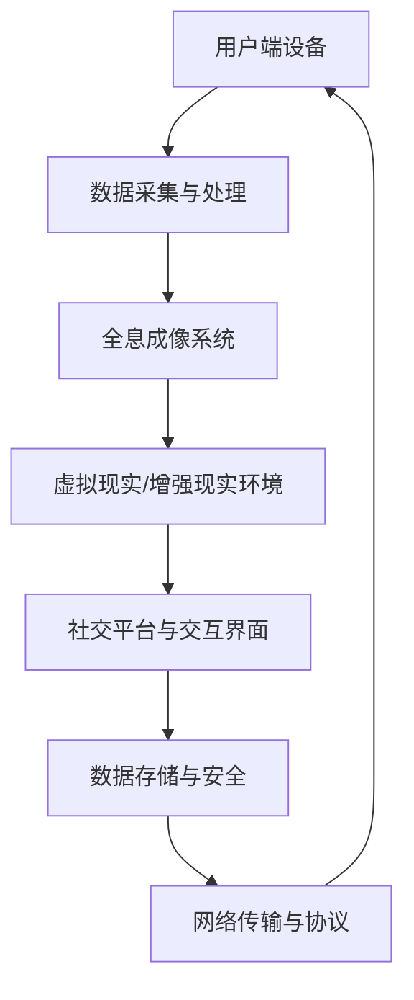

                 

关键词：社交网络、全息社交、虚拟现实、社交方式、技术发展、算法原理、数学模型、实际应用

> 摘要：本文深入探讨了2050年社交网络的未来发展，分析了从虚拟社交向全息社交转型的关键因素、技术挑战与解决方案。文章首先回顾了社交网络的发展历程，然后介绍了全息社交的概念及其技术基础，最后对未来社交网络的演进趋势和应用场景进行了展望。

## 1. 背景介绍

社交网络作为互联网的重要组成部分，其发展历程伴随着计算机技术的不断进步。从最早的BBS、ICQ到如今的Facebook、微信，社交网络经历了从文本交流到图片、视频分享的演变。这一过程中，算法优化、用户需求、数据处理等技术不断推动着社交网络的创新与发展。

然而，随着虚拟现实（VR）和增强现实（AR）技术的逐渐成熟，社交网络的发展迎来了新的机遇和挑战。全息社交作为未来的一个重要趋势，将彻底改变人们的社会互动方式，使得虚拟世界与现实世界的界限变得模糊。本文旨在探讨这一趋势，分析其背后的技术原理和实现方法。

## 2. 核心概念与联系

### 2.1 全息社交的概念

全息社交是一种基于全息成像技术的社交方式，它通过捕捉和重建人的三维形象，使得网络社交具有更高的真实感和互动性。在2050年的社交网络中，全息社交将取代传统的二维图像和视频，成为主要的社交方式。

### 2.2 技术基础

全息社交的实现离不开以下几个关键技术的支持：

1. **全息成像技术**：这是全息社交的核心，它能够捕捉和重建人的三维形象，提供高度真实的视觉体验。
2. **虚拟现实（VR）技术**：VR技术为全息社交提供了沉浸式的环境，使得用户可以在虚拟世界中自由探索和互动。
3. **增强现实（AR）技术**：AR技术能够将虚拟形象与现实环境相结合，实现虚实融合的社交体验。

### 2.3 架构图

下图展示了全息社交的技术架构：



## 3. 核心算法原理 & 具体操作步骤

### 3.1 算法原理概述

全息社交的核心算法包括三维人体建模、动作捕捉和实时渲染等。

- **三维人体建模**：通过深度相机和运动传感器捕捉用户的三维轮廓和动作，然后利用机器学习和计算机图形学技术重建三维人体模型。
- **动作捕捉**：利用惯性测量单元（IMU）和光学传感器捕捉用户动作，将其转化为虚拟空间中的动作。
- **实时渲染**：利用图形处理单元（GPU）和实时渲染引擎，将三维模型和动作实时渲染到虚拟环境中。

### 3.2 算法步骤详解

1. **数据采集**：使用深度相机和运动传感器捕捉用户的三维轮廓和动作。
2. **预处理**：对采集到的数据进行降噪、去畸变等预处理。
3. **三维人体建模**：利用机器学习和计算机图形学技术重建三维人体模型。
4. **动作捕捉**：将运动传感器捕捉到的动作转化为虚拟空间中的动作。
5. **实时渲染**：将三维模型和动作实时渲染到虚拟环境中，并传输到其他用户的设备上。

### 3.3 算法优缺点

- **优点**：提供了高度真实的社交体验，增强了用户的参与感和互动性。
- **缺点**：技术实现复杂，设备成本高，对网络带宽有较高要求。

### 3.4 算法应用领域

全息社交技术可以广泛应用于远程办公、在线教育、医疗保健、娱乐等领域，为人们提供更加丰富和互动的社交体验。

## 4. 数学模型和公式 & 详细讲解 & 举例说明

### 4.1 数学模型构建

全息社交的核心数学模型包括三维人体建模的方程和动作捕捉的微分方程。

$$
P(t) = M \cdot R(t) \cdot T(t) + C
$$

其中，$P(t)$表示三维坐标，$M$是模型矩阵，$R(t)$是旋转矩阵，$T(t)$是平移矩阵，$C$是相机参数。

$$
\frac{d^2x(t)}{dt^2} = F(t)
$$

其中，$x(t)$表示运动轨迹，$F(t)$是作用力。

### 4.2 公式推导过程

三维人体建模的推导过程涉及计算机图形学和机器学习算法，这里不再赘述。动作捕捉的微分方程则基于牛顿第二定律。

### 4.3 案例分析与讲解

以远程办公为例，全息社交技术可以使得分散在全球的团队成员在虚拟会议室中面对面交流。以下是一个简单的案例：

- **场景一**：团队成员A位于北京，团队成员B位于纽约，他们通过全息社交技术在虚拟会议室中开会。
- **过程**：团队成员A的三维形象和动作通过设备捕捉并传输到服务器，服务器将数据实时渲染并传输给团队成员B，团队成员B在虚拟会议室中看到团队成员A的三维形象和动作，实现实时互动。

## 5. 项目实践：代码实例和详细解释说明

### 5.1 开发环境搭建

开发全息社交应用需要配置以下环境：

- 操作系统：Windows/Linux/MacOS
- 编程语言：C++/Python
- 开发工具：Visual Studio/PyCharm
- 库和框架：OpenGL/Vulkan/PyOpenGL

### 5.2 源代码详细实现

以下是一个简单的三维人体建模的C++代码示例：

```cpp
#include <GL/glew.h>
#include <GLFW/glfw3.h>
#include <glm/glm.hpp>
#include <glm/gtc/matrix_transform.hpp>

int main() {
    // 初始化GLFW
    if (!glfwInit()) {
        return -1;
    }

    // 创建窗口
    GLFWwindow* window = glfwCreateWindow(640, 480, "3D Human Modeling", nullptr, nullptr);
    if (!window) {
        glfwTerminate();
        return -1;
    }

    // 设置上下文
    glfwMakeContextCurrent(window);

    // 初始化GLEW
    if (glewInit() != GLEW_OK) {
        return -1;
    }

    // 配置OpenGL状态
    glClearColor(0.2f, 0.3f, 0.3f, 1.0f);

    // 创建顶点数组对象（VBO）和顶点缓冲对象（VBO）
    float vertices[] = {
        // 位置坐标
        -0.5f, -0.5f, 0.0f,
         0.5f, -0.5f, 0.0f,
         0.5f,  0.5f, 0.0f,
        -0.5f,  0.5f, 0.0f
        // 法线坐标
        // 颜色
    };

    GLuint VBO;
    glGenBuffers(1, &VBO);
    glBindBuffer(GL_ARRAY_BUFFER, VBO);
    glBufferData(GL_ARRAY_BUFFER, sizeof(vertices), vertices, GL_STATIC_DRAW);

    // 创建顶点着色器
    const char* vertexShaderSource = "#version 330 core\n"
        "layout (location = 0) in vec3 aPos;\n"
        "void main()\n"
        "{\n"
        "   gl_Position = vec4(aPos.x, aPos.y, aPos.z, 1.0);\n"
        "}\0";
    GLuint vertexShader;
    vertexShader = glCreateShader(GL_VERTEX_SHADER);
    glShaderSource(vertexShader, 1, &vertexShaderSource, NULL);
    glCompileShader(vertexShader);

    // 创建片段着色器
    const char* fragmentShaderSource = "#version 330 core\n"
        "out vec4 FragColor;\n"
        "void main()\n"
        "{\n"
        "   FragColor = vec4(1.0f, 0.5f, 0.2f, 1.0f);\n"
        "}\n\0";
    GLuint fragmentShader;
    fragmentShader = glCreateShader(GL_FRAGMENT_SHADER);
    glShaderSource(fragmentShader, 1, &fragmentShaderSource, NULL);
    glCompileShader(fragmentShader);

    // 创建着色器程序
    GLuint shaderProgram;
    shaderProgram = glCreateProgram();
    glAttachShader(shaderProgram, vertexShader);
    glAttachShader(shaderProgram, fragmentShader);
    glLinkProgram(shaderProgram);

    // 设置顶点属性指针
    glBindBuffer(GL_ARRAY_BUFFER, 0);
    glVertexAttribPointer(0, 3, GL_FLOAT, GL_FALSE, 3 * sizeof(float), (void*)0);
    glEnableVertexAttribArray(0);

    // 渲染循环
    while (!glfwWindowShouldClose(window)) {
        // 输入处理
        // ...

        // 渲染命令
        glClear(GL_COLOR_BUFFER_BIT);

        // 绘制三角形
        glUseProgram(shaderProgram);
        glBindVertexArray(VBO);
        glDrawArrays(GL_TRIANGLES, 0, 3);

        // 交换缓冲区
        glfwSwapBuffers(window);

        // 检查事件
        glfwPollEvents();
    }

    // 清理
    glDeleteVertexArrays(1, &VBO);
    glDeleteShader(vertexShader);
    glDeleteShader(fragmentShader);

    glfwTerminate();
    return 0;
}
```

### 5.3 代码解读与分析

这段代码实现了使用OpenGL绘制一个简单的三维三角形。通过顶点数组对象（VBO）存储顶点数据，通过顶点着色器（vertex shader）和片段着色器（fragment shader）实现渲染效果。

### 5.4 运行结果展示

运行这段代码将在OpenGL窗口中绘制一个红色的三角形。

## 6. 实际应用场景

全息社交技术在许多领域都有广泛的应用，以下是一些典型的应用场景：

### 6.1 远程办公

全息社交技术使得远程办公变得更加真实和高效，团队成员可以在虚拟会议室中面对面交流，提升协作效率。

### 6.2 在线教育

全息社交为在线教育提供了全新的教学方式，教师和学生可以在虚拟教室中互动，提高学习体验。

### 6.3 医疗保健

全息社交技术在医疗保健领域具有巨大潜力，医生可以通过全息影像进行远程诊断和治疗，提高医疗服务的质量。

### 6.4 娱乐与游戏

全息社交技术为娱乐和游戏行业带来了革命性的变化，玩家可以在虚拟世界中互动，创造更加沉浸式的游戏体验。

## 7. 工具和资源推荐

### 7.1 学习资源推荐

- 《计算机图形学原理及实践》
- 《计算机视觉基础》
- 《深度学习：告别机器学习》

### 7.2 开发工具推荐

- Unity
- Unreal Engine
- Blender

### 7.3 相关论文推荐

- "Holographic Telepresence for Human-Human and Human-Computer Interaction"
- "A Survey of 3D Human Pose Estimation and Tracking"
- "Deep Learning for Human Pose Estimation: A Survey"

## 8. 总结：未来发展趋势与挑战

### 8.1 研究成果总结

全息社交技术已经在多个领域取得重要成果，但仍需要进一步优化和普及。

### 8.2 未来发展趋势

随着硬件技术的进步和算法的优化，全息社交技术将在未来得到更广泛的应用，成为社交网络的主要形式。

### 8.3 面临的挑战

全息社交技术面临的主要挑战包括高成本、复杂的技术实现和隐私保护等。

### 8.4 研究展望

未来的研究应重点关注全息社交技术的标准化、智能化和安全性，以推动其全面发展。

## 9. 附录：常见问题与解答

### 9.1 全息社交技术是否会对隐私造成威胁？

全息社交技术在数据处理方面具有较高的要求，需要确保用户隐私得到有效保护。未来应加强数据加密和隐私保护技术研究。

### 9.2 全息社交技术是否会影响现实社交互动？

全息社交技术作为一种补充手段，不会完全取代现实社交互动，而是为其提供新的形式和体验。

### 9.3 全息社交技术是否会在全球范围内普及？

随着技术的进步和成本的降低，全息社交技术有望在全球范围内普及，但具体时间表取决于多种因素。

