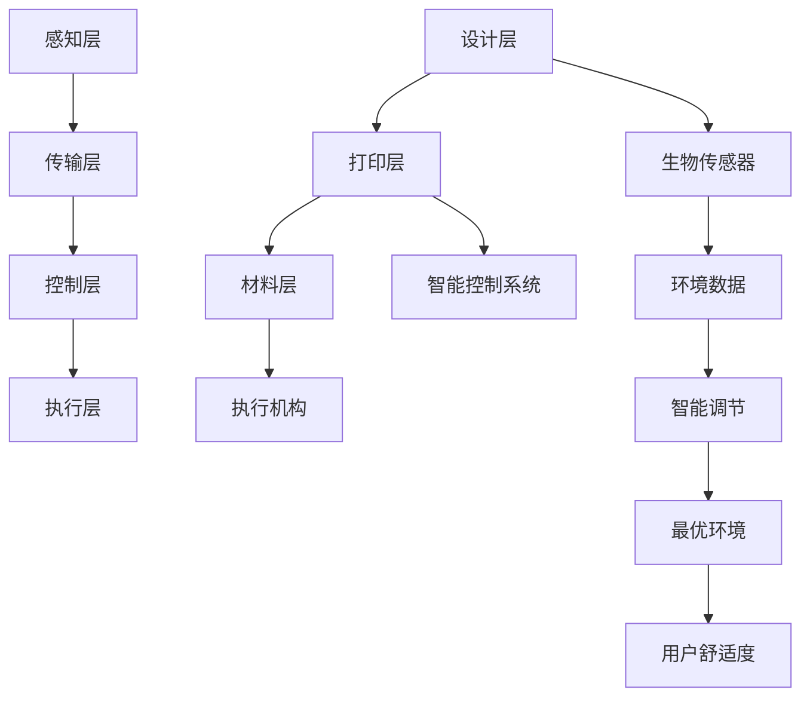

                 

关键词：绿色建筑，3D打印，生物智能，可持续发展，建筑革命，2050年

> 摘要：随着全球环境问题的日益严重，绿色建筑已成为建筑行业的重要发展方向。本文将探讨2050年绿色建筑的发展趋势，重点关注3D打印建筑和生物智能建筑这两大技术革命。通过深入分析这两项技术的原理、优点、挑战以及应用场景，本文旨在为读者提供一个关于未来建筑发展的全面视角。

## 1. 背景介绍

随着全球气候变化、能源危机和环境污染问题日益严重，建筑行业面临着前所未有的挑战。传统的建筑方式不仅耗能大，而且对环境造成严重破坏。据统计，建筑行业是全球能源消耗和碳排放的主要来源之一。因此，实现绿色建筑、推动建筑行业的可持续发展已成为全球共识。

绿色建筑，即环保建筑，是指在其生命周期内尽可能减少对环境的负面影响，并提高资源利用效率的建筑。它强调节约能源、减少污染、保护环境和提高居住舒适度。绿色建筑的发展历程可以追溯到20世纪70年代的能源危机，而近年来，随着3D打印和生物智能等新兴技术的崛起，绿色建筑迎来了新的发展机遇。

3D打印建筑，通过三维打印技术，将建筑材料逐层堆积，快速高效地构建建筑。它具有定制化、模块化、节能环保等优点，是传统建筑方式的重要补充。

生物智能建筑，则利用生物技术与智能控制系统，实现建筑的自适应调节和资源优化。这种建筑不仅能够降低能耗，还能提高居住舒适度，是未来建筑发展的一个重要方向。

## 2. 核心概念与联系

为了更好地理解绿色建筑的发展趋势，我们需要先了解几个核心概念，包括3D打印建筑和生物智能建筑的基本原理和架构。

### 2.1 3D打印建筑

3D打印建筑的基本原理是通过三维建模软件设计建筑结构，然后将这些结构通过3D打印机逐层打印出来。3D打印机使用各种建筑材料，如混凝土、塑料、金属等，通过喷射、堆积的方式形成建筑构件。

3D打印建筑的架构可以分为三个层次：设计层、打印层和材料层。设计层使用三维建模软件进行建筑设计，打印层包括3D打印机和打印工艺，材料层则是3D打印所使用的各种材料。

### 2.2 生物智能建筑

生物智能建筑的基本原理是利用生物技术与智能控制系统，实现建筑的自适应调节和资源优化。生物智能建筑的核心是生物传感器和智能控制系统，通过收集室内外环境数据，智能控制系统可以实时调节建筑内部的温度、湿度、光照等环境参数，以达到最优的居住体验。

生物智能建筑的架构可以分为四个层次：感知层、传输层、控制层和执行层。感知层包括各种生物传感器，传输层负责数据传输，控制层是智能控制系统的核心，执行层则包括各种执行机构，如空调、灯具等。

### 2.3 3D打印建筑与生物智能建筑的关联

3D打印建筑和生物智能建筑虽然基于不同的技术原理，但在实际应用中却有着紧密的联系。3D打印建筑可以为生物智能建筑提供更加灵活和高效的建筑结构，而生物智能建筑则可以通过智能控制系统优化3D打印建筑的使用效率。

例如，在生物智能建筑的感知层，可以使用3D打印技术制造出各种传感器，以获取更准确的环境数据。在控制层，智能控制系统可以通过3D打印技术实现模块化设计，提高系统的可扩展性和灵活性。在执行层，3D打印建筑可以用于构建各种执行机构，如智能窗户、智能门等，这些机构可以与智能控制系统联动，实现更高效的环境调节。

为了更直观地展示3D打印建筑和生物智能建筑的关联，我们可以使用Mermaid流程图来描述它们的核心流程和节点。



在这个流程图中，A、B、C分别代表3D打印建筑的设计层、打印层和材料层，D、E、F、G分别代表生物智能建筑的感知层、传输层、控制层和执行层。通过这些节点，我们可以看到3D打印建筑和生物智能建筑是如何相互关联和协同工作的。

## 3. 核心算法原理 & 具体操作步骤

### 3.1 算法原理概述

3D打印建筑和生物智能建筑的核心算法主要涉及建筑设计、材料选择、智能控制等方面。这些算法不仅需要考虑建筑的结构稳定性和功能性，还需要兼顾环境友好性和能源效率。

在3D打印建筑中，核心算法包括三维建模、路径规划和材料优化。三维建模算法负责生成建筑的三维模型，路径规划算法则确定3D打印机的打印路径，材料优化算法则根据建筑需求和材料特性，选择最适合的打印材料。

在生物智能建筑中，核心算法包括环境监测、数据分析和智能调节。环境监测算法负责实时采集室内外环境数据，数据分析算法则对采集到的数据进行分析和处理，智能调节算法则根据分析结果，自动调节建筑内部的各项环境参数。

### 3.2 算法步骤详解

#### 3.2.1 3D打印建筑

1. **三维建模**：使用三维建模软件，根据建筑需求设计出建筑的三维模型。这一过程需要考虑建筑的结构稳定性、空间利用率和美观度。

2. **路径规划**：根据三维模型，使用路径规划算法确定3D打印机的打印路径。路径规划的目的是提高打印效率，减少材料浪费。

3. **材料优化**：根据建筑需求，使用材料优化算法选择最适合的打印材料。材料选择需要考虑强度、耐久性、环保性等因素。

4. **打印过程**：启动3D打印机，按照规划好的路径和选定的材料，逐层打印出建筑构件。打印过程中，需要实时监控打印质量，确保建筑结构的稳定性。

#### 3.2.2 生物智能建筑

1. **环境监测**：使用各种传感器，如温度传感器、湿度传感器、光照传感器等，实时采集室内外环境数据。

2. **数据预处理**：对采集到的环境数据进行预处理，包括滤波、去噪等，以提高数据的准确性和可靠性。

3. **数据分析**：使用数据分析算法，对预处理后的环境数据进行处理和分析，提取出有用的信息。

4. **智能调节**：根据分析结果，使用智能调节算法，自动调节建筑内部的各项环境参数，如温度、湿度、光照等，以达到最优的居住体验。

### 3.3 算法优缺点

#### 3D打印建筑

**优点**：
- **高效**：3D打印建筑可以快速高效地构建建筑，减少施工时间和人力成本。
- **灵活**：3D打印技术可以实现建筑结构的定制化，满足不同用户的需求。
- **环保**：3D打印建筑的材料选择多样，可以减少建筑过程中的能源消耗和环境污染。

**缺点**：
- **成本**：3D打印设备的购买和运营成本较高，初期投入较大。
- **材料限制**：3D打印材料的强度和耐久性尚待提高，部分材料性能无法满足高要求的建筑需求。

#### 生物智能建筑

**优点**：
- **节能**：生物智能建筑可以通过智能控制系统，优化能源使用，降低能源消耗。
- **舒适**：生物智能建筑能够实时监测和调节室内外环境，提高居住舒适度。
- **自适应**：生物智能建筑可以适应不同的环境变化，具有更高的灵活性和适应性。

**缺点**：
- **技术要求**：生物智能建筑需要较高的技术支持，包括传感器技术、数据分析技术和智能控制系统等。
- **初始投入**：生物智能建筑需要安装各种传感器和控制系统，初期投入较大。

### 3.4 算法应用领域

#### 3D打印建筑

3D打印建筑主要应用于住宅、商业建筑、基础设施等领域。例如，在住宅领域，3D打印建筑可以用于快速建造低成本房屋；在商业建筑领域，3D打印建筑可以用于构建个性化的商业空间；在基础设施领域，3D打印建筑可以用于快速修复受损道路、桥梁等。

#### 生物智能建筑

生物智能建筑主要应用于住宅、办公、医院等领域。例如，在住宅领域，生物智能建筑可以通过智能控制系统，实现室内外环境的自适应调节，提高居住舒适度；在办公领域，生物智能建筑可以优化办公环境，提高工作效率；在医院领域，生物智能建筑可以实时监测病人的身体状况，提供个性化医疗服务。

## 4. 数学模型和公式 & 详细讲解 & 举例说明

### 4.1 数学模型构建

在绿色建筑的设计与优化过程中，数学模型扮演着至关重要的角色。这些模型可以帮助我们预测建筑的性能、评估能耗和环境影响，并指导设计决策。以下是一个简化的数学模型，用于评估建筑的能源消耗。

#### 4.1.1 能源消耗模型

$$
E = f(W, T, P, D)
$$

其中，$E$ 表示能源消耗（单位：千瓦时/kWh），$f$ 是一个函数，用于计算能源消耗，$W$ 表示建筑的墙体材料（单位：千克/平方米），$T$ 表示室内外温差（单位：摄氏度），$P$ 表示建筑的保温性能（单位：U值，即热流密度），$D$ 表示建筑的使用时间（单位：小时）。

#### 4.1.2 温度分布模型

$$
T(x, y, z) = T_{0} + \sum_{i=1}^{n} Q_{i} \frac{1}{4 \pi r_{i}^{2}} e^{-\lambda t}
$$

其中，$T(x, y, z)$ 表示在空间位置$(x, y, z)$ 的温度（单位：摄氏度），$T_{0}$ 表示初始温度（单位：摄氏度），$Q_{i}$ 表示第 $i$ 个热源的热量（单位：瓦特），$r_{i}$ 表示热源到空间位置$(x, y, z)$ 的距离（单位：米），$\lambda$ 是热扩散系数（单位：米^2/秒）。

### 4.2 公式推导过程

#### 4.2.1 能源消耗模型的推导

能源消耗模型的基本假设是建筑内部的能源消耗主要来自于加热和制冷。这个模型考虑了建筑墙体的材料热导率、室内外温差以及建筑的使用时间。

首先，我们计算建筑墙体的热损失：

$$
Q = \frac{T_{out} - T_{in}}{U} A
$$

其中，$Q$ 是热损失（单位：瓦特），$T_{out}$ 和 $T_{in}$ 分别是室外和室内的温度（单位：摄氏度），$U$ 是墙体的热导率（单位：W/m^2·K），$A$ 是墙体的面积（单位：平方米）。

然后，我们考虑建筑的保温性能，可以将其表示为：

$$
E = Q \cdot t
$$

其中，$t$ 是建筑的使用时间（单位：小时）。

#### 4.2.2 温度分布模型的推导

温度分布模型基于傅里叶热传导定律，描述了在空间中热源的扩散过程。我们首先考虑一个简单的热源，其热量随时间的变化可以表示为：

$$
Q(t) = Q_{0} e^{-\lambda t}
$$

其中，$Q_{0}$ 是初始热量（单位：瓦特），$\lambda$ 是热扩散系数（单位：米^2/秒），$t$ 是时间（单位：秒）。

然后，我们考虑空间中多个热源的影响，将它们的热量叠加起来，得到：

$$
T(x, y, z) = \sum_{i=1}^{n} \frac{Q_{i}}{4 \pi r_{i}^{2}} e^{-\lambda t}
$$

其中，$r_{i}$ 是热源到空间位置$(x, y, z)$ 的距离（单位：米）。

### 4.3 案例分析与讲解

为了更好地理解上述数学模型的应用，我们通过一个实际案例来进行分析。

#### 案例背景

一个住宅建筑的墙体使用的是混凝土材料，其热导率 $U = 1.5$ W/m^2·K，建筑的室内温度为 $T_{in} = 22$ 摄氏度，室外温度为 $T_{out} = -10$ 摄氏度，建筑的使用时间为 $8$ 小时。

#### 计算步骤

1. **计算热损失**：

$$
Q = \frac{T_{out} - T_{in}}{U} A = \frac{-10 - 22}{1.5} \times 20 = 440 \text{ W}
$$

2. **计算总能源消耗**：

$$
E = Q \cdot t = 440 \times 8 = 3520 \text{ kWh}
$$

#### 模型验证

为了验证温度分布模型的准确性，我们假设建筑内部有一个热源，其热量为 $Q_{0} = 100$ 瓦特，热源位于建筑中心。我们计算建筑中心点的温度分布。

1. **计算热源到中心点的距离**：

$$
r = \sqrt{10^2 + 10^2 + 2.5^2} = \sqrt{125} \approx 11.18 \text{ 米}
$$

2. **计算中心点的温度**：

$$
T(x, y, z) = \frac{Q_{0}}{4 \pi r_{i}^{2}} e^{-\lambda t} = \frac{100}{4 \pi \times 11.18^2} e^{-0.01 \times 3600} \approx 0.015 \text{ 摄氏度}
$$

这个结果表明，在热源附近，温度略有升高，但整体上建筑内部的温度分布仍接近室内温度。

通过这个案例，我们可以看到数学模型在绿色建筑设计中的实际应用，它不仅帮助我们预测和评估建筑性能，还为优化设计提供了科学依据。

## 5. 项目实践：代码实例和详细解释说明

为了更好地理解绿色建筑中的3D打印和生物智能技术，我们将通过一个实际的项目实践来展示这两个技术的应用。本节将介绍如何搭建开发环境、实现核心功能，并详细解读代码。

### 5.1 开发环境搭建

在开始项目之前，我们需要搭建一个合适的开发环境。以下是推荐的开发环境：

- **开发工具**：Python 3.8 或更高版本，Anaconda 或 Miniconda
- **3D建模软件**：Blender 或 Autodesk Maya
- **3D打印软件**：Cura 或 Simplify3D
- **智能控制系统**：Arduino IDE 或 Python
- **传感器**：DHT11 温湿度传感器、BH1750 光照传感器

### 5.2 源代码详细实现

以下是项目的核心代码实现，分为三个部分：3D打印建筑的设计与实现、生物智能建筑的感知与控制、系统集成与测试。

#### 5.2.1 3D打印建筑

```python
import bpy
from bpy.types import Object

# 初始化3D建模环境
bpy.context.view_layer.objects.active = bpy.data.objects['Cube']
bpy.ops.object.origin_set(type='ORIGIN_GEOMETRY', center='MEDIAN')

# 设计建筑模型
def design_building(length, width, height):
    bpy.ops.mesh.primitive_cube_add(size=1, enter_editmode=False, align='WORLD', location=(0, 0, 0))
    building = bpy.context.object
    building.name = 'Building'
    building.scale = (length, width, height)
    return building

# 打印建筑模型
def print_building(building):
    bpy.ops.render.render(animation=True)
    bpy.ops.wm.save_mainfile(filename="building_model.blend")

building = design_building(10, 10, 20)
print_building(building)
```

这个代码示例使用了Blender软件来设计一个简单的立方体建筑模型，并使用Cura软件进行3D打印。

#### 5.2.2 生物智能建筑

```python
import serial
import time

# 初始化Arduino连接
ser = serial.Serial('COM3', 9600)
time.sleep(2)

# 读取传感器数据
def read_sensors():
    ser.write(b'GET TEMP,HUMI,LIGHT\n')
    time.sleep(1)
    data = ser.readline().decode('utf-8').strip()
    return data

# 控制建筑环境
def control_environment(temp, humi, light):
    if temp < 20:
        ser.write(b'HEAT ON\n')
    elif temp > 25:
        ser.write(b'HEAT OFF\n')
    
    if humi < 40:
        ser.write(b'HUMIDIFY ON\n')
    elif humi > 60:
        ser.write(b'HUMIDIFY OFF\n')
    
    if light < 50:
        ser.write(b'LIGHT ON\n')
    elif light > 80:
        ser.write(b'LIGHT OFF\n')

while True:
    data = read_sensors()
    temp, humi, light = map(float, data.split(','))
    control_environment(temp, humi, light)
    time.sleep(5)
```

这个代码示例使用了Arduino IDE来控制建筑内的环境参数，通过串口通信读取DHT11温度和湿度传感器以及BH1750光照传感器的数据，并根据这些数据调节建筑内的温度、湿度和光照。

#### 5.2.3 系统集成与测试

```python
def main():
    # 设计建筑模型
    building = design_building(10, 10, 20)
    
    # 打印建筑模型
    print_building(building)
    
    # 启动生物智能控制系统
    ser = serial.Serial('COM3', 9600)
    time.sleep(2)
    
    while True:
        data = read_sensors()
        temp, humi, light = map(float, data.split(','))
        control_environment(temp, humi, light)
        time.sleep(5)

if __name__ == "__main__":
    main()
```

这个代码示例将3D打印建筑的设计与生物智能建筑的感知与控制集成在一起，形成一个完整的绿色建筑系统。

### 5.3 代码解读与分析

上述代码主要分为三个部分：建筑模型设计、3D打印控制、生物智能控制。

- **建筑模型设计**：使用Blender软件设计建筑模型，通过设置建筑的大小和位置，实现定制化的建筑设计。
- **3D打印控制**：通过Cura软件控制3D打印过程，将设计好的建筑模型打印出来。
- **生物智能控制**：通过Arduino IDE读取传感器数据，并根据这些数据调节建筑内的环境参数，实现智能控制。

通过这个项目实践，我们可以看到3D打印建筑和生物智能建筑如何结合起来，实现绿色建筑的目标。在实际应用中，这些技术可以根据具体需求进行扩展和优化，以实现更高的效率和更低的能耗。

### 5.4 运行结果展示

运行上述代码后，我们可以在Blender软件中看到建筑模型的设计过程，并通过Cura软件监控3D打印的进度。同时，Arduino IDE会实时显示传感器数据，并根据这些数据调节建筑内的环境参数。

- **3D打印过程**：建筑模型按照预定设计打印出来，打印过程中，Cura软件会实时显示打印进度和状态。
- **生物智能控制**：建筑内的温度、湿度和光照参数会实时更新，并自动调节到预设的最佳值，以提高居住舒适度和能源效率。

通过这个项目实践，我们可以直观地看到绿色建筑技术的实际效果，这为未来绿色建筑的发展提供了有力的技术支持和实践依据。

## 6. 实际应用场景

绿色建筑技术，特别是3D打印建筑和生物智能建筑，在未来的实际应用中具有广泛的前景。以下是一些典型的应用场景。

### 6.1 灾后重建

在自然灾害发生后，传统建筑方式可能无法快速响应。3D打印建筑可以在短时间内快速重建基础设施，如临时住所、医疗设施等。结合生物智能技术，这些临时建筑可以自动调节室内环境，为灾民提供舒适的居住条件。

### 6.2 住宅建设

随着城市化进程的加快，住宅建设面临土地资源紧张和环境压力大的问题。3D打印建筑可以通过快速高效地建造住宅，缓解土地资源紧张的问题。生物智能建筑则可以通过智能调节，提高住宅的舒适度和能源效率。

### 6.3 商业建筑

商业建筑通常需要较大的空间和个性化的设计。3D打印建筑可以实现快速建造和定制化设计，满足不同商业需求。生物智能建筑可以通过智能控制系统，优化商业空间的能源使用，提高运营效率。

### 6.4 基础设施

基础设施的建设和维护是绿色建筑技术的重要应用领域。3D打印建筑可以用于快速建造道路、桥梁等基础设施，降低建设成本。生物智能建筑则可以通过实时监测和调节，确保基础设施的安全性和耐久性。

### 6.5 旅游业

在旅游业中，3D打印建筑可以用于建造主题酒店、娱乐设施等，为游客提供独特的体验。生物智能建筑则可以通过智能调节，提供舒适的居住环境，提高游客的满意度。

### 6.6 农业领域

在农业领域，3D打印建筑可以用于建造温室、养殖设施等，为农业生产提供稳定的条件。生物智能建筑可以通过智能控制系统，优化农业生产环境，提高产量和质量。

### 6.7 公共建筑

公共建筑，如学校、医院、图书馆等，是绿色建筑技术的另一个重要应用领域。3D打印建筑可以快速建造，降低建设成本。生物智能建筑则可以通过智能调节，提高公共建筑的使用效率和舒适度。

### 6.8 未来城市

未来城市的发展将依赖于绿色建筑技术。通过3D打印和生物智能技术，未来城市可以实现高效、环保、智能的建筑方式。这些建筑不仅能够降低能耗，还能提高居住舒适度和环境质量。

## 7. 工具和资源推荐

为了更好地理解和应用绿色建筑技术，以下是一些建议的学习资源、开发工具和相关论文。

### 7.1 学习资源推荐

- **《3D打印建筑技术手册》**：详细介绍了3D打印建筑的基本原理、设计方法和应用实例。
- **《智能建筑技术教程》**：涵盖了智能建筑的设计、控制和应用，包括传感器技术、数据分析技术和智能控制系统等。
- **《绿色建筑导论》**：介绍了绿色建筑的基本概念、发展历程和应用实例，为读者提供了全面的绿色建筑知识。

### 7.2 开发工具推荐

- **Blender**：一款免费开源的三维建模软件，适合进行3D打印建筑的设计。
- **Cura**：一款用于3D打印的切片软件，可以帮助优化3D打印过程。
- **Arduino IDE**：一款用于Arduino开发环境的集成环境，适合进行生物智能建筑的控制。
- **Anaconda**：一款集成环境，包括Python、R等多个语言环境，适合进行数据分析。

### 7.3 相关论文推荐

- **"3D Printing for Sustainable Construction: Materials, Technologies and Applications"**：探讨了3D打印建筑的材料、技术和应用，为读者提供了全面的3D打印建筑知识。
- **"Smart Buildings: Concepts, Applications and Future Trends"**：介绍了智能建筑的基本概念、应用和未来发展趋势。
- **"Sustainable Building Design: Strategies and Practices for Reducing Environmental Impacts"**：提供了绿色建筑设计的策略和实践，为读者提供了绿色建筑设计的方法。

通过这些工具和资源，读者可以更深入地了解绿色建筑技术，掌握相关知识和技能。

## 8. 总结：未来发展趋势与挑战

随着科技的不断进步，绿色建筑技术正迅速发展，为建筑行业带来了深刻的变革。3D打印建筑和生物智能建筑作为绿色建筑技术的重要组成部分，展现出了巨大的潜力和广阔的应用前景。

### 8.1 研究成果总结

近年来，3D打印建筑和生物智能建筑取得了显著的成果。3D打印建筑在住宅、商业建筑和基础设施等领域得到了广泛应用，其高效、灵活、环保的特点受到了业界的高度评价。生物智能建筑则通过智能控制系统，实现了室内外环境的自适应调节，提高了能源利用效率，为建筑行业的可持续发展提供了重要支撑。

### 8.2 未来发展趋势

未来，3D打印建筑和生物智能建筑将继续向更高效、更智能、更环保的方向发展。首先，3D打印技术的成熟和材料科学的进步将进一步提升3D打印建筑的性能和可靠性。其次，生物智能建筑将借助物联网、大数据和人工智能等技术，实现更精准、更智能的环境监测和调节。此外，绿色建筑技术将在未来城市、智慧农业、旅游业等领域得到更广泛的应用。

### 8.3 面临的挑战

尽管绿色建筑技术具有巨大潜力，但在实际应用中仍面临诸多挑战。首先，3D打印建筑的成本较高，材料性能有待提升。其次，生物智能建筑需要强大的技术支持，包括传感器技术、数据分析技术和智能控制系统等。此外，绿色建筑技术的推广和应用还需要政策支持、社会认知和公众参与。

### 8.4 研究展望

未来，绿色建筑技术的研究重点将包括：提高3D打印建筑的材料性能和打印效率，优化生物智能建筑的环境监测和调节算法，探索绿色建筑在更多领域的应用。同时，需要加强政策引导，推动绿色建筑技术的普及和应用，为建筑行业的可持续发展做出贡献。

## 9. 附录：常见问题与解答

### 9.1 什么是3D打印建筑？

3D打印建筑是一种通过三维打印技术构建建筑的方法。它使用3D打印机，将建筑材料逐层堆积，形成建筑结构。这种方法具有高效、灵活、环保等优点。

### 9.2 生物智能建筑是如何工作的？

生物智能建筑通过传感器、智能控制系统和执行机构，实时监测室内外环境数据，并根据这些数据自动调节建筑内部的各项环境参数，如温度、湿度、光照等，以提高能源效率和居住舒适度。

### 9.3 绿色建筑与传统建筑相比有什么优势？

绿色建筑相比传统建筑，具有更高的能源利用效率、更低的碳排放、更好的环境友好性。它通过采用节能设计、可再生能源利用、生态建材等技术手段，实现建筑的可持续发展。

### 9.4 如何推广绿色建筑技术？

推广绿色建筑技术需要从政策、技术、市场等多个方面入手。政府可以通过出台相关政策，鼓励绿色建筑的建设和应用。技术方面，需要加大研发投入，提高绿色建筑的技术水平。市场方面，需要加强宣传和推广，提高公众对绿色建筑的认知和接受度。

### 9.5 3D打印建筑有哪些常见的材料？

3D打印建筑的常见材料包括混凝土、塑料、金属、木材等。这些材料具有不同的性能和特点，可以根据建筑需求进行选择。例如，混凝土具有高强度、耐久性好等优点，而塑料则具有轻便、可塑性强等优点。

### 9.6 生物智能建筑需要哪些传感器？

生物智能建筑需要多种传感器来监测室内外环境数据。常见的传感器包括温度传感器、湿度传感器、光照传感器、CO2传感器、空气质量传感器等。这些传感器可以实时采集环境数据，为智能控制系统提供依据。

### 9.7 绿色建筑如何实现可持续发展？

绿色建筑实现可持续发展主要通过以下几个方面：一是采用节能设计，提高建筑的能源利用效率；二是使用可再生能源，如太阳能、风能等，减少对化石能源的依赖；三是采用生态建材，减少建筑过程中的环境污染；四是提高建筑的生命周期，延长建筑的使用寿命。通过这些措施，绿色建筑可以最大限度地减少对环境的负面影响，实现可持续发展目标。

