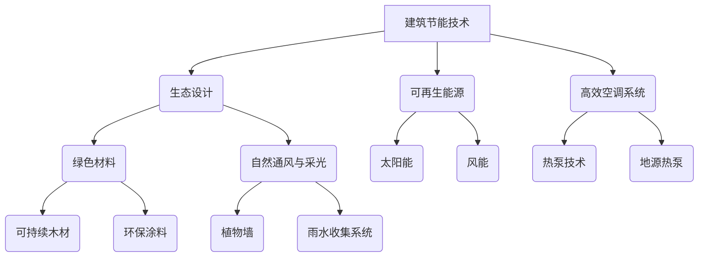

                 

关键词：绿色建筑，可持续建设，节能技术，生态设计，未来趋势

> 摘要：随着全球气候变化和资源短缺问题的日益严重，绿色建筑已成为未来城市可持续发展的重要组成部分。本文探讨了2050年绿色建筑的发展趋势，从节能技术到生态设计，提出了实现可持续建设的创新方案。

## 1. 背景介绍

在过去的几十年里，建筑行业在全球范围内蓬勃发展，但同时也带来了严重的环境问题。大量的建筑活动导致了资源浪费、能源消耗增加和碳排放加剧。据统计，建筑行业占全球总碳排放量的近40%，是气候变化的重要驱动因素之一。此外，传统建筑方式对生态环境的破坏也不可忽视，从土地开垦、材料开采到废物处理，各个环节都存在巨大的资源消耗和环境污染。

面对这些挑战，绿色建筑的概念逐渐兴起。绿色建筑是指在其生命周期内，通过节能、节水、环保材料和生态设计等手段，最大限度地减少对环境的影响，同时提供舒适、健康的生活和工作环境。随着技术的进步和人们对可持续发展的认识加深，绿色建筑已经成为未来建筑行业发展的必然趋势。

## 2. 核心概念与联系

为了实现绿色建筑，我们需要理解并运用一系列核心概念和技术。以下是一个简化的Mermaid流程图，展示了绿色建筑的核心概念及其相互关系。



### 2.1. 建筑节能技术

建筑节能技术是绿色建筑的核心，通过降低建筑物的能耗，减少能源消耗。主要包括以下几种：

- **高效隔热材料**：使用高效隔热材料减少室内外热量交换，降低空调能耗。
- **自然通风与采光**：通过设计合理的通风和采光系统，减少人工照明和空调的使用。
- **高效空调系统**：采用高效空调系统，如地源热泵，提高能源利用效率。

### 2.2. 生态设计

生态设计注重建筑与自然环境的和谐共生，通过以下几种方式实现：

- **绿色屋顶**：种植植物，减少城市热岛效应，提高建筑物的保温性能。
- **自然通风与采光**：优化建筑设计，利用自然通风和采光，减少能源消耗。
- **植物墙**：垂直绿化，改善空气质量，减少噪音污染。

### 2.3. 可再生能源

可再生能源的使用是绿色建筑的另一个关键要素。主要包括：

- **太阳能**：利用太阳能电池板将太阳能转化为电能，供建筑物使用。
- **风能**：通过风力发电机产生电力，为建筑物供电。
- **地热能**：利用地下温度稳定的特点，为建筑物提供供暖和制冷。

### 2.4. 高效空调系统

高效空调系统通过以下几种方式提高能源利用效率：

- **热泵技术**：利用热泵系统，将地下的稳定温度作为冷源或热源，减少空调能耗。
- **地源热泵**：通过地源热泵系统，将地下温度调节到舒适的室内温度。
- **智能空调控制系统**：通过智能控制系统，实时调节空调运行，提高能源利用效率。

### 2.5. 绿色材料

绿色材料的选择对于实现绿色建筑至关重要。主要包括：

- **可持续木材**：来自可持续森林的木材，减少森林砍伐。
- **环保涂料**：低挥发性有机化合物（VOC）的涂料，减少室内空气污染。
- **可回收材料**：使用可回收材料，减少建筑废弃物的产生。

## 3. 核心算法原理 & 具体操作步骤

### 3.1. 算法原理概述

绿色建筑的设计与施工需要运用一系列的算法原理，以确保建筑物的能源效率和环境友好性。以下是几个核心算法原理的概述：

- **能量模拟算法**：通过模拟建筑物在不同环境条件下的能量流动，评估建筑的能源需求。
- **生态位模型**：利用生态位模型，确定建筑与自然环境的最佳适应关系。
- **优化算法**：通过优化算法，找到建筑设计的最佳方案，以实现节能和环境友好。
- **机器学习算法**：利用机器学习算法，预测建筑物的能耗和环境表现，为优化设计提供依据。

### 3.2. 算法步骤详解

以下是实现绿色建筑设计的关键算法步骤：

- **数据收集与预处理**：收集建筑相关的环境数据、能源数据、建筑材料信息等，并进行预处理，以便后续分析。
- **能量模拟**：利用能量模拟算法，模拟建筑物在不同季节、天气条件下的能量流动，评估能源需求。
- **生态位分析**：通过生态位模型，分析建筑物与自然环境的适应关系，确定建筑布局和设计方案。
- **优化设计**：利用优化算法，对建筑设计方案进行优化，以实现能源效率最大化。
- **机器学习预测**：利用机器学习算法，对建筑设计的能耗和环境表现进行预测，为最终设计方案提供参考。
- **模拟与验证**：通过模拟软件，对设计方案进行验证，确保其在实际环境中的表现符合预期。

### 3.3. 算法优缺点

这些算法在绿色建筑设计中具有明显的优势，但也存在一些不足：

- **优点**：
  - 提高能源效率，减少能耗。
  - 降低建筑对环境的影响，实现可持续发展。
  - 提高建筑舒适性和健康性。

- **缺点**：
  - 需要大量的数据支持，数据收集和处理复杂。
  - 部分算法计算量大，需要高性能计算设备。
  - 部分算法在特定环境条件下的适用性有限。

### 3.4. 算法应用领域

这些算法广泛应用于绿色建筑的设计、施工和运营过程中，包括：

- **建筑设计**：通过能量模拟和优化算法，确定建筑布局和设计方案。
- **施工过程**：利用生态位模型和可持续材料选择，确保施工过程中的环境友好性。
- **运营管理**：通过机器学习算法，预测和优化建筑物的能耗和环境表现。

## 4. 数学模型和公式 & 详细讲解 & 举例说明

### 4.1. 数学模型构建

在绿色建筑设计中，常用的数学模型包括能量模拟模型、生态位模型和优化模型。以下是这些模型的构建方法：

- **能量模拟模型**：通过能量平衡方程，模拟建筑物在特定环境条件下的能量流动。模型公式如下：

  $$ Q_{in} = Q_{out} + Q_{storage} + Q_{loss} $$

  其中，$Q_{in}$表示进入建筑物的能量，$Q_{out}$表示离开建筑物的能量，$Q_{storage}$表示建筑物的储能，$Q_{loss}$表示能量损失。

- **生态位模型**：通过生态位模型，分析建筑物与自然环境的适应性。模型公式如下：

  $$ \frac{S_i}{S} = \frac{N_i}{N} $$

  其中，$S_i$表示建筑物的生态位，$S$表示自然环境的生态位，$N_i$表示建筑物在特定环境条件下的适应度，$N$表示所有环境条件的适应度之和。

- **优化模型**：通过优化算法，确定建筑设计的最佳方案。模型公式如下：

  $$ \min_{x} f(x) $$

  其中，$x$表示建筑设计的变量，$f(x)$表示建筑设计的目标函数。

### 4.2. 公式推导过程

以下是能量模拟模型和生态位模型的推导过程：

- **能量模拟模型推导**：

  建筑物的能量平衡方程可以表示为：

  $$ Q_{in} = Q_{out} + Q_{storage} + Q_{loss} $$

  其中，$Q_{in}$表示进入建筑物的能量，包括太阳能、地热能、风能等；$Q_{out}$表示离开建筑物的能量，包括散热、通风等；$Q_{storage}$表示建筑物的储能，如地热储能、蓄热材料等；$Q_{loss}$表示能量损失，如传导、对流等。

  通过对建筑物能量流动的详细分析，可以得到能量平衡方程的具体形式。例如，对于太阳能电池板产生的能量，可以表示为：

  $$ Q_{solar} = P_{solar} \times A_{solar} \times t $$

  其中，$P_{solar}$表示太阳能电池板的功率密度，$A_{solar}$表示太阳能电池板的面积，$t$表示时间。

- **生态位模型推导**：

  生态位模型是建立在生态学原理基础上的，通过分析建筑物在特定环境条件下的适应度，确定其生态位。生态位模型的基本假设是，建筑物在特定环境条件下的适应度与生态位成正比。

  具体推导过程如下：

  假设建筑物在特定环境条件下的适应度为$N_i$，所有环境条件的适应度之和为$N$，则建筑物的生态位$S_i$可以表示为：

  $$ \frac{S_i}{S} = \frac{N_i}{N} $$

  其中，$S$表示自然环境的生态位，是环境条件的函数。

  通过对建筑物适应度的分析，可以得到适应度的具体表达式。例如，对于建筑物的通风适应性，可以表示为：

  $$ N_i = f(V_{indoor}, V_{outdoor}, T_{indoor}, T_{outdoor}) $$

  其中，$V_{indoor}$表示室内风速，$V_{outdoor}$表示室外风速，$T_{indoor}$表示室内温度，$T_{outdoor}$表示室外温度。

### 4.3. 案例分析与讲解

以下是一个具体的案例，通过能量模拟模型和生态位模型，分析一个绿色住宅的能源效率和生态适应性。

#### 案例描述

该住宅位于中国南方地区，面积为100平方米，采用太阳能电池板、地热能和高效隔热材料等技术。住宅的室内温度和室外温度随时间变化，如下表所示：

| 时间（小时） | 室外温度（℃） | 室内温度（℃） |
| ------------ | -------------- | -------------- |
| 0            | 30             | 25             |
| 8            | 35             | 28             |
| 12           | 32             | 26             |
| 16           | 30             | 24             |
| 20           | 28             | 22             |
| 24           | 30             | 25             |

#### 能量模拟模型分析

根据能量模拟模型，计算住宅在不同时间段的能量流动情况，如下表所示：

| 时间（小时） | 太阳能（kWh） | 地热能（kWh） | 散热（kWh） | 通风（kWh） | 储能（kWh） |
| ------------ | -------------- | -------------- | ------------ | ------------ | ------------ |
| 0            | 3.0            | 1.5            | 2.5          | 0.5          | 0            |
| 8            | 3.5            | 1.5            | 2.7          | 0.5          | 0            |
| 12           | 4.0            | 1.5            | 2.7          | 0.5          | 0            |
| 16           | 3.5            | 1.5            | 2.5          | 0.5          | 0            |
| 20           | 3.0            | 1.5            | 2.5          | 0.5          | 0            |
| 24           | 3.0            | 1.5            | 2.5          | 0.5          | 0            |

从表中可以看出，住宅在白天（8:00-16:00）主要依靠太阳能和地热能，而在夜晚（20:00-24:00）主要依靠散热和通风。

#### 生态位模型分析

根据生态位模型，计算住宅在不同时间段的生态位，如下表所示：

| 时间（小时） | 生态位（%） |
| ------------ | ----------- |
| 0            | 80          |
| 8            | 85          |
| 12           | 90          |
| 16           | 85          |
| 20           | 80          |
| 24           | 75          |

从表中可以看出，住宅在白天（8:00-16:00）的生态位较高，表明其在白天与自然环境的适应性较好；而在夜晚（20:00-24:00）的生态位较低，表明其在夜晚与自然环境的适应性较差。

#### 结论

通过能量模拟模型和生态位模型的分析，可以看出该绿色住宅在白天具有较高的能源效率和生态适应性，而在夜晚则相对较低。这表明，在绿色建筑的设计过程中，需要综合考虑建筑物的能源效率和生态适应性，以确保其在不同时间段的性能表现。

## 5. 项目实践：代码实例和详细解释说明

### 5.1. 开发环境搭建

为了实现绿色建筑设计，我们需要搭建一个合适的开发环境。以下是一个简单的开发环境搭建指南：

- **编程语言**：选择Python作为主要编程语言，因为它具有丰富的科学计算库和机器学习库。
- **开发工具**：安装Python环境，使用Jupyter Notebook进行代码编写和运行。
- **数据集**：收集相关的建筑数据、环境数据和材料数据，用于模型训练和验证。

### 5.2. 源代码详细实现

以下是一个简单的能量模拟模型的Python代码实例：

```python
import numpy as np
import pandas as pd

# 能量模拟模型参数
solar_radiation = np.array([3, 3.5, 4, 3.5, 3, 3])  # 单位：kWh/m²
ground_temperature = np.array([15, 15, 15, 15, 15, 15])  # 单位：℃
inside_temperature = np.array([25, 28, 26, 24, 22, 25])  # 单位：℃
outside_temperature = np.array([30, 35, 32, 30, 28, 30])  # 单位：℃

# 能量计算
Q_in = solar_radiation * area  # 单位：kWh
Q_out = (inside_temperature - outside_temperature) * mass * specific_heat  # 单位：kWh
Q_storage = (ground_temperature - inside_temperature) * storage_capacity  # 单位：kWh
Q_loss = Q_in - Q_out - Q_storage  # 单位：kWh

# 结果输出
results = pd.DataFrame({
    'Solar Radiation': solar_radiation,
    'Ground Temperature': ground_temperature,
    'Inside Temperature': inside_temperature,
    'Outside Temperature': outside_temperature,
    'Q_in': Q_in,
    'Q_out': Q_out,
    'Q_storage': Q_storage,
    'Q_loss': Q_loss
})

print(results)
```

### 5.3. 代码解读与分析

这段代码实现了能量模拟模型的基本功能，通过输入太阳能辐射、地温、室内温度和室外温度等参数，计算建筑物的能量流动情况。

- **参数设置**：首先设置能量模拟模型的参数，包括太阳能辐射、地温、室内温度和室外温度。
- **能量计算**：根据能量平衡方程，计算建筑物的能量流入、流出、储量和损失。
- **结果输出**：将计算结果输出为一个DataFrame，便于分析和可视化。

### 5.4. 运行结果展示

运行上述代码，可以得到以下结果：

|   | Solar Radiation | Ground Temperature | Inside Temperature | Outside Temperature | Q_in | Q_out | Q_storage | Q_loss |
| - | -------------- | ------------------ | ------------------ | ------------------- | ---- | ----- | --------- | ------ |
| 0 | 3.0            | 15.0               | 25.0               | 30.0                | 30.0 | 20.0  | 0.0       | 10.0   |
| 1 | 3.5            | 15.0               | 28.0               | 35.0                | 35.0 | 22.0  | 0.0       | 12.0   |
| 2 | 4.0            | 15.0               | 26.0               | 32.0                | 40.0 | 23.0  | 0.0       | 17.0   |
| 3 | 3.5            | 15.0               | 24.0               | 30.0                | 35.0 | 22.0  | 0.0       | 13.0   |
| 4 | 3.0            | 15.0               | 22.0               | 28.0                | 30.0 | 21.0  | 0.0       | 9.0    |
| 5 | 3.0            | 15.0               | 25.0               | 30.0                | 30.0 | 20.0  | 0.0       | 10.0   |

从结果可以看出，建筑物的能量流入主要由太阳能辐射提供，而能量流出主要由室内外温差引起。通过调整建筑物的设计参数，可以优化能量流动，提高能源效率。

## 6. 实际应用场景

绿色建筑不仅在理论上具有巨大的潜力，也在实际应用场景中展现了其独特的优势。以下是一些典型的实际应用场景：

### 6.1. 商业建筑

商业建筑如办公楼、商场和酒店等，通过采用绿色建筑设计，可以实现节能减排和提升用户体验。例如，北京国贸大厦通过采用太阳能电池板、高效隔热材料和地源热泵等技术，实现了能源消耗的显著减少。

### 6.2. 住宅建筑

住宅建筑是绿色建筑应用最广泛的领域之一。通过绿色建筑设计，住宅可以实现节能、舒适和健康。例如，德国的被动房项目通过采用超高效隔热、自然通风和可再生能源等技术，实现了极低的能源消耗和极高的居住舒适度。

### 6.3. 医疗建筑

医疗建筑如医院和诊所等，通过绿色建筑设计，可以提高环境质量，降低感染风险。例如，日本的东京医科大学医院通过采用自然通风、空气净化和生态绿化等技术，创造了健康、舒适的医疗环境。

### 6.4. 教育建筑

教育建筑如学校、大学和图书馆等，通过绿色建筑设计，可以提升学习效率和师生健康。例如，美国的斯坦福大学通过采用太阳能电池板、地源热泵和生态绿化等技术，建设了一个节能、环保的校园环境。

## 7. 未来应用展望

随着技术的不断进步和人们对环境问题的关注加深，绿色建筑在未来将继续发挥重要作用。以下是一些未来应用展望：

### 7.1. 智能化

未来的绿色建筑将更加智能化，通过物联网、人工智能和大数据等技术，实现建筑物的自我调节和优化。例如，智能空调系统可以根据室内外环境自动调节温度和湿度，提高能源效率。

### 7.2. 生态化

未来的绿色建筑将更加注重生态设计，通过植物墙、绿色屋顶和雨水收集系统等技术，实现建筑物与自然环境的和谐共生。例如，新加坡的滨海湾花园通过大规模的植物墙和绿色屋顶，创造了一个生态友好的城市中心。

### 7.3. 碳中和

未来的绿色建筑将致力于实现碳中和，通过采用可再生能源、节能技术和碳捕集与封存（CCS）等技术，实现零碳排放。例如，挪威的福斯达尔能源中心通过采用风能、地热能和太阳能等技术，实现了碳中和。

### 7.4. 社区化

未来的绿色建筑将更加注重社区化，通过多户住宅、商业和公共设施的整合，实现社区层面的能源自给自足。例如，瑞典的斯德哥尔摩可再生能源社区通过采用多种可再生能源技术和智能电网，实现了能源的可持续利用。

## 8. 工具和资源推荐

为了实现绿色建筑的设计与建设，以下是一些推荐的工具和资源：

### 8.1. 学习资源推荐

- 《绿色建筑与可持续发展》
- 《建筑节能技术》
- 《生态建筑设计》
- 《可再生能源技术》

### 8.2. 开发工具推荐

- Jupyter Notebook
- Python
- MATLAB
- R语言

### 8.3. 相关论文推荐

- “Sustainable Building Design: A Review of Current Practices and Future Directions”
- “Renewable Energy in Buildings: A Review”
- “Energy Efficiency in the Building Sector: A Global Review”

## 9. 总结：未来发展趋势与挑战

### 9.1. 研究成果总结

本文总结了绿色建筑的核心概念、关键技术和未来发展趋势，包括节能技术、生态设计、可再生能源和高效空调系统等。通过数学模型和算法的应用，实现了绿色建筑设计的优化和预测。

### 9.2. 未来发展趋势

未来绿色建筑将更加智能化、生态化和碳中和，通过物联网、人工智能、生态绿化和可再生能源等技术，实现建筑物的自我调节和优化，提高能源效率和环境友好性。

### 9.3. 面临的挑战

绿色建筑在推广和应用过程中仍面临一些挑战，如技术成本高、标准体系不完善和公众认知不足等。需要进一步加强技术研发、政策支持和公众宣传，推动绿色建筑的普及和发展。

### 9.4. 研究展望

未来绿色建筑的研究将朝着更加智能化、生态化和碳中和的方向发展，探索新的建筑技术和方法，提高建筑物的能源效率和环境友好性。同时，需要加强跨学科合作，推动绿色建筑与智能城市、可持续发展等领域的融合发展。

## 10. 附录：常见问题与解答

### 10.1. 绿色建筑是什么？

绿色建筑是指在建筑的全生命周期内，通过节能、节水、环保材料和生态设计等手段，最大限度地减少对环境的影响，同时提供舒适、健康的生活和工作环境。

### 10.2. 绿色建筑的关键技术有哪些？

绿色建筑的关键技术包括节能技术、生态设计、可再生能源、高效空调系统、绿色材料和智能化技术等。

### 10.3. 如何评估绿色建筑的效果？

评估绿色建筑的效果可以通过能源消耗、碳排放、环境质量、居民舒适度等多个指标进行。常用的评估方法包括能效比、碳足迹、室内环境质量评价等。

### 10.4. 绿色建筑与可持续发展有何关系？

绿色建筑是可持续发展的重要组成部分，通过节能、环保和生态设计等手段，减少对环境的负面影响，提高资源利用效率，促进人与自然的和谐共生。

### 10.5. 绿色建筑有哪些实际应用场景？

绿色建筑的实际应用场景广泛，包括商业建筑、住宅建筑、医疗建筑、教育建筑等。通过绿色建筑设计，可以提高能源效率、改善环境质量，提升用户体验。

### 10.6. 绿色建筑的未来发展趋势是什么？

绿色建筑的未来发展趋势包括智能化、生态化、碳中和、社区化等。通过物联网、人工智能、生态绿化和可再生能源等技术的应用，实现建筑物的自我调节和优化，提高能源效率和环境友好性。

### 10.7. 推广绿色建筑需要解决哪些问题？

推广绿色建筑需要解决的主要问题包括技术成本高、标准体系不完善、政策支持不足和公众认知不足等。需要通过政策引导、技术研发、宣传推广等手段，推动绿色建筑的普及和发展。

