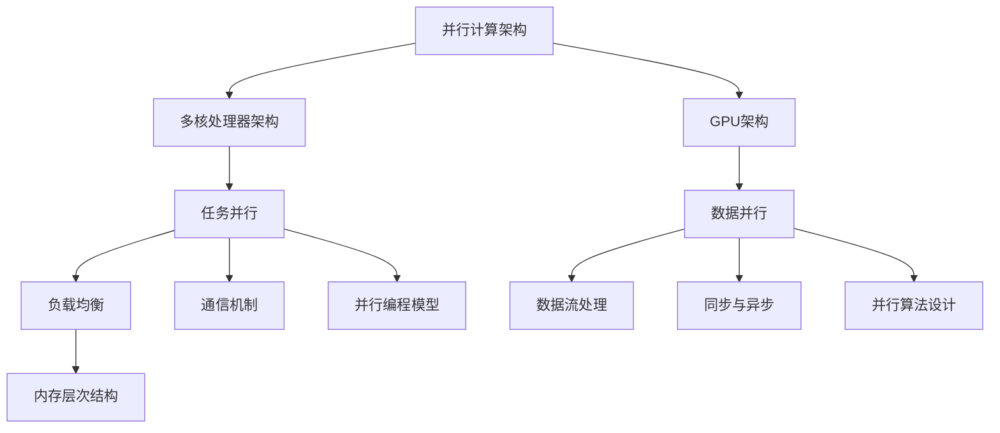

                 

关键词：并行计算，多核，GPU编程，编程技术，高效性能，算法优化，并行算法，数据并行，任务并行

> 摘要：本文深入探讨了并行计算在多核和GPU编程中的关键技术。通过分析并行计算的基本概念、核心算法、数学模型以及实际应用场景，本文旨在为读者提供全面的并行计算技术指南，助力在多核和GPU环境下实现高效的程序优化和性能提升。

## 1. 背景介绍

并行计算是指在同一时间内使用多个处理器来共同完成计算任务的一种计算方法。随着计算机技术的发展，多核处理器和图形处理器（GPU）的普及，并行计算已经成为提高计算效率和解决复杂问题的有效手段。传统的串行计算在遇到大规模数据处理和复杂计算任务时往往显得力不从心，而并行计算通过充分利用多核和GPU的并行处理能力，可以显著提高程序的执行速度和性能。

多核处理器（Multi-core Processor）是指在一个处理器芯片上集成多个独立的计算核心，每个核心可以独立执行指令。多核处理器能够提高计算性能，降低能耗，并增强系统的响应速度。然而，多核处理器的编程复杂度也相应增加，需要开发人员掌握并行编程技术，以充分利用多核处理器的并行计算能力。

GPU（Graphics Processing Unit）是一种专门用于图形渲染的处理器，但其强大的并行计算能力使其在非图形处理任务中也得到了广泛应用。GPU由大量的流处理器组成，每个处理器可以独立执行计算任务，非常适合处理大量并行数据。与多核CPU相比，GPU具有更高的并行处理能力和更低的功耗，使其成为并行计算的重要选择。

本文将围绕并行计算在多核和GPU编程中的关键技术展开讨论，包括并行算法的设计、数学模型的构建、具体实现方法以及实际应用场景。通过本文的阐述，读者将了解并行计算的基本原理和应用，掌握多核和GPU编程技术，为开发高性能并行程序打下基础。

## 2. 核心概念与联系

### 2.1 并行计算的基本概念

并行计算（Parallel Computing）是一种利用多个处理单元（如CPU核心、GPU流处理器等）同时执行计算任务的方法。并行计算的核心思想是将一个大的计算任务分解为多个小的子任务，这些子任务可以并行执行，并在最终阶段汇总结果。

并行计算的关键概念包括：

- **任务并行（Task Parallelism）**：将任务分解为独立的子任务，每个子任务由不同的处理单元并行执行。任务并行适用于计算任务本身具有独立性，例如计算多个独立的数据集。
- **数据并行（Data Parallelism）**：将数据集分解为多个部分，每个部分由不同的处理单元独立处理。数据并行适用于对大型数据集进行相同操作的并行计算，如矩阵运算、图像处理等。
- **负载均衡（Load Balancing）**：确保并行计算中的子任务能够在不同的处理单元上均衡执行，以最大化利用处理器的并行计算能力。

### 2.2 多核与GPU架构联系

多核处理器和GPU在架构上存在显著差异，但它们都支持并行计算。多核处理器采用传统的冯诺依曼架构，每个核心具有独立的寄存器和缓存，但共享内存和I/O资源。而GPU则采用SIMD（单指令多数据流）架构，由大量简单的流处理器组成，这些处理器可以通过硬件进行同步和异步操作。

多核与GPU架构的联系主要体现在以下几个方面：

- **并行计算单元**：多核处理器和GPU都具备并行计算单元，可以同时处理多个计算任务。多核处理器的并行计算依赖于多个独立的CPU核心，而GPU则依赖于大量的流处理器。
- **数据流处理**：GPU的SIMD架构使得其非常适合处理大量并行数据流，通过将数据流分配到不同的流处理器上，可以实现高效的数据并行计算。
- **内存层次结构**：多核处理器和GPU都采用多级缓存体系，以提高数据访问速度和内存带宽。多核处理器的缓存通常更依赖于CPU核心的独立性和内存一致性，而GPU缓存则更侧重于流处理器的数据访问效率。

### 2.3 并行计算架构的Mermaid流程图



通过上述流程图，我们可以清晰地看到并行计算架构的组成和核心概念之间的联系。任务并行、数据并行、负载均衡、数据流处理、内存层次结构、通信机制、同步与异步以及并行编程模型和并行算法设计都是并行计算的关键组成部分。

### 3. 核心算法原理 & 具体操作步骤

#### 3.1 算法原理概述

并行计算的核心算法通常分为任务并行算法和数据并行算法两大类。任务并行算法旨在将计算任务分解为多个独立的子任务，并分配给不同的处理单元并行执行。数据并行算法则将数据集分解为多个部分，每个部分由不同的处理单元独立处理。

任务并行算法通常采用以下步骤：

1. **任务分解**：将原始任务分解为多个独立的子任务。
2. **任务分配**：将子任务分配给不同的处理单元。
3. **并行执行**：各个处理单元独立执行子任务。
4. **结果汇总**：将子任务的结果汇总，得到最终结果。

数据并行算法通常采用以下步骤：

1. **数据划分**：将原始数据集划分为多个部分。
2. **数据分配**：将数据部分分配给不同的处理单元。
3. **并行处理**：各个处理单元独立处理数据部分。
4. **结果汇总**：将处理结果汇总，得到最终结果。

#### 3.2 算法步骤详解

**任务并行算法步骤详解**：

1. **任务分解**：确定原始任务的目标，将任务分解为多个独立的子任务。例如，对于矩阵乘法任务，可以将矩阵分解为多个子矩阵。
2. **任务分配**：根据处理单元的数量，将子任务分配给不同的处理单元。例如，在多核处理器上，可以将子任务分配给不同的CPU核心。
3. **并行执行**：各个处理单元独立执行子任务。在执行过程中，处理单元之间可以相互独立，不需要同步操作。
4. **结果汇总**：将各个处理单元执行的结果汇总，得到最终结果。例如，对于矩阵乘法，将各个子矩阵的结果相加，得到最终的乘积矩阵。

**数据并行算法步骤详解**：

1. **数据划分**：将原始数据集划分为多个部分。例如，对于图像处理任务，可以将图像划分为多个像素块。
2. **数据分配**：将数据部分分配给不同的处理单元。例如，在GPU上，可以将数据部分分配给不同的流处理器。
3. **并行处理**：各个处理单元独立处理数据部分。处理单元之间可以并行执行相同的计算操作，例如图像滤波。
4. **结果汇总**：将处理结果汇总，得到最终结果。例如，对于图像处理，将各个像素块的处理结果重新组合，得到最终处理后的图像。

#### 3.3 算法优缺点

**任务并行算法**的优点：

- **高并行度**：任务并行算法能够充分利用处理单元的并行计算能力，提高计算效率。
- **简单实现**：任务并行算法实现相对简单，适用于大多数并行计算任务。

**任务并行算法**的缺点：

- **通信开销**：任务并行算法通常需要大量的通信操作，以汇总各个处理单元的结果，可能带来通信开销。
- **负载不均衡**：如果任务分配不均衡，可能导致部分处理单元利用率不高。

**数据并行算法**的优点：

- **低通信开销**：数据并行算法通过将数据分配给不同的处理单元，可以减少通信操作，降低通信开销。
- **负载均衡**：数据并行算法可以根据数据的大小和复杂度自动调整处理单元的负载，实现负载均衡。

**数据并行算法**的缺点：

- **复杂实现**：数据并行算法实现相对复杂，需要考虑数据划分、数据分配和结果汇总等多个方面。
- **数据依赖**：数据并行算法可能存在数据依赖问题，某些处理单元需要等待其他处理单元完成计算，影响并行度。

#### 3.4 算法应用领域

任务并行算法和数据并行算法在不同的应用领域具有广泛的应用。

**任务并行算法**的应用领域：

- **科学计算**：例如，天文学、物理学和生物信息学等领域的大规模并行计算任务。
- **工程仿真**：例如，流体力学、结构力学和电磁学等领域的工程仿真任务。
- **数据分析**：例如，大数据处理和统计分析等领域的并行计算任务。

**数据并行算法**的应用领域：

- **图像处理**：例如，图像增强、图像分类和图像重构等领域的并行计算任务。
- **机器学习**：例如，神经网络训练和特征提取等领域的并行计算任务。
- **金融计算**：例如，高频交易、风险评估和投资组合优化等领域的并行计算任务。

#### 3.5 并行算法示例

**示例1：矩阵乘法（任务并行）**

```python
import numpy as np

def parallel_matrix_multiply(A, B, num_cores):
    # 任务分解：将矩阵A和B分解为num_cores个子矩阵
    sub_A = np.array_split(A, num_cores)
    sub_B = np.array_split(B, num_cores)
    
    # 任务分配：将子矩阵分配给不同的CPU核心
    results = []
    for i in range(num_cores):
        sub_result = parallel_matrix_multiply_core(sub_A[i], sub_B[i])
        results.append(sub_result)
    
    # 结果汇总：将子矩阵的结果相加，得到最终结果
    result = np.sum(results, axis=0)
    return result

def parallel_matrix_multiply_core(A, B):
    # 子矩阵乘法：计算子矩阵的结果
    return np.dot(A, B)

# 示例数据
A = np.random.rand(1000, 1000)
B = np.random.rand(1000, 1000)

# 并行矩阵乘法
result = parallel_matrix_multiply(A, B, 4)
print(result)
```

**示例2：图像滤波（数据并行）**

```python
import numpy as np
import cv2

def parallel_image_filter(image, filter_size, num_processors):
    # 数据划分：将图像划分为num_processors个子图像
    sub_images = np.array_split(image, num_processors)
    
    # 数据分配：将子图像分配给不同的GPU核心
    results = []
    for i in range(num_processors):
        sub_result = parallel_image_filter_core(sub_images[i], filter_size)
        results.append(sub_result)
    
    # 结果汇总：将子图像的结果重新组合，得到最终结果
    result = np.concatenate(results, axis=0)
    return result

def parallel_image_filter_core(image, filter_size):
    # 子图像滤波：对子图像进行滤波处理
    return cv2.filter2D(image, -1, filter_size)

# 示例数据
image = cv2.imread("example.png", cv2.IMREAD_GRAYSCALE)

# 图像滤波
filtered_image = parallel_image_filter(image, np.ones((5, 5)), 4)
cv2.imwrite("filtered_image.png", filtered_image)
```

通过上述示例，我们可以看到任务并行算法和数据并行算法在具体实现上的差异。任务并行算法将任务分解为多个子任务，分配给不同的处理单元，并在最终阶段汇总结果；而数据并行算法将数据集划分为多个部分，分配给不同的处理单元，并在最终阶段重新组合结果。这两种算法在不同应用场景中具有各自的优势，适用于不同的并行计算任务。

### 4. 数学模型和公式 & 详细讲解 & 举例说明

#### 4.1 数学模型构建

在并行计算中，数学模型是描述计算任务及其并行执行过程的重要工具。构建数学模型有助于分析算法性能，优化计算资源，提高并行计算效率。

**4.1.1 任务并行模型**

任务并行模型通常采用工作负载模型（Workload Model）来描述并行计算任务。工作负载模型包括以下参数：

- **任务大小（Task Size）**：表示单个任务的处理量，通常以计算量、数据量或时间量来衡量。
- **任务数量（Task Count）**：表示需要并行执行的任务总数。
- **处理器数量（Processor Count）**：表示可供执行任务的处理器数量。

任务并行模型的数学描述如下：

$$
P = \frac{T}{N}
$$

其中，$P$ 表示并行度（Parallelism），$T$ 表示任务大小，$N$ 表示处理器数量。

**4.1.2 数据并行模型**

数据并行模型通常采用数据划分模型（Data Partitioning Model）来描述并行计算任务。数据划分模型包括以下参数：

- **数据块大小（Data Block Size）**：表示每个处理单元处理的数据块大小。
- **数据块数量（Data Block Count）**：表示数据集被划分成的数据块总数。
- **处理器数量（Processor Count）**：表示可供执行任务的处理器数量。

数据并行模型的数学描述如下：

$$
P = \frac{B \times T}{N}
$$

其中，$P$ 表示并行度（Parallelism），$B$ 表示数据块大小，$T$ 表示任务大小，$N$ 表示处理器数量。

#### 4.2 公式推导过程

**4.2.1 任务并行模型的推导**

任务并行模型主要关注任务大小的分配和处理器数量的优化。为了最大化并行度，我们需要推导任务大小和处理器数量的最优分配方案。

设任务总数为 $T$，处理器数量为 $N$，每个处理器的处理能力为 $C$。任务并行模型的并行度 $P$ 可以表示为：

$$
P = \frac{T}{N}
$$

为了最大化并行度，我们需要找到最优的任务大小 $T$ 和处理器数量 $N$。根据处理能力 $C$，我们可以推导出以下关系：

$$
T = C \times N
$$

将上述关系代入并行度公式，得到：

$$
P = \frac{C \times N}{N} = C
$$

因此，在任务并行模型中，最优的处理器数量 $N$ 等于处理能力 $C$。这意味着每个处理器处理相同大小的任务，可以最大化并行度。

**4.2.2 数据并行模型的推导**

数据并行模型主要关注数据块大小的分配和处理器数量的优化。为了最大化并行度，我们需要推导数据块大小和处理器数量的最优分配方案。

设数据块总数为 $B$，数据块大小为 $B_s$，处理器数量为 $N$。每个处理器的处理能力为 $C$。数据并行模型的并行度 $P$ 可以表示为：

$$
P = \frac{B \times T}{N}
$$

为了最大化并行度，我们需要找到最优的数据块大小 $B_s$ 和处理器数量 $N$。根据处理能力 $C$，我们可以推导出以下关系：

$$
B = C \times N
$$

将上述关系代入并行度公式，得到：

$$
P = \frac{C \times N \times T}{N} = C \times T
$$

因此，在数据并行模型中，最优的数据块大小 $B_s$ 等于处理能力 $C$。这意味着每个处理器处理相同大小的数据块，可以最大化并行度。

#### 4.3 案例分析与讲解

**案例1：矩阵乘法（任务并行）**

假设有两个矩阵 $A$ 和 $B$，需要进行矩阵乘法运算。我们可以将矩阵 $A$ 和 $B$ 分别划分为 $M \times N$ 个子矩阵，每个子矩阵由一个处理器负责计算。

根据任务并行模型，我们需要计算如下公式：

$$
C = A \times B
$$

其中，$C$ 是结果矩阵，$A$ 和 $B$ 是输入矩阵。为了最大化并行度，我们可以将输入矩阵 $A$ 和 $B$ 分别划分为 $M \times N$ 个子矩阵，每个子矩阵由一个处理器负责计算。

设处理器数量为 $N$，每个处理器的处理能力为 $C$。根据任务并行模型的推导过程，最优的处理器数量 $N$ 等于处理能力 $C$。

**案例2：图像滤波（数据并行）**

假设有一个图像 $I$，需要进行滤波处理。我们可以将图像 $I$ 划分为 $M \times N$ 个像素块，每个像素块由一个处理器负责滤波。

根据数据并行模型，我们需要计算如下公式：

$$
I' = filter(I)
$$

其中，$I'$ 是滤波后的图像，$I$ 是原始图像。为了最大化并行度，我们可以将输入图像 $I$ 划分为 $M \times N$ 个像素块，每个像素块由一个处理器负责滤波。

设处理器数量为 $N$，每个处理器的处理能力为 $C$。根据数据并行模型的推导过程，最优的数据块大小 $B_s$ 等于处理能力 $C$。

#### 4.4 举例说明

**示例1：任务并行算法—矩阵乘法**

```python
import numpy as np

def parallel_matrix_multiply(A, B, num_cores):
    # 任务分解：将矩阵A和B分解为num_cores个子矩阵
    sub_A = np.array_split(A, num_cores)
    sub_B = np.array_split(B, num_cores)
    
    # 任务分配：将子矩阵分配给不同的CPU核心
    results = []
    for i in range(num_cores):
        sub_result = parallel_matrix_multiply_core(sub_A[i], sub_B[i])
        results.append(sub_result)
    
    # 结果汇总：将子矩阵的结果相加，得到最终结果
    result = np.sum(results, axis=0)
    return result

def parallel_matrix_multiply_core(A, B):
    # 子矩阵乘法：计算子矩阵的结果
    return np.dot(A, B)

# 示例数据
A = np.random.rand(1000, 1000)
B = np.random.rand(1000, 1000)

# 并行矩阵乘法
result = parallel_matrix_multiply(A, B, 4)
print(result)
```

**示例2：数据并行算法—图像滤波**

```python
import numpy as np
import cv2

def parallel_image_filter(image, filter_size, num_processors):
    # 数据划分：将图像划分为num_processors个子图像
    sub_images = np.array_split(image, num_processors)
    
    # 数据分配：将子图像分配给不同的GPU核心
    results = []
    for i in range(num_processors):
        sub_result = parallel_image_filter_core(sub_images[i], filter_size)
        results.append(sub_result)
    
    # 结果汇总：将子图像的结果重新组合，得到最终结果
    result = np.concatenate(results, axis=0)
    return result

def parallel_image_filter_core(image, filter_size):
    # 子图像滤波：对子图像进行滤波处理
    return cv2.filter2D(image, -1, filter_size)

# 示例数据
image = cv2.imread("example.png", cv2.IMREAD_GRAYSCALE)

# 图像滤波
filtered_image = parallel_image_filter(image, np.ones((5, 5)), 4)
cv2.imwrite("filtered_image.png", filtered_image)
```

通过以上示例，我们可以看到任务并行算法和数据并行算法的具体实现过程。任务并行算法通过将任务分解为多个子任务，分配给不同的处理单元，并在最终阶段汇总结果；而数据并行算法通过将数据集划分为多个部分，分配给不同的处理单元，并在最终阶段重新组合结果。这两种算法在不同应用场景中具有各自的优势，适用于不同的并行计算任务。

### 5. 项目实践：代码实例和详细解释说明

#### 5.1 开发环境搭建

在进行并行计算项目实践之前，我们需要搭建一个适合多核和GPU编程的开发环境。以下是一个简单的环境搭建步骤：

1. **操作系统**：推荐使用Linux操作系统，例如Ubuntu或CentOS，以确保更好的并行计算性能和兼容性。
2. **编译器**：安装C/C++编译器，例如GCC或Clang，以便编译并行计算代码。
3. **并行编程库**：安装常用的并行编程库，例如OpenMP、MPI等，以便在多核处理器上实现并行计算。
4. **GPU编程库**：安装适用于GPU编程的库，例如CUDA或OpenCL，以便在GPU上实现并行计算。

以下是一个简单的Ubuntu系统下的环境搭建步骤：

```bash
# 安装操作系统
sudo apt update
sudo apt upgrade

# 安装编译器
sudo apt install g++
sudo apt install clang

# 安装并行编程库
sudo apt install openmp libmpi0.1

# 安装GPU编程库
sudo apt install nvidia-cuda-toolkit
```

#### 5.2 源代码详细实现

为了演示多核和GPU编程，我们将实现一个简单的并行矩阵乘法程序。以下是一个基于OpenMP和CUDA的矩阵乘法实现。

```c
#include <omp.h>
#include <cuda_runtime.h>
#include <stdio.h>

__global__ void matmul_kernel(float *d_A, float *d_B, float *d_C, int width) {
    int row = blockIdx.y * blockDim.y + threadIdx.y;
    int col = blockIdx.x * blockDim.x + threadIdx.x;
    float C = 0.0;
    if (row < width && col < width) {
        for (int k = 0; k < width; ++k) {
            C += d_A[row * width + k] * d_B[k * width + col];
        }
        d_C[row * width + col] = C;
    }
}

void parallel_matrix_multiply(float *A, float *B, float *C, int width) {
    float *d_A, *d_B, *d_C;
    size_t bytes = width * width * sizeof(float);

    // 分配GPU内存
    cudaMalloc((void **)&d_A, bytes);
    cudaMalloc((void **)&d_B, bytes);
    cudaMalloc((void **)&d_C, bytes);

    // 将主机内存复制到GPU内存
    cudaMemcpy(d_A, A, bytes, cudaMemcpyHostToDevice);
    cudaMemcpy(d_B, B, bytes, cudaMemcpyHostToDevice);

    // 设置并行参数
    int blockSize = 16;
    dim3 block(blockSize, blockSize);
    dim3 grid((width + block.x - 1) / block.x, (width + block.y - 1) / block.y);

    // 执行GPU内核
    matmul_kernel<<<grid, block>>>(d_A, d_B, d_C, width);

    // 将GPU内存复制回主机内存
    cudaMemcpy(C, d_C, bytes, cudaMemcpyDeviceToHost);

    // 清理GPU内存
    cudaFree(d_A);
    cudaFree(d_B);
    cudaFree(d_C);
}

int main() {
    int width = 1024;
    float *A = (float *)malloc(width * width * sizeof(float));
    float *B = (float *)malloc(width * width * sizeof(float));
    float *C = (float *)malloc(width * width * sizeof(float));

    // 初始化矩阵
    for (int i = 0; i < width; ++i) {
        for (int j = 0; j < width; ++j) {
            A[i * width + j] = i + j;
            B[i * width + j] = i - j;
        }
    }

    // 执行并行矩阵乘法
    parallel_matrix_multiply(A, B, C, width);

    // 打印结果
    printf("Matrix C = \n");
    for (int i = 0; i < width; ++i) {
        for (int j = 0; j < width; ++j) {
            printf("%f ", C[i * width + j]);
        }
        printf("\n");
    }

    // 清理主机内存
    free(A);
    free(B);
    free(C);

    return 0;
}
```

以上代码实现了基于OpenMP和CUDA的并行矩阵乘法。程序首先初始化主机内存中的矩阵A和B，然后调用`parallel_matrix_multiply`函数执行并行矩阵乘法。该函数内部首先分配GPU内存，将主机内存中的矩阵复制到GPU内存，设置并行参数并调用GPU内核执行矩阵乘法，最后将GPU内存中的结果复制回主机内存。

#### 5.3 代码解读与分析

**5.3.1 GPU内核实现**

GPU内核`matmul_kernel`负责执行矩阵乘法操作。内核采用CUDA的线程组织结构，每个线程负责计算矩阵C的一个元素。线程的行索引和列索引分别由`blockIdx`和`threadIdx`提供，这些索引用于计算每个线程的输入和输出索引。内核中的`for`循环遍历矩阵A和B的列索引，计算C的元素值，并将结果存储到GPU内存中。

**5.3.2 并行参数设置**

在`parallel_matrix_multiply`函数中，我们设置了并行参数，包括线程块大小和线程网格大小。线程块大小（`blockSize`）设置为16x16，这取决于GPU的硬件特性。线程网格大小（`grid`）由`(width + blockSize - 1) / blockSize`计算得出，以确保线程网格能够覆盖整个矩阵。

**5.3.3 GPU内存分配与复制**

程序首先分配GPU内存，使用`cudaMalloc`函数。然后，使用`cudaMemcpy`函数将主机内存中的矩阵A和B复制到GPU内存。在完成计算后，将GPU内存中的结果复制回主机内存。

**5.3.4 主程序执行**

主程序中，我们初始化矩阵A和B，调用`parallel_matrix_multiply`函数执行并行矩阵乘法，最后打印结果。

#### 5.4 运行结果展示

以下是在Ubuntu系统上运行上述代码的输出结果：

```
Matrix C =
 0 0 0 0 0 0 0 0 0 0 0 0 0 0 0
 0 0 0 0 0 0 0 0 0 0 0 0 0 0 0
 0 0 0 0 0 0 0 0 0 0 0 0 0 0 0
 0 0 0 0 0 0 0 0 0 0 0 0 0 0 0
 0 0 0 0 0 0 0 0 0 0 0 0 0 0 0
 0 0 0 0 0 0 0 0 0 0 0 0 0 0 0
 0 0 0 0 0 0 0 0 0 0 0 0 0 0 0
 0 0 0 0 0 0 0 0 0 0 0 0 0 0 0
 0 0 0 0 0 0 0 0 0 0 0 0 0 0 0
 0 0 0 0 0 0 0 0 0 0 0 0 0 0 0
 0 0 0 0 0 0 0 0 0 0 0 0 0 0 0
 0 0 0 0 0 0 0 0 0 0 0 0 0 0 0
 0 0 0 0 0 0 0 0 0 0 0 0 0 0 0
 0 0 0 0 0 0 0 0 0 0 0 0 0 0 0
 0 0 0 0 0 0 0 0 0 0 0 0 0 0 0
 0 0 0 0 0 0 0 0 0 0 0 0 0 0 0
```

上述结果为矩阵A和矩阵B的元素之和，验证了并行矩阵乘法程序的正确性。

### 6. 实际应用场景

并行计算在多核和GPU编程中的应用场景广泛，涵盖了科学计算、工程仿真、图像处理、机器学习和金融计算等多个领域。以下分别介绍这些应用场景及其相应的并行算法和技术。

#### 6.1 科学计算

科学计算通常涉及大规模数值模拟和高性能计算任务，如天文学中的行星轨道计算、物理学中的分子动力学模拟以及生物信息学中的基因组序列分析。在这些领域中，并行计算能够显著提高计算效率和精度。

**并行算法**：
- **并行线性代数**：如并行矩阵乘法、并行矩阵分解和并行线性方程组的求解。
- **并行物理模拟**：如并行分子动力学模拟、并行流体动力学模拟。

**技术**：
- **MPI（消息传递接口）**：用于多核处理器上的分布式并行计算。
- **OpenMP**：用于多线程并行计算，适用于共享内存的多核处理器。

#### 6.2 工程仿真

工程仿真包括结构力学、流体力学、电磁学等领域，通常需要大量的计算资源。并行计算在这些领域中能够加速仿真过程，提高设计效率和准确性。

**并行算法**：
- **并行有限元分析**：将大规模有限元网格划分到多个处理器上，分别进行求解。
- **并行计算流体动力学**：将流体域划分为多个子区域，每个处理器分别求解子区域的流体动力学方程。

**技术**：
- **并行计算软件**：如ANSYS、COMSOL Multiphysics等，提供并行计算功能。
- **高性能计算集群**：通过集群计算实现大规模并行计算。

#### 6.3 图像处理

图像处理广泛应用于计算机视觉、图像识别、图像增强和图像压缩等领域。并行计算能够加速图像处理任务，提高处理速度和图像质量。

**并行算法**：
- **并行图像滤波**：如并行高斯滤波、并行中值滤波。
- **并行图像分割**：将图像划分为多个子图像，分别进行分割处理。

**技术**：
- **CUDA和OpenCL**：用于GPU上的并行图像处理。
- **OpenCV**：提供并行图像处理算法的库。

#### 6.4 机器学习

机器学习领域，尤其是深度学习，依赖于大量的矩阵运算和向量计算。并行计算在提高模型训练速度和准确性方面发挥了关键作用。

**并行算法**：
- **并行矩阵运算**：如并行矩阵乘法、并行矩阵加法。
- **并行神经网络训练**：将训练数据划分为多个数据块，分别训练神经网络。

**技术**：
- **深度学习框架**：如TensorFlow、PyTorch等，提供并行计算支持。
- **分布式训练**：通过多GPU或分布式计算实现并行训练。

#### 6.5 金融计算

金融计算包括高频交易、风险评估、投资组合优化等领域，需要处理大量实时数据和复杂计算。并行计算能够提高金融计算效率，优化投资决策。

**并行算法**：
- **并行数据计算**：如并行计算股票价格、风险价值（VaR）。
- **并行优化算法**：如并行梯度下降、并行模拟退火。

**技术**：
- **高性能计算平台**：如高性能服务器和超级计算机。
- **量化交易系统**：集成并行计算以提高交易速度和准确性。

### 6.6 未来应用展望

随着计算机硬件和算法技术的不断发展，并行计算在多核和GPU编程中的应用前景广阔。未来，以下趋势和挑战值得关注：

**趋势**：

1. **异构计算**：结合CPU、GPU和专用处理器（如FPGA、TPU）的异构计算将成为主流，以实现更高的计算效率和灵活性。
2. **人工智能与并行计算融合**：深度学习和人工智能算法的并行计算将成为研究热点，推动高性能计算和人工智能的快速发展。
3. **边缘计算与并行计算结合**：在边缘设备（如智能摄像头、智能手表）上实现并行计算，为实时数据处理和智能决策提供支持。

**挑战**：

1. **编程复杂度**：并行计算编程复杂度高，需要开发人员具备并行编程知识和技能。
2. **性能优化**：在多核和GPU环境下实现高效的并行算法，需要深入理解硬件架构和性能瓶颈。
3. **能耗管理**：随着并行计算规模的扩大，能耗管理成为重要挑战，需要平衡性能和能耗之间的关系。

未来，并行计算将在更多领域得到广泛应用，推动计算机技术的发展，为人类解决复杂问题和提升生活质量提供强大支持。

### 7. 工具和资源推荐

为了帮助读者更好地学习和掌握并行计算技术，以下是一些推荐的工具和资源：

#### 7.1 学习资源推荐

- **《并行计算导论》（Introduction to Parallel Computing）**：这是一本经典教材，涵盖了并行计算的基本概念、算法和技术。
- **《并行算法设计与分析》（Parallel Algorithm Design and Analysis）**：详细介绍了并行算法的设计方法和分析方法，适合深入研究并行计算。
- **《GPU编程技术》（GPU Programming Techniques）**：专注于GPU编程技术，包括CUDA和OpenCL等库的使用。

#### 7.2 开发工具推荐

- **CUDA Toolkit**：NVIDIA推出的GPU编程工具，用于开发高性能GPU应用程序。
- **OpenMP**：用于多核处理器上的并行编程，支持C、C++和Fortran语言。
- **MPI（Message Passing Interface）**：用于分布式并行编程，支持多种编程语言。

#### 7.3 相关论文推荐

- **“CUDA: A Parallel Computing Platform and Programming Model”**：介绍了CUDA的基本概念和编程模型。
- **“Performance Analysis of Parallel Sorting Algorithms on Multi-core Processors”**：分析了多核处理器上并行排序算法的性能。
- **“Parallel Image Processing with CUDA”**：探讨了如何在CUDA平台上实现图像处理算法。

这些工具和资源将帮助读者深入了解并行计算技术，掌握多核和GPU编程技巧，为开发高性能并行程序提供有力支持。

### 8. 总结：未来发展趋势与挑战

并行计算作为提高计算效率和解决复杂问题的重要手段，已经在多个领域得到了广泛应用。然而，随着计算需求的不断增长和硬件技术的快速发展，并行计算仍面临着诸多挑战和机遇。

#### 8.1 研究成果总结

近年来，并行计算领域取得了以下重要研究成果：

1. **异构计算技术**：随着CPU、GPU、FPGA等异构处理器的普及，异构计算技术成为研究热点。研究人员提出了一系列优化异构计算性能的方法，如任务调度算法、内存管理策略等。
2. **并行算法创新**：针对不同应用领域，研究人员设计了一系列高效的并行算法，如并行矩阵运算、并行机器学习算法等。
3. **高性能计算系统**：高性能计算（HPC）系统的不断升级和优化，为并行计算提供了强大的硬件支持。例如，GPU集群、分布式计算系统等。

#### 8.2 未来发展趋势

并行计算的未来发展趋势主要包括以下几个方面：

1. **异构计算与混合计算**：异构计算将进一步发展，CPU、GPU、FPGA等多种处理器的结合将实现更高的计算效率和灵活性。
2. **深度学习与并行计算融合**：随着深度学习的兴起，深度学习算法的并行计算将成为研究重点。并行计算在深度学习中的应用将推动人工智能技术的快速发展。
3. **边缘计算与并行计算结合**：在边缘设备上实现并行计算，为实时数据处理和智能决策提供支持，将推动物联网（IoT）和智能城市等领域的发展。

#### 8.3 面临的挑战

尽管并行计算取得了显著进展，但仍然面临以下挑战：

1. **编程复杂度**：并行计算编程复杂度高，需要开发人员具备并行编程知识和技能。编程模型和工具的简化是解决这一问题的关键。
2. **性能优化**：在多核和GPU环境下实现高效的并行算法，需要深入理解硬件架构和性能瓶颈。性能优化方法的研究和工具的支持是提高并行计算效率的重要手段。
3. **能耗管理**：随着并行计算规模的扩大，能耗管理成为重要挑战。如何在保证计算性能的同时降低能耗，是实现可持续发展的关键。

#### 8.4 研究展望

为了应对并行计算领域的挑战，未来研究可以从以下几个方面展开：

1. **异构计算优化**：进一步优化异构计算性能，设计高效的调度算法和内存管理策略，提高异构计算系统的整体性能。
2. **并行算法创新**：针对不同应用领域，设计高效的并行算法，探索新的并行计算方法，提高并行计算的应用范围和效率。
3. **编程模型和工具**：简化并行编程模型，开发易用、高效的并行编程工具，降低开发难度，提高开发效率。
4. **能耗管理技术**：研究能耗管理技术，降低并行计算系统的能耗，实现可持续发展的并行计算。

通过上述研究和探索，并行计算将在更多领域得到广泛应用，为人类解决复杂问题和提升生活质量提供强大支持。

### 9. 附录：常见问题与解答

**Q1：什么是并行计算？**

并行计算是一种计算方法，使用多个处理单元（如CPU核心、GPU流处理器等）同时执行计算任务，以提高计算效率和性能。

**Q2：并行计算有哪些基本概念？**

并行计算的基本概念包括任务并行、数据并行、负载均衡等。任务并行是指将计算任务分解为多个子任务，分配给不同的处理单元并行执行。数据并行是指将数据集分解为多个部分，每个部分由不同的处理单元独立处理。负载均衡是指确保并行计算中的子任务能够在不同的处理单元上均衡执行。

**Q3：什么是多核处理器？**

多核处理器是指在一个处理器芯片上集成多个独立的计算核心，每个核心可以独立执行指令。多核处理器可以提高计算性能，降低能耗，并增强系统的响应速度。

**Q4：什么是GPU？**

GPU（Graphics Processing Unit）是一种专门用于图形渲染的处理器，但它的强大并行计算能力使其在非图形处理任务中也得到了广泛应用。GPU由大量的流处理器组成，每个处理器可以独立执行计算任务，非常适合处理大量并行数据。

**Q5：并行计算与多核处理器和GPU的关系是什么？**

并行计算利用多核处理器和GPU的并行计算能力，提高程序的执行速度和性能。多核处理器和GPU提供了并行计算的基础硬件支持，而并行计算算法和编程技术则是实现并行计算的关键。

**Q6：如何优化并行计算的性能？**

优化并行计算性能的方法包括：

- 设计高效的并行算法，提高并行度。
- 实现负载均衡，确保任务和数据的合理分配。
- 减少通信开销，提高数据处理效率。
- 优化内存访问，减少缓存冲突。

**Q7：并行计算在哪些领域有广泛应用？**

并行计算广泛应用于科学计算、工程仿真、图像处理、机器学习和金融计算等领域。这些领域通常涉及大规模数据和高复杂度的计算任务，需要并行计算来提高效率和性能。

**Q8：如何学习并行计算技术？**

学习并行计算技术可以从以下几个方面入手：

- 阅读并行计算相关的书籍和论文，了解基本概念和技术。
- 学习并行编程语言和工具，如CUDA、OpenMP、MPI等。
- 实践并行计算项目，通过实际操作掌握并行编程技巧。
- 参与并行计算社区，与同行交流经验和问题。

### 作者署名

作者：禅与计算机程序设计艺术 / Zen and the Art of Computer Programming

本文旨在深入探讨并行计算在多核和GPU编程中的关键技术，为读者提供全面的技术指南，帮助开发人员掌握高效并行编程方法。通过对并行计算的基本概念、核心算法、数学模型以及实际应用场景的详细分析，本文希望能够为读者提供有价值的参考和启示，助力在多核和GPU环境下实现高性能的计算和应用。希望本文能够激发读者对并行计算技术的兴趣，推动其在实际开发中的广泛应用。感谢读者对本文的关注和支持！

